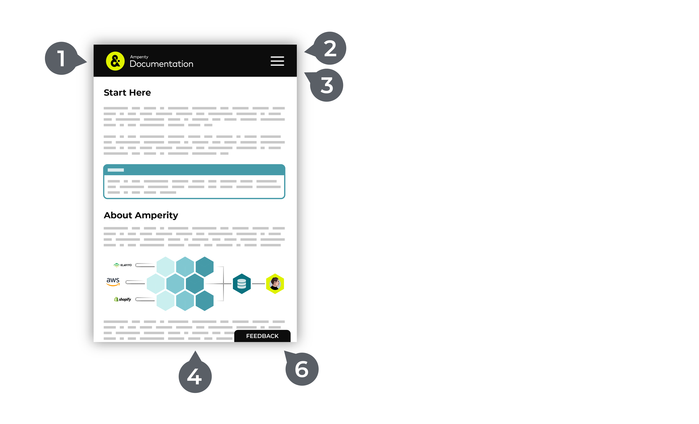
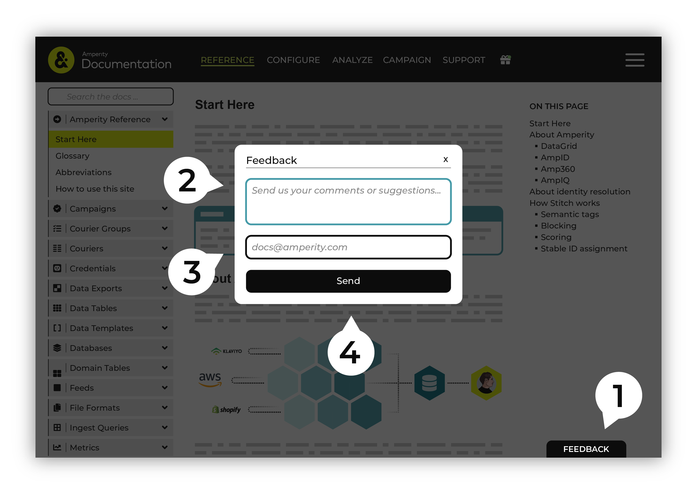

.. 
.. https://docs.amperity.com/reference/
.. 

.. meta::
    :description lang=en:
        Learn how to use Amperity and get the most out of your customer data.

.. meta::
    :content class=swiftype name=body data-type=text:
        Learn how to use Amperity and get the most out of your customer data.

.. meta::
    :content class=swiftype name=title data-type=string:
        How to use this site

==================================================
How to use this site
==================================================

.. docs-about-start

This topic is about the Amperity documentation site and describes the topic collections that are here and the features that help you find what you are looking for.

.. docs-about-end

.. docs-about-areas-start

The numbers in the following images refer to specific areas within the documentation that enable:

#. :ref:`Site navigation <docs-site-navigation>`
#. :ref:`Cross-site search <docs-cross-site-search>`
#. :ref:`Left-side navigation <docs-left-side-navigation>`
#. :ref:`Topic pane <docs-topic-pane>`
#. :ref:`Right-side navigation <docs-right-side-navigation>`
#. :ref:`Feedback <docs-feedback>`

.. docs-about-areas-end

.. image:: ../../images/docs.png
   :width: 600 px
   :alt: How to use the Amperity documentation site.
   :align: left
   :class: no-scaled-link

.. docs-site-navigation-responsive-start

On a tablet or mobile device, site navigation, search, and left-side navigation moves to the |bars| menu in the top-right corner. (The right-side navigation is not available when viewing the documentation from a tablet or mobile device.) Click the |bars| menu to search, browse the left-side navigation, and switch between the **User Guides**, **Operators Guide**, **API**, and **Amperity A-Z** topic collections.

.. docs-site-navigation-responsive-end

.. _docs-site-navigation:

Site navigation
==================================================

.. docs-site-navigation-start

The site navigation runs across the top of the site and links together five topic collections. From left to right:

#. Click the Amperity Documentation logo to return to a collection of overview topics.
#. Click **User Guides** for information about AmpAI, building segments that define high value audiences, and then sending those audiences to various marketing channels to support any type of marketing campaign.
#. Click **Operators Guide** for information about configuring Amperity for your tenant.
#. Click **API** for information about Amperity API endpoints. (You can learn more about the Profile API and Streaming Ingest API from the Operators Guide.)
#. Click **Amperity A-Z** to open a topic collection that describes every aspect of Amperity.
#. Click the |gift| icon for information about the latest features and improvements to Amperity.

.. docs-site-navigation-end

.. _docs-cross-site-search:

Cross-site search
==================================================

.. docs-cross-site-search-start

Cross-site search enables a single interface that returns results for all topics in all topic collections.

Synonyms are applied to search results to associate commonly used search terms to the right topics. For example: "SFMC" is a synonym for "Salesforce Marketing Cloud" and a search for either will return the same result.

A naming pattern is used to help you recognize reference content and user-focused content within the search results:

* Topics in the **Amperity A-Z** collection start with "About", such as "About Couriers" or "About Semantic Tags".
* Topics in the **User Guides** and **Operators Guide** topic collections start with *verbs*, such as "Manage Databases", "Send Query Results", and "Build Campaigns".

.. docs-cross-site-search-end

.. docs-cross-site-search-responsive-start

On a tablet or mobile device, search is available from the |bars| menu in the top-right corner. Click that menu to open the navigation, and then the search box is located at the top of that menu.

.. docs-cross-site-search-responsive-end

.. _docs-left-side-navigation:

Left-side navigation
==================================================

.. docs-left-side-navigation-start

The left-side navigation represents all of the topics within a topic collection and is organized in a way that keeps similar topics close together, either by component or by workflow.

* **User Guides** describe marketer activities, such as building audiences (using segments and segment insights), and then configuring those audiences to be part of campaigns that support a variety of marketing channels, use cases, and outcomes and analytics, along with analytics activities like building queries, and then sending the results to downstream workflows and BI tools.
* **Operators Guide** describes how to configure Amperity to support your brand's use cases.
* **Amperity A-Z** is organized alphabetically.

.. docs-left-side-navigation-end

.. docs-left-side-navigation-responsive-start

On a tablet or mobile device, the left-side navigation is available from the |bars| menu in the top-right corner. Click that menu to open the navigation, and then browse through the sections.

.. docs-left-side-navigation-responsive-end

.. _docs-topic-pane:

Topic pane
==================================================

.. docs-topic-pane-start

The topic pane contains all of the content. The right-side navigation shows the structure of the topic. For example, a topic titled "About Couriers" contains all of the information about couriers and a topic titled "Send to Klaviyo" contains all of the information about sending query results to Klaviyo from Amperity.

Some topics are very long, like the Presto SQL and Spark SQL reference topics. All topics are complete based on the title of the topic. Use your browser's finder window to search within large topics for keywords as necessary.

.. docs-topic-pane-end

.. _docs-right-side-navigation:

Right-side navigation
==================================================

.. docs-right-side-navigation-start

The right-side navigation represents the sections within the current topic and is generated automatically based on the headers within the topic. For many topics only the title is represented within the left-side navigation.

.. docs-right-side-navigation-end

.. docs-right-side-navigation-responsive-start

On a tablet or mobile device, the right-side navigation is not available, though any anchor links will work correctly and will bring you to the right spot on the page.

.. docs-right-side-navigation-responsive-end

.. _docs-feedback:

Feedback
==================================================

.. docs-feedback-start

A feedback button is available in the lower right. Please use this button to send us feedback about Amperity documentation.

It's easy to send documentation feedback:

#. Click the feedback button.
#. Type your feedback.
#. A valid email address is required. Provide your email address or use ``docs@amperity.com`` to send your feedback anonymously. We will review your feedback and quickly address all feedback.

   .. important:: If you have a genuine support issue, please click the **Get Support** link in the site navigation (at the top), and then follow the directions listed there, or contact your Amperity representative directly.
#. Send your feedback. Thank you!

.. docs-feedback-end

.. docs-feedback-responsive-start

On a tablet or mobile device, the feedback button remains in the lower right of the window.

.. docs-feedback-responsive-end
