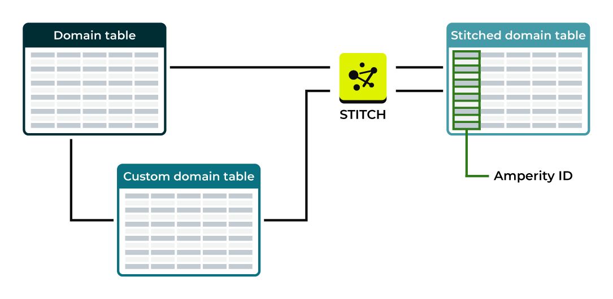

.. https://docs.amperity.com/reference/

.. meta::
    :description lang=en:
        Source domain tables are created when your brand pulls data to Amperity. Custom domain tables may be built from source data tables to support any use case.

.. meta::
    :content class=swiftype name=body data-type=text:
        Source domain tables are created when your brand pulls data to Amperity. Custom domain tables may be built from source data tables to support any use case.

.. meta::
    :content class=swiftype name=title data-type=string:
        About domain tables

==================================================
About domain tables
==================================================

.. include:: ../../shared/terms.rst
   :start-after: .. term-domain-table-start
   :end-before: .. term-domain-table-end

.. domain-tables-about-start

The **Domain Tables** section of the **Sources** page lists the domain tables that have been generated by feeds. Each row shows the name of the domain table, the type of record contained within that domain table (customer or interaction), and the number of columns.

.. domain-tables-about-end

.. _domain-tables-column-types:

Column types
==================================================

.. domain-domain-tables-column-types-start

.. list-table::
   :widths: 100 400
   :header-rows: 1

   * - Type
     - Description
   * - **Boolean**
     - A value that represents an either/or, such as true or false, yes or no, 0 or 1, true or NULL.

   * - **date**
     - An ISO-8601 compliant date values, such as a birthdate. For example:

       * 2021-11-04

   * - **datetime**
     - An ISO-8601 compliant date and time values, such as a purchase or transaction, the time at which data was last updated, or a campaign launch date. For example:

       * Mon Nov 30 2020 16:00:00 GMT-0800 (Pacific Standard Time)
       * Sat Sep 02 2017 14:36:19 GMT-0700 (Pacific Daylight Time)

       .. important:: Some fields that store datetime values are set to the string data type.

   * - **decimal**
     - A fixed point number, such as for prices or message sizes. (The number of characters in the decimal value is configurable during feed setup.). For example:

       * 1.50 (prices)
       * 1874.380 (message sizes)
       * 141.48 (order subtotals)

   * - **float**
     - A floating point number. (Use decimal for prices.) For example:

       * 3.14
       * 3.14159

   * - **integer**
     - A numeric value, such as the quantity of items purchased. (Use decimal for prices.) For example:

       * 1
       * 12345

   * - **string**
     - A sequence of characters, such as first and last names, email addresses, physical addresses, UUIDs and other IDs, phone numbers, zip codes, product names, and descriptions. May be empty. For example:

       * John
       * Smith
       * John Smith
       * johnsmith @ domain.com
       * 123 Main Street
       * 206-555-1111
       * 00002ac0-0915-3cb4-b7c7-5ee192b3bd49
       * ACME
       * pants
       * 
       * "A data source that pulls from an Amazon S3 bucket."

.. domain-domain-tables-column-types-start

.. _domain-tables-record-types:

Record types
==================================================

.. domain-domain-tables-record-types-start

The following types of data are often present in domain table data:

* :ref:`Customer records <domain-tables-record-type-customer>`
* :ref:`Interaction records <domain-tables-record-type-interaction>`

.. note:: An individual table *may* contain both customer and interaction records. As part of the Stitch process, customer records and interaction records are split into dedicated tables for use within the customer 360 database.

.. domain-domain-tables-record-types-end

.. _domain-tables-record-type-customer:

Customer records
--------------------------------------------------

.. include:: ../../shared/terms.rst
   :start-after: .. term-customer-record-start
   :end-before: .. term-customer-record-end

.. domain-domain-tables-record-type-customer-start

Customer records are defined by the presence of data that can be assigned semantic tags for :ref:`customer profile data <semantics-profile>`, specifically to fields that contain personally identifiable information (PII).

.. domain-domain-tables-record-type-customer-end

.. _domain-tables-record-type-interaction:

Interaction records
--------------------------------------------------

.. include:: ../../shared/terms.rst
   :start-after: .. term-interaction-record-start
   :end-before: .. term-interaction-record-end

.. domain-domain-tables-record-type-interaction-start

Interaction records are defined by the presence of data that can be assigned semantic tags for :ref:`transactions <semantics-itemized-transactions>`, product catalogs, and other behavior data, such as :ref:`custom semantic tags for loyalty programs <semantics-custom>`.

Interaction records often :ref:`require data to be reshaped using domain SQL and custom domain tables <domain-tables-custom>` to ensure that the right combination of fields are present in the data to support components and workflows within Amperity, including functionality that is available from the **Segment Brief** (a component within the **Segments** page), predicted customer lifetime value models, and the **Campaigns** page.

.. domain-domain-tables-record-type-interaction-end

.. _domain-tables-custom:

Custom domain tables
==================================================

.. domain-tables-custom-intro-start

Some customer data sources are only available in a state that requires the use of SQL to construct a complete record that can be made available to the Stitch process. This is often true with interaction records, which typically require some data shaping to map the data that is available in the data source to the semantic tags that are required by Amperity for transactions.

.. domain-tables-custom-intro-end

.. domain-tables-custom-links-start

These semantic tags generate the :ref:`Unified Itemized Transactions <data-tables-unified-itemized-transactions>` table, which is then used as the underlying reference for the :ref:`Unified Transactions <data-tables-unified-transactions>`, :ref:`Transaction Attributes <data-tables-transaction-attributes>`, and :ref:`Transaction Attributes Extended <data-tables-transaction-attributes-extended>` tables.

.. domain-tables-custom-links-end

.. domain-tables-custom-may-reference-start

A custom domain table is built directly using Spark SQL to define a schema for that data source, after which semantic tags are applied and the primary key is identified. A custom domain table may reference other custom domain tables.

.. domain-tables-custom-may-reference-end

.. domain-tables-custom-note-start

.. note:: When a database is run, any custom domain table that has changed is run first, and then Stitch runs. If there are no changes to custom domain tables *or* if custom domain tables have changed that are *not* configured for Stitch, Stitch will not run.

.. domain-tables-custom-note-end

.. _domain-tables-custom-domain-sql:

Domain SQL
--------------------------------------------------

.. include:: ../../shared/terms.rst
   :start-after: .. term-domain-sql-start
   :end-before: .. term-domain-sql-end

.. _domain-tables-custom-sql-use-cases:

Use cases
--------------------------------------------------

.. domain-tables-custom-sql-use-cases-start

The following examples describe some of the more common uses cases for domain SQL:

* :ref:`domain-tables-custom-sql-use-case-combine-birthdate`
* :ref:`domain-tables-custom-sql-use-case-combine-postal`
* :ref:`domain-tables-custom-sql-use-case-extract-names`
* :ref:`domain-tables-custom-sql-use-case-fixed-width-fields`
* :ref:`domain-tables-custom-sql-use-case-rehash-data`
* :ref:`domain-tables-custom-sql-use-case-parse-fields-with-multiple-separators`
* :ref:`domain-tables-custom-sql-use-reference-custom-domain-table`
* :ref:`domain-tables-custom-sql-use-case-semantic-tags-and-bridge-tables`
* :ref:`domain-tables-custom-sql-use-case-set-email-to-null`
* :ref:`domain-tables-custom-sql-use-case-standardize-values-for-usa-states`

.. note:: These examples are not meant to be copied and pasted, but they should work for most tenants as a good starting point.

.. domain-tables-custom-sql-use-cases-end

.. _domain-tables-custom-sql-use-case-combine-birthdate:

Combine day, month, year as birthdate
++++++++++++++++++++++++++++++++++++++++++++++++++

.. domain-tables-custom-sql-use-case-combine-birthdate-start

Some data sources do not contain fields for complete birthdates and instead contain values by day, month, and year in separate fields. These individual fields must be combined in order to use the **birthdate** semantic tag.

The following example shows an ``IF`` statement within a ``SELECT`` statement that finds the values in day, month, and year fields, and then combines them into a field that captures the birthdate value as ``DD/MM/YYYY``:

.. code-block:: sql
   :linenos:

   SELECT
     *
     ,IF(birth_day != '0' AND birth_month != '0' AND birth_year != '0',
         birth_month||'/'||birth_day||'/'||birth_year, NULL) AS birthdate
   FROM table

.. domain-tables-custom-sql-use-case-combine-birthdate-end

.. _domain-tables-custom-sql-use-case-combine-postal:

Combine five and four digit postal codes
++++++++++++++++++++++++++++++++++++++++++++++++++

.. include:: ../../amperity_reference/source/sql_spark.rst
   :start-after: .. sql-spark-function-concat-ws-example-combine-postal-codes-start
   :end-before: .. sql-spark-function-concat-ws-example-combine-postal-codes-end

.. _domain-tables-custom-sql-use-case-extract-names:

Extract first and last names
++++++++++++++++++++++++++++++++++++++++++++++++++

.. include:: ../../amperity_reference/source/sql_spark.rst
   :start-after: .. sql-spark-function-regexp-extract-example-names-start
   :end-before: .. sql-spark-function-regexp-extract-example-names-end

.. _domain-tables-custom-sql-use-case-fixed-width-fields:

Fixed-width fields
++++++++++++++++++++++++++++++++++++++++++++++++++

.. domain-tables-custom-sql-use-case-fixed-width-fields-start

Some data sources contain fixed-width fields. Use a combination of the **TRIM()** and **SUBSTR()** functions within a custom domain table to define the length of each field in the file. 

For example:

.. code-block:: sql
   :linenos:

   SELECT
     TRIM(SUBSTR(col_1, 2, 35)) AS NAME_LINE1,
     TRIM(SUBSTR(col_1, 416, 20)) AS FIRST_NAME,
     TRIM(SUBSTR(col_1, 436, 15)) AS MID_NAME,
     TRIM(SUBSTR(col_1, 451, 20)) AS LAST_NAME,
     TRIM(SUBSTR(col_1, 37, 35)) AS ADDR_LINE1,
     TRIM(SUBSTR(col_1, 109, 35)) AS ADDR_LINE2,
     TRIM(SUBSTR(col_1, 72, 30)) AS CITY,
     TRIM(SUBSTR(col_1, 102, 2)) AS STATE,
     TRIM(SUBSTR(col_1, 104, 5)) AS ZIP,
     TRIM(SUBSTR(col_1, 280, 10)) AS PHONE,
     TRIM(SUBSTR(col_1, 621, 60)) AS EMAIL_ADDRESS,
     TRIM(SUBSTR(col_1, 1, 1)) AS GENDER
   FROM custom-domain-table-name

.. domain-tables-custom-sql-use-case-fixed-width-fields-end

.. _domain-tables-custom-sql-use-case-rehash-data:

Hash PII data that has been resent to Amperity
++++++++++++++++++++++++++++++++++++++++++++++++++

.. include:: ../../amperity_reference/source/sql_spark.rst
   :start-after: .. sql-spark-function-sha2-example-rehash-data-start
   :end-before: .. sql-spark-function-sha2-example-rehash-data-end

.. _domain-tables-custom-sql-use-case-parse-fields-with-multiple-separators:

Parse fields with multiple separators
++++++++++++++++++++++++++++++++++++++++++++++++++

.. include:: ../../amperity_reference/source/sql_spark.rst
   :start-after: .. sql-spark-function-split-example-parse-fields-with-multiple-separators-start
   :end-before: .. sql-spark-function-split-example-parse-fields-with-multiple-separators-end

.. _domain-tables-custom-sql-use-reference-custom-domain-table:

Reference custom domain tables
++++++++++++++++++++++++++++++++++++++++++++++++++

.. domain-tables-custom-sql-use-reference-custom-domain-table-start

A custom domain table may reference another custom domain table. For example:

.. code-block:: sql
   :linenos:

   SELECT
     order_id
     ,two.order_id
   FROM custom_domain_table1 one
   LEFT JOIN custom_domain_table2 two ON one.order_id = two.order_id

.. domain-tables-custom-sql-use-reference-custom-domain-table-end

.. _domain-tables-custom-sql-use-case-semantic-tags-and-bridge-tables:

Semantic tags and bridge tables
++++++++++++++++++++++++++++++++++++++++++++++++++

.. domain-tables-custom-sql-use-case-apply-semantic-tags-to-bridge-syncs-start

You must use a custom domain table to apply semantic tags to data sources that are made available to Amperity using an Amperity Bridge sync. The most common use cases for applying semantic tags are the same as data sources that are made available without using Amperity Bridge sync. These use cases include `customer profiles <https://docs.amperity.com/reference/semantics.html#profile-pii>`__ and `transactions <https://docs.amperity.com/reference/semantics.html#transactions>`__, and then apply `customer keys <https://docs.amperity.com/reference/semantics.html#customer-keys-ck>`__ and `foreign keys <https://docs.amperity.com/reference/semantics.html#foreign-keys-fk>`__. Any `semantic tag <https://docs.amperity.com/reference/semantics.html>`__ may be used with tables that are made available using Amperity Bridge.

.. domain-tables-custom-sql-use-case-apply-semantic-tags-to-bridge-syncs-end

.. _domain-tables-custom-sql-use-case-set-email-to-null:

Set non-US-ASCII email addresses to NULL
++++++++++++++++++++++++++++++++++++++++++++++++++

.. include:: ../../amperity_reference/source/sql_spark.rst
   :start-after: .. sql-spark-function-decode-example-identify-non-us-ascii-email-start
   :end-before: .. sql-spark-function-decode-example-identify-non-us-ascii-email-end

.. _domain-tables-custom-sql-use-case-standardize-values-for-usa-states:

Standardize values for USA states
++++++++++++++++++++++++++++++++++++++++++++++++++

.. include:: ../../amperity_reference/source/sql_spark.rst
   :start-after: .. sql-spark-function-coalesce-example-standardize-values-for-usa-states-start
   :end-before: .. sql-spark-function-coalesce-example-standardize-values-for-usa-states-end

.. _domain-tables-update-blocklists:

Update blocklists
--------------------------------------------------

.. include:: ../../amperity_operator/source/blocklist_bad_values.rst
   :start-after: .. bad-values-blocklist-advanced-custom-domain-tables-start
   :end-before: .. bad-values-blocklist-advanced-custom-domain-tables-end

.. _domain-tables-columns-added:

Added columns
==================================================

.. domain-tables-columns-added-start

Amperity adds the following columns to all domain tables. The added columns start with underscores (``_``) and are used by Amperity during Stitch processing.

#. The **_pk** column is an identifier that is generated based on the all of the columns in the feed that were associated to the primary key.
#. The **_uuid_pk** column contains a system-generated UUID. This UUID helps Amperity distribute workers during Stitch processing.
#. The **_updated** column contains details about the last update. It is a system-generated 64-bit integer that combines a timestamp with file/line information.

   Amperity uses the value in the **_updated** column to ensure that the newest record is preferred over older records when both records have the same primary key. This preference is maintained between loads, between records in the same file, and between files and days in the same load.

These columns will be available in the customer 360 database when a domain table is configured as a passthrough table.

.. domain-tables-columns-added-end

.. _domain-tables-stitched:

Stitched domain tables
==================================================

.. domain-tables-stitched-start

All domain tables to which semantic tags are added or to which a foreign key is added that can be used to associate records in a domain table to an Amperity ID are processed by Stitch. This is in addition to all domain tables to which customer profile semantic tags were applied, and then were :ref:`made available to Stitch <feeds-make-available-to-stitch>`.

.. domain-tables-stitched-end

.. include:: ../../shared/terms.rst
   :start-after: .. term-domain-table-stitched-start
   :end-before: .. term-domain-table-stitched-end

.. domain-tables-stitched-context-start

Stitched versions of domain tables have an added column for the Amperity ID and replace the source domain table within Amperity for all downstream use cases, but are otherwise identical to the source domain table.

.. domain-tables-stitched-context-end

.. _domain-tables-howtos:

How-tos
==================================================

.. domain-tables-howtos-start

Tasks related to managing domain tables in Amperity:

* :ref:`domain-tables-add`
* :ref:`domain-tables-add-custom`
* :ref:`domain-tables-add-linkage`
* :ref:`domain-tables-delete`
* :ref:`domain-tables-delete-records`
* :ref:`domain-tables-edit`
* :ref:`domain-tables-explore`
* :ref:`domain-tables-explore-sample-data`
* :ref:`domain-tables-explore-schema`
* :ref:`domain-tables-find-primary-key`
* :ref:`domain-tables-purge`
* :ref:`domain-tables-rename`
* :ref:`domain-tables-search`
* :ref:`domain-tables-view`
* :ref:`domain-tables-history`

.. domain-tables-howtos-end

.. _domain-tables-add:

Add domain table
--------------------------------------------------

.. domain-tables-add-start

A domain table is created by a feed. The domain table name is a combination of the <source-name>:<feed-name>.

.. domain-tables-add-end

.. _domain-tables-add-custom:

Add custom domain table
--------------------------------------------------

.. domain-tables-custom-add-start

A custom domain table is table that is created from a Spark SQL query built from one or more source domain tables to build a table with reshaped data. The custom domain table is made available to downstream processes, such as Stitch or the customer 360 database, in the same manner as source domain tables.

Feeds load data and apply a standard schema to customer data. Use a custom domain table to load this data in its raw form, and then reshape it to support any downstream workflow. For example:

* Enabling privacy rights workflows to help remove data based on individual requests from customers, as required by CCPA and GDPR.
* Applying semantic tags to data that contains :ref:`transactions <semantics-itemized-transactions>` details, including extending the schema and adding new fields.
* Supporting workflows that |data_first_party_raw_clickstream|.

.. domain-tables-custom-add-end

**To add a custom domain table**

.. domain-tables-custom-add-steps-start

#. From the **Sources** page, under **Custom Domain Tables**, click **Add Table**. The **Create Custom Table** dialog box opens.
#. Add the name of the custom domain table, and then click **Save**. The **Custom Domain Table** page opens.

   .. important:: All custom domain table names must be unique within the same tenant.

   .. note:: The specific purpose of any custom domain table varies by tenant and by use case. That said, a very common use case for custom domain tables is to reshape data that has already been loaded by a feed into the structure required by Amperity for tagging data sources that contain interaction records with transaction and itemized transaction semantics.

#. Add SQL :doc:`using Spark SQL <sql_spark>` to define the custom domain table. This is typically in the form of a ``SELECT`` statement that returns fields from a feed, but may be more complex if necessary.

   .. tip:: Do any required data shaping to support interaction records, in particular for transactions and itemized transactions. Refer to the :doc:`semantics reference <semantics>` for all requirements for all semantic tags. Refer to the :doc:`data_tables reference <data_tables>` for what types of fields you should expect to be available.
#. Click **Validate** to verify that the SQL query runs correctly.
#. On the **Configure and save** page, update for interaction records.

   Apply :ref:`semantics-itemized-transactions` to any column in the data schema that can be matched with transactions semantics.

   .. note:: Other semantic tags may be applied, including for customer records and product catalogs. Tables that contain *only* transactions, itemized transactions, or product catalog semantic tags are not made available to Stitch.

#. Click **Activate**.

.. domain-tables-custom-add-steps-end

.. _domain-tables-add-custom-example-unified-transactions:

Example: Unified transactions
++++++++++++++++++++++++++++++++++++++++++++++++++

.. domain-tables-add-custom-example-unified-transactions-start

.. code-block:: sql
   :linenos:

   WITH uit_rollup AS (
     SELECT
       order_id
       ,MIN(order_datetime) AS order_datetime
       ,SUM(IF(is_return IS NULL AND is_cancellation IS NULL COALESCE(item_quantity, 1), 0)) AS order_quantity
       ,SUM(IF(is_return IS NULL AND is_cancellation IS NULL, item_revenue, 0)) AS sum_item_revenue
       ,SUM(IF(is_return = TRUE, COALESCE(item_quantity, -1), 0)) AS order_returned_quantity
       ,SUM(IF(is_return = TRUE, item_revenue, 0)) AS order_returned_revenue
       ,SUM(IF(is_cancellation = TRUE, COALESCE(item_quantity, -1), 0)) AS order_canceled_quantity
       ,SUM(IF(is_cancellation = TRUE, item_revenue, 0)) AS order_canceled_revenue
     FROM Unified_Itemized_Transactions
     GROUP BY 1
   )

   SELECT
     ut.amperity_id
     ,fk_onlinecustid AS customer_id
     ,ut.order_id
     ,ut.datasource
     ,ut.store_id
     ,ut.digital_channel
     ,ut.purchase_channel
     ,ut.purchase_brand
     ,uitr.order_datetime
     -- If order_revenue is not provided, replace with this:
     -- ,uitr.sum_item_revenue - ut.{order_discount_amount_field} AS order_revenue
     -- or this:
     -- ,uitr.sum_item_revenue AS order_revenue
     ,ut.order_revenue
     ,uitr.order_quantity
     ,uitr.order_returned_quantity
     ,uitr.order_canceled_quantity
     ,uitr.order_returned_revenue
     ,uitr.order_canceled_revenue
     -- Add in custom semantics as necessary. For example:
     --,ut.currency
     --,ut.order_shipping_amount
   FROM uit_rollup uitr
   JOIN Unified_Transactions ut
   ON uitr.order_id = ut.order_id

.. domain-tables-add-custom-example-unified-transactions-end

.. _domain-tables-add-custom-example-loyalty:

Example: Loyalty programs
++++++++++++++++++++++++++++++++++++++++++++++++++

.. domain-tables-add-custom-example-loyalty-cte-start

.. code-block:: sql
   :linenos:

   WITH Loyalty_cte AS (
     SELECT
       amperity_id
       ,row_number() OVER w AS row_number
       ,first(lm_id) OVER w AS Loyalty_Member_id
       ,first(lmProgramName) OVER w AS Loyalty_Program_Name
       ,first(current_tier) OVER w AS Loyalty_Tier
       ,SUM(points) OVER w AS Loyalty_Points
       ,MIN(created) OVER w AS Loyalty_Program_Join_Date
     FROM Loyalty_Members
     WINDOW w AS (PARTITION BY amperity_id ORDER BY created DESC)
   )
   SELECT
     amperity_id
     ,Loyalty_Member_id
     ,Loyalty_Program_Name
     ,Loyalty_Tier
     ,Loyalty_Points
     ,Loyalty_Program_Join_Date
   FROM Loyalty_cte
   WHERE row_number = 1

.. domain-tables-add-custom-example-loyalty-cte-end

-- and --

.. domain-tables-add-custom-example-loyalty-last-updated-start

.. code-block:: sql
   :linenos:

   WITH info_from_last_update AS (
     SELECT 
       amperity_id
       ,sort_array(collect_list(struct(
         created
         ,lm_id
         ,lmProgramName
         ,current_tier
         ,name_first
         ,name_last
         ,email
         ,gender
         ,address1
         ,city
         ,state
         ,postal_code
         ,birthdate
       )), false)[0] AS rep_row
     FROM Loyalty_Members
     WHERE amperity_id IS NOT NULL
     AND created IS NOT NULL
     GROUP BY amperity_id
   ),

   other_info AS (
     SELECT 
       amperity_id
       ,SUM(points) AS Loyalty_Points
       ,MIN(created) AS Loyalty_Program_Join_Date
     FROM Loyalty_Members
     WHERE amperity_id IS NOT NULL
     GROUP BY amperity_id
   )

   SELECT 
     t1.amperity_id
     ,t1.rep_row.lm_id AS Loyalty_Member_id
     ,t1.rep_row.lmProgramName AS Loyalty_Program_Name
     ,t1.rep_row.current_tier AS Loyalty_Tier
     ,t2.Loyalty_Points
     ,t2.Loyalty_Program_Join_Date
   FROM info_from_last_update AS t1
   LEFT JOIN other_info AS t2 ON t1.amperity_id = t2.amperity_id

.. domain-tables-add-custom-example-loyalty-last-updated-end

.. _domain-tables-add-linkage:

Add linkage table
--------------------------------------------------

.. domain-tables-add-linkage-steps-start

**To add a linkage table**

#. Open the **Sources** page.
#. Under **Custom domain tables** click **Add table**.
#. Write SQL to specify which CDT records link to which source records. This will be four columns specifying the source table name, source table pk, cdt table name, and cdt pk.
#. Click **Next**.
#. Tag the source table name with `compliance/source-ds`, source table pk with `compliance/source-pk`, cdt table name with `compliance/cdt-ds`, and cdt pk with `compliance/cdt-pk`.
#. Click **Activate**.

.. domain-tables-add-linkage-steps-end

.. _domain-tables-delete:

Delete domain table
--------------------------------------------------

.. domain-tables-delete-start

Use the **Delete** option to remove a domain table from Amperity. Verify that both upstream and downstream processes no longer depend on this domain table prior to deleting it. This action will *not* delete the feeds associated with the domain table.

.. domain-tables-delete-end

**To delete a domain table**

.. domain-tables-delete-steps-start

#. From the **Sources** page, open the menu for a domain table, and then select **Delete**. The **Delete Domain Table** dialog box opens.
#. Click **Delete**.

.. domain-tables-delete-steps-end

.. _domain-tables-delete-records:

Delete records
--------------------------------------------------

.. domain-tables-delete-records-start

Users who are assigned the :ref:`Allow source data deletion <policies-allow-source-data-deletion>` policy option can delete records from a domain table.

Use one of the following options to find the records to be deleted:

#. :ref:`Older than a date <domain-tables-delete-records-older>`
#. :ref:`Within a timeframe <domain-tables-delete-records-within>`
#. :ref:`With a matching value <domain-tables-delete-records-value>`

Records that match will be deleted from the domain table.

.. domain-tables-delete-records-end

.. _domain-tables-delete-records-older:

Older than a date
++++++++++++++++++++++++++++++++++++++++++++++++++

.. domain-tables-delete-records-older-start

You can delete all records in a domain table that are older than a date.

.. .domain-tables-delete-records-older-end

**To delete records older than a date**

.. domain-tables-delete-records-older-steps-start

#. From the **Sources** page, open the menu for a domain table, and then select **Delete records**. The **Delete records** dialog box opens.
#. Under **Record criteria**, select "Older than a set date".

   Select a field in the domain table with a datetime data type, and then select a date. You may use relative dates.

#. Click **Preview deletion**, and then review the list of records that are returned.
#. Click **Delete records**. In the **Remove records** dialog box, confirm that you want to delete the list of records by clicking **Remove records**.

.. domain-tables-delete-records-older-steps-end

.. _domain-tables-delete-records-within:

Within a timeframe
++++++++++++++++++++++++++++++++++++++++++++++++++

.. domain-tables-delete-records-within-start

You can delete all records in a domain table that exist between two dates.

.. domain-tables-delete-records-within-end

**To delete records using a timeframe**

.. domain-tables-delete-records-within-steps-start

#. From the **Sources** page, open the menu for a domain table, and then select **Delete records**. The **Delete records** dialog box opens.
#. Under **Record criteria**, select "Within a set timeframe".

   Select a field in the domain table with a datetime data type, and then select the start and end dates for the timeframe. You may use relative dates.

   .. note:: End dates are exclusive.

#. Click **Preview deletion**, and then review the list of records that are returned.
#. Click **Delete records**. In the **Remove records** dialog box, confirm that you want to delete the list of records by clicking **Remove records**.

.. domain-tables-delete-records-within-steps-end

.. _domain-tables-delete-records-value:

With a matching value
++++++++++++++++++++++++++++++++++++++++++++++++++

.. domain-tables-delete-records-value-start

You can delete records in a domain table that meet specific conditions. For example, records that match the domain in an email address ``"email is like ``amperity.com``"`` or records that match a specific email address ``"email is "john@amperity.com"``.

.. domain-tables-delete-records-value-end

**To delete records with a set value**

.. domain-tables-delete-records-value-steps-start

#. From the **Sources** page, open the menu for a domain table, and then select **Delete records**. The **Delete records** dialog box opens.
#. Under **Record criteria**, select "With a set value".

   Select a field in the domain table, choose a condition, and then specify a value.

#. Click **Preview deletion**, and then review the list of records that are returned.
#. Click **Delete records**. In the **Remove records** dialog box, confirm that you want to delete the list of records by clicking **Remove records**.

.. domain-tables-delete-records-value-steps-end

.. _domain-tables-edit:

Edit domain table
--------------------------------------------------

.. domain-tables-edit-start

A domain table cannot be edited directly. The data within the domain table is updated based on feed and courier settings. The name of the domain table is directly associated with the feed and its schema. Changes made to a feed updates the data in the domain table automatically.

.. domain-tables-edit-end

.. _domain-tables-explore:

Explore domain table
--------------------------------------------------

.. include:: ../../shared/terms.rst
   :start-after: .. term-data-explorer-start
   :end-before: .. term-data-explorer-end

.. domain-tables-explore-start

Click the name of the domain table to open the data explorer. The data explorer opens to provide a view of the schema for a domain table, the data that is in the table, and example rows of data.

.. domain-tables-explore-end

**To explore a domain table**

.. domain-tables-explore-steps-start

#. From the **Sources** page, under **Domain Tables**, click the name of a domain table. The **Data Explorer page** opens.
#. Browse the columns and rows. Click **Schema** to view the schema and **Samples** to view sample data.
#. Click **Close** when finished.

.. domain-tables-explore-steps-end

.. _domain-tables-explore-sample-data:

View sample data
++++++++++++++++++++++++++++++++++++++++++++++++++

.. domain-tables-explore-sample-data-start

Sample data is a representation of about 100 rows of data appear in the domain table. 

.. domain-tables-explore-sample-data-end

**To view sample data in a domain table**

.. domain-tables-explore-sample-data-steps-start

#. From the **Sources** page, under **Domain Tables**, click the name of a domain table. The **Data Explorer page** opens.
#. Click **Samples** to view sample data.
#. Click **Close** when finished.

.. domain-tables-explore-sample-data-steps-end

.. _domain-tables-explore-schema:

View schema
++++++++++++++++++++++++++++++++++++++++++++++++++

.. domain-tables-explore-schema-start

The schema shows how data in the domain table maps to the semantic tagging applied by the feed.

.. domain-tables-explore-schema-end

**To view the schema for a domain table**

.. domain-tables-explore-schema-steps-start

#. From the **Sources** page, under **Domain Tables**, click the name of a domain table. The **Data Explorer page** opens.
#. Click **Schema** to view the schema.
#. Click **Close** when finished.

.. domain-tables-explore-schema-steps-end

.. domain-tables-records-mismatch-tip-start

.. tip:: The number of records in a domain table may not match the number of records loaded by Amperity after loading data. Amperity uses an UPSERT process when loading data and determines priority based on the **Last Updated Field**. If a large difference exists take a close look at the primary key and determine if the primary key is the cause.

.. domain-tables-records-mismatch-tip-end

.. _domain-tables-find-primary-key:

Find primary key
--------------------------------------------------

.. domain-tables-find-primary-key-start

A custom domain table must have a primary key. The field to which the PK semantic tag is applied must have a unique value for every record in the table. 

.. warning:: Duplicate primary key values will cause database failures. A primary key must be stable over time and should never be transformed or overwritten by updates to source tables.

.. domain-tables-find-primary-key-end

**To find primary key**

.. domain-tables-find-primary-key-steps-start

#. Open a custom domain table in edit mode.
#. Click the **Start session** link to start a Spark SQL session. This may take a few minutes.

#. After the Spark SQL session is started, click the **Find primary key** link. This opens the **Explore primary keys** dialog box.

#. From the **Primary key field** dropdown, select one or more fields, and then click the **Validate** button.

   Amperity will evaluate the selected fields and then report on the uniqueness of values in the selected fields. Only fields with unique values should be used as a primary key. For example:

   .. code-block:: none

      Primary key is only < 5.471% unique
      There are duplicate values in the selected field.

   Click the **View duplicates** link to view a list of records with duplicate values.

   When a single field does not contain unique values you must concatenate two or more fields with values that are stable over time into a single field. Use the concatenated field as the primary key. Hash the value for the concatenated primary key when any of input fields contain personally identifiable information (PII), such as an email address or phone number.

.. domain-tables-find-primary-key-steps-end

.. _domain-tables-publish-to-queries:

Publish to Queries page
--------------------------------------------------

.. domain-tables-publish-to-queries-start

Domain tables are automatically published and made available to the **Queries** page in a "database" named **Domain tables** even when these domain tables are not part of your customer 360 database.

Custom domain tables may be made available to the same database. To publish custom domain tables to the **Queries** page, from the **Sources** page, next to **Custom Domain Tables**, click **Publish to queries**.

All custom domain tables will be published. Allow for this process to complete before writing queries against published domain tables.

.. domain-tables-publish-to-queries-end

.. _domain-tables-purge:

Purge domain table
--------------------------------------------------

.. domain-tables-purge-start

When primary keys for a table are updated the data in the existing domain table must be purged, and then reloaded upon feed reactivation.

.. domain-tables-purge-end

.. domain-tables-purge-note-start

.. note:: Purging a domain table removes all data from the existing table, and then stops. The data is reloaded the next time a courier pulls data to Amperity for that feed or after the feed is run manually. Downstream workflows, such as Stitch or database generation, are not run automatically after data is purged from a domain table.

.. domain-tables-purge-note-end

.. domain-tables-purge-context-start

A domain table cannot be purged directly, though it may be deleted. Operations that may cause a purge of domain table data are initiated when a feed is edited. For example, when the primary key is changed. Purging data ensures the Stitch process does not have to deal with both new and old data.

.. domain-tables-purge-context-end

.. _domain-tables-rename:

Rename domain table
--------------------------------------------------

.. domain-tables-rename-start

You cannot rename a domain table directly because of their dependency on feeds. If you need to rename a domain table you must recreate the source and feed pair by adding a new feed, and then deleting the old feed to remove the old domain table from Amperity.

.. domain-tables-rename-end

.. _domain-tables-search:

Search domain tables
--------------------------------------------------

.. domain-tables-search-start

You can search for the presence of fields and semantic tags that are present in domain tables.

.. domain-tables-search-end

**To search domain tables**

.. domain-tables-search-steps-start

#. From the **Sources** page, next to **Domain Tables**, enter the search term.
#. The search results are displayed automatically, grouped by domain table, then by column name, and then by semantic tag.
#. Select a column name to open the data explorer for that domain table.

.. domain-tables-search-steps-end

.. _domain-tables-view:

View domain table
--------------------------------------------------

.. domain-tables-view-start

Domain tables are visible from the **Sources** page under **Domain Tables**.

.. domain-tables-view-end

.. domain-tables-view-note-start

.. note:: An individual table *may* contain both customer and interaction records. As part of the Stitch process, customer records and interaction records are split into dedicated tables for use within the customer 360 database.

.. domain-tables-view-note-end

.. _domain-tables-history:

View domain table history
--------------------------------------------------

.. domain-tables-history-start

Domain table history shows accurate row counts a domain table, along with the ability to view a history of updates that were made to that domain table.

Use domain table histories to:

* Identifying issues that may arise with the data in the table
* View the types of changes that occur over time

.. domain-tables-history-end

**To view domain table history**

.. domain-tables-history-steps-start

#. From the **Sources** page, open the menu for a domain table, and then select **History**. The **Table History** dialog box opens.
#. Select **Filter unchanged transactions** to remove transactions that did not change the data within the domain table.
#. Click **Load more** to load additional rows to the table history.
#. When finished, click **Close**.

.. domain-tables-history-steps-end
