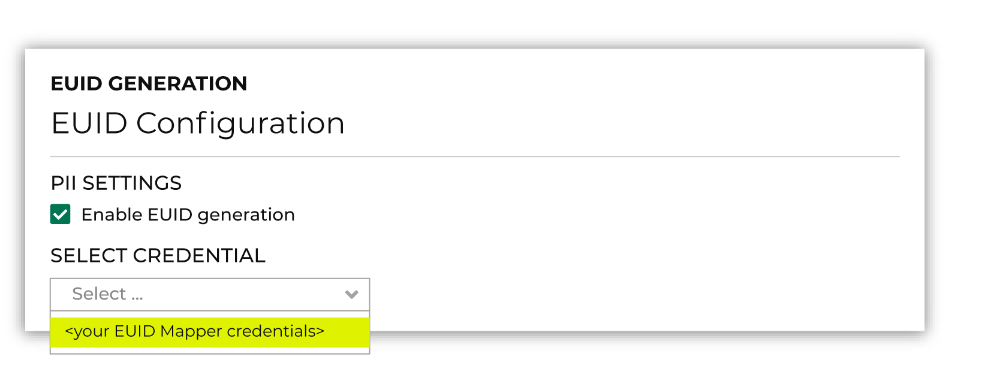

.. https://docs.amperity.com/reference/

.. meta::
    :description lang=en:
        Amperity may be configured to act as a European Unified ID (EUID) Operator for your brand.

.. meta::
    :content class=swiftype name=body data-type=text:
        Amperity may be configured to act as a European Unified ID (EUID) Operator for your brand.

.. meta::
    :content class=swiftype name=title data-type=string:
        European Union ID (EUID)

==================================================
About European Union ID (EUID)
==================================================

.. euid-overview-start

European Union ID (EUID) is an `open-source framework <https://euid.eu/docs/intro>`__ |ext_link| that enables deterministic identity for advertising opportunities across the open internet for participants with access to the advertising ecosystem. EUID is a standalone solution with a unique namespace and privacy controls that help participants meet local market requirements.

.. euid-overview-end

.. _euid-howitworks:

How EUID works
==================================================

.. euid-howitworks-start

Amperity may be `configured to interact with EUID endpoints on your brand's behalf <https://euid.eu/docs/guides/integration-advertiser-dataprovider-endpoints>`__ |ext_link|, including receive and store encryption keys and salts from the EUID Core Service, salt and hash personal data to return raw EUIDs, encrypt raw EUIDs to generate EUID tokens, and distribute EUID token decryption keys.

.. euid-howitworks-end

.. image:: ../../images/euid.png
   :width: 600 px
   :alt: European Union ID workflow with Amperity.
   :align: left
   :class: no-scaled-link

.. euid-howitworks-table-start

The following sections describe at a high level the series of steps that are required to configure Amperity to act as a EUID Operator for your brand.

.. list-table::
   :widths: 10 90
   :header-rows: 0

   * - .. image:: ../../images/steps-01.png
          :width: 60 px
          :alt: Image panel 1.
          :align: center
          :class: no-scaled-link
     - Before you can configure Amperity to act as a EUID Operator for your brand you must do the following:

       #. :ref:`Request access to EUID <euid-prerequisite-get-access>`.
       #. :ref:`Agree to the EUID participation policy <euid-prerequisite-participate>`.
       #. :ref:`Get an API key <euid-prerequisite-get-credentials>` for the **Mapper** participant type. Use the credentials for this API key to allow Amperity to access endpoints in the EUID API and act as a EUID Operator for your brand.

   * - .. image:: ../../images/steps-02.png
          :width: 60 px
          :alt: Image panel 2.
          :align: center
          :class: no-scaled-link
     - After your brand has adopted EUID as part of your identity strategy you can configure Amperity to act as a EUID Operator for your brand.

       #. :ref:`Add your brand's credentials for EUID to Amperity <euid-configure-amperity-add-credentials>`.
       #. :ref:`Enable EUID <euid-configure-amperity-enable-euid>`.
       #. :ref:`Add the EUID table <euid-configure-amperity-add-euid-table>` to your brand's database.

       Use custom database tables, queries, and segments to configure Amperity to support your brand's use cases for EUID.

       .. admonition:: How does Amperity maintain EUID tokens?

          Amperity uses the following EUID endpoints when Amperity is configured to act as a EUID Operator for your brand:

          #. Amperity sends an API request to EUID using the `POST /identity/buckets <https://euid.eu/docs/endpoints/post-identity-buckets>`__ |ext_link| endpoint to identify salt buckets that have expired. All EUID tokens associated with an expired salt bucket are refreshed.

          #. Amperity sends an API request to EUID using the `POST /identity/map <https://euid.eu/docs/endpoints/post-identity-map>`__ |ext_link| endpoint. This request contains a list of email addresses that are pulled from the **Unified Coalesced** table.

             The **POST /identity/map** endpoint responds with three values: a hashed email address, an advertising ID (the EUID token), and a salt bucket ID.

          #. Amperity adds the original email address, normalized email address, advertising ID, and salt bucket ID to the **EUID** table.

   * - .. image:: ../../images/steps-03.png
          :width: 60 px
          :alt: Image panel 3.
          :align: center
          :class: no-scaled-link
     - Build workflows against the **EUID** table to support your brand's :ref:`EUID workflows <euid-workflows>`.

       Use custom database tables, queries, and segments in Amperity to build audiences of EUID tokens that support your brand's advertising strategies. Send these audiences to demand-side platforms (DSPs) that participate in EUID, such as The Trade Desk.

       DSPs can receive EUIDs from advertisers as first- or third-party data. Advertisers buy impressions across a range of publisher sites. DSPs help advertisers decide which ad impressions to purchase and how much to bid on them.

.. euid-howitworks-table-end

.. _euid-prerequisites:

Prerequisites
==================================================

.. euid-prerequisites-start

Before your brand can configure Amperity to generate EUID tokens you must do the following:

#. :ref:`Get access to EUID <euid-prerequisite-get-access>`.
#. Agree to :ref:`a EUID participation policy <euid-prerequisite-participate>`, which is a legal requirement for EUID sharing.
#. :ref:`Get an API key <euid-prerequisite-get-credentials>`. Use the credentials for this API key to allow Amperity to access endpoints in the EUID API and act as a EUID Operator for your brand.

.. euid-prerequisites-end

.. _euid-prerequisite-get-access:

Get access to EUID
--------------------------------------------------

.. euid-prerequisite-get-access-start

To get access to the EUID framework, you may sign up directly from the `European Union ID <https://euid.eu/request-access>`__ |ext_link| website or connect directly with your The Trade Desk representative (or EUID administrator).

.. euid-prerequisite-get-access-end

.. _euid-prerequisite-participate:

Participate in EUID
--------------------------------------------------

.. euid-prerequisite-participate-start

You must agree to a EUID participation policy, which is a `requirement for EUID sharing <https://euid.eu/docs/getting-started/gs-sharing>`__ |ext_link|.

.. important:: Talk with your The Trade Desk representative if you are unsure of which `participation policy <https://euid.eu/docs/category/euid-participants>`__ |ext_link| is required to support your brand's EUID use cases.

.. euid-prerequisite-participate-end

.. _euid-prerequisite-get-credentials:

Get Mapper credentials
--------------------------------------------------

.. euid-prerequisite-get-credentials-start

Each participant in EUID has its own set of unique `Mapper credentials <https://euid.eu/docs/getting-started/gs-credentials>`__ |ext_link|, which allow access to specific areas within the EUID ecosystem.

To configure Amperity to act as a EUID Operator for your brand you must be a **Mapper** participant in EUID.

A mapper participant is a broad category that includes `advertisers <https://euid.eu/docs/overviews/overview-advertisers>`__ |ext_link|, `data providers <https://euid.eu/docs/overviews/overview-data-providers>`__ |ext_link|, data on-boarders, measurement providers, identity graph providers, third-party data providers, and any other organization that sends data to other participants *and* organizations that collect user data and push it to other EUID participants.

.. important:: Use your brand's **Mapper** participant credentials to configure Amperity to act as a EUID Operator.

.. euid-prerequisite-get-credentials-end

.. _euid-configure-amperity:

Configure Amperity
==================================================

.. euid-configure-amperity-start

After your brand has adopted EUID as part of your identity strategy you can configure Amperity to act as a EUID Operator for your brand.

#. :ref:`Add your brand's Mapper credentials for EUID to Amperity <euid-configure-amperity-add-credentials>`.
#. :ref:`Enable EUID <euid-configure-amperity-enable-euid>`.
#. :ref:`Add the EUID table <euid-configure-amperity-add-euid-table>` to your brand's database.

.. euid-configure-amperity-end

.. _euid-configure-amperity-add-credentials:

Add Mapper credentials
--------------------------------------------------

.. euid-configure-amperity-add-credentials-start

Add credential to **Credentials** tab in **Settings**.

Add your brand's Mapper credentials for EUID to Amperity. Open the **Settings** page, select the **Credentials** tab, and then click **Add credential**.

Choose the **EUID** plugin. Provide a name and description for the credential that ensures users within your tenant know it is related to EUID. Add the API key and the client secret for your brand's **Mapper** participant credentials.

.. euid-configure-amperity-add-credentials-end

.. _euid-configure-amperity-enable-euid:

Enable EUID token generation
--------------------------------------------------

.. euid-configure-amperity-enable-euid-start

EUID token generation is enabled from the **Customer 360** page. Click the **UID2** link to open the **EUID Generation** dialog box. Select the **Enable EUID generation** checkbox, and then choose your brand's **Mapper** credentials from the **Select credentials** dropdown.

.. euid-configure-amperity-enable-euid-end

.. _euid-configure-amperity-add-euid-table:

Add EUID table to database
--------------------------------------------------

.. euid-configure-amperity-add-euid-table-start

Add the **EUID** table to any database as a passthrough table. The **EUID** table is a core table.

.. euid-configure-amperity-add-euid-table-end

.. include:: ../../amperity_reference/source/data_tables.rst
   :start-after: .. data-tables-euid-table-about-start
   :end-before: .. data-tables-euid-table-about-end

.. include:: ../../amperity_reference/source/data_tables.rst
   :start-after: .. data-tables-euid-table-start
   :end-before: .. data-tables-euid-table-end

.. _euid-workflows:

About EUID workflows
==================================================

.. euid-workflows-start

Use custom database tables, queries, and segments in Amperity to build audiences of EUID tokens that support your brand's advertising strategies. Send these audiences to demand-side platforms (DSPs) that participate in EUID, such as The Trade Desk.

DSPs can receive EUIDs from advertisers as first- or third-party data. Advertisers buy impressions across a range of publisher sites. DSPs help advertisers decide which ad impressions to purchase and how much to bid on them.

.. list-table::
   :widths: 10 90
   :header-rows: 0

   * - .. image:: ../../images/steps-check-off-black.png
          :width: 60 px
          :alt: Advertisers and EUID
          :align: center
          :class: no-scaled-link
     - Advertising with EUID enables the use of use `first-party data <https://euid.eu/docs/overviews/overview-advertisers>`__ |ext_link| to build omnichannel campaigns across devices using a single identifier. Using EUID as part of your advertising strategy will help your brand:

       * Manage advertising frequency
       * Suppress audiences across channels and devices
       * Simplify identity resolution for households *and* individuals
       * Create effective advertising in locations where cookies may not exist, such as connected TVs and mobile apps
       * Support better consumer privacy options, including opt-out
       * Improve campaign measurement

   * - .. image:: ../../images/steps-check-off-black.png
          :width: 60 px
          :alt: Data providers and EUID
          :align: center
          :class: no-scaled-link
     - Data providers can use EUID to enable the use of `third-party data <https://euid.eu/docs/overviews/overview-data-providers>`__ |ext_link|. This approach to advertising can reduce identity fragmentation and connect third-party data to a more durable, omnichannel, cross-device identifier.

.. euid-workflows-end
