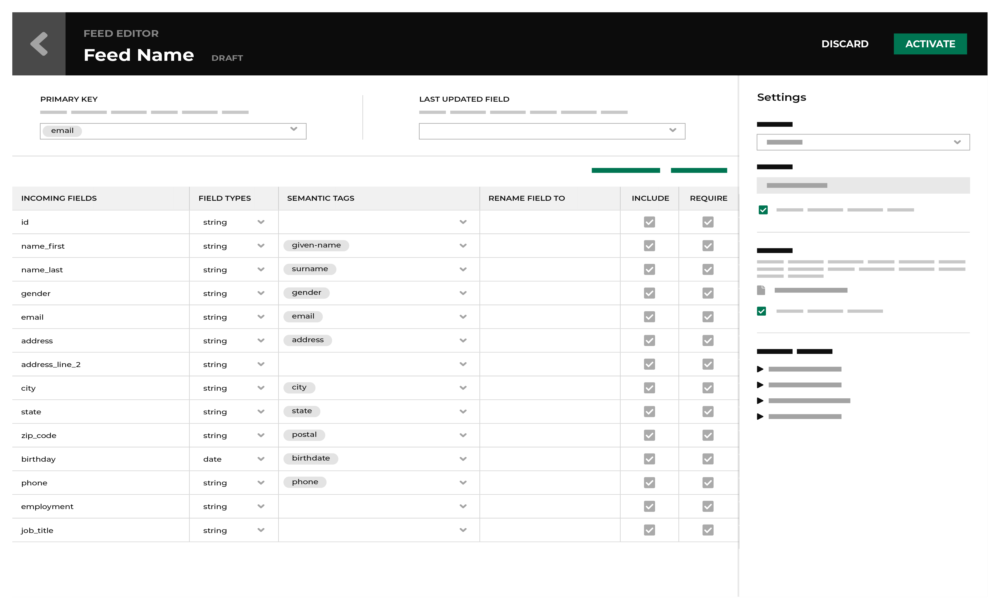

.. https://docs.amperity.com/reference/

.. meta::
    :description lang=en:
        Feeds define the schema for each data source that is pulled to Amperity.

.. meta::
    :content class=swiftype name=body data-type=text:
        Feeds define the schema for each data source that is pulled to Amperity.

.. meta::
    :content class=swiftype name=title data-type=string:
        About feeds

==================================================
About feeds
==================================================

.. include:: ../../shared/terms.rst
   :start-after: .. term-feed-start
   :end-before: .. term-feed-end

.. feeds-what-a-feed-does-start

What a feed does:

#. Associates columns in customer data with semantics in Amperity.
#. Assigns column renames, when necessary.
#. Assigns the data source types Amperity needs for data consistency during the Stitch process.
#. Are grouped by data source when more than one feed exists for a data source category

What a feed needs:

#. An input data source, typically (but not always) managed by a courier.
#. A 1:1 relationship with a courier for large data sources. Couriers are run in parallel whereas feeds run sequentially.
#. Correctly tagged :ref:`foreign keys <semantics-key-foreign>`, especially if the field associated with that key is shared across feeds. This is because most tenants deterministically match on foreign keys.

   .. tip:: You can have any number of feeds populated in a courier. However, it is recommended to keep one feed per courier if possible, because couriers can be parallelized, but feeds within a courier are run sequentially.

.. feeds-what-a-feed-does-end

.. _feed-editor:

Feed Editor
==================================================

.. include:: ../../shared/terms.rst
   :start-after: .. term-feed-editor-start
   :end-before: .. term-feed-editor-end

.. _feed-field-types:

Field types
==================================================

.. feed-field-types-start

All columns from all data sources that are loaded to Amperity must be aligned to the following field types:

* :ref:`Boolean <feed-field-type-boolean>`
* :ref:`Date <feed-field-type-date>`
* :ref:`Datetime <feed-field-type-datetime>`
* :ref:`Decimal <feed-field-type-decimal>`
* :ref:`Float <feed-field-type-float>`
* :ref:`Integer <feed-field-type-integer>`
* :ref:`String <feed-field-type-string>`

.. feed-field-types-end

.. _feed-field-type-boolean:

Boolean
--------------------------------------------------

.. feed-field-type-boolean-start

Use the **Boolean** field type for incoming fields that contain either/or values, such as "true" or "false", "yes" or "no", "0" or "1", or "NULL".

.. feed-field-type-boolean-end

.. _feed-field-type-date:

Date
--------------------------------------------------

.. feed-field-type-date-start

Use the **date** field type for incoming fields that contain ISO-8601 compliant date values, such as a birthdate. For example: "January 18, 1972" or "1972-01-18".

.. feed-field-type-date-end

.. feed-field-type-date-note-start

.. note:: The **date** field :ref:`uses the same formatting options <feed-field-type-datetime-formats>` as the **datetime** field.

.. feed-field-type-date-note-end

.. _feed-field-type-datetime:

Datetime
--------------------------------------------------

.. feed-field-type-datetime-start

Use the **datetime** field type for incoming fields that contain ISO-8601 compliant date and time values, such as a purchase or transaction, the time at which data was last updated, or a campaign launch date.

For example, a datetime of "1970-01-15T08:00:00-08:00" is represented as "yyyy-MM-ddThh:mmzzzz".

.. feed-field-type-datetime-end

.. _feed-field-type-datetime-formats:

Datetime formats
++++++++++++++++++++++++++++++++++++++++++++++++++

.. feed-field-type-datetime-formats-start

The datetime format should be configured to match the pattern for datetimes are formatted in the raw data. This pattern is often similar to "yyyy-MM-dd-HH-mm-ss", but these patterns do vary. Amperity uses `Joda-Time pattern-based formatting <https://www.joda.org/joda-time/key_format.html>`__ |ext_link| to configure the exact datetime pattern that is present in your data.
 
#. It is recommended to configure datetime values using Joda-Time pattern-based formatting for all datetime fields for all of your data sources.

   You can configure Amperity to apply the same pattern for all datetime fields in a feed or you can configure each datetime field individually.
#. You may allow Amperity to infer the correct datetime, and then apply pattern-based formatting, but this is not the recommended approach.
 
   .. tip:: This approach can help speed up initial implementations because Amperity will often infer the correct pattern.

      It is recommended to revisit all datetime fields for which automatic patterns are enabled, and then configure them for the correct Joda-Time pattern.

**Recommended datetime format patterns**

Datetime formats in Amperity use a combination of symbols that are described in the following table:

.. list-table::
   :widths: 15 85
   :header-rows: 1

   * - Symbol
     - Description
   * - **y**
     - The year. Numeric presentation for year fields displays single-character outputs as a zero-based year:

       * y outputs 01
       * yy outputs 01
       * yyyy outputs 2001

   * - **D**
     - The day of the year. For example, the eighteenth day of January is 18 and the first day of February is 32.
   * - **M**
     - The month of the year. For example: August, Aug, or 8. Use text when three or more pattern characters are present, otherwise use numbers:

       * M outputs 8
       * MM outputs 08
       * MMM outputs Aug
       * MMMM outputs August

   * - **d**
     - The day of the month. For example, the eighteenth day of January is 18.
   * - **H**
     - The hour of the day, 0-23. 1:00 PM is 13.

       * H outputs 9
       * HH outputs 09

   * - **h**
     - The clock hour of halfday, 1-12. 1:00 PM is 1.
   * - **m**
     - The minute of the hour. For example, 6:10 PM is 10.
   * - **s**
     - The second of the minute.
   * - **S**
     - The fraction of the second.
   * - **z**
     - The time zone. For example: Pacific Standard Time or PST.

       .. note:: Time zone names cannot be parsed.
   * - **Z**
     - The time zone and offset.

       * Z outputs the offset without a colon. For example: -0800.
       * ZZ outputs the offset with a colon. For example: -08:00.
       * ZZZ (or more) outputs the zone ID. For example: America/Los_Angeles.

.. note:: An apostrophe (') is an escape character in Joda time. To use a single quote you must use a double apostrophe ('').

   Any characters in a pattern that are not in the ranges of [a-z] and [A-Z] will be treated as quoted text. For example, the following characters

   * : (colon)
   * . (period)
   * , (comma)
   *   (space)
   * # (number sign or hash)
   * ? (question mark)

   appears as if they are not contained within single quotes.

   Other symbols may be available. Refer to Joda-Time documentation for more information about symbols that are not described in the previous table.

.. feed-field-type-datetime-formats-end

.. _feed-field-type-decimal:

Decimal
--------------------------------------------------

.. feed-field-type-decimal-start

Use the **decimal** field type for fields that require precision, such as prices or message sizes. Decimal type precision is automatically set to 38. Scale is the number of digits following the decimal point and is configurable from 0 to 37.

You may configure a field for a specific precision scale. You may apply that scale to all decimal field types in the same feed. For example:

* 1.50 (prices)
* 1874.38 (message sizes)
* 141.48 (order subtotals)

.. note:: Fields in which every value contains trailing zeroes, such as quantities and totals, are automatically converted to an :ref:`integer <feed-field-type-integer>` field type.

   Fields that end in non-zero decimals cannot be set to the integer field type.

.. feed-field-type-decimal-end

.. _feed-field-type-float:

Float
--------------------------------------------------

.. feed-field-type-float-start

Use the **float** field type for fields that contain fractional parts, but do not require precision. For example:

* 3.14
* 3.14159

.. important:: Use **decimal** for fields that contain prices.

.. feed-field-type-float-end

.. _feed-field-type-integer:

Integer
--------------------------------------------------

.. feed-field-type-integer-start

Use the **integer** field type for fields that contain numeral values, such as the number of items purchased. For example:

* 1
* 12345

.. important:: Fields that end in non-zero decimals, such as prices, should use the **decimal** field type.

.. feed-field-type-integer-end

.. _feed-field-type-string:

String
--------------------------------------------------

.. feed-field-type-string-start

Use the **string** field type for incoming fields that contain strings and that do not contain obvious matches with other field types, such as all identifiers (account IDs, loyalty IDs, customer IDs), first and last names, email addresses, physical addresses, UUIDs and other IDs, phone numbers, zip codes, product names, and descriptions. For example:

* John
* Smith
* John Smith
* johnsmith @ domain.com
* 123 Main Street
* 206-555-1111
* 00002ac0-0915-3cb4-b7c7-5ee192b3bd49
* ACME
* pants
* " " (may be empty)
* "A data source that pulls from an Amazon S3 bucket." (may contain punctuation)

.. feed-field-type-string-end

.. _feeds-semantic-tags:

Semantic tags
==================================================

.. include:: ../../shared/terms.rst
   :start-after: .. term-semantic-start
   :end-before: .. term-semantic-end

.. include:: ../../shared/terms.rst
   :start-after: .. term-semantic-tag-start
   :end-before: .. term-semantic-tag-end

.. feeds-semantic-tags-start

Semantic tagging is defined as part of every feed. This ensures that data from multiple sources is brought into Amperity in a consistent manner to improve the outcome of the Stitch process and identity resolution.

Semantic tagging works like this:

#. A field in the customer's system named "fname" stores an individual's given name or first name.
#. A field in the customer's system named "lname" stores the same individual's surname or last name.
#. A field in the customer's system named "primary-phone" stores a phone number.
#. A field in the customer's system named "date" stores an individual's birthdate.
#. A field in the customer's system named "email_address1" stores an individual's primary email address.

.. vale off

A feed would apply these semantic tags similar to:

.. list-table::
   :widths: 100 100
   :header-rows: 1

   * - Input field
     - Semantic tag
   * - fname
     - given-name
   * - lname
     - surname
   * - primary-phone
     - phone
   * - date
     - birthdate
   * - email_address1
     - email
   * - ...
     - ...

.. vale on

.. feeds-semantic-tags-end

.. feeds-semantic-tags-context-start

Amperity has :doc:`built-in semantic tags <semantics>` for personally identifiable information (PII), transactions, and behaviors. Custom semantic tags may be applied to specific fields to account for the unique data that may exist within your brand's data.

Apply a similar pattern to every data source your tenant chooses to bring into Amperity. This will ensure that all semantically tagged fields are analyzed by Amperity in exactly the same way.

.. feeds-semantic-tags-context-end

.. feeds-semantic-tags-important-start

.. tip:: Use semantic tags to define consistency across all of the data sources that your brand chooses to make available to Amperity.

   Many brands often choose to provide a wide range of data sources, including those with quality or completeness issues. Applying semantic tags to all data sources, including lower quality or incomplete data sources, makes them usable for building complete and accurate customer profiles.

.. feeds-semantic-tags-important-end

.. feeds-semantic-tags-caution-start

.. caution:: The semantic tagging process is not strictly enforced. For example:

   * You may choose to not apply tag a semantic tag to a column that contains first names
   * You may use custom semantic tags instead of the default semantic tags. For example phone-1, phone-2, and phone-3 instead of phone.

   Non-standard semantic tagging often lowers the accuracy of Amperity ID assignment and greater frequency of incomplete customer profiles.

.. feeds-semantic-tags-caution-end

.. _feeds-semantic-groups:

Semantic groups
--------------------------------------------------

.. feeds-semantic-groups-start

Amperity supports the following groups of semantic tags:

* :ref:`Personally identifiable information (PII) <semantics-profile>`
* Product catalogs
* :ref:`Transactions <semantics-itemized-transactions>`
* :ref:`Custom semantic tags <semantics-custom>`
* :ref:`Email events <semantics-email-event>` and :ref:`email summaries <semantics-email-summary>`
* :ref:`Fiscal calendars <semantics-fiscal-calendar>`
* :ref:`Loyalty programs <semantics-loyalty>`
* :ref:`SMS and email opt-in preferences <semantics-optin-preferences>`

in addition to supporting the use of :ref:`keys <semantics-keys>`, :ref:`Stitch labels <semantics-stitch-labels>`, and :ref:`blocklists <semantics-blocklists>` to further define how data should be understood by Amperity.

.. feeds-semantic-groups-end

.. _feed-troubleshoot-ingest-errors:

Troubleshoot ingest errors
==================================================

.. feed-troubleshoot-ingest-errors-start

When a file shows an error on ingest you can troubleshoot those errors by downloading CSV files that contain error logs from the **Ingest Details** page.

The **Ingest Details** page is accessible from the **Recent activity** pane in the **Sources** page. Error logs are only available for download when errors are present.

There are two types of error log files:

#. A feed-level log file that describes the types and frequency of errors.

   From the **Ingest Details** page, open the actions menu--|fa-kebab|--for the feed, and then click **Download feed error log**.

#. A file-level log that describes each error.

   From the **Ingest Details** page, expand the table row to show the file, open the actions menu--|fa-kebab|--for the file, and then click **Download file error log**.

.. feed-troubleshoot-ingest-errors-end

.. _feeds-howtos:

How-tos
==================================================

.. feeds-howtos-start

The **Sources** page shows the status of all feeds, including when they last ran or updated, how many records were added, and their current status.

.. feeds-howtos-end

.. feeds-howtos-list-start

Tasks that are related to managing feeds:

* :ref:`Activate feed <feeds-activate>`
* :ref:`Add column <feeds-edit-column-add>`
* :ref:`Add feeds from new sources <feeds-add-from-new-sources>`
* :ref:`Add feeds from existing sources <feeds-add-from-existing-sources>`
* :ref:`Add field <feeds-configure-field-add>`
* :ref:`Add foreign key <feeds-edit-add-foreign-key>`
* :ref:`Apply custom semantic tags <feeds-apply-semantic-tags-custom>`
* :ref:`Apply customer profile (PII) semantic tags <feeds-apply-semantic-tags-pii>`
* :ref:`Apply transaction semantic tags <feeds-apply-semantic-tags-itemized>`
* :ref:`Configure feeds <feeds-configure-feed-schema>`
* :ref:`Copy feeds <feeds-copy-feeds>`
* :ref:`Edit primary key <feeds-edit-change-primary-key>`
* :ref:`Delete columns <feeds-edit-column-delete>`
* :ref:`Delete fields <feeds-configure-field-delete>`
* :ref:`Edit domain table name <feeds-configure-edit-domain-table-name>`
* :ref:`Incoming field names <feeds-configure-incoming-field-name>`
* :ref:`Load new data <feeds-edit-load-new-data>`
* :ref:`Make available to Stitch <feeds-make-available-to-stitch>`
* :ref:`Rename fields <feeds-configure-field-rename>`
* :ref:`Replace data source <feeds-replace-data-source>`
* :ref:`Resolve name conflicts <feeds-resolve-name-conflicts>`
* :ref:`Set error thresholds <feeds-set-error-thresholds>`
* :ref:`Set last updated field <feeds-set-last-updated-field>`
* :ref:`Set error thresholds <feeds-configure-set-primary-key>`
* :ref:`Truncate feed <feeds-truncate>`
* :ref:`View sample data <feeds-view-sample-data>`

.. feeds-howtos-list-end

.. _feeds-activate:

Activate feed
--------------------------------------------------

.. feeds-activate-start

A feed must be activated before it can be used to populate domain tables and be associated with a courier. The **Activate** button is located in the upper right of the **Feed Editor**. Click the **Activate** button as the final step when adding or editing a feed.

.. feeds-activate-end

.. _feeds-add:

Add feeds
--------------------------------------------------

.. feeds-add-start

Use the **Add Feed** button to add a feed to Amperity. A feed must be created for each individual data source that is processed by Amperity. A feed may be based on a sample data file (recommended), be based on an existing file or be defined by hand. 

.. feeds-add-end

.. feeds-add-group-by-sources-start

.. tip:: Group feeds by source, where "source" represents a category more than the actual location from which data is made available to Amperity. Use the source as a folder name, under which any number of feeds that support individual data sources may be grouped.

   For example:

   * A source named "Online" can be a category that represents all customer records for all online transactions. For example, a tenant could pull data from Shopify for Brand A and from Adobe Commerce for Brand B, but group both of them together under the "Online" source.
   * A source named "Mobile" can categorize customer records for more than one mobile application, such as Attentive or Listrak.
   * A source named "Purchases" can categorize all transaction records for all store brands, all catalogs, and all mobile applications.
   * A source named "Klaviyo" can categorize the variety of records that are provided to Amperity from Klaviyo.

.. feeds-add-group-by-sources-end

.. feeds-add-scenarios-start

There are two common scenarios for adding feeds to Amperity:

#. :ref:`Add a source grouping <feeds-add-from-new-sources>`
#. :ref:`Use an existing source grouping <feeds-add-from-existing-sources>`

.. feeds-add-scenarios-end

.. _feeds-add-from-new-sources:

Add a source grouping
++++++++++++++++++++++++++++++++++++++++++++++++++

.. feeds-add-from-new-sources-start

If a source category does not exist at the time a feed is added, you can add a new source at the same time you add the feed.

When adding a feed and a source, the sample file for the feed may be:

#. :ref:`A new sample file <feeds-add-from-new-sources-sample-new>`
#. :ref:`An existing sample file <feeds-add-from-new-sources-sample-existing>`
#. :ref:`No sample file <feeds-add-from-new-sources-sample-none>`

.. feeds-add-from-new-sources-end

.. _feeds-add-from-new-sources-sample-new:

New sample file
^^^^^^^^^^^^^^^^^^^^^^^^^^^^^^^^^^^^^^^^^^^^^^^^^^

.. feeds-add-from-new-sources-sample-new-start

Every feed requires a schema. Apply semantic tags to individual fields in the schema. Use one or more individual fields in the schema to define the primary key.

.. feeds-add-from-new-sources-sample-new-end

**To add a feed using a new sample file**

.. feeds-add-from-new-sources-sample-new-steps-start

#. From the **Sources** page, click **Add Feed**. This opens the **Add Feed** dialog box.
#. Under **Data Source** select **Create new source**, and then enter the name for the source.
#. Under **Sample File** select **Upload new file**, and then choose a file.

   Information that shows the file type, compression type, and header rows is shown.
#. Click **Continue**. This opens the **Feed Editor** page.

.. feeds-add-from-new-sources-sample-new-steps-end

.. _feeds-add-from-new-sources-sample-existing:

Existing sample file
^^^^^^^^^^^^^^^^^^^^^^^^^^^^^^^^^^^^^^^^^^^^^^^^^^

.. feeds-add-from-new-sources-sample-existing-start

Files that are used as sample files for feeds are uploaded to Amperity and persist in a location that is accessible to the **Add Feed** dialog box. You may use these files as sample files when adding feeds.

.. feeds-add-from-new-sources-sample-existing-end

**To add a feed using an existing sample file**

.. feeds-add-from-new-sources-sample-existing-steps-start

#. From the **Sources** page, click **Add Feed**. This opens the **Add Feed** dialog box.
#. Under **Data Source** select **Create new source**, and then enter the name for the source.
#. Under **Sample File** select **Select existing file**, and then choose a file.

   Information that shows the date and time at which the existing file was uploaded to Amperity is shown, along with the file ID.
#. Click **Continue**. This opens the **Feed Editor** page.

.. feeds-add-from-new-sources-sample-existing-steps-end

.. _feeds-add-from-new-sources-sample-none:

No sample file
^^^^^^^^^^^^^^^^^^^^^^^^^^^^^^^^^^^^^^^^^^^^^^^^^^

.. feeds-add-from-new-sources-sample-none-start

A sample file is not required to define a feed. You can add fields directly in the **Feed Editor** as if they were loaded from a sample file, and then apply semantic tags, field renames, and all of the rest of the possible feed configuration options.

.. feeds-add-from-new-sources-sample-none-end

**To add a feed with no sample file**

.. vale off

.. feeds-add-from-new-sources-sample-none-steps-start

#. From the **Sources** page, click **Add Feed**. This opens the **Add Feed** dialog box.
#. Under **Data Source** select **Create new source**, and then enter the name for the source.
#. Under **Sample File** select **Don't use sample file**, and then choose a file.
#. Click **Continue**. This opens the **Feed Editor** page.

.. feeds-add-from-new-sources-sample-none-steps-end

.. vale on

.. _feeds-add-from-existing-sources:

Use existing source grouping
++++++++++++++++++++++++++++++++++++++++++++++++++

.. feeds-add-from-existing-sources-start

In many cases, a useful source category already exists at the time a feed is added. You should try to group feeds under an existing source category whenever possible.

When adding a feed to an existing source, the sample file for the feed may be:

#. :ref:`A new sample file <feeds-add-from-existing-sources-sample-new>`
#. :ref:`An existing sample file <feeds-add-from-new-sources-sample-existing>`
#. :ref:`No sample file <feeds-add-from-existing-sources-sample-none>`

.. feeds-add-from-existing-sources-end

.. _feeds-add-from-existing-sources-sample-new:

New sample file
^^^^^^^^^^^^^^^^^^^^^^^^^^^^^^^^^^^^^^^^^^^^^^^^^^

.. feeds-add-from-existing-sources-sample-new-start

Every feed requires a schema to which semantic tags are applied, primary keys are selected, and other configuration details can be specified. Often this requires adding a source and a feed.

.. feeds-add-from-existing-sources-sample-new-end

**To add a feed using a new sample file**

.. feeds-add-from-existing-sources-sample-new-steps-start

#. From the **Sources** page, click **Add Feed**. This opens the **Add Feed** dialog box.
#. Under **Data Source** select **Select existing source**, and then choose a source.
#. Under **Sample File** select **Upload new file**, and then choose a file.

   Information that shows the file type, compression type, and header rows is shown.
#. Click **Continue**. This opens the **Feed Editor** page.

.. feeds-add-from-existing-sources-sample-new-steps-end

.. _feeds-add-from-existing-sources-sample-existing:

Existing sample file
^^^^^^^^^^^^^^^^^^^^^^^^^^^^^^^^^^^^^^^^^^^^^^^^^^

.. feeds-add-from-new-sources-sample-existing-start

Files that are used as sample files for feeds are uploaded to Amperity and persist in a location that is accessible to the **Add Feed** dialog box. You may use these files as sample files when adding feeds.

.. feeds-add-from-new-sources-sample-existing-end

**To add a feed using an existing sample file**

.. feeds-add-from-new-sources-sample-existing-steps-start

#. From the **Sources** page, click **Add Feed**. This opens the **Add Feed** dialog box.
#. Under **Data Source** select **Select existing source**, and then choose a source.
#. Under **Sample File** select **Select existing file**, and then choose a file.

   Information that shows the date and time at which the existing file was uploaded to Amperity is shown, along with the file ID.
#. Click **Continue**. This opens the **Feed Editor** page.

.. feeds-add-from-new-sources-sample-existing-steps-end

.. _feeds-add-from-existing-sources-sample-none:

No sample file
^^^^^^^^^^^^^^^^^^^^^^^^^^^^^^^^^^^^^^^^^^^^^^^^^^

.. feeds-add-from-existing-sources-sample-none-start

A sample file is not required to define a feed. You can add fields directly in the **Feed Editor** as if they were loaded from a sample file, and then apply semantic tags, field renames, and all of the rest of the possible feed configuration options.

.. feeds-add-from-existing-sources-sample-none-end

**To add a feed without a sample file**

.. vale off

.. feeds-add-from-existing-sources-sample-none-steps-start

#. From the **Sources** page, click **Add Feed**. This opens the **Add Feed** dialog box.
#. Under **Data Source** select **Select existing source**, and then choose a source.
#. Under **Sample File** select **Don't use sample file**, and then choose a file.
#. Click **Continue**. This opens the **Feed Editor** page.

.. feeds-add-from-existing-sources-sample-none-steps-end

.. vale on

.. _feeds-apply-semantic-tags:

Apply semantic tags
--------------------------------------------------

.. feeds-apply-semantic-tags-start

A data schema defines the structure of customer data. This is in the form of a data table with columns and rows. It is not uncommon for a collection of data sources to have different data schemas. Amperity maps certain columns within customer data into a set of categories--personally identifiable information (PII), transaction attributes, etc.--to ensure consistency for customer records across all data sources.

.. feeds-apply-semantic-tags-end

.. feeds-apply-semantic-tags-start

* :ref:`feeds-apply-semantic-tags-pii`
* :ref:`feeds-apply-semantic-tags-itemized`
* :ref:`feeds-apply-semantic-tags-custom`

.. feeds-apply-semantic-tags-end

.. _feeds-apply-semantic-tags-pii:

Customer profile (PII)
++++++++++++++++++++++++++++++++++++++++++++++++++

.. include:: ../../shared/terms.rst
   :start-after: .. term-pii-start
   :end-before: .. term-pii-end

.. include:: ../../shared/terms.rst
   :start-after: .. term-pii-semantic-start
   :end-before: .. term-pii-semantic-end

.. feeds-apply-semantic-tags-pii-start

Amperity will assign PII semantic tags automatically when the incoming field name matches a known pattern.

Review the :doc:`complete list of semantics <semantics>` (including :ref:`profile semantics <semantics-profile>` and :ref:`keys related to semantics <semantics-keys>`) before verifying the PII semantics that were applied automatically to customer records.

.. tip::

   .. include:: ../../shared/terms.rst
      :start-after: .. term-update-dt-start
      :end-before: .. term-update-dt-end

   The field that is associated with the **update-dt** semantic tag *should also* be selected as the field that is associated with :ref:`the LAST UPDATED FIELD dropdown list <feeds-set-last-updated-field>`.

.. feeds-apply-semantic-tags-pii-end

**To apply profile semantics to a feed**

.. feeds-apply-semantic-tags-pii-steps-start

#. From the **Sources** page, open the menu for a feed, and then select **Edit**. The **Feed Editor** page opens.

   .. note:: The **Feed Editor** page opens automatically after a file has completed loading when setting up a new feed.
#. Review all of the :ref:`profile semantics <semantics-profile>` that were automatically tagged by Amperity to ensure that each tag was matched correctly.

   .. tip::

      .. include:: ../../shared/terms.rst
         :start-after: .. term-update-dt-start
         :end-before: .. term-update-dt-end

      The field that is associated with the **update-dt** semantic tag *should also* be selected as the field that is associated with :ref:`the LAST UPDATED FIELD dropdown list <feeds-set-last-updated-field>`.

#. Click **Activate**.

.. feeds-apply-semantic-tags-pii-steps-end

.. _feeds-apply-semantic-tags-itemized:

Transactions
++++++++++++++++++++++++++++++++++++++++++++++++++

.. feeds-apply-semantic-tags-itemized-start

Review the :doc:`complete list of semantics <semantics>` (including :ref:`transactions semantics <semantics-itemized-transactions>` and :ref:`foreign keys related to transactions semantics <semantics-keys>`) before applying them to interaction records.

.. feeds-apply-semantic-tags-itemized-end

.. include:: ../../shared/terms.rst
   :start-after: .. term-itemized-transactions-semantic-start
   :end-before: .. term-itemized-transactions-semantic-end

**To apply transactions semantics to a feed**

.. feeds-apply-semantic-tags-itemized-steps-start

#. From the **Sources** page, open the menu for a feed, and then select **Edit**. The **Feed Editor** page opens.
#. Apply :ref:`semantics-itemized-transactions` to any column in the data schema that has matching data.
#. Click **Activate**.

.. feeds-apply-semantic-tags-itemized-steps-end

.. _feeds-apply-semantic-tags-custom:

Custom semantics
++++++++++++++++++++++++++++++++++++++++++++++++++

.. feeds-apply-semantic-tags-custom-start

Custom semantic values may be applied to any column in Amperity. Amperity has many built-in semantics for PII, transactions, customer preferences, loyalty programs, and email attributes.

Amperity may not have all of the semantics required by a customer. Before adding custom semantics to Amperity you should work with the customer to define which custom semantic tags are required, what their purpose is, and what types of customized SQL queries is required to present the outcome of the tagging effort in a way that is usable from a queries editor.

.. caution:: If a semantic tag is added to Amperity that contains a typo--such as **emali** vs. **email**--both will be treated by Amperity as if they are unique semantic tags.

.. feeds-apply-semantic-tags-custom-end

**To apply custom semantic tags**

.. feeds-apply-semantic-tags-custom-steps-start

#. From the **Sources** page, open the menu for a feed, and then select **Edit**. The **Feed Editor** page opens.
#. In the **Semantic** column, enter the names of custom semantics. They should use hyphens and not underscores and they should be entered the same way as a PII semantic, but without it appearing in the dropdown pick-list.
#. Click **Activate**.

.. note:: This may be done *during* the process of adding a feed, also.

.. feeds-apply-semantic-tags-custom-steps-end

.. _feeds-copy-feeds:

Copy feeds
--------------------------------------------------

.. feeds-copy-feed-start

Copy a feed on the **Sources** page.

.. feeds-copy-feed-end

**To copy a feed**

.. feeds-copy-feed-steps-start

#. From the **Sources** page, open the menu for a feed, and then select **Make a copy**. The **Copy Feed** page opens.
#. Select the data source from the **Data Source** dropdown menu.
#. Enter the feed name in the **Feed Name** field.
#. Click **Submit**.

The copied feed appears in the **Feeds** section of the **Sources** page.

.. feeds-copy-feed-steps-end

.. _feeds-configure-feed-schema:

Configure feed schema
--------------------------------------------------

.. feeds-configure-feed-schema-start

A feed defines the schema for that data source, associates semantic tags with specific columns in the data, and assigns a primary key. A feed must be activated, after which the feed loads the data to a domain table. A feed that contains customer records for PII data must be made available to the Stitch process.

If changes are made to a feed or the data schema in the data source itself changes, the feed must reload the data. In some cases, this also requires the domain table itself be purged, and then rebuilt upon feed reactivation.

.. feeds-configure-feed-schema-end

.. include:: ../../shared/terms.rst
   :start-after: .. term-feed-editor-start
   :end-before: .. term-feed-editor-end

.. _feeds-configure-field-add:

Add fields
++++++++++++++++++++++++++++++++++++++++++++++++++

.. feeds-configure-field-add-start

You may add fields to a feed even when they are not present in a sample file.

.. feeds-configure-field-add-end

**To add a field to a feed**

.. feeds-configure-field-add-steps-start

#. From the **Sources** page, open the menu for a feed, and then select **Edit**.
#. Click **+ Add New Field**. A field is added to the bottom of the list of fields for the feed.
#. Add the name of the field, select its field type, associate semantic tags, and apply any renames.
#. Deselect **Required**.
#. Click **Activate**.

.. feeds-configure-field-add-steps-end

.. _feeds-configure-field-delete:

Delete fields
++++++++++++++++++++++++++++++++++++++++++++++++++

.. feeds-configure-field-delete-start

A field that is deleted may also be deleted *everywhere* else it appears in Amperity. The process that updates the domain table occurs automatically. Additional steps may be required to remove the field from a database table, query, or segment that uses the field. A field may not be deleted when it is a dependency for a primary key.

.. feeds-configure-field-delete-end

**To delete a field**

.. feeds-configure-field-delete-steps-start

#. From the **Sources** page, open the menu for a feed, and then select **Edit**. The **Feed Editor** page opens.
#. Click the trash can icon to delete the field.

   .. warning:: Amperity does not ask for confirmation.

.. feeds-configure-field-delete-steps-end

.. _feeds-configure-edit-domain-table-name:

Edit domain table name
++++++++++++++++++++++++++++++++++++++++++++++++++

.. feeds-configure-edit-domain-table-name-start

You may edit the name of the domain table from the **Feed Editor**.

.. warning:: Changing the table name will reference the newly specified table for subsequent data ingestion. This table will be created if it does not exist. All data previously ingested is in the prior table.

.. feeds-configure-edit-domain-table-name-end

**To edit the name of a domain table from the Feed Editor**

.. feeds-configure-edit-domain-table-name-steps-start

#. From the **Sources** page, open the menu for a feed, and then select **Edit**. The **Feed Editor** page opens.
#. Under **Domain Table** select **Edit**. This allows the text box that contains the name of the domain table to be editable.
#. Enter the new name for the domain table with the pattern <source-name>:<feed-name>. For example: "Customers:Online".
#. Click **Activate**.

.. feeds-configure-edit-domain-table-name-steps-end

.. _feeds-configure-incoming-field-name:

Incoming field names
++++++++++++++++++++++++++++++++++++++++++++++++++

.. feeds-configure-incoming-field-name-start

The **Incoming Field** column matches the column name in the source data file.

Amperity will apply the casing in the sample file to the values of the **Incoming Field** column when a sample file is used to define a feed schema. Changes to the casing of column names have no effect when loading updates to Amperity.

For example, a ``customer_id`` column name in the sample file is added to the **Incoming Field** column as ``customer_id``. A column name change to ``CUSTOMER_ID`` or ``Customer_ID`` will not affect how the feed loads data or updates to the domain table.

.. feeds-configure-incoming-field-name-end

.. _feeds-configure-field-rename:

Rename fields
++++++++++++++++++++++++++++++++++++++++++++++++++

.. feeds-configure-field-rename-start

A field name may contain only letters, numbers, and underscores. If an incoming field contains unsupported characters, such as hyphens or spaces, use the **Rename To** column to replace the unsupported characters with letters, numbers, or underscores.

For example, a sample CSV file:

.. code-block:: none

   name,email,first-name,last-name,phone_home,phone_mobile
   Justin Currie,justincurrie@mail.com,Justin,Currie,222-555-1212,505-404-1234
   David Zearfoss,davidzearfoss@mail.com,David,Zearfoss,222-555-1313,505-606-8765

will display an alert in the **Feed Editor** similar to:

.. code-block:: none

   Field names may only contain letters, numbers, and underscores. If an
   incoming field name has unsupported characters, add a rename.

This is because hyphens are present in two fields. Use the **Rename to** column to rename **first-name** to **first_name** and **last-name** to **last_name**.

.. feeds-configure-field-rename-end

.. _feeds-configure-set-primary-key:

Set primary key
++++++++++++++++++++++++++++++++++++++++++++++++++

.. include:: ../../shared/terms.rst
   :start-after: .. term-primary-key-start
   :end-before: .. term-primary-key-end

.. feeds-configure-set-primary-key-start

At least one field must be set as a primary key. Any feed that contains customer records or interaction records must have a field that can be associated with a primary key. This is typically an obvious field, like a customer ID or transaction ID, but some data sources are not as clear. You may tag more than one field as the primary key.

.. feeds-configure-set-primary-key-end

**To set the primary key**

.. feeds-configure-set-primary-key-steps-start

#. From the **Sources** page, open the menu for a feed, and then select **Edit**. The **Feed Editor** page opens.
#. From the **Primary Key** dropdown, select a field from the list.
#. Click **Activate**.

.. feeds-configure-set-primary-key-steps-end

.. include:: ../../amperity_reference/source/domain_tables.rst
   :start-after: .. domain-tables-records-mismatch-tip-start
   :end-before: .. domain-tables-records-mismatch-tip-end

.. _feeds-delete:

Delete feeds
--------------------------------------------------

.. feeds-delete-start

Use the **Delete** option to remove a feed from Amperity. Verify that both upstream and downstream processes no longer depend on this feed prior to deleting it. This action will not delete the associated data file.

.. feeds-delete-end

**To delete a feed**

.. feeds-delete-steps-start

#. From the **Sources** page, open the menu for a feed, and then select **Delete**. The **Delete Feed** dialog box opens.
#. Click **Delete**.

.. feeds-delete-steps-end

.. _feeds-edit:

Edit feeds
--------------------------------------------------

.. feeds-edit-start

Use the **Edit** option in the row for a specific feed to make changes, including to feed details, column names, column types, semantics, or required columns. A very common scenario for editing a feed is to apply foreign key assignments to tables with customer records so that they may be associated to tables with interaction records.

.. feeds-edit-end

.. _feeds-edit-column-add:

Add columns
++++++++++++++++++++++++++++++++++++++++++++++++++

.. feeds-edit-column-add-warning-steps-start

.. warning:: Adding columns to a feed should be done *after* considering the downstream effects of those changes. Changes may have unintended consequences, such as semantics, column names, pick-lists, and other changes may not be immediately available to a downstream process, which may cause that downstream process to fail.

.. feeds-edit-column-add-warning-steps-end

.. feeds-edit-column-add-start

A column may be added to a feed. Before adding columns, be sure to also add the column to any customer 360 database tables that are using the domain table associated with this feed. Columns on passthrough database tables are opt-in, which means you need to update the passthrough table to ensure all columns are loaded. However, this should only be done after the feed has successfully loaded this data to its domain table.

.. warning:: Editing column types, column semantics, and column names without considering the downstream effects of those changes may have unintended consequences.

It is not always possible to update downstream processes in advance. For example, a query cannot be updated for changes until the data tables against which that query runs have been updated. Because of the additional complexity related to editing column types, column semantics, and column names, it is recommended to take steps to ensure that downstream processes will not run while making these changes, and then:

#. Update the feed.
#. Update the domain table, if necessary.
#. Update Stitch configuration, if necessary.
#. Update customer 360 database tables, if necessary.
#. Update queries, if necessary.
#. Update destinations, if necessary.

.. feeds-edit-column-add-end

.. _feeds-edit-add-foreign-key:

Add foreign keys
++++++++++++++++++++++++++++++++++++++++++++++++++

.. feeds-edit-add-foreign-key-start

To associate interaction records that are identified by transactions and transaction items semantic tagging with an Amperity ID, you need to add a foreign key that associates primary keys in tables with customer records to the primary key in tables with interaction records.

.. caution:: You must apply the same foreign key to customer records and interaction records.

.. feeds-edit-add-foreign-key-end

**To add a foreign key**

.. feeds-edit-add-foreign-key-steps-start

#. From the **Sources** page, open the menu for a feed, and then select **Edit**. The **Edit Feed** page opens.
#. For the field identified as the primary key, add a custom semantic that start with **fk-**, such as **fk-customer**.
#. Click **Activate**.

.. feeds-edit-add-foreign-key-steps-end

.. _feeds-edit-change-primary-key:

Change primary keys
++++++++++++++++++++++++++++++++++++++++++++++++++

.. feeds-edit-change-primary-key-warning-start

.. warning:: Be careful when making changes to columns in a feed to ensure that all keys--primary, foreign, and customer--are maintained correctly. In general, changing a key can have downstream implications for Stitch, including affecting stable Amperity IDs that depend on this primary key.

.. feeds-edit-change-primary-key-warning-end

.. include:: ../../shared/terms.rst
   :start-after: .. term-primary-key-start
   :end-before: .. term-primary-key-end

.. feeds-edit-change-primary-key-about-start

A primary key may be updated in situations that allow for better associations with other data sources or situations that result in improvements to the quality of the identity resolution process.

Changes to the primary key requires truncating data from the domain table upon feed reactivation.

.. feeds-edit-change-primary-key-about-end

.. feeds-edit-change-primary-key-context-start

You may edit the primary key. Pick a new one or add more fields to be primary keys.

.. important:: Changes to primary keys may have unintended downstream effects. If you change the primary key for data that has already been processed by Stitch, a mismatch may be created in the domain model definition and existing domain tables.

.. feeds-edit-change-primary-key-context-end

**To edit the primary key**

.. feeds-edit-change-primary-key-steps-start

#. From the **Sources** page, open the menu for a feed, and then select **Edit**. The **Edit Feed** page opens.
#. From the **Primary Key** dropdown, select a field from the list.
#. If prompted, select **Yes, purge the data from my domain table when I activate**.
#. Click **Activate**.

.. feeds-edit-change-primary-key-steps-end

.. _feeds-edit-column-delete:

Delete columns
++++++++++++++++++++++++++++++++++++++++++++++++++

.. feeds-edit-column-delete-warning-start

.. warning:: Deleting columns in a feed should not be done without considering the downstream effects of those changes. Changes may have unintended consequences: semantics, column names, or pick-lists, may not be immediately available to a downstream process, which may cause that downstream process to fail.

.. feeds-edit-column-delete-warning-end

.. feeds-edit-column-delete-start

A column may be deleted from a feed. The timing of this deletion is important. If a column is deleted during feed creation, that column is not loaded to a domain table, be part of any Stitch processes, be a column in a customer 360 database table, be part of a SQL query that defines a query, or be a data point sent to an external destination.

However, a column that is deleted from a feed that *has* been loaded to a domain table and has been part of the Stitch process, is a column in a customer 360 table, is part of a SQL query that defines a query, and is a data point that is sent to an external destination.

Before deleting any column that has been loaded to a domain table, be sure to identify if that column is part of any downstream workflows. Every reference to that column need to be removed from Amperity. This is especially important for customer 360 database tables and for queries.

.. feeds-edit-column-delete-end

.. _feeds-edit-column-edit:

Edit columns
++++++++++++++++++++++++++++++++++++++++++++++++++

.. feeds-edit-column-edit-warning-start

.. warning:: Editing columns in a feed should not be done without considering the downstream effects of those changes. Changes may have unintended consequences: semantics, column names, or pick-lists, may not be immediately available to a downstream process, which may cause that downstream process to fail.

.. feeds-edit-column-edit-warning-end

.. feeds-edit-column-edit-start

Depending on the type and scope of changes to be made:

#. Remove references to the column, re-load the data via the feed, and then re-add the column with the updated metadata.
#. Remove any databases and queries that reference the column, re-load the data via the feed, and then recreate the databases and queries.

.. feeds-edit-column-edit-end

.. _feeds-edit-load-new-data:

Load new data
++++++++++++++++++++++++++++++++++++++++++++++++++

.. feeds-edit-load-new-data-start

Use the **Load new data** option in the row for a specific feed to upload a new data file. The file must have the same schema, but may contain new data. The domain table is updated automatically.

.. feeds-edit-load-new-data-end

**To load new data to an existing feed**

.. feeds-edit-load-new-data-steps-start

#. From the **Sources** page, open the menu for a feed, and then select **Load new data**. The **Load New Data** dialog box opens.
#. Select a data source.

   .. important:: The selected file must have a schema that matches the schema already defined for the feed.
#. Click **Load**.

.. feeds-edit-load-new-data-steps-end

.. _feeds-make-available-to-stitch:

Make available to Stitch
--------------------------------------------------

.. feeds-make-available-to-stitch-start

A domain table with semantic tags applied to records that contain PII data should be made available to Stitch. A domain table that is made available to Stitch is used by Stitch for customer identity resolution.

Domain table data is made available to Stitch in two steps:

#. Selecting the **Make available to Stitch** option when configuring a feed or a custom domain table.

   When selected, the name of the domain table that is associated with the feed or custom domain table is added to a list of domain tables that are accessible as a Stitch configuration setting.
#. A list of domain tables within Stitch configuration that have been made available to Stitch. Each table in this list must be configured for Stitch before it can be part of the identity resolution process.

.. feeds-make-available-to-stitch-end

.. feeds-make-available-to-stitch-tip-start

.. tip:: Only tables that contain PII data should be made available to Stitch. Tables that are later associated with Amperity IDs, but do not contain PII data, such as those that contain transactions, should use a foreign key to associate those records with an Amperity ID.

.. feeds-make-available-to-stitch-tip-end

**To make data available to Stitch**

.. feeds-make-available-to-stitch-steps-start

#. From the **Sources** page, open the menu for a feed, and then select **Edit**. The **Feed Editor** page opens.
#. Under **Domain Table** select **Make available to Stitch**.
#. Click **Activate**.

.. feeds-make-available-to-stitch-steps-end

.. _feeds-replace-data-source:

Replace data source
--------------------------------------------------

.. feeds-replace-data-source-start

In certain cases a data source needs to be replaced in a way that allows a new schema to be added to Amperity, while limiting the amount of changes that must be applied to downstream workflows.

A data source may need to be replaced when there are minor schema changes or when an upstream workflow changes the manner in which that data source is provided to Amperity.

.. feeds-replace-data-source-end

**To replace a data source**

.. feeds-replace-data-source-steps-start

#. Add it as a second version of the original. For example: ``source_data`` and ``source_data_v2``.
#. Add a :ref:`foreign key <semantics-key-foreign>` that is shared only by the original and second version.

   .. tip:: Examine the data sources.

      If the primary key field is identical in both data sources, assign the foreign key to the primary key fields, otherwise identify a field in each source that can be assigned a shared foreign key.

#. Make both tables :ref:`available to Stitch <feeds-make-available-to-stitch>` when the data source contains PII data.
#. :ref:`Run Stitch <stitch-run>`.

   .. note:: Be sure that the second version is :ref:`added to the Stitch configuration <stitch-run-select-tables>` before running Stitch.
#. Step through the |stitch_qa| process, and then examine both versions for foreign key validation.

   .. important:: The foreign key that is shared by the original and second version should not show multiple Amperity IDs within either the original or second versions. The same individual across both versions should not show different Amperity IDs.

.. feeds-replace-data-source-steps-end

.. _feeds-resolve-name-conflicts:

Resolve name conflicts
--------------------------------------------------

.. feeds-resolve-name-conflicts-start

A domain table requires each column name to be unique. However, a sample file may contain duplicate field names. If this occurs, use the **Incoming Field** column to apply a namespace, an ordinal, or some other naming convention to ensure that column names in the domain table will be unique.

For example, a sample CSV file:

.. code-block:: none

   name,email,fname,lname,phone,phone
   Justin Currie,justincurrie@mail.com,Justin,Currie,222-555-1212,505-404-1234
   David Zearfoss,davidzearfoss@mail.com,David,Zearfoss,222-555-1313,505-606-8765

will display an alert in the **Feed Editor** similar to:

.. code-block:: none

   There is a name conflict in the resulting fields of this feed. Make sure
   that none of the field names are duplicated (including any generated fields).

This is because the **phone** field appears twice. Use the **Incoming Field** column to rename the first instance of **phone** to **phone_home** and the second instance of **phone** to **phone_mobile**.

.. feeds-resolve-name-conflicts-end

.. _feeds-set-error-thresholds:

Set error thresholds
--------------------------------------------------

.. feeds-set-error-thresholds-start

Amperity processes and checks all rows. The error limit is the percentage of rows that may contain errors when compared to the total number of rows. Data is not ingested when the error limit is exceeded. Adjust the error limit higher or lower to match acceptable percentages for various types of data and data quality.

.. feeds-set-error-thresholds-end

**To set the error threshold**

.. feeds-set-error-thresholds-steps-start

#. From the **Sources** page, open a feed.
#. In the **Feed Editor**, expand **Error Thresholds**.
#. Under **MAX**, enter an integer between **0** and **100**. (The default limit is 1%.)
#. Click **Activate**.

.. feeds-set-error-thresholds-steps-end

.. _feeds-set-last-updated-field:

Set last updated field
--------------------------------------------------

.. feeds-set-last-updated-field-start

Amperity requires each feed to specify a field that describes when each record was last updated. If multiple records in the incoming data or the existing domain table have the same primary key, the record with the most recent "last updated" field will be retained. This may be associated with a field that has a datetime field type, or an integer (such as for unix timestamps).

.. note:: Amperity does not use a field with a date data type because that value is not granular enough to determine priority.

If you have no such updated field, you can choose to autogenerate a field, in which case the following logic is used to determine which record to keep in the case a primary key appears more than once:

#. Records from newly ingested data will always overwrite records that already exist in the domain table.

#. If couriers are run over a date range, records from files associated with later dates will be retained.

#. If multiple files are loaded for the same date, records for the latest-loaded file are retained. File loading order depends on the behavior of the source system, but is deterministic.

#. If the same primary key appears on multiple records on the same text-based file, the latest row on the file is retained.

.. note:: When using ingest queries, the above tiebreakers are unavailable, so upserting behavior can be nondeterministic. Ensure that you either specify a "last updated" field, or that your ingest query only returns a single record for each primary key, to ensure deterministic results.

.. feeds-set-last-updated-field-end

**To set the last updated field**

.. feeds-set-last-updated-field-steps-start

#. From the **Sources** page, open the menu for a feed, and then select **Edit**. The **Feed Editor** page opens.
#. The last updated field is above the field list in the center of the page.
#. Under **Last Updated Field**, choose how Amperity will determine priority: automatically generated, a field with an integer data type, or a field with a datetime data type (often the same field to which the **update-dt** merge rules semantic tag is applied).
#. Click **Activate**

.. feeds-set-last-updated-field-steps-end

.. include:: ../../amperity_reference/source/domain_tables.rst
   :start-after: .. domain-tables-records-mismatch-tip-start
   :end-before: .. domain-tables-records-mismatch-tip-end

.. _feeds-truncate:

Truncate feed
--------------------------------------------------

.. feeds-truncate-start

You can empty the contents of a feed directly from the **Sources** page.

.. feeds-truncate-end

**To truncate a feed**

.. feeds-feed-steps-start

#. From the **Sources** page, open the menu for a feed, and then select **Truncate**. The **Truncate Feed** dialog box opens.
#. Click **Truncate**.

.. feeds-feed-steps-end

.. _feeds-view-sample-data:

View sample data
--------------------------------------------------

.. feeds-view-sample-data-start

You can view sample data while building a feed. Click the **View sample file** link to open the **View Sample Page**. This page shows up to 200 rows of data based on the current state of the feed schema.

.. feeds-view-sample-data-end
