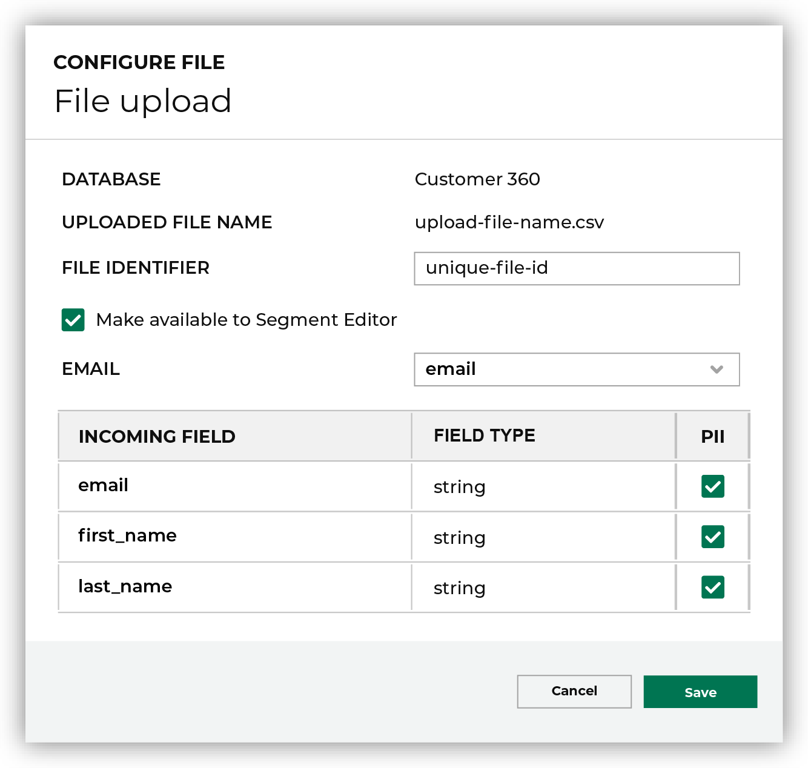
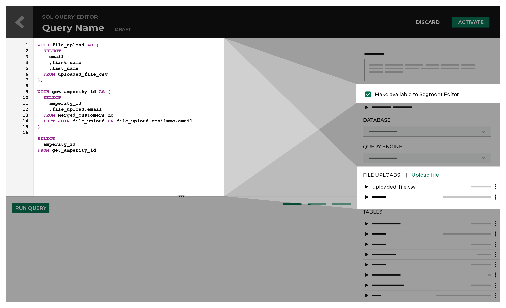

.. https://docs.amperity.com/reference/

.. meta::
    :description lang=en:
        Upload CSV files directly to the Customer 360, Queries, Segments, and Campaigns pages.

.. meta::
    :content class=swiftype name=body data-type=text:
        Upload CSV files directly to the Customer 360, Queries, Segments, and Campaigns pages.

.. meta::
    :content class=swiftype name=title data-type=string:
        File uploads

==================================================
About file uploads
==================================================

.. file-uploads-overview-start

Use the file upload feature on the **Customer 360** and **Queries** pages to upload CSV files to a database to use on the **Queries**, **Segments**, and **Campaigns** pages.

.. file-uploads-overview-end

.. file-uploads-overview-from-a-sandbox-start

.. important:: Files that are uploaded to a sandbox are copied to your production tenant when that sandbox is promoted.

.. file-uploads-overview-from-a-sandbox-end

 .. _file-uploads-use-cases:
 
File upload use cases
==================================================

.. file-uploads-use-cases-start

You can use the CSV file upload feature to upload a CSV file to a database. The following examples shows several ways you can use this feature:

* Upload an anonymous list of customers which the system then connects with known customers with Amperity IDs
* Upload a reference file to render on the **Queries** page
* Upload a list of customers who filled out a survey in order to include in a campaign that addresses their concerns

.. file-uploads-use-cases-end

.. _file-uploads-example-sql:

SQL use case example
--------------------------------------------------

.. file-uploads-example-sql-start

Upload a list of customers to include or exclude from a campaign by building a query against file uploads that return the Amperity ID via the file upload feature.

The following example shows SQL in the **Query Editor** that returns a series of values from an uploaded file, joins those values to the **Merged Customers** table using the **email** column in both tables, and then returns a list of Amperity IDs.

.. note:: This is not required for uploaded files that contain an **email** column. For more complex use cases, a query that is made available to segments and campaigns must return a list of Amperity IDs.

.. code-block:: sql
   :linenos:

   WITH file_upload AS (
      SELECT
        email
        ,first_name
        ,last_name
      FROM uploaded_file_csv
    ),

    WITH get_amperity_id AS (
      SELECT
        amperity_id
        ,file_upload.email
      FROM Merged_Customers mc
      LEFT JOIN file_upload ON file_upload.email=mc.email
    )

    SELECT
      amperity_id
    FROM get_amperity_id

.. file-uploads-example-sql-end

.. _file-uploads-example-request:

Example inbound request
--------------------------------------------------

.. file-uploads-example-request-start

The following example shows a inbound request for a customer list in the form of a CSV file:

.. code-block:: none
   :linenos:

   customer,email
   John Doe,john.doe@abc.com
   Jane Doe,jane.doe@abc.com
   John Smith,john.smith@abc.com
   Jane Smith,jane.smith@abc.com
   Jim Johns,jim.jones@abc.com

.. file-uploads-example-request-end

.. _file-uploads-query-output:
 
Query output
==================================================

.. file-uploads-query-output-start

The following are some ways that you can use this feature on the **Segment Editor** and on the **Campaigns** page: 

* Create a complex view of customers on the **Segments** page by adding a query output to a segment, which can also be included or excluded in a campaign on the **Campaigns** page.
* Create a custom join logic from an uploaded customer list for further segmentation in the **Segment Editor** and on the **Campaigns** page.

   .. note:: Queries that are made available for segments and campaigns can reference any uploaded files within the database that they are associated with.

.. file-uploads-query-output-end

.. _file-uploads-how-to:

How-tos
==================================================

.. file-uploads-overview-start

Tasks related to uploading CSV files and adding query outputs to segments and campaigns in Amperity.

.. file-uploads-overview-end

.. file-uploads-how-tos-list-start

* :ref:`file-uploads-add-lists`
* :ref:`file-uploads-add-file-segment`
* :ref:`file-uploads-delete`
* :ref:`file-uploads-csv-upload`

.. file-uploads-how-tos-list-end

.. _file-uploads-add-lists:

Add lists
--------------------------------------------------

.. file-uploads-add-lists-how-to-start

You can add a customer list or source to the **Segments** page and the **Campaigns** page.

.. file-uploads-add-lists-how-to-end

.. _file-uploads-add-query-segment:

Add a query output to a segment
++++++++++++++++++++++++++++++++++++++++++++++++++

.. file-uploads-add-query-start

You can add a query output to a segment from the **Segment Editor**.

.. file-uploads-add-query-end

**To add a query output to a segment**

.. file-uploads-add-query-steps-start

#. From the **Segment Editor** window, click **Add Attribute**.
#. From the **Source** menu, either select a table source *or* search for a table source in the search field.
#. From the **Attribute** menu, either select an attribute *or* search for an attribute in the search field.
#. From the **Condition** menu, select a condition.
#. From the value menu, either select a value *or* search for a value in the search field.
#. Click **Add List**.
#. From the **Condition** list, select **Is a member of**.
#. From the **Customer Lists** list, in the **Queries** section, select a query output.

   .. note:: To delete a segment associated with a query output, you need to first delete the query output before being able to delete the segment.
   
#. Click **Save As**.

The data appears on the **Segments** page.

.. note:: In order for a query output to appear on the **Segment Editor**, you need to add the Amperity ID field as a column or add the email field as a column in to the .CSV file.

   If your uploaded file does not have any Amperity IDs, you can select an email field to join one from the **Merged Customers** table on the **Configure File** window.

.. file-uploads-add-query-steps-end

.. _file-uploads-select-query-source:

Select a query source
++++++++++++++++++++++++++++++++++++++++++++++++++

.. file-uploads-select-query-source-start

You can select a query source from the **Campaigns** page.

.. file-uploads-select-query-source-end

**To select a query source**

.. file-uploads-select-query-source-steps-start

#. From the **Edit attributes** page, in the **Sources** column, click on a row.
#. In the **Queries (Custom Tables)**, select a query source.
#. Click **Save**.

   .. note:: To delete a campaign associated with a query output, you must first delete the uploaded file before being able to delete the segment.

.. file-uploads-select-query-source-steps-end

.. _file-uploads-add-file-segment:

Add an uploaded file to a segment
--------------------------------------------------

.. file-uploads-add-query-start

You can add an uploaded file to a segment from the **Segment Editor**.

.. note:: It may take up to 10 minutes for your file to upload and you can only upload one file per tenant at a time.

.. warning:: Uploaded CSV files are limited to 50 MB.

.. file-uploads-add-query-end

**To add an uploaded file to a segment**

.. file-uploads-add-query-steps-start

#. From the **Segment Editor** window, click **Add Attribute**.
#. From the **Source** menu, either select a table source *or* search for a table source in the search field.
#. From the **Attribute** menu, either select an attribute *or* search for an attribute in the search field.
#. From the **Condition** menu, select a condition.
#. From the value menu, either select a value *or* search for a value in the search field.
#. Click **Add List**.
#. From the **Condition** list, select **Is a member of**.
#. From the **Customer Lists** list, in the **File Uploads** section, select an uploaded file output.

   .. note:: To delete a segment associated with a query output, you must first delete the uploaded file before being able to delete the segment.
   
#. Click **Save As**.

The data appears on the **Segments** page.

.. file-uploads-add-query-steps-end

.. _file-uploads-view-file-segment:

View uploaded files
++++++++++++++++++++++++++++++++++++++++++++++++++

.. file-uploads-view-file-segment-start

You can view a list of uploaded files on the **Segment Editor**.

.. file-uploads-view-file-segment-end

**To view uploaded files**

.. file-uploads-view-file-segment-steps-start

#. From the **Segment Editor** window, click **Add List**.
#. From the **Condition** list, select **Is a member of**.
#. From the **Customer Lists** list, in the **File Uploads** section, view a list of uploaded files.

.. file-uploads-view-file-segment-steps-end

.. _file-uploads-delete:

Delete an uploaded file
--------------------------------------------------

.. file-uploads-delete-how-to-start

You can delete an uploaded file.

#. From the **Queries** or **Segments**, open the actions menu for an uploaded file, and then select **Delete**.
#. Click **Delete** to confirm that you want to delete the file upload.

.. file-uploads-delete-how-to-end

.. _file-uploads-csv-upload:

Upload CSV file
--------------------------------------------------

.. file-uploads-csv-upload-how-to-start

You can upload a CSV file in Amperity to use on the **Queries**, **Segments**, and **Campaigns** pages.

.. note:: When you upload a file to Amperity, the system writes a table from the data contained in that file. The table is then layered on top of a database at the queries layer.

   Amperity does not enforce a time constraint on how long uploaded files can remain in the database.

.. file-uploads-csv-upload-how-to-end

.. admonition:: Multi-brand databases

   A file is uploaded to a single database. When your tenant is configured for multi-brand databases a file must be uploaded to each database.

.. _file-uploads-via-c360:

Upload file via the Customer 360 page
++++++++++++++++++++++++++++++++++++++++++++++++++

.. file-uploads-via-c360-start

You can upload a CSV file the **Customer 360** page.

.. file-uploads-via-c360-end

**To upload a CSV file via the Customer 360 page**

.. file-uploads-via-c360-steps-start

#. From the **Customer 360** page, on a C360 table, click on the more options button.
#. From the **Configure File** window, drag and drop a file in the window or click the window to browse for files on your computer.
#. Wait a few moments for the file to upload.
#. In the **File Identifier** field, select a file.
#. Select **Make available in segment editor**.
#. In the **Email** field, select a incoming field to have the data mapped to that field.
#. Click **Save**.

   .. note:: In order for the uploaded customer list to appear on the **Segment Editor**, you need to add the Amperity ID field as a column or add the email field as a column to the CSV file.

.. file-uploads-via-c360-steps-end

.. _file-uploads-via-queries:

Upload file via the Query editor
++++++++++++++++++++++++++++++++++++++++++++++++++

.. file-uploads-via-queries-start

You can upload a CSV file from the **Query Editor** page.
   
.. image:: ../../images/mockup-queries-tab-file-uploads.png
   :width: 600 px
   :alt: Make changes on the **Configure File** window.
   :align: left
   :class: no-scaled-link

.. note:: When you upload a CSV file from the **Query Editor** and then discard the query, it will automatically associate the contact information in the uploaded file to Amperity IDs.

.. file-uploads-via-queries-end

**To upload a file via the Query Editor**

.. file-uploads-via-queries-steps-start

#. From the **Queries** page, click on a query.
#. From the **Query Editor**, in the **Query Details** section on the right-side of the page, click **Upload Files** in the **File Uploads** section.
#. From the **Configure File** window, drag and drop a file in the window or click the window to browse for files on your computer.
#. Wait a few moments for the file to upload.
#. In the **File Identifier** field, select a file.
#. Select **Make available in Segment Editor**.
#. In the **Email** field, select a incoming field to have the data mapped to that field.
#. Click **Save**.

   .. note:: The uploaded file is not added as a table to your database.

   .. warning:: Only upload CSV files on the **Query Editor**, if you are going to add additional SQL to your query.

.. file-uploads-via-queries-steps-end

.. _file-upload-view-file-list:

View uploaded files
++++++++++++++++++++++++++++++++++++++++++++++++++

.. file-upload-view-file-list-start

You can view a list of uploaded files on the **SQL Query Editor**.

.. file-upload-view-file-list-end

**To view uploaded files**

.. file-upload-view-file-list-steps-start

#. From the **SQL Query Editor**, in the **File Uploads** section, view a list of uploaded files.

.. file-upload-view-file-list-steps-end
