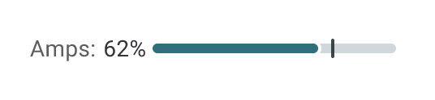
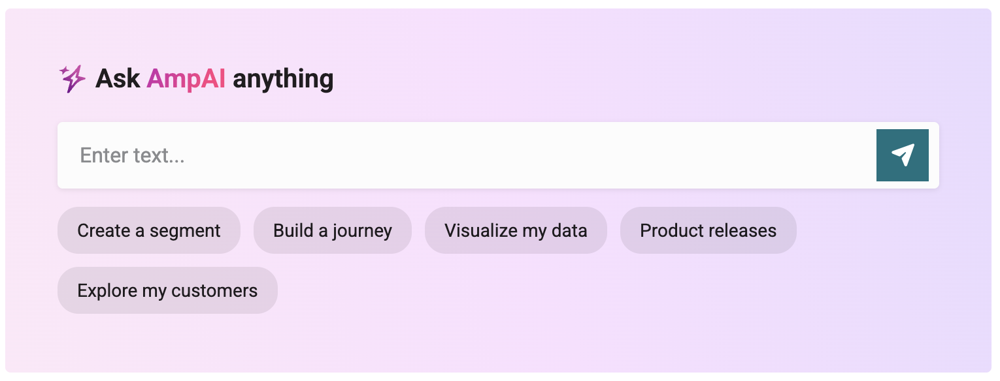
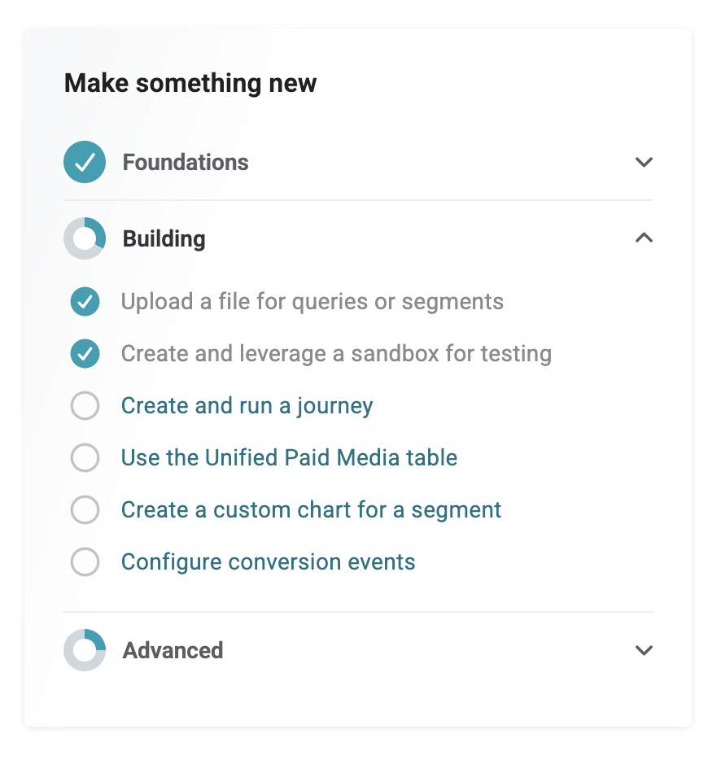
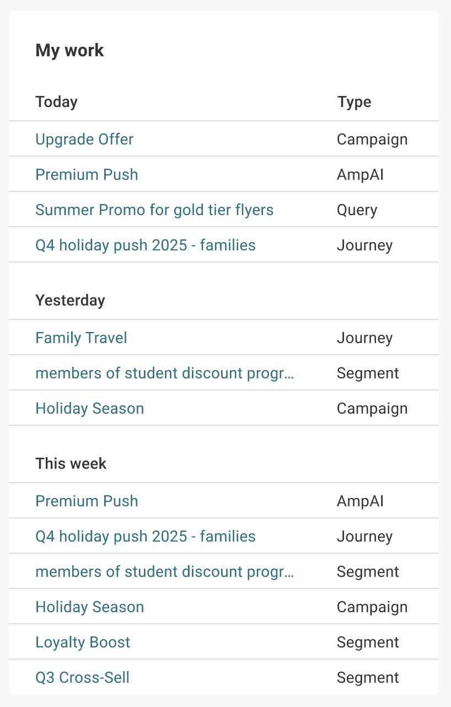
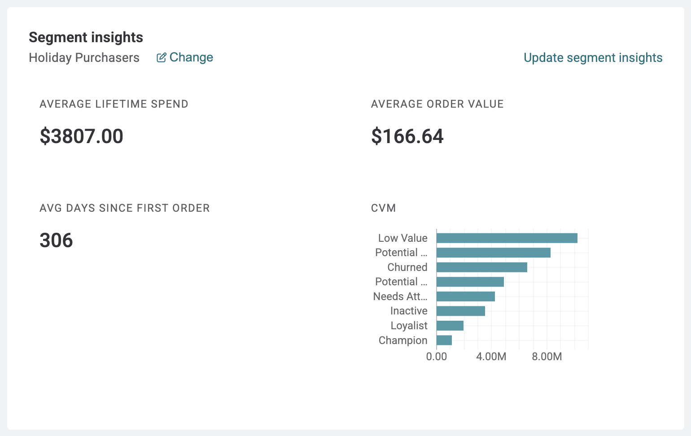
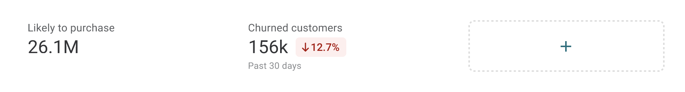
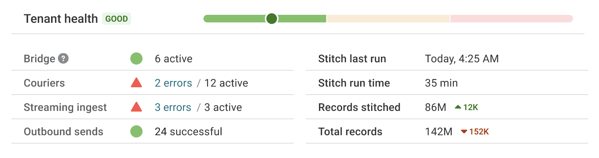

.. https://docs.amperity.com/reference/

.. meta::
    :description lang=en:
        The Home page provides an at-a-glance view of tenant health, Amps consumption, recent work, segment insights, and feature adoption.

.. meta::
    :content class=swiftype name=body data-type=text:
        The Home page provides an at-a-glance view of tenant health, Amps consumption, recent work, segment insights, and feature adoption.

.. meta::
    :content class=swiftype name=title data-type=string:
        About the Home page

==================================================
About the Home page
==================================================

.. home-start

The **Home** page is the default landing screen in Amperity. It consolidates tenant health, Amps consumption, AI interaction, recent work, segment insights, and a feature adoption checklist into a single view, giving you immediate visibility into the state of your tenant and clear pathways to take action.

.. home-end

.. _home-access:

How to access
==================================================

.. home-access-start

The **Home** page appears when you navigate to the root URL of your tenant. You can also navigate to the **Home** page from within the app by clicking the **Home** icon on the left navigation.

.. home-access-end

.. _home-what-you-see:

What you see
==================================================

.. home-what-you-see-start

The **Home** page adapts based on your tenant's configuration and the features that are enabled:

* The :ref:`Amps display area <home-amps>` is visible only for tenants that have Amps access. It is hidden for tenants without an Amps contract.
* Components that require a populated database, such as :ref:`Segment insights <home-segment-insights>`, show a prompt to run the database when no database has been run.
* Components that require features your tenant does not have enabled are hidden.
* Components requiring permissions you do not have are hidden or limited.

If you expect to see a component and do not, check with your Amperity administrator.

.. home-what-you-see-end

.. _home-amps:

Amps display
==================================================

.. home-amps-start

The Amps display shows your tenant's Amps consumption at a glance. It uses a percentage indicator with a progress bar that shows consumption against your contracted capacity.

The Amps display is clickable and navigates to the full :doc:`Amps <amps>` page, where you can view detailed consumption breakdowns.

.. important:: The Amps display area is visible only for tenants that have Amps access. It is hidden for tenants without an Amps contract.

.. home-amps-end

.. _home-ask-ampai:

Ask AmpAI
==================================================

.. home-ask-ampai-start

The **Ask AmpAI** section provides an embedded input field for submitting a question directly from the **Home** page. When you submit a query, Amperity navigates you to the :doc:`AmpAI <ampai>` page, where the response is loaded.

Use the **Ask AmpAI** section to start a conversation with AmpAI without navigating away from the **Home** page first.

.. home-ask-ampai-end

.. _home-make-something-new:

Make something new
==================================================

.. home-make-something-new-start

The **Make something new** section is a tenant-wide feature adoption checklist. It tracks your tenant's progress across foundational, building, and advanced use cases and provides links to the relevant features.

Each checklist item shows its completion state. Use the **Make something new** section to discover features your tenant has not yet adopted and to navigate directly to those features.

.. note:: The **Make something new** checklist reflects tenant-wide adoption, not individual user progress. Users without the required permissions can view the checklist as read-only.

.. home-make-something-new-end

.. _home-my-work:

My work
==================================================

.. home-my-work-start

The **My work** section shows your recently edited objects, grouped by time period: **Today**, **Yesterday**, and **This Week**. Each item includes the object name and type, and is a clickable link that navigates to that object.

**My work** shows a maximum of 10 records, sorted by most recent. It includes objects you have modified within the last 30 days. "Modified" means you created, edited the content of, or renamed the object. Opening an object without saving changes or edits made by other users are not included.

The following object types are supported:

* :doc:`Campaigns <campaigns>`
* :doc:`Queries <queries>`
* :doc:`Segments <segments>`
* :doc:`Journeys <journeys>`

.. home-my-work-end

.. _home-segment-insights:

Segment insights
==================================================

.. home-segment-insights-start

The **Segment insights** section displays metrics and a chart for a single segment that you select. The segment selection is saved across the tenant so that the **Home** page shows the same segment each time users in your tenant return to the **Home** page.

Use the **Segment insights** section to keep a key segment's performance visible at a glance without navigating to the :doc:`Segments <segments>` page.

.. home-segment-insights-end

.. _home-segment-metrics:

Segment metrics
==================================================

.. home-segment-metrics-start

The **Segment metrics** section displays a high level metric for up to three designated segments across the top of the **Home** page.

Contact your DataGrid Operator or Amperity administrator to add a segment metric. 

.. home-segment-metrics-end

.. _home-tenant-health:

Tenant health
==================================================

.. home-tenant-health-start

The **Tenant health** section displays the operational health of your tenant's key data pipelines and the most recent Stitch run. Use the **Tenant health** section to identify errors or confirm that your data pipelines are running as expected.

.. home-tenant-health-end

.. _home-tenant-health-pipelines:

Pipeline health
--------------------------------------------------

.. home-tenant-health-pipelines-start

**Pipeline health** shows counts for the following data pipeline components:

.. list-table::
   :widths: 30 70
   :header-rows: 1

   * - Component
     - Metrics shown
   * - Bridge
     - Active count
   * - Couriers
     - Error count, active count
   * - Streaming Ingest
     - Error count, active count
   * - Outbound Sends
     - Error count, successful count

.. home-tenant-health-pipelines-end

.. _home-tenant-health-stitch:

Stitch details
--------------------------------------------------

.. home-tenant-health-stitch-start

**Stitch details** show the following information about the most recent :doc:`Stitch <stitch>` run:

* Last run timestamp
* Run time
* AmpIDs (number of unique customer identities produced by Stitch)
* Total records stitched (number of source records processed by Stitch to create AmpIDs)

.. note:: AmpIDs are also displayed at the top of the **Home** page.

.. home-tenant-health-stitch-end
