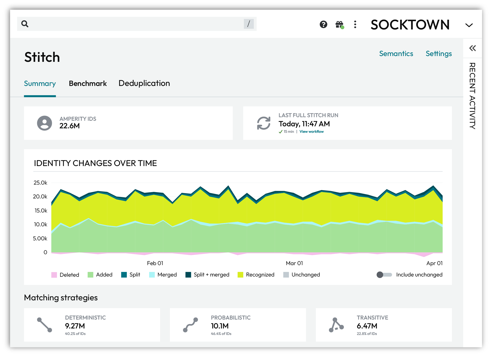
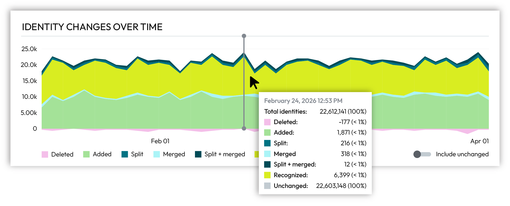
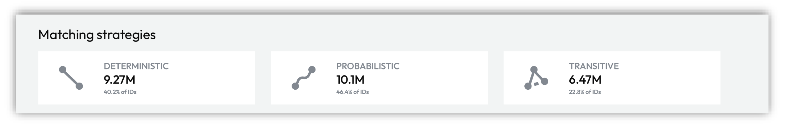
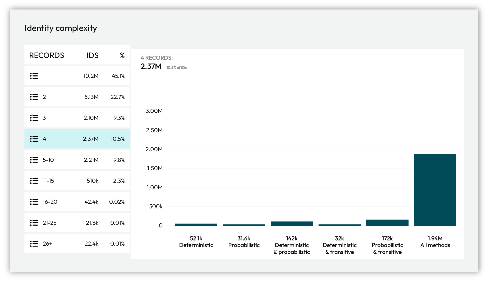

.. https://docs.amperity.com/infrastructure/

:orphan:

.. meta::
    :description lang=en:
        A summary of identity resolution, including identity changes over time and how matching strategies combine to identify complex profiles.

.. meta::
    :content class=swiftype name=body data-type=text:
        A summary of identity resolution, including identity changes over time and how matching strategies combine to identify complex profiles.

.. meta::
    :content class=swiftype name=title data-type=string:
        About Amperity cloud infrastructure

==================================================
About identity resolution
==================================================

.. idres-summary-about-start

.. include:: ../../shared/terms.rst
   :start-after: .. term-stitch-tab-start
   :end-before: .. term-stitch-tab-end

* :ref:`Summary tab <idres-summary-tab>`
* :ref:`Benchmark tab <idres-benchmark-tab>`
* :ref:`Deduplication tab <idres-deduplication-tab>`

.. idres-summary-about-end

.. _idres-summary-tab:

Summary
==================================================

.. include:: ../../shared/terms.rst
   :start-after: .. term-identity-resolution-start
   :end-before: .. term-identity-resolution-end

.. include:: ../../shared/terms.rst
   :start-after: .. term-stitch-summary-tab-start
   :end-before: .. term-stitch-summary-tab-end

.. idres-summary-tab-about-start

The **Summary** tab shows:

#. The number of unique customer profiles assigned an Amperity ID.

   .. include:: ../../shared/terms.rst
      :start-after: .. term-amperity-id-start
      :end-before: .. term-amperity-id-end

#. The last time a full Stitch run completed.
#. A graph for viewing :ref:`how identity changes over time <idres-summary-tab-identity-changes>`.
#. The percentage of profiles associated with :ref:`deterministic, probabilistic, and transitive matching strategies <idres-summary-tab-matching-strategies>`.
#. The :ref:`complexity of customer profiles <idres-summary-tab-identity-complexity>` based on the number of records in profiles, sorted by 1, 2, 3, 4, 5-10, 11-15, 16-20, 21-25, and 26+ records.

.. idres-summary-tab-about-end

.. _idres-summary-tab-identity-changes:

Identity changes over time
--------------------------------------------------

.. include:: ../../shared/terms.rst
   :start-after: .. term-adaptive-identity-start
   :end-before: .. term-adaptive-identity-end

.. image:: ../../images/mockup-idres-identity-changes.png
   :width: 600 px
   :alt: Identity changes over time
   :align: left
   :class: no-scaled-link

.. idres-summary-tab-identity-changes-table-start

.. idres-summary-tab-identity-changes-table-start

Changes, such as **Added**, **Merged**, or **Recognized**, are tracked for each identity graph over a 90-day time period.

.. list-table::
   :widths: 30 70
   :header-rows: 1

   * - Action
     - Description
   * - **Added**
     - A new Amperity ID was created and added to an identity graph.

       This type of change occurs when new customer records are added to Amperity.
   * - **Deleted**
     - An Amperity ID was deleted.

       This type of change occurs when records are removed from source data, such as after responding to a compliance processing request.
   * - **Merged**
     - Amperity IDs assigned to two or more profiles in the previous identity graph were combined into a single customer profile and assigned to an Amperity ID that existed in the previous identity graph.

       This type of change occurs when data clarifies connections between accounts that were not previously known to be related.

       .. include:: ../../shared/terms.rst
          :start-after: .. term-stitch-rules-start
          :end-before: .. term-stitch-rules-end

   * - **Recognized**
     - Additional records were appended to a customer profile in an identity graph that was assigned an Amperity ID without a **Merge**, **Split**, or **Split + Merge** operation.

       This type of change occurs during real-time workflows.

       .. include:: ../../shared/terms.rst
          :start-after: .. term-identity-recognition-start
          :end-before: .. term-identity-recognition-end

       Sometimes what is known is an app or website login that uses an email address or a phone number. Sometimes what is known is a durable identifier, such as a loyalty account ID. Sometimes what is known is a machine-issued digital identifier for Google Ads ID, a mobile device ID, or an advertising-related temporal identifier, such as a pixel ID.

   * - **Split**
     - Am Amperity ID assigned to a customer profile from the previous identity graph was split into two or more new customer profiles. New Amperity IDs were assigned to the new customer profiles.

       This type of change occurs when new data clarifies ownership of a shared source identifier, such as a device ID, email address, or phone number.

       .. include:: ../../shared/terms.rst
          :start-after: .. term-stitch-rules-start
          :end-before: .. term-stitch-rules-end

   * - **Split + merged**
     - Multiple Amperity IDs from the previous identity graph were split from existing profiles, and then merged into new customer profiles and assigned new Amperity IDs.

       This type of change occurs when new data provides clarity to sparse records.

       .. include:: ../../shared/terms.rst
          :start-after: .. term-stitch-rules-start
          :end-before: .. term-stitch-rules-end

   * - **Unchanged**
     - An Amperity ID did not change.

.. idres-summary-tab-identity-changes-table-end

.. include:: ../../shared/terms.rst
   :start-after: .. term-record-pair-start
   :end-before: .. term-record-pair-end

.. idres-summary-tab-identity-changes-hover-start

Hover over individual days in the chart that shows identity changes over time to view statistics for specific days.

.. idres-summary-tab-identity-changes-hover-end

.. _idres-summary-tab-matching-strategies:

Matching strategies
--------------------------------------------------

.. include:: ../../shared/terms.rst
   :start-after: .. term-customer-data-platform-start
   :end-before: .. term-customer-data-platform-end

.. include:: ../../shared/terms.rst
   :start-after: .. term-identity-graph-start
   :end-before: .. term-identity-graph-end

.. idres-summary-tab-matching-strategies-start

Each identity graph is a combination of deterministic, probabilistic, and transitive connections. As the data your brand collects changes the data your brand makes available to Amperity changes. Amperity adapts and updates the customer profiles and keychains within in the identity graph to relect the current state of your customer data.

* :ref:`Deterministic matching <idres-summary-tab-matching-strategy-deterministic>`
* :ref:`Probabilistic matching <idres-summary-tab-matching-strategy-probabilistic>`
* :ref:`Transitive matching <idres-summary-tab-matching-strategy-transitive>`

.. idres-summary-tab-matching-strategies-end

.. _idres-summary-tab-matching-strategy-deterministic:

Deterministic matching
++++++++++++++++++++++++++++++++++++++++++++++++++

.. include:: ../../shared/terms.rst
   :start-after: .. term-deterministic-connection-start
   :end-before: .. term-deterministic-connection-end

.. idres-summary-tab-matching-strategy-deterministic-context-start

<context>

.. idres-summary-tab-matching-strategy-deterministic-context-end

.. _idres-summary-tab-matching-strategy-probabilistic:

Probabilistic matching
++++++++++++++++++++++++++++++++++++++++++++++++++

.. include:: ../../shared/terms.rst
   :start-after: .. term-probabilistic-connection-start
   :end-before: .. term-probabilistic-connection-end

.. idres-summary-tab-matching-strategy-probabilistic-context-start

<context>

.. idres-summary-tab-matching-strategy-probabilistic-context-end

.. _idres-summary-tab-matching-strategy-transitive:

Transitive matching
++++++++++++++++++++++++++++++++++++++++++++++++++

.. include:: ../../shared/terms.rst
   :start-after: .. term-transitive-connection-start
   :end-before: .. term-transitive-connection-end

.. idres-summary-tab-matching-strategy-transitive-context-start

<context>

.. idres-summary-tab-matching-strategy-transitive-context-end

.. _idres-summary-tab-matching-strategy-categories:

About match categories
++++++++++++++++++++++++++++++++++++++++++++++++++

.. include:: ../../shared/terms.rst
   :start-after: .. term-match-category-start
   :end-before: .. term-match-category-end

.. include:: ../../shared/terms.rst
   :start-after: .. term-match-type-start
   :end-before: .. term-match-type-end

.. _idres-summary-tab-identity-complexity:

Identity complexity
--------------------------------------------------

.. idres-summary-tab-identity-complexity-start

Each identity graph is a combination of deterministic, probabilistic, and transitive connections. As the data your brand collects changes the data your brand makes available to Amperity changes. Amperity adapts and updates the customer profiles and keychains within in the identity graph to relect the current state of your customer data.

.. idres-summary-tab-identity-complexity-end

.. idres-summary-tab-identity-complexity-table-start

.. list-table::
   :widths: 30 70
   :header-rows: 1

   * - Action
     - Description
   * - **Deterministic only**
     - Customer profiles built using only deterministic matching.

   * - **Probabilistic only**
     - Customer profiles built using only probabilistic matching.

   * - **Deterministic and probabilistic**
     - Customer profiles built using a combination of deterministic and probabilistic matching.

   * - **Deterministic and transitive**
     - Customer profiles built using a combination of deterministic and transitive matching.

   * - **Probabilistic and transitive**
     - Customer profiles built using a combination of probabilistic and transitive matching.

   * - **All strategies**
     - Customer profiles built using a combination of deterministic, probabilistic, and transitive matching

.. idres-summary-tab-identity-complexity-table-end

.. _idres-benchmark-tab:

Benchmark
==================================================

.. stitch-benchmark-start

Stitch benchmarks are heuristic scores that define the expectations for the quality of customer profiles that are output by Stitch. Each benchmark evaluates your brand's data and compares it to a baseline score.

Use benchmarks to explore data quality, directly provide feedback to the quality of Stitch results, and to explore configuration changes that can help improve the quality of customer profiles in your tenant.

.. stitch-benchmark-end

.. include:: ../../amperity_reference/source/stitch_results.rst
   :start-after: .. stitch-run-type-incremental-match-note-start
   :end-before: .. stitch-run-type-incremental-match-note-end

.. _idres-deduplication-tab:

Deduplication
==================================================

.. include:: ../../shared/terms.rst
   :start-after: .. term-deduplication-start
   :end-before: .. term-deduplication-end

.. include:: ../../shared/terms.rst
   :start-after: .. term-deduplication-rate-start
   :end-before: .. term-deduplication-rate-end

