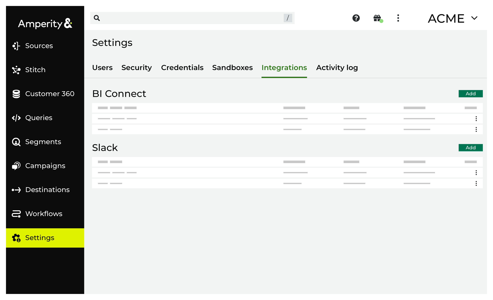

.. https://docs.amperity.com/reference/

.. meta::
    :description lang=en:
        Configure the Slack integration to send workflow alerts to your organization's Slack channels.

.. meta::
    :content class=swiftype name=body data-type=text:
        Configure the Slack integration to send workflow alerts to your organization's Slack channels.

.. meta::
    :content class=swiftype name=title data-type=string:
        Integrations

==================================================
About integrations
==================================================

.. settings-integrations-start

The following integrations may be configured from the **Integrations** tab on the **Settings** page:

* :ref:`Send workflow alerts to Slack channels <settings-integration-slack>`

.. settings-integrations-end

.. _settings-integration-slack:

About Slack
==================================================

.. workflows-howto-slack-start

You can configure Amperity to send workflow alerts to channels in your brand's Slack workspace. This configuration requires the following steps:

#. :ref:`Authorize your Slack workspace <workflows-howto-slack-authorize>`
#. :ref:`Configure one or more Slack channels for workflow alerts <workflows-howto-slack-channels>`

.. workflows-howto-slack-end

.. _settings-integration-bigquery:

About Google BigQuery
==================================================

.. settings-integration-bigquery-start

When Amperity is configured to `sync data from Google BigQuery <../operator/bridge_google_bigquery.html>`__ the service account identifier is listed on the **Integrations** tab. The service account identifier is configured in Google BigQuery as the principal and is assigned the "Analytics Hub Subscriber" role.

.. settings-integration-bigquery-end