.. https://docs.amperity.com/reference/

.. meta::
    :description lang=en:
        A journey is an automated sequence that connects customers across channels and your brand's marketing campaigns.

.. meta::
    :content class=swiftype name=body data-type=text:
        A journey is an automated sequence that connects customers across channels and your brand's marketing campaigns.

.. meta::
    :content class=swiftype name=title data-type=string:
        About journeys

==================================================
About journeys
==================================================

.. include:: ../../shared/terms.rst
   :start-after: .. term-journey-start
   :end-before: .. term-journey-end

.. journeys-about-context-start

By using **Journeys**, marketers can implement cross-channel strategies, improve targeting precision, and activate the right message at the right moment to drive better engagement and higher conversions.

.. journeys-about-context-end

.. _journeys-howitworks:

How journeys work
==================================================

.. journeys-howitworks-start

A journey starts with a defined audience that moves through a series of interactions based on criteria you specify, like customer behavior, attributes, or engagement history. The sequence can branch depending on what conditions you set, so that customers have a different experience depending on what actions they take.

.. journeys-howitworks-end

.. journeys-howitworks-context-start

Here is an example of a built-out journey:

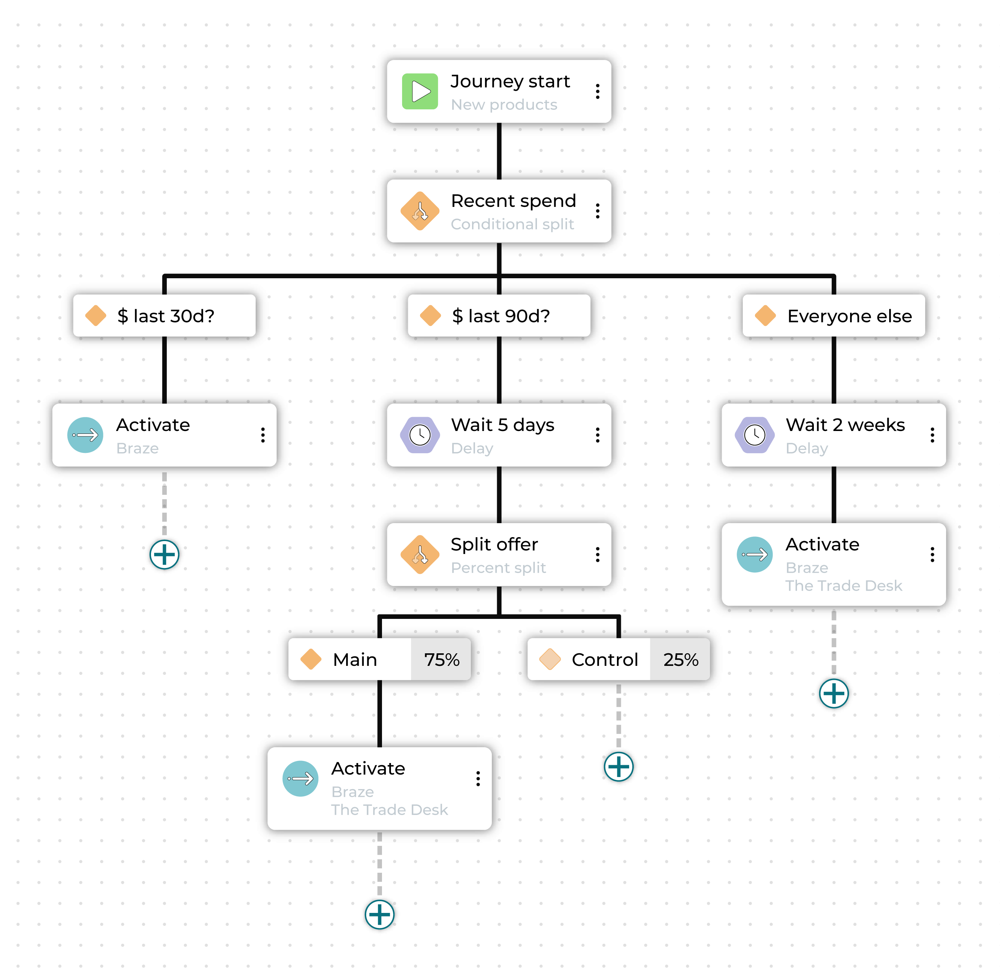

In this case, the marketer is offering high-value customers early access to new products before general release in two weeks. They start by creating an audience segment made up of customers in the top 10% of customer lifetime value.

The first step divides this audience into three sub-audiences: those who purchased in the last 1-30 days, those whose purchased in the last 31-90 days, and those whose most recent purchase was more than 90 days ago.

Each different audience is sent down a different path toward activation in a marketing channel.

* The high-value customers who purchased most recently are contacted immediately, giving them exclusive early access.
* The high-value customers who purchased between 1 and 3 months ago are set for a delay followed by an activation, as a second wave of early access.
* Additionally, this audience is further split, so that 75% receive a special promotion and 25% do not, to see how important an added incentive is for getting customers to purchase again.
* Finally, the high-value customers who have not purchased in the last three months are contacted when the new products become available to make sure they are among the first to know.

The journey can be further built out beyond this, with additional splits based on whether or not customers purchase or how they engage with the communications they receive.

.. journeys-howitworks-context-end

.. _journeys-setup:

Journey setup
==================================================

.. journeys-setup-start

**Journeys** require that segments are available and that at least one destination has been configured.

Access the **Journeys** canvas by selecting **Journeys** at the top of the **Activations** page, and then click **Create journey**.

.. journeys-setup-end

Name a journey
--------------------------------------------------

.. journeys-setup-name-start

Enter a name in the **Journey Name** field.

A journey should be assigned a name that makes it easy to find and for other Amperity users to understand.

.. journeys-setup-name-end

.. journeys-setup-name-tip-start

.. tip:: Use good naming patterns to ensure that you can always find your journeys in the various applications to which you sends them. The journey name will *always* appear in the filename that is sent to any destination.

   Avoid duplication between journey and treatment group names.

   Avoid using the names of destinations as journey names unless the journey is sent to *only* that destination.

   Use a naming pattern that ensures the journey name works across every treatment group that is configured within any sub-audience.

   If brand names or region names apply to all sub-audiences in the journey, consider using them within the journey name.

   Some examples:

   * "Birthdays_Under_40"
   * "Acme_Churn"
   * "Churn_HighValue_Early"
   * "Socktown_High_AOV"

.. journeys-setup-name-tip-end

.. _journeys-setup-who-enters:

Who enters?
--------------------------------------------------

.. journeys-setup-who-enters-start

Every journey starts with an audience defined by one or more segments that determine which users enter this journey.

Choose one or more segments from the **Select inclusion segments** dropdown list. The customers in that list will become the audience for this campaign.

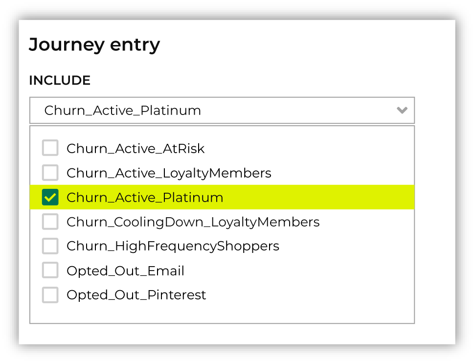

.. journeys-setup-who-enters-end

.. journeys-setup-who-enters-note-start

.. note:: When adding multiple inclusion segments, all segments are unioned, so a customer only needs to match one of the segments in the inclusion category in order to be considered part of it. You may add up to ten inclusion segments. 

.. journeys-setup-who-enters-note-end

.. important:: **Segment filtering by database**

   Each journey is associated with a specific database. This database is set automatically when you select your first inclusion segment.
   
   Once that first inclusion segment is selected:
   
   * The journey is tied to the same database as that segment
   * Viability of the journey depends on the database functioning with no errors.
   * All other segments--whether inclusion, exlcusion, or exit--are filtered to only show segments from that database.
   * Similarly, the activation ID associated with the initial segment determines the activation ID for all other segments to ensure consistency across the journey. For example, if the initial segment activates based on email, then other segments will only include customers with valid email addresses. 
   
   To change the database associated with a journey, you must first remove all inclusion segments. Then, when you select a new first inclusion segment from a different database, the journey's database updates accordingly.

.. _journeys-setup-who-is-excluded:

Who is excluded?
--------------------------------------------------

.. journeys-setup-who-is-excluded-start

Sometimes a journey needs to exclude certain members of your audience. For example, a journey aimed at churn prevention often excludes customers who have opted-out of SMS messaging or who have unsubscribed from an email list.

When you need to exclude audience members, choose one or more segments from the **Select exclusion segments** dropdown list. The customers in an exclusion list will be removed from the audience for this journey.

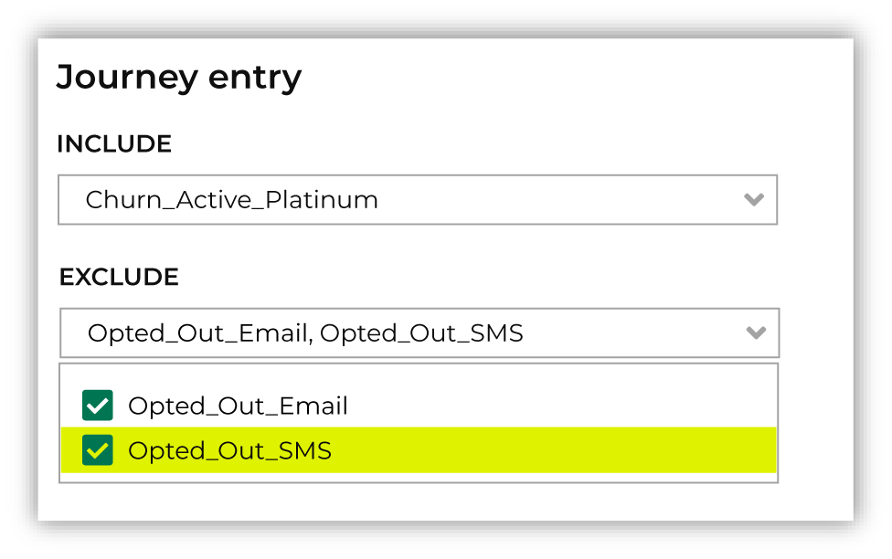

.. journeys-setup-who-is-excluded-end

.. journeys-setup-who-is-excluded-note-start

.. note:: When adding multiple exclusion segments, all segments are unioned, so a customer only needs to match one of the segments in the exclusion category in order to be considered part of it. You may add up to ten exclusion segments. 

.. journeys-setup-who-is-excluded-note-end

.. _journeys-exit-conditions:

Exit conditions
--------------------------------------------------

.. journeys-exit-conditions-start

Some customers should exit a journey when a particular criterion has been fulfilled. For example:

* The goal of a churn prevention campaign is to convince a customer to make a purchase. If a customer who is part of a churn prevention campaign makes a purchase they should be removed from the campaign.

* An audience starts with customers who have opted in to receiving marketing messages from your brand. If a customer who is part of that journey later opts out they should be removed from the campaign.

Exit conditions are defined using a segment. One or more segments that define exit conditions may be added to a journey using the **Select exit segments** dropdown.

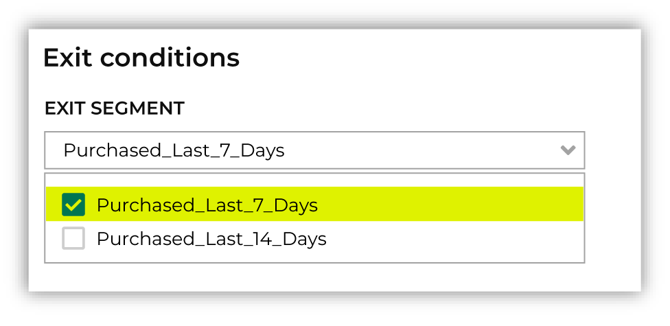

.. journeys-setup-exit-conditions-note-start

.. note:: When adding multiple exit condition segments, all segments are unioned, so a customer only needs to match one of the segments in the exit conditions category in order to be considered part of it. You may add up to ten exit condition segments.

.. journeys-setup-exit-conditions-note-end

.. journeys-exit-conditions-end

.. _journeys-goal-conditions:

Goal conditions
--------------------------------------------------

.. journeys-goal-conditions-start

Setting goals allows you to track when customers included in the journey reach designated segments. This differs from an exit condition in that reaching a goal segment does not remove the customer from the journey, allowing you to measure progress on specific business goals while the customer continues on the journey.

Goal conditions are defined using a segment. One or more segments that define goal conditions may be added to a journey using the **Select goal segments** dropdown.

.. journeys-setup-goals-conditions-note-start

.. note:: When adding multiple goal condition segments, all segments are unioned, so a customer only needs to match one of the segments in the goal conditions category in order to be considered part of it. You may add up to five goal condition segments.

.. journeys-setup-goals-conditions-note-end

.. journeys-setup-goals-batch-admonition-start

.. important:: Journey goals require batch segments (SQL-based segments). Real-time segments are not currently supported for journey goals.

.. journeys-setup-goals-batch-admonition-end

.. journeys-goal-conditions-end

.. _journeys-allow-reentry:

Allow re-entry?
--------------------------------------------------

.. journeys-allow-reentry-start

If a journey is set to recur, you can allow the same customer to re-enter the journey on its next run if the customer has both previously exited the journey and once again qualifies for the inclusion segment.

.. journeys-allow-reentry-note-start

.. note:: When a journey is set to run on a recurring schedule, only customers who have newly qualified for the **inclusion** segment since the last run will enter the journey.

   For example, if the segment had 1,500 members at launch, all 1,500 would enter the journey.

   On the next run, if the segment has grown to 1,700, only the 200 new members--those who joined the segment after the previous run--are guaranteed to be included.

   If you have selected **Allow re-entry** customers who have previously exited the journey must re-qualify for the inclusion segment. For example, if the segment is based on a time window, such as "purchased in the last 7 days", and they meet the criteria again, they can re-enter.

   To prevent this, use an **exclusion** segment to filter out users who have already participated, or who meet other disqualifying conditions.

.. journeys-allow-reentry-note-end

.. journeys-allow-reentry-end

.. TODO: reproduce edits in allow re-entry section below

.. _journeys-canvas:

Journeys canvas
==================================================

.. journeys-canvas-start

After establishing the audience and starting conditions of the journey, you will be taken to the **Journeys** canvas. This is the interface where you determine the steps of the journey and define how your brand will interact with customers at each step.

.. journeys-canvas-end

.. journeys-node-types-start

The following building blocks are available to users for creating journeys:

* :ref:`journeys-node-start`
* :ref:`journeys-node-activate`
* :ref:`journeys-node-delay`
* :ref:`journeys-node-split-conditional`
* :ref:`journeys-node-split-percent`
* :ref:`journeys-node-split-individual`
* :ref:`journeys-node-merge`

.. journeys-node-types-end

.. _journeys-ai-assistant:

About the Journeys AI Assistant
--------------------------------------------------

.. journeys-ai-assistant-start

The :doc:`Journeys AI Assistant <assistant>` is a generative AI feature within the **Journeys** canvas that lets you use natural language to edit and personalize journeys.

.. journeys-ai-assistant-end

.. _journeys-node-start:

Journey start
--------------------------------------------------

.. journeys-node-start-start

.. include:: ../../shared/terms.rst
   :start-after: .. term-journey-node-start-start
   :end-before: .. term-journey-node-start-end

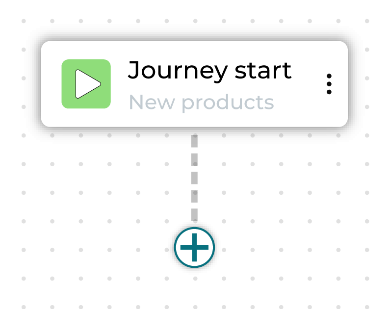

To edit inclusions, exclusions, or exit conditions, click on the **Journey setup** sidebar. Click the plus button underneath to add nodes to the journey.

.. journeys-node-start-end

.. _journeys-node-activate:

Activate
--------------------------------------------------

.. journeys-node-activate-start

.. include:: ../../shared/terms.rst
   :start-after: .. term-journey-node-activate-start
   :end-before: .. term-journey-node-activate-end

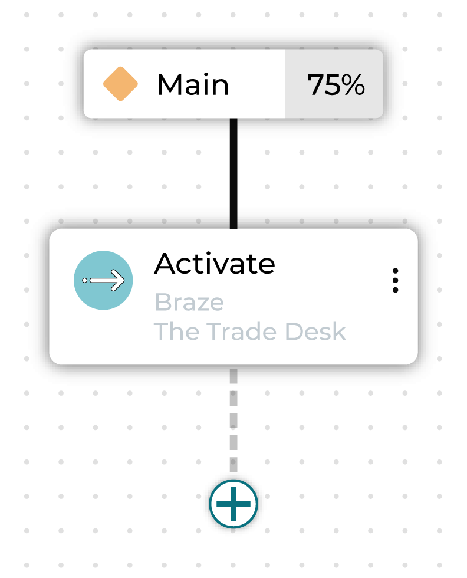

You can rename the activate node.

You can configure a single activation node to send to multiple destinations at once, and this is recommended for simplicity and efficiency.

.. journeys-node-activate-note-start

.. note:: If you are activating to several destinations and each one uses different custom attributes, you will need to create a separate activation node for each destination to assign those attributes correctly.

.. journeys-node-activate-note-end

.. journeys-node-activate-filename-conflict-tip-start

.. tip:: **Avoid activation file naming conflicts**

   Running a journey generates a file for every activation node. The filename is constructed using:
   
   * the **journey name**
   * the **activation node name**
   
   If multiple activation nodes have the same filename, it will cause an error. 
   
   To avoid this error, make sure each activation node within a journey has a unique name. Renaming the node will automatically update the generated filename.
   
   You can check an activation node's path and file name in the **Node configuration** panel on the righthand side of the **Journeys** canvas, under "Destination Summary". 

.. journeys-node-activate-filename-conflict-tip-end 

.. TODO: add screenshot

.. journeys-node-activate-end

.. _journeys-node-delay:

Delay
--------------------------------------------------

.. journeys-node-delay-start

.. include:: ../../shared/terms.rst
   :start-after: .. term-journey-node-delay-start
   :end-before: .. term-journey-node-delay-end

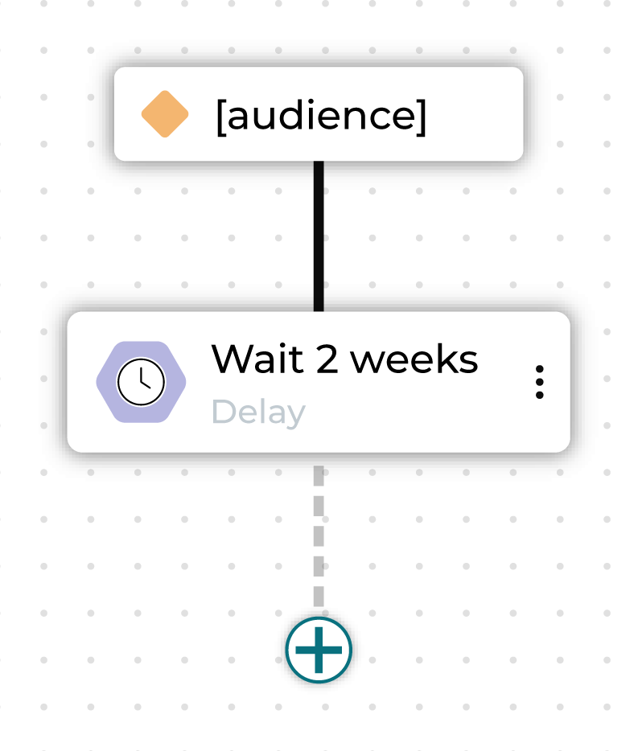

Choose a combination of an integer plus "days", "weeks", or "months" to designate how long to wait before the next step in the journey begins.

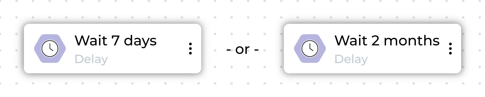

A delay is applied to a single parent node.

You can rename the delay node.

.. important:: Customers do not automatically move forward after the wait period ends. Progression only occurs the next time the journey runs.
   
   For example, if a delay node is set to 3 days but the journey is scheduled to run weekly, customers will remain at the delay node until the next scheduled run, waiting up to 7 days.
   
   If a journey is set to run only once, customers will not move beyond the delay node after it executes.

.. journeys-node-delay-end

.. _journeys-node-split-conditional:

Conditional split
--------------------------------------------------

.. journeys-node-split-conditional-start

.. include:: ../../shared/terms.rst
   :start-after: .. term-journey-node-conditional-split-start
   :end-before: .. term-journey-node-conditional-split-end

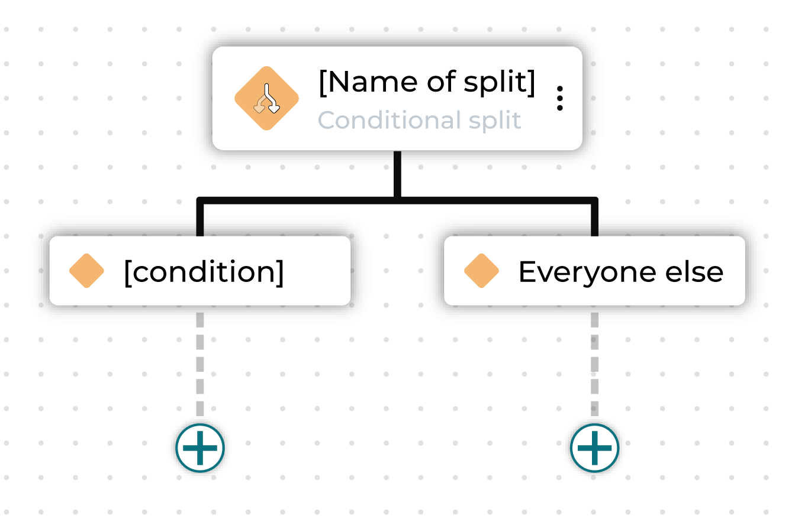

These segments may already exist or may be defined within this journey using custom criteria.

You can rename the individual conditional split node and rename the "Everyone else" sub-audience.

.. journeys-node-split-conditional-end

.. _journeys-node-split-percent:

Percent split
--------------------------------------------------

.. journeys-node-split-percent-start

.. include:: ../../shared/terms.rst
   :start-after: .. term-journey-node-percent-split-start
   :end-before: .. term-journey-node-percent-split-end

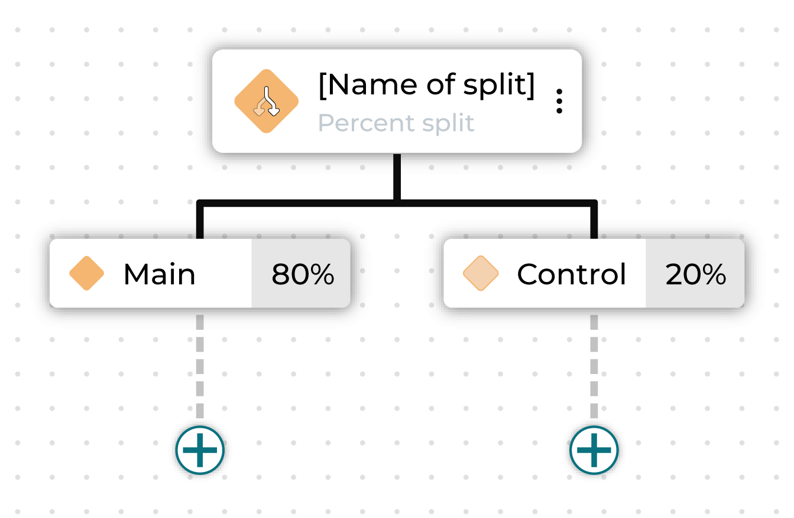

The percentage of all individual nodes under a percent split must add up to 100% of the audience, including the control group.

You can rename the percent split node and rename the individual paths.

.. journeys-node-split-percent-end

.. _journeys-node-split-individual:

Individual split
--------------------------------------------------

.. journeys-node-split-individual-start

.. include:: ../../shared/terms.rst
   :start-after: .. term-journey-node-individual-split-start
   :end-before: .. term-journey-node-individual-split-end

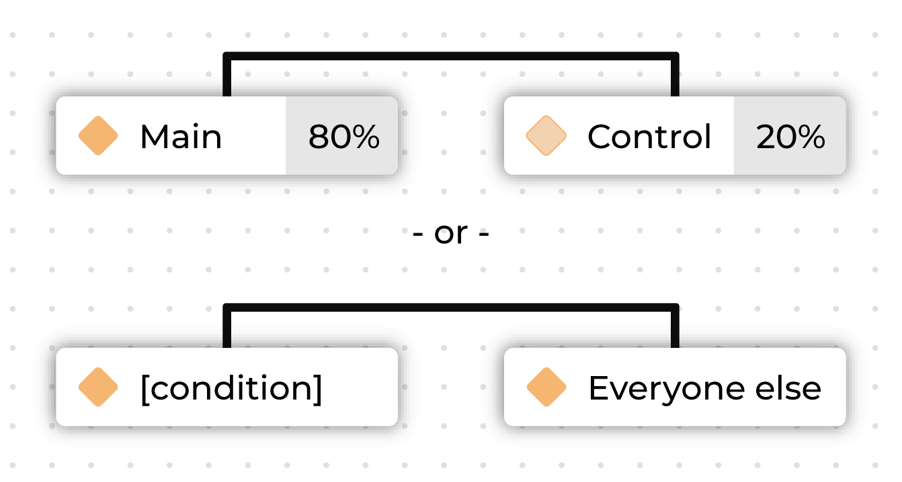

.. note:: To edit sub-audiences conditions and naming, click into the parent node.

.. journeys-node-split-individual-end

.. _journeys-node-merge:

Merge
--------------------------------------------------

.. journeys-node-merge-start

.. include:: ../../shared/terms.rst
   :start-after: .. term-journey-merge-start
   :end-before: .. term-journey-merge-end

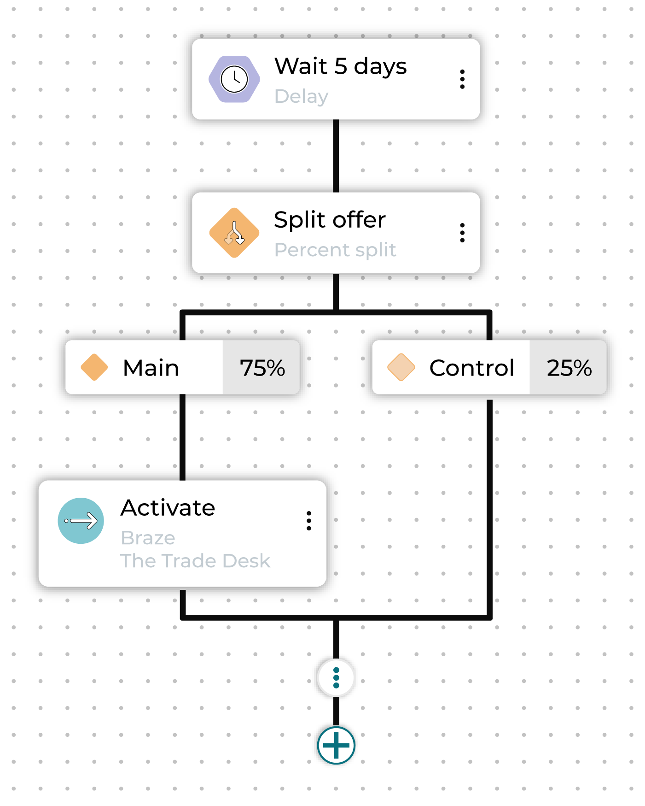

.. note:: The option to merge only appears when you click the plus button below a split.

.. note:: If a journey ends on a merge, that merge is removed upon saving the journey because a closing merge does not result in any action.

.. note:: Merging an outer path will first merge the inner path.

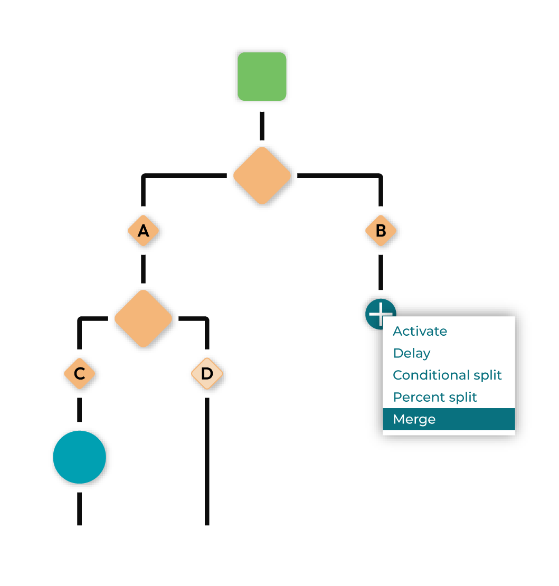
   
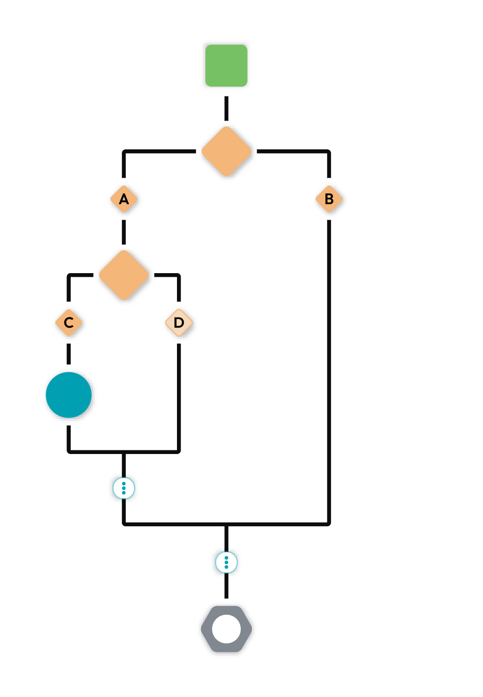

.. journeys-node-merge-end

Add a node
--------------------------------------------------

.. journeys-node-add-start

Click the plus button to add a node to the journey. May be one of "Activate", "Delay", "Conditional Split", or "Percent Split." 

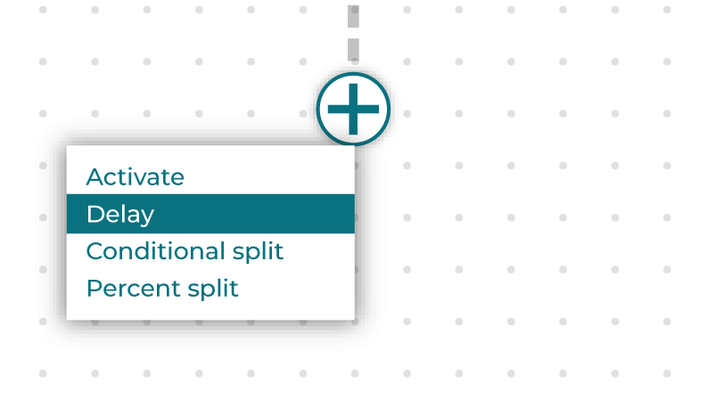

If the plus button is after a split node, there will also be the option to choose "Merge."

.. journeys-node-add-end

.. _journeys-measurement:

Journey measurement
==================================================

.. journeys-measurement-overview-start

.. include:: ../../shared/terms.rst
   :start-after: .. term-journey-measurement-start
   :end-before: .. term-journey-measurement-end

.. TODO: make image

.. .. image:: ../../images/mockup-journeys-measurement-overview.png
   :width: 600 px
   :alt: Journey goals and measurement overview
   :align: left
   :class: no-scaled-link

Journey measurement helps you:

* Track customer milestones including journey exits and goal achievements
* Measure progress toward specific business goals without removing customers from the journey
* Calculate path-specific goal achievement via percent-split testing
* View metrics across multiple time windows (7, 30, and 90 days)
* Export detailed journey travel logs for advanced analysis

.. important:: Journey measurement requires batch segments (SQL-based segments). Real-time segments are not currently supported for journey measurement.

.. journeys-measurement-overview-end

.. _journeys-measurement-how-it-works:

How measurement works
--------------------------------------------------

.. journeys-measurement-how-it-works-start

Journey measurement uses two primary data structures to track customer progress:

**Journey Travel Log (JTL)** records every stage transition with enriched metadata including:

* Journey and stage identifiers
* Traveler entry and exit timestamps
* Split path details (test group names, control flags)
* Exit segment information when applicable

**Milestones** dashboard tracks significant events including:

* Goal achievements (customers meeting success criteria after entering the journey; will not show customers already in the goal segment at the start fo the journey)
* Exit events (customers leaving the journey)
* Complete path reconstruction for each traveler
* Time-based aggregations (all-time, 7-day, 30-day, 90-day windows)

.. journeys-measurement-how-it-works-end

.. _journeys-measurement-types:

Types of journey goals
--------------------------------------------------

.. journeys-measurement-types-start

Journey goals can be configured at two levels:

**Journey-level goals**
Applied to the entire journey to track overall success metrics:

* Track achievement regardless of path taken
* Available in the Journey Goals card on the canvas
* Maximum 5 goal segments per journey

**Percent-split goals**
Applied to specific percent-split nodes for A/B testing:

* Track achievement by split path (test vs control)
* Enable incremental lift calculation
* Available when configuring percent-split nodes
* Maximum 2 goal segments per percent-split node

.. important:: The total number of goal segments across your entire journey (journey-level + all percent-split nodes) cannot exceed 10.

.. journeys-measurement-types-end

.. _journeys-measurement-milestones:

Milestones tracking
--------------------------------------------------

.. journeys-measurement-milestones-start

The milestones dashboard on the Journeys canvas capture significant events as customers travel through your journey. The system automatically tracks:

* **Goal milestones** - Customer achieved a journey or split goal
* **Exit milestones** - Customer met exit criteria and left the journey

**Milestone metrics:**

.. list-table::
   :widths: 30 50
   :header-rows: 1

   * - Metric
     - Description
   * - All-time count
     - Total milestone achievements since journey start
   * - Past 7 days
     - Achievements in the last 7 days
   * - Past 30 days
     - Achievements in the last 30 days
   * - Past 90 days
     - Achievements in the last 90 days
   * - Median duration
     - Median time in days from journey entry to milestone achievement

.. tip:: Use time-windowed metrics to understand recent performance trends and seasonal patterns in goal achievement.

.. journeys-measurement-milestones-end

.. _journeys-measurement-percent-split-testing:

Percent-split testing
--------------------------------------------------

.. journeys-measurement-percent-split-testing-start

Percent-split nodes with goals configured enable A/B testing capabilities. Goals set for percent-split nodes only apply to customers passing through that node, rather than all customers in the journey.

.. TODO: make image

.. .. image:: ../../images/mockup-journeys-split-goals.png
   :width: 600 px
   :alt: Percent-split goals with path tracking
   :align: left
   :class: no-scaled-link

**Configuration requirements**

* One path must be designated as the control group
* Other paths become test groups
* Weights must sum to exactly 100%
* Maximum 2 goal segments per split node
* Must be configured before the journey begins in order to record goals

**Path-specific metrics**

The system tracks goal achievement by path, enabling calculation of:

* Conversion count per path
* Incremental lift (test vs control)
* Time-windowed performance comparison
* Path reconstruction showing exact journey taken

.. tip:: After accumulating data, review the path-specific metrics to determine which path performs better. Consider adjusting split percentages based on lift results.

.. journeys-measurement-percent-split-testing-end

.. _journeys-measurement-travel-log:

Journey Travel Log
--------------------------------------------------

.. journeys-measurement-travel-log-start

The Journey Travel Log (JTL) provides detailed tracking of every traveler's journey with enriched metadata.

.. TODO: delete type column?  ABC vs XXX? Also, ABS in app. Alphabetical Order?

**Travel log schema:**

.. list-table::
   :widths: 25 20 55
   :header-rows: 1

   * - Field
     - Type
     - Description
   * - journey_version
     - String
     - Journey version ID (jnv-xxx)
   * - stage_id
     - String
     - Node ID (jnn-xxx) or lifecycle stage (start, complete, exit, orphan)
   * - event_id
     - String
     - Customer identifier, typically based on Amperity ID
   * - entry_at
     - Datetime
     - When the traveler entered a given node
   * - parent_id
     - String
     - ID of previous node customer passed through
   * - parent_name
     - String
     - Name of the parent node
   * - journey_id
     - String
     - ID of journey in URL (jny-xxx) 
   * - journey_name
     - String
     - Name of journey
   * - stage_name
     - String
     - Name of node
   * - stage_type
     - String
     - Node type (activation, wait, merge, percent-split, conditional-split)
   * - test_group_name
     - String
     - For percent-splits: name of the test group
   * - is_control
     - Boolean
     - For percent-splits: true if control path
   * - split_condition_name
     - String
     - Name of the split condition node corresponding with this path
   * - is_remaining
     - Boolean
     - For conditional-splits: whether this is the last default path
   * - exit_segments
     - String
     - Pipe-separated list of exit segment names (if exited)
   * - mxs_ids
     - String
     - Pipe-separated list of exit segment IDs
   

**Journey Travel Log export**

Travel log data can be exported to external systems for advanced analysis:

* Path reconstruction
* Split performance analysis
* Exit pattern identification
* Time-to-goal calculations

Exporting automatically enriches metadata with node details, and includes exit information when applicable. 

Only exports previously unsent entries (tracked via egress_sent_at). 

Journey Travel Log export supports batch export to data warehouses.

.. journeys-measurement-travel-log-end

.. _journeys-use-cases:

Journeys Use Cases
==================================================

.. journeys-reference-use-cases-start

To help you get started with journeys, Amperity provides example journeys of common and effective use cases. These examples show how to structure your canvas flow and how to use different channels to achieve specific business goals.

.. include:: ../../amperity_user/source/journeys_reference.rst
   :start-after: .. journeys-use-case-examples-note-start
   :end-before: .. journeys-use-case-examples-note-end

**Example journeys use cases**

.. list-table::
   :widths: 30 70
   :header-rows: 1

   * - Use Case
     - Goal

   * - `New customer <https://docs.amperity.com/user/journeys_reference.html#new-customer>`__
     - Turn a new subscriber or customer into an engaged participant by providing helpful, sequenced information.

   * - `Abandoned cart <https://docs.amperity.com/user/journeys_reference.html#abandoned-cart>`__
     - Convert users who started a purchase but didn't finish.

   * - `Birthday <https://docs.amperity.com/user/journeys_reference.html#birthday>`__
     - Drive immediate, high-margin revenue through personalized, time-sensitive offers.

   * - `Product consideration <https://docs.amperity.com/user/journeys_reference.html#product-consideration>`__
     - Convert recent browsers or product page viewers into purchasers.

   * - `Cross-sell <https://docs.amperity.com/user/journeys_reference.html#cross-sell>`__
     - Increase Average Order Value (AOV) by recommending complementary products post-purchase.

   * - `Seasonal campaign <https://docs.amperity.com/user/journeys_reference.html#seasonal-campaign>`__
     - Drive revenue during key shopping periods using high-precision audience segmentation.

   * - `Loyalty tier upgrade <https://docs.amperity.com/user/journeys_reference.html#loyalty-tier-upgrade>`__
     - Incentivize high-value customers who are close to the next tier to achieve that level.

   * - `Car test drive <https://docs.amperity.com/user/journeys_reference.html#car-test-drive>`__
     - Convert website interest into an in-person appointment or service booking.

   * - `Product replenishment <https://docs.amperity.com/user/journeys_reference.html#product-replenishment>`__
     - Drive repeat purchases based on predicted product consumption cycles.

   * - `Financial services welcome <https://docs.amperity.com/user/journeys_reference.html#financial-services-welcome>`__
     - Guide new account holders to full product adoption and usage (e.g., depositing funds, setting up direct deposit).

.. journeys-reference-use-cases-end

.. _journeys-howtos:

How-tos
==================================================

.. journeys-howtos-start

Tasks related to building journeys in Amperity:

.. journeys-howtos-end

.. journeys-howtos-list-start

* :ref:`journeys-howtos-add`
* :ref:`journeys-howtos-node-activate`
* :ref:`journeys-howtos-node-conditional-split`
* :ref:`journeys-howtos-node-delay`
* :ref:`journeys-howtos-node-percent-split`
* :ref:`journeys-howtos-allow-reentry`
* :ref:`journeys-howtos-delete`
* :ref:`journeys-howtos-edit`
* :ref:`journeys-howtos-edit-destination-attributes`
* :ref:`journeys-howtos-edit-starting-audience`
* :ref:`journeys-howtos-edit-exit-conditions`
* :ref:`journeys-howtos-interact`
* :ref:`journeys-howtos-measure-journeys`
* :ref:`journeys-howtos-define-measurement-segments`
* :ref:`journeys-howtos-export-journey-travel-log`
* :ref:`journeys-howtos-set-journey-level-goals`
* :ref:`journeys-howtos-set-percent-split-goals`
* :ref:`journeys-howtos-view-milestone-metrics`
* :ref:`journeys-howtos-merge`
* :ref:`journeys-howtos-monitor-resolve`
* :ref:`journeys-howtos-organize`
* :ref:`journeys-howtos-add-folder`
* :ref:`journeys-howtos-add-subfolder`
* :ref:`journeys-howtos-move`
* :ref:`journeys-howtos-rename`
* :ref:`journeys-howtos-save-a-journey`
* :ref:`journeys-howtos-schedule-a-journey`
* :ref:`journeys-howtos-view-journey-participant-numbers`
* :ref:`journeys-howtos-view-node-configuration`

.. journeys-howtos-list-end

.. _journeys-howtos-add:

Add a journey
--------------------------------------------------

.. .. include:: ../../amperity_reference/source/journeys.rst
   
.. :start-after: .. journeys-about-start
   
.. :end-before: .. journeys-about-end

.. journeys-howitworks-steps-start

Follow this sequence when building a journey:

.. journeys-howitworks-steps-end

.. include:: ../../amperity_user/source/journeys.rst
   :start-after: .. journeys-howitworks-callouts-start
   :end-before: .. journeys-howitworks-callouts-end

.. _journeys-howtos-node-activate:

Add activate nodes
--------------------------------------------------

.. include:: ../../shared/terms.rst
   :start-after: .. term-journey-node-activate-start
   :end-before: .. term-journey-node-activate-end

**To add an Activate node to a journey** 

.. journeys-howtos-node-activate-steps-start

#. From the **Journeys** canvas, select the plus symbol, and then choose **Activate**.

   .. image:: ../../images/mockup-journeys-canvas-plus-activate.png
      :width: 280 px
      :alt: Activate node
      :align: left
      :class: no-scaled-link

#. Configure the following settings:

   **Name** Give the node a custom name or keep the "Activate" default name.

   **Destination** Choose one or more destinations from the dropdown menu.

   A summary of details is shown. Click the **Attributes** tab to review the list of attributes that are sent.

   **Add another destination** Click the "Add another destination" link to add more destinations to the activation node.

#. Continue building the journey or, if finished, click **Save**.

.. journeys-howtos-node-activate-steps-end

.. tip:: You can add multiple destinations to a single activation node. However, if your destinations require different custom attributes, use separate activation nodes for each destination.

.. _journeys-howtos-node-conditional-split:

Add conditional split nodes
--------------------------------------------------

.. include:: ../../shared/terms.rst
   :start-after: .. term-journey-node-conditional-split-start
   :end-before: .. term-journey-node-conditional-split-end

**To add a Conditional Split node to a journey**

.. journeys-howtos-node-conditional-split-steps-start

#. From the **Journeys** canvas, select the plus symbol, and then choose **Conditional split**.

   .. image:: ../../images/mockup-journeys-canvas-plus-conditional-split.png
      :width: 280 px
      :alt: Conditional split node
      :align: left
      :class: no-scaled-link

#. Configure the following settings:

   **Name** Give the node a custom name or keep the "Conditional Split" default name.

   **Add new path** Click the "Add new path" link to add paths for this split. Each path requires a sub-audience, which may be defined by a segment or by custom criteria.

   **Name of remaining audience** Amperity uses "Everyone else" to name the audience for customers who do not belong to the segment or custom criteria for a path in this conditional split. You may keep the "Everyone else" default or may add a custom name.

#. Continue building the journey or, if finished, click **Save**.

.. journeys-howtos-node-conditional-split-steps-end

.. _journeys-howtos-node-delay:

Add delay nodes
--------------------------------------------------

.. include:: ../../shared/terms.rst
   :start-after: .. term-journey-node-delay-start
   :end-before: .. term-journey-node-delay-end

**To add a Delay node to a journey**

.. journeys-howtos-node-delay-steps-start

#. From the **Journeys** canvas, select the plus symbol, and then choose **Delay**.

   .. image:: ../../images/mockup-journeys-canvas-plus-delay.png
      :width: 280 px
      :alt: Delay node
      :align: left
      :class: no-scaled-link

#. Configure the following settings:

   **Name** Give the node a custom name or keep the "Delay" default name.

   **Set delay time** Enter an integer and a unit of time to define length of time to wait before the next step in a journey begins

#. Continue building the journey or, if finished, click **Save**.

.. journeys-howtos-node-delay-steps-end

.. important:: Customers do not automatically move forward after the wait period ends. Progression only occurs the next time the journey runs. 

   For example, if a delay node is set to 3 days but the journey is scheduled to run weekly, customers will remain at the delay node until the next scheduled run, waiting up to 7 days.

   If a journey is set to run only once, customers will not move beyond the delay node after it executes.

.. _journeys-howtos-node-percent-split:

Add percent split nodes
--------------------------------------------------

.. include:: ../../shared/terms.rst
   :start-after: .. term-journey-node-percent-split-start
   :end-before: .. term-journey-node-percent-split-end

**To add a Percent Split node to a journey**

.. journeys-howtos-node-percent-split-steps-start

#. From the **Journeys** canvas, select the plus symbol, and then choose **Percent split**.

   .. image:: ../../images/mockup-journeys-canvas-plus-percent-split.png
      :width: 280 px
      :alt: Percent split node
      :align: left
      :class: no-scaled-link

#. Configure the following settings:

   **Name** Give the node a custom name or keep the "Percent Split" default name.

   **Configure paths** Choose a name and percentage for the treatment path, or keep the default name of "Main Group" and the value of 90%.

   Click the "Add path" link to add more treatments. Each treatment should have a unique name and a percentage value.

   .. important:: The percentages for all paths and the control group must add up to 100%.

   **Configure control group** Choose a name and percentage for the control group, or keep the default name of "Control Group" and the value of 10%.
   
   .. tip:: Uncheck "Include control" to disable the control group.

#. Continue building the journey or, if finished, click **Save**.

.. journeys-howtos-node-percent-split-steps-end

.. _journeys-howtos-allow-reentry:

Allow re-entry
--------------------------------------------------

.. journeys-howtos-allow-reentry-start

If a journey is set to recur, you can allow the same customer to re-enter the journey on its next run if the customer has both previously exited the journey and once again qualifies for the inclusion segment.

.. journeys-howtos-allow-reentry-end

**To allow re-entry into a journey**

You can allow re-entry during the initial journey setup as well as toggle it on or off later.

.. journeys-howtos-allow-reentry-start

#. From the **Journeys** canvas, click into the **Journey start** node.
#. Click the **Allow re-entry** box.

.. journeys-howtos-allow-reentry-end

.. journeys-howtos-allow-reentry-note-start

.. note:: When a journey is set to run on a recurring schedule, only customers who have newly qualified for the **inclusion** segment since the last run will enter the journey.

   For example, if the segment had 1,500 members at launch, all 1,500 would enter the journey.

   On the next run, if the segment has grown to 1,700, only the 200 new members--those who joined the segment after the previous run--are guaranteed to be included.

   If you have selected **Allow re-entry** customers who have previously exited the journey must re-qualify for the inclusion segment. For example, if the segment is based on a time window, such as "purchased in the last 7 days", and they meet the criteria again, they can re-enter.

   To prevent this, use an **exclusion** segment to filter out users who have already participated, or who meet other disqualifying conditions.

.. journeys-howtos-allow-reentry-note-end

.. TODO: reproduce edits in allow re-entry section above

.. _journeys-howtos-delete:

Delete node
--------------------------------------------------

.. journeys-howtos-delete-start

Any node on the **Journeys** canvas can be deleted. This action only deletes that node. All child nodes remain in the journey.

.. journeys-howtos-delete-end

**To delete a node from a journey**

.. journeys-howtos-delete-steps-start

#. From the **Journeys** canvas, click the |fa-kebab| icon on the node you wish to delete, then select **Delete**.
#. Continue building the journey or, if finished, click **Save**.

.. journeys-howtos-delete-steps-ende

.. _journeys-howtos-edit:

Edit existing node
--------------------------------------------------

.. journeys-howtos-edit-start

The settings for nodes in a journey can be edited.

.. journeys-howtos-edit-end

**To edit node configuration**

.. journeys-howtos-edit-steps-start

#. From the **Journeys** canvas, select a node.
#. Open **Node Configuration** sidebar, and then make your changes.
#. Continue building the journey or, if finished, click **Save**.

   Alternatively, clicking the **Node configuration** sidebar opens the configuration pane for the most recently edited node.

.. journeys-howtos-edit-steps-end

.. _journeys-howtos-edit-destination-attributes:

Edit destination attributes
--------------------------------------------------

.. journeys-howtos-edit-destination-attributes-start

The attributes that are sent to each destination that are configured for activation in a journey can be edited.

.. journeys-howtos-edit-destination-attributes-end

**To edit destination attributes**

.. journeys-howtos-edit-destination-attributes-steps-start

#. From the **Journeys** canvas, select an activation node.
#. Open the **Node configuration** sidebar. For each configuration destination, a list of attributes may be edited.
#. Select a destination from the **Destination** dropdown.
#. Open the **Attributes** panel. A list of attributes is shown with the field in Amperity on the left and the field that is sent to the destination on the right.
#. Click the **Edit** button to update the list of attributes that are sent to this destination.
#. When finished, click **Save**.

.. journeys-howtos-edit-destination-attributes-steps-end

.. journeys-howtos-edit-destination-attributes-note-start

.. note:: If you have multiple destinations in a single activation node and your destinations require different custom attributes, use separate activation nodes for each destination.

.. journeys-howtos-edit-destination-attributes-note-end

.. _journeys-howtos-edit-starting-audience:

Edit starting audience 
--------------------------------------------------

.. journeys-howtos-edit-starting-audience-start

The starting audience for a journey can be edited.

.. journeys-howtos-edit-starting-audience-end

**To edit the starting audience** 

.. journeys-howtos-edit-starting-audience-steps-start

#. From the **Journeys** canvas, open the **Journey setup** sidebar.
#. Under **Journey entry** use the dropdown menus to edit the included and excluded segments.

   .. image:: ../../images/mockup-journeys-canvas-inclusion-exclusion.png
      :width: 380 px
      :alt: Edit starting audience
      :align: left
      :class: no-scaled-link

.. journeys-howtos-edit-starting-audience-steps-end

.. _journeys-howtos-edit-exit-conditions:

Edit exit conditions
--------------------------------------------------

.. journeys-howtos-edit-exit-conditions-start

The exit criteria for a journey can be edited.

.. journeys-howtos-edit-exit-conditions-end

**To edit exit conditions**

.. journeys-howtos-edit-exit-conditions-steps-start

#. From the **Journeys** canvas, open the **Journey setup** sidebar.
#. Under **Exit conditions** use the dropdown menus to edit the segments that should exit the journey.

   .. image:: ../../images/mockup-journeys-canvas-exit-conditions.png
      :width: 380 px
      :alt: Choose exit conditions
      :align: left
      :class: no-scaled-link

.. journeys-howtos-edit-exit-conditions-steps-end

.. _journeys-howtos-interact:

Interact with Journeys canvas
--------------------------------------------------

.. journeys-howtos-interact-start

The **Journeys** canvas supports the following user interactions:

* Drag the journey using a mouse or a trackpad. You may do this directly on the canvas or on the minimap in the lower right.
* Zoom by using the **+** / **-** buttons in the bottom left or pinching/expanding on a trackpad.
* Center the canvas by clicking the square icon in the bottom left.
 
.. journeys-howtos-interact-end

.. _journeys-howtos-measure-journeys:

Measure journeys
--------------------------------------------------

You can configure and manage measurement for your journeys:

* :ref:`Define measurement segments <journeys-howtos-define-measurement-segments>`
* :ref:`Export travel log data <journeys-howtos-export-journey-travel-log>`
* :ref:`Set journey-level goals <journeys-howtos-set-journey-level-goals>`
* :ref:`Set percent-split goals <journeys-howtos-set-percent-split-goals>`
* :ref:`View milestone metrics <journeys-howtos-view-milestone-metrics>`

.. _journeys-howtos-define-measurement-segments:

Define measurement segments
++++++++++++++++++++++++++++++++++++++++++++++++++

.. journeys-howtos-define-measurement-segments-start

You can define customer segments in the **Visual segment editor** based on journey activity. This allows you to see segment insights for any customers who participated in a journey, achieved a goal, or met exit criteria.  

.. journeys-howtos-define-measurement-segments-end

**To define measurement segments**

.. journeys-howtos-define-measurement-segments-steps-start

#. On the **Segments** page, click **Create segment**, or edit an existing segment. 
#. On the **Add condition** dropdown, filter by **Activation activity**.
#. Select a journeys activation activity from **Is in journey**, **Reached a goal in journey**, or **Exited a journey**.
#. Use the dropdown to select the journey from which you want to create the segment.
#. Click on **Filters** to further edit criteria, then click **Save**.
#. When done editing your segment, click **View**. 

.. journeys-howtos-define-measurement-segments-steps-end

.. _journeys-howtos-export-journey-travel-log:

Export travel log data
++++++++++++++++++++++++++++++++++++++++++++++++++

.. journeys-howtos-export-journey-travel-log-start

You can configure your journey to send travel log data to a destination for analysis.

.. journeys-howtos-export-journey-travel-log-end

.. TODO: confirm status of API and manual; add in separate how to is applicable

.. There are three methods to access your Journey travel log data:

.. #. Automation: Use the API endpoint for programmatic retrieval
.. #. Manual inspection: Download the log directly from the journey's execution history
.. #. External analysis: Configure an egress destination to export data to your data warehouse or analytics platform

**To export travel log data**

.. journeys-howtos-export-journey-travel-log-steps-start

#. Configure journey with goals.
#. Open your journey in edit mode.
#. Click on the starting node.
#. In the **Journey settings** window, choose a travel log destination from the **Select destination** dropdown.
#. Run the journey to generate and send travel log entries to your destination.

.. journeys-howtos-export-journey-travel-log-steps-end

.. _journeys-howtos-set-journey-level-goals:

Set journey-level goals
++++++++++++++++++++++++++++++++++++++++++++++++++

.. journeys-howtos-set-journey-level-goals-start

Goals set at the journey level apply to all customers in the journey as a way of tracking performance without exiting the customer from the journey. Customers can achieve multiple goals during their journey.

Journey-level goals may be set during the initial journey setup as well as added or modified later.

.. journeys-howtos-set-journey-level-goals-end

**To configure journey-level goals**

.. journeys-howtos-set-journey-level-goals-steps-start

Designate up to five goal segments on the initial journey setup window from the **Select goal segments** dropdown.

If you skip designating goals during the initial setup and want to add them later:

#. Open your journey in edit mode.
#. Locate the milestones card on the upper-right of the Journeys canvas.
#. Click **Add a goal**.
#. Select up to 5 batch segments that represent goal achievements.
#. Click **Done**.
#. Activate and run the journey to begin tracking.

Once you have designated at least one goal, you may add or modify goals:

#. Open your journey in edit mode.
#. Locate the milestones card on the upper-right of the Journeys canvas.
#. Click the caret icon.
#. Click **Modify goals**.
#. Select up to 5 batch segments that represent goal achievements.
#. Click **Done**.
#. Activate and run the journey to begin tracking.

.. journeys-howtos-set-journey-level-goals-steps-end

.. _journeys-howtos-set-percent-split-goals:

Set percent-split goals
++++++++++++++++++++++++++++++++++++++++++++++++++

.. journeys-howtos-set-percent-split-goals-start

You may add goals to percent-split nodes to run A/B testing. Goals set for percent-split nodes only apply to customers passing through that node, rather than all customers in the journey. You may set a maximum of two goals per percent-split.

.. journeys-howtos-set-percent-split-goals-end

**To configure percent-split goals**

.. journeys-howtos-set-percent-split-goals-steps-start

In edit mode:

#. Add or select an existing percent-split node in your journey.
#. In the **Node Configuration** pane, add paths and choose whether to include a control group.
#. Configure the split percentages ensuring they sum to 100%.
#. Add up to 2 goal segments for this split from the **Select goal segments** dropdown.
#. If done editing, click **Save**.

.. journeys-howtos-set-percent-split-goals-steps-end

.. _journeys-howtos-view-milestone-metrics:

View milestone metrics
++++++++++++++++++++++++++++++++++++++++++++++++++

.. journeys-howtos-view-milestone-metrics-start

You can view milestone metrics including goals and exits for any journey that has run at least once.

Metrics update after each journey run. Historical data is preserved for trend analysis.

.. journeys-howtos-view-milestone-metrics-end

**To view milestone metrics**

.. journeys-howtos-view-milestone-metrics-steps-start

#. On the **Journeys** page, open a journey that has run at least once
#. Navigate to the milestones card on the upper-right of the Journeys canvas
#. Review milestone counts by time window: All-time total, past 7 days, past 30 days, or past 90 days
#. Check median duration to understand time-to-goal
#. For split goals, compare path-specific counts
#. Click any metric to get more details

.. journeys-howtos-view-milestone-metrics-steps-end

.. _journeys-howtos-merge:

Merge a split path
--------------------------------------------------

.. include:: ../../shared/terms.rst
   :start-after: .. term-journey-merge-start
   :end-before: .. term-journey-merge-end

**To merge a split path in a journey** 

.. journeys-howtos-merge-steps-start

#. From the **Journeys** canvas, select the plus symbol in any path after a split node, and then choose **Merge**.

   .. image:: ../../images/mockup-journeys-canvas-merge-select.png
      :width: 480 px
      :alt: Merge select
      :align: left
      :class: no-scaled-link

   To delete the merge, click the |fa-kebab| icon that appears below the merged paths and select **Delete merge**.

#. Continue building the journey or, if finished, click **Save**.

.. journeys-howtos-merge-steps-end

.. _journeys-howtos-monitor-resolve:

Monitor status & resolve errors
--------------------------------------------------

.. journeys-howtos-monitor-resolve-start

You can monitor journey status and determine how to resolve errors on the `Workflows page <https://docs.amperity.com/reference/workflows.html>`__.

.. journeys-howtos-monitor-resolve-end

.. journeys-howtos-monitor-resolve-steps-start

#. Go to the **Workflows** page at the top level of your Amperity tenant. If you are starting from within the **Journeys** canvas you will need to exit by clicking the X on the upper left.
#. Locate the name of your journey and click in to monitor status and get guidance on resolving errors.

.. journeys-howtos-monitor-resolve-steps-end

.. journeys-howtos-monitor-resolve-workflow-alerts-start

You may receive workflow alerts related to your journeys.

.. include:: ../../amperity_reference/source/workflows.rst
   :start-after: .. journeys-automated-alert-details-start
   :end-before: .. journeys-automated-alert-details-end

.. journeys-howtos-monitor-resolve-workflow-alerts-end

.. _journeys-howtos-organize:

Organize journeys
--------------------------------------------------

.. include:: ../../shared/terms.rst
   :start-after: .. term-journey-folder-start
   :end-before: .. term-journey-folder-end

You can organize the journeys shown on the **Journeys** page:

* :ref:`Add a folder <journeys-howtos-add-folder>`
* :ref:`Add a subfolder <journeys-howtos-add-subfolder>`
* :ref:`Move a journey to another folder <journeys-howtos-move>`

.. _journeys-howtos-add-folder:

Add folder
++++++++++++++++++++++++++++++++++++++++++++++++++

.. journeys-add-folder-start

Folders may be expanded or collapsed to view and hide the list of journeys and subfolders contained within.

.. journeys-add-folder-end

**To add a folder**

.. journeys-add-folder-steps-start

#. From the **Journeys** page click **Create folder**. This opens the **Create folder** dialog box.
#. Enter the name for the folder.
#. Click **Save**.

Alternately, you can click the |fa-kebab| icon for an existing journey to create a folder that will contain this journey.

.. journeys-add-folder-steps-end

.. _journeys-howtos-add-subfolder:

Add subfolder
++++++++++++++++++++++++++++++++++++++++++++++++++

.. journeys-howtos-list-organize-subfolder-start

Use the **Create folder** option in the |fa-kebab| menu for an existing folder to add a subfolder. You may configure up to four levels of subfolders. All folder names must be unique.

.. journeys-howtos-list-organize-subfolder-end

**To add a subfolder**

.. journeys-howtos-add-subfolder-steps-start

#. On the **Journeys** page, open the menu for a folder or subfolder by clicking the |fa-kebab| icon, and then select **Create folder**. This opens the **Create subfolder** dialog box.
#. Enter the name for the subfolder.
#. Click **Save**.

.. journeys-howtos-add-subfolder-steps-end

.. _journeys-howtos-move:

Move journey
++++++++++++++++++++++++++++++++++++++++++++++++++

.. journeys-howtos-list-move-journey-start

Use the **Move** option to move around and organize the list of folders and journeys. Folders may be expanded to view the list of journeys and subfolders contained within.

.. journeys-howtos-list-move-journey-end

**To move a journey**

.. journeys-howtos-move-steps-start

#. From the **Journeys** page, click the |fa-kebab| icon to open the menu for a journey, and then select **Move**. This opens the **Move journey** dialog box.
#. Select the name of an existing folder to which a journey will be moved, and then click **Move**.

.. journeys-howtos-move-steps-end

.. journeys-howtos-move-hint-start

.. hint:: If the folder to which a journey will be moved is not present in the list of folders, you can add it directly from the **Move journey** dialog box. Click the **New folder** link, type a name for the folder, and then select it.

.. journeys-howtos-move-hint-end

.. _journeys-howtos-rename:

Rename a journey
--------------------------------------------------

.. journeys-howtos-rename-start

A journey should be assigned a name that makes it easy to find and for other users of Amperity to understand.

.. journeys-howtos-rename-end

**To rename a journey**

.. journeys-howtos-rename-steps-start

#. From the **Journeys** canvas, click into the text of the current journey name at the top.
#. Enter a new name.

.. journeys-howtos-rename-steps-end

.. TODO: add: Set journey description

.. _journeys-howtos-save-a-journey:

Save a journey
--------------------------------------------------

.. journeys-howtos-save-a-journey-start

Saving a journey initiates the workflow, allowing you to view results and return later to make additional edits.

.. journeys-howtos-save-a-journey-end

**To save a journey**

.. journeys-howtos-save-a-journey-steps-start

#. From the **Journeys** canvas, click the **Save** button in the top right.
#. Use the caret button to **Save as**.

.. journeys-howtos-save-a-journey-steps-end

.. journeys-howtos-save-a-journey-tip-start

.. tip:: Saving a journey takes you from **Edit** to **View** mode. In **View** mode, click **Edit** in the upper right to make further changes. Saving again takes you back to **View** mode.

.. journeys-howtos-save-a-journey-tip-end

.. journeys-howtos-save-a-journey-note-start

.. note:: You can save a journey with validation errors as long as it is not scheduled to run. However, if saving the journey would result in it being scheduled, and validation errors are still present, you will not be able to save it until those errors are resolved.

.. journeys-howtos-save-a-journey-note-end

.. _journeys-howtos-schedule-a-journey:

Schedule a journey
--------------------------------------------------

.. journeys-howtos-schedule-a-journey-start

A journey may be configured to run once, daily, weekly, monthly, or quarterly.

.. journeys-howtos-schedule-a-journey-end

**To schedule a journey**

.. journeys-howtos-schedule-a-journey-steps-start

#. From the **Journeys** canvas, click **Edit schedule** in the top navigation.
#. From the **Recurrence** dropdown menu choose one of the options: "once", "every 3 hours", "every 6 hours", "twice daily", "daily", "weekly", "monthly", or "quarterly".

.. journeys-howtos-schedule-a-journey-steps-end

.. journeys-howtos-schedule-a-journey-important-admonition-start

.. important:: Delay nodes require the journey to run again in order to progress. For journeys set to run only once, customers will not move beyond delay nodes. Use recurring schedules to ensure customers continue through the journey after delay node wait periods.

.. journeys-howtos-schedule-a-journey-important-admonition-end

.. journeys-howtos-schedule-a-journey-note-start

.. note:: Once you have saved a journey, the **Edit schedule** option becomes **View schedule**. To make changes to the schedule, click **Edit** on the top right of the **Journeys** canvas.

.. journeys-howtos-schedule-a-journey-note-end

.. _journeys-howtos-view-journey-participant-numbers:

View journey participant numbers
--------------------------------------------------

.. journeys-howtos-view-journey-participant-numbers-start

In **View** mode on the **Journeys** canvas you can see how many total people have moved through any journey that has run at least once and how many have moved through each node in the current run.

Nodes have icons and numbers, representing journey participants.

   .. image:: ../../images/mockup-journeys-view-participant-numbers.png
      :width: 280 px
      :alt: View journey participant numbers
      :align: left
      :class: no-scaled-link
	  
* The people icon on the left displays how many total participants have moved through the journey across all runs to date.
* The circular arrow on the right displays how many partipants have moved through that node on the current run, as of last evaluation.

A delay node have an additional icon.

   .. image:: ../../images/mockup-journeys-view-participant-numbers-delay.png
      :width: 280 px
      :alt: View journey participant numbers on delay node
      :align: left
      :class: no-scaled-link
	  
* The clock icon displays the number of journey participants waiting at that node. 

.. journeys-howtos-view-journey-participant-numbers-end

.. journeys-howtos-view-participant-numbers-tip-start

.. tip:: Once you have saved a journey, it defaults to **View** mode. To exit **View** mode and make changes, click **Edit** on the top right of the **Journeys** canvas.

.. journeys-howtos-view-participant-numbers-tip-end

.. _journeys-howtos-view-node-configuration:

View node configuration
--------------------------------------------------

.. journeys-howtos-view-node-configuration-start

Open a node to view its configuration.

.. journeys-howtos-view-node-configuration-end

**To view the configuration for a node**

.. journeys-howtos-view-node-configuration-steps-start

#. From the **Journeys** canvas, select a node.
#. The current settings for a node are in the **Node configuration** sidebar.

.. journeys-howtos-view-node-configuration-steps-end
