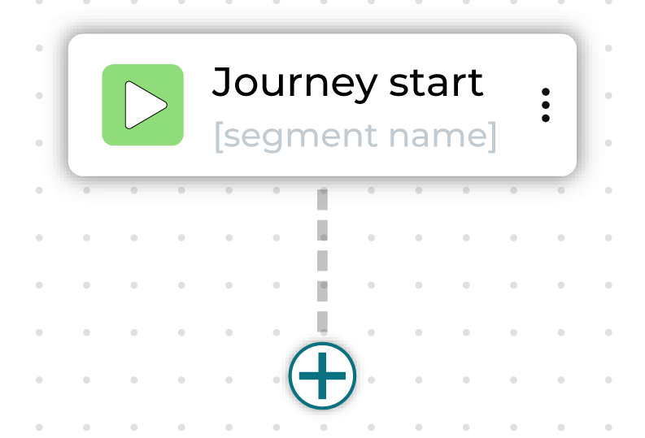
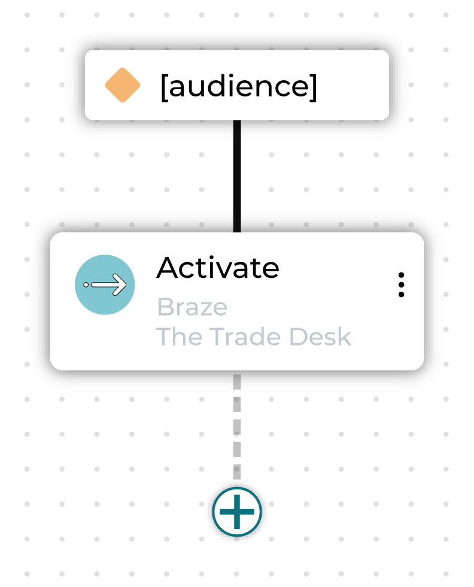

.. https://docs.amperity.com/reference/

.. meta::
    :description lang=en:
        A journey is an automated sequence that connects customers across channels and your brand's marketing campaigns.

.. meta::
    :content class=swiftype name=body data-type=text:
        A journey is an automated sequence that connects customers across channels and your brand's marketing campaigns.

.. meta::
    :content class=swiftype name=title data-type=string:
        About journeys

==================================================
About journeys
==================================================

.. TODO: Next paragraph is a future glossary term. terms.rst, reused.

.. journeys-about-start

A journey is an automated sequence for connecting with customers across channels like email, paid media, SMS, and direct mail. Each step in a journey represents a decision point or action: send a message, wait for further customer engagement, or split the audience onto different paths.

.. journeys-about-end

.. journeys-about-context-start

By using **Journeys**, marketers can implement cross-channel strategies, improve targeting precision, and activate the right message at the right moment to drive better engagement and higher conversions.

.. journeys-about-context-end

.. _journeys-howitworks:

How journeys work
==================================================

.. journeys-howitworks-start

A journey starts with a defined audience that moves through a series of interactions based on criteria you specify, like customer behavior, attributes, or engagement history. The sequence can branch depending on what conditions you set, so that customers have a different experience depending on what actions they take.

.. journeys-howitworks-end

.. journeys-howitworks-context-start

Here's an example of a built-out journey:

.. image:: ../../images/mockup-journeys-overview-alt.png
   :width: 600 px
   :alt: Journey built out in the journeys canvas interface
   :align: left
   :class: no-scaled-link

In this case, the marketer is offering high-value customers early access to new products before general release in two weeks. They start by creating an audience segment made up of customers in the top 10% of customer lifetime value.

The first step divides this audience into three sub-audiences: those who purchased in the last 1-30 days, those whose purchased in the last 31-90 days, and those whose most recent purchase was more than 90 days ago.

Each different audience is sent down a different path toward activation in a marketing channel.

* The high-value customers who purchased most recently are contacted immediately, giving them exclusive early access.
* The high-value customers who purchased between 1 and 3 months ago are set for a delay followed by an activation, as a second wave of early access.
* Additionally, this audience is further split, so that 75% receive a special promotion and 25% do not, to see how important an added incentive is for getting customers to purchase again.
* Finally, the high-value customers who have not purchased in the last three months are contacted when the new products become generally available to make sure they are among the first to know.

The journey can be further built out beyond this, with further splits based on whether or not customers purchase or how they engage with the communications they receive.

.. journeys-howitworks-context-end

.. _journeys-setup:

Journey setup
==================================================

.. journeys-setup-start

**Journeys** require that segments are available and that at least one destination has been configured.

Access the **Journeys** canvas from the **Campaigns** page. Click **Create campaign**, and then select **Journey**.

.. journeys-setup-end

.. _journeys-setup-who-enters:

Who enters?
--------------------------------------------------

.. journeys-setup-who-enters-start

Every journey starts with an audience that is defined by one or more segments that determine which users enter this journey.

Choose a segment from the **Select inclusion segments** dropdown list. The customers in that list will become the audience for this campaign.

.. journeys-setup-who-enters-end

.. _journeys-setup-who-is-excluded:

Who is excluded?
--------------------------------------------------

.. journeys-setup-who-is-excluded-start

Sometimes a journey needs to exclude certain members of your audience. For example, a journey aimed at churn prevention often excludes customers who have opted-out of SMS messaging and/or who have unsubscribed from an email list.

When you need to exclude audience members, choose one or more segments from the **Select exclusion segments** dropdown list. The customers in an exclusion list will be removed from the audience for this journey.

.. image:: ../../images/mockup-journeys-canvas-exclusion.png
   :width: 380 px
   :alt: Exclude a segment
   :align: left
   :class: no-scaled-link

.. journeys-setup-who-is-excluded-end

.. _journeys-exit-conditions:

Exit conditions
--------------------------------------------------

.. journeys-exit-conditions-start

Some customers should exit a journey when a particular criterion has been fulfilled. For example:

* The goal of a churn prevention campaign is to convince a customer to make a purchase. If a customer who is part of a churn prevention campaign makes a purchase they should be removed from the campaign.

* An audience starts with customers who have opted in to receiving marketing messages from your brand. If a customer who is part of that journey later opts out they should be removed from the campaign.

Exit conditions are defined using a segment. One or more segments that define exit conditions may be added to a journey using the **Select exit segments** dropdown.

.. image:: ../../images/mockup-journeys-canvas-exit-conditions.png
   :width: 380 px
   :alt: Choose exit conditions
   :align: left
   :class: no-scaled-link

.. journeys-exit-conditions-end

.. _journeys-canvas:

Journeys canvas
==================================================

.. journeys-canvas-start

After establishing the audience and starting conditions of the journey, you will be taken to the **Journeys** canvas. This is the interface where you determine the steps of the journey and define how your brand will interact with customers at each step.

.. journeys-canvas-end

.. journeys-node-types-start

The following building blocks are available to users for building journeys:

* :ref:`journeys-node-start`
* :ref:`journeys-node-activate`
* :ref:`journeys-node-delay`
* :ref:`journeys-node-split-conditional`
* :ref:`journeys-node-split-percent`
* :ref:`journeys-node-split-individual`

.. journeys-node-types-end

.. _journeys-node-start:

Journey start
--------------------------------------------------

.. journeys-node-start-start

.. list-table::
   :widths: 25 75

   * - .. image:: ../../images/journey-node-icon-start.png
          :width: 60px
          :alt: Journey start
          :align: left
          :class: no-scaled-link
     - .. include:: ../../shared/terms.rst
          :start-after: .. term-journey-node-start-start
          :end-before: .. term-journey-node-start-end

       To edit inclusions, exclusions, or exit conditions, click on the **Journey setup** sidebar.

**ALTERNATE**

.. include:: ../../shared/terms.rst
   :start-after: .. term-journey-node-start-start
   :end-before: .. term-journey-node-start-end

To edit inclusions, exclusions, or exit conditions, click on the **Journey setup** sidebar.

Click this button to add a node to the journey. May be one of "Activate", "Delay", "Conditional Split", or "Percent Split."

.. journeys-node-start-end

.. _journeys-node-activate:

Activate
--------------------------------------------------

.. journeys-node-activate-start

.. list-table::
   :widths: 25 75

   * - .. image:: ../../images/journey-node-icon-activate.png
          :width: 60px
          :alt: Activate
          :align: left
          :class: no-scaled-link
     - .. include:: ../../shared/terms.rst
          :start-after: .. term-journey-node-activate-start
          :end-before: .. term-journey-node-activate-end

       You can rename the activate node.

**ALTERNATE**

.. include:: ../../shared/terms.rst
   :start-after: .. term-journey-node-activate-start
   :end-before: .. term-journey-node-activate-end

You can rename the activate node.

.. journeys-node-activate-end

.. _journeys-node-delay:

Delay
--------------------------------------------------

.. journeys-node-delay-start

.. list-table::
   :widths: 25 75

   * - .. image:: ../../images/journey-node-icon-delay.png
          :width: 60px
          :alt: Delay
          :align: left
          :class: no-scaled-link
     - .. include:: ../../shared/terms.rst
          :start-after: .. term-journey-node-delay-start
          :end-before: .. term-journey-node-delay-end

       Choose a combination of an integer plus "days", "weeks", or "months" to designate how long to wait before the next step in the journey begins.

       A delay is applied to a single parent node.

       You can rename the delay node.

**ALTERNATE**

.. include:: ../../shared/terms.rst
   :start-after: .. term-journey-node-delay-start
   :end-before: .. term-journey-node-delay-end

.. image:: ../../images/mockup-journeys-canvas-delay.png
   :width: 280 px
   :alt: Delay node
   :align: left
   :class: no-scaled-link

Choose a combination of an integer plus "days", "weeks", or "months" to designate how long to wait before the next step in the journey begins.

A delay is applied to a single parent node.

You can rename the delay node.

.. journeys-node-delay-end

.. _journeys-node-split-conditional:

Conditional split
--------------------------------------------------

.. journeys-node-split-conditional-start

.. list-table::
   :widths: 25 75

   * - .. image:: ../../images/journey-node-icon-conditional-split.png
          :width: 60px
          :alt: Conditional Split
          :align: left
          :class: no-scaled-link
     - .. include:: ../../shared/terms.rst
          :start-after: .. term-journey-node-conditional-split-start
          :end-before: .. term-journey-node-conditional-split-end

       These segments may already exist or may be defined within this journey using custom criteria.

       You can rename the individual conditional split node and rename the "Everyone else" sub-audience.

**ALTERNATE**

.. include:: ../../shared/terms.rst
   :start-after: .. term-journey-node-conditional-split-start
   :end-before: .. term-journey-node-conditional-split-end

.. image:: ../../images/mockup-journeys-canvas-conditional-split.png
   :width: 440 px
   :alt: Conditional split node
   :align: left
   :class: no-scaled-link

These segments may already exist or may be defined within this journey using custom criteria.

You can rename the individual conditional split node and rename the "Everyone else" sub-audience.

.. journeys-node-split-conditional-end

.. _journeys-node-split-percent:

Percent split
--------------------------------------------------

.. journeys-node-split-percent-start

.. list-table::
   :widths: 25 75

   * - .. image:: ../../images/journey-node-icon-percent-split.png
          :width: 60px
          :alt: Percentage Split
          :align: left
          :class: no-scaled-link
     - .. include:: ../../shared/terms.rst
          :start-after: .. term-journey-node-percent-split-start
          :end-before: .. term-journey-node-percent-split-end

       The percentage of all individual nodes under a percent split must add up to 100% of the audience, including the control group.

       You can rename the percent split node and rename the individual paths.

**ALTERNATE**

.. include:: ../../shared/terms.rst
   :start-after: .. term-journey-node-percent-split-start
   :end-before: .. term-journey-node-percent-split-end

The percentage of all individual nodes under a percent split must add up to 100% of the audience, including the control group.

You can rename the percent split node and rename the individual paths.

.. journeys-node-split-percent-end

.. _journeys-node-split-individual:

Individual split
--------------------------------------------------

.. journeys-node-split-individual-start

.. list-table::
   :widths: 25 75

   * - .. image:: ../../images/journey-node-icon-individual-split.png
          :width: 60px
          :alt: Individual Split
          :align: left
          :class: no-scaled-link
     - .. include:: ../../shared/terms.rst
          :start-after: .. term-journey-node-individual-split-start
          :end-before: .. term-journey-node-individual-split-end

       .. note:: To edit sub-audiences conditions and naming, click into the parent node.

**ALTERNATE**

.. include:: ../../shared/terms.rst
   :start-after: .. term-journey-node-individual-split-start
   :end-before: .. term-journey-node-individual-split-end

.. image:: ../../images/mockup-journeys-canvas-individual-split-examples.png
   :width: 440 px
   :alt: Individual split nodes
   :align: left
   :class: no-scaled-link

.. note:: To edit sub-audiences conditions and naming, click into the parent node.

.. journeys-node-split-individual-end

Add a node
--------------------------------------------------

.. journeys-node-add-start

.. list-table::
   :widths: 25 75

   * - .. image:: ../../images/journey-node-icon-add.png
          :width: 60px
          :alt: Add node
          :align: left
          :class: no-scaled-link
     - Click the plus button to add a node to the journey. May be one of "Activate", "Delay", "Conditional Split", or "Percent Split."

**ALTERNATE**

Click the plus button to add a node to the journey. May be one of "Activate", "Delay", "Conditional Split", or "Percent Split."

.. image:: ../../images/mockup-journeys-canvas-plus.png
   :width: 280 px
   :alt: Delay node
   :align: left
   :class: no-scaled-link

.. journeys-node-add-end

.. _journeys-howtos:

How-tos
==================================================

.. journeys-howtos-start

This section describes tasks related to building journeys in Amperity:

.. journeys-howtos-end

.. journeys-howtos-list-start

* :ref:`journeys-howtos-add`
* :ref:`journeys-howtos-node-activate`
* :ref:`journeys-howtos-node-conditional-split`
* :ref:`journeys-howtos-node-delay`
* :ref:`journeys-howtos-node-percent-split`
* :ref:`journeys-howtos-delete`
* :ref:`journeys-howtos-edit`
* :ref:`journeys-howtos-edit-destination-attributes`
* :ref:`journeys-howtos-edit-starting-audience`
* :ref:`journeys-howtos-edit-exit-conditions`
* :ref:`journeys-howtos-interact`
* :ref:`journeys-howtos-name`
* :ref:`journeys-howtos-set-run-frequency`
* :ref:`journeys-howtos-view-node-configuration`

.. journeys-howtos-list-start

.. _journeys-howtos-add:

Add a journey
--------------------------------------------------

.. include:: ../../amperity_reference/source/journeys.rst
   :start-after: .. journeys-about-start
   :end-before: .. journeys-about-end

.. journeys-howitworks-steps-start

Follow this sequence when building a journey:

.. journeys-howitworks-steps-end

.. include:: ../../amperity_ampiq/source/journeys.rst
   :start-after: .. journeys-howitworks-callouts-start
   :end-before: .. journeys-howitworks-callouts-end

.. _journeys-howtos-node-activate:

Add activate nodes
--------------------------------------------------

.. include:: ../../shared/terms.rst
   :start-after: .. term-journey-node-activate-start
   :end-before: .. term-journey-node-activate-end

**To add an Activate node to a journey** 

.. journeys-howtos-node-activate-steps-start

#. From the **Journeys** canvas, select the plus symbol, and then choose **Activate**.

   .. image:: ../../images/mockup-journeys-canvas-plus-activate.png
      :width: 280 px
      :alt: Activate node
      :align: left
      :class: no-scaled-link

#. Configure the following settings:

   **Name** Give the node a custom name or keep the "Activate" default name.

   **Destination** Choose a destination from the dropdown menu.

   A summary of details is shown. Click the **Attributes** tab to review the list of attributes that are sent.

   **Add another destination** Click the "Add another destination" link to add more destinations to the activation node.

#. Continue building the journey or, if finished, click **Save**.

.. journeys-howtos-node-activate-steps-end

.. _journeys-howtos-node-conditional-split:

Add conditional split nodes
--------------------------------------------------

.. include:: ../../shared/terms.rst
   :start-after: .. term-journey-node-conditional-split-start
   :end-before: .. term-journey-node-conditional-split-end

**To add a Conditional Split node to a journey**

.. journeys-howtos-node-conditional-split-steps-start

#. From the **Journeys** canvas, select the plus symbol, and then choose **Conditional split**.

   .. image:: ../../images/mockup-journeys-canvas-plus-conditional-split.png
      :width: 280 px
      :alt: Conditional split node
      :align: left
      :class: no-scaled-link

#. Configure the following settings:

   **Name** Give the node a custom name or keep the "Conditional Split" default name.

   **Add new path** Click the "Add new path" link to add paths for this split. Each path requires a sub-audience, which may be defined by a segment or by custom criteria.

   **Name of remaining audience** Amperity uses "Everyone else" to name the audience for customers who do not belong to the segment or custom criteria for a path in this conditional split. You may keep the "Everyone else" default or may add a custom name.

#. Continue building the journey or, if finished, click **Save**.

.. journeys-howtos-node-conditional-split-steps-end

.. _journeys-howtos-node-delay:

Add delay nodes
--------------------------------------------------

.. include:: ../../shared/terms.rst
   :start-after: .. term-journey-node-delay-start
   :end-before: .. term-journey-node-delay-end

**To add a Delay node to a journey**

.. journeys-howtos-node-delay-steps-start

#. From the **Journeys** canvas, select the plus symbol, and then choose **Delay**.

   .. image:: ../../images/mockup-journeys-canvas-plus-delay.png
      :width: 280 px
      :alt: Delay node
      :align: left
      :class: no-scaled-link

#. Configure the following settings:

   **Name** Give the node a custom name or keep the "Delay" default name.

   **Set delay time** Enter an integer and a unit of time to define length of time to wait before the next step in a journey begins

#. Continue building the journey or, if finished, click **Save**.

.. journeys-howtos-node-delay-steps-end

.. _journeys-howtos-node-percent-split:

Add percent split nodes
--------------------------------------------------

.. include:: ../../shared/terms.rst
   :start-after: .. term-journey-node-percent-split-start
   :end-before: .. term-journey-node-percent-split-end

**To add a Percent Split node to a journey**

.. journeys-howtos-node-percent-split-steps-start

#. From the **Journeys** canvas, select the plus symbol, and then choose **Percent split**.

   .. image:: ../../images/mockup-journeys-canvas-plus-percent-split.png
      :width: 280 px
      :alt: Percent split node
      :align: left
      :class: no-scaled-link

#. Configure the following settings:

   **Name** Give the node a custom name or keep the "Percent Split" default name.

   **Configure paths** Choose a name and percentage for the treatment path, or keep the default name of "Main Group" and the value of 90%.

   Click the "Add path" link to add more treatments. Each treatment should have a unique name and a percentage value.

   .. important:: The percentages for all paths and the control group must add up to 100%.

   **Configure control group** Choose a name and percentage for the control group, or keep the default name of "Control Group" and the value of 10%. 
   
   .. tip:: Uncheck "Include control" to disable the control group.

#. Continue building the journey or, if finished, click **Save**.

.. journeys-howtos-node-percent-split-steps-end

.. _journeys-howtos-delete:

Delete node
--------------------------------------------------

.. journeys-howtos-delete-start

Any node on the **Journeys** canvas can be deleted. This action only deletes the node. All child nodes remain in the journey.

.. journeys-howtos-delete-end

**To delete a node from a journey**

.. journeys-howtos-delete-steps-start

#. From the **Journeys** canvas, select a node the |fa-kebab| menu on the node you wish to delete, then select **Delete**.
#. Continue building the journey or, if finished, click **Save**.

.. journeys-howtos-delete-steps-ende

.. _journeys-howtos-edit:

Edit existing node
--------------------------------------------------

.. journeys-howtos-edit-start

The settings for nodes in a journey can be edited.

.. journeys-howtos-edit-end

**To edit node configuration**

.. journeys-howtos-edit-steps-start

#. From the **Journeys** canvas, select a node.
#. Open **Node Configuration** sidebar, and then make your changes.
#. Continue building the journey or, if finished, click **Save**.

   Alternatively, clicking the **Node configuration** sidebar will open the configuration pane for the most recently edited node.

.. journeys-howtos-edit-steps-end

.. _journeys-howtos-edit-destination-attributes:

Edit destination attributes
--------------------------------------------------

.. journeys-howtos-edit-destination-attributes-start

The attributes that are sent to each destination that are configured for activation in a journey can be edited.

.. journeys-howtos-edit-destination-attributes-end

**To edit destination attributes**

.. journeys-howtos-edit-destination-attributes-steps-start

#. From the **Journeys** canvas, select an activation node.
#. Open the **Node configuration** sidebar. For each configuration destination, a list of attributes may be edited.
#. Select a destination from the **Destination** dropdown.
#. Open the **Attributes** panel. A list of attributes is shown with the field in Amperity on the left and the field that is sent to the destination on the right.
#. Click the **Edit** button to update the list of attributes that are sent to this destination.
#. When finished, click **Save**.

.. journeys-howtos-edit-destination-attributes-steps-end

.. _journeys-howtos-edit-starting-audience:

Edit starting audience 
--------------------------------------------------

.. journeys-howtos-edit-starting-audience-start

The starting audience for a journey can be edited.

.. journeys-howtos-edit-starting-audience-end

**To edit the starting audience** 

.. journeys-howtos-edit-starting-audience-steps-start

#. From the **Journeys** canvas, open the **Journey setup** sidebar.
#. Under **Journey entry** use the dropdown menus to edit the included and excluded segments.

   .. image:: ../../images/mockup-journeys-canvas-inclusion-exclusion.png
      :width: 380 px
      :alt: Edit starting audience
      :align: left
      :class: no-scaled-link

.. journeys-howtos-edit-starting-audience-steps-end

.. _journeys-howtos-edit-exit-conditions:

Edit exit conditions
--------------------------------------------------

.. journeys-howtos-edit-exit-conditions-start

The exit criteria for a journey can be edited.

.. journeys-howtos-edit-exit-conditions-end

**To edit exit conditions**

.. journeys-howtos-edit-exit-conditions-steps-start

#. From the **Journeys** canvas, open the **Journey setup** sidebar.
#. Under **Exit conditions** use the dropdown menus to edit the segments that should exit the journey.

   .. image:: ../../images/mockup-journeys-canvas-exit-conditions.png
      :width: 380 px
      :alt: Choose exit conditions
      :align: left
      :class: no-scaled-link

.. journeys-howtos-edit-exit-conditions-steps-end

.. _journeys-howtos-interact:

Interact with Journeys canvas
--------------------------------------------------

.. journeys-howtos-interact-start

The **Journeys** canvas supports the following user interactions:

* Drag the journey using a mouse or a trackpad.
* Zoom by using the **+** / **-** buttons in the bottom left or pinching on a trackpad.
* Center the canvas by clicking the square icon in the bottom left.

.. journeys-howtos-interact-end

.. _journeys-howtos-name:

Name a journey
--------------------------------------------------

.. journeys-howtos-name-start

A journey should be assigned a name that makes it easy to find and for other users of Amperity to understand.

.. journeys-howtos-name-end

.. journeys-howtos-name-tip-start

.. tip:: Use good naming patterns to ensure that you can always find your journeys in the various applications to which you will send them. The journey name will *always* appear in the filename that is sent to any destination.

   Avoid duplication between journey and treatment group names.

   Avoid using the names of destinations as journey names unless the journey is sent to *only* that destination.

   Use a naming pattern that ensures the journey name works across every treatment group that is configured within any sub-audience.

   If brand names and/or region names apply to all sub-audiences in the journey, consider using them within the journey name.

   Some examples:

   * "Birthdays_Under_40"
   * "Acme_Churn"
   * "Churn_HighValue_Early"
   * "Socktown_High_AOV"

.. journeys-howtos-name-tip-end

**To name a journey** 

.. journeys-howtos-name-steps-start

#. From the **Journeys** canvas, open the **Journey setup** sidebar.
#. In the **Name** field, enter a name for the journey.
#. In the **Description** field you can set a journey description.

.. journeys-howtos-name-steps-end

.. _journeys-howtos-set-run-frequency:

Set run frequency
--------------------------------------------------

.. journeys-howtos-set-run-frequency-start

A journey may be configured to run once, daily, weekly, monthly, or quarterly.

.. journeys-howtos-set-run-frequency-end

.. journeys-howtos-set-run-frequency-note-start

.. note:: When a journey is set to run on a recurring schedule, only customers who have newly qualified for the **inclusion** segment since the last run will enter the journey.

   For example, if the segment had 1,500 members at launch, all 1,500 would enter the journey.

   On the next run, if the segment has grown to 1,700, only the 200 new members--—those who joined the segment after the previous run---will be included.

   Keep in mind that customers can re-enter a recurring journey if the segment is based on a time window, such as "purchased in the last 7 days", and they meet the criteria again.

   To prevent this, use an **exclusion** segment to filter out users who have already participated, or who meet other disqualifying conditions.

.. journeys-howtos-set-run-frequency-note-end

**To set the run frequency for a journey**

.. journeys-howtos-set-run-frequency-steps-start

#. From the **Journeys** canvas, click the **Schedule** link in the top navigation.
#. From the **Recurrence** dropdown menu choose one of "once", "daily", "weekly", "monthly", or "quarterly".

.. journeys-howtos-set-run-frequency-end

.. _journeys-howtos-view-node-configuration:

View node configuration
--------------------------------------------------

.. journeys-howtos-view-node-configuration-start

Open a node to view its configuration.

.. journeys-howtos-view-node-configuration-end

**To view the configuration for a node**

.. journeys-howtos-view-node-configuration-steps-start

#. From the **Journeys** canvas, select a node.
#. The current settings for a node are in the **Node configuration** sidebar.

.. journeys-howtos-view-node-configuration-steps-end
