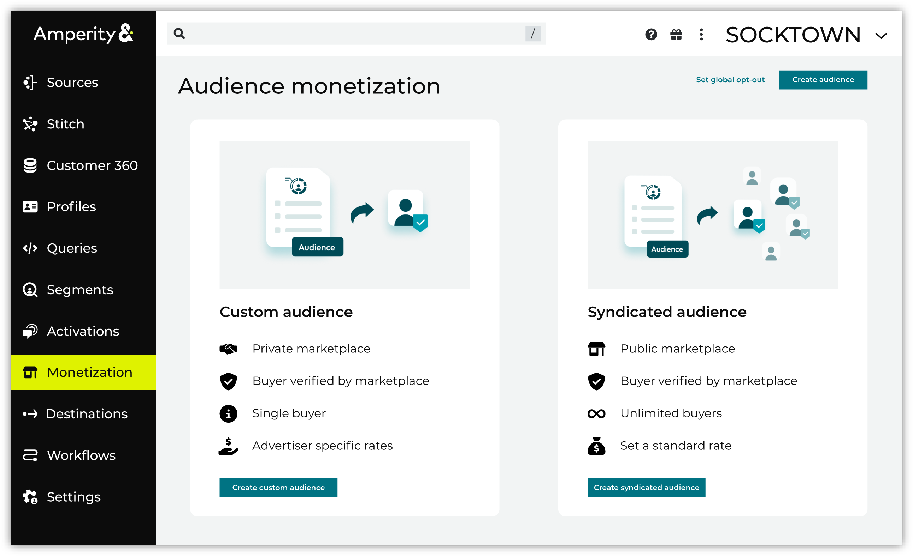

.. meta::
   :description lang=en:
      Package first-party data as a product to sell in third-party marketplaces.

.. meta::
   :content class=swiftype name=body data-type=text:
      Package first-party data as a product to sell in third-party marketplaces.

.. meta::
   :content class=swiftype name=title data-type=string:
      Audience monetization

==================================================
Audience monetization
==================================================

.. monetize-about-start

Package audiences as first-party data, and then deliver those audiences as a product to third-party marketplaces. Monetize these audiences by allowing advertisers to purchase access to them from the third-party marketplace.

Private audiences have advertiser-specific rates. Each private audience is purchased by a single advertiser. Public audiences have a standard rates. A public audience may be purchased by an unlimited number of advertisers.

After purchase, advertisers can use your brand's audiences as a lookalike audience for their marketing campaigns. Use the **Segment Editor** to define audiences, and then use the **Monetization** page to send public or private audiences to the following marketplaces:

* The Trade Desk

.. TODO: Moving the private vs. public to the two bullets also gets rid of the awkward table.

OLD
OLD
OLD

The **Audience monetization** feature allows you to package your first-party data in the form of customer audiences as a product to sell on third-party marketplaces.

This feature allows you to define audiences using existing segments or by creating a new segment with the **Visual Segment Editor**. Instead of sending these audiences to a marketing destination, like Facebook or Google Ads, you are sending them to a marketplace where advertisers can purchase access to them.

OLD
OLD
OLD

.. monetize-about-end

.. monetize-trade-desk-note-start

.. TODO: Don't need this anymore. We start with a list of one element and when we get more marketplaces the list grows, alphabetically.

.. note:: Audience monetization currently only supports sending audiences to The Trade Desk.

.. monetize-trade-desk-note-end

.. _monetize-public-private:

Public vs. private marketplaces
==================================================

.. monetize-public-private-start

.. TODO: Yeet this whole section!

You can monetize audience data in two ways. The workflow you choose depends on who is buying your data.

.. list-table::
   :widths: 20 20 40
   :header-rows: 1

   * - Marketplace Type
     - UI Terminology
     - Best For...
   * - Public
     - "Syndicated Audience"
     - Selling bulk audiences, such as "All Ice Cream Buyers", to *any* advertiser on the open market.
   * - Private
     - "Custom Audience"
     - Selling a specific audience, such as "Lapsed Loyalty Members", to a *specific* partner for a negotiated deal.

.. monetize-public-private-end

.. _monetize-howtos:

How-tos
==================================================

.. monetize-howtos-start

Tasks related to audience monetization in Amperity:

.. monetize-howtos-end

.. monetize-howtos-list-start

* :ref:`monetize-howtos-public`
* :ref:`monetize-howtos-private`
* :ref:`monetize-howtos-global-optout`

.. monetize-howtos-list-end

.. _monetize-howtos-public: 

Public marketplaces
--------------------------------------------------

.. monetize-howtos-public-start

A public marketplace has a standard rate for audiences. Audiences in a public marketplace may be purchased by an unlimited number of advertisers.

* :ref:`monetize-howtos-public-custom`
* :ref:`monetize-howtos-public-existing`

.. monetize-howtos-public-end

.. _monetize-howtos-public-custom: 

Custom audience
++++++++++++++++++++++++++++++++++++++++++++++++++

.. monetize-howtos-public-custom-start

.. TODO: Short intro goes here

.. monetize-howtos-public-custom-end

**To build a custom audience for a public marketplace**

.. monetize-howtos-public-custom-steps-start

#. Open the **Audience Monetization** page.
#. Click **Create syndicated audience**.
#. Select **Create custom segment**, and then define the custom audience. When finished, click **Next**.

   .. image:: ../../images/howto-monetize-segment-custom.png
      :width: 600 px
      :alt: Monetization page
      :align: left
      :class: no-scaled-link

#. Choose the destination to which this audience is sent, and then configure any destination-specific settings, including the frequency at which this audience is sent. Click **Save**.
#. Verify the audience name and description, and then define the values for **% of Media** and **CPM cap**.

   **% of Media** is the percentage of media cost. For example: "0.12".

   **CPM cap** is the maximum cap for advertising costs--cost per thousand (CPM)--in United States dollars.

   The percentage of media cost and cost per thousand (CPM) rate cap determine the hybrid data rate for audience monetization.

#. When finished click **Save and send**.

.. monetize-howtos-public-custom-steps-end

.. _monetize-howtos-public-existing: 

Existing audience
++++++++++++++++++++++++++++++++++++++++++++++++++

.. monetize-howtos-public-existing-start

.. TODO: Short intro goes here

.. monetize-howtos-public-existing-end

**To use an existing audience for a public marketplace**

.. monetize-howtos-public-existing-steps-start

#. Open the **Audience Monetization** page.
#. Click **Create syndicated audience**.
#. Select **Create from existing segments**.

   .. image:: ../../images/howto-monetize-segment-existing.png
      :width: 600 px
      :alt: Monetization page
      :align: left
      :class: no-scaled-link

   Select one or more segments by clicking the checkbox next to the name of the segment, and then click **Next**.

#. Choose the destination to which this audience is sent, and then configure any destination-specific settings, including the frequency at which this audience is sent. Click **Save**.
#. Verify the audience name and description, and then define the values for **% of Media** and **CPM cap**.

   **% of Media** is the percentage of media cost. For example: "0.12".

   **CPM cap** is the maximum cap for advertising costs--cost per thousand (CPM)--in United States dollars.

   The percentage of media cost and cost per thousand (CPM) rate cap determine the hybrid data rate for audience monetization.

#. When finished click **Save and send**.

.. monetize-howtos-public-existing-steps-end

.. _monetize-howtos-private:

Private marketplace
--------------------------------------------------

.. monetize-howtos-private-start

A private marketplace has an advertiser-specific rate. An audience in a private marketplace is purchased by a single advertiser.

* :ref:`monetize-howtos-private-custom`
* :ref:`monetize-howtos-private-existing`

.. monetize-howtos-private-end

.. _monetize-howtos-private-custom: 

Custom audience
++++++++++++++++++++++++++++++++++++++++++++++++++

.. monetize-howtos-private-custom-start

.. TODO: Intro goes here.

.. monetize-howtos-private-custom-end

**To build a custom audience for a private marketplace**

.. monetize-howtos-private-custom-steps-start

#. Open the **Audience Monetization** page.
#. Click **Create custom audience**.
#. Select **Create custom segment**, and then define the custom audience. When finished, click **Next**.

   .. image:: ../../images/howto-monetize-segment-custom.png
      :width: 600 px
      :alt: Monetization page
      :align: left
      :class: no-scaled-link

#. Choose the destination to which this audience is sent, and then configure any destination-specific settings, including the frequency at which this audience is sent. Click **Save**.
#. Verify the audience name and description, and then define the values for **% of Media** and **CPM cap**.

   **% of Media** is the percentage of media cost. For example: "0.12".

   **CPM cap** is the maximum cap for advertising costs--cost per thousand (CPM)--in United States dollars.

   The percentage of media cost and cost per thousand (CPM) rate cap determine the hybrid data rate for audience monetization.

#. When finished click **Save and send**.

.. monetize-howtos-private-custom-steps-end

.. _monetize-howtos-private-existing: 

Existing audience
++++++++++++++++++++++++++++++++++++++++++++++++++

.. monetize-howtos-private-existing-start

.. TODO: Intro goes here.

.. monetize-howtos-private-existing-end

**To use an existing audience for a private marketplace**

.. monetize-howtos-private-existing-steps-start

#. Open the **Audience Monetization** page.
#. Click **Create custom audience**.
#. Select **Create from existing segments**.

   .. image:: ../../images/howto-monetize-segment-existing.png
      :width: 600 px
      :alt: Monetization page
      :align: left
      :class: no-scaled-link

   Select one or more segments by clicking the checkbox next to the name of the segment, and then click **Next**.
#. Choose the destination to which this audience is sent, and then configure any destination-specific settings, including the frequency at which this audience is sent. Click **Save**.
#. Verify the audience name and description, and then define the values for **% of Media** and **CPM cap**.

   **% of Media** is the percentage of media cost. For example: "0.12".

   **CPM cap** is the maximum cap for advertising costs--cost per thousand (CPM)--in United States dollars.

   The percentage of media cost and cost per thousand (CPM) rate cap determine the hybrid data rate for audience monetization.

#. When finished click **Save and send**.

.. monetize-howtos-private-existing-steps-end

.. _monetize-howtos-global-optout:

Opt audiences out of third-party marketplaces
--------------------------------------------------

.. monetize-howtos-global-optout-start

Audiences can be excluded from availability for third-party marketplaces.

.. monetize-howtos-global-optout-end

**To opt audiences out of third-party marketplaces**

.. monetize-howtos-global-optout-steps-start

#. Open the **Audience Monetization** page.
#. Click **Set global opt-out**.
#. Use the drop-down menu to select one or more segments
#. Click **Save**.

.. monetize-howtos-global-optout-steps-end
