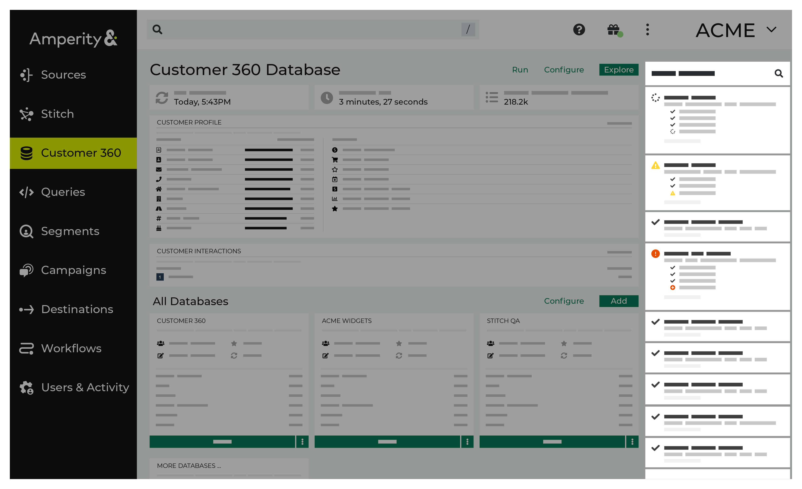
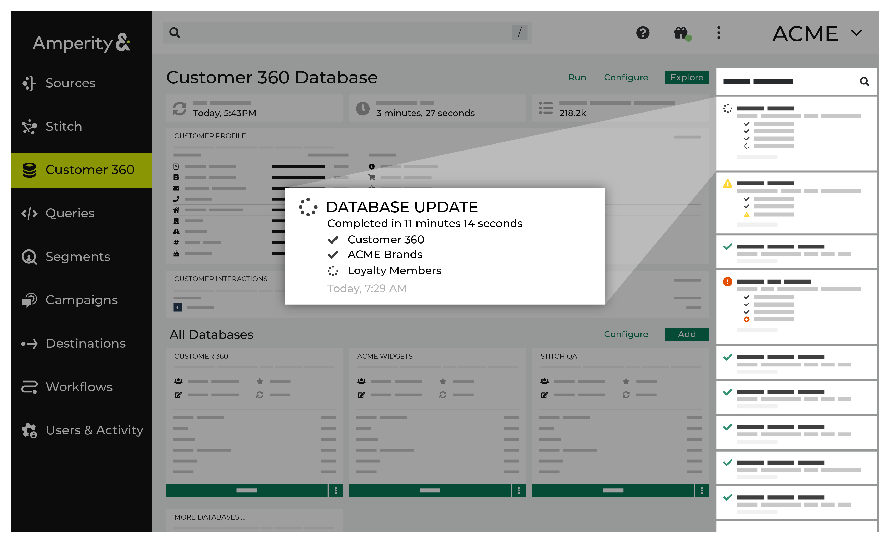
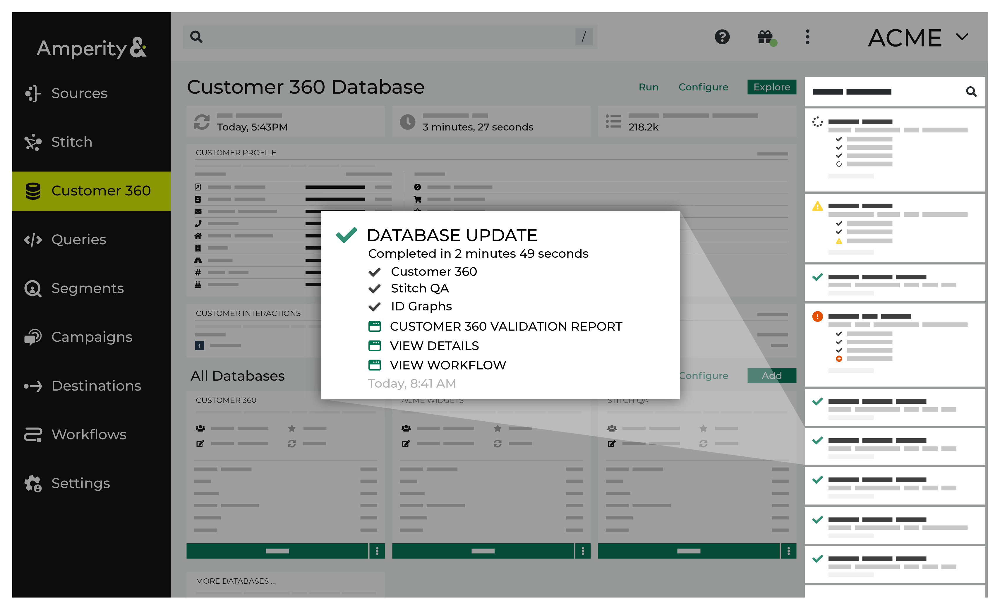
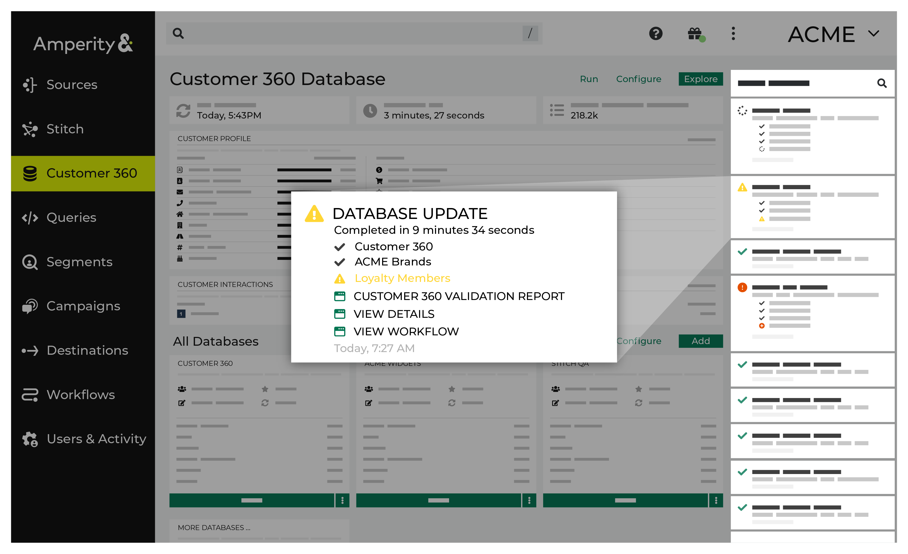
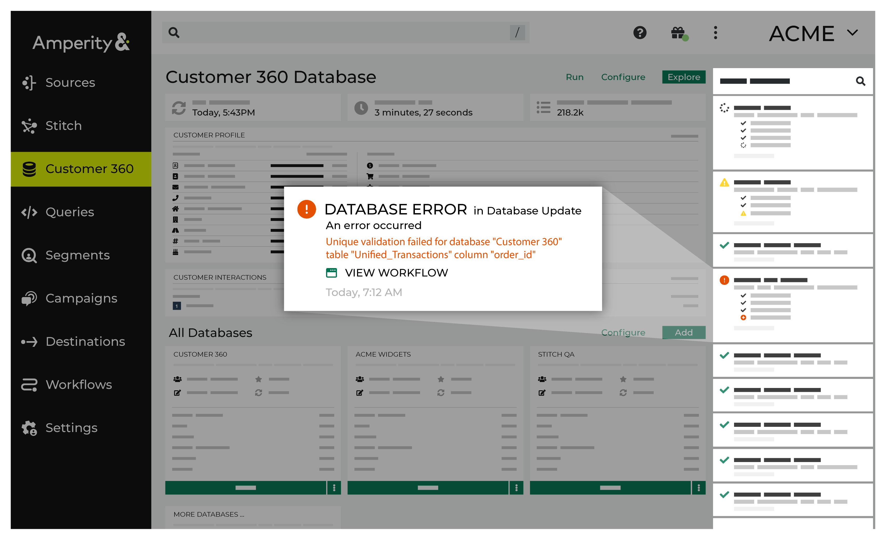
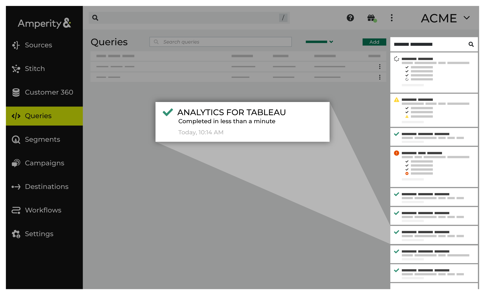
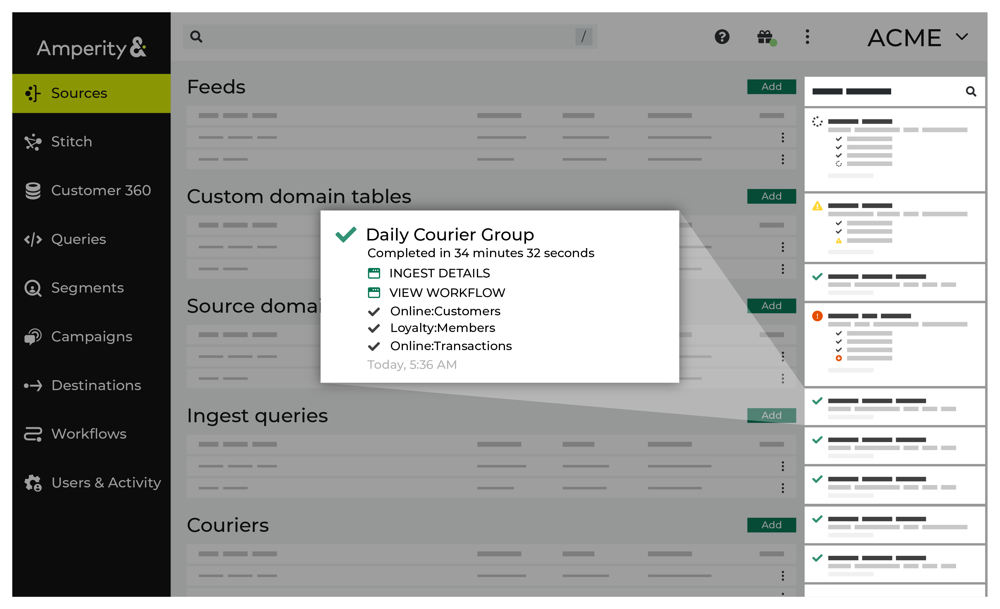
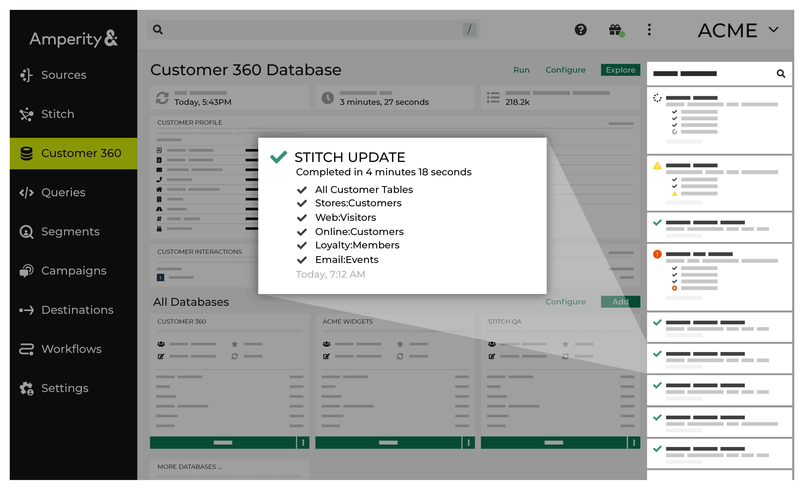

.. https://docs.amperity.com/reference/

.. meta::
    :description lang=en:
        The Recent activity panel provides notifications about the state of workflows currently running in Amperity.

.. meta::
    :content class=swiftype name=body data-type=text:
        The Recent activity panel provides notifications about the state of workflows currently running in Amperity.

.. meta::
    :content class=swiftype name=title data-type=string:
        About recent activity

==================================================
About recent activity
==================================================

.. include:: ../../shared/terms.rst
   :start-after: .. term-notifications-start
   :end-before: .. term-notifications-end

.. notifications-about-start

Use the recent activity pane to learn more about the state of workflows that are currently running in your tenant and as a starting point for resolving warnings and errors that may be shown for specific workflows.

.. notifications-about-end

.. notifications-sections-start

Review the following sections:

#. The first section describes :ref:`notification types <notifications-types>` -- :ref:`Running <notifications-type-running>`, :ref:`Completed <notifications-type-completed>`, :ref:`Warnings <notifications-type-warnings>`, and :ref:`Error <notifications-type-errors>` -- and describes what you should expect from each notification type as they appear in the recent activity pane.

   :ref:`Fields are shown in notifications <notifications-fields>`, such as links to validation reports and workflows, job, trace, IDs for use with troubleshooting, and status indicators, such as the amount of time a workflow ran.

#. The second section describes the notifications that appear within individual pages in the Amperity user interface. These sections are listed alphabetically by page: :ref:`Campaign <notifications-campaigns>`, :ref:`Database <notifications-databases>`, :ref:`Orchestrations <notifications-orchestrations>`, :ref:`Queries <notifications-queries>`, :ref:`Sources <notifications-sources>`, :ref:`Stitch reports <notifications-stitch-reports>`, and :ref:`Stitch runs <notifications-stitch-runs>`.

#. A list of how-tos that are available to workflows, including :ref:`resolving workflow errors <notifications-resolve-workflow-errors>`.

.. notifications-sections-end

.. _notifications-types:

Notification types
==================================================

.. notifications-types-about-start

All notifications within the recent activity pane fall into one of the following general types:

* :ref:`Running <notifications-type-running>`
* :ref:`Completed <notifications-type-completed>`
* :ref:`Warning <notifications-type-warnings>`
* :ref:`Error <notifications-type-errors>`

.. notifications-types-about-end

.. notifications-types-important-start

.. important:: Notifications fall into general behaviors, but all notifications within your tenant are specific to your tenant and reflect how your tenant is configured. The names of data sources, feeds, couriers, tables, databases, queries, orchestrations, destinations, and campaigns appears in the notifications.

   If there is an error, such as a processing error related to a specific column within a custom table, the notification contains the names you chose for the custom table and also for the columns within that table.

   If you are unable to resolve a warning or an error using workflow actions, please contact Amperity support.

.. notifications-types-important-end

.. _notifications-type-running:

Running
--------------------------------------------------

.. notifications-type-status-start

A running notification -- indicated by the |notification-running| icon -- is shown when a workflow is currently running, but has not finished every step in the workflow.

.. notifications-type-status-end

.. notifications-type-running-context-start

For example, a notification for a workflow that is running is updated with details for each step in that workflow as it completes. You can open the **Workflows** page and view details for each step that is taken by that workflow as they are taken.

.. notifications-type-running-context-start

.. _notifications-type-completed:

Completed
--------------------------------------------------

.. notifications-type-completed-start

A completed notification--indicated by the |notification-complete| icon--is shown when the workflow has finished running and all steps in that workflow were successful. This is the most common type of notification that you will see in the notification pane in your daily production tenant.

.. notifications-type-completed-end

.. notifications-type-completed-context-start

For example, a notification for a workflow that has completed successfully contains links to:

* A **Validation Report**
* A **View Details** modal that shows how long it took for each table to be updated
* A page for the workflow in the **Workflows** page, from which you can review details for each step in the workflow

.. notifications-type-completed-context-start

.. _notifications-type-warnings:

Warnings
--------------------------------------------------

.. notifications-type-warnings-start

A warning notification--indicated by the |notification-alert| icon--is shown when a workflow is able to complete all steps, but detects issues with one or more steps within the workflow.

.. notifications-type-warnings-end

.. notifications-type-warnings-context-start

For example, a notification for a workflow that has detected an issue shows the warning icon |notification-alert| along with a message that describes the issue, such as:

::

   Unique validation failed for database "Customer 360" table
   "Unified_Transactions" column "order_id"

and then contains links to:

* A **Validation Report**
* A **View Details** modal that shows how long it took for each table to be updated
* A page for the workflow in the **Workflows** page, from which you can review details for each step in the workflow

.. important:: Each warning is specific to a step in the workflow. In many cases a warning will not prevent the completion of your daily workflow, but it does indicate that a step in your workflow requires attention and that you should work to resolve what caused it as soon as possible.

.. notifications-type-warnings-context-start

.. _notifications-type-errors:

Errors
--------------------------------------------------

.. notifications-type-errors-start

An error notification--indicated by the |notification-error| icon--is shown when a workflow is unable to complete all steps.

.. notifications-type-errors-end

.. notifications-type-errors-context-start

For example, a notification for a workflow that contains an error shows the error icon |notification-error| and the workflow stops.

A message is shown that describes the error, such as:

::

   Error analyzing table "Unified_Transactions" in database "C360":
   cannot resolve '`loyalty_tier`' given input columns:
   [Unified_Customer.address, Unified_Customer.address2, ... ]

.. caution:: Each error is specific to a step in that workflow. In all cases an error will prevent the completion of that workflow. You should open the **Workflows** page, review the error in the workflow, and then work to resolve the error immediately.

   Each workflow error will present a list of suggested workflow actions that are specific to this workflow error:

   .. image:: ../../images/workflow-actions-modal.png
      :width: 300 px
      :alt: An example of the workflow actions for a specific workflow error.
      :align: left
      :class: no-scaled-link

   Select the radio button for the workflow action that you determine to be the best way to resolve this error, after which the workflow will perform that action.
   
.. tip:: If you are unable to resolve an error, please contact your Amperity representative.

.. notifications-type-errors-context-end

.. _notifications-type-errors-download-logs:

Download ingest error logs
++++++++++++++++++++++++++++++++++++++++++++++++++

.. include:: ../../amperity_reference/source/feeds.rst
   :start-after: .. feed-troubleshoot-ingest-errors-start
   :end-before: .. feed-troubleshoot-ingest-errors-end

.. _notifications-fields:

Notification fields
--------------------------------------------------

.. notifications-fields-start

.. list-table::
   :widths: 150 150 300
   :header-rows: 1

   * - Field
     - Area
     - Description

   * - **Completion time**
     - Databases, Orchestrations, Sources, Stitch
     - The duration of time for a job to complete.
   * - **Databases**
     - Databases, Queries
     - The databases processed during the databases update process.
   * - **Ingest details**
     - Databases, Queries, Sources
     - These details include information on file IDs, file names, records read, errors, records ingested, load start and end times, duration, and an error log.
   * - **Job ID**
     - Campaigns, Orchestrations, Queries, Sources, 
     - A unique string containing letters, numbers and special characters associated with the job.
   * - **Queries**
     - Databases, Sources, 
     - The number of queries processed.
   * - **Spark job**
     - Databases, Sources, Stitch
     - Is a job that processes Spark SQL queries related to the Stitch process and to building databases.
   * - **Stitch metrics**
     - Stitch
     - These metrics display the tenant, the time at which the job started, the ID for the Stitch report, the Stitch ID, the collapsed ID count, related pairs count, and filtered related pair count.
   * - **Stitch report**
     - Stitch
     - A Stitch report displays cluster graphs for individuals associated with the Amperity ID.
   * - **Tables**
     - Databases, Orchestrations, Sources, Stitch
     - The tables that are processed in orchestration process.
   * - **Title**
     - Databases, Orchestrations, Queries, Sources, Stitch
     - The title of the notification.
   * - **Trace ID**
     - Databases, Orchestrations, Queries, Stitch
     - A unique string containing letters, numbers and special characters associated with a trace.
   * - **Updates**
     - Databases, Orchestrations, Sources, Stitch
     - These updates include details on the databases build, database gen batch, and database publish processes.
   * - **Validation report**
     - Databases
     - This report validates data pulled from tables and may return records with errors associated with them.
   * - **View Campaign**
     - Databases
     - View details for a campaigns.
   * - **View Workflows**
     - Databases, Orchestrations, Sources
     - View workflow details for the campaigns, courier groups, couriers, data ingest, database refresh, orchestration groups, and orchestration tasks by clicking the **View Workflow** link.
	   
.. notifications-fields-end

.. _notifications-campaigns:

Campaigns
==================================================

.. include:: ../../amperity_reference/source/campaigns.rst
   :start-after: .. campaigns-view-notification-start
   :end-before: .. campaigns-view-notification-end

.. image:: ../../images/mockup-notifications-campaigns.png
   :width: 600 px
   :alt: The recent activity pane sits on the right side of the Campaigns page.
   :align: left
   :class: no-scaled-link

.. include:: ../../amperity_reference/source/campaigns.rst
   :start-after: .. campaigns-view-notifications-context-start
   :end-before: .. campaigns-view-notifications-context-end

**Common error notifications**

.. notifications-campaigns-errors-start

Campaign error notifications are most often related to:

#. Campaign treatment delivery
#. Preparing the campaign audience
#. Running a segment
#. Sending a campaign downstream

If you see a campaign error notification, click the **View Workflow** link in that notification to open the workflow in the **Workflows** page, and then review all of the available workflow actions to determine which steps will help you best resolve the error.

.. notifications-campaigns-errors-end

**Common status notifications**

.. notifications-campaigns-other-start

The following is a list of status notifications that appear within a notification as it is running or after it has completed:

* Send for campaign started
* Preparing campaign recipients
* Sending to destinations
* Completed in
 
.. notifications-campaigns-other-end

.. _notifications-databases:

Databases
==================================================

.. include:: ../../amperity_reference/source/databases.rst
   :start-after: .. databases-database-howto-view-recent-activity-start
   :end-before: .. databases-database-howto-view-recent-activity-end

.. image:: ../../images/mockup-notifications-databases.png
   :width: 600 px
   :alt: The recent activity pane sits on the right side of the Customer 360 page.
   :align: left
   :class: no-scaled-link

.. include:: ../../amperity_reference/source/databases.rst
   :start-after: .. databases-database-howto-view-recent-activity-context-start
   :end-before: .. databases-database-howto-view-recent-activity-context-end

**Common error notifications**

.. notifications-databases-errors-start

Database error notifications are most often related to:

#. Error while publishing databases
#. Query error found

If you see a databases error notification, click the **View Workflow** link in that notification to open the workflow in the **Workflows** page, and then review all of the available workflow actions to determine which steps will help you best resolve the error.

.. notifications-databases-errors-end

**Common status notifications**

.. notifications-databases-common-warnings-start

The following is a list of status notifications that appear within a notification as it is running or after it has completed:

* Build started
* Build in progress
* Batch created
* Batch started
* Batch completed
* Waiting to start publishing
* Publishing in progress
* Publishing started
* Publishing succeeded
* Waiting to start
* Generation in progress
* Generation completed
* Database generation may be waiting
* Database generation aborted
* Starting database validation
* Running database validation
* Completed in

.. notifications-databases-common-warnings-end

.. _notifications-orchestrations:

Orchestrations
==================================================

.. include:: ../../amperity_reference/source/orchestrations.rst
   :start-after: .. orchestrations-view-notifications-start
   :end-before: .. orchestrations-view-notifications-end

.. image:: ../../images/mockup-notifications-orchestrations.png
   :width: 600 px
   :alt: The recent activity pane sits on the right side of the Orchestrations page.
   :align: left
   :class: no-scaled-link

.. include:: ../../amperity_reference/source/orchestrations.rst
   :start-after: .. orchestrations-view-notifications-context-start
   :end-before: .. orchestrations-view-notifications-context-end

**Common error notifications**

.. notifications-orchestrations-errors-start

Orchestration error notifications are most often related to:

#. Data type mismatches
#. Running a query
#. Sending an orchestration downstream

If you see an orchestration error notification, click the **View Workflow** link in that notification to open the workflow in the **Workflows** page, and then review all of the available workflow actions to determine which steps will help you best resolve the error.

.. notifications-orchestrations-errors-end

**Common status notifications**

.. notifications-orchestrations-other-start

The following is a list of status notifications that appear within a notification as it is running or after it has completed:

* Waiting to start
* Orchestration group jobs created
* Orchestration group run requested
* Orchestration run requested
* Orchestration started
* Orchestration progress
* Waiting to upload
* Uploading
* Orchestration completed
* Completed in

.. notifications-orchestrations-other-end

.. _notifications-queries:

Queries
==================================================

.. include:: ../../amperity_reference/source/queries.rst
   :start-after: .. queries-view-notifications-start
   :end-before: .. queries-view-notifications-end

.. include:: ../../amperity_reference/source/queries.rst
   :start-after: .. queries-view-notifications-context-start
   :end-before: .. queries-view-notifications-context-end

**Common error notifications**

.. notifications-queries-errors-start

Query error notifications are most often related to:

* Syntax errors
* Upstream and downstream dependencies
* Queries that return large results sets

  .. note:: For queries that return large results sets, do the following:

     #. Review the query and look for ways to optimize the SQL so that it returns smaller results sets.
     #. Configure the query to run in performance mode. This wraps a **CREATE TABLE** operation around the **SELECT** statement in the query, writes the results to an Apache Parquet file, and then makes that file available to Amperity as a table. Queries that run in `performance mode can have limitations <https://docs.amperity.com/reference/queries.html#enable-performance-mode>`__. 

If you see a query error notification, click the **View Workflow** link in that notification to open the workflow in the **Workflows** page, and then review all of the available workflow actions to determine which steps will help you best resolve the error.

.. notifications-queries-errors-end

**Common status notifications**

.. notifications-queries-other-start

The following is a list of status notifications that appear within a notification as it is running or after it has completed:

* Activating a query
* Activated query
* Running a query
* Completed in

.. notifications-queries-other-end

.. _notifications-sources:

Sources
==================================================

.. notifications-sources-overview-start

You can find information about notifications--per status--found on the **Sources** page listed below.

.. notifications-sources-overview-end

**Common error notifications**

.. notifications-sources-errors-start

Source error notifications are most often related to:

#. Ingesting data
#. Running a courier
#. Data type mismatch with a feed

If you see a source error notification, click the **View Workflow** link in that notification to open the workflow in the **Workflows** page, and then review all of the available workflow actions to determine which steps will help you best resolve the error.

.. notifications-sources-errors-end

**Common status notifications**

.. notifications-sources-other-start

The following is a list of status notifications that appear within a notification as it is running or after it has completed:

* Courier group run request
* Courier run request
* Courier sensor created
* Sensor created
* Sensor running
* Sensor completed
* Courier sensor process completed
* Courier batch started
* Courier job started
* Waiting for source data
* Loading data
* Ingest requested
* Ingest started
* Ingest feed progress
* Ingest files progress
* Committing domain transactions
* Domain transaction closed
* Courier batch completed
* Courier job completed
* Courier process completed
* Completed in

.. notifications-sources-other-end

.. _notifications-stitch-reports:

Stitch reports
==================================================

.. include:: ../../amperity_reference/source/stitch_results.rst
   :start-after: .. stitch-view-notifications-start
   :end-before: .. stitch-view-notifications-end
   
.. image:: ../../images/mockup-notifications-stitch-report.png
   :width: 600 px
   :alt: The recent activity pane sits on the right side of the Stitch page.
   :align: left
   :class: no-scaled-link

.. include:: ../../amperity_reference/source/stitch_results.rst
   :start-after: .. stitch-view-notifications-context-start
   :end-before: .. stitch-view-notifications-context-end

**Common error notifications**

.. notifications-stitch-reports-errors-start

Stitch report error notifications are most often related to issues with generating the Stitch report.

If you see a Stitch report error notification, click the **View Workflow** link in that notification to open the workflow in the **Workflows** page, and then review all of the available workflow actions to determine which steps will help you best resolve the error.

.. notifications-stitch-reports-errors-end

**Common status notifications**

.. notifications-stitch-reports-other-start

The following is a list of status notifications that appear within a notification as it is running or after it has completed:

* Generating report
* Stitch report started
* Stitch report ended
* Completed in

.. notifications-stitch-reports-other-end
	 

.. _notifications-stitch-runs:

Stitch runs
==================================================

.. notifications-stitch-reports-overview-start

.. include:: ../../amperity_reference/source/stitch_results.rst
   :start-after: .. stitch-view-notifications-start
   :end-before: .. stitch-view-notifications-end
   

.. include:: ../../amperity_reference/source/stitch_results.rst
   :start-after: .. stitch-view-notifications-context-start
   :end-before: .. stitch-view-notifications-context-end

.. notifications-stitch-reports-overview-end

**Common error notifications**

.. notifications-stitch-runs-errors-start

Stitch run error notifications are most often related to:

#. Issues with loading data to Stitch
#. Mismatch between fields and data types in custom tables and tables already loaded to Stitch
#. Issues with steps within the Stitch process

If you see a Stitch error notification, click the **View Workflow** link in that notification to open the workflow in the **Workflows** page, and then review all of the available workflow actions to determine which steps will help you best resolve the error.

.. notifications-stitch-runs-errors-end

**Common status notifications**

.. notifications-stitch-runs-errors-other-start

The following is a list of status notifications that appear within a notification as it is running or after it has completed:

* Waiting to start
* Stitch requested
* Loading data
* Running custom domain tables
* Processing Stitch request
* Stitch skipped - no work to do
* Spark job submitted
* Starting Stitch job
* Stitch started
* Indexing records
* Indexing completed
* Running table union
* Union completed
* Clustering records
* Sampling records
* Forming distinct pairs
* Clustering completed
* Assigning stable IDs
* Stable IDs assigned
* Stitch tables generated
* Writing Stitch tables
* Stitch completed
* Generating Stitch metrics
* Writing Stitch metrics
* Stitch metrics generated
* Completed in

.. notifications-stitch-runs-errors-other-end

.. _notifications-how-tos:

How-tos
==================================================

.. notifications-how-tos-start

Tasks available to notifications:

* :ref:`Open the Workflows page <notifications-open-workflow-tab>`
* :ref:`Resolve workflow errors <notifications-resolve-workflow-errors>`

.. notifications-how-tos-end

.. _notifications-open-workflow-tab:

Open the Workflows page
--------------------------------------------------

.. notifications-open-workflow-tab-start

You should resolve warnings and errors from the **Workflows** page.

.. notifications-open-workflow-tab-end

**To open the Workflows page from a warning or error notification**

.. notifications-open-workflow-tab-steps-start

#. On the recent activity pane, click **More** for a notification with a warning or an error.
#. Click **View Workflow**. This opens the **Workflows** page to the workflow for this notification.
#. Find, and then open, the rows that contain warnings or errors, and then work to resolve them.

   .. tip:: Use the provided workflow actions to quickly resolve an error.

.. notifications-open-workflow-tab-steps-end

.. _notifications-resolve-workflow-errors:

Resolve workflow errors
--------------------------------------------------

.. notifications-resolve-workflow-errors-start

You can resolve an error in a workflow on the **Workflows** page.

.. notifications-resolve-workflow-errors-end

**To view a workflow**

.. notifications-resolve-workflow-errors-steps-start

#. On the recent activity pane or the **Search Recent Notifications** window, in the desired notification, click on the **View Workflow** link.
#. On the **Workflows** page, click **Show Resolutions**.
#. On the **Resolve Error**, select the resolution option in the **Resolution** section.
#. Click **Resolve**.

   The system runs the selected resolution.

.. notifications-resolve-workflow-errors-steps-end
