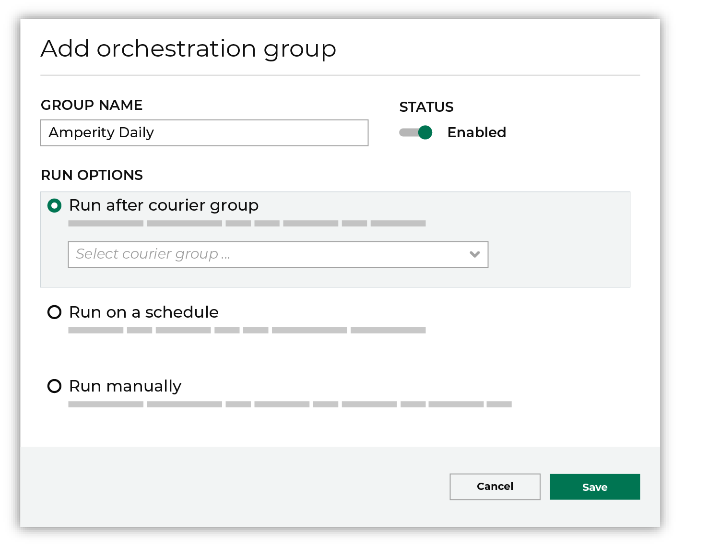

.. 
.. https://docs.amperity.com/reference/
.. 

.. meta::
    :description lang=en:
        Orchestration groups may be configured to run a series of orchestrations as one workflow.

.. meta::
    :content class=swiftype name=body data-type=text:
        Orchestration groups may be configured to run a series of orchestrations as one workflow

.. meta::
    :content class=swiftype name=title data-type=string:
        About orchestration groups

==================================================
About orchestration groups
==================================================

.. include:: ../../shared/terms.rst
   :start-after: .. term-orchestration-group-start
   :end-before: .. term-orchestration-group-end

.. orchestration-groups-about-start

Orchestration groups are configured in the **Destinations** page, from the **Add orchestration group** link at the top of the **Orchestrations** list.

.. orchestration-groups-about-end

.. orchestration-groups-about-list-start

There are three configuration options for orchestration groups:

#. :ref:`Run after courier group <orchestration-groups-run-after-courier-group>`
#. :ref:`Run on a schedule <orchestration-groups-run-on-a-schedule>`
#. :ref:`Run manually <orchestration-groups-run-manually>`

.. orchestration-groups-about-list-end

.. orchestration-groups-about-context-start

An orchestration group may include more than one orchestration. Add each orchestration to the orchestration group by configuring the orchestration to run automatically, after which you may select the orchestration group to which this orchestration belongs.

.. orchestration-groups-about-context-end

.. _orchestration-groups-run-after-courier-group:

Run after courier group
==================================================

.. orchestration-groups-courier-group-constraints-start

An orchestration group may be configured to run only after a courier group has run successfully, including loading all data and meeting all requirements.

.. orchestration-groups-courier-group-constraints-end

**To configure an orchestration group to run after a courier group**

.. orchestration-groups-courier-group-constraints-steps-start

.. list-table::
   :widths: 10 90
   :header-rows: 0

   * - .. image:: ../../images/steps-01.png
          :width: 60 px
          :alt: Step 1.
          :align: left
          :class: no-scaled-link
     - Open the **Destinations** page, and then from the **Orchestrations** section, click the **Add orchestration group** link.

   * - .. image:: ../../images/steps-02.png
          :width: 60 px
          :alt: Step 2.
          :align: left
          :class: no-scaled-link
     - In the **Add orchestration group** dialog box, give the orchestration group a name, and then move the slider to enabled.

   * - .. image:: ../../images/steps-03.png
          :width: 60 px
          :alt: Step 3.
          :align: left
          :class: no-scaled-link
     - Under **Run options**, select **Run after courier group**.

       Select a courier group from the drop-down menu.

       .. image:: ../../images/mockup-orchestration-group-run-after-courier-group.png
          :width: 360 px
          :alt: Configure an orchestration group to be run after a courier group.
          :align: left
          :class: no-scaled-link

   * - .. image:: ../../images/steps-04.png
          :width: 60 px
          :alt: Step 4.
          :align: left
          :class: no-scaled-link
     - Click **Save**.

.. orchestration-groups-courier-group-constraints-steps-end

.. _orchestration-groups-run-on-a-schedule:

Run on a schedule
==================================================

.. orchestration-groups-run-on-a-schedule-start

An orchestration group may be configured to run on a schedule, using a cron schedule to define the specific time at which the run should begin, and a UTC timezone.

.. note:: You will see the enable/disable status only for scheduled orchestration groups.

.. orchestration-groups-run-on-a-schedule-end

**To configure an orchestration group to run on a schedule**

.. orchestration-groups-run-on-a-schedule-steps-start

.. list-table::
   :widths: 10 90
   :header-rows: 0

   * - .. image:: ../../images/steps-01.png
          :width: 60 px
          :alt: Step 1.
          :align: left
          :class: no-scaled-link
     - Open the **Destinations** page, and then from the **Orchestrations** section, click the **Add orchestration group** link.

   * - .. image:: ../../images/steps-02.png
          :width: 60 px
          :alt: Step 2.
          :align: left
          :class: no-scaled-link
     - In the **Add orchestration group** dialog box, give the orchestration group a name, and then move the slider to enabled.

   * - .. image:: ../../images/steps-03.png
          :width: 60 px
          :alt: Step 3.
          :align: left
          :class: no-scaled-link
     - Under **Run options**, select **Run on a schedule**.

       .. image:: ../../images/mockup-orchestration-group-run-on-a-schedule.png
          :width: 360 px
          :alt: Configure an orchestration group to be run on a schedule.
          :align: left
          :class: no-scaled-link

   * - .. image:: ../../images/steps-04.png
          :width: 60 px
          :alt: Step 4.
          :align: left
          :class: no-scaled-link
     - Click **Save**.

.. orchestration-groups-run-on-a-schedule-steps-end

.. _orchestration-groups-cron-schedules:

About cron schedules
--------------------------------------------------

.. include:: ../../shared/terms.rst
   :start-after: .. term-orchestration-group-schedule-start
   :end-before: .. term-orchestration-group-schedule-end

.. orchestration-groups-cron-schedules-tip-start

.. tip:: Amperity workflows are typically run once per day. For the best results for a daily schedule, define only the minute and hour settings. For example: ``30 8 * * *``.

.. orchestration-groups-cron-schedules-tip-end

.. orchestration-groups-cron-schedules-important-start

.. important:: Some workflows do not require a daily update. Amperity supports running workflows on less frequent basis, such as on a weekly basis. For example, to define a workflow that runs at 8:30 AM every Monday, use a cron string that identifies the day of the week. For example: ``30 8 * * 1`` where "1" identifies the day of the week (Monday).

.. orchestration-groups-cron-schedules-important-end

**About cron**

.. include:: ../../shared/terms.rst
   :start-after: .. term-cron-start
   :end-before: .. term-cron-end

.. include:: ../../shared/terms.rst
   :start-after: .. term-crontab-syntax-start
   :end-before: .. term-crontab-syntax-end

.. _orchestration-groups-timezones:

About timezones
--------------------------------------------------

.. orchestration-groups-timezones-start

An orchestration group schedule must be associated with a UTC timezone. The timezone determines the point at which an orchestration group's scheduled start time begins.

.. orchestration-groups-timezones-end

.. orchestration-groups-timezones-about-start

The timezones that are available for selection in Amperity are modeled after the Google Calendar and are similar to:

.. code-block:: none

   (GMT - 08:00) Pacific Time
   (GMT - 07:00) Mountain Time
   (GMT - 06:00) Central Time
   (GMT - 05:00) Eastern Time

.. orchestration-groups-timezones-about-end

.. orchestration-groups-timezones-downstream-start

The timezone that is chosen for an orchestration group schedule should consider every downstream business processes that requires the data and also the timezone(s) in which the consumers of that data will operate.

.. orchestration-groups-timezones-downstream-end

.. orchestration-groups-timezones-tip-start

.. tip:: Do not create orchestration group schedules that may occur during a daylight savings time transition. 

   For example, an orchestration group schedule with the cron string of ``30 2 * * *`` and a timezone of "(GMT-08:00) Pacific Time" will run once a day most at 2:30am, except for one day in the spring when it will not run at all and one day in the fall when it will run twice.

   This is because American daylight savings time transitions at 2:00 AM, meaning the 2:00 AM hour occurs twice when transitioning out of daylight savings time (Fall) and is skipped altogether when transitioning into daylight savings time (Spring).

.. orchestration-groups-timezones-tip-end

.. _orchestration-groups-run-manually:

Run manually
==================================================

.. orchestration-groups-run-manually-start

An orchestration group can be configured to be run manually.

.. orchestration-groups-run-manually-end

**To configure an orchestration group to run manually**

.. orchestration-groups-run-manually-steps-start

.. list-table::
   :widths: 10 90
   :header-rows: 0

   * - .. image:: ../../images/steps-01.png
          :width: 60 px
          :alt: Step 1.
          :align: left
          :class: no-scaled-link
     - Open the **Destinations** page, and then from the **Orchestrations** section, click the **Add orchestration group** link.

   * - .. image:: ../../images/steps-02.png
          :width: 60 px
          :alt: Step 2.
          :align: left
          :class: no-scaled-link
     - In the **Add orchestration group** dialog box, give the orchestration group a name, and then move the slider to enabled.

   * - .. image:: ../../images/steps-03.png
          :width: 60 px
          :alt: Step 3.
          :align: left
          :class: no-scaled-link
     - Under **Run options**, select **Run manually**.

       .. image:: ../../images/mockup-orchestration-group-run-manually.png
          :width: 360 px
          :alt: Configure an orchestration group to be run manually.
          :align: left
          :class: no-scaled-link

   * - .. image:: ../../images/steps-04.png
          :width: 60 px
          :alt: Step 4.
          :align: left
          :class: no-scaled-link
     - To run the orchestration group, on the **Destinations** page, and then from the actions menu for that orchestration group, select the **Run** menu option.

       .. image:: ../../images/mockup-orchestration-group-run-action.png
          :width: 500 px
          :alt: Select the Run button from the actions menu.
          :align: left
          :class: no-scaled-link

   * - .. image:: ../../images/steps-05.png
          :width: 60 px
          :alt: Step 5.
          :align: left
          :class: no-scaled-link
     - Click **Save**.

.. orchestration-groups-run-manually-steps-end
