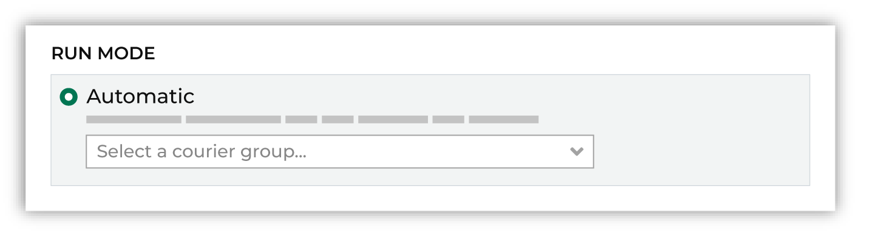
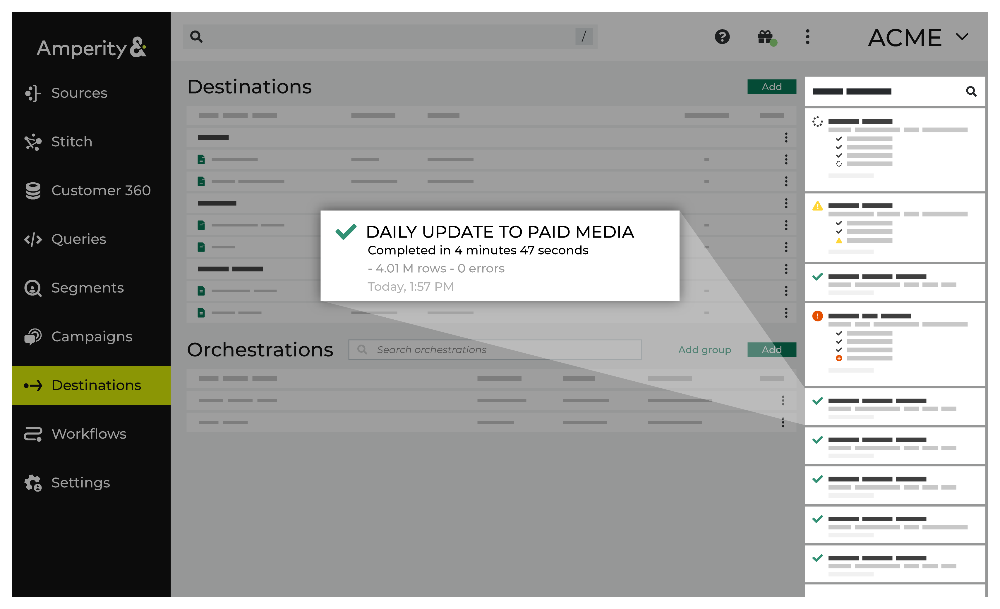

.. https://docs.amperity.com/reference/

.. meta::
    :description lang=en:
        Orchestrations may be configured to send query results to any downstream workflow.

.. meta::
    :content class=swiftype name=body data-type=text:
        Orchestrations may be configured to send query results to any downstream workflow.

.. meta::
    :content class=swiftype name=title data-type=string:
        About orchestrations

==================================================
About orchestrations
==================================================

.. include:: ../../shared/terms.rst
   :start-after: .. term-orchestration-start
   :end-before: .. term-orchestration-end

.. orchestrations-about-start

An orchestration may be added for an active query or for a database export. An orchestration must be associated to an existing destination. Depending on the data schema required by the destination, a data template may also be necessary.

.. note:: You may not add an orchestration for a draft query.

.. orchestrations-about-end

.. orchestrations-view-start

The **Destinations** page shows the status of every orchestration and orchestration group, including when it last ran or updated, and its current status.

.. orchestrations-view-end

.. _orchestrations-howtos:

How-tos
==================================================

.. include:: ../../shared/terms.rst
   :start-after: .. term-destinations-tab-start
   :end-before: .. term-destinations-tab-end

.. orchestrations-howtos-start

This section describes tasks related to managing orchestrations in Amperity:

* :ref:`orchestrations-add`
* :ref:`orchestrations-assign-database-export`
* :ref:`orchestrations-assign-query`
* :ref:`orchestrations-delete`
* :ref:`orchestrations-edit`
* :ref:`orchestrations-run-automatic`
* :ref:`orchestrations-run-manually`
* :ref:`orchestrations-view-notifications`

.. orchestrations-howtos-end

.. _orchestrations-add:

Add orchestration
--------------------------------------------------

.. orchestrations-add-start

Use the **Add Orchestration** button to add an orchestration to Amperity. An orchestration should be created for each workflow that sends data from Amperity to an external destination. An orchestration uses a destination and a data template, both of which may be used by other orchestrations.

.. orchestrations-add-end

**To add an orchestration**

.. orchestrations-add-steps-start

#. From the **Destinations** page click **Add Orchestration**. This opens the **Add Orchestration** dialog box.
#. From the **Object Type** drop-down, select **Query** or **Database Export**.
#. From the **Object** drop-down, select the name of the query or database export that will be sent to a destination.

   .. note:: This name will also be the name of the orchestration.
#. From the **Destination** drop-down, select the name of a destination that is configured to send data.
#. From the **Data Template** drop-down, select a data template.
#. Verify any destination-specific settings.

   .. admonition:: Settings are determined by the destination and data template

      Orchestration settings vary depending on which destination and data template are associated with it.

#. Set the workflow to **Manual**. (You can change this to automatic later, after verifying the end-to-end workflow.)
#. Click **Save**.

.. orchestrations-add-steps-end

.. _orchestrations-assign-database-export:

Assign database export
--------------------------------------------------

.. include:: ../../amperity_reference/source/data_exports.rst
   :start-after: .. data-exports-add-start
   :end-before: .. data-exports-add-end

**To assign a database export to an orchestration**

.. include:: ../../amperity_reference/source/data_exports.rst
   :start-after: .. data-exports-add-to-orchestration-steps-start
   :end-before: .. data-exports-add-to-orchestration-steps-end

.. _orchestrations-assign-query:

Assign query
--------------------------------------------------

.. orchestrations-assign-query-start

A query orchestration sends the results of one (or more) active queries built using the visual **Query Editor** or **SQL Query Editor** to filedrop, REST API, and warehouse locations.

.. orchestrations-assign-query-end

**To assign a query to an automated workflow**

.. orchestrations-view-assign-query-steps-start

#. From the **Destinations** page, under **Orchestrations**, open the menu in the same row as the orchestration to be edited, and then select **Edit**.
#. Under **Workflow**, select **Automatically**, and then select the name of a query.
#. Click **Save**.

.. orchestrations-view-assign-query-steps-end

.. _orchestrations-delete:

Delete orchestration
--------------------------------------------------

.. orchestrations-delete-start

Use the **Delete** option to remove an orchestration from Amperity. This should be done carefully. Verify that both upstream and downstream processes no longer depend on this orchestration prior to deleting it. This action will *not* delete the data template or destination associated with the orchestration.

.. orchestrations-delete-end

**To delete an orchestration**

.. orchestrations-delete-steps-start

#. From the **Destinations** page, open the menu for an orchestration, and then select **Delete**.
#. Click **Delete** to confirm.

.. orchestrations-delete-steps-end

.. _orchestrations-edit:

Edit orchestration
--------------------------------------------------

.. orchestrations-edit-start

Use the **Edit** option to modify the settings for an orchestration. This should be done carefully. Verify that both upstream and downstream processes that depend on this orchestration continue to work properly after the changes are saved. This action will *not* modify the data template or destination associated with the orchestration.

.. orchestrations-edit-end

**To edit an orchestration**

.. orchestrations-edit-steps-start

#. From the **Destinations** page, open the menu for an orchestration, and then select **Edit**.
#. Make your changes.
#. Click **Save**.

.. orchestrations-edit-steps-end

.. _orchestrations-run:

Run orchestration
--------------------------------------------------

.. orchestrations-run-start

Amperity sends the results to any number of downstream workflows via orchestrations. An orchestration contains query data or a database export, a schedule, data templates, and a destination that is configured with the credentials Amperity needs to be able to write data.

.. orchestrations-run-end

.. orchestrations-run-steps-start

#. From the **Destinations** page, open the menu for an orchestration, and then select **Run**.
#. The **Status** column for the orchestration group will update to say "Waiting to start...", after which the notifications pane will update to include a notification that shows the status of the orchestration.
#. When the orchestration has run successfully, its status is updated to "Completed".

.. orchestrations-run-steps-end

.. orchestrations-run-options-start

Orchestrations can be run in the following ways:

* :ref:`Automatic <orchestrations-run-automatic>`
* :ref:`Manual <orchestrations-run-manually>`

.. orchestrations-run-options-end

.. _orchestrations-run-automatic:

Automatically
++++++++++++++++++++++++++++++++++++++++++++++++++

.. orchestrations-run-automatic-start

An orchestration can be configured to run after a courier when the run mode is set to **Automatic** and an active courier group is selected from the drop-down menu.

.. orchestrations-run-automatic-start

.. _orchestrations-run-manually:

Manually
++++++++++++++++++++++++++++++++++++++++++++++++++

.. orchestrations-run-manually-start

A manual orchestration only runs when a user selects the **Run** option from the orchestrations list in the **Destinations** page.

.. orchestrations-run-manually-end

**To configure an orchestration to run manually**

.. orchestrations-run-manually-steps-start

#. From the **Destinations** page, under **Orchestrations**, open the menu in the same row as the orchestration to be edited, and then select **Edit**.
#. Under **Workflow**, select **Manual**.
#. Click **Save**.

.. orchestrations-run-manually-steps-end

.. _orchestrations-run-scheduled-always-run:

Scheduled, always run
++++++++++++++++++++++++++++++++++++++++++++++++++

.. orchestrations-run-scheduled-always-run-start

An orchestration can be scheduled to run every day, regardless of changes to upstream data.

.. orchestrations-run-scheduled-always-run-end

**To configure an orchestration to run daily on a schedule**

.. orchestrations-run-daily-steps-start

#. From the **Destinations** page, under **Destinations**, open the menu in the same row as the destination to be edited, and then select **Edit**.
#. Enter a schedule.
#. Click **Save**.
#. From the **Destinations** page, under **Orchestrations**, open the menu in the same row as the orchestration to be edited, and then select **Edit**.
#. Under **Workflow**, select **Automatically**, and then select the name of a query.
#. Click **Save**.

.. orchestrations-run-daily-steps-end

.. _orchestrations-run-scheduled-wait-for-changes:

Scheduled, wait for changes
++++++++++++++++++++++++++++++++++++++++++++++++++

.. orchestrations-run-scheduled-wait-for-changes-start

An orchestration can be scheduled to run every day, but then only start the run if upstream data has changed.

.. orchestrations-run-scheduled-wait-for-changes-end

**To configure an orchestration to run on a schedule, but only when data changes**

.. orchestrations-run-when-upstream-changes-steps-start

#. From the **Destinations** page, under **Destinations**, open the menu in the same row as the destination to be edited, and then select **Edit**.
#. Enter a schedule, the courier group constraint, and an offset. The specified courier group must have updated data. The orchestration group will check for updated data at the scheduled time, but will run only when there is updated data.
#. Click **Save**.
#. From the **Destinations** page, under **Orchestrations**, open the menu in the same row as the orchestration to be edited, and then select **Edit**.
#. Under **Workflow**, select **Automatically**, and then select the name of a query.
#. Click **Save**.

.. orchestrations-run-when-upstream-changes-steps-end

.. _orchestrations-run-unscheduled-wait-for-changes:

Wait for changes
++++++++++++++++++++++++++++++++++++++++++++++++++

.. orchestrations-run-unscheduled-wait-for-changes-start

An orchestration can be scheduled to run only when upstream data changes.

.. orchestrations-run-unscheduled-wait-for-changes-end

**To configure an orchestration to wait for data changes before running**

.. orchestrations-run-wait-for-upstream-changes-steps-start

#. From the **Destinations** page, under **Destinations**, open the menu in the same row as the destination to be edited, and then select **Edit**.
#. Enter a schedule (optional), the courier group constraint, and an offset. The specified courier group must have updated data for this orchestration group to run.
#. Click **Save**.
#. From the **Destinations** page, under **Orchestrations**, open the menu in the same row as the orchestration to be edited, and then select **Edit**.
#. Under **Workflow**, select **Automatically**, and then select the name of a query.
#. Click **Save**.

.. orchestrations-run-wait-for-upstream-changes-steps-end

.. _orchestrations-view-notifications:

View notifications
--------------------------------------------------

.. orchestrations-view-notifications-start

Notifications for the **Orchestrations** page appear after Amperity added an orchestration to an active query or for a database export. Less often, notifications contain details for non-successful outcomes, such as failures related to upstream or downstream processes.

.. orchestrations-view-notifications-end

.. orchestrations-view-notifications-context-start

If a notification is about a non-successful outcome, the details for why and what happened can be found in the notification itself. Click **More** to view the full notification. Click **View Workflow** to open the workflow in the **Workflows** page.

In some cases viewing the log files may be helpful. In many cases, fix the root cause of the non-successful outcome, and then rerun the process manually. The **Workflows** page will provide a set of workflow actions that you can initiate directly.

.. orchestrations-view-notifications-context-end
