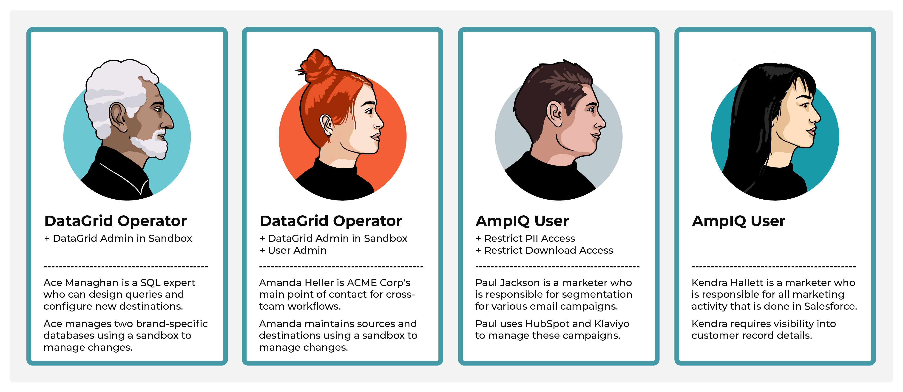

.. https://docs.amperity.com/reference/

.. meta::
    :description lang=en:
        Policies define how your users can interact with features and data within Amperity.

.. meta::
    :content class=swiftype name=body data-type=text:
        Policies define how your users can interact with features and data within Amperity.

.. meta::
    :content class=swiftype name=title data-type=string:
        About policies

==================================================
About policies
==================================================

.. include:: ../../shared/terms.rst
   :start-after: .. term-policy-start
   :end-before: .. term-policy-end

.. policies-start

Policies may be assigned to users, along with assigning the actions that each policy represents. You may assign more than one policy to a user.

.. policies-end

.. policies-important-start

.. important:: If you see the message "Access Denied" when trying to access a page in Amperity, you may not have sufficient policies assigned to your user. See the :ref:`list of actions by policy <policies-allowed-actions>` for detailed information about the specific areas within Amperity that each policy represents.

.. policies-important-end

.. _policies-howitworks:

How policies work
==================================================

.. policies-howitworks-start

Actions within Amperity are controlled by policies, which act as containers for a set of actions. All tenants share a set of global policies with groups for standard policies and administrator policies. Each tenant assigns one or more policies to every user in their tenant, after which each user may also be assigned any of the policy options.

Each user has a set of assigned actions that are determined by their assigned policy (or policies). Policy assignment may be managed using SSO (recommended) or may be :doc:`managed from the Amperity user interface <resource_groups>` by users who are assigned the **Allow user administration** policy option.

The access model in Amperity defines actions as short strings that contain a resource type and an associated verb. A policy is a series of statements that allow or deny actions. For example: ``pii:download`` is an action. ``pii`` is the resource type and ``download`` is the associated verb. A user that is authorized to perform this action may run a query or segment, and then click the **Download** button to download the results.

When a user logs on to Amperity the policy (or policies) that are assigned to that user are identified, and are then used to determine the set of statements that allow or deny actions to that user.

Amperity reviews all statements to determine if a user is allowed to perform an action. A user action is allowed when a statement allows the action. A user action is denied when a statement denies the action *or* when no statements match the action.

**Example**

The following individuals comprise the Amperity team at ACME Corp: Ace Managhan (a SQL expert), Amanda Heller (the main point of contact for source and destination configuration), along with two members of the marketing team (Paul Jackson and Kendra Hallett).

Ace and Kendra are both assigned the **DataGrid Operator** policy in their production tenant. When they want to make changes to **Sources** and **Databases**, they create new sandboxes. In these sandboxes, they are automatically assigned the **DataGrid Administrator** policy, and maintain other add-on policies they have.

Since Kendra has the **Allow sandbox administration** and **Allow user administration** add-on policies, she can immediately access Ace’s sandboxes, add users to it, review Ace’s changes, and promote them to production. 

Ace works closely with Paul and Kendra to support their downstream marketing activity. Paul and Kendra belong to the marketing team. Paul is assigned the **AmpIQ User** policy and manages all campaign sends from HubSpot and Klaviyo. ACME Corp policy requires that only certain members of the company can have access to customer’s profile data, which Kendra requires, but Paul does not. Paul is restricted from viewing profile data (though he can see the email addresses within HubSpot and Klaviyo, but only after they are sent from Amperity) and cannot download the segment results.

Paul and Kendra belong to the marketing team. Paul is assigned the **AmpIQ User** policy and manages all campaign sends from HubSpot and Klaviyo. ACME Corp policy requires that only certain members of the company can have access to customer's profile data, which Kendra requires, but Paul does not. Paul is restricted from viewing profile data (though he can see the email addresses within HubSpot and Klaviyo, but only after they are sent from Amperity) and cannot download the segment results.

Kendra manages a complex series of marketing campaign activity through Salesforce, some of which requires verification of certain types of profile data before sending it to Salesforce from Amperity. Kendra often uses SQL to build custom queries to return specific results for key downstream use cases.

Paul and Kendra work closely with Amanda to make sure the right data is being sent to their downstream marketing activities and also work closely with Ace to ensure they have access to the right sets of tables when building segments and queries.

.. policies-end

.. _policies-standard:

Standard policies
==================================================

.. policies-standard-start

The following standard policies are available:

* :ref:`Amp360 User <policies-amp360-user>`
* :ref:`AmpIQ User <policies-ampiq-user>`
* :ref:`DataGrid Administrator <policies-datagrid-administrator>`
* :ref:`DataGrid Operator <policies-datagrid-operator>`

.. policies-standard-end

.. _policies-amp360-user:

Amp360 User
--------------------------------------------------

.. include:: ../../shared/terms.rst
   :start-after: .. term-amp360-user-policy-start
   :end-before: .. term-amp360-user-policy-end

.. include:: ../../shared/terms.rst
   :start-after: .. term-amp360-user-policy-assign-start
   :end-before: .. term-amp360-user-policy-assign-end

.. _policies-ampiq-user:

AmpIQ User
--------------------------------------------------

.. include:: ../../shared/terms.rst
   :start-after: .. term-ampiq-user-policy-start
   :end-before: .. term-ampiq-user-policy-end

.. include:: ../../shared/terms.rst
   :start-after: .. term-ampiq-user-policy-assign-start
   :end-before: .. term-ampiq-user-policy-assign-end

.. _policies-datagrid-administrator:

DataGrid Administrator
--------------------------------------------------

.. include:: ../../shared/terms.rst
   :start-after: .. term-datagrid-administrator-policy-start
   :end-before: .. term-datagrid-administrator-policy-end

.. include:: ../../shared/terms.rst
   :start-after: .. term-datagrid-administrator-policy-assign-start
   :end-before: .. term-datagrid-administrator-policy-assign-end

.. _policies-datagrid-operator:

DataGrid Operator
--------------------------------------------------

.. include:: ../../shared/terms.rst
   :start-after: .. term-datagrid-operator-policy-start
   :end-before: .. term-datagrid-operator-policy-end

.. include:: ../../shared/terms.rst
   :start-after: .. term-datagrid-operator-policy-assign-start
   :end-before: .. term-datagrid-operator-policy-assign-end

.. policices-datagrid-operator-manual-assign-start

If users are assigned to a sandbox manually they must be assigned the **DataGrid Administrator** policy within the sandbox to allow that user full access to all features within the sandbox.

.. policices-datagrid-operator-manual-assign-end

.. _policies-policy-options:

Policy options
==================================================

.. policies-policy-options-start

The following policy options are available:

* :ref:`Allow API key administration <policies-api-key-administrator>`
* :ref:`Allow Profile API administration <policies-profile-api-administrator>`
* :ref:`Allow sandbox administration <policies-sandbox-administrator>`
* :ref:`Allow source data deletion <policies-allow-source-data-deletion>`
* :ref:`Allow user administration <policies-allow-user-administration>`
* :ref:`Restrict AI Assistant access <policies-option-restrict-ai-assistant>`
* :ref:`Restrict data exports <policies-option-restrict-data-exports>`
* :ref:`Restrict download access <policies-option-restrict-downloads>`
* :ref:`Restrict PII access <policies-option-restrict-pii>`
* :ref:`Restrict upload access <policies-option-restrict-upload-access>`

.. policies-policy-options-end

.. policies-policy-options-note-start

.. note:: Restricted actions are indicated in the :ref:`policy table <policies-allowed-actions>` using the |no-download-policy| icon. Any user may be assigned the **Allow user administration** policy option (indicated by |manage-users-icon|).

.. policies-policy-options-note-end

.. _policies-api-key-administrator:

Allow API key administration
--------------------------------------------------

.. policies-api-key-administrator-start

The **Allow API key administration** policy allows full access to managing the API keys and access tokens that are used with the Profile and Streaming Ingest APIs. This policy enables the **API keys** list on the **Users and Activity** page.

.. policies-api-key-administrator-end

.. _policies-profile-api-administrator:

Allow Profile API administration
--------------------------------------------------

.. include:: ../../shared/terms.rst
   :start-after: .. term-profile-api-administrator-policy-start
   :end-before: .. term-profile-api-administrator-policy-end

.. _policies-sandbox-administrator:

Allow sandbox administration
--------------------------------------------------

.. include:: ../../shared/terms.rst
   :start-after: .. term-sandbox-administrator-policy-start
   :end-before: .. term-sandbox-administrator-policy-end

.. include:: ../../shared/terms.rst
   :start-after: .. term-sandbox-administrator-policy-assign-start
   :end-before: .. term-sandbox-administrator-policy-assign-end

.. _policies-allow-source-data-deletion:

Allow source data deletion
--------------------------------------------------

.. policies-sandbox-administrator-start

The **Allow source data deletion** policy may be assigned to a **DataGrid Operator** to allow users assigned that policy the ability to delete domain table data from the **Sources** page.

.. policies-sandbox-administrator-end

.. _policies-allow-user-administration:

Allow user administration
--------------------------------------------------

.. policies-allow-user-administration-start

The **Allow user administration** policy may be assigned to users to enable access to the :ref:`Users settings tab <policies-allowed-actions-settings-users>`, the :ref:`Security settings tab (for resource groups) <policies-allowed-actions-settings-security>`, and the :ref:`Activity log settings tab <policies-allowed-actions-settings-activity-log>`.

.. policies-allow-user-administration-end

.. _policies-option-restrict-ai-assistant:

Restrict AI Assistant access
--------------------------------------------------

.. policies-option-restrict-data-exports-start

The **Restrict AI Assistant access** policy option prevents users from interacting with **AmpAI** features on the **Queries** page.

.. policies-option-restrict-data-exports-end

.. _policies-option-restrict-data-exports:

Restrict data exports
--------------------------------------------------

.. policies-option-restrict-data-exports-start

The **Restrict data exports** policy option prevents users from using orchestrations or campaigns.

.. policies-option-restrict-data-exports-end

.. _policies-option-restrict-downloads:

Restrict download access
--------------------------------------------------

.. policies-option-restrict-downloads-start

The **Restrict download access** policy option prevents users from downloading query and segment results.

.. policies-option-restrict-downloads-end

.. _policies-option-restrict-pii:

Restrict PII access
--------------------------------------------------

.. policies-option-restrict-pii-start

The **Restrict PII access** policy option prevents users from viewing data that is marked as PII.

This option may only be assigned to the **AmpIQ User** and **Amp360 User** policies.

.. policies-option-restrict-pii-end

.. policies-option-restrict-pii-context-start

Users of Amperity who are assigned the **AmpIQ User** and **Amp360 User** policies *along with* the :ref:`Restrict PII access <policies-option-restrict-pii>` policy option are prevented from viewing PII when that data was marked as PII in the database table.

When the **PII** checkbox is selected, the following locations will not show PII values to users who do not have permission to view PII data:

* The **Examples** page in the **Data Explorer**.
* Data that is returned by a query in the **Queries** page.
* Data that is returned by a segment in the **Segments** page.

When PII data is hidden, users are shown the following message:

::

   Some personally identifiable information has been redacted from these results.

.. policies-option-restrict-pii-context-end

.. _policies-option-restrict-upload-access:

Restrict upload access
--------------------------------------------------

.. policies-option-restrict-upload-access-start

The **Restrict upload access** policy option prevents users from uploading files to the **Customer 360**, **Queries**, or **Segments** pages.

This option may only be assigned to the **AmpIQ User** and **Amp360 User** policies.

.. policies-option-restrict-upload-access-end

.. _policies-read-only:

Read-only options
==================================================

.. policies-read-only-start

The following policies have read-only options:

* :ref:`Amp360 User <policies-read-only-amp360-user>`
* :ref:`AmpIQ User <policies-read-only-ampiq-user>`
* :ref:`DataGrid Operator <policies-read-only-datagrid-operator>`

.. policies-read-only-end

.. policies-read-only-note-start

.. note:: Allowed read-only actions are indicated in the :ref:`policy table <policies-allowed-actions>` using the |allowed-read-only-actions-icon| icon.

.. policies-read-only-note-end

.. _policies-read-only-amp360-user:

Amp360 User - Read Only
--------------------------------------------------

.. policies-read-only-amp360-user-start

The **Amp360 User - Read Only** policy allows read-only access to the **Customer 360** and **Queries** pages.

Assign this policy to users who will explore databases and SQL queries, but will not create queries or send the results of queries to configured destinations.

.. policies-read-only-amp360-user-end

.. _policies-read-only-ampiq-user:

AmpIQ User - Read Only
--------------------------------------------------

.. policies-read-only-ampiq-user-start

The **AmpIQ User - Read Only** policy allows read-only access to the **Metrics**, **Segments**, and **Campaigns** pages.

Assign this policy to users who will view and explore metrics, segments, and campaigns, but will not create segments or run campaigns.

.. policies-read-only-ampiq-user-end

.. _policies-read-only-datagrid-operator:

DataGrid Operator - Read Only
--------------------------------------------------

.. policies-read-only-datagrid-operator-start

The **DataGrid Operator - Read Only** policy allows read-only access to the **Sources**, **Stitch**, **Customer 360**, **Queries**, **Metrics**, **Segments**, **Campaigns**, and **Destinations** page.

Assign this policy to users who need to view the entire application, including *all resource groups*, but should not make changes.

.. policies-read-only-datagrid-operator-end

.. _policies-allowed-actions:

Allowed actions
==================================================

.. policies-allowed-actions-start

The following sections describe the set of actions that may be assigned to users of Amperity. These actions are grouped by page (:ref:`Sources <policies-allowed-actions-sources>`, :ref:`Stitch <policies-allowed-actions-stitch>`, :ref:`Customer 360 <policies-allowed-actions-databases>`, :ref:`Queries <policies-allowed-actions-queries>`, :ref:`Segments <policies-allowed-actions-segments>`, :ref:`Campaigns <policies-allowed-actions-campaigns>`, :ref:`Destinations <policies-allowed-actions-destinations>`, :ref:`Workflows <policies-allowed-actions-workflows>`, and :ref:`Credentials <policies-allowed-actions-settings>`) with additional sections for the :ref:`Data Explorer <policies-allowed-actions-data-explorer>` and :ref:`Sandboxes <policies-allowed-actions-sandboxes>`.

.. policies-allowed-actions-end

.. policies-allowed-actions-icons-start

.. admonition:: Allowed, optional, and required actions

   The following sections use icons to indicate when actions are available.

   .. list-table::
      :widths: 8 20 72
      :header-rows: 0

      * - |policy| 
        - Allowed.
        - A user assigned to this policy can perform this action.

      * - |allowed-read-only-actions-icon|
        - Read-only.
        - A user assigned to this policy has read-only access.

      * - |no-download-policy|
        - Optional.
        - This action may be restricted using the **Restrict download access** add-on policy.

      * - |no-upload-policy|
        - Optional.
        - This action may be restricted using the **Restrict upload access** add-on policy.

      * - |polino|
        - Optional.
        - This action is allowed, but visibility of data may be restricted using the **Restrict PII access** add-on policy.

      * - |polius|
        - Optional.
        - This action is allowed when a user is assigned the **User Administration** add-on policy.

      * - |poliky|
        - Optional.
        - This action is allowed when a user is assigned the **API key administration** add-on policy or the **Profile API administration** add-on policy.

      * - |policy-sandbox-allow-admin|
        - Optional.
        - This action is allowed when a **DataGrid Operator** or **DataGrid Administrator** is assigned the **Allow sandbox administration** add-on policy.

      * - |policy-sandbox-validation-required|
        - Validation required.
        - This action is allowed *after* changes in a sandbox have passed validation and are ready to be promoted to your production tenant.

          .. important:: Only users who are assigned the **Allow sandbox administration** policy option may promote changes from a sandbox to production.

.. policies-allowed-actions-icons-end

.. _policies-allowed-actions-sources:

Sources
--------------------------------------------------

.. policies-allowed-actions-sources-start

The following table lists the actions that are enabled within the **Sources** page when users are assigned to specific policies.

.. policies-allowed-actions-sources-end

.. policies-allowed-actions-sources-table-start

.. list-table::
   :widths: 40 15 15 15 15
   :header-rows: 1

   * - Actions
     - Amp360 User
     - AmpIQ User
     - DataGrid Operator
     - DataGrid Admin

   * - View **Sources** page
     - 
     - 
     - |policy|
     - |policy|

   * - Run validations
     - 
     - 
     - |policy|
     - |policy|

   * - View data lineage
     - 
     - 
     - |policy|
     - |policy|

   * - View semantics
     - 
     - 
     - 
     - |policy|

   * - **Courier groups**
     - 
     - 
     - 
     - 

   * - Add courier group
     - 
     - 
     - 
     - |policy|

   * - Delete courier group
     - 
     - 
     - 
     - |policy|

   * - Edit courier group
     - 
     - 
     - 
     - |policy|

   * - Run courier group
     - 
     - 
     - |policy|
     - |policy|

   * - Schedule courier group
     - 
     - 
     - 
     - |policy|

   * - View courier groups
     - 
     - 
     - |policy|
     - |policy|

   * - **Couriers**
     - 
     - 
     - 
     - 

   * - Add credential
     - 
     - 
     - |policy|
     - |policy|

   * - Add courier
     - 
     - 
     - 
     - |policy|

   * - Delete courier
     - 
     - 
     - 
     - |policy|

   * - Edit courier
     - 
     - 
     - 
     - |policy|

   * - Run courier
     - 
     - 
     - |policy|
     - |policy|

   * - View couriers
     - 
     - 
     - |policy|
     - |policy|

   * - View credentials
     - 
     - 
     - |policy|
     - |policy|

   * - **Domain tables**
     - 
     - 
     - 
     - 

   * - Add custom domain table
     - 
     - 
     - 
     - |policy|

   * - Delete custom domain table
     - 
     - 
     - 
     - |policy|

   * - Delete domain tables
     - 
     - 
     - 
     - |policy|

   * - Edit custom domain table
     - 
     - 
     - 
     - |policy|

   * - Make available to Stitch
     - 
     - 
     - 
     - |policy|

   * - Publish to **Queries** page
     - 
     - 
     - |policy|
     - |policy|

   * - View custom domain tables
     - 
     - 
     - |poliro|
     - |policy|

   * - View domain tables
     - 
     - 
     - |poliro|
     - |policy|

   * - **Feeds**
     - 
     - 
     - 
     - 

   * - Add feed
     - 
     - 
     - |policy|
     - |policy|

   * - Delete feed
     - 
     - 
     - |policy|
     - |policy|

   * - Edit feed
     - 
     - 
     - |policy|
     - |policy|

   * - Load new data
     - 
     - 
     - |policy|
     - |policy|

   * - Make available to Stitch
     - 
     - 
     - |policy|
     - |policy|

   * - View feeds
     - 
     - 
     - |policy|
     - |policy|

   * - **Ingest SQL**
     - 
     - 
     - 
     - 

   * - Add ingest query
     - 
     - 
     - 
     - |policy|

   * - Delete ingest query
     - 
     - 
     - 
     - |policy|

   * - Edit ingest query
     - 
     - 
     - 
     - |policy|

   * - View ingest queries

     - 
     - 
     - |poliro|
     - |policy|

   * - **Notifications**
     - 
     - 
     - 
     - 

   * - View detailed errors
     - 
     - 
     - |policy|
     - |policy|

   * - View notifications
     - 
     - 
     - |policy|
     - |policy|

   * - **Shares**
     - 
     - 
     - 
     - 

   * - Add bridge
     - 
     - 
     - 
     - |policy|

   * - Delete bridge
     - 
     - 
     - 
     - |policy|

   * - Edit bridge
     - 
     - 
     - 
     - |policy|

   * - Rename bridge
     - 
     - 
     - 
     - |policy|

   * - Sync bridge
     - 
     - 
     - 
     - |policy|

   * - Upload credential
     - 
     - 
     - 
     - |policy|

   * - View bridges
     - 
     - 
     - |policy|
     - |policy|

   * - **Workflows**
     - 
     - 
     - 
     - 

   * - Run workflow actions
     - 
     - 
     - 
     - |policy|

   * - View workflows
     - 
     - 
     - 
     - |policy|

.. policies-allowed-actions-sources-table-end

.. _policies-allowed-actions-stitch:

Stitch
--------------------------------------------------

.. policies-allowed-actions-stitch-start

The following table shows which policies enable user actions within the **Stitch** page.

.. policies-allowed-actions-stitch-end

.. policies-allowed-actions-stitch-table-start

.. list-table::
   :widths: 40 15 15 15 15
   :header-rows: 1

   * - Actions
     - Amp360 User
     - AmpIQ User
     - DataGrid Operator
     - DataGrid Admin

   * - View **Stitch** page
     - |policy|
     - 
     - |policy|
     - |policy|

   * - Open **Data Explorer**
     - |policy|
     - 
     - |policy|
     - |policy|

   * - **Stitch**
     - 
     - 
     - 
     - 

   * - Configure Stitch settings
     - 
     - 
     - 
     - |policy|

   * - Explore Amperity IDs
     - |polino|
     - 
     - |polino|
     - |polino|

   * - Run Stitch
     - 
     - 
     - 
     - |policy|

   * - Select previous Stitch runs
     - |policy|
     - 
     - |policy|
     - |policy|

   * - View semantics
     - 
     - 
     - 
     - |policy|

   * - View Stitch metrics
     - |policy|
     - 
     - |policy|
     - |policy|

   * - View Stitch Report
     - 
     - 
     - 
     - |policy|

   * - **Notifications**
     - 
     - 
     - 
     - 

   * - View detailed errors
     - 
     - 
     - |policy|
     - |policy|

   * - View notifications
     - 
     - 
     - |policy|
     - |policy|

.. policies-allowed-actions-stitch-table-end

.. _policies-allowed-actions-databases:

Customer 360
--------------------------------------------------

.. policies-allowed-actions-databases-start

The following table shows which policies enable user actions within the **Customer 360** page.

.. policies-allowed-actions-databases-end

.. policies-allowed-actions-databases-table-start

.. list-table::
   :widths: 40 15 15 15 15
   :header-rows: 1

   * - Actions
     - Amp360 User
     - AmpIQ User
     - DataGrid Operator
     - DataGrid Admin

   * - View **Customer 360** page
     - |policy|
     - 
     - |policy|
     - |policy|

   * - Enable segments and campaigns
     - 
     - 
     - 
     - |policy|

   * - Open **Data Explorer**
     - |policy|
     - 
     - |policy|
     - |policy|

   * - **Database Editor**
     - 
     - 
     - 
     - 
   * - Activate databases
     - 
     - 
     - 
     - |policy|

   * - Activate tables
     - 
     - 
     - 
     - |policy|

   * - Add tables
     - 
     - 
     - 
     - |policy|

   * - Configure database settings
     - 
     - 
     - 
     - |policy|

   * - Delete tables
     - 
     - 
     - 
     - |policy|

   * - Edit tables
     - 
     - 
     - 
     - |policy|

   * - Set as "Customer 360"
     - 
     - 
     - 
     - |policy|

   * - Use SQL editor
     - 
     - 
     - 
     - |policy|

   * - View databases and tables
     - |poliro|
     - 
     - |poliro|
     - |policy|

   * - **Databases**
     - 
     - 
     - 
     - 

   * - Add databases
     - 
     - 
     - 
     - |policy|

   * - Delete databases
     - 
     - 
     - 
     - |policy|

   * - Delete uploaded file
     - |no-upload-policy|
     - 
     - |no-upload-policy|
     - |no-upload-policy|

   * - Edit databases
     - 
     - 
     - 
     - |policy|

   * - Review validation reports
     - 
     - 
     - |policy|
     - |policy|

   * - Run databases
     - 
     - 
     - |policy|
     - |policy|

   * - Upload file
     - |no-upload-policy|
     - 
     - |no-upload-policy|
     - |no-upload-policy|

   * - View data lineage
     - 
     - 
     - |policy|
     - |policy|

   * - View databases and tables
     - |poliro|
     - 
     - |poliro|
     - |policy|

   * - **Data exports**
     - 
     - 
     - 
     - 

   * - Activate data export
     - 
     - 
     - 
     - |policy|

   * - Add data export
     - 
     - 
     - 
     - |policy|

   * - Delete data export
     - 
     - 
     - 
     - |policy|

   * - Edit data export
     - 
     - 
     - 
     - |policy|

   * - Select tables for data export
     - 
     - 
     - 
     - |policy|

   * - View data exports
     - |poliro|
     - 
     - |poliro|
     - |policy|

   * - **Notifications**
     - 
     - 
     - 
     - 

   * - View detailed errors
     - 
     - 
     - |policy|
     - |policy|

   * - View notifications
     - 
     - 
     - |policy|
     - |policy|

.. policies-allowed-actions-databases-table-end

.. _policies-allowed-actions-queries:

Queries
--------------------------------------------------

.. policies-allowed-actions-queries-start

The following table shows which policies enable user actions within the **Queries** page.

.. policies-allowed-actions-queries-end

.. policies-allowed-actions-queries-table-start

.. list-table::
   :widths: 40 15 15 15 15
   :header-rows: 1

   * - Actions
     - Amp360 User
     - AmpIQ User
     - DataGrid Operator
     - DataGrid Admin

   * - View **Queries** page
     - |policy|
     - 
     - |policy|
     - |policy|

   * - **Queries**
     - 
     - 
     - 
     - 

   * - Add query
     - |policy|
     - 
     - |policy|
     - |policy|

   * - Delete query
     - |policy|
     - 
     - |policy|
     - |policy|

   * - Download query results
     - |no-download-policy|
     - 
     - |no-download-policy|
     - |no-download-policy|

   * - Edit query
     - |policy|
     - 
     - |policy|
     - |policy|

   * - Manage folders
     - |policy|
     - 
     - |policy|
     - |policy|

   * - Search queries
     - |policy|
     - 
     - |policy|
     - |policy|

   * - View all queries
     - |policy|
     - 
     - |policy|
     - |policy|

   * - View large output queries
     - 
     - 
     - 
     - |policy|

   * - **Query Editor**
     - 
     - 
     - 
     - 

   * - Access AI Assistant
     - |policy|
     - 
     - |policy|
     - |policy|

   * - Activate query
     - |policy|
     - 
     - |policy|
     - |policy|

   * - Add to orchestration
     - |policy|
     - 
     - |policy|
     - |policy|

   * - Build query
     - |policy|
     - 
     - |policy|
     - |policy|

   * - Copy query results to clipboard
     - |no-download-policy|
     - 
     - |no-download-policy|
     - |no-download-policy|

   * - Delete uploaded file
     - |no-upload-policy|
     - 
     - |no-upload-policy|
     - |no-upload-policy|

   * - Download query results
     - |no-download-policy|
     - 
     - |no-download-policy|
     - |no-download-policy|

   * - Enable materialization
     - |policy|
     - 
     - |policy|
     - |policy|

   * - Enable performance mode
     - |policy|
     - 
     - |policy|
     - |policy|

   * - Enable query alerts
     - 
     - 
     - |policy|
     - |policy|

   * - Make available to segments and campaigns
     - |policy|
     - 
     - |policy|
     - |policy|

   * - Open **Data Explorer**
     - |policy|
     - 
     - |policy|
     - |policy|

   * - Open SQL Query Editor
     - |policy|
     - 
     - |policy|
     - |policy|

   * - Open visual Query Editor
     - |policy|
     - 
     - |policy|
     - |policy|

   * - Run query
     - |policy|
     - 
     - |policy|
     - |policy|

   * - Select database
     - |policy|
     - 
     - |policy|
     - |policy|

   * - Upload file
     - |no-upload-policy|
     - 
     - |no-upload-policy|
     - |no-upload-policy|

   * - Use Spark SQL
     - 
     - 
     - 
     - |policy|

   * - View orchestrations
     - |policy|
     - 
     - |policy|
     - |policy|

   * - View query results
     - |polino|
     - 
     - |polino|
     - |polino|

   * - View tables
     - |policy|
     - 
     - |policy|
     - |policy|

   * - **Notifications**
     - 
     - 
     - 
     - 

   * - View detailed errors
     - 
     - 
     - |policy|
     - |policy|

   * - View notifications
     - |poliro|
     - 
     - |policy|
     - |policy|

.. policies-allowed-actions-queries-table-end

.. _policies-allowed-actions-segments:

Segments
--------------------------------------------------

.. policies-allowed-actions-segments-start

The following table shows which policies enable user actions within the **Segments** page.

.. policies-allowed-actions-segments-end

.. policies-allowed-actions-segments-table-start

.. list-table::
   :widths: 40 15 15 15 15
   :header-rows: 1

   * - Actions
     - Amp360 User
     - AmpIQ User
     - DataGrid Operator
     - DataGrid Admin

   * - View **Segments** page
     - 
     - |policy|
     - |policy|
     - |policy|

   * - **Segments**
     - 
     - 
     - 
     - 
   * - Add segment
     - 
     - |policy|
     - |policy|
     - |policy|

   * - Delete segment
     - 
     - |policy|
     - |policy|
     - |policy|

   * - Download segment results
     - 
     - |no-download-policy|
     - |no-download-policy|
     - |no-download-policy|

   * - Explore segment
     - 
     - |policy|
     - |policy|
     - |policy|

   * - Explore customer records
     - 
     - |polino|
     - |polino|
     - |polino|

   * - Manage folders
     - 
     - |policy|
     - |policy|
     - |policy|

   * - Open visual Segment Editor
     - 
     - |policy|
     - |policy|
     - |policy|

   * - Open SQL Segment Editor
     - 
     - |policy|
     - |policy|
     - |policy|

   * - Save segment as
     - 
     - |policy|
     - |policy|
     - |policy|

   * - Search segments
     - 
     - |policy|
     - |policy|
     - |policy|

   * - Set segment charts
     - 
     - 
     - 
     - |policy|

   * - View segments
     - 
     - |policy|
     - |policy|
     - |policy|

   * - View segment insights
     - 
     - |policy|
     - |policy|
     - |policy|

   * - **Segment Editor**
     - 
     - 
     - 
     - 

   * - Add attributes to segment
     - 
     - |policy|
     - |policy|
     - |policy|

   * - Add list from query
     - 
     - |policy|
     - |policy|
     - |policy|

   * - Add list from upload
     - 
     - |policy|
     - |policy|
     - |policy|

   * - Delete uploaded list
     - 
     - |no-upload-policy|
     - |no-upload-policy|
     - |no-upload-policy|

   * - Refresh segment insights
     - 
     - |policy|
     - |policy|
     - |policy|

   * - Save segment
     - 
     - |policy|
     - |policy|
     - |policy|

   * - Upload list
     - 
     - |no-upload-policy|
     - |no-upload-policy|
     - |no-upload-policy|

   * - View segment details
     - 
     - |policy|
     - |policy|
     - |policy|

   * - View tables
     - 
     - |policy|
     - |policy|
     - |policy|

.. policies-allowed-actions-segments-table-end

.. _policies-allowed-actions-campaigns:

Campaigns
--------------------------------------------------

.. policies-allowed-actions-campaigns-start

The following table shows which policies enable user actions within the **Campaigns** page.

.. policies-allowed-actions-campaigns-end

.. policies-allowed-actions-campaigns-table-start

.. list-table::
   :widths: 40 15 15 15 15
   :header-rows: 1

   * - Actions
     - Amp360 User
     - AmpIQ User
     - DataGrid Operator
     - DataGrid Admin

   * - View **Campaigns** page
     - 
     - |policy|
     - |policy|
     - |policy|

   * - **Campaigns**
     - 
     - 
     - 
     - 

   * - Analyze campaign results
     - 
     - |poliro|
     - |poliro|
     - |policy|

   * - Archive campaign
     - 
     - |policy|
     - |policy|
     - |policy|

   * - Delete campaign
     - 
     - |policy|
     - |policy|
     - |policy|

   * - Download campaign recipients
     - 
     - |policy|
     - |policy|
     - |policy|

   * - Download campaign results
     - 
     - |policy|
     - |policy|
     - |policy|

   * - Duplicate campaign
     - 
     - |policy|
     - |policy|
     - |policy|

   * - Enable **Campaign Recipients** table
     - 
     - 
     - 
     - |policy|

   * - Open campaign editor
     - 
     - |policy|
     - |policy|
     - |policy|

   * - Search campaigns
     - 
     - |policy|
     - |policy|
     - |policy|

   * - View campaign history
     - 
     - |poliro|
     - |poliro|
     - |policy|

   * - View one-time campaigns
     - 
     - |poliro|
     - |poliro|
     - |policy|

   * - View recurring campaigns
     - 
     - |poliro|
     - |poliro|
     - |policy|

   * - **Campaign Editor**
     - 
     - 
     - 
     - 

   * - Choose destinations
     - 
     - |policy|
     - |policy|
     - |policy|

   * - Edit campaign
     - 
     - |policy|
     - |policy|
     - |policy|

   * - Edit destination attributes
     - 
     - |policy|
     - |policy|
     - |policy|

   * - Schedule campaign
     - 
     - |policy|
     - |policy|
     - |policy|

   * - Set external campaign launch date
     - 
     - |policy|
     - |policy|
     - |policy|

   * - Use segments as audience
     - 
     - |policy|
     - |policy|
     - |policy|

   * - Use segments as exclusion lists
     - 
     - |policy|
     - |policy|
     - |policy|

   * - Use segments as sub-audiences
     - 
     - |policy|
     - |policy|
     - |policy|

   * - View delivery summary
     - 
     - |policy|
     - |policy|
     - |policy|

   * - **Notifications**
     - 
     - 
     - 
     - 

   * - View detailed errors
     - 
     - 
     - |policy|
     - |policy|

   * - View notifications
     - 
     - |poliro|
     - |policy|
     - |policy|

.. policies-allowed-actions-campaigns-table-end

.. _policies-allowed-actions-destinations:

Destinations
--------------------------------------------------

.. policies-allowed-actions-destinations-start

The following table shows which policies enable user actions within the **Destinations** page.

.. policies-allowed-actions-destinations-end

.. policies-allowed-actions-destinations-table-start

.. list-table::
   :widths: 40 15 15 15 15
   :header-rows: 1

   * - Actions
     - Amp360 User
     - AmpIQ User
     - DataGrid Operator
     - DataGrid Admin

   * - View **Destinations** page
     - |policy|
     - 
     - |policy|
     - |policy|

   * - **Destinations**
     - 
     - 
     - 
     - 

   * - Add credential
     - 
     - 
     - |policy|
     - |policy|

   * - Add destination
     - 
     - 
     - |policy|
     - |policy|

   * - Assign data template
     - 
     - 
     - |policy|
     - |policy|

   * - Delete destination
     - 
     - 
     - |policy|
     - |policy|

   * - Edit destination
     - 
     - 
     - |policy|
     - |policy|

   * - View destinations
     - |poliro|
     - 
     - |policy|
     - |policy|

   * - **Data templates**
     - 
     - 
     - 
     - 

   * - Add data template
     - 
     - 
     - |policy|
     - |policy|

   * - Assign to campaign
     - 
     - 
     - |policy|
     - |policy|

   * - Assign to orchestration
     - |policy|
     - 
     - |policy|
     - |policy|

   * - Delete data template
     - 
     - 
     - |policy|
     - |policy|

   * - Edit data template
     - 
     - 
     - |policy|
     - |policy|

   * - View data templates
     - |poliro|
     - 
     - |policy|
     - |policy|

   * - **Orchestrations**
     - 
     - 
     - 
     - 

   * - Add orchestrations
     - |policy|
     - 
     - |policy|
     - |policy|

   * - Assign database exports
     - |policy|
     - 
     - |policy|
     - |policy|

   * - Assign queries
     - |policy|
     - 
     - |policy|
     - |policy|

   * - Delete orchestrations
     - |policy|
     - 
     - |policy|
     - |policy|

   * - Edit orchestrations
     - |policy|
     - 
     - |policy|
     - |policy|

   * - Run orchestrations
     - |policy|
     - 
     - |policy|
     - |policy|

   * - Search orchestrations
     - |policy|
     - 
     - |policy|
     - |policy|

   * - View orchestrations
     - |policy|
     - 
     - |policy|
     - |policy|

   * - View query
     - |policy|
     - 
     - |policy|
     - |policy|

   * - **Orchestration groups**
     - 
     - 
     - 
     - 

   * - Add orchestration group
     - |policy|
     - 
     - |policy|
     - |policy|

   * - Delete orchestration group
     - |policy|
     - 
     - |policy|
     - |policy|

   * - Edit orchestration group
     - |policy|
     - 
     - |policy|
     - |policy|

   * - Run orchestration group
     - |policy|
     - 
     - |policy|
     - |policy|

   * - View orchestration groups
     - |policy|
     - 
     - |policy|
     - |policy|

   * - **Profile API**
     - 
     - 
     - 
     - 

   * - Add endpoint
     - 
     - 
     - |poliky|
     - |policy|

   * - Delete endpoint
     - 
     - 
     - |poliky|
     - |policy|

   * - Edit endpoint
     - 
     - 
     - |poliky|
     - |policy|

   * - Run endpoint
     - 
     - 
     - |poliky|
     - |policy|

   * - Set refresh schedule
     - 
     - 
     - |poliky|
     - |policy|

   * - View associated query
     - 
     - 
     - |policy|
     - |policy|

   * - View Profile API endpoints
     - 
     - 
     - |policy|
     - |policy|

   * - **Shares**
     - 
     - 
     - 
     - 

   * - Add bridge
     - 
     - 
     - 
     - |policy|

   * - Delete bridge
     - 
     - 
     - 
     - |policy|

   * - Edit bridge
     - 
     - 
     - 
     - |policy|

   * - Rename bridge
     - 
     - 
     - 
     - |policy|

   * - Sync bridge
     - 
     - 
     - 
     - |policy|

   * - Upload credential
     - 
     - 
     - 
     - |policy|

   * - View bridges
     - 
     - 
     - |policy|
     - |policy|

   * - **Notifications**
     - 
     - 
     - 
     - 

   * - View detailed errors
     - 
     - 
     - |policy|
     - |policy|

   * - View notifications
     - |poliro|
     - 
     - |policy|
     - |policy|

.. policies-allowed-actions-destinations-table-end

.. _policies-allowed-actions-settings:

Settings
--------------------------------------------------

.. policies-allowed-actions-settings-start

The following table shows which policies enable user actions within the **Settings** page. (The |policy| icon indicates an allowed action.)

.. policies-allowed-actions-settings-end

.. policies-allowed-actions-settings-table-start

.. list-table::
   :widths: 40 15 15 15 15
   :header-rows: 1

   * - Actions
     - Amp360 User
     - AmpIQ User
     - DataGrid Operator
     - DataGrid Admin

   * - View **Settings** page
     - 
     - 
     - |policy|
     - |policy|

   * - View :ref:`Activity log <policies-allowed-actions-settings-activity-log>` tab
     - |polius|
     - |polius|
     - |polius|
     - |policy|

   * - View :ref:`AmpAI <policies-allowed-actions-settings-ampai>` tab
     - 
     - 
     - |policy|
     - |policy|

   * - View :ref:`Credentials <policies-allowed-actions-settings-credentials>` tab
     - 
     - 
     - |policy|
     - |policy|

   * - View :ref:`Integrations <policies-allowed-actions-settings-integrations>` tab
     - 
     - 
     - |policy|
     - |policy|

   * - View :ref:`Sandboxes <policies-allowed-actions-settings-sandboxes>` tab
     - 
     - 
     - |policy|
     - |policy|

   * - View :ref:`Security <policies-allowed-actions-settings-security>` tab
     - 
     - 
     - |policy|
     - |policy|

   * - View :ref:`Users <policies-allowed-actions-settings-users>` tab
     - |polius|
     - |polius|
     - |polius|
     - |policy|

.. policies-allowed-actions-settings-table-end

.. _policies-allowed-actions-settings-activity-log:

Activity log tab
++++++++++++++++++++++++++++++++++++++++++++++++++

.. policies-allowed-actions-settings-activity-log-start

The **Activity log** tab shows records of :doc:`all user activity that occured in your tenant <activity_logs>`.

.. policies-allowed-actions-settings-activity-log-end

.. policies-allowed-actions-settings-activity-log-table-start

.. list-table::
   :widths: 40 15 15 15 15
   :header-rows: 1

   * - Actions
     - Amp360 User
     - AmpIQ User
     - DataGrid Operator
     - DataGrid Admin

   * - **Activity log**
     - 
     - 
     - 
     - 

   * - Download activity logs
     - |polius|
     - |polius|
     - |polius|
     - |policy|

   * - View activity logs
     - |polius|
     - |polius|
     - |polius|
     - |policy|

.. policies-allowed-actions-settings-activity-log-table-end

.. _policies-allowed-actions-settings-ampai:

AmpAI tab
++++++++++++++++++++++++++++++++++++++++++++++++++

.. policies-allowed-actions-settings-ampai-start

The **AmpAI** tab has configuration settings for AmpAI features, along with a record of conversations users in your tenant have had with AmpAI features.

.. policies-allowed-actions-settings-ampai-end

.. policies-allowed-actions-settings-ampai-table-start

.. list-table::
   :widths: 40 15 15 15 15
   :header-rows: 1

   * - Actions
     - Amp360 User
     - AmpIQ User
     - DataGrid Operator
     - DataGrid Admin

   * - **AmpAI**
     - 
     - 
     - 
     - 

   * - Enable AmpAI
     - 
     - 
     - |policy|
     - |policy|

   * - Disable AmpAI
     - 
     - 
     - |policy|
     - |policy|

   * - View AI conversations
     - 
     - 
     - |policy|
     - |policy|

.. policies-allowed-actions-settings-ampai-table-end

.. _policies-allowed-actions-settings-credentials:

Credentials tab
++++++++++++++++++++++++++++++++++++++++++++++++++

.. policies-allowed-actions-settings-credentials-start

The **Credentials** tab shows a list of credentials that have been configured for sources and destinations. Credentials may be configured directly from the **Credentials** tab *or* may be configured as a step when adding sources and destinations.

.. policies-allowed-actions-settings-credentials-end

.. policies-allowed-actions-settings-credentials-table-start

.. list-table::
   :widths: 40 15 15 15 15
   :header-rows: 1

   * - Actions
     - Amp360 User
     - AmpIQ User
     - DataGrid Operator
     - DataGrid Admin

   * - **Credentials**
     - 
     - 
     - 
     - 

   * - Add credential
     - 
     - 
     - |policy|
     - |policy|

   * - Delete credential
     - 
     - 
     - |policy|
     - |policy|

   * - Edit credential
     - 
     - 
     - |policy|
     - |policy|

   * - View credential
     - 
     - 
     - |policy|
     - |policy|

.. policies-allowed-actions-settings-credentials-table-end

.. _policies-allowed-actions-settings-integrations:

Integrations tab
++++++++++++++++++++++++++++++++++++++++++++++++++

.. policies-allowed-actions-settings-integrations-start

The **Integrations** tab has the following integrations:

* Slack. You can connect a Slack workspace to Amperity, after which :doc:`workflow alerts can be sent to configured channels <integrations>`.

.. policies-allowed-actions-settings-integrations-end

.. policies-allowed-actions-settings-integrations-table-start

.. list-table::
   :widths: 40 15 15 15 15
   :header-rows: 1

   * - Actions
     - Amp360 User
     - AmpIQ User
     - DataGrid Operator
     - DataGrid Admin

   * - **Integrations**
     - 
     - 
     - 
     - 

   * - Connect Slack workspace
     - 
     - 
     - |policy|
     - |policy|

.. policies-allowed-actions-settings-integrations-table-end

.. _policies-allowed-actions-settings-sandboxes:

Sandboxes tab
++++++++++++++++++++++++++++++++++++++++++++++++++

.. policies-allowed-actions-settings-sandboxes-start

The **Sandboxes** tab is available when a user is assigned the **Allow sandbox administration** add-on policy.

.. important:: Most sandbox activity :ref:`occurs within a sandbox <policies-allowed-actions-sandboxes>`.

.. policies-allowed-actions-settings-sandboxes-end

.. policies-allowed-actions-settings-sandboxes-table-start

.. list-table::
   :widths: 40 15 15 15 15
   :header-rows: 1

   * - Actions
     - Amp360 User
     - AmpIQ User
     - DataGrid Operator
     - DataGrid Admin

   * - **Sandboxes**
     - 
     - 
     - 
     - 

   * - Create sandbox
     - 
     - 
     - |policy-sandbox-allow-admin|
     - |policy-sandbox-allow-admin|

.. policies-allowed-actions-settings-sandboxes-table-end

.. _policies-allowed-actions-settings-security:

Security tab
++++++++++++++++++++++++++++++++++++++++++++++++++

.. policies-allowed-actions-settings-security-start

The **Security** tab has the following settings groups:

* API keys. Available when a user is assigned the **Allow API key administration** add-on policy.
* Resource groups. Available to users who are assigned the **DataGrid Operator** or **Datagrid Administrator** policies.
* SSO group mappings. Available when a user is assigned the **Allow user administration** add-on policy.

.. policies-allowed-actions-settings-security-end

.. policies-allowed-actions-settings-security-table-start

.. list-table::
   :widths: 40 15 15 15 15
   :header-rows: 1

   * - Actions
     - Amp360 User
     - AmpIQ User
     - DataGrid Operator
     - DataGrid Admin

   * - **API keys**
     - 
     - 
     - 
     - 

   * - Generate API token
     - 
     - 
     - |poliky|
     - |policy|

   * - Regenerate API token
     - 
     - 
     - |poliky|
     - |policy|

   * - View API tokens
     - 
     - 
     - |poliky|
     - |policy|

   * - **Resource groups**
     - 
     - 
     - 
     - 

   * - Add resource group
     - 
     - 
     - |polius|
     - |policy|

   * - Delete resource group
     - 
     - 
     - |polius|
     - |policy|

   * - Edit resource group
     - 
     - 
     - |polius|
     - |policy|

   * - View resource groups
     - 
     - 
     - |poliro|
     - |policy|

   * - **SSO group mapping**
     - 
     - 
     - 
     - 

   * - Add SSO group mapping
     - 
     - 
     - |polius|
     - |policy|

   * - Delete SSO group mapping
     - 
     - 
     - |polius|
     - |policy|

   * - Edit SSO group mapping
     - 
     - 
     - |polius|
     - |policy|

   * - View SSO group mapping
     - 
     - 
     - |polius|
     - |policy|

.. policies-allowed-actions-settings-security-table-end

.. _policies-allowed-actions-settings-users:

Users tab
++++++++++++++++++++++++++++++++++++++++++++++++++

.. policies-allowed-actions-settings-users-start

The **Users** tab is available when a user is assigned the **Allow user administration** add-on policy. (This add-on policy also allows access to user activity logs.)

.. policies-allowed-actions-settings-users-end

.. policies-allowed-actions-settings-users-table-start

.. list-table::
   :widths: 40 15 15 15 15
   :header-rows: 1

   * - Actions
     - Amp360 User
     - AmpIQ User
     - DataGrid Operator
     - DataGrid Admin

   * - **Manage users**
     - 
     - 
     - 
     - 

   * - Add users
     - |polius|
     - |polius|
     - |polius|
     - |policy|

   * - Delete users
     - |polius|
     - |polius|
     - |polius|
     - |policy|

   * - Download activity logs
     - |polius|
     - |polius|
     - |polius|
     - |policy|

   * - Edit users
     - |polius|
     - |polius|
     - |polius|
     - |policy|

   * - View activity logs
     - |polius|
     - |polius|
     - |polius|
     - |policy|

   * - View users
     - |polius|
     - |polius|
     - |polius|
     - |policy|

.. policies-allowed-actions-settings-users-table-end

.. _policies-allowed-actions-workflows:

Workflows
--------------------------------------------------

.. policies-allowed-actions-workflows-start

The following table shows which policies enable user actions within the **Workflows** page and access to workflows from within notifications located on the **Sources**, **Customer 360**, **Queries**, and/or **Campaigns** pages.

.. policies-allowed-actions-workflows-end

.. policies-allowed-actions-workflows-table-start

.. list-table::
   :widths: 40 15 15 15 15
   :header-rows: 1

   * - Actions
     - Amp360 User
     - AmpIQ User
     - DataGrid Operator
     - DataGrid Admin

   * - View **Workflows** page
     - |policy|
     - 
     - |policy|
     - |policy|

   * - **Workflows**
     - 
     - 
     - 
     - 

   * - Configure workflow alerts
     - |policy|
     - 
     - |policy|
     - |policy|

   * - Run workflow actions
     - |policy|
     - 
     - |policy|
     - |policy|

   * - View workflows
     - |policy|
     - 
     - |policy|
     - |policy|

.. policies-allowed-actions-workflows-table-end

.. _policies-allowed-actions-data-explorer:

Data Explorer
--------------------------------------------------

.. policies-allowed-actions-data-explorer-start

The following table shows which policies enable user actions within the **Data Explorer**.

.. policies-allowed-actions-data-explorer-end

.. policies-allowed-actions-data-explorer-table-start

.. list-table::
   :widths: 40 15 15 15 15
   :header-rows: 1

   * - Actions
     - Amp360 User
     - AmpIQ User
     - DataGrid Operator
     - DataGrid Admin

   * - Open **Data Explorer**
     - |policy|
     - 
     - |policy|
     - |policy|

   * - Explore data
     - |polino|
     - 
     - |polino|
     - |polino|

   * - Select database
     - |poliro|
     - 
     - |poliro|
     - |policy|

   * - View tables
     - |poliro|
     - 
     - |poliro|
     - |policy|

.. policies-allowed-actions-data-explorer-table-end

.. _policies-allowed-actions-sandboxes:

Sandboxes
--------------------------------------------------

.. policies-allowed-actions-sandboxes-start

The following table shows which policies enable user actions within sandboxes. The table 

.. policies-allowed-actions-sandboxes-end

.. policies-allowed-actions-sandboxes-icons-start

**About sandbox actions**

The following icons indicate the types of actions users can perform, depending on the combinations of policies (**DataGrid Operator** or **DataGrid Administrator**) and policy options (**Allow sandbox administration**).

.. list-table::
   :widths: 10 90
   :header-rows: 0

   * - .. image:: ../../images/policy-sandbox-limited.png
          :width: 60 px
          :alt: Add sandbox, and then work in that sandbox.
          :align: left
          :class: no-scaled-link
     - The |policy-sandbox-limited| icon indicates actions that are available to users assigned the **DataGrid Operator** and **DataGrid Administrator** policies, *but who are not assigned* the **Allow sandbox administration** policy option.

       This is the default policy configuraton for sandboxes in Amperity.

       .. note:: A **DataGrid Operator** and/or **DataGrid Administrator** who has not been granted the **Allow sandbox administration** policy option can:

          #. Add a sandbox
          #. Access that sandbox

          and cannot:

          #. Promote changes to production from that sandbox
          #. Delete that sandbox

   * - .. image:: ../../images/policy-sandbox-allow-admin.png
          :width: 60 px
          :alt: Allow sandbox administration
          :align: left
          :class: no-scaled-link
     - The |policy-sandbox-allow-admin| icon indicates actions that are available to users assigned the **DataGrid Operator** and **DataGrid Administrator** policies and assigned the **Allow sandbox administration** policy option.

       .. note:: A **DataGrid Operator** is automatically assigned the **DataGrid Administrator** policy within a sandbox they have added.

          A **DataGrid Operator** who is assigned the **Allow sandbox administration** policy option is assigned the **DataGrid Administrators** policy within any sandbox they can access.

          A **DataGrid Administrator** may make configuration changes within a sandbox.

   * - .. image:: ../../images/policy-sandbox-validation-required.png
          :width: 60 px
          :alt: Validate sandbox, then promote sandbox.
          :align: left
          :class: no-scaled-link
     - The |policy-sandbox-validation-required| icon indicates actions that **must be completed within a sandbox**, including resolving any validation issues, before changes may be promoted from a sandbox to production.

       .. important:: Only users who are assigned the **Allow sandbox administration** policy option may promote changes from a sandbox to production.

.. policies-allowed-actions-sandboxes-icons-end

.. policies-allowed-actions-sandboxes-table-start

The following table shows which policies can perform user actions within sandboxes. Refer to the descriptions for each icon (see above) as needed.

.. list-table::
   :widths: 40 15 15 15 15
   :header-rows: 1

   * - Actions
     - Amp360 User
     - AmpIQ User
     - DataGrid Operator
     - DataGrid Admin

   * - Access any sandbox
     - 
     - 
     - |policy-sandbox-allow-admin|
     - |policy-sandbox-allow-admin|

   * - Access owned sandbox
     - 
     - 
     - |policy-sandbox-limited|
     - |policy-sandbox-limited|

   * - Add sandboxes
     - 
     - 
     - |policy-sandbox-limited|
     - |policy-sandbox-limited|

   * - Configure Amperity in sandbox
     - 
     - 
     - |policy-sandbox-allow-admin|
     - |policy-sandbox-allow-admin|

   * - Delete sandbox
     - 
     - 
     - |policy-sandbox-allow-admin|
     - |policy-sandbox-allow-admin|

   * - Delete sandbox on promote
     - 
     - 
     - |policy-sandbox-validation-required|
     - |policy-sandbox-validation-required|

   * - Pull from production
     - 
     - 
     - |policy-sandbox-allow-admin|
     - |policy-sandbox-allow-admin|

   * - Push to production
     - 
     - 
     - |policy-sandbox-validation-required|
     - |policy-sandbox-validation-required|

   * - Manage sandboxes
     - 
     - 
     - |policy-sandbox-allow-admin|
     - |policy-sandbox-allow-admin|

.. note:: All users can access `sandboxes <https://docs.amperity.com/operator/sandboxes.html>`__ they have access to in their tenant from the dropdown menu on the top-right corner of the Amperity platform.

.. policies-allowed-actions-sandboxes-table-end
