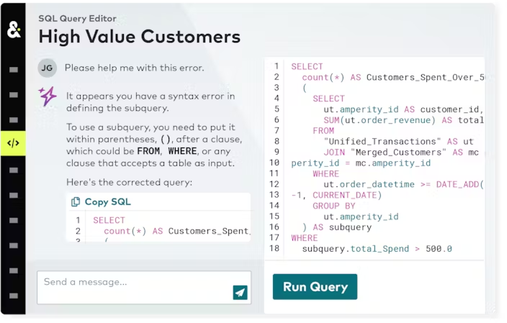
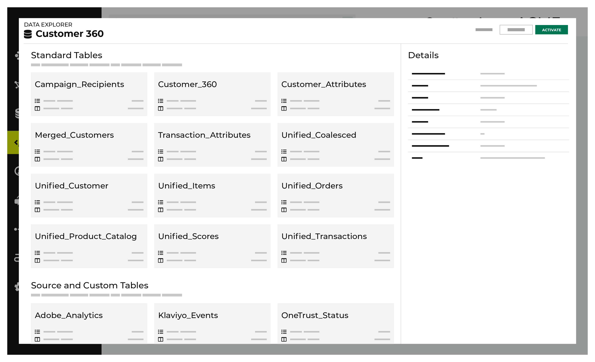
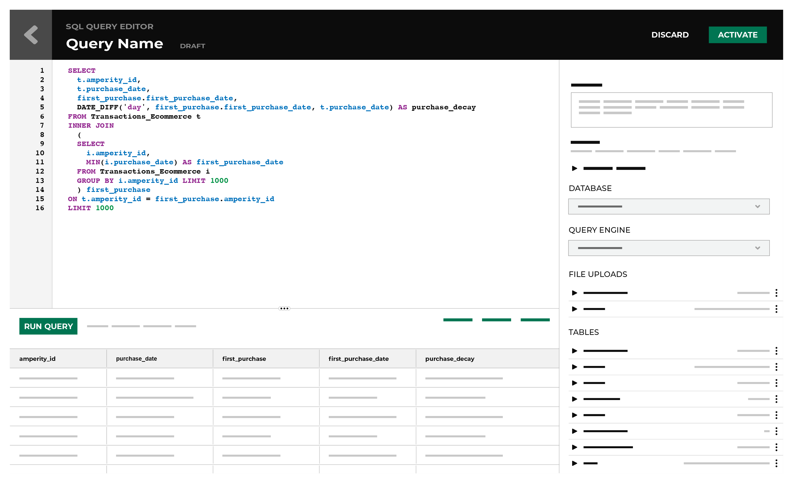
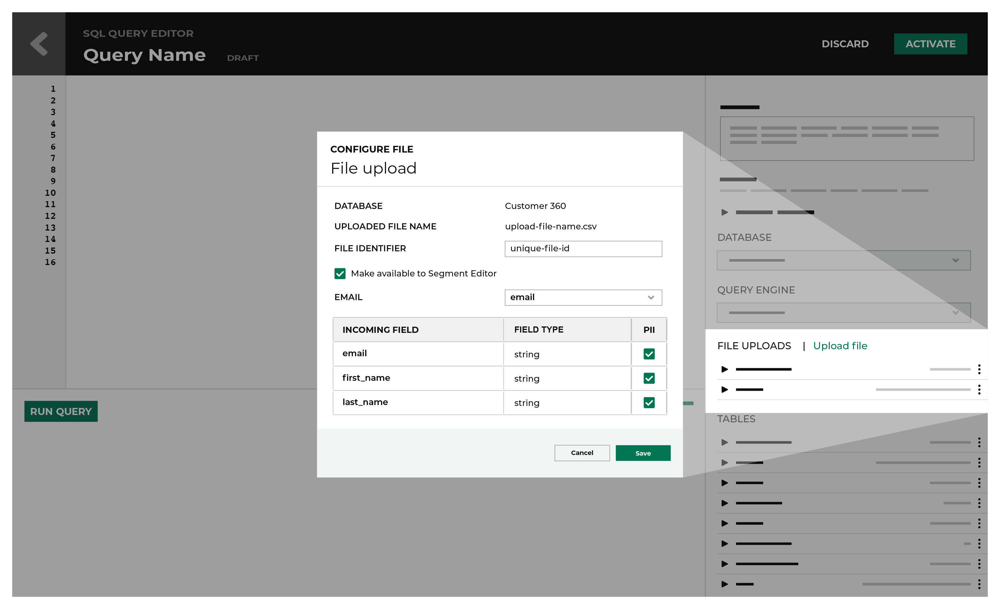

.. https://docs.amperity.com/reference/

.. meta::
    :description lang=en:
        Queries return lists of attributes that match the given criteria. Send query results to any downstream workflow or analytics tool.

.. meta::
    :content class=swiftype name=body data-type=text:
        Queries return lists of attributes that match the given criteria. Send query results to any downstream workflow or analytics tool.

.. meta::
    :content class=swiftype name=title data-type=string:
        About queries

==================================================
About queries
==================================================

.. include:: ../../shared/terms.rst
   :start-after: .. term-query-start
   :end-before: .. term-query-end

.. _queries-ai-assistant:

About the AI Assistant
==================================================

.. queries-ai-assistant-start

The :doc:`AI Assistant <assistant>` is a generative AI feature within the SQL **Query Editor** that provides real-time insights while you author SQL queries against any database in the **Customer 360** page.

.. queries-ai-assistant-end

.. _queries-tab:

Queries page
==================================================

.. queries-tab-start

The **Queries** page provides an overview of the status of every query. A table shows the status and details. Queries are listed by row. The details include the date and time at which this query last ran, along with the number of records (rows) that were returned during the last completed run.

.. queries-tab-end

.. image:: ../../images/mockup-queries-tab.png
   :width: 600 px
   :alt: Queries page
   :align: left
   :class: no-scaled-link

.. _queries-tab-types:

Query types
--------------------------------------------------

.. queries-tab-types-start

A query may be in one of the following types:

.. list-table::
   :widths: 140 40 420
   :header-rows: 1

   * - Type
     - Icon
     - Description
   * - **SQL query**
     - |fa-segment-sql|
     - SQL queries are built using the SQL **Query Editor**.
   * - **Visual query**
     - |fa-segment-visual|
     - Visual queries are built visual **Query Editor**.

.. queries-tab-types-end

.. _queries-tab-status:

Query status indicators
--------------------------------------------------

.. queries-tab-status-start

Every query is assigned one of the following status indicators:

.. list-table::
   :widths: 180 20 400
   :header-rows: 1

   * - Status
     - Icon
     - Description
   * - **Draft**
     - |fa-segment-draft|
     - A draft query that may only be run against the customer 360 database from a query editor.
   * - **Activated, not run**
     - |fa-segment-active|
     - An active query that has not yet run against the customer 360 database.
   * - **Waiting to run**
     - |fa-segment-waiting|
     - An active query that is waiting in the queue to be run against the customer 360 database.
   * - **Running**
     - |fa-segment-running|
     - An active query that is in the queue running against the customer 360 database.
   * - **Completed**
     - |fa-segment-completed|
     - .. include:: ../../shared/terms.rst
          :start-after: .. term-completed-query-start
          :end-before: .. term-completed-query-end
   * - **Inactive**
     - |fa-segment-inactive|
     - An active query that has not run in the past 30 days.
   * - **Error**
     - |fa-segment-error|
     - An active query that returned some type of error while running against the customer 360 database.

.. queries-tab-status-end

.. _queries-tab-search:

Search queries
--------------------------------------------------

.. queries-tab-search-start

You can search for queries on the **Queries** page. From the search box, type a string and then hit the ENTER key. The list of queries is filtered to contain only those queries that match the search criteria. Each query in the list has available to it the same actions as it would from the unfiltered queries list. Click the name of the query to view it. Use the individual query menu to edit, make a copy, run, download, move, or delete.

Click **Clear** to return to the unfiltered queries list.

.. queries-tab-search-end

.. _queries-data-explorer:

Data Explorer
==================================================

.. include:: ../../shared/terms.rst
   :start-after: .. term-data-explorer-start
   :end-before: .. term-data-explorer-end

.. queries-data-explorer-start

The **Data Explorer** may be accessed from the **Queries** page via the **Open Data Explorer** link in the right-side navigation. This link is visible when working in the visual **Query Editor** or the **SQL Query Editor**. When clicked it will open the data explorer for the selected database and will display all of the tables in the database. Click any of the databases to explore the schema, view sample data, and details.

.. queries-data-explorer-end

**To open the Data Explorer**

.. queries-data-explorer-steps-start

#. From the **Queries** page, open the menu for a query, and then select **View**. This opens the query editor.
#. Under **Database**, click **Open Data Explorer**.
#. Click any table name to view columns and rows, schemas, example data, and table details.
#. When finished exploring the data, click **Close**.

.. queries-data-explorer-steps-end

.. _queries-data-explorer-docked:

Docked mode
--------------------------------------------------

.. queries-data-explorer-docked-start

A docked mode for the data explorer is available from the **Queries** page when building queries. This mode of the data explorer shows a list of tables in the customer 360 database, and then for each table a list of columns and data types. This mode provides a useful quick reference for tables, columns, and data types as you are building SQL queries.

.. queries-data-explorer-docked-end

.. _queries-data-explorer-full-screen:

Full-screen mode
--------------------------------------------------

.. queries-data-explorer-full-screen-start

A full-screen mode for the data explorer is available from most areas within Amperity that shows data tables in the customer 360 database. This mode enables detailed exploration of each table, including an overview, :ref:`the data table schema <queries-data-explorer-full-screen-table-schema>`, :ref:`examples of data <queries-data-explorer-full-screen-examples>`, and :ref:`source table details <queries-data-explorer-full-screen-details>`.

.. queries-data-explorer-full-screen-end

.. _queries-data-explorer-full-screen-table-schema:

Table schema
--------------------------------------------------

.. queries-data-explorer-full-screen-table-schema-start

The **Schemas** view in the **Data Explorer** displays information about each column in the table, along with an example, and information about completion, uniqueness, and cardinality.

.. queries-data-explorer-full-screen-table-schema-end

.. _queries-data-explorer-full-screen-completion:

Completion
--------------------------------------------------

.. include:: ../../shared/terms.rst
   :start-after: .. term-completion-start
   :end-before: .. term-completion-end

.. queries-data-explorer-full-screen-completion-tip-start

.. tip:: Ensure that prior to filtering a column that it actually contains data that can match the search criteria.

.. queries-data-explorer-full-screen-completion-tip-end

.. _queries-data-explorer-full-screen-cardinality:

Cardinality vs. uniqueness
--------------------------------------------------

.. include:: ../../shared/terms.rst
   :start-after: .. term-cardinality-start
   :end-before: .. term-cardinality-end

.. include:: ../../shared/terms.rst
   :start-after: .. term-uniqueness-start
   :end-before: .. term-uniqueness-end

.. queries-data-explorer-full-screen-cardinality-start

Use cardinality and uniqueness to help guide the creation of well-behaved **JOIN** operations when authoring SQL queries.

* Avoid using **JOIN** operations when columns have lower cardinality. The high frequency of duplicate values will result in a row for every possible match.
* Columns with low uniqueness values as keys on both sides of a **JOIN** operation will run more slowly and is less likely to return the desired results.
* Empty fields, such as NULL values, are counted as duplicates or "not unique". For example: a field with 90% completion and 90% uniqueness has different values for each of the non-empty rows.

.. queries-data-explorer-full-screen-cardinality-end

.. _queries-data-explorer-full-screen-examples:

Table examples
--------------------------------------------------

.. queries-data-explorer-full-screen-examples-start

The **Examples** view in the **Data Explorer** shows actual data for a randomly selected set of rows in the data table.

.. note:: Users with restricted access to PII will not see data for PII-restricted columns, but will see data for all other columns.

.. queries-data-explorer-full-screen-examples-end

.. _queries-data-explorer-full-screen-details:

Table details
--------------------------------------------------

.. queries-data-explorer-full-screen-details-start

The **Details** view in the **Data Explorer** shows summary data about the table, along with information about which source tables were used to build it.

.. queries-data-explorer-full-screen-details-end

.. _queries-editor:

Query editor
==================================================

.. include:: ../../shared/terms.rst
   :start-after: .. term-sql-query-editor-start
   :end-before: .. term-sql-query-editor-end

.. queries-editor-start

Use the **Query Editor** to build SQL queries against tables and columns in your customer 360 database to support any downstream workflow. The **Query Editor** uses :doc:`Presto SQL <sql_presto>`.

.. queries-editor-end

.. queries-editor-context-start

Queries may be authored using the visual **Query Editor** or the **SQL Query Editor**. Click **Create**, and then select the query editor to open. Queries that are already created have an icon that shows from which query editor they were authored.

* |fa-visual-segment| indicates the query was created using the visual **Query Editor**.
* |fa-sql-segment| indicates the query was created using the **SQL Query Editor**.

All queries must be activated before they can run as part of a scheduled workflow.

.. queries-editor-context-end

.. queries-editor-multiuser-warning-start

.. note:: Amperity is a multi-user system and the set of queries for your company is shared across all users. That means that if one user creates a draft query, another can open and edit it, so work can be easily passed between people on your team.

   However, it also means that if 2 users are editing the same thing at the same time, their changes will collide.  Amperity resolves this by applying the last set of changes saved as a whole. This will always keep the query in a consistent state (it will never be half-implemented). But changes that were saved first will be overwritten. As a result, we strongly recommend that you coordinate changes to specific objects in Amperity with others on your team.

.. queries-editor-multiuser-warning-end

.. _queries-editor-presto-sql:

About Presto SQL
--------------------------------------------------

.. include:: ../../shared/terms.rst
   :start-after: .. term-presto-sql-start
   :end-before: .. term-presto-sql-end

.. queries-editor-presto-sql-start

Amperity queries are built using Presto SQL to define a **SELECT** statement. Please refer to the :doc:`sql_presto`.

.. queries-editor-presto-sql-end

.. queries-editor-presto-sql-select-statements-start

All queries that are built via the **SQL Query Editor** are done using a :ref:`SELECT <sql-presto-select-statement>` statement. In some cases, a :ref:`WITH clause <sql-presto-with>` is used along with the **SELECT** statement. Each select statement can additional functionality, such as :ref:`WHERE <sql-presto-where>`, :ref:`LEFT JOIN <sql-presto-left-join>`, :ref:`GROUP BY <sql-presto-group-by>`, :ref:`ORDER BY <sql-presto-order-by>`, :ref:`LIMIT <sql-presto-limit>` clauses, :ref:`CASE <sql-presto-case>` expressions, :ref:`functions <sql-presto-functions>`, :ref:`operators <sql-presto-operators>`, and other components that are part of Presto SQL, which is the underlying SQL engine for both the visual **Query Editor** and **SQL Query Editor**.

.. queries-editor-presto-sql-select-statements-end

.. queries-editor-presto-sql-tip-start

.. tip:: Follow the :ref:`general recommendations <sql-presto-style-guide>` and patterns for  :ref:`indentation <sql-presto-style-guide-indentation>`, :ref:`naming conventions <sql-presto-style-guide-naming-conventions>`, :ref:`reserved words <sql-presto-style-guide-reserved-words>`, and :ref:`whitespace <sql-presto-style-guide-whitespace>`.

.. queries-editor-presto-sql-tip-end

.. _queries-editor-validate:

Validate queries
--------------------------------------------------

.. queries-editor-validate-start

SQL queries are validated from the **SQL Query Editor** by clicking the **Run Query** button. The results of the query are returned in the results window. The quality of the results can be inspected, and then fine-tuned. Errors in the syntax are reported in the results window.

.. queries-editor-validate-end

.. _queries-howtos:

How-tos
==================================================

.. queries-howtos-start

This section describes tasks related to building queries in Amperity:

.. queries-howtos-end

.. queries-howtos-list-start

* :ref:`queries-add-comment-to-query`
* :ref:`queries-add-as-sql-query`
* :ref:`queries-add-as-visual-query`
* :ref:`queries-add-to-orchestration`
* :ref:`queries-autocomplete-table-names`
* :ref:`queries-browse-table-columns`
* :ref:`queries-comment-lines`
* :ref:`queries-copy-column-names`
* :ref:`queries-convert-query-to-segment`
* :ref:`queries-add-as-copy`
* :ref:`queries-copy-select-statement`
* :ref:`queries-delete`
* :ref:`queries-disable-ai-assistant`
* :ref:`queries-discard`
* :ref:`queries-download`
* :ref:`queries-edit`
* :ref:`queries-enable-performance-mode`
* :ref:`queries-enable-alerts`
* :ref:`queries-format-sql`
* :ref:`queries-open`
* :ref:`queries-organize`
* :ref:`queries-add-folder`
* :ref:`queries-add-subfolder`
* :ref:`queries-move`
* :ref:`queries-preview-results`
* :ref:`queries-query-domain-data`
* :ref:`queries-refresh-automatically`
* :ref:`queries-rename`
* :ref:`queries-run`
* :ref:`queries-run-selection`
* :ref:`queries-select-database`
* :ref:`queries-uncomment-lines`
* :ref:`queries-upload-file`
* :ref:`queries-keyboard-shortcuts`
* :ref:`queries-view-notifications`
* :ref:`queries-view-recently-edited`
* :ref:`queries-view-orchestrations`
* :ref:`queries-view-query`
* :ref:`queries-view-details`

.. queries-howtos-list-end

.. _queries-add-comment-to-query:

Add comment to query
--------------------------------------------------

.. queries-add-comment-to-query-start

You can add a comments to a SQL query to explain sections or to prevent execution of that line within a SQL statement.

.. queries-add-comment-to-query-end

**To add comments to a query**

.. queries-add-comment-to-query-steps-start

#. From the **Queries** page, open the menu for a SQL query, and then select **Edit**. This opens the **SQL Query Editor**.
#. Select a row in the SQL query to which a comment will be added. A row must have content; you may need to add the comment first, and then comment it out.

   -- OR --

   Select a line in the SQL statement that should not be run.

#. Below the SQL query, click **Comment**. "--" is added at the start of the line and it is commented out.

.. queries-add-comment-to-query-steps-end

.. query-editor-sql-add-comment-to-query-examples-start

For example, compare a SQL query without comments:

.. code-block:: sql
   :linenos:

   SELECT
     amperity_id
     ,(.20*Recency + .30*Frequency + .50*Monetary) AS NewRFM
     ,RfmScore AS DatabaseGeneratedRFMSCORE_WithoutWeights
   FROM Customer360
   LIMIT 100

to a SQL query with comments:

.. code-block:: sql
   :linenos:

   SELECT
     amperity_id

     -- default with no weighting:
     -- ,(.33*Recency + .34*Frequency + .33*Monetary) AS NewRFM

     -- versus a 20/30/50 weighting:
     ,(.20*Recency + .30*Frequency + .50*Monetary) AS NewRFM
     ,RfmScore AS DatabaseGeneratedRFMSCORE_WithoutWeights
   FROM Customer360
   LIMIT 100

.. query-editor-sql-add-comment-to-query-examples-start

.. _queries-add:

Add query
--------------------------------------------------

.. queries-manage-add-start

Queries may be authored using the visual **Query Editor** or the **SQL Query Editor**. Click **Create** and then select the query editor to open. Queries that are already created have an icon that shows from which query editor they were authored. All queries must be activated before they can run as part of a scheduled workflow.

.. queries-manage-add-end

You can add a query in the following ways

* :ref:`Add a query as a copy of an existing query <queries-add-as-copy>`
* :ref:`Add a query using the SQL Query Editor <queries-add-as-sql-query>`
* :ref:`Add a query using the Visual Query Editor <queries-add-as-visual-query>`

.. _queries-add-as-copy:

Add as copy
++++++++++++++++++++++++++++++++++++++++++++++++++

.. queries-add-as-copy-start

Use the **Make a copy** option to add a copy of an existing query. This will create a draft query with the same settings and SQL query as the copied query, along with a placeholder name. Rename the query, and then make any other changes before activating it.

.. queries-add-as-copy-end

**To add a query as a copy of an existing query**

.. queries-add-as-copy-steps-start

#. From the **Queries** page, open the menu for a query, and then select **Make a copy**. This refreshes the recently edited queries list to add a query with "COPY - DRAFT" appended to the name.

   The copied query will be of the same type--visual or SQL--as the original query.

#. From the **Queries** page, open the menu for a query, and then select **Edit**. This will open a query editor.
#. Make your changes to the query, and then validate them.
#. Click **Activate**.
#. In the **Activate Query** dialog box, select **Activate**.

.. queries-add-as-copy-steps-end

.. _queries-add-as-sql-query:

Add as SQL query
++++++++++++++++++++++++++++++++++++++++++++++++++

.. include:: ../../shared/terms.rst
   :start-after: .. term-sql-query-editor-start
   :end-before: .. term-sql-query-editor-end

**To add a query using the SQL Query Editor**

.. queries-add-via-sql-editor-steps-start

#. From the **Queries** page, click **Create**, and then select **SQL Query**. This opens the **SQL Query Editor**.
#. Under **Database**, select a database. The **Customer 360** database is selected by default.
#. Define the query against the selected database.
#. Click **Run Query** and debug any issues that may arise.
#. Click **Activate**.

.. queries-add-via-sql-editor-steps-end

.. _queries-add-as-visual-query:

Add as visual query
++++++++++++++++++++++++++++++++++++++++++++++++++

.. include:: ../../shared/terms.rst
   :start-after: .. term-visual-query-editor-start
   :end-before: .. term-visual-query-editor-end

**To add a query using the Visual Query Editor**

.. queries-add-via-visual-editor-steps-start

#. From the **Queries** page, click **Create**, and then select **Visual query**. This opens the **Visual Query Editor**.
#. Define the query using the dropdown menus and buttons.
#. Click **Run Query** and debug any issues that may arise.
#. Click **Activate**.

.. queries-add-via-visual-editor-steps-end

.. _queries-add-to-orchestration:

Add to orchestration
--------------------------------------------------

.. queries-add-to-orchestration-start

Use the **Orchestration** option to define a schedule for a query.

.. queries-add-to-orchestration-end

**To add a query to an orchestration**

.. queries-add-to-orchestration-steps-start

#. From the **Queries** page, open the menu for a query, and then select **View**. This opens the query editor.

   .. tip:: The query does not need to be in edit mode to configure an orchestration.
#. Under **Being Sent To** click **Add one now**. This opens the **Add Orchestration** dialog box.
#. Follow the steps to add an orchestration. The steps will vary depending on the destination, the data template, and the orchestration.
#. Click **Save**.

.. queries-add-to-orchestration-steps-end

.. _queries-autocomplete-table-names:

Autocomplete table names
--------------------------------------------------

.. queries-autocomplete-table-names-start

Start typing table names in the **SQL Query Editor** and a list of available tables will appear. Use an arrow key to select a table, which autocompletes the rest of the table name.

.. queries-autocomplete-table-names-end

.. _queries-browse-table-columns:

Browse tables and columns
--------------------------------------------------

.. queries-browse-table-columns-start

A docked mode for the data explorer is available from the **Queries** page when building queries. This mode of the data explorer shows a list of tables in the customer 360 database, and then for each table a list of columns and data types. This mode provides a useful quick reference for tables, columns, and data types as you are building SQL queries.

.. queries-browse-table-columns-end

**To browse tables and columns**

.. queries-browse-table-columns-steps-start

#. From the **Queries** page, open the menu for a query, and then select **View**. This opens the query editor.

   .. tip:: The query does not need to be in edit mode to browse tables and columns.
#. Under **Database**, select a database from the dropdown menu. The list of tables is updated to show the tables in that database.
#. Under **Table**, expand the name of a table. Details include the number of records in the table, a list of columns, and for each column its data type.

.. queries-browse-table-columns-steps-end

.. _queries-comment-lines:

Comment lines
--------------------------------------------------

.. queries-comment-lines-start

Use comments to mark out lines that document how the SQL query is designed or to keep lines that may be useful in the query within the query, but not in a state where they are run as part of the query.

.. queries-comment-lines-end

**To comment lines in a SELECT statement**

.. queries-comment-lines-steps-start

#. From the **SQL Query Editor**, select one or more lines of SQL.
#. Next to **Database**, click **Comment**.

.. queries-comment-lines-steps-end

.. _queries-convert-query-to-segment:

Convert query to segment
--------------------------------------------------

.. queries-convert-query-to-segment-start

You can convert a query to a segment on the **Queries** page.

.. queries-convert-query-to-segment-end

**To convert a query to a segment**

.. queries-convert-query-to-segment-steps-start

#. From the **Queries** page, click **Create**, and then select **Visual query**. This opens the **Visual Query Editor**.
#. Define the query using the dropdown menus and buttons.
#. In the **Query Details** pane, select the **Make query available for segment editor** checkbox.
#. Click **Activate**.
#. From the **Activate Query** dialog box, click **Activate**.

The query is now available on the **Segments** page.

.. note:: To convert a query into a segment, the Amperity ID column must be added to the SQL in the query.

.. queries-convert-query-to-segment-steps-end

.. _queries-copy-column-names:

Copy column names
--------------------------------------------------

.. queries-copy-column-names-start

You can copy the name of a column from the list of tables available to the **SQL Query Editor**. Use this to type fewer characters and to ensure that columns with long names are added to the query accurately.

.. queries-copy-column-names-end

**To copy a column name**

.. queries-copy-column-names-steps-start

#. From the **Queries** page, open the menu for a SQL query, and then select **Edit**. This opens the **SQL Query Editor**.
#. Under **Database**, select a database from the dropdown menu. The list of tables is updated to show the tables in that database.
#. Under **Table**, expand the name of a table.
#. Click a column name to copy it.
#. Paste the column name into SQL query.

.. queries-copy-column-names-steps-end

.. _queries-copy-select-statement:

Copy SELECT statement
--------------------------------------------------

.. queries-copy-select-statement-start

When adding a table, it's often necessary to reference many columns within that table. You can copy the **SELECT** statement for any table to use as a starting point for a table.

.. tip:: Use the copy **SELECT** statement functionality as a way to use existing queries that are similar to your use case as a template when adding queries. Be sure to review the **SELECT** statement and make any necessary updates for your new use case.

.. queries-copy-select-statement-end

**To copy a SELECT statement**

.. queries-copy-select-statement-steps-start

#. From the **Queries** page, open the menu for a SQL query, and then select **Edit**. This opens the **SQL Query Editor**.
#. Under **Database**, select a database from the dropdown menu. The list of tables is updated to show the tables in that database.
#. Under **Table**, to the left of the table name click the icon to copy the **SELECT** statement.
#. Paste the **SELECT** statement into SQL query.

.. queries-copy-select-statement-steps-end

.. _queries-delete:

Delete query
--------------------------------------------------

.. queries-delete-start

Use the **Delete** option to remove a query from Amperity. This should be done carefully. Verify that both upstream and downstream processes no longer depend on this query prior to deleting it.

.. queries-delete-end

**To delete a query**

.. queries-delete-steps-start

#. From the **Queries** page, open the menu for a query, and then select **Delete**. The **Delete Query** dialog box opens.
#. Click **Delete**.

.. queries-delete-steps-end

.. _queries-disable-ai-assistant:

Disable AI Assistant
--------------------------------------------------

.. include:: ../../amperity_reference/source/assistant.rst
   :start-after: .. assistant-overview-start
   :end-before: .. assistant-overview-end

.. settings-user-ampai-assistant-end

**To disable the AI Assistant**

.. include:: ../../amperity_reference/source/ampai_settings.rst
   :start-after: .. settings-user-ampai-steps-start
   :end-before: .. settings-user-ampai-steps-end

.. _queries-discard:

Discard a draft query
--------------------------------------------------

.. queries-discard-start

While a query is in draft mode it may be discarded. An active query that is opened for editing automatically creates an instance of that query as a draft query with "--Draft" appended to the name. Keep the **Queries** page free of long-lived draft queries as much as possible.

.. queries-discard-end

**To discard a draft query**

.. queries-discard-steps-start

From the **Queries** page, open the menu for a query with "-- DRAFT" appended to the name, and then select **Discard**.

.. warning:: Discarding draft queries does not open a confirmation dialog box. Discarded draft queries are removed immediately.

.. queries-discard-steps-end

.. _queries-download:

Download query
--------------------------------------------------

.. queries-download-start

When a query returns fewer than 100,000 rows of data, you can download those query results as a CSV file. The CSV format is supported by many applications, which makes the format a great way to send smaller results sets and/or to test the potential of orchestrating queries for downstream applications and workflows. (For queries that return more than 100,000 rows of data use orchestrations to send those results to cloud-based storage, such as SFTP or Amazon S3, as a CSV file.)

.. note:: You cannot download the results of any query that returns an error.

.. queries-download-end

.. include:: ../../amperity_reference/source/campaigns.rst
   :start-after: .. campaigns-download-recipients-manual-workflows-start
   :end-before: .. campaigns-download-recipients-manual-workflows-end

**To download a query as a CSV file**

.. queries-download-steps-start

#. From the **Queries** page, open the menu for a query, and then select **View**. This opens the query editor.
#. Click **Run Query** to run the query. Wait for it to return results.
#. Click **Download**.
#. A CSV file with a filename that is identical to the query name is downloaded to your local machine.

.. queries-download-steps-end

.. _queries-edit:

Edit query
--------------------------------------------------

.. queries-edit-start

Use the **Edit** option in the row for a specific query to make changes. A very common scenario for editing a query is to update a query after new data has been added to Amperity. Changes to queries are saved automatically as a draft query. Any changes made to the query must be re-activated before they can be added to a scheduled workflow.

.. note:: When an active query is edited Amperity creates a copy of it and appends "--Draft" to the name. The query must be reactivated to apply changes and upon reactivation it will replace the active query.

.. queries-edit-end

**To edit a query**

.. queries-edit-steps-start

#. From the **Queries** page, open the menu for a query, and then select **Edit**. This opens the query editor with the query labeled a draft query.
#. Make your changes.
#. Click **Run Query** and debug any issues that may arise.
#. Click **Activate**.

.. queries-edit-steps-end

.. _queries-enable-performance-mode:

Enable performance mode
--------------------------------------------------

.. queries-enable-performance-mode-start

You may enable performance mode for any query that returns large result sets. Performance mode wraps a **CREATE TABLE** operation around the **SELECT** statement in the query, writes the results to an Apache Parquet file, and then makes that file available to Amperity as a table.

.. queries-enable-performance-mode-end

.. important:: Performance mode is significantly faster than running a query in non-performance mode, but has the following limitations:

   * Sort order is not guaranteed because results are written in parallel to many files.
   * The **UNION** clause requires data types to match exactly.
   * Column names cannot contain spaces.
   * Column names are output in lowercase.
   * Small queries may take longer.
   * Part file names in Apache Parquet orchestrations will have a different pattern.
   * Date fields will be output as timestamps.
   * The **CURRENT_TIMESTAMP** function must be cast as a timestamp. For example:

     ::

        CAST(CURRENT_TIMESTAMP AS timestamp)

.. sql-presto-function-current-timestamp-important-end

**To enable performance mode**

.. queries-enable-performance-mode-steps-start

#. From the **Queries** page, open a query.
#. Under **Query Settings**, select the **Enable performance mode** checkbox.
#. Click **Activate**.

.. queries-enable-performance-mode-steps-end

.. _queries-enable-alerts:

Enable query alerts
--------------------------------------------------

.. queries-enable-alerts-start

Any query can be configured to send workflow alerts when configured thresholds are met. This is an important way to ensure that queries that have dependencies on courier groups so they never send inaccurate or incomplete data.

Alerts are sent when the record count in the query output contains errors that exceed the configured threshold. There are two alert levels (you may enable one or both):

#. **Warn when** record counts exceed the configured threshold. The workflow will continue running.

   .. tip:: Use this threshold for queries that are not associated with an orchestration.

#. **Fail when** record counts exceed the configured threshold. The workflow is stopped.

   .. caution:: A query with a configured query alert is always run **even if the query is not associated with an orchestration**.

      A query that runs and fails when record counts exceed the configured threshold will stop a workflow.

      Use the **Warn when** threshold for queries that are not associated with an orchestration. This will prevent that query from stopping the workflow when record counts exceed the configured alert threshold.

You may :ref:`sign up for workflow-based query alerts <workflows-discover-alerts>` from the **Workflows** page. Provide your email address to receive alerts when this query is associated with one (or more) courier groups and/or scheduled orchestration groups.

.. queries-enable-alerts-end

**To enable query alerts**

.. queries-enable-alerts-steps-start

#. From the **Queries** page, open the menu for a query, and then select **Edit**. This opens the query editor with the query labeled a draft query.
#. Select the **Enable query alerts** checkbox, and then configure the thresholds for alerts that notify and for alerts that stop the workflow.

   .. image:: ../../images/mockup-queries-enable-query-alerts.png
      :width: 380 px
      :alt: Enable query alerts when records with errors exceed the configured threshold.
      :align: left
      :class: no-scaled-link

#. Click **Activate**.

.. queries-enable-alerts-steps-end

.. queries-enable-alerts-learning-lab-start

.. admonition:: Amperity Learning Lab

   Open **Learning Lab** to learn more about how `query alerts <https://learn.amperity.com/query-alerts>`__ |ext_link| work. Registration is required.

.. queries-enable-alerts-learning-lab-end

.. _queries-format-sql:

Format SQL
--------------------------------------------------

.. queries-format-sql-start

You can format the SQL from the **SQL Query Editor**. Click the **Format** button next to **Databases** under the query window. This will apply standardized formatting to the entire query.

.. queries-format-sql-end

.. _queries-open:

Open query
--------------------------------------------------

.. queries-open-start

You can view details for any query, including the SQL query associated with the query, along with any refresh or alert settings, and configuration details for destinations, data templates, and orchestrations.

.. queries-open-end

**To open a query (view-only)**

.. queries-open-steps-start

#. From the **Queries** page, open the menu for a query, and then select **View**. This opens the query editor with the query as view-only.
#. Click **Edit** to make changes. (This will change the query to a draft query, which will require re-activation when you are done making changes.)

.. queries-open-steps-end

.. _queries-organize:

Organize queries
--------------------------------------------------

.. include:: ../../shared/terms.rst
   :start-after: .. term-query-folder-start
   :end-before: .. term-query-folder-end

You can organize the queries shown in the **Queries** page:

* :ref:`Add a folder <queries-add-folder>`
* :ref:`Add a subfolder <queries-add-subfolder>`
* :ref:`Move a query to another folder <queries-move>`

.. _queries-add-folder:

Add folder
++++++++++++++++++++++++++++++++++++++++++++++++++

.. queries-add-folder-start

Folders may be expanded (or collapsed) to view (and hide) the list of queries and subfolders contained within.

.. queries-add-folder-end

**To add a folder**

.. queries-add-folder-steps-start

#. From the **Queries** page click **Create**, and then select **Add Folder**. This opens the **Create Folder** dialog box.
#. Enter the name for the folder.
#. Click **Save**.

.. queries-add-folder-steps-end

.. _queries-add-subfolder:

Add subfolder
++++++++++++++++++++++++++++++++++++++++++++++++++

.. queries-list-organize-subfolder-start

Use the **Create folder** option in the menu to add up to three levels of subfolders. All folder names must be unique.

.. queries-list-organize-subfolder-end

**To add a subfolder**

.. queries-add-subfolder-steps-start

#. From the **Queries** page, open the menu for a folder, and then select **Create folder**. This opens the **Create Folder** dialog box.
#. Enter the name for the folder.
#. Click **Save**.

.. queries-add-subfolder-steps-end

.. _queries-bulk-delete:

Bulk delete
++++++++++++++++++++++++++++++++++++++++++++++++++

.. queries-bulk-delete-start

Bulk delete multiple queries on the **Queries** page.

.. queries-bulk-delete-end

**To bulk delete queries**

.. queries-bulk-delete-steps-start

#. From the **Queries** page, select the checkboxes next to the queries to delete.
#. Click **Delete** at the bottom of the page.

.. queries-bulk-delete-steps-end

.. _queries-bulk-move:

Bulk move
++++++++++++++++++++++++++++++++++++++++++++++++++

.. queries-bulk-move-start

Bulk move multiple queries on the **Queries** page.

.. queries-bulk-move-end

**To bulk move queries**

.. queries-bulk-move-steps-start

#. From the **Queries** page, select the checkboxes next to the queries to move.
#. Click **Move** at the bottom of the page.

.. queries-bulk-move-steps-end

.. _queries-move:

Move query
++++++++++++++++++++++++++++++++++++++++++++++++++

.. queries-list-move-query-start

Use the **Move** option to move around and organize the list of folders and queries. Folders may be expanded (or collapsed) to view (and hide) the list of queries and subfolders contained within.

.. queries-list-move-query-end

**To move a query**

.. queries-move-steps-start

#. From the **Queries** page, open the menu for a query, and then select **Move**. This opens the **Move Query** dialog box.
#. Select the name of an existing folder to which a query will be moved, and then click **Move**.

.. queries-move-steps-end

.. queries-move-hint-start

.. hint:: If the folder to which a query will be moved is not present in the list of folders, you can add it directly from the **Move Query** dialog box. Click the **+ New folder** link, type a name for the folder, and then select it.

.. queries-move-hint-end

.. _queries-preview-results:

Preview results
--------------------------------------------------

.. queries-preview-results-start

You can preview the results of a SQL query by clicking the **Run Query** button. This will do one of the following things:

* Return the first 100 results of the query to the preview pane directly below the query editor.
* Return an empty table.
* Return some type of error.

Use the preview results pane to fine-tune your queries, to make sure they return the data you want, and to make sure they don't contain any errors.

.. queries-preview-results-end

.. queries-preview-results-tip-start

.. tip:: SQL queries in the **Query Editor** often evaluate millions of records and can take a few minutes to run. You may use other areas of Amperity while a query is being run.

   For draft queries, setting a **LIMIT 100** while developing a query is often enough to test and validate query design against very large data sets.

.. queries-preview-results-tip-end

**To preview query results**

.. queries-preview-results-steps-start

#. From the **Queries** page, open the menu for a query, and then select **View**. This opens the query editor.
#. Click **Run Query** to run the query. Wait for it to return results.
#. Example the columns and the data that is in them.
#. Adjust your query as necessary until it runs correctly.
#. Click **Activate**.

.. queries-preview-results-steps-end

.. _queries-query-domain-data:

Query domain data
--------------------------------------------------

.. queries-query-domain-tables-start

You may build queries against domain tables in your tenant, including custom domain tables.

.. note:: Queries that are built from domain tables may not be activated.

.. queries-query-domain-tables-end

**To query domain data**

.. queries-query-domain-tables-steps-start

#. From the **Queries** page, open the query editor.
#. From the **Database** dropdown menu, under **Other datasets**, select "Domain tables". This will refresh the list of tables available for queries to be the list of domain tables in your tenant.

   .. note:: This includes all domain tables, including custom domain tables.
#. Build a query against any combination of domain tables.

.. queries-query-domain-tables-steps-end

.. _queries-refresh-automatically:

Refresh query automatically
--------------------------------------------------

.. queries-refresh-automatically-start

A query may be configured to be refreshed automatically. When enabled, an active query will be run automatically whenever an upstream process is refreshed.

.. queries-refresh-automatically-end

**To refresh a query automatically when upstream data changes**

.. queries-refresh-automatically-steps-start

#. From the **Queries** page, open the menu for a query, and then select **Edit**. This opens the query editor with the query labeled a draft query.
#. Under **Query Settings**, select the **Refresh automatically** checkbox. (This option is required to enable query alerts.)
#. Click **Activate**. The query will run automatically when upstream data changes.

.. queries-refresh-automatically-steps-end

.. _queries-rename:

Rename query
--------------------------------------------------

.. queries-rename-start

Use the **Rename** option to rename a query. This should be done carefully. Verify that both upstream and downstream processes no longer depend on this query prior to renaming it.

.. queries-rename-end

**To rename a query**

.. queries-rename-steps-start

#. From the **Queries** page, open the menu for a query, and then select **Edit**. This opens the query editor with the query labeled a draft query.
#. In the name field, type the new query name.
#. Click **Activate**.

.. queries-rename-steps-end

.. _queries-run:

Run query
--------------------------------------------------

.. queries-run-start

Amperity processes data in batches on automated schedules that start with collecting the data, bringing it into the system, creating the customer 360 database, and then sending the results to any number of downstream workflows.

.. queries-run-end

**To run a query**

.. queries-run-steps-start

#. From the **Queries** page, open the menu for a query, and then select **Run**.
#. After a few moments, a notification will appear in the **Notifications** list that reports the status of the query run.

.. queries-run-steps-end

.. _queries-run-selection:

Run selection
--------------------------------------------------

.. queries-run-selection-start

You can run part of a statement from the **SQL Query Editor**.

.. queries-run-selection-end

**To run a selection of a SQL query**

.. queries-run-selection-steps-start

#. From the **Queries** page, open the menu for a SQL query, and then select **Edit**. This opens the **SQL Query Editor** with the SQL query labeled a draft query.
#. Within the SQL query, highlight part of the statement, and then select **Run selection**.

   If the selected SQL is valid, Amperity will run it and return the results.

.. queries-run-selection-steps-end

.. _queries-select-database:

Select database
--------------------------------------------------

.. queries-select-database-start

You can build a query against any database that is visible from the **Customer 360** page.

.. queries-select-database-end

**To select a database**

.. queries-select-database-steps-start

#. From the **Queries** page, click **Create**, and then select **SQL Query**. This opens the **SQL Query Editor**.
#. Under **Database**, select a database. The **Customer 360** database is selected by default.
#. Build your query against the list of tables that are available in that database.

.. queries-select-database-steps-end

.. _queries-uncomment-lines:

Uncomment lines
--------------------------------------------------

.. queries-uncomment-lines-start

Some lines within a SQL query are commented out to prevent them from running as a normal part of the query. These lines may be useful when the query is run manually. Uncomment them before running the query.

.. queries-uncomment-lines-end

**To uncomment lines in a SELECT statement**

.. queries-uncomment-lines-steps-start

#. From the **SQL Query Editor**, select one or more lines of SQL that is commented out.
#. Next to **Database**, click **Uncomment**.

.. queries-uncomment-lines-steps-end

.. _queries-upload-file:

Upload file via the Query editor
--------------------------------------------------

.. queries-upload-file-start

You can upload a CSV file from the **Query Editor** page.

.. note:: When you upload a CSV file from the **Query Editor** and then discard the query, it will automatically associate the contact information in the uploaded file to Amperity IDs.

.. queries-upload-file-end

**To upload a file via the Query editor**

.. queries-upload-file-steps-start

#. From the **Queries** page, click on a query.
#. From the **Query Editor**, in the **Query Details** section on the right-side of the page, click **Upload Files** in the **File Uploads** section.
#. From the **Configure File** window, drag and drop a file in the window or click the window to browse for files on your computer.
#. Wait a few moments for the file to upload.
#. In the **File Identifier** field, select a file.
#. Select **Make available in segment editor**.
#. In the **Email** field, select a incoming field to have the data mapped to that field.
#. Click **Save**.

   .. note:: The uploaded file is not added as a table to your database.

   .. warning:: Only upload CSV files on the **Query Editor**, if you are going to add additional SQL to your query.

.. queries-upload-file-steps-end

.. _queries-view-file-list:

View uploaded files
++++++++++++++++++++++++++++++++++++++++++++++++++

.. queries-view-file-list-start

You can view a list of uploaded files on the **SQL Query Editor**.

.. queries-view-file-list-end

**To view uploaded files**

.. queries-view-file-list-steps-start

#. From the **SQL Query Editor**, in the **File Uploads** section, view a list of uploaded files.

.. queries-view-file-list-steps-end

.. _queries-keyboard-shortcuts:

Use keyboard shortcuts
--------------------------------------------------

.. queries-keyboard-shortcuts-start

The **SQL Queries Editor** supports the following keyboard shortcuts:

.. list-table::
   :widths: 150 450
   :header-rows: 1

   * - Action
     - Shortcut
   * - **Autocomplete**
     - Click **Control** + **Space** at the same time to autocomplete.
   * - **Comment line**
     - Click **Command** + **/** (forward slash) at the same time to comment out the line or selection.
   * - **Extend selection**
     - Click **Shift** + **Arrow** at the same time to extend selection by word or line in the direction of the arrow key.
   * - **Format query**
     - Click **Command** + **L** at the same time to apply default formatting to the query or selection.
   * - **Move to previous word**
     - Click **Control** + **Left Arrow** at the same time to move to the previous word in the SQL query.
   * - **Move to next word**
     - Click **Control** + **Right Arrow** at the same time to move to the next word in the SQL query.
   * - **Move to start of line**
     - Click **Command** + **Left Arrow** at the same time to move to the start of a line in the SQL query.
   * - **Move to end of line**
     - Click **Command** + **Right Arrow** at the same time to move to the end of a line in the SQL query.
   * - **Move to start of query**
     - Click **Command** + **Up Arrow** at the same time to move to the beginning of a SQL query.
   * - **Move to end of query**
     - Click **Command** + **Down Arrow** at the same time to move to the end of a SQL query.
   * - **Run current line of SQL query**
     - Click **Command** + **Shift** + **Enter** at the same time to run the current line of a SQL query.
   * - **Run SQL query**
     - Click **Command** + **Enter** at the same time to run a SQL query.
   * - **Run up to current line of SQL query**
     - Click **Command** + **Option** + **Enter** at the same time to run the SQL query up to the current line.

.. queries-keyboard-shortcuts-end

.. _queries-view-notifications:

View notifications
--------------------------------------------------

.. queries-view-notifications-start

Notifications for the **Queries** page appear after Amperity has processed a query and passed the results to a downstream process. Notifications typically indicate successful outcomes. Less often, notifications contain details for non-successful outcomes, such as failures related to upstream or downstream processes.

.. queries-view-notifications-end

.. image:: ../../images/mockup-notifications-queries.png
   :width: 600 px
   :alt: The notifications pane sits on the right side of the Queries page.
   :align: left
   :class: no-scaled-link

.. queries-view-notifications-context-start

If a notification is about a non-successful outcome, the details for why and what happened can be found in the notification itself. Click **More** to view the full notification. Click **View Workflow** to open the workflow in the **Workflows** page.

In some cases viewing the log files may be helpful. In many cases, fix the root cause of the non-successful outcome, and then rerun the process manually. The **Workflows** page will provide a set of workflow actions that you can initiate directly.

.. queries-view-notifications-context-end

.. _queries-view-query:

View query
--------------------------------------------------

.. queries-view-query-start

You can view details for any SQL query, including the SQL query associated with the SQL query, along with any refresh, or alert settings, and configuration details for destinations, data templates, and orchestrations.

.. queries-view-query-end

**To view a SQL query**

.. queries-view-query-steps-start

#. From the **Queries** page, open the menu for a SQL query, and then select **View**. This opens the **SQL Query Editor** with the SQL query as view-only.
#. Click **Edit** to make changes. (This will change the query to a draft query, which will require re-activation when you are done making changes.)

.. queries-view-query-steps-end

.. _queries-view-details:

View query details
--------------------------------------------------

.. queries-view-details-start

Query details show the time at which the query last ran, when it was activated, to which database it's associated, what type of workflow it has been assigned, the destination to which it's being sent, and visual graph that shows trends over time.

.. queries-view-details-end

**To view query details**

.. queries-view-details-steps-start

#. From the **Queries** page, from the menu for a query, click the right angle icon. This opens the details pane for that query.
#. Click the name of the query to view the orchestration details. The **View Orchestrations** dialog box opens. You can fully manage the orchestration from this dialog box.
#. Click **Run now** to run the query from the details pane.

.. queries-view-details-steps-end

.. _queries-view-version-history-edited:

View query version history
--------------------------------------------------

.. queries-view-version-history-edited-start

Query version history is available in the visual **Queries Editor** on the **Queries** page.

.. queries-view-version-history-edited-end

**To view query version history**

.. queries-view-version-history-steps-start

#. From the **Queries** page, from the menu for a query, click **Version history**. This opens the **SQL version history** window.
#. Click the version to view the SQL details. 

.. queries-view-version-history-steps-end

.. _queries-view-recently-edited:

View recently edited queries
--------------------------------------------------

.. queries-view-recently-edited-start

Recently edited queries are sorted at the top of the **Queries** page.

.. queries-view-recently-edited-end

.. _queries-view-orchestrations:

View related orchestrations
--------------------------------------------------

.. queries-view-orchestrations-start

A query is associated with at least one orchestration and data template. You can view these details from the query editor.

.. queries-view-orchestrations-end

**To view related orchestrations**

.. queries-view-orchestrations-steps-start

#. From the **Queries** page, open the menu for a query, and then select **View**. This opens the query editor.
#. Under **Being Sent To** view orchestration details, including the orchestration and data template.

.. queries-view-orchestrations-steps-end

-- OR --

.. queries-view-orchestrations-details-steps-start

#. From the **Queries** page, from the menu for a query, click the right angle icon. This opens the details pane for that query.
#. Click the name of the query to view the orchestration details. The **View Orchestrations** dialog box opens. You can fully manage the orchestration from this dialog box.

.. queries-view-orchestrations-details-steps-end
