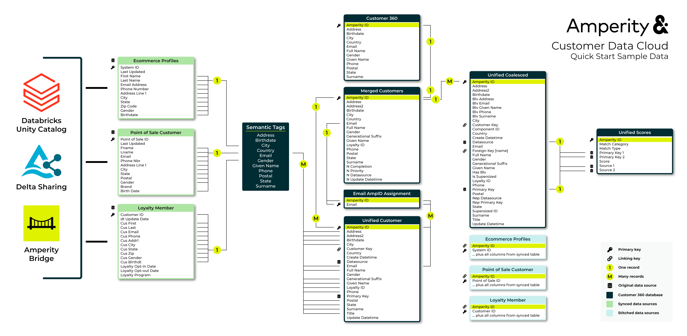

.. https://docs.amperity.com/reference/

.. meta::
    :description lang=en:
        Use Amperity to build robust unified datasets and durable customer profiles that support all of your brand's use cases.

.. meta::
    :content class=swiftype name=body data-type=text:
        Use Amperity to build robust unified datasets and durable customer profiles that support all of your brand's use cases.

.. meta::
    :content class=swiftype name=title data-type=string:
        Quick start: Identity resolution

==================================================
Quick start: Identity resolution
==================================================

.. article-info::
   :avatar: _static/amperity_circle.png
   :avatar-link: https://docs.amperity.com/reference/quick_start.html
   :avatar-outline: muted
   :author: Quick start: Identity resolution
   :date: |today|
   :read-time: 10 min read; ~1 hour to complete
   :class-container: sd-p-2 sd-outline-muted sd-rounded-1

.. quickstart-overview-start

Amperity Customer Data Cloud specializes in using AI to turn raw data into a growing library of robust unified datasets and durable customer profiles that are available to support all of your brand's use cases.

By the end of this guide you will know how to do the following:

#. Sync data from your Databricks account to Amperity.
#. Apply semantic tags to your data sources using AmpAI.
#. Build an identity graph that links disparate profile records together using a unique and persistent identifier.
#. Sync unified tables from Amperity to your Databricks account.

.. quickstart-overview-end

.. quickstart-free-trial-start

.. admonition:: Sign up for a free trial of Amperity!

   `Sign up for a free trial <https://amperity.com/trial>`__ |ext_link| to see how your brand can use Amperity to build robust unified datasets and durable customer profiles that support all of your brand's use cases. You may use trial data provided by Amperity or you may upload samples of your own customer data.

.. quickstart-free-trial-end

.. _quickstart-data-model:

Quick Start data model
==================================================

.. quickstart-data-model-start

The following diagram shows the data model for the sample data that is part of the Amperity Quick Start. Color coded sections identify which groups of tables are associated with source customer profiles, stitched domain tables, and unified tables.

.. quickstart-data-model-end

.. data-tables-data-model-tables-note-start

.. note:: Click this diagram to open it in your full browser window. Click `HERE <https://docs.amperity.com/reference/_images/quickstart_sample_erd.png>`__ |ext_link| to open this diagram in a new tab or right-click that link to save a copy to your computer.

.. data-tables-data-model-tables-note-end

.. _quickstart-prerequisites:

Prerequisites
==================================================

.. quickstart-prerequisites-start

To follow-along with this quick start guide you will need:

#. Access to an Amperity account.
#. Approximately ~1 hour of time to complete all of the steps within the quick start guide.

   .. note:: More time may be required if you want to sync data from your Databricks account instead of using Amperity sample data.

#. Source data. Amperity provides a set of sample data that can be used to complete the steps in this guide. You may provide your own data if you have a Databricks account with customer profile data *and* permissions to configure your Databricks account to accept Delta Sharing with Amperity from the Databricks Unity Catalog.

   .. note:: Amperity sample data contains ~10 million customer records. Additional time may be necessary for loading and processing data if you choose to use your own data instead of Amperity sample data assets, depending on the number of records.

.. quickstart-prerequisites-end

.. _quickstart-login:

Log in to Amperity
==================================================

.. quickstart-login-start

To start using the Amperity quick start tenant, do the following:

#. Log in to `Amperity <https://app.amperity.com>`__.
#. Open the **Quick Start** page. This is located in the left-side menu at the top.
#. Under **Identity resolution** click **Set up**.

   This opens the **Identity resolution** page that will walk you through steps for connecting to Databricks, adding semantic tags to synced tables, running Stitch, and then syncing unified tables back to Databricks.

.. quickstart-login-end

.. _quickstart-connect:

Connect to Databricks
==================================================

.. quickstart-connect-start

Use Amperity Bridge to connect Databricks to Amperity. This guide uses Amperity sample data assets, but the steps for Databricks are *almost* the same if you want to use your own data.

You have two options:

#. Use the provided quick start data assets
#. Use your own data from your own instance of Databricks

   .. note:: For this option you will need a Databricks account, a configured Unity Catalog, and the ability to set up and manage Delta Sharing. `Use these steps to configure your Databricks account to share data with Amperity <https://docs.amperity.com/operator/bridge_databricks.html#get-details>`__.

.. quickstart-connect-end

**To connect to Amperity sample data**

.. quickstart-connect-steps-start

.. list-table::
   :widths: 10 90
   :header-rows: 0

   * - .. image:: ../../images/steps-01.png
          :width: 60 px
          :alt: Step 1.
          :align: left
          :class: no-scaled-link
     - In the **Identity resolution** quick start, next to **Inbound sharing data** click **Add bridge**.

       .. image:: ../../images/bridge-inbound-choose-amperity-sample-data.png
          :width: 320 px
          :alt: Add a bridge for a sync.
          :align: left
          :class: no-scaled-link

       This opens the **Add bridge** dialog box.

       Choose **Sample data**. This will open the **Select tables** dialog box.

   * - .. image:: ../../images/steps-02.png
          :width: 60 px
          :alt: Step 3.
          :align: left
          :class: no-scaled-link
     - Use the **Select tables to share** dialog box to select the sample data from "amperity-trial/trial-data".

       .. image:: ../../images/quick-start-bridge-databases-sample-data.png
          :width: 420 px
          :alt: Select schemas and tables to be shared.
          :align: left
          :class: no-scaled-link

       When finished, click **Create**. This will open the **Domain table mapping** dialog box.

   * - .. image:: ../../images/steps-03.png
          :width: 60 px
          :alt: Step 4.
          :align: left
          :class: no-scaled-link
     - In the **Sample data** dialog, review the table names, and then click **Save and sync**.

       .. image:: ../../images/quick-start-bridge-inbound-sample-data.png
          :width: 420 px
          :alt: Map inbound synced tables to domain tables.
          :align: left
          :class: no-scaled-link

       This will start the sync between Amperity and Databricks. Wait for the sync to finish before continuing to the next step. (Amperity sample data should sync in about 3 minutes.)

.. quickstart-connect-steps-end

.. _quickstart-semantics:

Add semantic tags
==================================================

.. quickstart-semantics-start

Semantic tags are applied to fields in incoming data sources to indicate the type of data that is contained within those fields.

The semantic tag tells Amperity how to treat the data, regardless of how the data is formatted, named, or originally stored.

For example, a field named **evar_15** contains email addresses. This field should have the **email** semantic tag applied to it. This tag tells Amperity that the contents of the **evar_15** field are

* Email addresses
* Personally identifiable information (PII)

Email addresses are an important part of the identity resolution process. Using a semantic tag to tell Amperity which fields in your data sources contain email addresses (and PII!) saves you a lot of time because you don't have to do any data processing, ETLs, or data modeling before making that data source available to Amperity.

Connect the data, apply the semantic tag, and build customer profiles.

You have two options:

#. Let **AmpAI** apply semantic tags (this section)
#. `Manually apply semantic tags <https://docs.amperity.com/operator/semantics.html>`__

.. quickstart-semantics-end

**To let AmpAI apply semantic tags**

.. quickstart-semantics-steps-start

.. list-table::
   :widths: 10 90
   :header-rows: 0

   * - .. image:: ../../images/steps-01.png
          :width: 60 px
          :alt: Step 1.
          :align: left
          :class: no-scaled-link
     - In the **Identity resolution** quick start, if you are using Amperity sample data, next to **Identity tables**, click **AmpAI select**.

       **AmpAI** will analyze the sample data and identify which tables contain PII, and then idenfity which semantic tags should be applied. You may change the tags **AmpAI** assigns to fields.

       Click **Continue**. Wait for the **AmpAI** to finish applying semantic tags before continuing to the next step. This process will take up to 5 minutes to complete.

   * - .. image:: ../../images/steps-02.png
          :width: 60 px
          :alt: Step 2.
          :align: left
          :class: no-scaled-link
     - When **AmpAI** is finished applying semantic tags, next to **Identify your fields**, click **Edit**.

       This opens the **Semantic tag** editor. For each table that **AmpAI** applied semantic tags a list of fields, field types, and semantic tags are shown.

       **AmpAI** will correctly assign semantic tags to all of the sample data tables, so you can click the **Save** button in the top right.

       .. important:: If you are using your own data review the fields carefully. **AmpAI** will apply semantic tags for PII correctly most of the time, but it's good to double-check and be sure. If you think they are wrong, just remove the tag **AmpAI** applied and find the correct semantic tag.

.. quickstart-semantics-end

.. _quickstart-run-stitch:

Run Stitch
==================================================

.. quickstart-run-stitch-start

After all of the source tables to which semantic tags should be applied have semantic tags applied you are ready to run Stitch.

.. quickstart-run-stitch-end

**To build the identity graph**

.. quickstart-run-stitch-steps-start

.. list-table::
   :widths: 10 90
   :header-rows: 0

   * - .. image:: ../../images/steps-01.png
          :width: 60 px
          :alt: Step 1.
          :align: left
          :class: no-scaled-link
     - In the **Identity resolution** quick start, next to **Generate Amperity IDs**, click **Run Stitch**.

       Wait for the Stitch to finish running before continuing to the next step. This process will 20-30 minutes to complete for Amperity sample data.

       .. note:: The amount of time it will take to complete against your own data depends on the volume of data that is made available to Stitch, the number of unique data sources with PII, and the complexity of matching individual records across data with unique customer profiles.

   * - .. image:: ../../images/steps-02.png
          :width: 60 px
          :alt: Step 2.
          :align: left
          :class: no-scaled-link
     - The **Identity resolution** quick start will refresh to show high-level results of identity resolution similar to:

       .. image:: ../../images/quick-start-identity-resolution-results.png
          :width: 320 px
          :alt: Results of identity resolution in Amperity quick start.
          :align: left
          :class: no-scaled-link

       Click the box to open the **Identity resolution** page. This page shows a summary, a collection of benchmarks, along with access to the configuration that was used to get these results.

   * - .. image:: ../../images/steps-03.png
          :width: 60 px
          :alt: Step 3.
          :align: left
          :class: no-scaled-link
     - The **Summary** tab shows a comparison of domain tables and the record pairs identified both within each data source and across all data sources. This is presented as an UpSet Plot chart with links to the underlying data sources.

   * - .. image:: ../../images/steps-04.png
          :width: 60 px
          :alt: Step 4.
          :align: left
          :class: no-scaled-link
     - The **Benchmark** tab shows the results of a series of tests that are run by Amperity, grouped by "Optimal" and "Abnormal".

       Optimal benchmarks are shown when test results are within the typical range for most brands.

       .. image:: ../../images/quick-start-benchmarks-optimal.png
          :width: 420 px
          :alt: Optimal benchmark results.
          :align: left
          :class: no-scaled-link

       Abnormal benchmarks are shown when test results are above or below the typical range for most brands.

       .. image:: ../../images/quick-start-benchmarks-high.png
          :width: 420 px
          :alt: Optimal benchmark results.
          :align: left
          :class: no-scaled-link

       For each test with abnormal results:

       #. Step through and grade the result as a "Good example" or "Poor example". When benchmark grading is finished click **Next**.,
       #. Review the list of steps you can take to improve customer profile quality.

       .. note:: Amperity sample data will show mostly abnormal benchmarks. This is because the data is generated and does not represent real customer profile data. If you used your own customer profile data you should expect to see more optimal benchmarks and more actionable abnormal benchmarks.

.. quickstart-run-stitch-steps-end

.. _quickstart-create-database:

Create database
==================================================

.. include:: ../../shared/terms.rst
   :start-after: .. term-customer-360-database-start
   :end-before: .. term-customer-360-database-end

**To create a Customer 360 database**

.. quickstart-create-database-steps-start

.. list-table::
   :widths: 10 90
   :header-rows: 0

   * - .. image:: ../../images/steps-01.png
          :width: 60 px
          :alt: Step 1.
          :align: left
          :class: no-scaled-link
     - Open the **Customer 360** page, select the **Databases** tab, and then click **Create Database**.

       Give the database a name, set the value for **Template** to "Customer 360". You can keep the default "Admin" permissions. Click **Create**.

   * - .. image:: ../../images/steps-02.png
          :width: 60 px
          :alt: Step 2.
          :align: left
          :class: no-scaled-link
     - The **Database Editor** page opens.

       The following tables will be in the customer 360 database:

       * Customer_360. A standardized table with the most complete set of customer profile data that is built from merge rules with a single row for each unique Amperity ID.
       * Merged_Customers. A standardized table that contains configurable merge rules.
       * Unified_Coalesced. A standardized table that contains all original data used to build the identity graph.
       * Unified_Scores. A standardized table that contains the edges of the identity graph with confidence scores for each linked record.

       Click **Activate**. This will return you to the **Customer 360** page.

   * - .. image:: ../../images/steps-02.png
          :width: 60 px
          :alt: Step 2.
          :align: left
          :class: no-scaled-link
     - For the database you just created click **Run**. This will load records to each of the customer 360 database tables.

       Wait for the data to finish loading before continuing to the next step. This process will 3-5 minutes to complete for Amperity sample data.

.. quickstart-create-database-steps-end

.. _quickstart-sync-to-databricks:

Sync identity data to Databricks
==================================================

.. quickstart-sync-to-databricks-start

.. important:: The Amperity quick start for identity resolution does not intend for you to sync ~10 million records of fake data to your Databricks Unity Catalog. This section assumes that you are sending *real* customer profiles from Amperity to Databricks and is a shortened version of the `documentation about syncing data from Amperity to Databricks <https://docs.amperity.com/operator/bridge_databricks.html#to-databricks>`__.

Amperity can sync customer profiles to your Databricks account.

.. note:: Additional configuration in Databricks is often required. Syncing data from Amperity to Databricks can use the same credentials; however, the configuration within Databricks is not the same as syncing data from Databricks to Amperity.

   To sync data to Databricks, `review the prerequisites <https://docs.amperity.com/operator/bridge_databricks.html#bridge-databricks-sync-with-databricks-prerequisites>`__, `add an outbound bridge <https://docs.amperity.com/operator/bridge_databricks.html#add-outbound-bridge>`__, `select tables to share with Databricks <https://docs.amperity.com/operator/bridge_databricks.html#select-tables-to-share>`__, `download the credentials file <https://docs.amperity.com/operator/bridge_databricks.html#download-credential-file>`__, `add the provider in Databricks <https://docs.amperity.com/operator/bridge_databricks.html#add-provider>`__, `add catalog from share <https://docs.amperity.com/operator/bridge_databricks.html#add-catalog-from-share>`__, and then `verify table sharing <https://docs.amperity.com/operator/bridge_databricks.html#verify-table-sharing>`__.

.. quickstart-sync-to-databricks-end

.. _quickstart-merge-policy:

Merge policy
==================================================

.. TODO: Currently in review

.. merge-policy-intro-start

Merge policy defines how the **Merged Customers** table will be maintained by Amperity. The **Merged Customers** table collects PII data from all source datasets, and then collapses the best data into single row that is unique by Amperity ID. Each row in the **Merged Customers** table represents a single customer's best set of profile data.

Use merge policy to tell Amperity which tables are the most reliable sources of customer profile data.

.. merge-policy-intro-end

.. quickstart-merge-policy-steps-start

**To define merge policy**

.. quickstart-merge-policy-steps-start

.. list-table::
   :widths: 10 90
   :header-rows: 0

   * - .. image:: ../../images/steps-01.png
          :width: 60 px
          :alt: Step 1.
          :align: left
          :class: no-scaled-link
     - Source priority can be defined for names, physical addresses, email addresses, phone numbers, birthdates, and gender.

       To configure source priority for profile attributes open the **Profile Builder**. For each profile attribute, use the |fa-drag| icon to move the list of tables into the desired order, and then click **Save**.

       .. admonition:: How source priority works

          Tables A, B, and C all contain a field with email addresses to which the **email** semantic tag is applied. They are ranked 1) table A, 2) table B, and 3) table C.

          If the value in table A is "justin@email.com" then the priority for email address is table A and the value "justin@email.com".

          If the value in table A is NULL and the value in table B is "justinc@email.com" then the priority for email address is table B and the value "justinc@email.com".

          If the values in tables A and B are NULL and the value in table C is "justin.c@email.com" then the priority for email address is table C and the value "justin.c@email.com".

   * - .. image:: ../../images/steps-02.png
          :width: 60 px
          :alt: Step 2.
          :align: left
          :class: no-scaled-link
     - Source table precedence can also be defined for data sources that contain semantic tags that are not grouped by profile attribute. Precedence determines which tables are more likely to contain high quality customer profile data, as determined by your brand.

       The list of domain tables under **Source_Priority** must contain *at least one* domain table that has been made available to Stitch *and* contains fields to which profile semantic tags have been applied.

       To configure source table precedence, open the **Profile Builder**. Under **Source table precedence**, use the |fa-drag| icon to move the list of tables into the desired order, and then click **Save**.

.. quickstart-merge-policy-steps-end

.. _quickstart-conclusion:

Conclusion and next steps
==================================================

.. quickstart-conclusion-start

This quick start guide describes how to connect Amperity to Databricks and to configure Amperity to perform identity resolution against data that is synced from Databricks.

Amperity can do a lot more:

* `Automate identity resolution <https://docs.amperity.com/operator/workflows.html#courier-groups>`__
* `Automate syncing <https://docs.amperity.com/reference/bridge.html#add-bridge-to-scheduled-workflow>`__
* Semantic tagging for `transactions <https://docs.amperity.com/reference/semantics.html#transactions>`__, `loyalty programs <https://docs.amperity.com/reference/semantics.html#loyalty-programs>`__, and more
* Destinations for `paid media <https://docs.amperity.com/paid_media.html>`__, `marketing automation <https://docs.amperity.com/marketing_apps.html>`__, `offline events <https://docs.amperity.com/offline_events.html>`__
* `Segments <https://docs.amperity.com/ampiq/segments_reference.html>`__ and `campaigns <https://docs.amperity.com/ampiq/campaigns_reference.html>`__
* `Queries <https://docs.amperity.com/amp360/queries_reference.html>`__ and orchestrations
* `Profile API <https://docs.amperity.com/operator/api_profile.html>`__
* `Real-time tables <https://docs.amperity.com/operator/realtime.html>`__

.. quickstart-conclusion-end
