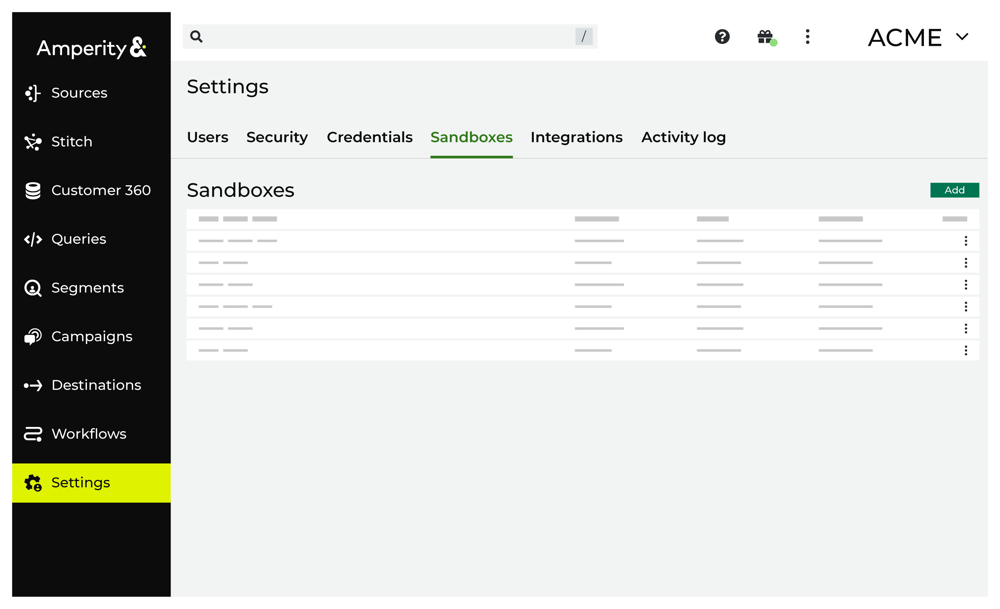

.. https://docs.amperity.com/reference/

.. meta::
    :description lang=en:
        A sandbox is a copy of your production tenant in which you can make configuration changes, verify the results, and then promote those changes to production.

.. meta::
    :content class=swiftype name=body data-type=text:
        A sandbox is a copy of your production tenant in which you can make configuration changes, verify the results, and then promote those changes to production.

.. meta::
    :content class=swiftype name=title data-type=string:
        Sandbox settings

==================================================
About sandbox settings
==================================================

.. include:: ../../shared/terms.rst
   :start-after: .. term-sandbox-start
   :end-before: .. term-sandbox-end

.. settings-xsandboxes-start

Amperity recommends :doc:`using a sandbox to make all configuration state changes <sandboxes>` to your brand's production tenant.

.. settings-sandboxes-end

