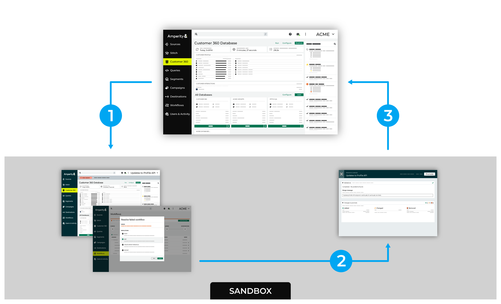
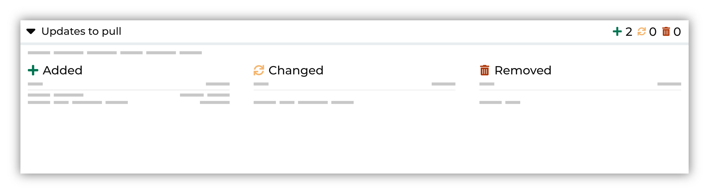
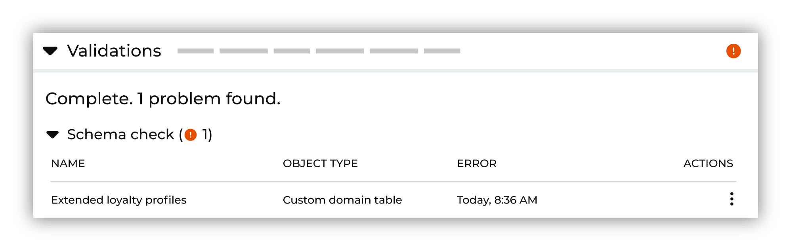

.. 
.. https://docs.amperity.com/reference/
.. 

==================================================
About sandboxes
==================================================

.. include:: ../../shared/terms.rst
   :start-after: .. term-sandbox-start
   :end-before: .. term-sandbox-end

.. sandboxes-learning-lab-start

.. admonition:: Amperity Learning Lab

   .. list-table::
      :widths: 150 450
      :header-rows: 0

      * - .. image:: ../../images/learning-lab-sandboxes.png
             :width: 140 px
             :alt: Amperity Learning Lab
             :align: left
             :class: no-scaled-link
        - Ensure data is always available in production by making changes in a sandbox.

          Each sandbox tracks changes, provides validation workflows and audit tools (that don't need to be configured or customized), and automates monitoring and alerts for changes in the sandbox.

          Open **Learning Lab** to learn more about how |ext_learning_lab_sandboxes| work. Registration is required.

.. sandboxes-learning-lab-end

.. _sandboxes-policy-allow-sandbox-administration:

Allow sandbox administration
==================================================

.. include:: ../../shared/terms.rst
   :start-after: .. term-sandbox-administrator-policy-start
   :end-before: .. term-sandbox-administrator-policy-end

.. include:: ../../shared/terms.rst
   :start-after: .. term-sandbox-administrator-policy-assign-start
   :end-before: .. term-sandbox-administrator-policy-assign-end

.. sandboxes-policy-allow-sandbox-administration-important-start

.. important:: A **DataGrid Operator** can create a sandbox, and then open that sandbox to make configuration changes. While working in a sandbox, a **DataGrid Operator** is assigned the **DataGrid Administrator** policy, which allows a user to have full access to the configuration state of the sandbox.

   A user must be assigned the **Allow sandbox administration** policy option to do any of the following:

   #. View details for all sandboxes
   #. Access any sandbox
   #. Promote changes from a sandbox to production.
   #. Delete a sandbox from the **Users and Activity** page *or* by selecting the **Promote and delete sandbox** option while promoting changes from a sandbox.

.. sandboxes-policy-allow-sandbox-administration-important-end

.. _sandboxes-about-sandbox-workflows:

About sandbox workflows
==================================================

.. sandboxes-about-sandbox-workflows-start

Amperity recommends using a sandbox to make all configuration state changes to your brand's production tenant.

A sandbox is a copy of your production tenant in which you can safely make configuration changes, validate the results of those changes, and then from which you can safely promote those changes to production.

All sandbox workflows follow the same pattern: create a sandbox, make iterative changes in the sandbox, review and validate all changes, promote validated changes to production.

.. list-table::
   :widths: 10 90
   :header-rows: 0

   * - .. image:: ../../images/steps-01.png
          :width: 60 px
          :alt: Step 1.
          :align: left
          :class: no-scaled-link
     - Sandboxes are created from the **Users & Admin** page. Find the **Sandboxes** section, and then click **Create sandbox**.

       .. image:: ../../images/mockups-sandbox-create.png
          :width: 480 px
          :alt: Create a sandbox for your tenant.
          :align: left
          :class: no-scaled-link

       To access a sandbox, from the list of sandboxes, select the |fa-kebab| icon, and then from the list of options select **Access sandbox**.

       .. image:: ../../images/mockups-sandbox-access.png
          :width: 480 px
          :alt: Access a sandbox from the Users and Activity page.
          :align: left
          :class: no-scaled-link

       .. important:: Data is not moved between production and a sandbox. Configuration state is copied from production, and then applied to the sandbox.

   * - .. image:: ../../images/steps-02.png
          :width: 60 px
          :alt: Step 3.
          :align: left
          :class: no-scaled-link
     - Sandbox configuration works the same way as it does in production with all of the same features and functionality. The main difference is that users in a sandbox are assigned the **DataGrid Administrator** policy, which gives them full access to the configuration state within the sandbox.

       When you access a sandbox, it'll look much the same as production, but with a different color scheme.

       .. image:: ../../images/mockups-sandbox-generic-page.png
          :width: 480 px
          :alt: A sandbox has a slightly different color scheme and a unique banner.
          :align: left
          :class: no-scaled-link

       **Validate all configuration changes**

       Sandbox-specific notifications are built into the pages to help you identify the current configuration state of the sandbox as it relates to the configuration state in production. These appear near the top of each page. 

       A notification is shown when action is required to synchronize the configuration states between a sandbox and production. For example:

       .. image:: ../../images/mockups-sandbox-updates-available.png
          :width: 480 px
          :alt: You will be notified when updates are available for your sandbox.
          :align: left
          :class: no-scaled-link

       after which you can review the details for each update that may be available.

       .. image:: ../../images/mockups-sandbox-sync-with-production-pull.png
          :width: 480 px
          :alt: Review the details for each update.
          :align: left
          :class: no-scaled-link

       A list of changes will appear under the **Added**, **Changed**, or **Removed** sections. Click the name of the update to learn more about the differences between the configuration states of your sandbox and production.

       Review the list of **Added**, **Changed**, and/or **Removed** configuration state changes. Click the name of the added, changed, or removed object to review the details for the configuration state change.

       Resolve validation issues, as necessary.

       .. image:: ../../images/mockups-sandbox-access-validations-promote.png
          :width: 480 px
          :alt: Review the details for each update.
          :align: left
          :class: no-scaled-link

   * - .. image:: ../../images/steps-03.png
          :width: 60 px
          :alt: Step 3.
          :align: left
          :class: no-scaled-link
     - When the sandbox is ready to be promoted, click **Promote**. Enter a merge message for this set of configuration state changes.

       .. image:: ../../images/mockups-sandbox-access-validations-merge-message.png
          :width: 480 px
          :alt: Review the details for each update.
          :align: left
          :class: no-scaled-link

.. sandboxes-about-sandbox-workflows-end

.. _sandboxes-best-practice:

Best practices
==================================================

.. sandboxes-best-practice-start

Amperity recommends the following patterns when working with sandboxes:

* :ref:`Continuous validation <sandboxes-best-practice-continuous-validation>`
* :ref:`Data across environments <sandboxes-best-practice-data-across-environments>`
* :ref:`Run partial workflows <sandboxes-best-practice-partial-workflows>`
* :ref:`Short-lived sandboxes <sandboxes-best-practice-short-lived>`

.. sandboxes-best-practice-end

.. _sandboxes-best-practice-continuous-validation:

Continuous validation
--------------------------------------------------

.. sandboxes-best-practice-continuously-validate-changes-start

As you make changes within a sandbox, Amperity will continuously run validations against those changes. If an issue is discovered a notification will appear along with a link to learn more about the validation issue and the steps that may be required to resolve it. You should fix validation issues as they arise to keep your sandbox ready to be promoted to production.

.. sandboxes-best-practice-continuously-validate-changes-end

.. _sandboxes-best-practice-data-across-environments:

Data across environments
--------------------------------------------------

.. sandboxes-best-practice-data-across-environments-start

Data is not moved between your production environment and a sandbox environment. Only the configuration state is copied to the sandbox environment and only *changes to the configuration state* are copied back to your production environment.

For example, if you use a sandbox to add the components required by a new data source, such as a courier, a feed, along with a custom domain table in which semantic tags are applied, after promoting those changes from a sandbox environment you will need to run the courier to pull the data to your production environment.

.. sandboxes-best-practice-data-across-environments-end

.. _sandboxes-best-practice-delete-on-promote:

Delete sandbox on promote
--------------------------------------------------

.. sandboxes-best-practice-delete-on-promote-start

You can automatically delete a sandbox using the **Promote and delete sandbox** option when promoting changes from a sandbox to production.

.. sandboxes-best-practice-delete-on-promote-end

.. _sandboxes-best-practice-partial-workflows:

Run partial workflows
--------------------------------------------------

.. sandboxes-best-practice-partial-workflows-start

Each workflow should be validated before promoting changes to production using a partial workflow.

* A partial workflow pulls data from upstream sources to the sandbox, run Stitch, and then refresh databases.
* A partial workflow *does not* run orchestrations *or* campaigns. This ensures that data in your sandbox is not inadvertently sent to any downstream workflows.

.. sandboxes-best-practice-partial-workflows-end

.. _sandboxes-best-practice-short-lived:

Short-lived sandboxes
--------------------------------------------------

.. sandboxes-best-practice-short-lived-start

A sandbox should be short-lived and should be used to make small, iterative changes within your tenant. After these changes are safely promoted to production, the sandbox should be deleted. Use a sandbox for each iterative change to ensure that you are never making large changes to production.

.. admonition:: Examples of small, iterative changes

   Each sandbox should exist only to support a specific set of planned configuration state changes.

   * A new data source in sandbox A
   * A new destination in sandbox B
   * Changes to a Profile API endpoint in sandbox C
   * A set of custom database tables in sandbox D

   After these changes are promoted to production, the sandbox should be deleted.

.. sandboxes-best-practice-short-lived-end

.. _sandboxes-howtos:

How-tos
==================================================

.. sandboxes-howtos-start

This section describes tasks related to working with sandboxes in Amperity:

* :ref:`Access a sandbox <sandboxes-howto-access-sandbox>`
* :ref:`Add a sandbox <sandboxes-howto-add-sandbox>`
* :ref:`Delete a sandbox <sandboxes-howto-delete-sandbox>`
* :ref:`Edit sandbox details <sandboxes-howto-edit-sandbox-details>`
* :ref:`Open a sandbox <sandboxes-howto-open-sandbox>`
* :ref:`Pull updates from production <sandboxes-howto-pull-updates-from-production>`
* :ref:`Promote changes <sandboxes-howto-promote-changes>`
* :ref:`Resolve validation issues <sandboxes-howto-resolve-validation-issues>`
* :ref:`Review changes <sandboxes-howto-review-changes>`
* :ref:`View sandbox details <sandboxes-howto-view-sandbox-details>`
* :ref:`View validation details <sandboxes-howto-view-validation-details>`

.. sandboxes-howtos-end

.. _sandboxes-howto-access-sandbox:

Access a sandbox
--------------------------------------------------

.. sandboxes-howto-access-sandbox-start

A user who is assigned the **Allow sandbox administration** policy option can, in addition to opening sandboxes they have created, can also access sandboxes other users have created.

This process is similar to :ref:`opening a sandbox <sandboxes-howto-open-sandbox>`, except the name of the link is **Access sandbox** and sandboxes that other users have created will not be available from the menu in the top-right of your tenant.

.. sandboxes-howto-access-sandbox-end

.. _sandboxes-howto-add-sandbox:

Add a sandbox
--------------------------------------------------

.. sandboxes-howto-add-sandbox-start

Sandboxes are created from the **Users & Admin** page.

.. sandboxes-howto-add-sandbox-end

**To add a sandbox**

.. sandboxes-howto-add-sandbox-steps-start

#. From the **Users & Admin** page, under **Sandboxes**, click **Create sandbox**.
#. Each sandbox should be given a name that clearly identifies the type of configuration state change that will be made in that sandbox, along with an expanded description of those changes.

   .. image:: ../../images/mockups-sandbox-create-dialog.png
      :width: 450 px
      :alt: Add a name and description for your sandbox.
      :align: left
      :class: no-scaled-link

#. Click **Create** to generate the sandbox for your tenant.

.. sandboxes-howto-add-sandbox-steps-end

.. _sandboxes-howto-delete-sandbox:

Delete a sandbox
--------------------------------------------------

.. sandboxes-howto-delete-sandbox-start

You can delete a sandbox from the list of sandboxes under **Sandboxes** on the **Users & Admin** page.

.. sandboxes-howto-delete-sandbox-end

.. tip::

   .. include:: ../../amperity_reference/source/sandboxes.rst
      :start-after: .. sandboxes-best-practice-delete-on-promote-start
      :end-before: .. sandboxes-best-practice-delete-on-promote-end

**To delete a sandbox**

.. sandboxes-howto-delete-sandbox-steps-start

#. From the **Users & Admin** page, under **Sandboxes**, from the list of sandboxes, select the |fa-kebab| icon.
#. From the the list of options select **Delete**.
#. On the **Delete sandbox** window, enter the sandbox ID in the field to confirm that you want to delete the sandbox, and then click **Delete**.

.. sandboxes-howto-delete-sandbox-steps-end

.. _sandboxes-howto-edit-sandbox-details:

Edit sandbox details
--------------------------------------------------

.. sandboxes-howto-edit-validation-details-start

The name and description of a sandbox can be edited after it has been created.

.. sandboxes-howto-edit-validation-details-end

**To edit sandbox details**

.. sandboxes-howto-edit-validation-details-steps-start

#. From the **Users & Admin** page, under **Sandboxes**, from the list of sandboxes, select the |fa-kebab| icon.
#. From the the list of options select **Details**.

   The **Sandbox details** window appears with information about the sandbox.

#. Click the **Edit** button and make your changes. When finished, click **Save**.

.. sandboxes-howto-edit-validation-details-steps-end

.. sandboxes-howto-view-sandbox-details-start

.. _sandboxes-howto-open-sandbox:

Open a sandbox
--------------------------------------------------

.. sandboxes-howto-open-sandbox-start

A sandbox is accessible from the **Users and Activity** page *or* from the drop-down menu in the top-right of your tenant.

.. sandboxes-howto-open-sandbox-end

**To open a sandbox**

.. sandboxes-howto-open-sandbox-steps-start

#. From the **Users & Admin** page, under **Sandboxes**, from the list of sandboxes, select the |fa-kebab| icon.
#. From the the list of options select **Open sandbox**.

   This will open the sandbox in a new page in your Web browser.

   .. tip:: To open a sandbox in the *same page*, click the menu in the top-right of your tenant, and then from the drop-down list that appears, select a sandbox.

.. sandboxes-howto-open-sandbox-steps-end

.. _sandboxes-howto-promote-changes:

Promote changes
--------------------------------------------------

.. sandboxes-howto-promote-changes-start

Validated changes within a sandbox can be promoted to production.

.. tip:: You can automatically delete a sandbox using the **Promote and delete sandbox** option when promoting changes from a sandbox to production.

.. sandboxes-howto-promote-changes-end

**To promote changes from a sandbox**

.. sandboxes-howto-promote-changes-steps-start

#. From the **Users & Admin** page, under **Sandboxes**, from the list of sandboxes, select the |fa-kebab| icon, and then :ref:`open a sandbox <sandboxes-howto-open-sandbox>`.
#. From the sandbox, :ref:`resolve all validation issues <sandboxes-howto-resolve-validation-issues>`.
#. Click the **Promote** button, and then specify if you want to delete the sandbox immediately after promoting your changes or if you want to only promote changes (and keep the sandbox).
#. Click **Promote**.

.. sandboxes-howto-promote-changes-steps-end

.. _sandboxes-howto-pull-updates-from-production:

Pull updates from production
--------------------------------------------------

.. sandboxes-howto-pull-updates-from-production-start

The state of production can change independently of the state of a sandbox. For example, changes were promoted from a different sandbox that updated the schema of a database table.

A sandbox must contain the current state of production to ensure that all changes in the sandbox can be validated. A notification appears when updates are available to be pulled from production to your sandbox. This notification is similar to:

.. code:: none

   This sandbox is out of sync
   8 updates to pull from production

This will open the **Pull updates** page, on which you can review all of the updates that will be pulled from production into your sandbox.

.. sandboxes-howto-pull-updates-from-production-end

**To pull updates to a sandbox from production**

.. sandboxes-howto-pull-updates-from-production-steps-start

#. From the **Users & Admin** page, under **Sandboxes**, from the list of sandboxes, select the |fa-kebab| icon, and then :ref:`open a sandbox <sandboxes-howto-open-sandbox>`.
#. Click the "Updates to pull from production" link in the sandbox notification banner.
#. The **Pull updates** page opens. Review all of the updates that will be pulled to your sandbox.
#. Click **Pull**.

.. sandboxes-howto-pull-updates-from-production-steps-end

.. _sandboxes-howto-resolve-validation-issues:

Resolve validation issues
--------------------------------------------------

.. sandboxes-howto-resolve-validation-issues-start

As you make changes within a sandbox, Amperity will run validations against those changes. A notification appears when :ref:`validation issues are present in your sandbox <sandboxes-howto-view-validation-details>` with a link similar to:

.. code:: none

   This sandbox has errors blocking promotion

followed by the number of validation issues:

.. code:: none

   2 current errors to address

Click this link to open the **Promote changes** page, from which each validation issue will appear as a row in a list of validation issues.

In situations where there is a conflict between the state of the sandbox and production, that conflict must be resolved before any changes in production can be pulled into the tenant.

.. tip:: Sandbox validations only appear within sandboxes. Resolve all validation issues before promoting your changes to production.

.. sandboxes-howto-resolve-validation-issues-end

.. _sandboxes-howto-review-changes:

Review changes
--------------------------------------------------

.. sandboxes-howto-review-changes-start

A series of validations are run against updates. These validations will notify you within the sandbox when the configuration states of production and sandbox conflict.

Most of the time you should receive a validation report that does not contain a list of conflicts, similar to:

.. image:: ../../images/mockups-sandbox-access-validations-pull.png
   :width: 450 px
   :alt: All validations passed.
   :align: left
   :class: no-scaled-link

Occasionally, you will receive a validation report that shows one (or more) validation errors. For example, a schema mismatch between a custom domain table in production and a custom domain table in the sandbox:

If you receive a validation report with errors, :ref:`investigate each error and work to resolve the underlying issue <sandboxes-howto-resolve-validation-issues>`. It is possible that resolution must be done in the production tenant before pulling updates to the sandbox. It is also possible that the resolution is done in the sandbox. It depends on the error.

.. sandboxes-howto-review-changes-end

.. _sandboxes-howto-restore-changes:

Restore changes
--------------------------------------------------

.. sandboxes-howto-rollback-changes-start

Changes that are promoted to production from a sandbox may be restored to a previous state. There are two approaches:

#. In many situations you can use a sandbox workflow to quickly restore the state of production, especially when a sandbox was used to make small, iterative changes. First create a sandbox, and then make changes in that sandbox that returns your tenant to its previous state.

#. In situations where this cannot be done using a sandbox workflow, please ask for assistance from your Amperity representative or the `Amperity Support <https://docs.amperity.com/support/index.html>`__ pages.

   .. important:: If your tenant is restored to a previous version, all changes that were made to your tenant *after* that version will be lost. This includes changes made in production *and* changes that may have been promoted from other sandbox workflows.

.. sandboxes-howto-rollback-changes-end

.. _sandboxes-howto-view-sandbox-details:

View sandbox details
--------------------------------------------------

.. sandboxes-howto-view-sandbox-details-start

Sandbox details include the name of the sandbox, its tenant ID and URL, when it was created, when it was last updated, and which user in your tenant is the sandbox owner. You can :ref:`edit some sandbox details <sandboxes-howto-edit-sandbox-details>`.

.. sandboxes-howto-view-sandbox-details-end

**To view sandbox details**

.. sandboxes-howto-view-sandbox-details-steps-start

#. From the **Users & Admin** page, under **Sandboxes**, from the list of sandboxes, select the |fa-kebab| icon.
#. From the the list of options select **Details**.

   The **Sandbox details** window appears with information about the sandbox.

.. sandboxes-howto-view-sandbox-details-steps-end

.. _sandboxes-howto-view-validation-details:

View validation details
--------------------------------------------------

.. sandboxes-howto-view-validation-details-start

All changes in a sandbox are validated automatically. Once the validation process is complete and there are no validation issues, you may promote changes in a sandbox to production.

When changes in a sandbox have validation issues

A notification appears when validation issues are present in your sandbox with a link similar to:

.. code:: none

   This sandbox has errors blocking promotion

Click this link to open the **Promote changes** page, from which each validation issue will appear as a row in a list of validation issues.

.. important:: You cannot :ref:`promote changes in a sandbox to production <sandboxes-howto-promote-changes>` until all validation issues are resolved.

.. sandboxes-howto-view-validation-details-end

**To view validation details**

.. sandboxes-howto-view-validation-details-steps-start

#. In a sandbox, click **View errors**. This opens the **Promote changes** page.
#. From the list of validation errors, select the |fa-kebab| icon, and then choose **View details**.
#. The **Sandbox resolutions** dialog box opens. This dialog describes the cause of the validation issue, and then (if available) provides one (or more) steps you can use to resolve the validation issue.

.. sandboxes-howto-view-validation-details-steps-end
