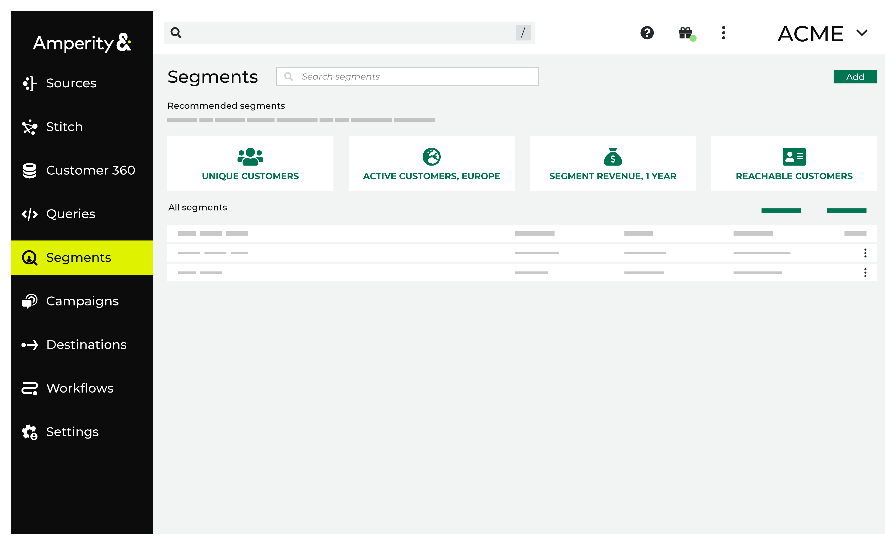
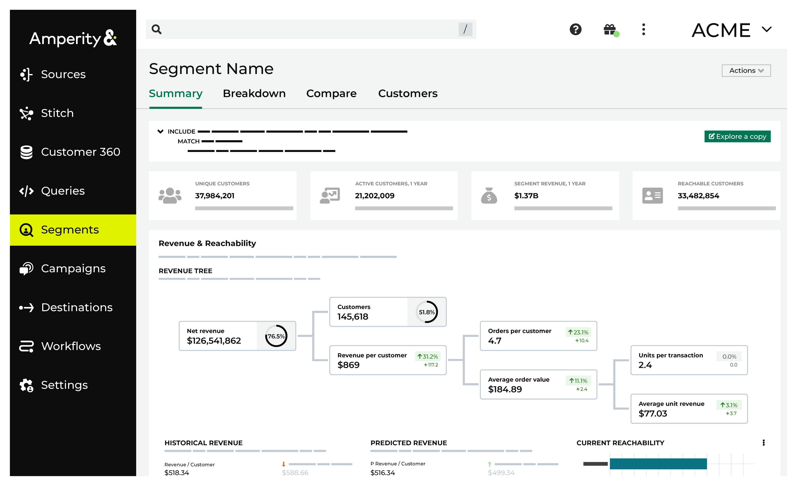
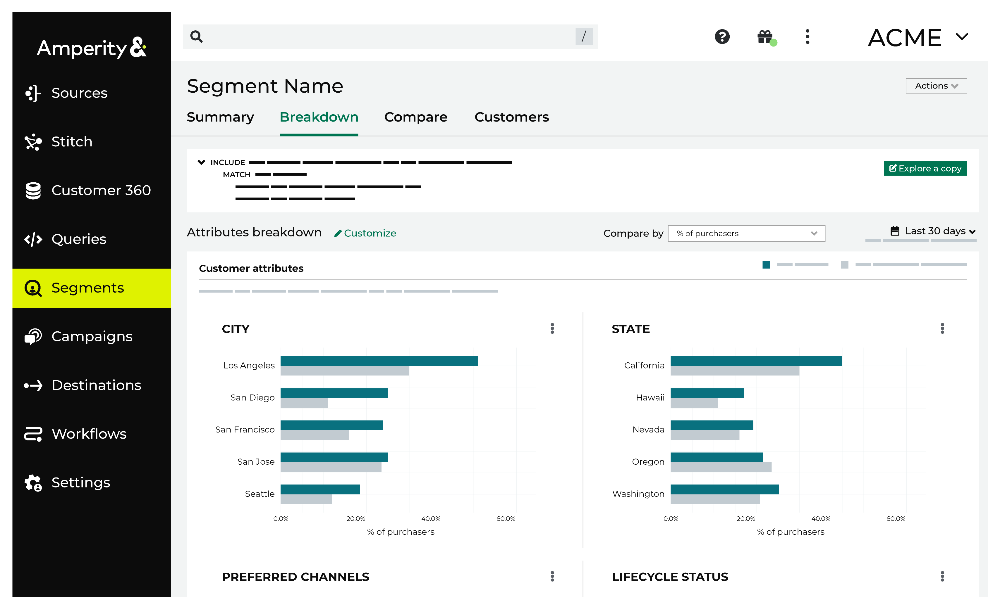
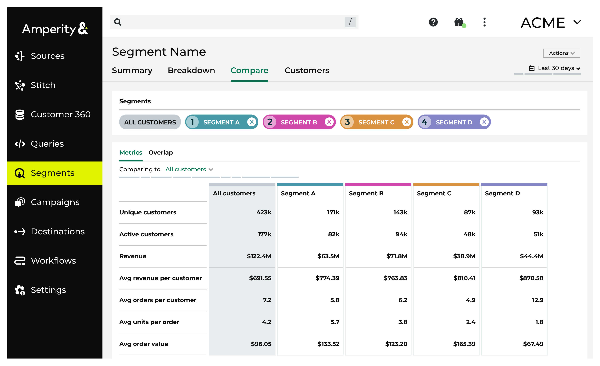
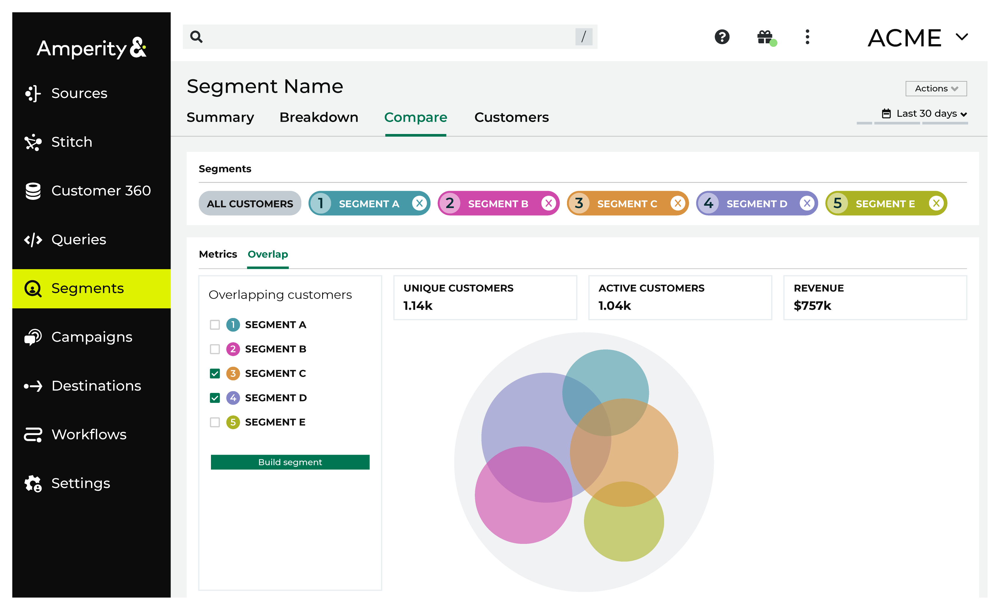
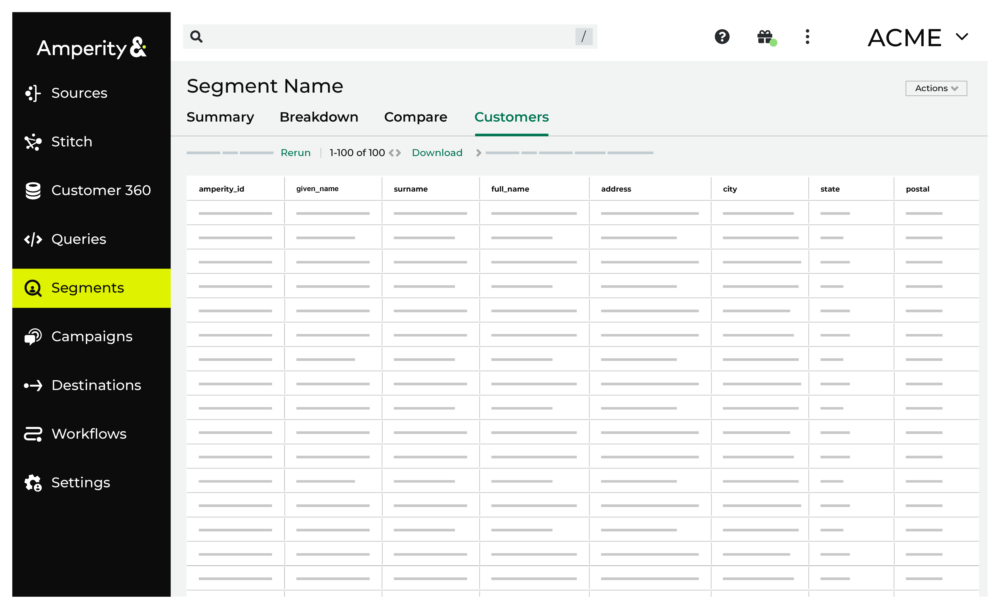

.. https://docs.amperity.com/reference/

.. meta::
    :description lang=en:
        Segments define audiences that match specific attribute profiles. Use these segments as part of your marketing campaigns.

.. meta::
    :content class=swiftype name=body data-type=text:
        Segments define audiences that match specific attribute profiles. Use these segments as part of your marketing campaigns.

.. meta::
    :content class=swiftype name=title data-type=string:
        About segments

==================================================
About segments
==================================================

.. include:: ../../shared/terms.rst
   :start-after: .. term-segment-start
   :end-before: .. term-segment-end

.. _segments-page:

About the Segments page
==================================================

.. include:: ../../shared/terms.rst
   :start-after: .. term-segments-tab-start
   :end-before: .. term-segments-tab-end

.. segments-page-start

You can view a list of active segments along with recommended segments highlighted across the top of the page.

Click **Create Segment** to open the **Segment Editor**. Build your segment using a series of drop-downs and picklists. Refresh **Segment insights** to see how many customers match and to see how much value they bring to your brand. Activate the segment when you're ready to use it in marketing campaigns.

You can reorder the list of segments alphabetically by **Name**  and **Status**. Or, you can reorder the date **Last updated**. Quickly view which campaigns a segment is activated under **Used in**.

.. segments-page-end

**Segments page tasks**

.. segment-summary-howtos-start

* :ref:`segments-configure-segments`
* :ref:`segments-copy-segment-id`
* :ref:`segments-create-campaign`
* :ref:`segments-create-sql-segment-in-folder`
* :ref:`segments-visual-segment-in-folder`
* :ref:`segments-delete-segment`
* :ref:`segments-duplicate-segment`
* :ref:`segments-edit-segment`
* :ref:`segments-move-segment`
* :ref:`segments-organize-segments`
* :ref:`segments-rename-segment`
* :ref:`segments-search-segment`
* :ref:`segments-view-segment`
* :ref:`segments-view-edit-history`
* :ref:`segments-format-segment`

.. segments-summary-howtos-end

.. _segments-recommended:

Recommended segments
--------------------------------------------------

.. segments-recommended-start

The **Segments** page contains a list of active segments along with recommended segments highlighted across the top of the page.

.. segments-recommended-end

**Configure recommended segments**

.. segments-recommended-configure-start

Up to five segments may be configured to show in the list of recommended segments. (Ask your Amperity representative to configure the list of recommended segments for your tenant.)

.. list-table::
   :widths: 10 90
   :header-rows: 0

   * - .. image:: ../../images/steps-01.png
          :width: 60 px
          :alt: Step 1.
          :align: left
          :class: no-scaled-link
     - From the **Segments** page, under **Recommended segments**, click **Configure**.

       .. image:: ../../images/mockup-segments-recommended-configure-click.png
          :width: 420 px
          :alt: Click the "Configure" link to configure recommended segments
          :align: left
          :class: no-scaled-link

       This opens the **Configure recommended segments** dialog box.

       For each recommended segment, use the drop-down list to choose a segment

       .. image:: ../../images/mockup-segments-recommended-select.png
          :width: 380 px
          :alt: Select a segment to be a recommended segment.
          :align: left
          :class: no-scaled-link

       and then choose an icon.

       .. image:: ../../images/mockup-segments-recommended-configure-icons.png
          :width: 280 px
          :alt: Select an icon to associate with each recommended segment.
          :align: left
          :class: no-scaled-link

   * - .. image:: ../../images/steps-02.png
          :width: 60 px
          :alt: Step 2.
          :align: left
          :class: no-scaled-link
     - Up to five recommended segments may be configured.

       .. image:: ../../images/mockup-segments-recommended-configure.png
          :width: 380 px
          :alt: Configure recommended segments.
          :align: left
          :class: no-scaled-link

   * - .. image:: ../../images/steps-03.png
          :width: 60 px
          :alt: Step 3.
          :align: left
          :class: no-scaled-link
     - When your tenant has more than one database, you can select the list of recommended segments for *each database*.

       .. image:: ../../images/mockup-segments-recommended-configure-multibrand.png
          :width: 380 px
          :alt: Select an icon to associate with each recommended segment.
          :align: left
          :class: no-scaled-link

       From the **Segments** page, you can switch between the lists of recommended segments by choosing a database from the "Showing segments for ..." drop-down.

       .. image:: ../../images/mockup-segments-recommended-choose-database.png
          :width: 420 px
          :alt: Select a database.
          :align: left
          :class: no-scaled-link

.. segments-recommended-configure-end

.. _segments-tabs:

Segment tabs
==================================================

.. segments-tabs-start

After you click a segment on the **Segments page**, you can view insights about segments on the following tabs:

#. :ref:`Summary <segments-howitworks-segment-summary>`
#. :ref:`Breakdown <segments-howitworks-segment-breakdown>`
#. :ref:`Compare <segments-howitworks-segment-compare>`
#. :ref:`Customers <segments-howitworks-segment-compare>`

.. segments-tabs-end

.. _segments-howitworks-segment-summary:

Summary tab
--------------------------------------------------

.. segments-summary-start

The **Summary** tab highlights important information about a segment, including:

* How much opportunity does this segment have?
* Which channels can I engage on?
* What is the predicted revenue for this segment?

Use the information on the **Summary** tab to help determine the best way to initiate a marketing campaign.

.. segments-summary-end

.. segments-summary-details-start

Each **Summary** tab contains the following details:

#. The number of unique customers.
#. The number of customers who have been active within the last year.
#. The amount of revenue generated from these customers within the last year.
#. Revenue statistics, including historical revenue trends and a revenue tree.

   .. image:: ../../images/mockup-segments-tab-revenue-tree.png
      :width: 520 px
      :alt: A revenue tree breaks down segment revenue.
      :align: left
      :class: no-scaled-link

   The revenue tree shows the following segment insights:

   * Net revenue
   * Customers
   * Revenue per customer
   * Orders per customer
   * Average order value
   * Units per transaction
   * Average unit revenue

   .. note:: Historical revenue represents the sum of order revenue for all customers who made at least one purchase during the previous year.

   .. tip:: You can view the SQL query for each summary statistic by opening the menu and choosing **View SQL**. 

.. segments-overview-details-end

**Summary tab tasks**

.. segments-summary-howtos-start

* :ref:`segments-bulk-delete-segments`
* :ref:`segments-bulk-move-segment`
* :ref:`segments-view-SQL-revenue-tree`
* :ref:`segments-view-segment-stats-SQL`
* :ref:`segments-explore-copy`

.. segments-summary-howtos-end

.. _segments-howitworks-segment-breakdown:

Breakdown tab
--------------------------------------------------

.. segments-breakdown-details-start

The **Breakdown** tab contains insight charts for customer behaviors and customer attributes. You can ask questions to analyze customer demographics and identify target market segments:

* What is the distribution of customers across categories?
* What are potential customer groups for my marketing efforts?

These charts have a configurable date range and the displayed attributes charts are customizable. To customize the breakdown charts displayed on the **Breakdown** tab, click the **Customize** link, select up to six charts on the **Customize Breakdown Charts** window, and then click **Apply**.

.. note:: Compare by % of Purchasers, % of Revenue, or Revenue/Purchaser in the breakdown charts by selecting one of these options from the **Compare by:** drop-down menu.

.. tip:: You can expand a breakdown chart by clicking the icon and then clicking **Expand**.

.. segments-breakdown-details-end

**Breakdown tab tasks**

.. segments-breakdown-howtos-start

* :ref:`segments-change-comparison-dates`
* :ref:`segments-change-date`
* :ref:`segments-compare`
* :ref:`segments-customize-charts`
* :ref:`segments-expand-graph`
* :ref:`segments-view-SQL-attribute-charts`

.. segments-breakdown-howtos-end

.. _segments-howitworks-segment-compare:

Compare tab
--------------------------------------------------

.. segments-compare-details-start

The **Compare** tab shows how two or more segment statistics compare. You can ask questions that compare key metrics and identify shared audiences to identify new opportunities to reach customers. 

* What is the overlap if I compare multiple segments? 
* How do metrics like active customers, revenue, average revenue per customer, average units per order, and average order value compare across segments?

.. note:: Up to five total segments can be compared together. 

.. segments-compare-details-end

.. segments-compare-overlap-start

You can identify overlapping customer groups by visually comparing up to five segments.

.. segments-compare-overlap-end

**Compare tab tasks**

.. segments-compare-howtos-start

* :ref:`segments-create-new-segment-from-overlap`
* :ref:`segments-select-segment-comparison-chart`
* :ref:`segments-view-segment-overlap`

.. segments-compare-howtos-end

.. _segments-howitworks-segment-customers:

Customers tab
--------------------------------------------------

.. segments-customers-start

The **Customers** tab shows the all data for all of the customers in this segment as a series of columns pulled from various tables in your Customer 360 database. You can download a csv file containing detailed information about each individual customer within the selected segment. This comprehensive dataset includes information such as:

* Basic information like a customers email, address, and phone number.
* Depending on your company's PII restrictions, age group and birthday.
* Other categories that are identified in your Customer 360 table.

.. tip:: You can customize the columns to display in order to only focus on certain attributes. You can also download the segment as a CSV file.

.. segments-customers-end

**Compare tab tasks**

.. segments-customers-howtos-start

* :ref:`segments-baseline-chart-source`
* :ref:`segments-copy-column`
* :ref:`segments-download-segment`
* :ref:`segments-rerun-segment`

.. segments-customers-howtos-end

.. _segments-how-tos:

How-tos
==================================================

.. segments-how-tos-start

This section describes all tasks related to building segments in Amperity:

.. segments-how-tos-end

.. segments-howtos-list-start

* :ref:`segments-add-attribute-from-table`
* :ref:`segments-add-conditions`
* :ref:`segments-add-exclusion`
* :ref:`segments-add-purchase-behaviors`
* :ref:`segments-add-section`
* :ref:`segments-baseline-chart-source`
* :ref:`segments-change-comparison-dates`
* :ref:`segments-segment-database-source`
* :ref:`segments-change-date`
* :ref:`segments-choose-andor-start`
* :ref:`segments-compare`
* :ref:`segments-select-segment-comparison-chart`
* :ref:`segments-copy-column`
* :ref:`segments-copy-segment-id`
* :ref:`segments-copy-sql-query`
* :ref:`segments-create-campaign`
* :ref:`segments-create-customer-list`
* :ref:`segments-create-sql-segment-in-folder`
* :ref:`segments-customize-charts`
* :ref:`segments-delete-segment`
* :ref:`segments-download-segment`
* :ref:`segments-duplicate-segment`
* :ref:`segments-edit-segment`
* :ref:`segments-edit-segment-editor`
* :ref:`segments-expand-graph`
* :ref:`segments-explore-copy`
* :ref:`segments-format-segment`
* :ref:`segments-create-new-segment-from-overlap`
* :ref:`segments-organize-segments`
* :ref:`segments-rename-segment`
* :ref:`segments-rerun-segment`
* :ref:`segments-search-segment`
* :ref:`segments-select-database`
* :ref:`segments-select-multi-values`
* :ref:`segments-set-default-charts`
* :ref:`segments-configure-segments`
* :ref:`segments-show-columns`
* :ref:`segments-switch-sql-segment`
* :ref:`segments-use-relative-dates`
* :ref:`segments-view-segment`
* :ref:`segments-view-edit-history`
* :ref:`segments-view-matching-records`
* :ref:`segments-view-segment-overlap`
* :ref:`segments-view-sql`

.. segments-howtos-list-end
