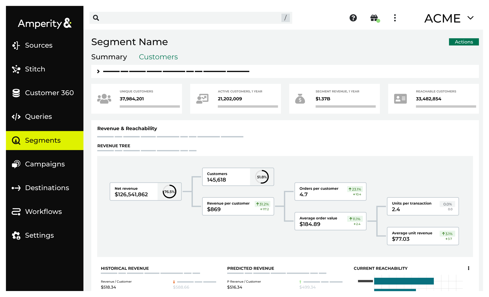
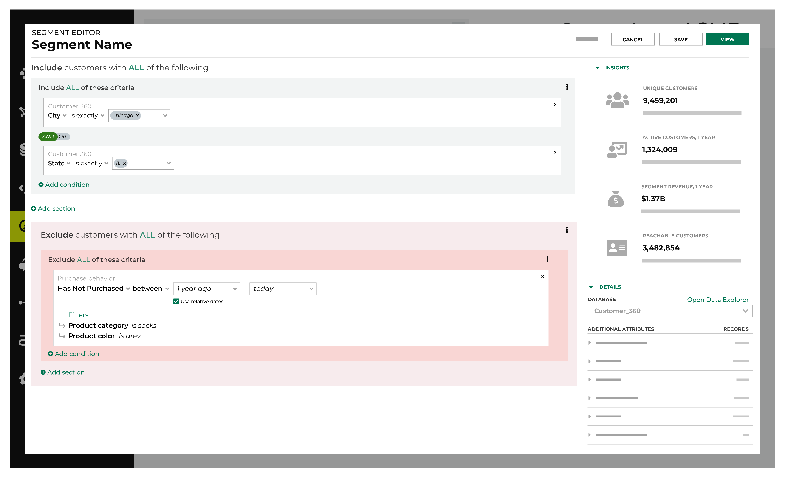
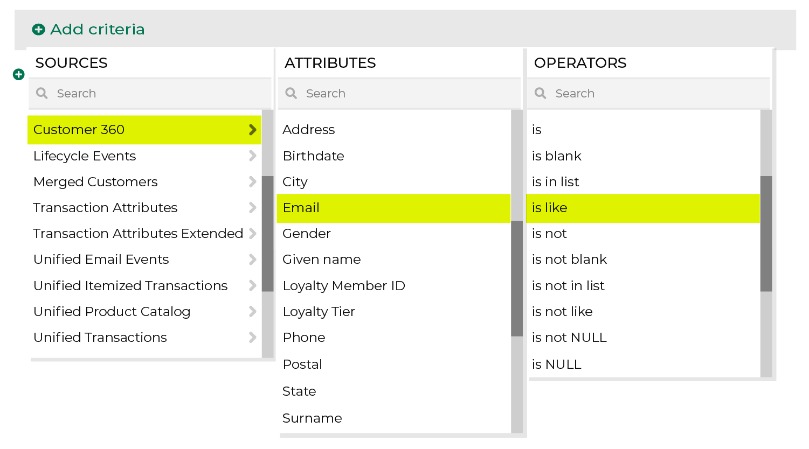
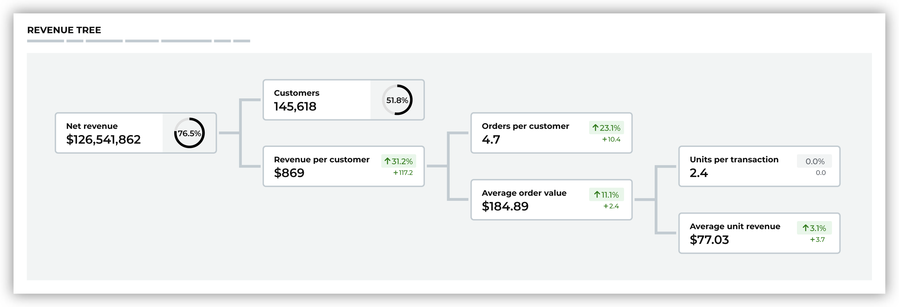

.. 
.. https://docs.amperity.com/reference/
.. 

.. meta::
    :description lang=en:
        Segments define audiences that match specific attribute profiles. Use these segments as part of your marketing campaigns.

.. meta::
    :content class=swiftype name=body data-type=text:
        Segments define audiences that match specific attribute profiles. Use these segments as part of your marketing campaigns.

.. meta::
    :content class=swiftype name=title data-type=string:
        About segments

==================================================
About segments
==================================================

.. include:: ../../shared/terms.rst
   :start-after: .. term-segment-start
   :end-before: .. term-segment-end

.. _segments-tab:

About the Segments page
==================================================

.. include:: ../../shared/terms.rst
   :start-after: .. term-segments-tab-start
   :end-before: .. term-segments-tab-end

.. segments-tab-start

The **Segments** page contains a list of active segments along with recommended segments highlighted across the top of the page.

Click **Create Segment** to open the **Segment Editor**. Build your segment using a series of drop-downs and picklists. Refresh segment insights to see how many customers match and to see how much value they bring to your brand. Activate the segment when you're ready to use it in marketing campaigns.

.. segments-tab-end

.. image:: ../../images/mockup-segments-tab.png
   :width: 600 px
   :alt: The Segments page.
   :align: left
   :class: no-scaled-link

.. _segments-howitworks-segment-recommended:

Recommended segments
--------------------------------------------------

.. segments-howitworks-segment-recommended-start

The **Segments** page contains a list of active segments along with recommended segments highlighted across the top of the page.

.. segments-howitworks-segment-recommended-end

**Configure recommended segments**

.. segments-howitworks-segment-recommended-configure-start

Up to five segments may be configured to show in the list of recommended segments. (Ask your Amperity representative to configure the list of recommended segments for your tenant.)

.. list-table::
   :widths: 10 90
   :header-rows: 0

   * - .. image:: ../../images/steps-01.png
          :width: 60 px
          :alt: Step 1.
          :align: left
          :class: no-scaled-link
     - From the **Segments** page, under **Recommended segments**, click **Configure**.

       .. image:: ../../images/mockup-segments-recommended-configure-click.png
          :width: 420 px
          :alt: Click the "Configure" link to configure recommended segments
          :align: left
          :class: no-scaled-link

       This opens the **Configure recommended segments** dialog box.

       For each recommended segment, use the drop-down list to choose a segment

       .. image:: ../../images/mockup-segments-recommended-select.png
          :width: 380 px
          :alt: Select a segment to be a recommended segment.
          :align: left
          :class: no-scaled-link

       and then choose an icon.

       .. image:: ../../images/mockup-segments-recommended-configure-icons.png
          :width: 280 px
          :alt: Select an icon to associate with each recommended segment.
          :align: left
          :class: no-scaled-link

   * - .. image:: ../../images/steps-02.png
          :width: 60 px
          :alt: Step 2.
          :align: left
          :class: no-scaled-link
     - Up to five recommended segments may be configured.

       .. image:: ../../images/mockup-segments-recommended-configure.png
          :width: 380 px
          :alt: Configure recommended segments.
          :align: left
          :class: no-scaled-link

   * - .. image:: ../../images/steps-03.png
          :width: 60 px
          :alt: Step 3.
          :align: left
          :class: no-scaled-link
     - When your tenant has more than one database, you can select the list of recommended segments for *each database*.

       .. image:: ../../images/mockup-segments-recommended-configure-multibrand.png
          :width: 380 px
          :alt: Select an icon to associate with each recommended segment.
          :align: left
          :class: no-scaled-link

       From the **Segments** page, you can switch between the lists of recommended segments by choosing a database from the "Showing segments for ..." drop-down.

       .. image:: ../../images/mockup-segments-recommended-choose-database.png
          :width: 420 px
          :alt: Select a database.
          :align: left
          :class: no-scaled-link

.. segments-howitworks-segment-recommended-configure-start

.. _segments-howitworks-segment-summary:

Summary page
--------------------------------------------------

.. segments-howitworks-segment-summary-start

The **Summary** page highlights the most important information about a segment, including:

* How much opportunity does this segment have?
* Which channels should I engage on?
* What is the predicted revenue for this segment?

Use the information on the **Summary** page to help determine the best way to initiate a marketing campaign.

.. segments-howitworks-segment-summary-end

.. segments-howitworks-segment-summary-details-start

Each **Summary** page contains the following details:

#. The number of unique customers.
#. The number of customers who have been active within the last year.
#. The amount of revenue generated from these customers within the last year.
#. The number of customers who are reachable. 
#. Revenue statistics, including historical revenue and predicted revenue trends.

   .. tip:: Historical revenue represents the sum of order revenue for all customers who made at least one purchase during the previous year.
#. The channels through which this segment has customer opportunity.
#. Segment insight charts for customer behaviors and customer attributes. These charts have a configurable date range and up to six may be selected. Click the **Actions** menu, and then select **Customize charts** to choose up to six charts for customer behaviors and for customer attributes.
#. The list of customers who belong to this segment.

.. segments-howitworks-segment-overview-details-end

.. _segments-howitworks-segment-customers:

Customers page
--------------------------------------------------

.. segments-howitworks-segment-customers-start

The **Customers** page shows the columns and tables from which customer data for this segment is available.

.. segments-howitworks-segment-customers-end

.. _segments-howitworks:

How segments work
==================================================

.. include:: ../../shared/terms.rst
   :start-after: .. term-visual-segment-editor-start
   :end-before: .. term-visual-segment-editor-end

.. image:: ../../images/mockup-segments-tab-howitworks.png
   :width: 600 px
   :alt: The Segment Editor is located within the Segments page in Amperity.
   :align: left
   :class: no-scaled-link

.. segments-howitworks-start

The **Segment Editor** is available from the **Segments** page. Click **Create Segment** from the **Segments** page to open the editor, and then start building your segment.

.. segments-howitworks-end

.. segments-howitworks-steps-start

Follow this sequence when building a segment:

.. segments-howitworks-steps-end

.. include:: ../../amperity_ampiq/source/segments.rst
   :start-after: .. segments-howitworks-callouts-start
   :end-before: .. segments-howitworks-callouts-end

.. _segments-howitworks-segment-names:

Segment names
==================================================

.. segments-howitworks-segment-names-start

A good segment name is clear and concise, is not longer than necessary, uses patterns to help lists of segments stay organized, and considers how it might be represented in downstream workflows, such as lists of segments in the **Campaigns** page in Amperity, but also external systems such as Braze, Campaign Monitor, Facebook Ads, Google Ads, Klaviyo, and Mailchimp.

.. segments-howitworks-segment-names-end

.. segments-names-important-message-about-segment-names-start

.. important:: Users of downstream systems are often not the same set of users who configure and manage segments in Amperity.

   If you send a segment named  and if you send them a segment named "Untitled segment (43) - 2021-08-13-09-34-35" your downstream users might not know what to do with it.

   Be sure to follow good naming patterns to ensure that downstream users can always find your segments when they need them. Add details like “historical”, “daily”, or “test” as appropriate.

   Be sure to include the brand name and/or the region name if you have multiple brands or have multiple regions.

   Some examples:

   * “Birthdays_Under_40_CA”
   * “Birthdays_Under_40_NY”
   * “High_AOV_Active_Loyal”
   * “High_CLV_Historical”
   * “Acme_Daily_Churn”

   Prefix a segment that is located in a folder with that folder name as often as possible.

   For example, if you have folders named “Braze” and “TikTok” use segment names like “Braze_Birthdays_Under_40_CA” and “TikTok_Birthdays_Under_40” for all segments that exist within those folders.

   If your downstream systems will have data from non-Amperity systems, consider using Amperity as the first prefix: "Amperity_Birthdays_Under_40_CA".

   Use leading zeroes if a sequential numbering system is a prefix. For example: 0001, 0002, 0003, ...0100 is preferable to 1, 2, 3, ...100. This will help ensure that your segments are ordered sequentially in the Amperity **Segments** page *and* downstream systems.

.. segments-names-important-message-about-segment-names-end

.. _segments-howitworks-attributes:

Segment attributes
==================================================

.. segments-howitworks-attributes-start

You can add attributes to your segment by selecting individual attributes from tables or by selecting from a series of pre-configured behavioral attributes.

.. segments-howitworks-attributes-end

.. _segments-howitworks-segment-conditions:

Conditions
--------------------------------------------------

.. segments-howitworks-segment-conditions-start

An attribute condition defines how results from a column in a data source will be returned.

For example: From your customer 360 table, return all customer records that contain email addresses that are similar to "gmail.com". The data source is your customer 360 table, the attribute is the **email** field in that table, and the **is like** condition allows you to use "gmail.com" to look for values that contain "gmail.com", and then return a list of customers who have "gmail.com" in their email address.

In SQL, an condition is expressed using the ``WHERE`` clause. The following example returns a list of customers who have "gmail.com" in their email address:

::

   SELECT
     email
   FROM
     Customer360
   WHERE email LIKE "gmail.com"

In the **Segment Editor** you define conditions using a series of picklists that do not require knowledge of SQL or how to define a ``WHERE`` clause:

.. segments-howitworks-segment-conditions-end

.. segments-conditions-list-start

The list of conditions that are available to an attribute in the **Segment Editor** varies, with each list depending on its data type:

* :ref:`Boolean <segments-howitworks-segment-condition-boolean>`
* :ref:`Date <segments-howitworks-segment-condition-date>`
* :ref:`Datetime <segments-howitworks-segment-condition-datetime>`
* :ref:`Decimal <segments-howitworks-segment-condition-decimal>`
* :ref:`Integer <segments-howitworks-segment-condition-integer>`
* :ref:`Relative dates <segments-howitworks-segment-condition-relative-dates>`
* :ref:`String <segments-howitworks-segment-condition-string>`

.. note:: This topic is a reference for all conditions that are available to all attributes and is organized alphabetically by data type, and then by condition. This topic does not contain specific recommendations for specific attributes (or attribute groups). Refer to the individual attribute reference pages to learn more about the set of conditions that are available, including recommended conditions and examples of using them.

.. segments-conditions-list-end

.. _segments-howitworks-segment-condition-null-not-null:

About NULL and not NULL values
++++++++++++++++++++++++++++++++++++++++++++++++++

.. segments-howitworks-segment-condition-null-not-null-start

A field with a NULL value is a field with a value that does not exist.

A NULL value is different than a value of zero, a blank value, or a value that contains only spaces. An attribute can only have a NULL value if it remained empty after the record was created.

For example, if you have 100 customers, 99 of which have provided a value for their phone number (even if some of those phone numbers are invalid phone numbers), 1 of which has not provided any value at all. The customer record that does not have a phone number is empty and is a NULL value.

Conversely, a field with a value that is not NULL is a field with a value that exists, including values of zero, blank values, and value that contain only spaces.

Using the 100 customers and their phone numbers example, Amperity would return 1 record when the "is NULL" condition is used and 99 records when the "is not NULL" condition is used, even if 2 of them contained spaces instead of numbers and 4 of them were "555-555-1234".

.. segments-howitworks-segment-condition-null-not-null-end

.. _segments-howitworks-segment-condition-boolean:

Boolean conditions
++++++++++++++++++++++++++++++++++++++++++++++++++

.. segments-howitworks-segment-condition-boolean-about-start

A Boolean condition represents true and false outcomes, such as "Has this person purchased more than once?" The answer is "Yes" or "No."

.. segments-howitworks-segment-condition-boolean-about-end

.. segments-howitworks-segment-condition-boolean-start

The following conditions are available to all attributes with the Boolean data type:

.. list-table::
   :widths: 300 300
   :header-rows: 1

   * - Operator
     - Description
   * - **is false**
     - **false** returns customer records that are "false".

   * - **is NULL**
     - **is NULL** returns customer records that do not have a value. A record that does not have a value cannot be "true" or "false".

   * - **is NOT NULL**
     - **is not NULL** returns customer records that have a value. A record that has a value is either "true" or "false".

   * - **is true**
     - **is true** returns customer records that are "true".

.. segments-howitworks-segment-condition-boolean-end

.. _segments-howitworks-segment-condition-date:

Date conditions
++++++++++++++++++++++++++++++++++++++++++++++++++

.. segments-howitworks-segment-condition-date-start

A Date data type represents a day, a month, and a year. For example: a birthdate.

A Date data type accepts ``YYYY-MM-DD``.

.. segments-howitworks-segment-condition-date-end

.. segments-howitworks-segment-condition-date-start

The following conditions are available to all attributes with the Date data type:

.. list-table::
   :widths: 300 300
   :header-rows: 1

   * - Operator
     - Description
   * - **is**
     - **is** returns customer records with activity that matches the specified calendar date.

   * - **is after**
     - **is after** returns customer records with activity that occurred after the specified calendar date, not including the specified date.

   * - **is before**
     - **is before** returns customer records with activity that occurred before the specified calendar date, not including the specified date.

   * - **is between**
     - **is between** returns customer records with activity that is between the specified calendar dates, not including the specified dates.

   * - **is not**
     - **is not** returns customer records with activity that does not match the specified calendar date.

   * - **is not between**
     - **is not between** returns customer records with activity that is not between the specified calendar dates, not including the specified dates.

   * - **is not NULL**
     - **is not NULL** returns customer records that have a value.

   * - **is NULL**
     - **is NULL** returns customer records that do not have a value.

   * - **is on or after**
     - **is on or after** returns customer records with activity that occurred on or after the specified calendar date, including the specified date.

   * - **is on or before**
     - **is on or before** returns customer records with activity that occurred on or before the specified calendar date, including the specified date.

.. segments-howitworks-segment-condition-date-end

.. _segments-howitworks-segment-condition-datetime:

Datetime conditions
++++++++++++++++++++++++++++++++++++++++++++++++++

.. segments-howitworks-segment-condition-datetime-start

A Datetime data type represents a date and time combination. For example: a date and time at which a customer made a purchase.

A Datetime data type accepts "YYYY-MM-DD hh:mm:ss".

.. segments-howitworks-segment-condition-datetime-end

.. segments-howitworks-segment-condition-datetime-start

The following conditions are available to all attributes with the Datetime data type:

.. list-table::
   :widths: 300 300
   :header-rows: 1

   * - Operator
     - Description
   * - **is**
     - **is** returns customer records with activity that matches the specified calendar date and time.

   * - **is after**
     - **is after** returns customer records with activity that occurred after the specified calendar date and time, not including the specified date and time.

   * - **is before**
     - **is before** returns customer records with activity that occurred before the specified calendar date and time, not including the specified date and time.

   * - **is between**
     - **is between** returns customer records with activity that is between the specified calendar dates and times, not including the specified dates and times.

   * - **is not**
     - **is not** returns customer records with activity that does not match the specified calendar date and time.

   * - **is not between**
     - **is not between** returns customer records with activity that is not between the specified calendar dates and times, not including the specified dates and times.

   * - **is not NULL**
     - **is not NULL** returns customer records that have a value.

   * - **is NULL**
     - **is NULL** returns customer records that do not have a value.

   * - **is on or after**
     - **is on or after** returns customer records with activity that occurred on or after the specified calendar date and time, including the specified date and time.

   * - **is on or before**
     - **is on or before** returns customer records with activity that occurred on or before the specified calendar date and time, including the specified date and time.

.. segments-howitworks-segment-condition-datetime-end

.. _segments-howitworks-segment-condition-decimal:

Decimal conditions
++++++++++++++++++++++++++++++++++++++++++++++++++

.. segments-howitworks-segment-condition-decimal-about-start

A Decimal data type represents amounts, percentages, and scores.

A Decimal data type accepts numeric values with a precision of 38 and a scale of 2 (default). Precision is the number of digits that may be in the decimal value. Scale is the number of digits that may be to the right of the decimal point.

.. note:: Amperity defaults precision and scale for the Decimal data type to 38 and 0: DECIMAL(38,2). The default value for scale may be configured in the feed for each data source.

.. segments-howitworks-segment-condition-decimal-about-end

.. segments-howitworks-segment-condition-decimal-start

The following conditions are available to all attributes with the Decimal data type:

.. list-table::
   :widths: 300 300
   :header-rows: 1

   * - Operator
     - Description
   * - **is**
     - **is** returns customer records with values that match the specified amount or percentage.

   * - **is between**
     - **is between** returns customer records with values that are between the specified amounts or percentages, not including the specified amounts or percentages.

   * - **is greater than**
     - **is greater than** returns customer records with values that are greater than the specified amount or percentage, not including the specified amount or percentage.

   * - **is greater than or equal to**
     - **is greater than or equal to** returns customer records with values that are greater than or equal to the specified amount or percentage, including the specified amount or percentage.

   * - **is in list**
     - **is in list** returns customer records with values that match the amounts or percentages that are specified in the list.

   * - **is less than**
     - **is less than** returns customer records with values that are less than the specified amount or percentage, not including the specified amount or percentage.

   * - **is less than or equal to**
     - **is less than or equal to** returns customer records with values that are less than or equal to the specified amount or percentage, including the specified amount or percentage.

   * - **is not**
     - **is not** returns customer records with values that do not match the specified amount or percentage.

   * - **is not between**
     - **is not between** returns customer records with values that are not between the specified amounts or percentages, not including the specified amounts or percentages.

   * - **is not in list**
     - **is not in list** returns customer records with values that do not match the amounts or percentages that are specified in the list.

   * - **is not NULL**
     - **is not NULL** returns customer records that have a value.

   * - **is NULL**
     - **is NULL** returns customer records that do not have a value.

.. segments-howitworks-segment-condition-decimal-end

.. _segments-howitworks-segment-condition-integer:

Integer conditions
++++++++++++++++++++++++++++++++++++++++++++++++++

.. segments-howitworks-segment-condition-integer-about-start

An Integer data type represents quantities, such as items ordered, frequency of purchase, number of orders, clicks, and page visits.

An Integer data type accepts numeric values with an implied scale of zero.

.. segments-howitworks-segment-condition-integer-about-end

.. segments-howitworks-segment-condition-integer-start

The following conditions are available to all attributes with the Integer data type:

.. list-table::
   :widths: 300 300
   :header-rows: 1

   * - Operator
     - Description
   * - **is**
     - **is** returns customer records with values that match the specified quantity.

   * - **is between**
     - **is between** returns customer records with values that are between the specified quantities, not including the specified quantity.

   * - **is greater than**
     - **is greater than** returns customer records with values that are greater than the specified quantity, not including the specified quantity.

   * - **is greater than or equal to**
     - **is greater than or equal to** returns customer records with values that are greater than or equal to the specified quantity, including the specified quantity.

   * - **is in list**
     - **is in list** returns customer records with values that match the quantities that are specified in the list.

   * - **is less than**
     - **is less than** returns customer records with values that are less than the specified quantity, not including the specified quantity.

   * - **is less than or equal to**
     - **is less than or equal to** returns customer records with values that are less than or equal to the specified quantity, including the specified quantity.

   * - **is not**
     - **is not** returns customer records with values that do not match the specified quantity.

   * - **is not between**
     - **is not between** returns customer records with values that are not between the specified quantities, not including the specified quantity.

   * - **is not in list**
     - **is not in list** returns customer records with values that do not match the quantities that are specified in the list.

   * - **is not NULL**
     - **is not NULL** returns customer records that have a value.

   * - **is NULL**
     - **is NULL** returns customer records that do not have a value.

.. segments-howitworks-segment-condition-integer-end

.. _segments-howitworks-segment-condition-string:

String conditions
++++++++++++++++++++++++++++++++++++++++++++++++++

.. segments-howitworks-segment-condition-string-about-start

A String data type represents many things, such as identifiers, names (of people, places, and products), phone numbers, etc.

A String data type accepts A-Z, a-Z, underscores, and hyphens.

.. segments-howitworks-segment-condition-string-about-end

.. segments-howitworks-segment-condition-string-start

The following conditions are available to all attributes with the String data type:

.. list-table::
   :widths: 300 300
   :header-rows: 1

   * - Operator
     - Description
   * - **contains**
     - Returns customer records with values that match a string of characters.

   * - **does not contain**
     - Returns customer records with values that do not match a string of characters.

   * - **ends with**
     - Returns customer records with values that end with the specified characters.

   * - **is empty**
     - Returns customer records that do not have a value in this field.

   * - **is exactly**
     - Returns all customer records with values that match the specified characters.

   * - **is not empty**
     - Returns customer records that have a value in this field.

   * - **is not exactly**
     - Returns customer records that do not match the specified characters.

   * - **starts with**
     - Returns customer records that start with the specified characters.

.. segments-howitworks-segment-condition-string-end

.. _segments-howitworks-segment-condition-relative-dates:

Relative dates
--------------------------------------------------

.. segments-howitworks-segment-condition-relative-dates-start

A relative date is determined at the time a segment is run, where **today** is the day on which the segment is run. For example: **yesterday**, **30 days ago**, **14 days ago**, or **1 year ago**. The list of relative date values includes a series of common ranges, but you may also type in a more specific range, such as **2 months ago** or **5 days ago**.

.. segments-howitworks-segment-condition-relative-dates-end

**Relative date values**

.. segments-howitworks-segment-condition-relative-date-values-start

.. list-table::
   :widths: 30 70
   :header-rows: 1

   * - Value
     - Description
   * - **Tomorrow**
     - Starts at 12:00:00 AM of the day after the current day.

       For example, if the current day is "Thursday 01 / 12 / 2023" then **tomorrow** is "Friday 01 / 13 / 2023".

   * - **Today**
     - Starts at 12:00:00 AM (or at the current time) on the current day and continues for 24 hours.

       For example, if the current day is "Thursday 01 / 12 / 2023" then **today** is "Thursday 01 / 12 / 2023".

   * - **Yesterday**
     - Starts at 12:00:00 AM of the day before the current day.

       For example, if the current day is "Thursday 01 / 12 / 2023" then **yesterday** is "Wednesday 01 / 11 / 2023".

   * - **N days ago**
     - Starts at 12:00:00 AM of the day N days before the current day.

       For example, if the current day is "Thursday 01 / 12 / 2023", then:

       * **7 days ago** is "Thursday 01 / 05 / 2023"
       * **14 days ago** is "Thursday 12 / 29 / 2022"
       * **30 days ago** is "Tuesday 12 / 13 / 2022"
       * **60 days ago** is "Sunday 11 / 13 / 2022"
       * **90 days ago** is "Friday 10 / 14 / 2022"

   * - **1 month ago**
     - Starts at 12:00:00 AM of the same day of the month that is 1 month before the current month.

       For example, if the current day is "Thursday 01 / 12 / 2023" then **1 month ago** is "Monday 12 / 12 / 2022".

   * - **1 year ago**
     - Starts at 12:00:00 AM of same day of the year that is 1 year before the current year.

       For example, if the current day is "Thursday 01 / 12 / 2023" then **1 year ago** is "Wednesday 01 / 12 / 2022".

.. segments-howitworks-segment-condition-relative-date-values-end

.. _segments-insights:

Segment insights
==================================================

.. include:: ../../amperity_ampiq/source/segments_reference.rst
   :start-after: .. segments-reference-segment-insights-start
   :end-before: .. segments-reference-segment-insights-end

.. segments-insights-categories-start

Segment insights include the following categories:

* **Unique Customers** shows the number of unique customers who are in the segment, where a unique customer is represented by a unique Amperity ID.
* **1-year Active Customers** shows how many unique customers have made a purchase within the past year.
* **1-year Segment Revenue** shows the total revenue for all purchases made by active customers within the past year.
* **Reachable Customers** shows the number of unique customers who have at least one contactable email address, phone number, or physical mailing address.

.. segments-insights-categories-end

.. segments-insights-note-start

.. note:: Segment insights are available when your customer 360 database contains certain tables.

   * **Unique Customers**, **1-year Active Customers**, and **1-year Segment Revenue** require access to the **Transaction Attributes Extended** and **Customer 360** tables.
   * **Reachable Customers** requires access to the **Customer Attributes** table.

.. segments-insights-note-end

.. _segments-insights-revenue-tree:

Revenue tree
==================================================

.. segments-insights-revenue-tree-start

A revenue tree shows the following segment insights:

* Net revenue
* Customers
* Revenue per customer
* Orders per customer
* Average order value
* Units per transaction
* Average unit revenue

.. segments-insights-revenue-tree-end

.. _segments-howitworks-database-tables:

Databases and tables
==================================================

.. segments-howitworks-database-tables-start

You can use any database table that is available to the **Segments** page to build attribute groups. All of the tables in the currently-selected database are available from the drop-down menu in each attribute group and are shown in the bottom right corner of the **Segment Editor**.

#. You may change the selected database by choosing another one from the drop-down menu.
#. The list of tables is refreshed to show the tables in that database.

.. image:: ../../images/mockup-segments-tab-database-and-tables.png
   :width: 340 px
   :alt: Use your customer 360 database to build segments.
   :align: left
   :class: no-scaled-link

.. important:: Tables must be configured to be available to the **Segments** page. This must be done by a member of your team who manages databases and tables from the **Customer 360** page.

.. segments-howitworks-database-tables-end

.. _segments-howitworks-and-vs-or:

AND vs. OR
==================================================

.. segments-howitworks-and-vs-or-start

AND and OR are used in SQL languages to specify how results should be filtered when more than one condition is present.

* Use AND to return a smaller (and more specific) list of customers. A customer must match all conditions to belong to the list.
* Use OR to return a larger (and more broad) list of customers. A customer may match any condition to belong to the list.

Amperity uses AND and OR to help you choose which type of behavior -- larger audiences or smaller audiences -- you want to use in your segment.

The AND and OR conditions may be set in two locations:

#. Within a group of attributes
#. Between groups of attributes

The default is AND. Use the slider to switch to OR.

.. segments-howitworks-and-vs-or-end

.. _segments-howitworks-and-vs-or-context:

How AND vs. OR works
--------------------------------------------------

.. segments-howitworks-and-vs-or-context-start

The following examples describe how AND and OR conditions work.

.. list-table::
   :widths: 10 90
   :header-rows: 0

   * - .. image:: ../../images/steps-01.png
          :width: 60 px
          :alt: Single attribute.
          :align: left
          :class: no-scaled-link

     - "I want to build an audience that returns customers who have an email address."

       .. image:: ../../images/segments-and-vs-or-howitworks-1.png
          :width: 600 px
          :alt: Return an audience that returns customers who have an email address.
          :align: left
          :class: no-scaled-link

       In this example, there is only one condition. The audience that is returned contains only customers who have an email address.

   * - .. image:: ../../images/steps-02.png
          :width: 60 px
          :alt: Two attributes, AND condition.
          :align: left
          :class: no-scaled-link

     - "I want to build an audience that returns customers who have an email address **AND** customers have opted in to receiving email messages from my brand."

       .. image:: ../../images/segments-and-vs-or-howitworks-2.png
          :width: 600 px
          :alt: Return an audience that returns customers who have an email address and who have opted in.
          :align: left
          :class: no-scaled-link

       In this example, the audience that is returned -- shown as the darker color -- is smaller because only a subset of customers for whom you have email addresses have opted in to receiving email messages from your brand.

   * - .. image:: ../../images/steps-03.png
          :width: 60 px
          :alt: Two attributes, OR condition.
          :align: left
          :class: no-scaled-link

     - "I want to build an audience that returns customers who have an email address **OR** customers who have phone number."

       .. image:: ../../images/segments-and-vs-or-howitworks-3.png
          :width: 600 px
          :alt: Return an audience that returns customers who have an email address or a phone number.
          :align: left
          :class: no-scaled-link

       In this example, your audience grows larger because both conditions are met: email address *or* phone number. This is shown as both colors and the total audience is the overlap of both conditions.

   * - .. image:: ../../images/steps-04.png
          :width: 60 px
          :alt: Two groups of attributes with OR conditions, AND in-between.
          :align: left
          :class: no-scaled-link

     - "I want to build an audience that returns a customer's email address **OR** a customer's phone number **AND** customers have opted in to receiving messages from my brand from to their email address **OR** phone number."

       This audience has two groups of attributes: email addresses **OR** phone numbers **AND** opt-in status for email addresses **OR** phone numbers.

       The first group of attributes -- email addresses *or* phone numbers, as shown in the darker color -- should make your audience larger. Few data sets have a perfectly matching set of email addresses and phone numbers across all customers.

       .. image:: ../../images/segments-and-vs-or-howitworks-3.png
          :width: 600 px
          :alt: Return an audience that returns customers who have an email address or a phone number.
          :align: left
          :class: no-scaled-link

       The second group of attributes -- opt-in status for email addresses *or* phone numbers, as shown in the lighter color -- should also be larger as a group than by themselves. You should expect the number of customers who have opted in to receive email or SMS communications to be smaller than the number of customers who have provided email addresses or phone numbers to your brand.

       These two groups are in-between an **AND** condition within your segment: email address *or* phone *and* opt-in status for email address *or* phone.

       .. image:: ../../images/segments-and-vs-or-howitworks-4.png
          :width: 600 px
          :alt: Return an audience that returns customers who have an email address or a phone number and who have opted in.
          :align: left
          :class: no-scaled-link

       Your audience then grows smaller because only a subset of customers for whom you have email addresses or phone numbers have opted in to receiving email or SMS messages from your brand. The smaller audience of opted-in customers for whom you have email addresses and phone numbers is shown by the darker color.

.. segments-howitworks-and-vs-or-context-end

.. _segments-howitworks-sql-editor:

SQL editor
==================================================

.. segments-howitworks-sql-editor-start

The **SQL Segment Editor** is an optional interface that allows you to build an attribute profile using Presto SQL. Start with a ``SELECT`` statement that returns the Amperity ID, and then apply a series of ``WHERE`` statements to define one (or more) attribute groups that match specific conditions and values.

.. segments-howitworks-sql-editor-end

.. segments-howitworks-sql-editor-requirements-start

There **SQL Segment Editor** has the following requirements:

#. The *only* field that can be returned by the ``SELECT`` statement is **amperity_id**.
#. All conditions and values must be contained within a ``WHERE`` clause.
#. A ``WHERE`` clause must use one of the following conditions: ``AND`` or ``OR``.

.. segments-howitworks-sql-editor-requirements-end

**Example segments**

.. segments-howitworks-sql-editor-examples-start

For example, a segment that uses the ``OR`` condition to return customers whose first name begins with "Mi", last name begins with "Smi", and who reside in California:

.. code-block:: sql

   SELECT
     "amperity_id"
   FROM
      "Customer_360"
   WHERE
     (
       (LOWER("given_name") like '%mi%')
        OR LOWER("state") = 'ca'
        OR (LOWER("surname") like '%smi%')
     )

The following example is identical to the previous example, but shows each condition in its own ``WHERE`` clause, using ``UNION ALL`` between each clause to group the results together:

.. code-block:: sql

   SELECT
     "amperity_id"
   FROM
      "Customer_360"
   WHERE
     (
       (
         "amperity_id" IN (
           SELECT
             "t0"."amperity_id"
           FROM
             "Customer_360" "t0"
           WHERE
             ((LOWER("t0"."given_name") like '%mi%'))
           UNION ALL
           SELECT
             "t1"."amperity_id"
           FROM
             "Customer_360" "t1"
           WHERE
             (LOWER("t1"."state") = 'ca')
           UNION ALL
           SELECT
             "t2"."amperity_id"
           FROM
             "Customer_360" "t2"
           WHERE
             ((LOWER("t2"."surname") like '%smi%'))
         )
       )
     )

.. segments-howitworks-sql-editor-examples-end

.. _segments-overview:

Segment overview
==================================================

.. segments-overview-start

A segment overview highlights the most important information about a segment, including:

* How much opportunity does this segment have?
* Which channels should I engage on?
* What is the predicted revenue for this segment?

Use the information on the segment overview to help determine the best way to initiate a marketing campaign.

.. segments-overview-end

.. _segments-overview-summary:

Summary
--------------------------------------------------

.. segments-overview-summary-start

Each segment summary contains the following details:

#. The number of unique customers in this segment.

   .. note:: In order display unique customers in this segment, the **Unique Customers** insights card queries Amperity IDs to match them up with each unique customers.

#. The sum of order revenue in this segment over the previous 12 months.

   .. note:: In order to display the total revenue for this segment over the past 12 months, the **1-Year Active Customers** insights card queries data from transaction attributes, total revenue, and Amperity IDs.

#. The total order revenue for all unique customers in this segment who have ordered in the previous 12 months.

   .. note:: In order to display the total revenue for this segment over the past 12 months, the **1-Year Segment Revenue**  insights card queries data about transaction attributes and total revenue.

#. The number of reachable customers in this segment.

   .. note:: In order to display reachable customers in this segment, the **Reachable Customers** insights card customer queries customer contact information, including at least one phone number, email address, and/or physical mailing address.

#. Revenue statistics, including historical revenue and predicted revenue trends.
#. The channels through which this segment has customer opportunity.
#. The list of customers who belong to this segment.

.. segments-overview-summary-end

.. _segments-overview-attributes-details:

Attributes breakdown
--------------------------------------------------

.. segments-overview-attributes-details-start

The **Breakdown** page contains Segment insight charts for customer behaviors and customer attributes. These charts have a configurable date range and the displayed attributes charts are customizable. To customize the breakdown charts displayed on the **Breakdown** page, click the **Customize** link, select up to six charts on the **Customize Breakdown Charts** window, and then click **Apply**.

.. note:: Compare by % of Purchasers, % of Revenue, or Revenue/Purchaser in the breakdown charts by selecting one of these options from the **Compare by:** drop-down menu.

.. tip:: You can expand a breakdown chart by clicking the  icon and then clicking **Expand**.

.. segments-overview-attributes-details-end

.. _segments-overview-customer-detials:

Customer details
--------------------------------------------------

.. segments-overview-customer-details-start

The **Customers** page shows the all data for all of the customers in this segment as a series of columns pulled from various tables in your Customer 360 database.

.. segments-overview-customer-details-end

.. _segments-how-tos:

How-tos
==================================================

.. segments-how-tos-start

This section describes tasks related to building segments in Amperity:

.. segments-how-tos-end

.. segments-howtos-list-start

* :ref:`segments-access-campaigns`
* :ref:`segments-add-attribute`
* :ref:`segments-add-browse`
* :ref:`segments-add-segment`
* :ref:`segments-comment`
* :ref:`segments-compare`
* :ref:`segments-configure-segments`
* :ref:`segments-copy-segment-id`
* :ref:`segments-copy-sql-query`
* :ref:`segments-delete-segment`
* :ref:`segments-discard-segment`
* :ref:`segments-download-segment`
* :ref:`segments-duplicate-segment`
* :ref:`segments-edit-segment`
* :ref:`segments-edit-segment-editor`
* :ref:`segments-expand-graph`
* :ref:`segments-explore-copy`
* :ref:`segments-format-segment`
* :ref:`segments-open-data-explorer`
* :ref:`segments-organize-segments`
* :ref:`segments-rename-segment`
* :ref:`segments-rerun-segment`
* :ref:`segments-search-segment`
* :ref:`segments-select-database`
* :ref:`segments-select-multi-values`
* :ref:`segments-set-default-charts`
* :ref:`segments-show-columns`
* :ref:`segments-switch-sql-segment`
* :ref:`segments-use-relative-dates`
* :ref:`segments-view-edit-history`
* :ref:`segments-view-matching-records`
* :ref:`segments-view-segment`
* :ref:`segments-view-segment-stats-SQL`

.. segments-howtos-list-end

.. _segments-access-campaigns:

Access downstream campaigns
--------------------------------------------------

.. segments-access-campaigns-start

You can access downstream campaigns from the **Segments** page.

.. segments-access-campaigns-end

**To access a downstream campaign**

.. segments-access-campaigns-steps-start

#. From the **Segments** page, in the **All segments** section, in the **Used in** column, click the downstream campaign link.

The **Edit Campaign** page appears with the downstream campaign information.

.. segments-access-campaigns-steps-end

.. _segments-add-attribute:

Add attribute
--------------------------------------------------

.. segments-add-attribute-start

Attributes are the fields in your data tables that your brand uses to create segments, define audiences, and build campaigns.

.. segments-add-attribute-end

.. _segments-add-attribute-from-table:

Add attribute from table
++++++++++++++++++++++++++++++++++++++++++++++++++

.. segments-add-attribute-from-table-start

You can add attributes from a table to a segment on the **Segment Editor**.

.. segments-add-attribute-from-table-end

**To add an attribute from a table to a segment**

.. segments-add-attribute-from-table-steps-start

#. From the **Segment Editor**, click **Add Attribute**.
#. From the **Source** menu, either select a table source *or* search for the a table source from the search field.
#. From the **Attribute** menu, either select an attribute *or* search for an attribute in the search field.
#. From the **Condition** menu, select a condition.
#. From the value menu, either select a value *or* search for a value in the search field.
#. Add another attribute or section.
#. When done, click **Save As**.

The data appears on the **Segments** page.

.. segments-add-attribute-from-table-steps-end

.. _segments-add-attribute-from-query:

Add attribute from query
++++++++++++++++++++++++++++++++++++++++++++++++++

.. segments-add-attribute-from-query-start

You can add attributes from a query to a segment on the **Segment Editor**.

.. segments-add-attribute-from-query-end

**To add an attribute from a query to a segment**

.. segments-add-attribute-from-query-steps-start
 
#. From the **Segment Editor**, click **Add Attribute**.
#. From the **Source** menu, either select a query source *or* search for a query source in the search field.
#. From the **Attribute** menu, either select an attribute *or* search for an attribute in the search field.
#. From the **Condition** menu, select a condition.
#. From the value menu, either select a value *or* search for a value in the search field.
#. Add another attribute or section.
#. When done, click **Save As**.

The data appears on the **Segments** page.

.. segments-add-attribute-from-query-steps-end

.. _segments-add-transactional-behavior:

Add transactional behaviors
++++++++++++++++++++++++++++++++++++++++++++++++++

.. segments-add-transactional-behavior-start

You can add transaction behaviors from the **Segment Editor**.

.. segments-add-transactional-behavior-end

**To add transactional behavior attributes to a segment**

.. segments-add-transactional-behavior-steps-start

#. From the **Segment Editor**, click **Add criteria**.
#. Select one an attribute, from the **Transactional Activity** menu.
#. Select a source from the **Sources** menu.

   .. tip:: You can also use the **Search** field to find a source.

#. In the menu, select a segment attribute.
#. In the **Operators** menu, select an condition.

   .. note:: You can delete an attribute by clicking on the 'x' to the right of the criteria.

#. Enter information into the required fields.
#. Click **Add filter**.
#. From the **Filters** window, select the appropriate conditions and values.
#. Click **Save As**. The filters appear on the **Segment Editor** window beneath the associated attributes.
#. When done adding criteria and sections, click **Save As** to update the segment.

.. segments-add-transactional-behavior-steps-end

.. _segments-add-condition:

Add condition
++++++++++++++++++++++++++++++++++++++++++++++++++

.. segments-add-condition-start

You can add conditions to an attribute in a segment on the **Segment Editor**.

.. segments-add-condition-end

**To add a condition to an attribute in a segment**

.. segments-add-condition-steps-start

#. From the **Segment Editor**, click **Add Attribute**.
#. From the **Source** menu, either select a source *or* search for a source in the search field.
#. From the **Attribute** menu, either select an attribute *or* search for an attribute in the search field.
#. From the **Condition** menu, select a condition.
#. From the value menu, either select a value *or* search for a value in the search field.
#. Add another attribute or section.
#. When done, click **Save As**.

The data appears on the **Segments** page.

.. segments-add-condition-steps-end

.. _segments-add-section:

Add section
++++++++++++++++++++++++++++++++++++++++++++++++++

.. segments-add-section-start

You can add sections to a segment on the **Segment Editor**.

.. segments-add-section-end

**To add a section to a segment**

.. segments-add-section-steps-start

#. From the **Segment Editor**, click **Add Section**.
#. Click **Add Attribute**.
#. From the **Source** menu, either select a source *or* search for a source in the search field.
#. From the **Attribute** menu, either select an attribute *or* search for an attribute in the search field.
#. From the **Condition** menu, select a condition.
#. From the value menu, either select a value *or* search for a value in the search field.
#. Add another attribute or section.
#. When done, click **Save As**.

The data appears on the **Segments** page.

.. segments-add-section-steps-end

.. _segments-add-query-segment:

Add a query output to a segment
++++++++++++++++++++++++++++++++++++++++++++++++++

.. segments-add-query-start

You can add a query output to a segment from the **Segment Editor**.

.. segments-add-query-end

**To add a query output to a segment**

.. segments-add-query-steps-start

#. From the **Segment Editor** window, click **Add Attribute**.
#. From the **Source** menu, either select a table source *or* search for a table source in the search field.
#. From the **Attribute** menu, either select an attribute *or* search for an attribute in the search field.
#. From the **Condition** menu, select a condition.
#. From the value menu, either select a value *or* search for a value in the search field.
#. Click **Add List**.
#. From the **Condition** list, select **Is a member of...**.
#. From the **Customer Lists** list, in the **Queries** section, select a query output.

   .. note:: To delete a segment associated with a query output, you will need to first delete the query output before being able to delete the segment.
   
#. Click **Save As**.

The data appears on the **Segments** page.

.. note:: In order for a query output to appear on the **Segment Editor**, you will need to add the Amperity ID field to the query.

.. segments-add-query-steps-end

.. _segments-add-file-segment:

Add an uploaded file to a segment
++++++++++++++++++++++++++++++++++++++++++++++++++

.. segments-add-file-start

You can add an uploaded file to a segment from the **Segment Editor**.

.. segments-add-file-end

**To add an uploaded file to a segment**

.. segments-add-file-steps-start

#. From the **Segment Editor** window, click **Add Attribute**.
#. From the **Source** menu, either select a table source *or* search for a table source in the search field.
#. From the **Attribute** menu, either select an attribute *or* search for an attribute in the search field.
#. From the **Condition** menu, select a condition.
#. From the value menu, either select a value *or* search for a value in the search field.
#. Click **Add List**.
#. From the **Condition** list, select **Is a member of...**.
#. From the **Customer Lists** list, in the **File Uploads** section, select an uploaded file output.

   .. note:: To delete a segment associated with a query output, you will need to first delete the uploaded file output before being able to delete the segment.
   
#. Click **Save As**.

The data appears on the **Segments** page.

.. segments-add-file-steps-end

.. _segments-view-file-segment:

View uploaded files
++++++++++++++++++++++++++++++++++++++++++++++++++

.. segments-view-file-segment-start

You can view a list of uploaded files on the **Segment Editor**.

.. segments-view-file-segment-end

**To view uploaded files**

.. segments-view-file-segment-steps-start

#. From the **Segment Editor** window, click **Add List**.
#. From the **Condition** list, select **Is a member of...**.
#. From the **Customer Lists** list, in the **File Uploads** section, view a list of uploaded files.

   .. note:: When you upload a file to Amperity, the system will write a table from the data contained in that file. The table is then layered on top of a database at the queries (storage-service) layer. 

   Amperity does not enforce a time constraint on how long uploaded files can remain in the database. To remove an uploaded file from that database, please contact your Amperity Customer Support representative.

.. segments-view-file-segment-steps-end

.. _segments-add-segment:

Add segment	
--------------------------------------------------

.. segments-add-segment-start

You can add a segment on the **Segments** page.

.. segments-add-segment-end

**To add a segment**

.. segments-add-segment-steps-start

#. From the **Segments** page, either click **Create Segment** *or* select a segment, click **Actions**, and then, in the menu, click **Edit segment**.
#. On the **Segment Editor** window, click **Add Attribute**.
#. From the **Source** menu, either select a source *or* search for a source in the search field.
#. From the **Attribute** menu, either select an attribute *or* search for an attribute in the search field.
#. From the **Condition** menu, select a condition.
#. From the value menu, either select a value *or* search for a value in the search field.
#. Add another attribute or section.
#. When done, click **Save As**.

The segment data appears on the **Segments** page.

.. segments-add-segment-steps-end

.. _segments-add-browse:

Browse tables and columns
--------------------------------------------------

.. segments-browse-table-columns-start

The **Segment Editor** provides access to all tables in all databases that have been made available for use with segments. These are available from a list in the segment editor, sorted by table, and then within each table sorted by field. Use this list as a quick reference for tables, columns, and data types as you are building segments.

.. segments-browse-table-columns-end

**To browse tables and columns**

.. segments-browse-table-columns-steps-start

#. From the **Segments** page, open a segment. This opens the **Segment Editor**.
#. Under **Database**, select a database from the drop-down menu. The list of tables is updated to show the tables in that database.
#. Under **Table**, expand the name of a table. Details include the number of records in the table, a list of columns, and for each column its data type.

.. segments-browse-table-columns-steps-end

.. _segments-change-date:

Change insight date range
--------------------------------------------------

.. segments-change-date-start

You can change the insight details date range on the **Segments** page.

.. segments-change-date-end

**To change the insight details date range**

.. segments-change-date-start

#. From the **Segments** page, in the **More Insights** section, click the date range field.
#. Select a date range from the menu.

   The updated insights data appears on the **Segments** page.

.. segments-change-date-end

.. _segments-comment:

Comment on a query
--------------------------------------------------

.. segments-comment-start

You can add comments to the query in a segment.

.. segments-comment-end

**To add comments to a query**

.. segments-comment-start

#. From the **Segment Editor**, click **View SQL**
#. On the **Visual SQL** window, click **Convert to SQL Segment**.
#. On the **SQL Segment Editor**, click **Comment**.
#. Enter your comments.
#. Click **Activate**.

   The segment data appears on the **Segments** page.

.. segments-comment-end

.. _segments-compare:

Compare segment insights
--------------------------------------------------

.. segments-compare-start

You can compare segment insights by the following:

* Purchasers percentage 
* Revenue percentage
* Revenue/Purchaser

.. segments-compare-end

**To add compare segments insights**

.. segments-compare-start

#. From the **Segments** page, from the **More Insights** section, click the down arrow in the **Compare by:** field.
#. Select one of the following options from the list:

   * **% of Purchasers**
   * **% of Revenue**
   * **Revenue/Purchaser**

   The updated insights data appears on the **Segments** page.

.. segments-compare-end

.. _segments-configure-segments:

Configure recommended segments
--------------------------------------------------

.. segments-configure-segments-start

You can configure recommended segments on the **Segment** page.

.. segments-configure-segments-end

.. segments-configure-segments-steps-start

#. From the **Segments** page, click **Configure**.
#. In the table section, select a segment.
#. Select an icon.
#. Click **Save**.

   The recommended segment(s) appear on the **Segments** page.

.. segments-configure-segments-steps-end

.. _segments-copy-segment-id:

Copy a segment ID
--------------------------------------------------

.. segments-copy-segments-start

You can copy a segment ID on the **Segments** page.

.. segments-copy-segments-end

.. segments-copy-segments-steps-start

#. From the **Segments** page, open the menu for a segment.
#. In the menu, click **Copy ID**.
#. Paste the segment ID in the appropriate location.

.. segments-copy-segments-steps-end

.. _segments-copy-sql-query:

Copy a SQL Query
--------------------------------------------------

.. segments-copy-sql-start

You can copy a SQL query from the **Segment Editor**.

.. segments-copy-sql-end

.. segments-copy-sql-steps-start

#. From the **Segment Editor**, click **View SQL**
#. On the **View SQL** window, click **Convert to SQL Segment**.
#. On the **SQL Segment Editor**, click **Copy as SQL Query**.
#. On the **Copy as SQL Query** window, click **Copy as SQL Query**.
#. On the **SQL Query Editor** page, make your changes.
#. When done with creating the query, click **Activate**.

   The new query appears on the **Queries** page.

   .. tip:: To include customer matches, you can select the **Include "Customer Matches" columns** option.

.. segments-copy-sql-steps-end

.. _segments-customize-charts:

Customize insights charts
--------------------------------------------------

.. segments-customize-charts-start

You can customize insights charts on the **Segments** page.

.. segments-customize-charts-end

**To customize insights charts**

.. segments-customize-charts-start

#. From the **Segment** page, in the **More Insights** section, click **Customize**.
#. On the **Customize Insights Charts** window, you can either select up to 6 customer attributes *or* select up to 6 behavioral attributes.
#. Once done updating the insights charts, click **Apply**.

   The default charts are available to all users of the **Segments** page.

   .. note:: To reset the insight charts to the default charts, click **Reset** at the bottom of the **Customize Insights Charts** window.

.. segments-customize-charts-end

.. _segments-delete-segment:

Delete a segment
--------------------------------------------------

.. segments-delete-segments-start

You can delete a segment from the **Segments** page.

.. segments-delete-segments-end

**To delete a segment**

.. segments-delete-segments-steps-start

#. From the **Segments** page, open the menu for a segment.
#. In the menu, click **Delete**.
#. On the **Delete Segment** window, click **Confirm**.

   The segment no longer appears on the **Segments** page.

.. segments-delete-segments-steps-end

.. _segments-bulk-delete-segments:

Bulk delete segments
++++++++++++++++++++++++++++++++++++++++++++++++++

.. segments-bulk-delete-segments-start

You can delete multiple segments from the **Segments** page.

.. segments-bulk-delete-segments-end

**To delete multiple segments**

.. segments-bulk-delete-segments-steps-start

#. From the **Segments** page, select multiple segments.
#. On the bottom of the **Segments** page, click **Delete**.
#. On the **Bulk Delete** window, click **Delete <#> Items**.

   The segments no longer appear on the **Segments** page.

.. segments-bulk-delete-segments-steps-end

.. _segments-discard-segment:

Discard segment
--------------------------------------------------

.. segments-discard-start

Use the **Discard** option to remove a segment from Amperity. This should be done carefully. Verify that both upstream and downstream processes no longer depend on this segment prior to discarding it.

.. segments-discard-end

**To discard a segment**

.. segments-discard-steps-start

#. From the **Segments** page, open the menu for a segment, and then select **Discard**. The **Discard Segment** dialog box opens.
#. Click **Confirm**.

.. segments-discard-steps-end

.. _segments-download-segment:

Download segment
--------------------------------------------------

.. segments-download-start

You can download segment results as a CSV file. The CSV format is supported by many applications, which makes the format a great way to test the potential of orchestrating segments for downstream applications and workflows.

.. note:: You cannot download the results of any segment that returns an error.

.. segments-download-end

**To download a segment as a CSV file**

.. segments-download-steps-start

#. From the **Segments** page, open the menu for a segment, and then select **View**. This opens the segment editor.
#. Click the **Customers** page.
#. Click **Download**.
#. A CSV file with a filename that is identical to the segment name is downloaded to your local machine.

.. segments-download-steps-end

.. _segments-duplicate-segment:

Duplicate segment
--------------------------------------------------

.. segments-duplicate-segments-start

You can duplicate a segment from the **Segments** page.

.. segments-duplicate-segments-end

**To duplicate a segment**

.. segments-duplicate-segments-steps-start

#. From the **Segments** page, open the menu for a segment.
#. Click **Duplicate**.
#. On the **Duplicate Segment** window, click **Confirm**.
#. On the **Segment Editor**, make your changes, and then click **Save As**.

   The duplicated segment appears on the **Segments** page.

.. segments-duplicate-segments-steps-end

.. _segments-edit-segment:

Edit segment from the Segments page
--------------------------------------------------

.. segments-edit-segments-start

You can edit a segment from the **Segments** page.

.. segments-edit-segments-end

**To edit a segment**

.. segments-edit-segments-steps-start

#. From the **Segments** page, open the menu for a segment.
#. Click **Edit**.
#. On the **Segment Editor**, make your changes, and then click **Save**.

   The updated segment data appears on the **Segments** page.

.. segments-edit-segments-steps-end

.. _segments-edit-segment-editor:

Edit segment from Segment Editor
--------------------------------------------------

.. segments-edit-segments-editor-start

You can edit a segment from the **Segment Editor**.

.. segments-edit-segments-editor-end

**To edit a segment from the Segment Editor**

.. segments-edit-segments-editor-steps-start

#. From the **Segment Editor**, click **Actions** (upper-right corner).
#. Click **Edit**.
#. Make your changes and then click **Save**.

   The updated segment data appears on the **Segments** page.

.. segments-edit-segments-editor-steps-end

.. _segments-expand-graph:

Expand a graph
--------------------------------------------------

.. segments-expand-graph-start

You can expand graphs on the **Segments** page.

.. segments-expand-graph-end

**To expand a graph**

.. segments-expand-graph-steps-start

#. From the **Segments** page, open the menu for a graph.
#. Click **Expand**.

   The graph opens up in a window with more details.

.. segments-expand-graph-steps-end

.. _segments-explore-copy:

Explore a segment copy
--------------------------------------------------

.. segments-explore-copy-start

You can explore a copy of a saved segment on the **Summary** page.

.. segments-explore-copy-end

**To explore a copy of a saved segment**

.. segments-explore-copy-steps-start

#. From the **Summary** page, click **Explore a Copy**.
#. From the **Segments Editor**, you can do one of the following:

   Explore the saved segment attribute details

   Add new attributes, conditions, and filters to the segment copy
#. When done, either click **Save As** to copy the saved segment, *or* click **View** to view the segment insights on the **Summary** page, *or* click **Cancel**.

.. segments-explore-copy-steps-end

.. _segments-format-segment:

Format a segment
--------------------------------------------------

.. segments-edit-segments-start

You can format a segment from the **Segments** page.

.. segments-edit-segments-end

.. segments-edit-segments-steps-start

#. From the **Segments** page, open the menu for a segment.
#. Click **Edit**.
#. On the **Segment Editor**, make your changes, and then click **Save**.

The updated segment data appears on the **Segments** page.

.. segments-edit-segments-steps-end

.. _segments-open-data-explorer:

Open data explorer
--------------------------------------------------

.. segments-data-explorer-start

You can open the data explorer from the **Segments** page.

.. segments-data-explorer-end

**To open the data explorer**

.. segments-data-explorer-steps-start

#. From the **Segment Editor** page, in the **Details** section, click **Open Data Explorer**.
#. The **Data Explorer** appears with the following customer details:

   The **Data Explorer** page appears with information about standard tables and source and custom tables, and C360 database details.

.. tip:: You can use the search field at the top of the screen to search for tables and fields.

.. segments-data-explorer-steps-end

.. _segments-organize-segments:
 
Organize segments
--------------------------------------------------

.. include:: ../../shared/terms.rst
   :start-after: .. term-segment-folder-start
   :end-before: .. term-segment-folder-end

You can organize the segments shown in the **Segments** page:

* :ref:`Add a folder <segments-add-folders>`
* :ref:`Add a subfolder <segments-add-subfolders>`
* :ref:`Move a segment to another folder <segments-move-segment>`
* :ref:`Save segment to a folder <segments-save-segments-to-folder>`

.. _segments-add-folders:

Add folders
++++++++++++++++++++++++++++++++++++++++++++++++++

.. segments-add-a-folder-start

Folders may be expanded (or collapsed) to view (and hide) the list of segments and subfolders contained within.

.. segments-add-a-folder-end

**To add a folder**

.. segments-add-folder-steps-start

#. From the **Segments** page click **Create**, and then select **Add Folder**. This opens the **Create Folder** dialog box.
#. Enter the name for the folder.
#. Click **Create**.

.. segments-add-folder-steps-end

.. _segments-add-subfolders:

Add subfolders
++++++++++++++++++++++++++++++++++++++++++++++++++

.. segments-list-organize-subfolder-start

Use the **Create folder** option in the menu to add up to three levels of subfolders. All folder names must be unique.

.. segments-list-organize-subfolder-end

**To add a subfolder**

.. segments-add-subfolder-steps-start

#. From the **Segments** page, open the menu for a folder, and then select **Create folder**. This opens the **Create Folder** window.
#. Enter the name for the folder.
#. Click **Save**.

.. segments-add-a-subfolder-steps-end

.. _segments-move-segment:

Move segment
++++++++++++++++++++++++++++++++++++++++++++++++++

.. segments-list-move-segment-start

Use the **Move** option to move around and organize the list of folders and segments. Folders may be expanded (or collapsed) to view (and hide) the list of segments and subfolders contained within.

.. segments-list-move-segment-end

**To move a segment**

.. segments-move-steps-start

#. From the **Segments** page, open the menu for a segment, and then select **Move**. This opens the **Move Segment** dialog box.
#. Select the name of an existing folder to which a segment will be moved, and then click **Move**.

.. segments-move-steps-end

.. segments-move-hint-start

.. hint:: If the folder to which a segment will be moved is not present in the list of folders, you can add it directly from the **Move Segment** dialog box. Click the **+ New folder** link, type a name for the folder, and then select it.

.. segments-move-hint-end

.. _segments-save-segments-to-folder:

Save segment to a folder
++++++++++++++++++++++++++++++++++++++++++++++++++

.. segments-save-segments-to-folder-start

You can save a segment into a folder from the **Segment Editor**.

.. segments-save-segments-to-folder-end

**To save a segment to a folder from the Segment Editor**

.. segments-save-segments-to-folder-steps-start

#. From the **Segment Editor**, click **Save as**. 
#. From the **Save as a new segment** window, enter the name in the **Name** field.
#. In the **Location** section, select the folder or subfolder.
#. Click **Save**.

The segment appears in the folder on the **Segments** page.

.. segments-save-segments-to-folder-steps-end

.. _segments-bulk-move-segment:

Bulk move segments
++++++++++++++++++++++++++++++++++++++++++++++++++

.. segments-bulk-move-segments-start

You can move multiple segments to a folder from the **Segments** page.

.. segments-bulk-move-segments-end

**To move multiple segments to a folder**

.. segments-bulk-move-segments-steps-start

#. From the **Segments** page, select multiple segments.
#. On the bottom of the **Segments** page, click **Move**.
#. On the **Bulk Move** window, select a folder.
#. Click **Move**.

   The segments appear in the folder on the **Segments** page.

.. segments-bulk-move-segments-steps-end

.. _segments-rename-segment:

Rename a segment
--------------------------------------------------

.. segments-rename-segments-start

You can rename a segment from the **Segments** page.

.. segments-rename-segments-end

**To rename a segment**

.. segments-rename-segments-steps-start

#. From the **Segments** page, open the menu for a segment.
#. Click **Rename**.
#. On the **Rename segment** window, enter a name.
#. Click **Save**.

   The updated segment name appears on the **Segments** page.

.. segments-rename-segments-steps-end

.. _segments-rerun-segment:

Rerun a segment
--------------------------------------------------

.. segments-rerun-segments-start

You can rerun a segment from the **Segments** page.

.. segments-rerun-segments-end

**To rerun a segment**

.. segments-rerun-segments-steps-start

#. From the **Segments** page, on the **Customers** page, click **Rerun**.
#. The system reruns the segment the customer data on the **Customers** page is updated.

.. segments-rerun-segments-steps-end

.. _segments-search-segment:

Search segments
--------------------------------------------------

.. segments-search-segment-start

You can search for segments on the **Segments** page.

.. segments-search-segment-end

**To search for a segment**

.. segments-search-segment-steps-start

#. From the **Segments** page, open a segment.
#. On the top of the **Segments** page, enter the name of the segment into the search field.

   The segment appears in a list on the **Segments** page.

   .. tip:: Select the **Also search segment content** option to search segment content.

.. segments-search-segment-steps-end

.. _segments-select-database:

Select database
--------------------------------------------------

.. segments-select-database-start

You can build a segment against any database that is visible from the **Customer 360** page.

.. segments-select-database-end

**To select a database**

.. segments-select-database-steps-start

#. From the **Segments** page, click **Create**, and then select **Visual Segment**. This opens the **Segment Editor**.
#. Under **Database**, select a database. The **Customer 360** database is selected by default.
#. Build your segment against the list of tables that are available in that database.

.. segments-select-database-steps-end

.. _segments-select-multi-values:

Select multiple values
--------------------------------------------------

.. segments-select-multiple-values-start

You can select multiple values from the **Segment Editor**.

.. segments-select-multiple-values-end

**To add attribute groups to a segment**

.. segments-select-multiple-values-start

#. From the **Segment Editor**, click **Add criteria**.
#. Select a table or search for an attribute in the search field.
#. Select a condition.
#. In the field, search for or select values.

   .. tip:: You can search for a value and then easily select all options in the list of values that appears by selecting the **Select all** checkbox.

#. Click **Save**.
#. When done adding criteria and sections, click **Save** to update the segment.

.. segments-select-multiple-values-end

.. _segments-set-default-charts:

Set default charts
--------------------------------------------------

.. segments-set-default-charts-start

You can set and default charts from the **Segment Editor**.

.. segments-set-default-charts-end

**To set default charts**

.. segments-set-default-charts-start

#. From the **Segment Editor**, click **Actions**.
#. In the list that appears, click **Set default charts**.
#. On the **Set Default Insights Charts** window, you can either select up to 6 customer attributes *or* select up to 6 behavioral attributes.
#. Once done updating the default charts, click **Save**.

   The default charts are available to all users of the **Segments** page.

.. segments-set-default-charts-end

.. _segments-show-columns:

Show columns
--------------------------------------------------

.. segments-show-columns-start

You can view columns that are in the segment results from the **Customers** page in the segment viewer. This can be configured to show all columns from all tables or only columns from a specific table.

.. segments-show-columns-end

**To show columns**

.. segments-show-columns-steps-start

#. From the **Segments** page, open the menu for a segment, and then select **View**. This opens the segment editor.
#. Click the **Customers** page.
#. Expand the **Show [x] columns from [table]** link.
#. Use the **Show all columns** and **Show only the columns I choose** options to configure which columns are shown.
#. Click **Refresh** to update the segment results to show the configured set of columns.

.. segments-show-columns-steps-end

.. _segments-switch-sql-segment:

Switch to SQL segment
--------------------------------------------------

.. segments-switch-to-sql-start

You can switch a visual segment to a SQL segment.

.. segments-switch-to-sql-end

**To switch to a SQL segment**

.. segments-switch-to-sql-steps-start

#. From the **Segment Editor**, open a segment.
#. In the **Segment Editor**, in the top right, click **View SQL**.
#. Click **Convert to SQL Segment**.

.. segments-switch-to-sql-steps-end

.. _segments-use-relative-dates:

Use relative dates
--------------------------------------------------

.. segments-use-relative-dates-start

A relative date is determined at the time a segment is run, where **today** is the day on which the segment is run. For example: **yesterday**, **30 days ago**, **14 days ago**, or **1 year ago**.

.. segments-use-relative-dates-end

.. segments-use-relative-dates-steps-start

#. From the **Segment Editor**, click **Add attributes**, and then choose an attribute with a date or datetime value.
#. Select the **Use relative dates** option, and then specify the relative date (or dates) that match the condition you selected. For example: “30 days ago”.
#. Click **Refresh** to validate the segment.
#. Click **Save As**.

.. tip:: To build a segment using relative dates, Amperity turns datetime fields into dates.

.. segments-use-relative-dates-steps-end

.. _segments-view-edit-history:

View edit history
--------------------------------------------------

.. segments-view-edit-history-start

You can view information on the edit history for a segment from the **Segments** page.

.. segments-view-edit-history-end

**To view the edit history for a segment**

.. segments-view-edit-history-steps-start

#. From the **Segments** page, open the menu for a segment.
#. Click **Edit History**.

The **Segment history** window appears with informations about who edited the segment, the date(s) when the segment was edited, and the description(s) of what was edited.

.. segments-view-edit-history-steps-end

.. _segments-view-matching-records:

View matching records from a table
--------------------------------------------------

.. segments-view-matching-records-start

You can view matching records from a table from the **Customers** page on the **Segments** page.

.. segments-view-matching-records-end

**To view matching records from a table**

.. segments-view-matching-records-steps-start

#. From the **Segments** page, on the **Customers** page, expand the **Show [x] columns from [table]** link.
#. Click in the **Show matching records from:** field.
#. In the list that appears, select a table.

The updated customer data appears on the **Segments** page.

.. segments-view-matching-records-steps-end

.. _segments-view-segment:

View a segment
--------------------------------------------------

.. segments-view-segment-start

You can view a segment on the **Segments** page.

.. segments-view-segment-end

**To view a segment**

.. segments-view-segment-steps-start

#. From the **Segments** page, click on a segment.
#. The segment appears displaying a summary page with insight details.

   .. tip:: You can find and view the draft segments at the bottom of the **Segments** page.

.. segments-view-segment-steps-end

.. _segments-view-segment-stats-SQL:

View SQL for segment statistics 
--------------------------------------------------

.. segments-segments-view-segment-stats-SQL-start

You can view the SQL for segment statistics on the **Segments** page in the **Summary** and **Breakdown** tabs. 

.. segments-segments-view-segment-stats-SQL-end

**To view the SQL for segment statistics on the Segments page**

.. segments-view-segment-stats-SQL-steps-start

#. From the **Segments** page, on the either the **Summary** tab or  the **Breakdown** tab, click the options icon on a segment data card.
#. Click **View SQL**.

The **View SQL** window appears with the SQL for the segment statistics.

.. segments-view-segment-stats-SQL-steps-end
