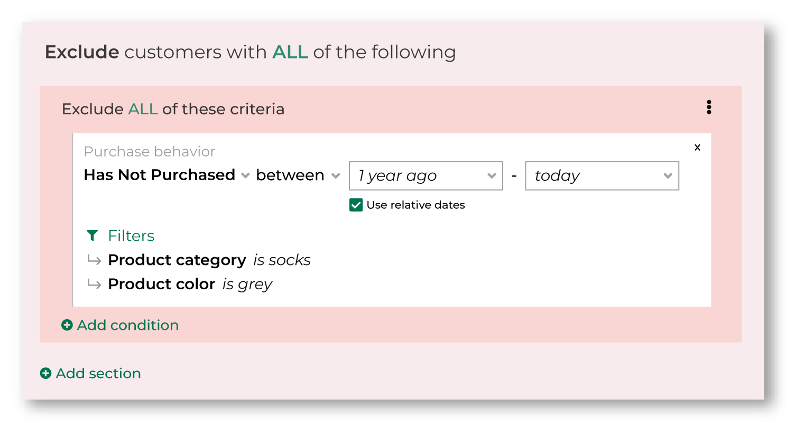
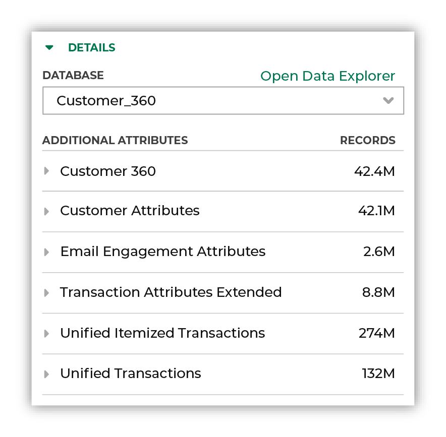

.. https://docs.amperity.com/reference/

.. meta::
    :description lang=en:
        Use the Segment Editor to define audiences for use with your brand's marketing campaigns.

.. meta::
    :content class=swiftype name=body data-type=text:
        Use the Segment Editor to define audiences for use with your brand's marketing campaigns.

.. meta::
    :content class=swiftype name=title data-type=string:
        About the Segment Editor

==================================================
About the Segment Editor
==================================================

.. include:: ../../shared/terms.rst
   :start-after: .. term-visual-segment-editor-start
   :end-before: .. term-visual-segment-editor-end

.. image:: ../../images/mockup-segments-tab-howitworks.png
   :width: 600 px
   :alt: The Segment Editor is located within the Segments page in Amperity.
   :align: left
   :class: no-scaled-link

.. _segments-editor-names:

Segment names
==================================================

.. segments-editor-names-start

A good segment name is clear and concise, is not longer than necessary, uses patterns to help lists of segments stay organized, and considers how it might be represented in downstream workflows, such as lists of segments in the **Campaigns** page in Amperity, but also external systems such as Braze, Facebook Ads, Google Ads, Klaviyo, and The Trade Desk.

.. segments-editor-names-end

.. segments-editor-names-important-start

.. important:: Users of downstream systems are often not the same set of users who configure and manage segments in Amperity.

   If you send a segment named "Untitled segment (43) - 2021-08-13-09-34-35" your downstream users might not know what to do with it.

   Be sure to follow good naming patterns to ensure that downstream users can always find your segments when they need them. Add details like “historical”, “daily”, or “test” as appropriate.

   Be sure to include the brand name and/or the region name if you have multiple brands or have multiple regions.

   Some examples:

   * “Birthdays_Under_40_CA”
   * “Birthdays_Under_40_NY”
   * “High_AOV_Active_Loyal”
   * “High_CLV_Historical”
   * “Acme_Daily_Churn”

   Prefix a segment that is located in a folder with that folder name as often as possible.

   For example, if you have folders named “Braze” and “TikTok” use segment names like “Braze_Birthdays_Under_40_CA” and “TikTok_Birthdays_Under_40” for all segments that exist within those folders.

   If your downstream systems will have data from non-Amperity systems, consider using Amperity as the first prefix: "Amperity_Birthdays_Under_40_CA".

   Use leading zeroes if a sequential numbering system is a prefix. For example: 0001, 0002, 0003, ...0100 is preferable to 1, 2, 3, ...100. This will help ensure that your segments are ordered sequentially in the Amperity **Segments** page *and* downstream systems.

.. segments-editor-names-important-end

.. _segments-editor-inclusions:

Inclusions
==================================================

.. segments-editor-inclusions-start

Inclusions define the set of conditions that determine which customers will belong to an audience. When a customer matches the criteria defined for an inclusion, that customer will be included in the audience.

.. image:: ../../images/mockup-segments-inclusions-double.png
   :width: 480 px
   :alt: SEATTLE, WA
   :align: left
   :class: no-scaled-link

.. segments-editor-inclusions-end

.. _segments-editor-exclusions:

Exclusions
==================================================

.. segments-editor-exclusions-start

Exclusions define conditions that determine which customers will not belong to an audience. When a customer matches the criteria defined for an exclusion, that customer will be excluded from the audience.

.. segments-editor-exclusions-end

.. _segments-editor-and-vs-or:

AND vs. OR
==================================================

.. TODO: We'll keep this intro for now, as-is.

.. segments-editor-and-vs-or-intro-start

AND and OR are used in SQL languages to specify how results should be filtered when more than one condition is present.

* Use AND to return a smaller list of customers. A customer must match all conditions to belong to the list.
* Use OR to return a larger list of customers. A customer may match any condition to belong to the list.

Amperity uses AND and OR to help you choose which type of behavior--larger audiences or smaller audiences--you want to use in your segment.

The AND and OR conditions may be set in two locations:

#. Within a group of attributes
#. Between groups of attributes

The default is AND. Use the slider to switch to OR.

.. segments-editor-and-vs-or-intro-end

.. TODO: Keep this as-is for now. Once the segments bubbles diagrams are ready, we'll a) update this file to align to that, and then link out to the longer series of examples and just pull one of the good ones into here.

.. segments-editor-and-vs-or-start

The following examples describe how AND and OR conditions work.

.. list-table::
   :widths: 10 90
   :header-rows: 0

   * - .. image:: ../../images/steps-01.png
          :width: 60 px
          :alt: Single attribute.
          :align: center
          :class: no-scaled-link

     - "I want to build an audience that returns customers who have an email address."

       .. image:: ../../images/segments-and-vs-or-howitworks-1.png
          :width: 600 px
          :alt: Return an audience that returns customers who have an email address.
          :align: left
          :class: no-scaled-link

       In this example, there is only one condition. The audience that is returned contains only customers who have an email address.

   * - .. image:: ../../images/steps-02.png
          :width: 60 px
          :alt: Two attributes, AND condition.
          :align: center
          :class: no-scaled-link

     - "I want to build an audience that returns customers who have an email address **AND** customers have opted in to receiving email messages from my brand."

       .. image:: ../../images/segments-and-vs-or-howitworks-2.png
          :width: 600 px
          :alt: Return an audience that returns customers who have an email address and who have opted in.
          :align: left
          :class: no-scaled-link

       In this example, the audience that is returned -- shown as the darker color -- is smaller because only a subset of customers for whom you have email addresses have opted in to receiving email messages from your brand.

   * - .. image:: ../../images/steps-03.png
          :width: 60 px
          :alt: Two attributes, OR condition.
          :align: center
          :class: no-scaled-link

     - "I want to build an audience that returns customers who have an email address **OR** customers who have phone number."

       .. image:: ../../images/segments-and-vs-or-howitworks-3.png
          :width: 600 px
          :alt: Return an audience that returns customers who have an email address or a phone number.
          :align: left
          :class: no-scaled-link

       In this example, your audience grows larger because both conditions are met: email address *or* phone number. This is shown as both colors and the total audience is the overlap of both conditions.

   * - .. image:: ../../images/steps-04.png
          :width: 60 px
          :alt: Two groups of attributes with OR conditions, AND in-between.
          :align: center
          :class: no-scaled-link

     - "I want to build an audience that returns a customer's email address **OR** a customer's phone number **AND** customers have opted in to receiving messages from my brand from to their email address **OR** phone number."

       This audience has two groups of attributes: email addresses **OR** phone numbers **AND** opt-in status for email addresses **OR** phone numbers.

       The first group of attributes -- email addresses *or* phone numbers, as shown in the darker color -- should make your audience larger. Few data sets have a perfectly matching set of email addresses and phone numbers across all customers.

       .. image:: ../../images/segments-and-vs-or-howitworks-3.png
          :width: 600 px
          :alt: Return an audience that returns customers who have an email address or a phone number.
          :align: left
          :class: no-scaled-link

       The second group of attributes -- opt-in status for email addresses *or* phone numbers, as shown in the lighter color -- should also be larger as a group than by themselves. You should expect the number of customers who have opted in to receive email or SMS communications to be smaller than the number of customers who have provided email addresses or phone numbers to your brand.

       These two groups are in-between an **AND** condition within your segment: email address *or* phone *and* opt-in status for email address *or* phone.

       .. image:: ../../images/segments-and-vs-or-howitworks-4.png
          :width: 600 px
          :alt: Return an audience that returns customers who have an email address or a phone number and who have opted in.
          :align: left
          :class: no-scaled-link

       Your audience then grows smaller because only a subset of customers for whom you have email addresses or phone numbers have opted in to receiving email or SMS messages from your brand. The smaller audience of opted-in customers for whom you have email addresses and phone numbers is shown by the darker color.

.. segments-editor-and-vs-or-end

.. _segments-editor-conditions:

Segment conditions
==================================================

.. segments-editor-conditions-start

You can add conditions to a segment by selecting them from a list. There are three types of conditions:

* :ref:`segments-editor-condition-attributes`
* :ref:`segments-editor-condition-customer-lists`
* :ref:`segments-editor-condition-purchase-behaviors`

.. segments-editor-conditions-end

.. _segments-editor-condition-attributes:

Attributes
--------------------------------------------------

.. segments-editor-condition-attributes-start

Attributes are selected from data tables that exist in your brand's customer 360 database.

.. segments-editor-condition-attributes-end

.. _segments-editor-condition-customer-lists:

Customer lists
--------------------------------------------------

.. segments-editor-customer-lists-start

Customer lists may be included or excluded. Customer lists can be any of the following: queries that have been made available to the **Segments** page, other segments that exist in your tenant, or lists of customers that have been uploaded to Amperity.

.. segments-editor-customer-lists-end

.. _segments-editor-condition-purchase-behaviors:

Purchase behaviors
--------------------------------------------------

.. segments-editor-condition-purchase-behaviors-start

Purchase behaviors are a feature of Amperity that are built on top of standard output for transactions. Purchase behaviors require standardized product catalog field names to be present in your standard output for transactions.

.. segments-editor-condition-purchase-behaviors-end

* :doc:`First purchase <attribute_purchase_behavior_first_purchase>`
* :doc:`Has not purchased <attribute_purchase_behavior_has_not_purchased>`
* :doc:`Has purchased <attribute_purchase_behavior_has_purchased>`
* :doc:`Most frequent order <attribute_purchase_behavior_most_frequent_order>`
* :doc:`Repeat purchase <attribute_purchase_behavior_repeat_purchase>`
* :doc:`Total value of orders <attribute_purchase_behavior_total_value_of_orders>`

.. _segments-editor-operators:

Operators
==================================================

.. segments-editor-operators-start

An operator defines how results from a column in a data source will be returned.

For example: From your customer 360 table, return all customer records that contain email addresses that are similar to "gmail.com". The data source is your customer 360 table, the attribute is the **email** field in that table, and the **is like** operator allows you to use "gmail.com" to look for values that contain "gmail.com", and then return a list of customers who have "gmail.com" in their email address.

In SQL, an operator is expressed using the **WHERE** clause. The following example returns a list of customers who have "gmail.com" in their email address:

::

   SELECT
     email
   FROM
     Customer360
   WHERE email LIKE "gmail.com"

In the **Segment Editor** you define operators using a series of picklists that do not require knowledge of SQL or how to define a **WHERE** clause:

.. image:: ../../images/mockup-segments-inclusions-double.png
   :width: 520 px
   :alt: Defining an operator using the Segment Editor.
   :align: left
   :class: no-scaled-link

.. segments-editor-operators-end

.. segments-editor-operators-list-start

The list of operators that are available to an attribute in the **Segment Editor** varies, with each list of operators depending on the attribute's data type:

* :ref:`segments-editor-operator-boolean`
* :ref:`segments-editor-operator-date`
* :ref:`segments-editor-operator-datetime`
* :ref:`segments-editor-operator-decimal`
* :ref:`segments-editor-operator-integer`
* :ref:`segments-editor-operator-string`

.. segments-editor-operators-list-end

.. segments-editor-operators-note-start

.. note:: This topic is a reference for all operators that are available to all attributes and is organized alphabetically by data type, and then by operator. This topic does not contain specific recommendations for specific attributes. Refer to the individual attribute reference pages to learn more about the set of operators that are available, including recommended operators and examples of using them.

.. segments-editor-operators-note-end

.. _segments-editor-operator-boolean:

Boolean
--------------------------------------------------

.. segments-editor-operator-boolean-start

A Boolean data type represents true and false outcomes, such as "Has this person purchased more than once?" The answer is "Yes" or "No."

.. segments-editor-operator-boolean-end

.. segments-editor-operator-boolean-list-start

The following operators are available to all attributes with the Boolean data type:

.. list-table::
   :widths: 300 300
   :header-rows: 1

   * - Operator
     - Description
   * - **is false**
     - **false** returns customer records that are "false".

   * - **is NULL**
     - **is NULL** returns customer records that do not have a value. A record that does not have a value cannot be "true" or "false".

   * - **is NOT NULL**
     - **is not NULL** returns customer records that have a value. A record that has a value is either "true" or "false".

   * - **is true**
     - **is true** returns customer records that are "true".

.. segments-editor-operator-boolean-list-end

.. _segments-editor-operator-date:

Date
--------------------------------------------------

.. segments-editor-operator-date-start

A Date data type represents a day, a month, and a year. For example: a birthdate.

A Date data type accepts ``YYYY-MM-DD``.

.. segments-editor-operator-date-end

.. segments-editor-operator-date-list-start

The following operators are available to all attributes with the Date data type:

.. list-table::
   :widths: 300 300
   :header-rows: 1

   * - Operator
     - Description
   * - **is**
     - **is** returns customer records with activity that matches the specified calendar date.

   * - **is after**
     - **is after** returns customer records with activity that occurred after the specified calendar date, not including the specified date.

   * - **is before**
     - **is before** returns customer records with activity that occurred before the specified calendar date, not including the specified date.

   * - **is between**
     - **is between** returns customer records with activity that is between the specified calendar dates, not including the specified dates.

   * - **is not**
     - **is not** returns customer records with activity that does not match the specified calendar date.

   * - **is not between**
     - **is not between** returns customer records with activity that is not between the specified calendar dates, not including the specified dates.

   * - **is not NULL**
     - **is not NULL** returns customer records that have a value.

   * - **is NULL**
     - **is NULL** returns customer records that do not have a value.

   * - **is on or after**
     - **is on or after** returns customer records with activity that occurred on or after the specified calendar date, including the specified date.

   * - **is on or before**
     - **is on or before** returns customer records with activity that occurred on or before the specified calendar date, including the specified date.

.. segments-editor-operator-date-list-end

.. _segments-editor-operator-datetime:

Datetime
--------------------------------------------------

.. segments-editor-operator-datetime-start

A Datetime data type represents a date and time combination. For example: a date and time at which a customer made a purchase.

A Datetime data type accepts "YYYY-MM-DD hh:mm:ss".

.. segments-editor-operator-datetime-end

.. segments-editor-operator-datetime-list-start

The following operators are available to all attributes with the Datetime data type:

.. list-table::
   :widths: 300 300
   :header-rows: 1

   * - Operator
     - Description
   * - **is**
     - **is** returns customer records with activity that matches the specified calendar date and time.

   * - **is after**
     - **is after** returns customer records with activity that occurred after the specified calendar date and time, not including the specified date and time.

   * - **is before**
     - **is before** returns customer records with activity that occurred before the specified calendar date and time, not including the specified date and time.

   * - **is between**
     - **is between** returns customer records with activity that is between the specified calendar dates and times, not including the specified dates and times.

   * - **is not**
     - **is not** returns customer records with activity that does not match the specified calendar date and time.

   * - **is not between**
     - **is not between** returns customer records with activity that is not between the specified calendar dates and times, not including the specified dates and times.

   * - **is not NULL**
     - **is not NULL** returns customer records that have a value.

   * - **is NULL**
     - **is NULL** returns customer records that do not have a value.

   * - **is on or after**
     - **is on or after** returns customer records with activity that occurred on or after the specified calendar date and time, including the specified date and time.

   * - **is on or before**
     - **is on or before** returns customer records with activity that occurred on or before the specified calendar date and time, including the specified date and time.

.. segments-editor-operator-datetime-list-end

.. _segments-editor-operator-decimal:

Decimal
--------------------------------------------------

.. segments-editor-operator-decimal-start

A Decimal data type represents amounts, percentages, and scores.

A Decimal data type accepts numeric values with a precision of 38 and a scale of 2. Precision is the number of digits that may be in the decimal value. Scale is the number of digits that may be to the right of the decimal point.

.. note:: Amperity defaults precision and scale for the Decimal data type to 38 and 0: DECIMAL(38,2). The default value for scale may be configured in the feed for each data source.

.. segments-editor-operator-decimal-end

.. segments-editor-operator-decimal-list-start

The following operators are available to all attributes with the Decimal data type:

.. list-table::
   :widths: 300 300
   :header-rows: 1

   * - Operator
     - Description
   * - **is**
     - **is** returns customer records with values that match the specified amount or percentage.

   * - **is between**
     - **is between** returns customer records with values that are between the specified amounts or percentages, not including the specified amounts or percentages.

   * - **is greater than**
     - **is greater than** returns customer records with values that are greater than the specified amount or percentage, not including the specified amount or percentage.

   * - **is greater than or equal to**
     - **is greater than or equal to** returns customer records with values that are greater than or equal to the specified amount or percentage, including the specified amount or percentage.

   * - **is in list**
     - **is in list** returns customer records with values that match the amounts or percentages that are specified in the list.

   * - **is less than**
     - **is less than** returns customer records with values that are less than the specified amount or percentage, not including the specified amount or percentage.

   * - **is less than or equal to**
     - **is less than or equal to** returns customer records with values that are less than or equal to the specified amount or percentage, including the specified amount or percentage.

   * - **is not**
     - **is not** returns customer records with values that do not match the specified amount or percentage.

   * - **is not between**
     - **is not between** returns customer records with values that are not between the specified amounts or percentages, not including the specified amounts or percentages.

   * - **is not in list**
     - **is not in list** returns customer records with values that do not match the amounts or percentages that are specified in the list.

   * - **is not NULL**
     - **is not NULL** returns customer records that have a value.

   * - **is NULL**
     - **is NULL** returns customer records that do not have a value.

.. segments-editor-operator-decimal-list-end

.. _segments-editor-operator-integer:

Integer
--------------------------------------------------

.. segments-editor-operator-integer-start

An Integer data type represents quantities, such as items ordered, frequency of purchase, number of orders, clicks, and page visits.

An Integer data type accepts numeric values with an implied scale of zero.

.. segments-editor-operator-integer-end

.. segments-editor-operator-integer-list-start

The following operators are available to all attributes with the Integer data type:

.. list-table::
   :widths: 300 300
   :header-rows: 1

   * - Operator
     - Description
   * - **is**
     - **is** returns customer records with values that match the specified quantity.

   * - **is between**
     - **is between** returns customer records with values that are between the specified quantities, not including the specified quantity.

   * - **is greater than**
     - **is greater than** returns customer records with values that are greater than the specified quantity, not including the specified quantity.

   * - **is greater than or equal to**
     - **is greater than or equal to** returns customer records with values that are greater than or equal to the specified quantity, including the specified quantity.

   * - **is in list**
     - **is in list** returns customer records with values that match the quantities that are specified in the list.

   * - **is less than**
     - **is less than** returns customer records with values that are less than the specified quantity, not including the specified quantity.

   * - **is less than or equal to**
     - **is less than or equal to** returns customer records with values that are less than or equal to the specified quantity, including the specified quantity.

   * - **is not**
     - **is not** returns customer records with values that do not match the specified quantity.

   * - **is not between**
     - **is not between** returns customer records with values that are not between the specified quantities, not including the specified quantity.

   * - **is not in list**
     - **is not in list** returns customer records with values that do not match the quantities that are specified in the list.

   * - **is not NULL**
     - **is not NULL** returns customer records that have a value.

   * - **is NULL**
     - **is NULL** returns customer records that do not have a value.

.. segments-editor-operator-integer-list-end

.. _segments-editor-operator-string:

String
--------------------------------------------------

.. segments-editor-operator-string-start

A String data type represents many things, such as identifiers, names of people, places, and products, and phone numbers.

A String data type accepts A-Z, a-Z, underscores, and hyphens.

.. segments-editor-operator-string-end

.. segments-editor-operator-string-list-start

The following operators are available to all attributes with the String data type:

.. list-table::
   :widths: 300 300
   :header-rows: 1

   * - Operator
     - Description
   * - **contains**
     - Returns customer records with values that match a string of characters.

   * - **does not contain**
     - Returns customer records with values that do not match a string of characters.

   * - **ends with**
     - Returns customer records with values that end with the specified characters.

   * - **is empty**
     - Returns customer records that do not have a value in this field.

   * - **is exactly**
     - Returns all customer records with values that match the specified characters.

   * - **is not empty**
     - Returns customer records that have a value in this field.

   * - **is not exactly**
     - Returns customer records that do not match the specified characters.

   * - **starts with**
     - Returns customer records that start with the specified characters.

.. segments-editor-operator-string-list-end

.. _segments-editor-operator-null-not-null:

NULL and NOT NULL values
--------------------------------------------------

.. segments-editor-null-not-null-start

A field with a **NULL** value is a field with a value that is empty. A **NULL** value is different than a value of zero, a blank value, or a value that contains only spaces. 

An attribute can only have a **NULL** value if it remained empty after the record was created. With **NULL**, you can insert a new record or update a record without adding a value to this field and the field will be saved with a NULL value.

A field with a **NOT NULL** value is a field with a value that is not empty. A value exists in the field, including values of zero, blank values, and value that contain only spaces.

**Examples**

For example, if you have 100 customers, 99 of which have provided a value for their phone number, even if some of those phone numbers are invalid phone numbers, 1 of which has not provided any value at all. The customer record that does not have a phone number is empty and is a **NULL** value.

Amperity returns 1 record when the "is NULL" operator is used and 99 records when the "is not NULL" operator is used, even if 2 of them contained spaces instead of numbers and 4 of them were "555-555-1234".

A practical example is a segment of 50 customers where the 'Opt in' field distinguishes customers based on their preferences for promotional emails. This field specifies that the customer has opted out of promotional emails but has consented to receive other types of messages. Here, 46 customers opted in, so the field has a value of **NOT NULL**.  In this segment 3 customers did not opt in. They also have **Not NULL** in this field. A customer didn’t respond, so the field has **NULL** for this customer.

.. segments-editor-null-not-null-end

.. _segments-editor-relative-dates:

Relative dates
==================================================

.. segments-editor-relative-dates-start

A relative date is determined at the time a segment is run, where **today** is the day on which the segment is run. For example: **yesterday**, **30 days ago**, **14 days ago**, or **1 year ago**. The list of relative date values includes a series of common ranges, but you may also type in a more specific range, such as **2 months ago** or **5 days ago**.

.. segments-editor-relative-dates-end

**Relative date values**

.. segments-editor-relative-date-values-start

.. list-table::
   :widths: 30 70
   :header-rows: 1

   * - Value
     - Description
   * - **Tomorrow**
     - Starts at 12:00:00 AM of the day after the current day.

       For example, if the current day is "Thursday 01 / 12 / 2023" then **tomorrow** is "Friday 01 / 13 / 2023".

   * - **Today**
     - Starts at 12:00:00 AM or at the current time on the current day and continues for 24 hours.

       For example, if the current day is "Thursday 01 / 12 / 2023" then **today** is "Thursday 01 / 12 / 2023".

   * - **Yesterday**
     - Starts at 12:00:00 AM of the day before the current day.

       For example, if the current day is "Thursday 01 / 12 / 2023" then **yesterday** is "Wednesday 01 / 11 / 2023".

   * - **N days ago**
     - Starts at 12:00:00 AM of the day N days before the current day.

       For example, if the current day is "Thursday 01 / 12 / 2023", then:

       * **7 days ago** is "Thursday 01 / 05 / 2023"
       * **14 days ago** is "Thursday 12 / 29 / 2022"
       * **30 days ago** is "Tuesday 12 / 13 / 2022"
       * **60 days ago** is "Sunday 11 / 13 / 2022"
       * **90 days ago** is "Friday 10 / 14 / 2022"

   * - **1 month ago**
     - Starts at 12:00:00 AM of the same day of the month that is 1 month before the current month.

       For example, if the current day is "Thursday 01 / 12 / 2023" then **1 month ago** is "Monday 12 / 12 / 2022".

   * - **1 year ago**
     - Starts at 12:00:00 AM of same day of the year that is 1 year before the current year.

       For example, if the current day is "Thursday 01 / 12 / 2023" then **1 year ago** is "Wednesday 01 / 12 / 2022".

.. tip:: You can compare segments by **% of Purchasers**, **% of Revenue**, or **Revenue/Purchaser** by changing the option in the **Compare by:** field.

.. segments-editor-relative-date-values-end

.. _segments-editor-insights:

Segment insights
==================================================

.. include:: ../../amperity_user/source/segments_reference.rst
   :start-after: .. segments-reference-segment-insights-start
   :end-before: .. segments-reference-segment-insights-end

.. segments-editor-insights-categories-start

Segment insights include the following categories:

* **Unique Customers** shows the number of unique customers who are in the segment, where a unique customer is represented by a unique Amperity ID.
* **1-year Active Customers** shows how many unique customers have made a purchase within the past year.
* **1-year Segment Revenue** shows the total revenue for all purchases made by active customers within the past year.
* **Reachable Customers** shows the number of unique customers who have at least one contactable email address, phone number, or physical mailing address.

.. segments-editor-insights-categories-end

.. segments-editor-insights-note-start

.. note:: Segment insights are available when your customer 360 database contains certain tables.

   * **Unique Customers**, **1-year Active Customers**, and **1-year Segment Revenue** require access to the **Transaction Attributes Extended** and **Customer 360** tables.
   * **Reachable Customers** requires access to the **Customer Attributes** table.

.. segments-editor-insights-note-end

.. _segments-editor-databases-and-tables:

Databases and tables
==================================================

.. segments-editor-databases-and-tables-start

You can use any database table that is available to the **Segments** page to build attribute groups. The tables are shown in the bottom right corner of the **Segment Editor**.

#. You may change the selected database by choosing another one from the dropdown menu.
#. The list of tables is refreshed to show the tables in that database.

.. important:: Tables must be configured to be available to the **Segments** page. This must be done by a member of your team who manages databases and tables from the **Customer 360** page.

.. segments-editor-databases-and-tables-end

.. _segments-editor-sql:

SQL Editor
==================================================

.. segments-editor-sql-start

The **Segment Editor** is an optional interface that allows you to build an attribute profile using Presto SQL. Start with a **SELECT** statement that returns the Amperity ID, and then apply a series of **WHERE** statements to define one or more attribute groups that match specific conditions and values.

.. segments-editor-sql-end

.. segments-editor-sql-requirements-start

The **Segment Editor** has the following requirements:

#. The *only* field that can be returned by the **SELECT** statement is **amperity_id**.
#. All conditions and values must be contained within a **WHERE** clause.
#. A **WHERE** clause must use one of the following conditions: **AND** or **OR**.

.. segments-editor-sql-requirements-end

**Example SQL segment**

.. segments-editor-sql-example-start

For example, a segment that uses the **OR** condition to return customers whose first name begins with "Mi", last name begins with "Smi", and who reside in California:

.. code-block:: sql
   :linenos:

   SELECT
     "amperity_id"
   FROM
      "Customer_360"
   WHERE
     (
       (LOWER("given_name") like '%mi%')
        OR LOWER("state") = 'ca'
        OR (LOWER("surname") like '%smi%')
     )

The following example is identical to the previous example, but shows each condition in its own **WHERE** clause, using **UNION ALL** between each clause to group the results together:

.. code-block:: sql
   :linenos:

   SELECT
     "amperity_id"
   FROM
      "Customer_360"
   WHERE
     (
       (
         "amperity_id" IN (
           SELECT
             "t0"."amperity_id"
           FROM
             "Customer_360" "t0"
           WHERE
             ((LOWER("t0"."given_name") like '%mi%'))
           UNION ALL
           SELECT
             "t1"."amperity_id"
           FROM
             "Customer_360" "t1"
           WHERE
             (LOWER("t1"."state") = 'ca')
           UNION ALL
           SELECT
             "t2"."amperity_id"
           FROM
             "Customer_360" "t2"
           WHERE
             ((LOWER("t2"."surname") like '%smi%'))
         )
       )
     )

.. segments-editor-sql-example-end
