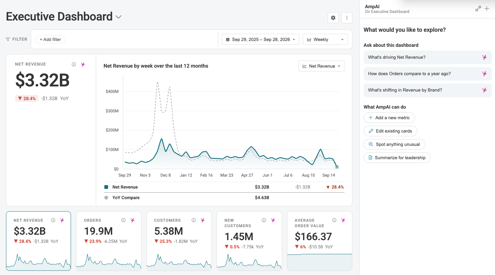
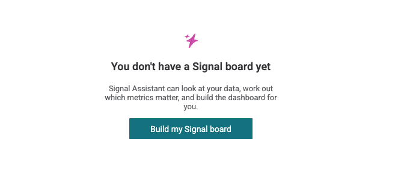
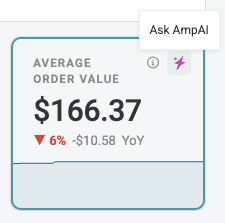
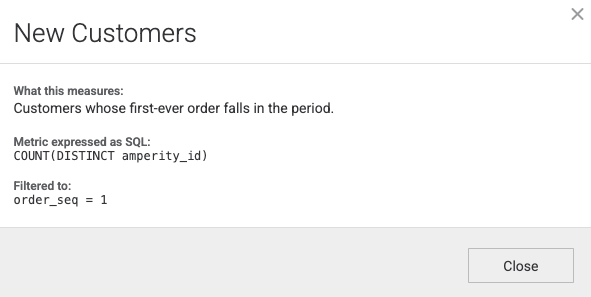

.. https://docs.amperity.com/reference/

.. meta::
    :description lang=en:
        Signal is Amperity's AI-built dashboarding surface. Boards of charts are built on the data already unified in your tenant, measured over a period you choose, and compared against the same span one year earlier.

.. meta::
    :content class=swiftype name=body data-type=text:
        Signal is Amperity's AI-built dashboarding surface. Boards of charts are built on the data already unified in your tenant, measured over a period you choose, and compared against the same span one year earlier.

.. meta::
    :content class=swiftype name=title data-type=string:
        About Signal

==================================================
About Signal
==================================================

.. signal-overview-start

**Signal** is the AI-powered dashboarding surface in Amperity. It uses your unified data foundation to visualize the KPIs driving your business, and lets you interact naturally with them to gather actionable insights.

With a conversational **AmpAI** interface beside the dashboard, **Signal** helps you understand both what happened and why without having to toggle to a separate query editor or a reporting tool.

.. signal-overview-end

.. _signal-key-concepts:

Key concepts
==================================================

.. signal-boards-and-cards-start

Boards and cards
--------------------------------------------------

A **board** is one view of the business: a set of related charts covering a single period of time. You land on your board when you open **Signal**. If you don't have one set up, you will be prompted to do so.

Your tenant can have several boards. One board usually covers the business overall, and others narrow to whatever you look at separately---a brand, a region, a channel, a loyalty program.

A **card** is one chart on a board. Each one answers a single question about your customers. It says what to measure and where to measure it, and Amperity works out the number each time you look. Change the period you are reading, and every card on the board answers again for that period.

Cards come in two shapes, and between them they cover the two things you usually want to know:

* **How big is the number, and which way is it going?** A card of this kind reports one number---revenue, orders, customers, average order value---and plots it across the designated time period, so you can see the level and the trend at once.
* **What is it made of, and what is shifting?** A card of this kind takes the same kind of number and splits it into bands: revenue by brand, orders by channel, customers by type. It shows which bands are largest, and separately which ones moved the most, so a small band gaining fast does not disappear behind a large one standing still.

Every card, of either kind, reports its time period against the same span one year earlier. That comparison is always there and is the same on every card, so a board can be read for what changed without setting a baseline first.

The cards on a board are ordered so the page reads top to bottom: the headline metric first, the metrics that support it beneath, and the breakdowns last. Everything on the page is measured over the same period and the same filters, so the numbers are directly comparable.

.. signal-boards-and-cards-end

.. signal-boards-switching-note-start

.. note:: Where your tenant has more than one board, the board title at the top of the page becomes a switcher listing all of them, and **Signal** shows one board at a time. Opening **Signal** without naming a board shows the **default board**, and any board can be set as the default.

.. signal-boards-switching-note-end

.. _signal-runs-via-ampai:

Runs via AmpAI chat
--------------------------------------------------

.. signal-runs-via-ampai-start

A **Signal** board is operated by conversation. An :doc:`AmpAI <ampai>` chat sits beside the board, and it is the best way to interact with the board. 

Ask it what a metric means, or why one moved, and it answers from that card's own definition and the numbers currently on screen. Ask it to add a card, remove one, retitle or reorder the cards, change what a card measures, or build a new board, and it writes those changes to the board and the page reloads itself.

You do not have to provide additional context when asking a question. The chat is already grounded in the board, its cards, the values on screen, and the filters you have applied, so a question about why a given metric is up or down knows what to look for.

A few things are handled in the user interface instead of the **AmpAI** chat: renaming a board, setting which board opens by default, duplicating or deleting one, and saving filters. Everything that changes what a board measures should be a request to **AmpAI**.
.. signal-runs-via-ampai-end

.. _signal-setup:

Setup
==================================================

.. signal-getting-a-board-start

Select **Signal** in the left navigation. A board opens with its own address, so a link to a board can be shared with anyone in your tenant.

.. signal-getting-a-board-end

.. signal-access-note-start

.. note:: If **Signal** is not available in your tenant, contact your **DataGrid Operator** to request access.

.. signal-access-note-end

.. _signal-prerequisites:

Prerequisites
--------------------------------------------------

.. signal-prerequisites-start

For **Signal** to show anything, three things must be in place:

* A :doc:`database <databases>` containing the table the cards query.
* Data loaded into that table. A table that reports no load date gives the board no window to measure, and every card on it reports that its window cannot be resolved.
* A board with at least one card on it. Until then, **Signal** shows an empty page offering to build one with **AmpAI**.

Setup is most direct on a tenant with Unified Transactions, because that is what **AmpAI** builds the analytics table from. A tenant without it can still use **Signal**, provided it has a transactional table with dates, but the card catalog **AmpAI** builds from is written for retail order data. On a tenant whose data describes tickets, stays, or other non-order events, **AmpAI** reports that gap rather than forcing the retail shape onto it.

.. signal-prerequisites-end

.. _signal-access-permissions:

Access and permissions
--------------------------------------------------

.. signal-access-permissions-start

What you can do in **Signal** depends on the actions your :doc:`policy <policies>` allows. **Signal** checks the following.

.. list-table::
   :widths: 55 45
   :header-rows: 1

   * - To do this
     - Signal checks for this action
   * - View the boards and cards in your tenant
     - ``segments:read``
   * - Load a card's numbers
     - ``queries:execute``
   * - Create, change, or delete a board or a card
     - ``queries:write``

Each of these comes from the policy assigned to you. To change what someone can do in **Signal**, change their policy or its options. See :doc:`Policies <policies>`.

**Signal** configuration is tenant-wide rather than scoped to a resource group, but running a card is additionally authorized against the resource group of the database that card queries. A user who can open a board may still be unable to load a card that reads a database they do not have access to.

.. signal-access-permissions-end

.. TODO: verify with the access model owner -- policies.rst has no Signal section, and its Allowed actions tables map named policies to UI capabilities ("Run query", "Edit query") without ever naming the action string behind a row, so nothing there says which policies grant segments:read, queries:execute, or queries:write. Confirm the mapping so this table can name policies alongside the actions, and open a fast-follow to add a Signal section to policies.rst. Also confirm whether the Restrict AmpAI access policy option disables the Signal chat -- the Signal page itself gates only on the feature flag, so this is unverified.

.. _signal-write-a-board:

Using AI to write a board
--------------------------------------------------

.. signal-build-a-board-start

Boards are built by **AmpAI**. You can start a build from the **Signal** page in Amperity, or from the Amperity MCP server---the same instructions drive both, so a board built one way is a board you can read and change the other way.

A build has two steps, and the first one only runs on a tenant that does not already have the analytics table.

**Setting up the table.** **AmpAI** checks for **UT_Analytics** and creates it, or adds the columns a card needs to an existing one. It asks you before it touches a table, because a table is used outside the dashboard, and it confirms the names of the database and the table with you first. It changes no other table. A new or repaired table has no rows until the database runs, so **AmpAI** also asks before running it and tells you that the run rebuilds every table in that database, not only this one. The fastest mode takes 5 to 15 minutes and continues after the chat turn ends. Reload the page when it finishes.

**Building the board.** **AmpAI** reads your data, proposes the metrics worth tracking, and writes the cards. A build runs over several turns and stops for your confirmation at each point that needs it.

Before it writes anything, **AmpAI** reads the :ref:`custom prompt <ampai-custom-prompt>` and the :ref:`company context <ampai-company-context>` documents set for your tenant, so that card titles and metric definitions follow your own business rules and vocabulary rather than generic defaults. Where your own definition of a metric differs from the default, yours wins.

.. signal-build-a-board-end

.. _signal-working-with-ampai:

Working with AmpAI
==================================================

.. signal-ampai-intro-start

**Signal** has an **AmpAI** chat docked beside the board. It is one ongoing conversation: pointing it at a card does not start a separate one.

.. signal-ampai-intro-end

.. _signal-ampai-investigate:

Investigating a card or a board
--------------------------------------------------

.. signal-ampai-investigate-start

Each card carries an **Ask AmpAI** control. Selecting it re-grounds the docked chat in that card: its compiled SQL, the values currently on screen, the filters currently applied, and---if you have dragged across a run of buckets on the trend chart---the range you highlighted. It loads a question into the input box for you to edit or send. It does not send one for you.

With no card selected, the chat is grounded in the board as a whole: its title, and every card's kind, position, title, table, and measure.

**AmpAI** answers by querying the table the card reads rather than speculating. 

When the conversation is empty, it offers a few questions to start from, and suggests follow-ups after each answer, drawn from what it just found.

.. signal-ampai-investigate-end

.. _signal-ampai-change:

Editing the board
--------------------------------------------------

.. signal-ampai-change-start

Ask **AmpAI** to add, remove, retitle, or reorder cards, to change what a card measures, or to point the board at a fiscal calendar, and it writes those changes to the board's configuration. The page reloads itself when the run ends.

Several safeguards sit around those writes:

* **It validates before it writes.** **AmpAI** checks a card against the table it will read, and reads a column's real values rather than guessing their spelling or case. If it cannot validate a card---the table is missing, or has no rows yet---it does not write the card, and tells you what blocked the check.
* **It confirms before it deletes.** Deleting a board deletes every card on it, so **AmpAI** lists those cards before it asks.
* **It confirms before it changes a table.** Table changes and database runs are separate confirmations from card changes, and **AmpAI** touches only the analytics table the dashboard reads.
* **Every change is versioned.** Boards and cards are recorded in your tenant's configuration history alongside your other configuration, as **Signal board**, **Signal metric viz**, and **Signal stacked bar viz**, and a change can be reverted there.

A card belongs to the board it was created on. To move one to another board, ask **AmpAI** to delete it and create it on the other board.

The user interface handles a smaller set of changes directly: renaming a board and its description, setting the chart scale and fiscal view, saving filters, setting the default board, and duplicating or deleting a board. Adding a card, removing one, or changing what one measures is a request to **AmpAI**.

.. signal-ampai-change-end

.. signal-ampai-feedback-start

.. tip:: When **Signal** cannot do something you need---a chart type, a granularity, or a control it does not offer---say so in the **Signal** chat. **AmpAI** can file the request with Amperity's product team on your behalf, after you confirm.

.. signal-ampai-feedback-end

.. _signal-how-data-is-grounded:

How data is grounded
==================================================

.. signal-card-definitions-start

Card definitions
--------------------------------------------------

Every card carries a definition control that shows how its number is calculated.

A card whose author wrote a description shows that description in plain language on hover, with a **View SQL** link beneath it. A card with no description opens straight to the SQL instead. Opening the definition shows a dialog titled with the card name, containing whichever of these parts apply:

* **What this measures**---the card's description, in the language of your business.
* **Metric expressed as SQL**---the aggregate the card measures.
* **Filtered to**---the rows the card restricts itself to, where it sets its own restriction.
* **SQL**---the statement Amperity compiled and ran for the values on screen.

That last part is the statement itself, not a description of one: the same period, granularity, and filters you are looking at, as they reached the query engine. A number that looks wrong can be checked by reading it, or run elsewhere to reproduce it.

.. signal-card-definitions-end

.. signal-card-definitions-note-start

.. note:: A card's description is written when the card is authored. A card that has none shows its raw aggregate in place of a plain-language explanation. When you ask **AmpAI** to change what a card measures, ask it to rewrite the description in the same change.

.. signal-card-definitions-note-end

.. signal-tenant-context-start

Your definitions, not generic ones
--------------------------------------------------

**AmpAI** reads the :ref:`custom prompt <ampai-custom-prompt>` and the :ref:`company context <ampai-company-context>` documents set for your tenant before it authors or changes a card. Where those define a metric, name something, or set a business rule, they take precedence over the defaults **AmpAI** would otherwise use. A board therefore reports your own definition of a metric under your own name for it, rather than a generic one that has to be translated every time someone reads it.

If **AmpAI** cannot read one of them, it says so in its reply and continues from the defaults, so you know when your own definitions were not applied.

.. signal-tenant-context-end

.. _signal-limitations:

Limitations
==================================================

.. signal-limitations-start

**How a board measures**

* The year-over-year comparison is fixed. It cannot be changed to another baseline.
* A period cannot be longer than a year.
* Windows are measured back from the date your data is loaded through, not from today.

**What it reads**

* **Signal** measures data already in Amperity. Bringing outside data in is a separate exercise.
* Every card on a board must read from the same database.
* The card catalog **AmpAI** builds from is written for retail order data. On a tenant whose data describes tickets, stays, or other non-order events, **AmpAI** reports that gap rather than forcing the retail shape onto it.

**Filtering**

* The filter bar offers columns on the table a card reads, not the Amperity attributes used elsewhere in the platform.
* An attribute is offered only when it is a text column with more than one and no more than 50 distinct values. Identifier columns are excluded, and numeric and date columns cannot be filtered.

.. signal-limitations-filter-scope-start

.. important:: Anyone who can open a board can drop the filters it carries and read it unfiltered. A board scoped to one brand or one region is a convenience for the people who read it, not a control over what they can see. 

.. signal-limitations-filter-scope-end

**Authoring**

* Adding a card, removing one, or changing what one measures is done by asking **AmpAI**.
* A card cannot be moved between boards. It must be re-created on the other board.
* The page does not passively refresh. **AmpAI** reloads the board after a change it made, but a change made from anywhere else is not visible until you reload the page or complete a change through the **AmpAI** chat.

.. signal-limitations-end

.. Parked material, 2026-09-29. Does not render. Kept as raw material for reuse:
   the former "Reading a board" section (period and granularity, filters, keeping a
   view) and the key concepts subsections moved out of the article. Promote a block
   back into the page by unindenting it, or delete this whole comment once it has
   been mined. The filter-scope admonition that was parked here has been
   reinstated under Limitations, so it is no longer in this block.

   .. _signal-reading-a-board:

   Reading a board
   ==================================================

   .. signal-period-and-grain-start

   Period and granularity
   --------------------------------------------------

   Period and granularity are viewer controls on the filter bar, not properties of a card. Changing either one re-measures every card on the board.

   The period control offers **Last 12 months**, **Last 90 days**, **Last 30 days**, and **Last 7 days**; **Year to date**, **Quarter to date**, **Month to date**, and **Week to date**; and a custom start and end date. The granularity control offers **Daily**, **Weekly**, and **Monthly**, or the fiscal granularities on a board read in fiscal view. A board opens on **Last 12 months** at **Weekly** until you change them.

   Your choices last for the session. They are not written to the board and they do not travel with a link.

   .. signal-period-and-grain-end

   .. TODO: add screenshot -- the filter bar, showing the period and granularity controls beside the filter pills.

   .. _signal-filters:

   Filters
   --------------------------------------------------

   .. signal-filters-start

   The filter bar holds one set of filters, and it opens with the filters the board was saved with. Filters the board carries are distinguished from the ones you add, but they behave the same way: you can edit either, and you can drop either. Selecting a value re-measures every card on the board at once.

   Add a filter from **+ Add filter**: choose an attribute, then choose its values. A filter matches with **is** or **is not** and can name several values, and several filters can be applied at once. **Reset** puts the bar back to the board's own filters.

   The attributes the picker offers are discovered from the table the filter bar reads, so they reflect your own data rather than a fixed list. An attribute is offered when it is a text column with more than one and no more than 50 distinct values. Identifier columns are never offered, because they are unique or near-unique per row: the Amperity ID and any column whose name ends in ``_id`` are excluded. Numeric and date columns are not offered. Column names are shown as labels, so ``purchase_brand`` reads as **Purchase brand**.

   .. signal-filters-end

   .. _signal-keeping-a-view:

   Keeping a view
   --------------------------------------------------

   .. signal-keeping-a-view-start

   Once the bar differs from what the board was saved with, **Save** and **Reset** appear. **Save** writes the filters on the bar to one of two places:

   * **This board.** Everyone who opens the board sees these filters on the bar from then on.
   * **A duplicate board.** Amperity copies the board and its cards, saves the filters on the copy, and gives you the copy at its own address. Name it, and share the address with whoever should read it.

   Everything else on the page is session state: the period, the granularity, the metric you promoted into the hero, and any range you highlighted on the trend chart. None of it is saved, and none of it travels with a link---someone who opens a board you sent them sees the board, not your view of it.

   .. signal-keeping-a-view-end

   .. TODO: add screenshot -- the Save filters dialog, showing the two destinations.

   .. _signal-card-is-a-measure:

   A card is a measure, not a saved result
   --------------------------------------------------

   .. signal-card-is-a-measure-start

   A card carries no numbers. It names the database and table it queries and declares the aggregate it measures, the dimension it breaks that total down by, and any rows it restricts itself to. Amperity builds and runs the statement that answers it.

   This is what makes the period and granularity controls work: move either one, or change the filters, and every card measures again from the table rather than reinterpreting a stored result. It is also why nothing in **Signal** needs to be refreshed on a schedule. A card is as current as the table it reads.

   .. signal-card-is-a-measure-end

   .. _signal-year-over-year:

   The year-over-year comparison
   --------------------------------------------------

   .. signal-year-over-year-start

   Every card measures two windows: the period on screen, and the same span one year earlier. The comparison is fixed. It cannot be pointed at another baseline, such as the preceding period or a plan number.

   Two consequences follow from it:

   * **A period cannot be longer than a year.** A longer window would overlap the year it is compared against and count the same rows twice, so the date picker does not offer a start more than a year before the end you pick.
   * **A band that exists in only one window is named, not zeroed.** On a stacked bar, a band that the earlier window has no value for reads as **New**, and one the current window has no value for reads as **Dropped**, rather than showing a rise or a fall from zero.

   At a fiscal granularity the comparison is the same position one fiscal year earlier.

   .. signal-year-over-year-end

   .. _signal-windows:

   Time windows follow your data, not the calendar
   --------------------------------------------------

   .. signal-windows-start

   Every range is measured back from the date the board's tables are loaded through, not from today. Where a board's cards read more than one table, the anchor is the earliest of those dates, so the window is one every card on the board can cover.

   This means the dates the period control shows are the dates the cards actually queried. A loading lag shifts the whole window back rather than emptying the shorter periods---a board over stale data measures a stale window, not an empty one. When the load date is behind today, the page shows **Data freshness: through** and that date.

   A bucket that the window only partly covers is marked **Partial period** on the trend chart, so a short leading or trailing bar is not read as a drop.

   .. signal-windows-end

   .. _signal-fiscal:

   Fiscal calendars
   --------------------------------------------------

   .. signal-fiscal-start

   A board can be measured on your own fiscal calendar instead of the ordinary one. Two things have to be true, and they are separate:

   * **The board names a fiscal calendar table.** This is set through **AmpAI**, either during a build or as a later change.
   * **The board is read in fiscal view.** Giving a board a calendar does not by itself put it on one. Fiscal view is a board setting, so everyone who opens the board reads it the same way.

   On a board that meets both, the granularity control offers **Fiscal weekly**, **Fiscal monthly**, and **Fiscal quarterly** in place of the calendar granularities, and the to-date periods are measured on that calendar. A fiscal granularity is offered only where the calendar names the column that divides it, so a calendar that does not describe its own quarters offers no fiscal quarter.

   .. signal-fiscal-end

   .. _signal-what-data:

   What data Signal reads
   --------------------------------------------------

   .. signal-what-data-start

   A card reads one table in one of your Amperity databases. **Signal** measures data that is already in Amperity; nothing is imported for it.

   Two rules hold a board together, and Amperity refuses a card that would break either rather than letting the board fail later:

   * Every card on a board must name the same database.
   * Every card reading the same table must measure over the same date column.

   In practice the table a card reads is **UT_Analytics**, an order-grain analytics table built on your Unified Transactions. **AmpAI** creates it during setup if your tenant does not have it. It exists so that the dashboard's cards do not query raw transactions directly, and it is deliberately not the same thing:

   * It applies exclusions---outliers, employees, test accounts---that the tables beneath it do not. A card's number and the same aggregate run against **Unified_Transactions** can therefore disagree, and the card's is the one the dashboard means.
   * It keeps anonymous orders rather than dropping them, and flags which rows are identified. Revenue, orders, and units count every order. Counting customers counts identified customers only, so a customer count and a revenue total on the same board are measured over different row sets by design.
   * It carries per-customer columns such as order sequence and first order date, computed over identified rows only, which is what lets a card measure new customers or repeat behavior without a subquery.

   .. signal-what-data-end

   .. --- moved out of Key concepts 2026-09-29: the former "Boards and cards" section, replaced
      by a conceptual overview. Retained for its layout mechanics and the card-types table. ---

   .. signal-boards-and-cards-start

   Boards and cards
   --------------------------------------------------

   A **board** is one tab in **Signal**: a title, an optional line of description, and its cards. A **card** is one chart on a board.

   A tenant can have more than one board. When it does, the board title at the top of the page becomes a switcher, and **Signal** renders one board at a time. The **default board** is the one **Signal** opens when no board is named in the address, or when the address names a board your tenant does not have.

   A board's layout follows the order of its cards rather than a grid you arrange:

   * The **first metric card** is the hero: a headline value and its year-over-year change, above a trend chart.
   * The **remaining metric cards** are stat tiles in a row beneath it, in order. Each shows its value, its year-over-year change, and a sparkline.
   * **Stacked-bar cards** render at the bottom of the page, in order.

   You can promote any stat tile into the hero for the rest of your session. The tile stays where it is and the board's own configuration is unchanged.

   .. signal-boards-and-cards-end

   .. signal-card-types-table-start

   There are two kinds of card.

   .. list-table::
      :widths: 25 75
      :header-rows: 1

      * - Card
        - What it shows
      * - Metric
        - One aggregate---revenue, orders, customers, average order value---as a single value with its change against the same span one year earlier. As the hero it also draws a trend chart across the period. As a stat tile it draws a sparkline.
      * - Stacked bar
        - One aggregate broken into bands by a dimension, such as revenue by brand or revenue by channel. It reads two ways: **Share**, which ranks bands by size, and **Change**, which ranks them by how far they moved. The card draws its five largest bands, gathers null, empty, and whitespace values into a band named **None**, and folds the rest into **Other**. **View all** lists every band it measured, sortable by value, share, or change.

   .. signal-card-types-table-end
