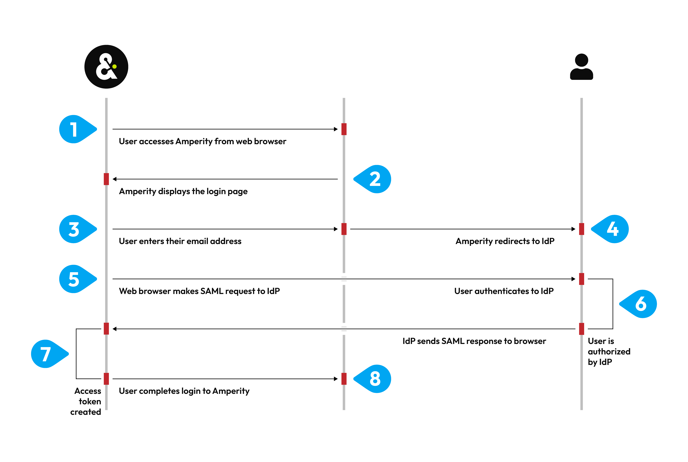

.. https://docs.amperity.com/reference/

.. meta::
    :description lang=en:
        Use single sign-on (SSO) to manage how users in your organization access Amperity.

.. meta::
    :content class=swiftype name=body data-type=text:
        Use single sign-on (SSO) to manage how users in your organization access Amperity.

.. meta::
    :content class=swiftype name=title data-type=string:
        About single sign-on (SSO)

==================================================
About single sign-on (SSO)
==================================================

.. sso-about-start

Amperity supports the use of single sign-on (SSO) to manage the users who can access your tenant. The benefits of using SSO include:

#. A better experience for your users who authenticate to your identity provider (IdP) with a familiar ID and password, after which they are authorized to access Amperity.

#. Using any IdP that supports Security Assertion Markup Language (SAML), an open standard for exchanging authentication and authorization data between a service provider and an IdP. For example: Azure Active Directory, Auth0, Google G-suite, Okta, OneLogin, and `Ping Identity <https://docs.pingidentity.com/>`__ |ext_link|.

#. Simplified user management. Define groups in your IdP, and then map those groups to user policies in Amperity. Manage user access to Amperity by adding users to or removing users from these groups.

.. sso-about-end

.. settings-users-add-sso-start

.. TODO: Same as in /amperity_reference/sources/settings.rst, but without a link.

.. admonition:: Can users be added when single sign-on (SSO) is enabled?

   Yes. You may configure Amperity to :ref:`allow access to individual users <settings-users-add>` as long as the domain name in that user's email address is different from the domain name used by your SSO provider.

.. settings-users-add-sso-end

.. _sso-howitworks:

How SSO works (with Amperity)
==================================================

.. sso-howitworks-start

The following diagram steps through how SSO works with Amperity. This example uses Auth0 as the IdP. Each supported IdP follows the same workflow. 

.. sso-howitworks-end

.. sso-howitworks-context-start

#. A user accesses Amperity--``https://app.amperity.com``--from a supported web browser.
#. Amperity displays the login page.
#. The user enters their email address, Amperity identifies your tenant, after which Amperity redirects to the sign-in URL of your IdP.

   Amperity uses the domain in the email address to which IdP the login is redirected. For example, Amperity uses Auth0. Any user with an ``amperity.com`` email address is redirected to Auth0 for authentication and authorization.

#. The web browser makes a SAML assertion to the IdP that is scoped to Amperity.
#. The user authenticates to the IdP, if required. This may require additional steps, such as completing two-factor authentication.
#. The IdP verifies the user, looks up the set of claims that are configured to be sent to Amperity, and then packages those claims into a SAML response.
#. The IdP sends the SAML response to the web browser, which authorizes that user access to Amperity, after which the browser redirects that response to Amperity.
#. Amperity converts the claims into the set of granted user policies. Those policies, along with the user's name and email address, are packaged into a signed token that completes access to Amperity for that user.

.. sso-howitworks-context-end

.. _sso-use-cases:

Use cases
==================================================

.. sso-use-cases-start

The following use cases can be managed directly from your IdP after SSO is enabled for your tenant:

**A user joins your organization**
   When a user joins your organization you should add them to the groups in your IdP that are configured for Amperity, after which that user can log in to Amperity using their email address.

**A user leaves your organization**
   When a user leaves your organization you should disable them or remove them from the groups in your IdP that are configured for Amperity, after which any attempt by that user to access Amperity fails during login.

   .. note:: Failed login attempts are recorded in Amperity application audit logs.

**A user changes roles and should no longer have access to Amperity**
   When a user changes roles within your organization you should remove them from the groups in your IdP that are configured for Amperity, after which any attempt by that user to access Amperity fails during login and they is shown a message stating that they no longer have access to Amperity.

.. sso-use-cases-end

.. _sso-request-to-enable:

Request to enable
==================================================

.. sso-request-to-enable-start

Amperity recommends enabling SSO for your tenant. The process for enabling SSO requires some initial setup and follows this series of steps:

#. :ref:`Exchange metadata between Amperity and your IdP <sso-exchange-metadata>`
#. :ref:`Map groups in your IdP to policies in Amperity <sso-map-groups-to-policies>`
#. :ref:`Validate configuration for SSO <sso-validate-config>`

.. sso-request-to-enable-end

.. sso-request-to-enable-context-start

To enable SSO for your tenant, make a request through your Amperity support representative. The process for configuring SSO requires some participation from members of your team, such as someone from security, support, and IT operations, depending on how your IdP is managed within your organization.

.. important:: This process requires ongoing communication between members of your organization and the Amperity Support team.

.. sso-request-to-enable-context-end

.. _sso-exchange-metadata:

Exchange of metadata
--------------------------------------------------

.. sso-exchange-metadata-start

A series of back-and-forth steps, also referred to as an "exchange of metadata", is required to configure the service provider (Amperity) and the IdP for the correct settings that enable SSO for your tenant:

#. :ref:`Send URL of IdP metadata <sso-exchange-idp-metadata>`
#. :ref:`Send URL of Amperity metadata <sso-exchange-amperity-metadata>`
#. :ref:`Configure claim keys <sso-exchange-claim-keys>`
#. :ref:`Send domain names and claim keys to Amperity <sso-exchange-domains-and-claim-keys>`
#. :ref:`Establish trust <sso-exchange-establish-trust>`

.. sso-exchange-metadata-end

.. _sso-exchange-idp-metadata:

Send URL of IdP metadata
++++++++++++++++++++++++++++++++++++++++++++++++++

.. sso-exchange-idp-metadata-start

Send the URL of your IdP metadata to Amperity support. The Amperity support team will pull the following configuration details:

* The sign-in URL to which Amperity will redirect a user for authentication.
* The sign-out URL to which Amperity will redirect a user who signs out.
* The public X509 key that allows signed SAML responses.

The Amperity Support team will configure these details within your Amperity tenant.

.. sso-exchange-idp-metadata-end

.. _sso-exchange-amperity-metadata:

Send URL of Amperity metadata
++++++++++++++++++++++++++++++++++++++++++++++++++

.. sso-exchange-amperity-metadata-start

After your Amperity Support team has configured the metadata for your IdP they sends to you the URL of Amperity service provider metadata.

.. important:: The specific configuration details for your IdP may vary.

The most common configuration details for this step include:

* The entity ID for the service provider.
* The URL of the Assertion Consumer Service (ACS).
* The X509 signing key

Work with the Amperity Support team to identify additional configuration details, if necessary.

.. sso-exchange-amperity-metadata-end

.. _sso-exchange-claim-keys:

Configure claim keys
++++++++++++++++++++++++++++++++++++++++++++++++++

.. include:: ../../shared/terms.rst
   :start-after: .. term-claim-start
   :end-before: .. term-claim-end

.. sso-exchange-claim-keys-start

The following claim keys must be configured in your IdP:

**A user's display name**
   The name to be displayed in Amperity. Amperity does not have a specific requirement for this claim key.

   The most common claim key is "firstname" + "lastname".

**A user's first name**
   The user's first name. This claim key **must contain only** the user's first name.

**A user's last name**
   The user's last name. This claim key **must contain only** the user's last name.

**A user's email address**
   The email address that is used to log into Amperity and to your IdP. Amperity does not have a specific requirement for this claim key.

   The most common claim key is "emailaddress".

**An assigned security group**
   The name of the groups to which a user belongs. Each group in your IdP is mapped to a policy in Amperity. This will control what access the user has in Amperity through the security group assignment. Amperity recommends filtering the groups sent to Amperity to Amperity-specific groups.

   The most common claim key is "groups".

.. sso-exchange-claim-keys-end

.. _sso-exchange-domains-and-claim-keys:

Domain names and claim keys
++++++++++++++++++++++++++++++++++++++++++++++++++

.. sso-exchange-domains-and-claim-keys-start

After claim keys are configured in your IdP, the domain names that is used to identify when to redirect users to your IdP, along with the claim keys, must be provided to Amperity.

#. The set of domain names to be associated with your tenant. This is often a single domain name, such as ``acme.com``, but may be more than one. For example: ``acme.com`` and ``consultant.acme.com`` could be associated to your tenant.

   .. important:: Common domain names for email services, such as ``gmail.com`` or ``hotmail.com``, cannot be used to configure single sign-on for Amperity.

#. The specific claim keys that were configured in your IdP. 

Your Amperity Support team will configure Amperity for your domain names and claim keys.

.. sso-exchange-domains-and-claim-keys-end

.. _sso-exchange-establish-trust:

Establish trust
++++++++++++++++++++++++++++++++++++++++++++++++++

.. sso-exchange-establish-trust-start

Use a customer email address to establish trust between Amperity and your IdP. Visit ``https://app.amperity.com`` and complete the login process. If the login is successful you are ready to start adding users to groups in your IdP and mapping them to policies in Amperity.

.. sso-exchange-establish-trust-end

.. _sso-map-groups-to-policies:

Map groups to policies
--------------------------------------------------

.. sso-map-groups-to-policies-start

You should map groups in your IdP to policies in Amperity. This mapping is typically done for a combination of policies, skill sets, and expected workflows.

.. sso-map-groups-to-policies-end

.. sso-map-groups-to-policies-list-start

Review the following sections to learn more about each policy:

* :ref:`Amp360 User <policies-amp360-user>`
* :ref:`AmpIQ User <policies-ampiq-user>`
* :ref:`DataGrid Operator <policies-datagrid-operator>`
* :ref:`DataGrid Administrator <policies-datagrid-administrator>`

.. sso-map-groups-to-policies-list-end

.. sso-map-groups-to-policies-context-start

Add groups to your IdP that map to each of the policies in Amperity that you plan to use, and then add users to each group. Discuss with your Amperity Support representative if you have questions about mapping groups to policies.

.. tip:: Use Amperity-specific prefixes for the group names in your IdP, such as **Amperity_Operators** or **Amperity_Users** to help identify the mapping.

Provide the names of these groups to your Amperity Support team, after they will enter the names of these groups into Amperity to complete the mapping of groups to policies.

.. sso-map-groups-to-policies-context-end

.. _sso-validate-config:

Validate SSO configuration
--------------------------------------------------

.. sso-validate-config-start

The last step in the process for enabling SSO for your tenant is to verity that users from your organization can access Amperity.

This is most often done during a scheduled 30-minute meeting with your Amperity Support team, during which the configuration is tested and validated. You should plan to test at least one user for each group in your IdP that is mapped to a policy in Amperity.

At the end of this meeting your organization can decide if additional configuration and validation is necessary or can determine the date at which SSO is enabled for your tenant.

.. sso-validate-config-end
