.. https://docs.amperity.com/reference/

:orphan:

.. meta::
    :description lang=en:
        Learn how Stitch discovers the hidden connections in your customer profiles that identify unique individuals.

.. meta::
    :content class=swiftype name=body data-type=text:
        Learn how Stitch discovers the hidden connections in your customer profiles that identify unique individuals.

.. meta::
    :content class=swiftype name=title data-type=string:
        How identity resolution works

==================================================
How identity resolution works
==================================================

.. term-identity-resolution-start

Identity resolution is the process of connecting and matching data points that exist in many sources to build a unified view of a single customer.

.. term-identity-resolution-end

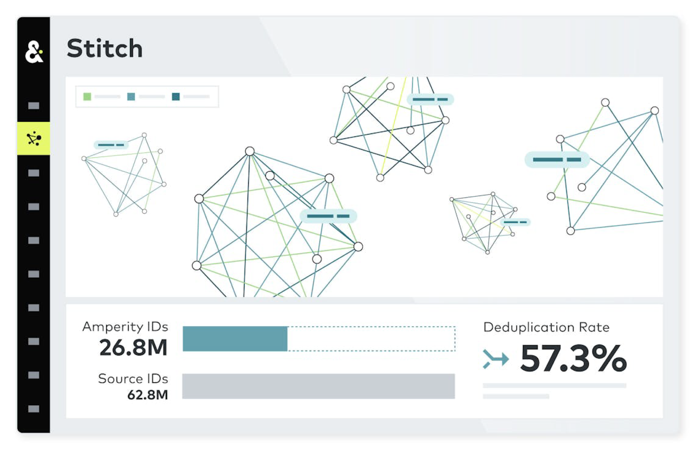

.. stitch-overview-context-start

Identity resolution is a complex customer data challenge that turns fragmented and siloed data sources into a collection of contextual customer profiles in an identity graph that changes and adapts over time as new information is discovered.

* Apply semantic tags to identify personally identifiable information (PII) and important anchors within source data. 
* Build a series of rules that define when records should match or should not match. 
* Apply AI modeling, also known as Stitch, to combine deterministic confidence with probabilistic discovery to build an identity graph. The identity graph then forms the basis for creating customer profiles that power a range of marketing and analytics use cases.

.. stitch-overview-context-end

.. _stitch-about:

About Stitch
==================================================

.. term-stitch-start

Stitch uses patented algorithms to process massive volumes of data and discover the hidden connections in your customer profiles that identify unique individuals. Stitch analyzes customer data, applies the rules you define, and then builds an identity graph with accurate and actionable customer profiles. Each customer profile is assigned an Amperity ID.

.. term-stitch-end

.. term-stitch-summary-tab-start

The **Summary** tab on the **Stitch** page shows the results of identity resolution and how it adapts and changes over time.

.. term-stitch-summary-tab-end

.. image:: ../../images/mockup-stitch-summary-tab.png
   :width: 500 px
   :alt: The Summary tab for identity resolution
   :align: left
   :class: no-scaled-link

.. TODO: These following 3 sections are commented out. They may make it if it makes sense to talk about what the previous How Stitch works doc talked about in greater detail, but here in a more paraphrased, skip past the parts people focus in on. Probably a yeet candidate.

.. 
.. Data preparation
.. --------------------------------------------------
.. 
.. Semantic tagging
.. Preprocessing
.. Union of tables
.. 
.. Matching
.. --------------------------------------------------
.. 
.. Blocking
.. Pairwise comparison and rules
.. Clustering
.. 
.. Data asset generation
.. --------------------------------------------------
.. 
.. Merge rules
.. Build customer profiles and assign Amperity IDs
.. Standardize outputs
.. 

.. _stitch-whatis-identity-graph:

What is an identity graph?
==================================================

.. term-identity-graph-start

An identity graph is the foundation for unified customer profiles. Each customer profile represents a unique customer. Stitch creates a customer profile by connecting records using a combination of matching techniques: deterministic (exact), probabilistic (approximate), and transitive (derived from other confident matches). A keychain of identifiers links records in each profile back to source data.

.. term-identity-graph-end

.. stitch-summary-tab-matching-strategies-context-start

An identity graph is built by comparing records, such as those with personally identifiable information (PII), transaction histories, shopping preferences, and loyalty account information, then finding matches among these records and clustering them into individual customer profiles. Each customer profile in an identity graph is assigned an Amperity ID.

Each identity graph is created from a combination of deterministic and probabilistic matching rules that define conditions for when records should be clustered together or separated out. The **Rules Editor** defines a hierarchy of deterministic and probabilistic matching strategies for each identity graph. Identity resolution attempts to match on a rule starting at the top of the list of rules in the rules hierarchy. The first rule that applies is given a score.

Matching strategies use confident matches and confident conflicts to identify which records belong to the same customer profile. For example, a confident match would be a case where both records have the same data, like an identical email address, while a confident conflict may be two records with the same phone number but different first and last names. From a starting point of hundreds of millions of records and billions of possible connections, an identity graph connects records that identify unique customer profiles.

.. stitch-summary-tab-matching-strategies-context-end

.. stitch-whatis-identity-graph-diagram-unconnected-start

An identity graph starts with many possible connections between records.

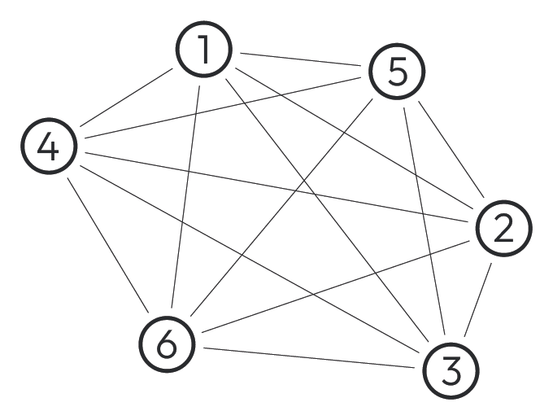

.. stitch-whatis-identity-graph-diagram-unconnected-end

.. stitch-whatis-identity-graph-diagram-connected-start

After identity resolution each cluster is a set of connected records. For example, the following diagram shows a cluster of six connected records that form a unique customer profile. Records 1 and 6 and records 1 and 3 matched confidently on cluster rules for loyalty account identifiers. 6 and 5 matched confidently on email addresses. 3 and 5, 3 and 6, and 5 and 1 matched transitively, because each pair shares a strong match to another record. 2 and 4 have no match and so are separated out of the cluster.

.. image:: ../../images/howitworks-identity-graph-overview-connected.png
   :width: 500 px
   :alt: An individual customer profile within an identity graph
   :align: left
   :class: no-scaled-link

.. stitch-whatis-identity-graph-diagram-connected-end

.. _stitch-data-changes-graphs-adapt:

Data changes, graphs adapt
==================================================

.. stitch-data-changes-graphs-adapt-start

Adaptive identity is the process of building an identity graph that adapts as source data changes over time to maintain an accurate foundation of customer profiles and keychains.

An identity graph adapts as source data changes over time. For example:

* Personally identifiable information (PII) is updated
* New data sources are made available
* A rule is added for a new foreign key
* Customers provide additional points of contact
* Loyalty account data changes
* Customers have more interations with your brand

Stitch rebuilds the identity graph each time it runs by comparing the defined set of rules to all record pairs in the current collection of source data.

This creates opportunities for finding more confident matches, more confident conflicts, and discovering new transitive connections between records.

.. stitch-data-changes-graphs-adapt-end

.. stitch-data-changes-graphs-adapt-summary-start

.. TODO: Link to the /reference/stitch_summary.rst section for the Summary tab in the following paragraph.

Amperity tracks changes to identity graphs from the **Summary** tab on the **Stitch** page. Changes, such as **Added**, **Deleted**, **Merged**, **Recognized**, and **Split**, are tracked for an identity graph over a 90-day time period.

.. stitch-data-changes-graphs-adapt-summary-start

.. image:: ../../images/mockup-stitch-identity-changes.png
   :width: 500 px
   :alt: Identity changes over time
   :align: left
   :class: no-scaled-link

.. stitch-summary-tab-identity-changes-table-start

.. term-record-pair-start

Identity resolution analyzes source tables, extracts customer profiles and interactions, and then compares pairs of records using machine learning models to build an identity graph. Each record pair is scored and then all records that were connected using deterministic, probabilistic, or transitive matches represent a unique customer profile.

.. term-record-pair-end

.. image:: ../../images/mockup-stitch-identity-changes-hover.png
   :width: 500 px
   :alt: Hover over the graph to view detailed identity changes over time
   :align: left
   :class: no-scaled-link

.. stitch-summary-tab-identity-changes-unchanged-start

.. admonition:: Identity changes are a very small percentage of total customer profiles.

   Enable the **Include unchanged** slider on the right side below the chart to view unchanged customer profiles. Unchanged customer profiles are shown in grey.

   .. image:: ../../images/mockup-stitch-identity-changes-hover-unchanged.png
      :width: 500 px
      :alt: Hover over the graph to view unchanged identities over time
      :align: left
      :class: no-scaled-link

.. stitch-summary-tab-identity-changes-unchanged-end

.. stitch-data-changes-graphs-adapt-unwanted-start

.. TODO: Maybe not the right spot. But these are reasons that cause jitter, which is bad. We should say something about that.

.. admonition:: Not all changes are good changes

   Some changes to source data can be unhelpful to an identity graph. For example:

   * An upstream operational issue that removes data from a data source or removes an entire data source
   * A privacy rights workflow that fails to redact all personally identifiable information (PII) from upstream data sources after a customer's request to delete records or PII
   * A workflow that exceeds the expected runtime and fails to load all records. Missing records can show as deletions, which will affect clusters of records within an identity graph
   * Rules are changed in a way that reorders how records are clustered when foreign keys match

   These situations can create a noisy identity graph or create clusters within an identity graph that normally would not cluster.

.. stitch-data-changes-graphs-adapt-unwanted-end

.. _stitch-example-matching-strategies:

Matching strategies
==================================================

.. stitch-example-matching-strategies-start

There are three types of matching strategies:

* :ref:`Deterministic matches <stitch-example-matching-strategy-deterministic>`
* :ref:`Probabilistic matches <stitch-example-matching-strategy-probabilistic>`
* :ref:`Transitive matches <stitch-example-matching-strategy-transitive>`

.. stitch-example-matching-strategies-end

.. stitch-summary-tab-matching-strategies-percentages-context-start

.. TODO: Possible diagram for this spot. It's different from the others.

Identity graphs can be configured to be more deterministic or less deterministic. Most often an identity graph uses a combination of deterministic and probabilistic rules for identity resolution. In addition to deterministic matching and probabilistic matching, identity resolution discovers transitive connections that lead to more accurate and more complete customer profiles.

.. stitch-summary-tab-matching-strategies-percentages-context-end

.. stitch-summary-tab-matching-strategies-percentages-start

The **Summary** tab, under **Matching strategies**, shows the percentage of total profiles in the identity graph that were discovered using deterministic, probabilistic, and transitive matching.

.. stitch-summary-tab-matching-strategies-percentages-end

.. stitch-summary-tab-matching-strategies-tries-start

.. admonition:: Why does Amperity "try" to match records?

   Amperity does not force a record to be assigned to an identity.

   Amperity uses deterministic and probabilistic matching strategies to define conditions that determine when records should or should not match. All record pairs are scored. The scores represent the strength or weakness of the relationship between two records.

   * Exact matches are assigned minimum or maximum scores.
   * Fuzzy matches are assigned similarity scores.

   It may not be possible to satisfy all of the rules-based scoring conditions:

   * Default scoring model may assign a score
   * A transitive connection may be discovered
   * Edge analysis identifies records that should or should not cluster together

   For example, it is possible for a customer profile within an identity graph to have more than one email address because *other records* within the customer profile scored high enough to match *or* additional email addresses were discovered transitively.

.. stitch-summary-tab-matching-strategies-tries-end

.. _stitch-example-matching-strategy-deterministic:

Deterministic matches
--------------------------------------------------

.. term-deterministic-connection-start

Deterministic record matching uses rules that define exact matching for customer keys and semantic tags.

.. term-deterministic-connection-end

.. stitch-example-matching-strategy-deterministic-start

Deterministic matching strategies try to cluster records together when conditions are met. For example, a deterministic strategy for loyalty IDs tries to match records with the same loyalty ID.

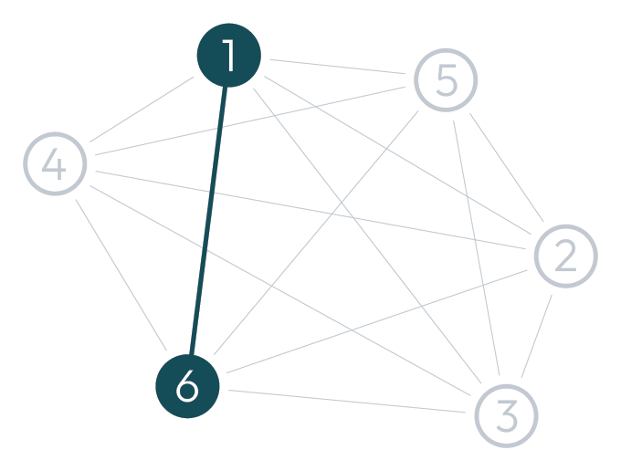

.. stitch-example-matching-strategy-deterministic-end

.. _stitch-example-matching-strategy-probabilistic:

Probabilistic matches
--------------------------------------------------

.. term-probabilistic-connection-start

Probabilistic record matching uses rules that define approximate matching for customer keys and semantic tags to score approximate similarity between records. Records that approximately match are evaluated by Stitch and scored.

.. term-probabilistic-connection-end

.. stitch-example-matching-strategy-probabilistic-start

Probabilistic matching strategies can lead to clustering or separation when conditions are met. For example, a separation rule for "values significantly differ" on email addresses tries to separate records when email addresses do not have approximate similarity.

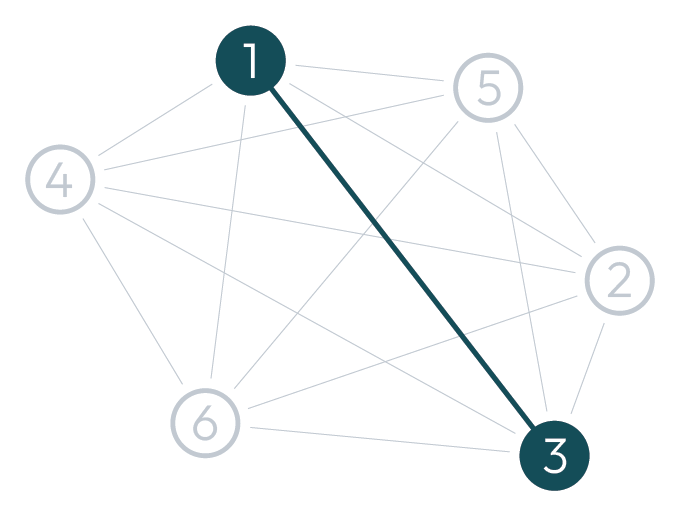

.. stitch-example-matching-strategy-probabilistic-end

.. _stitch-example-matching-strategy-transitive:

Transitive matches
--------------------------------------------------

.. term-transitive-connection-start

A transitive connection exists when any two records share a strong match to an intermediate record, but do not have a strong match to each other. For example: record one matches record two, record three matches record two, and records one and three do not match. A transitive connection exists between records one and three because both records match record two.

.. term-transitive-connection-end

.. stitch-example-matching-strategy-transitive-start

Transitive connections are discovered during identity resolution.

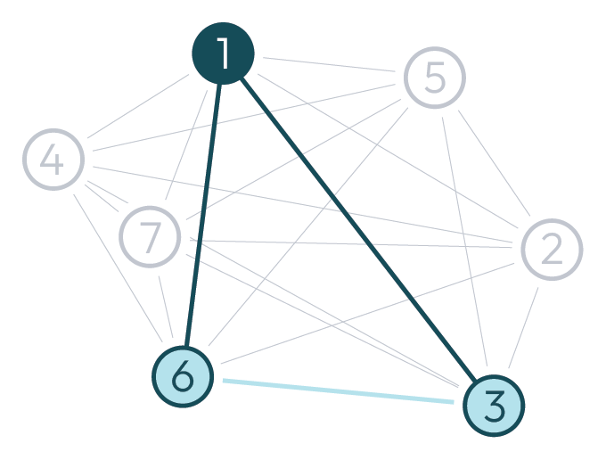

.. stitch-example-matching-strategy-transitive-end

.. _stitch-semantic-tags:

What are semantic tags?
==================================================

.. term-semantic-start

A semantic applies a common understanding to individual points of data across data sources, even when data sources have different schemas, naming conventions, and levels of data quality.

.. term-semantic-end

.. TODO: Edited glossary terms. The second one maybe doesn't work as well as an edited glossary term and is more tailored to this topic.

.. term-semantic-tag-start

A semantic tag is a label assigned to individual fields in source data to identify sources of personally identifiable information (PII), such as email addresses, phone numbers, and important business identifiers, such as a loyalty account ID. 

.. term-semantic-tag-end

.. stitch-semantic-tags-admonition-start

.. admonition:: Which fields best identify your customers?

   There are two considerations for identifying fields in source data that best identify your customers:

   #. What do customers use to identify themselves to your brand?

      This is often an email address or a phone number, but it might be a mileage plan number, a loyalty account number, a physical address, or some other identifier.

   #. How does your brand identify customers?

      This is most often a primary key in a source data tables that has personally identifiable information (PII) *and* information about some type of interaction customers have with your brand, such as a loyalty account table, a mileage plan table, a table for bookings, or a table for website or in-store transactions.

.. stitch-semantic-tags-admonition-end

.. _stitch-semantic-tags-profile:

Profile tags identify PII
--------------------------------------------------

.. stitch-semantic-tags-profile-start

Use customer profile semantic tags to identity PII in source data.

The most important profile tags have unique values when tied to names and addresses. For example:

* **email**
* **phone**
* **birthdate**

Other profile semantic tags exist for **address**, **address2**, **city**, **company**, **country**, **gender**, **given-name**, **postal**, **state**, **surname**, and **title**. These are often less useful for cluster and separation rules.

.. important:: A rule for each profile semantic tag is not required. Only configure rules for the most important profile semantic tags.

   The **generational-suffix** semantic tag is a default rule, along with the combination of **given-name** and **surname** as a full **name**. Stitch rules, by default, separate on those semantic tags probabilistically when they do not fuzzy match.

   Default rules can be moved to any location within the rules hierarchy, or even be removed, but if they remain in the default location, records with "John Smith III" and "John Smith II" or "John A Smith" and "John M Smith" are separated before they could match a non-default rule.

.. stitch-semantic-tags-profile-end

.. _stitch-semantic-tags-foreign-key:

Foreign keys identify anchors
--------------------------------------------------

.. term-foreign-key-start

A foreign key is a custom semantic tag applied to columns in source data tables that uniquely identify your business. For example, a loyalty ID, a durable customer ID, a website or mobile app login, a mileage ID, or a hospitality ID. Define cluster rules that match foreign key values to ensure that your most important identifiers become important identifiers within an identity graph.

.. term-foreign-key-end

.. stitch-semantic-tags-foreign-key-start

Assign foreign keys to fields that uniquely identify customers in source tables. These are often, but not always, a primary key.

A foreign key semantic tag starts with **fk-** and then appends a custom string: **fk-loyalty**. The custom string can have hyphens: **fk-loyalty-id**.

For example:

* Assign **fk-loyalty** to a loyalty account identifier
* Assign **fk-booking** to a car or hotel reservation number
* Assign **fk-stays** to hotel stay identifier
* Assign **fk-rental** to a car rental identifier
* Assign **fk-webstore** to a website transaction identifier
* Assign **fk-store** to an in-store transaction identifier

Define cluster rules with deterministic matching for the most important foreign key semantics, which often appear in source tables with PII.

.. stitch-semantic-tags-foreign-key-end

.. _stitch-what-are-rules:

What are rules?
==================================================

.. stitch-what-are-rules-start

An identity graph is built by comparing all of the possible connections between records, and then deciding which records should belong to a cluster of records within the identity graph and which ones should not.

Rules help Stitch determine when to cluster or separate records.

.. stitch-what-are-rules-end

.. TODO: The following paragraph has unfinished phrasings. Where is the Rules tab?

.. configure-stitch-rules-start

Use the **Rules** tab to define a prioritized collection of rules that are used for identity resolution. Rules are evaluated in order, from top to bottom, starting from the first rule defined in this tab, until a rule is applied.

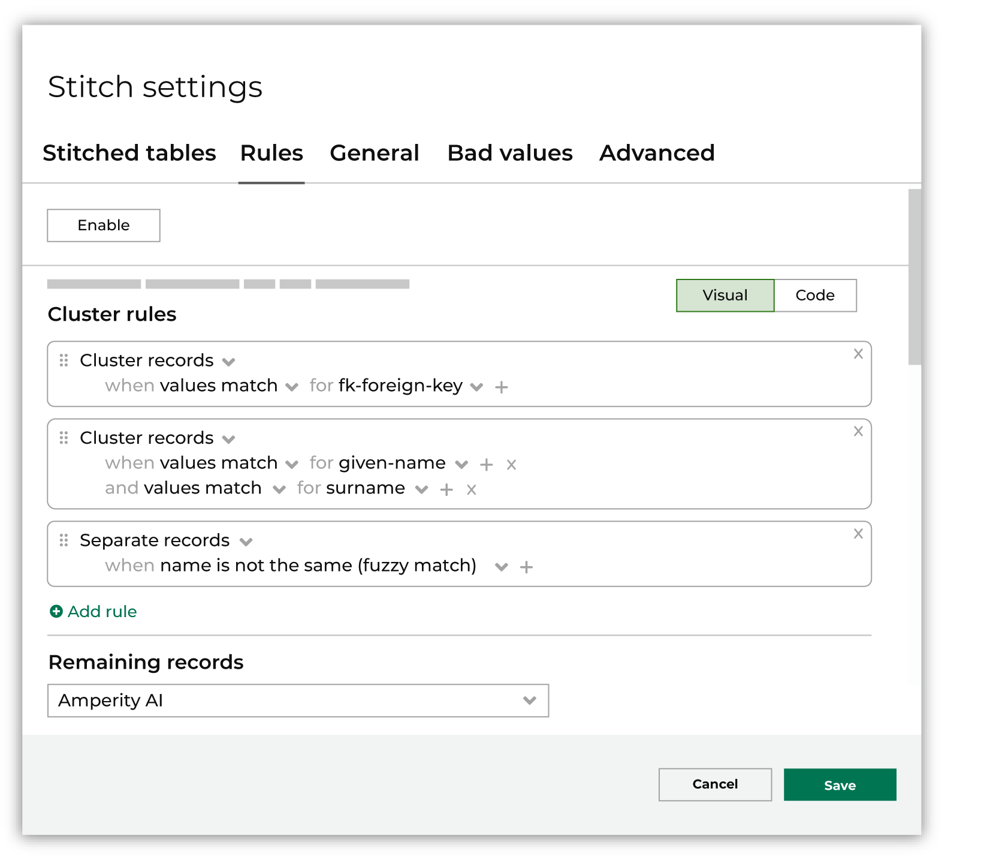

An individual rule defines when a set of records should be clustered together or be separated.

.. configure-stitch-rules-end

.. _stitch-rules-define-outcomes:

Rules define outcomes
--------------------------------------------------

.. stitch-rules-define-outcomes-start

Define rules that align to your brand's business use cases *and* align to how your brand understands your customers. Put the rules into a specific order that identifies which foreign key identifiers are the most important to your brand.

.. note:: The same field can serve opposite purposes depending on the chosen identity strategy.

For example, if your brand's most important use case *and* data source is from a loyalty program then use a clustering rule that deterministically matches on loyalty ID and put that rule near or at the top of the list of rules.

.. list-table::
   :widths: 50 50
   :header-rows: 1

   * - **Account-focused outcomes**
     - **Customer-focused outcomes**
   * - Account-focused outcomes build identity around how customers identify themselves to your brand using a combination of deterministic *and* probabilistic rules.

       Account-focused outcomes increase uniqueness within identity graphs by separating records on:

       * Phone numbers
       * Email addresses
       * Certain unique identifiers, such as private label credit cards

       Use cases for account-focused identity graphs include:

       * Personalization
       * Clienteling
       * Cart recovery
       * Personalized marketing

     - Customer-focused outcomes build a complete picture of an individual retail customer across all personas and accounts.

       Customer-focused outcomes cluster records together on PII like phone numbers, email addresses, and private label credit cards.

       Customer-focused outcomes rely on default scoring using Amperity AI, which is a hybrid approach to identity resolution that uses deterministic *and* probabilistic matching and leads to discovering transitive connections between records that might not otherwise match.

       Customer-focused outcomes enrich profiles by:

       * Associating interactions, such as purchases, website visits, cart activity, and other indicators of engagement
       * Associate anonymous traffic with known profiles
       * Lead to profiles with a more complete picture of who your customers are

       Use cases for customer-focused identity graphs include:

       * Abandoned carts
       * Anonymous-to-known
       * Cart recovery
       * Personalized marketing

.. TODO: This feels like a good and useful tip, but what does uniqueness mean and what does breadth mean and is it true?

.. tip:: Use separation rules to increase uniqueness within the identity graph and create more smaller profiles. Use cluster rules to increase breadth and create fewer larger profiles.

.. stitch-rules-define-outcomes-end

.. _stitch-rules-order-matters:

Rule order matters
--------------------------------------------------

.. stitch-rules-order-matters-start

Since Stitch applies rules sequentially, and gives a score based on the first rule that produces useful information, the order of rules matters.

For example, the **name is not the same** rule:

#. Compares gender, given names, and surnames to determine if records should be separated.
#. Records that do not match on gender are separated.
#. For given names the rule looks for exact matches and nicknames, after which it looks for string similarities.
#. For surnames the rule looks for exact matches, surnames swapped with given names, and string similarities. Popular surnames must match exactly.

This rule, without any clustering rules configured in the rules list, will help ensure that only customers with names that almost match and have the same gender will belong to the same customer profile within the identity graph.

This type of rule does not conflict with a clustering rule for matching loyalty IDs.

Consider that a loyalty ID may be shared by more than one individual, especially in the same household.

* If the **name is not the same** rule runs ahead of a clustering rule for loyalty IDs, each unique individual who may share a loyalty ID is more likely to be placed into their own customer profile within the identity graph.
* If the **name is not the same** rule runs after a clustering rule for loyalty IDs, Stitch will try to cluster the records.

.. TODO: Need to verify this is a good example of rules ordering. If not, find a better one.

.. stitch-rules-order-matters-end

.. _stitch-rule-types:

About rule types
--------------------------------------------------

There are two types of rules:

* :ref:`Cluster rules <stitch-rule-type-cluster>`
* :ref:`Separation rules <stitch-rule-type-separation>`

Cluster and separation rules let you decide when connections should be separated or when connections should be clustered.

The right way to think about how to use these two types of rules for identity resolution is to think of each rule as an anchor for your brand's identity resolution strategy. An anchor is a durable customer identifier that belongs to a customer and stays with them for long periods of time. Anchors align to your brand's business goals and outcomes.

An anchor is a value within a dataset that can uniquely identify individual customers. An email address. A phone number. A loyalty account ID. A mileage plan number. A branded credit account ID. Any transaction ID that uniquely identifies purchase interactions your customers have with your brand.

Create a rule for every important anchor, and then rank them in order of importance.

Identify anchors with the following questions:

#. What does a customer use to identify themselves?

   A customer uses their name, their email address, their phone number, their physical address. In many cases they use a website or app sign-in. After sign-in they may have a loyalty account ID. If they signed into your brand's web app they may also identify themselves from a device ID.

#. What data defines your business?

   Each source table that is made available to Amperity has important primary identifiers, also referred to as keys.

   A source table for loyalty accounts will have a loyalty ID.

   A booking and a stay or a trip is a type of transaction. These types of tables have unique identifiers for each stage in the transaction.

   Website and in-store purchases have unique identifiers that are often tracked in tables dedicated to each channel. Each of these data sources have unique identifiers for the transaction.

A huge identity graph of possible connections is turned into customer profiles by cutting connections between records that do not exactly match or have low matching scores *and* by keeping connections between records that exactly match or have high matching scores.

.. TODO: Include as tip or note.

.. configure-stitch-rules-order-start

Rules can be put in any order you want, but they will be applied in the order that you arrange them, and scored based on the first rule that produces useful information. That means different rule orders will produce different outcomes. Click the |fa-drag| icon, and then drag the rule into the desired position.

.. configure-stitch-rules-order-end

.. _stitch-rule-type-cluster:

Cluster rule types
++++++++++++++++++++++++++++++++++++++++++++++++++

.. TODO: Added context. Need to update and re-hook the inclusion.

.. TODO: Need to redo the inclusions and table whantots in the event the updated nav structure holds.

.. stitch-rule-type-cluster-start

Cluster rules are a powerful way to ensure certain unique identifiers become important identifiers within an indentity graph.

Cluster rules are deterministic because a loyalty ID is always a loyalty ID and an email address used to log in to your app is always an email address used to log into your app. These are unique identifiers that represent a specific known customer.

.. stitch-rule-type-cluster-end

.. configure-stitch-rules-cluster-start

Rules can be configured to cluster records together when personally identifiable information (PII) matches or with matching foreign keys.

.. TODO: In /operator/configure_stitch there is a big table here. In this topic the rows in the table are headers. After this topic ships, use includes to pull into the operator topic the sections from this topic.

.. configure-stitch-rules-cluster-end

.. _stitch-rule-type-cluster-values-match:

Values match
^^^^^^^^^^^^^^^^^^^^^^^^^^^^^^^^^^^^^^^^^^^^^^^^^^

.. stitch-rule-type-cluster-values-match-start

The **values match** rule compares values for the selected semantic tag and clusters records when values match exactly.

Both records must have non-NULL, non-empty values that match exactly. A NULL or empty value on either side does not create a match.

.. note:: When a record has multiple values for the same field, a match on any single value is sufficient 

Use this condition for loyalty IDs, key business identifiers like booking IDs and stay IDs, email addresses and phone numbers, hashed values, and device IDs.

.. stitch-rule-type-cluster-values-match-end

.. _stitch-rule-type-cluster-values-approximately-match:

Values approximately match
^^^^^^^^^^^^^^^^^^^^^^^^^^^^^^^^^^^^^^^^^^^^^^^^^^

.. stitch-rule-type-cluster-values-approximately-match-start

The **values approximately match** rule compares values for the selected semantic tag and clusters records when values match or differ by up to a single character.

Both records must have non-NULL, non-empty values. A NULL or empty value on either side does not create a match.

Use this condition when values match but have minor variations, such as misspellings, abbreviations, typos, or transposed characters.

.. stitch-rule-type-cluster-values-approximately-match-end

.. _stitch-rule-type-separation:

Separation rule types
++++++++++++++++++++++++++++++++++++++++++++++++++

.. TODO: Added context. Need to update and re-hook the inclusion.

.. TODO: Need to redo the inclusions and table whantots in the event the updated nav structure holds.

.. stitch-rule-type-separate-start

Separation rules are a powerful way to control how clusters form within an indentity graph. They tell Stitch when records should not be in the same cluster.

.. stitch-rule-type-separate-end

.. configure-stitch-rules-separate-start

Rules can be configured to separate records when values differ or when specific types of PII are similar, but do not match.

.. TODO: In /operator/configure_stitch there is a big table here. In this topic the rows in the table are headers. After this topic ships, use includes to pull into the operator topic the sections from this topic.

.. configure-stitch-rules-separate-end

.. _stitch-rule-type-separation-birthdate:

Birthdate
^^^^^^^^^^^^^^^^^^^^^^^^^^^^^^^^^^^^^^^^^^^^^^^^^^

.. stitch-rule-type-separation-birthdate-start

The **birthdate is not the same (fuzzy match)** rule compares values for birthdates and separates records when values clearly differ.

However, records are not separated when:

* Birthdates are missing from one or both records
* Birthdates differ by a single character
* Exactly one component--YYYY, MM, or DD--differs by only one. For example: "2002-12-12" and "2001-12-12", "2002-12-12" and "2002-11-12", or "2002-12-09" and "2002-12-10"
* MM and DD values appear swapped between records
* A record has a placeholder value: "1900-01-01", "1910-01-01", "1920-01-01", "1930-01-01", "1940-01-01", "1950-01-01", "1960-01-01", "1970-01-01", "1980-01-01", "1990-01-01", "2000-01-01", "2010-01-01", and "2008-08-08".

.. stitch-rule-type-separation-birthdate-end

.. _stitch-rule-type-separation-company:

Company
^^^^^^^^^^^^^^^^^^^^^^^^^^^^^^^^^^^^^^^^^^^^^^^^^^

.. stitch-rule-type-separation-company-start

The **company is not the same (fuzzy match)** rule compares values for company and separates records when values are not the same.

.. tip:: This rule is more useful in business-to-business contexts where the value of **company** is stable and meaningful.

.. stitch-rule-type-separation-company-end

.. _stitch-rule-type-separation-generational-suffix:

Generational suffix
^^^^^^^^^^^^^^^^^^^^^^^^^^^^^^^^^^^^^^^^^^^^^^^^^^

.. stitch-rule-type-separation-generational-suffix-start

The **generational suffix is not the same (fuzzy match)** rule compares values for generational suffix and separates records when values are not the same.

.. stitch-rule-type-separation-generational-suffix-end

.. _stitch-rule-type-separation-name:

Name
^^^^^^^^^^^^^^^^^^^^^^^^^^^^^^^^^^^^^^^^^^^^^^^^^^

.. stitch-rule-type-separation-name-start

The **name is not the same (fuzzy match)** rule compares gender, given names, and surnames to determine if records should be separated.

Records that do not match on gender are separated.

For given names the rule looks for exact matches and nicknames, after which it looks for string similarities.

For surnames the rule looks for exact matches, surnames swapped with given names, and string similarities. Common surnames must match exactly.

.. stitch-rule-type-separation-name-end

.. _stitch-rule-type-separation-values-differ:

Values differ
^^^^^^^^^^^^^^^^^^^^^^^^^^^^^^^^^^^^^^^^^^^^^^^^^^

.. stitch-rule-type-separation-values-differ-start

The **values differ** rule compares values for the selected semantic tag and separates records when values do not match exactly.

Both records must have non-NULL, non-empty values that are not equal. A NULL or empty value on either side does not create a conflict.

.. important:: Any difference, including a single character difference, creates a conflict. For tolerance of minor variations, such as typos or transpositions, use **values significantly differ**.

.. stitch-rule-type-separation-values-differ-end

.. _stitch-rule-type-separation-values-significantly-differ:

Values significantly differ
^^^^^^^^^^^^^^^^^^^^^^^^^^^^^^^^^^^^^^^^^^^^^^^^^^

.. stitch-rule-type-separation-values-significantly-differ-start

The **values significantly differ** rule compares values for the selected semantic tag and separates records when values differ by more than a single character.

Both records must have non-NULL, non-empty values that differ by more than a single character. A NULL or empty value on either side does not create a conflict. A single character difference does not create a conflict.

The following values do not conflict:

* "Jon" and "John"
* "Smith" and "Smyth"
* "Phoenix" and "Pheonix"
* "Santa Ana" and "Santa Anna"

The following values conflict:

* "Bob" and "Bobby"
* "Jim" and "James"
* "Fort Smith" and "Fort Worth"
* "San Marcos" and "San Carlos"

.. stitch-rule-type-separation-values-significantly-differ-end

.. _stitch-scoring-confidence:

Confidence and scoring
--------------------------------------------------

.. stitch-scoring-matches-and-conflicts-start

A confident match is strong evidence that two records are the same person. A confident conflict is strong evidence that two records are not the same person.

In many cases no meaningful signal exists to show that two records belong or do not belong to the same person.

Identity resolution follows connections through the identity graph. When confident matches are discovered identity resolution keeps looking for additional matches.

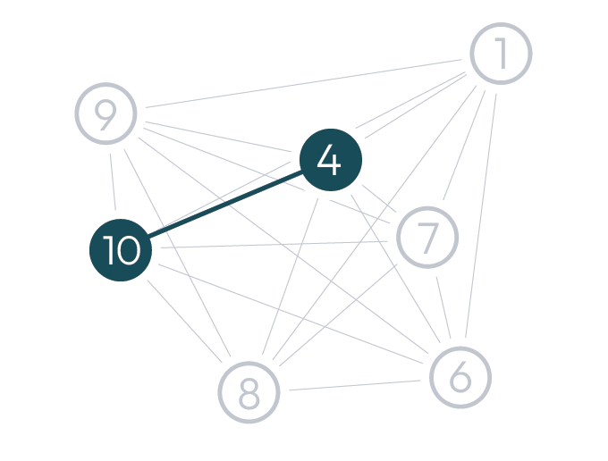

When confident conflicts are discovered, identity resolution stops.

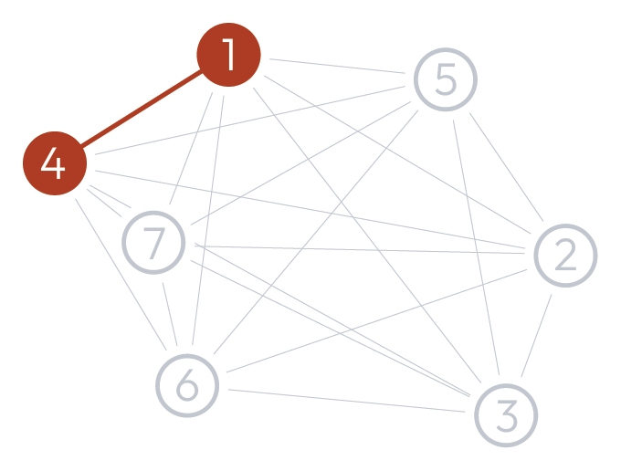

.. stitch-scoring-matches-and-conflicts-end

.. _stitch-scoring-remaining-records:

Scoring remaining records
--------------------------------------------------

.. configure-stitch-rules-remaining-start

For records that do not match any of the prioritized collection of rules there are two options: use the **AI model** or use **No matching model**.

#. Recommended. Use the **AI model** and allow Stitch to evaluate these records, discover connections, and then use those connections to build clusters.

#. Use **No matching model** and only score using the prioritized collection of rules to build clusters. Records that do not match one of the rules may end up as singleton clusters of one.

.. configure-stitch-rules-remaining-end

.. _stitch-examples:

Cluster examples
==================================================

.. TODO: This section might need some heavy editing.

.. stitch-examples-start

It's not possible to describe how records match and form clusters by starting with the sheer potential size of an identity graph and the even larger number of potential matching records. Instead, this section uses diagrams to show how records in clusters can match and how customer profiles emerge from an identity graph.

.. stitch-examples-end

.. stitch-examples-cluster-graph-start

.. tip:: Use the **Cluster graph** tab in the **Data Explorer** to explore the identity graph and view a detailed breakdown of the scoring relationships between all records within any cluster.

   The **Cluster graph** tab shows the scores *and* source data for each pair of records within a cluster and shows why those two records matched well enough to belong to the same cluster.

.. stitch-examples-cluster-graph-end

.. stitch-example-matching-clusters-start

The following examples describe how customer profiles emerge from an identity graph and how they adapt to new or changing information.

* :ref:`Cluster A <stitch-example-matching-cluster-a>`
* :ref:`Cluster B <stitch-example-matching-cluster-b>`
* :ref:`Clusters adapt <stitch-example-matching-clusters-adapt>`

.. stitch-example-matching-clusters-end

.. _stitch-example-matching-cluster-a:

Cluster A
--------------------------------------------------

.. stitch-example-matching-cluster-a-start

Records one and six, one and three, and six and five all have confident matches. Transitive matches are present between records three and six, three and five, and five and one.

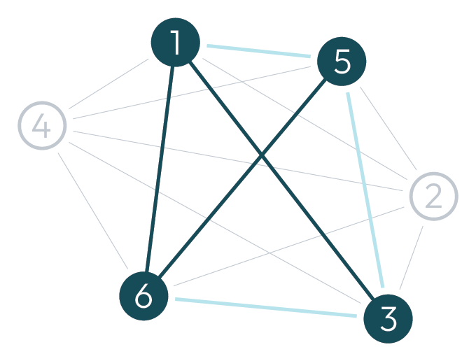

.. stitch-example-matching-cluster-a-end

.. _stitch-example-matching-cluster-b:

Cluster B
--------------------------------------------------

.. stitch-example-matching-cluster-b-start

Records one and four have similar names, do not have generational suffixes, and record 4 does not have a loyalty ID, booking ID, or stay ID.

The email addresses for records one and four differer and the sixth rule in the rules set separates records when values for **email** differ.

Record four confidently matches records eight and ten and transitively matches record 9 because records 9 and 10 confidently match.

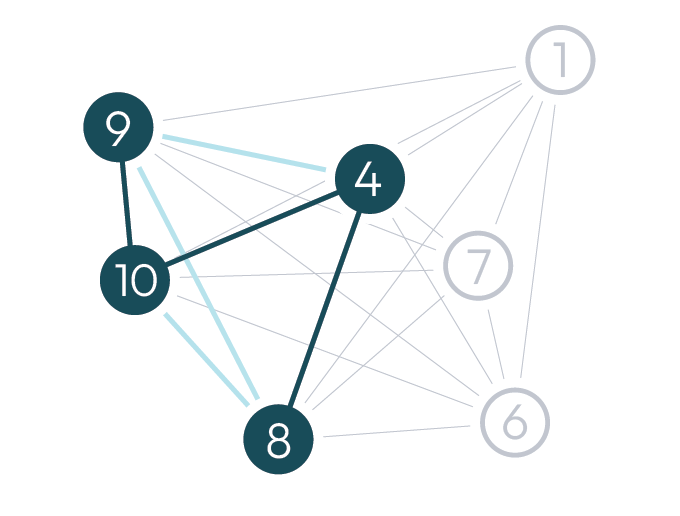

.. stitch-example-matching-cluster-b-end

.. _stitch-example-matching-clusters-adapt:

Clusters adapt
--------------------------------------------------

.. stitch-example-matching-clusters-adapt-start

Individual clusters within an identity graph adapt and change as the underlying data made available to an identity graph changes.

.. note:: A stable identity graph with rich data sources often has a low percentage of clusters that changed. One percent or fewer is not uncommon.

   Adding a new high quality data sources causes some changes initially, but that will settle down after a short period of time.

Every time Stitch builds an identity graph it starts with analyzing all source records. If the underlying data changes, in this case new data is available, Stitch adapts and adds the new information to the identity graph, reapplies rules, and rebuilds clusters of records that represent unique customer profiles within the identity graph.

For example, a new data source with PII is added to Amperity. New record number seven confidently matches record one.

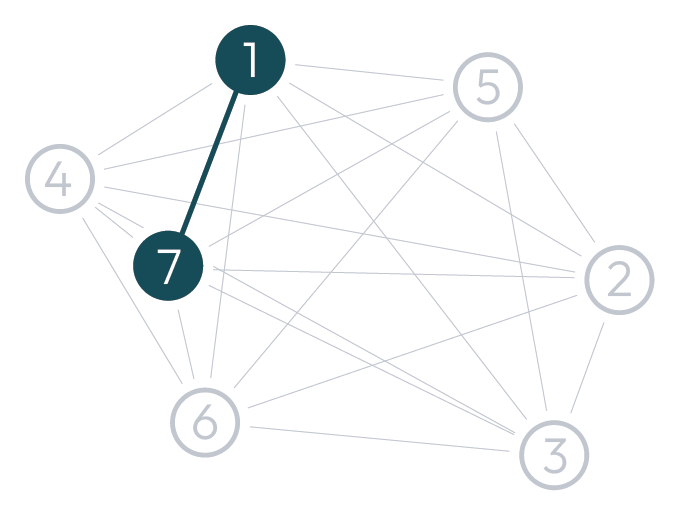

Record seven confidently matches record two.

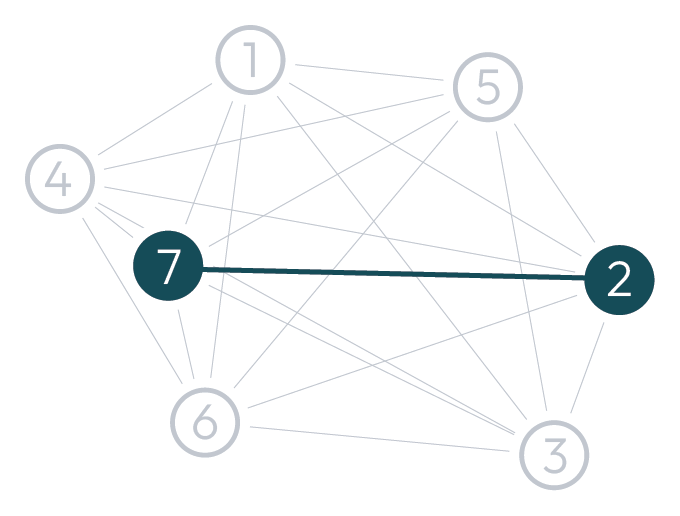

Record seven confidently matches records one and two. Records one and two do not have a confident match, but are transitively connected because of the other confident matches.

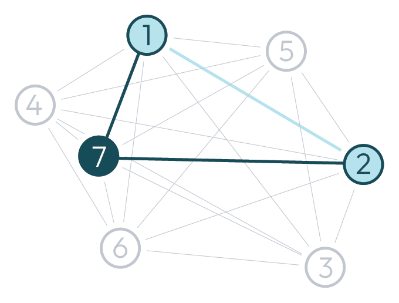

All of the other records in the cluster scored like they did before the new data source was added. The cluster is updated to include records two and seven and the number of records in the rebuilt cluster is now seven.

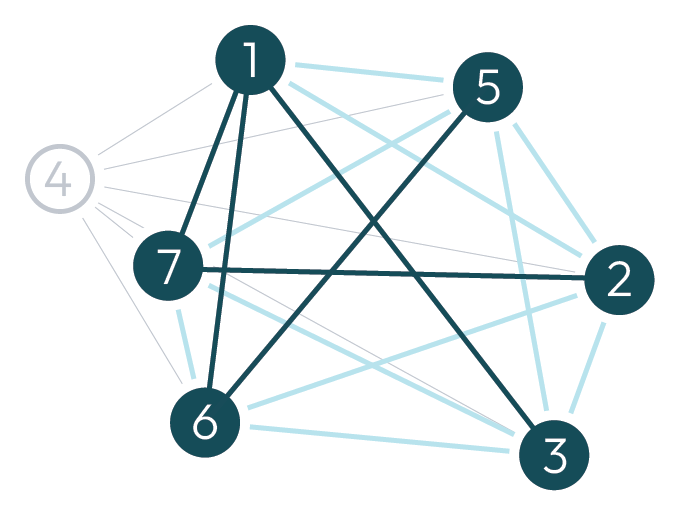

.. stitch-example-matching-clusters-adapt-end
