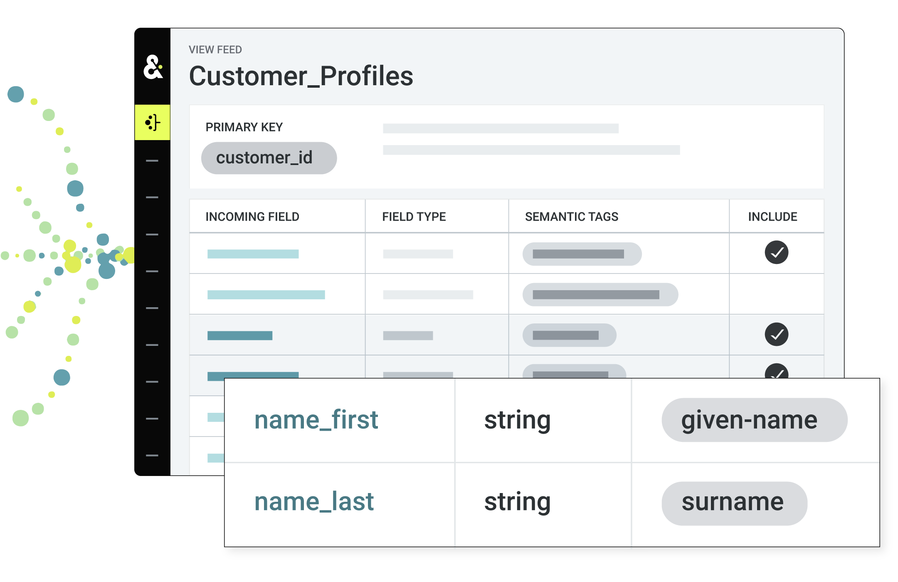
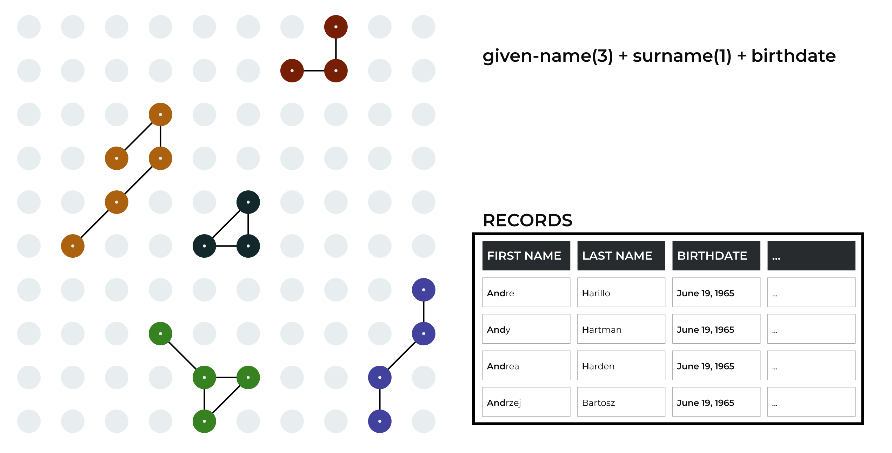
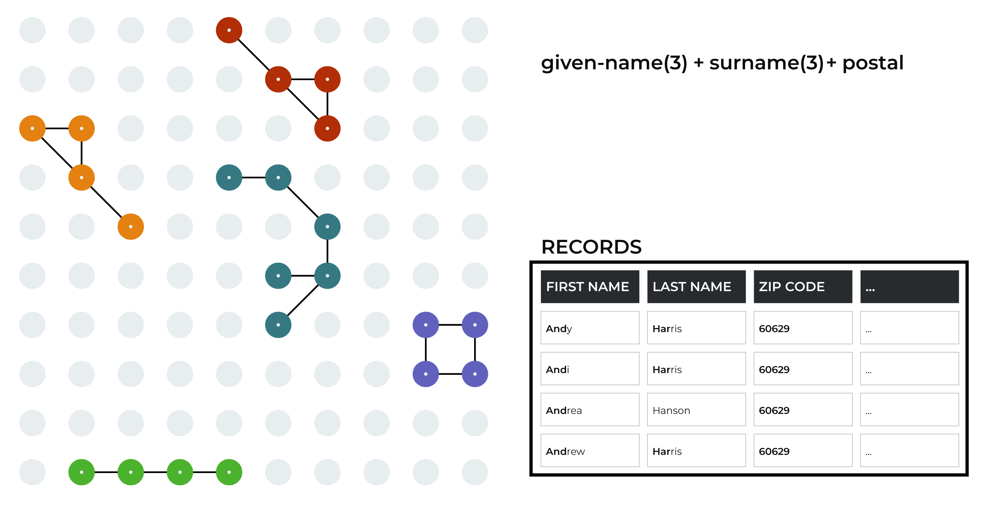
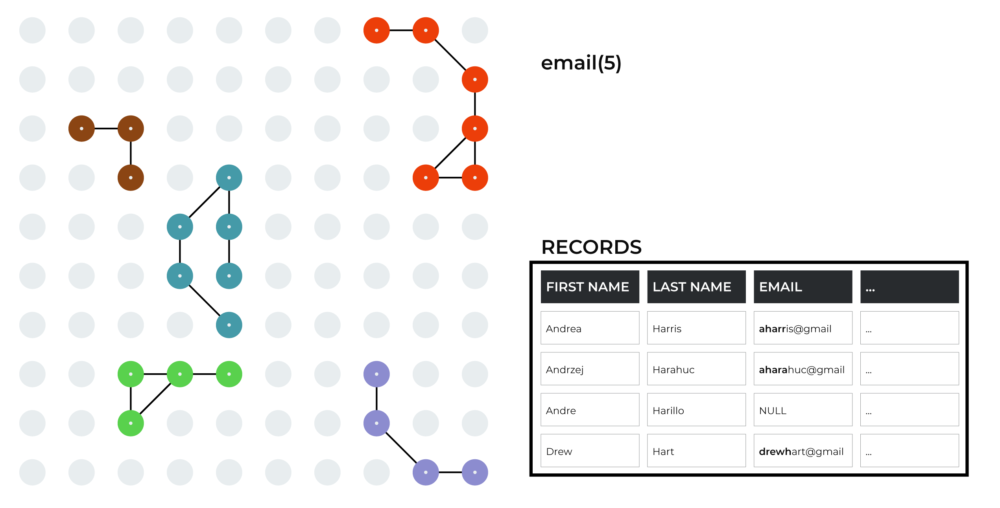
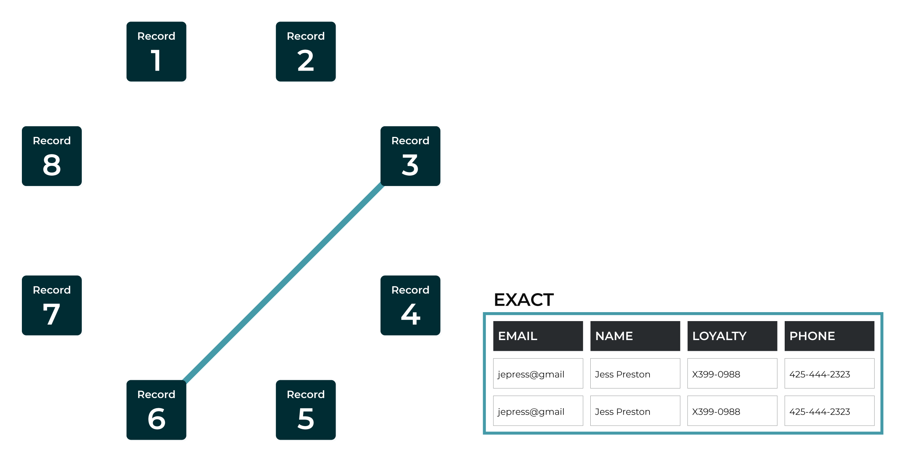
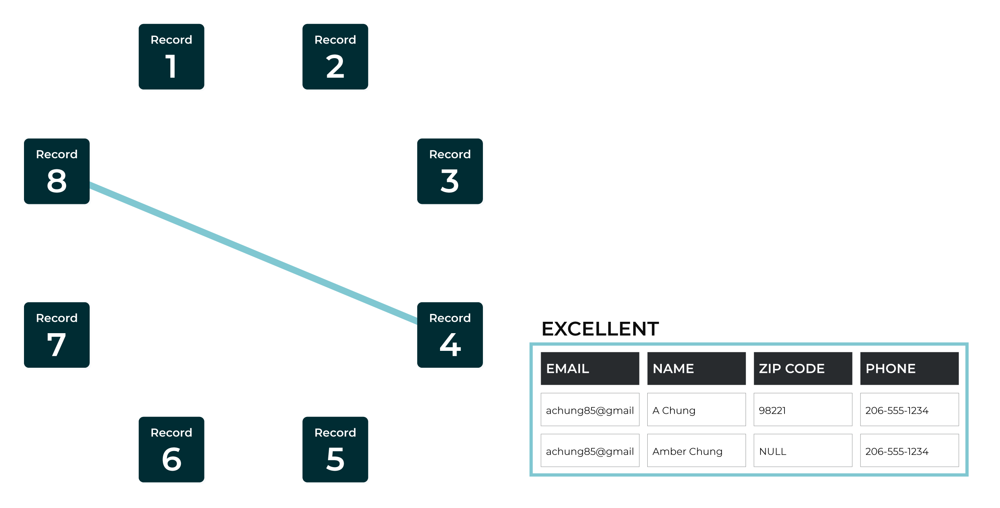
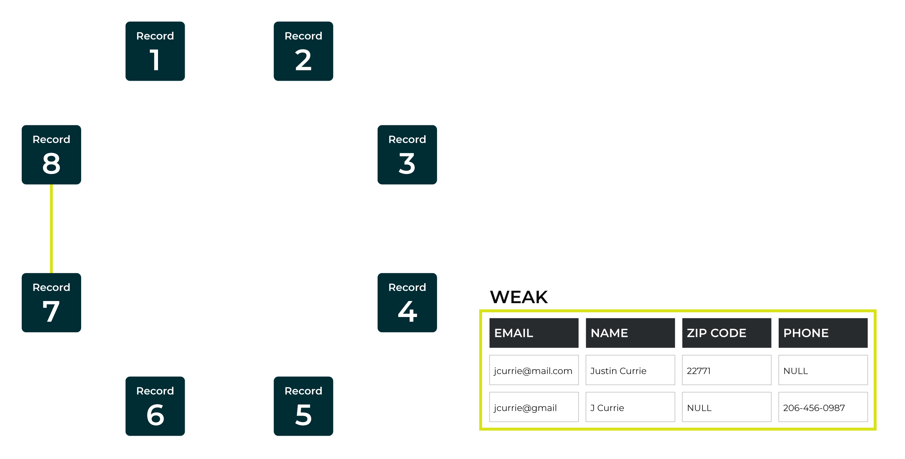
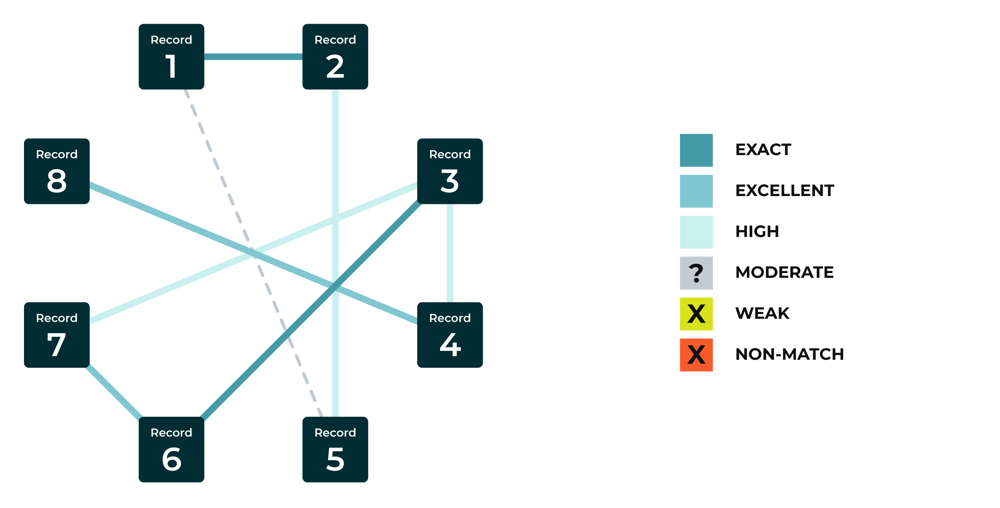
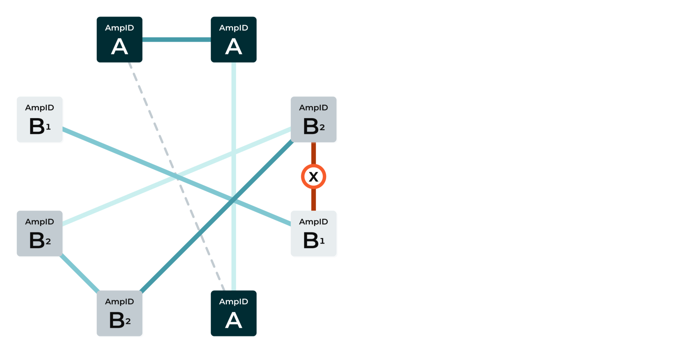

.. https://docs.amperity.com/reference/

.. meta::
    :description lang=en:
        Learn how Stitch evaluates all of your brand's data to discover the hidden connections in your customer records that correctly identify all of your unique customers.

.. meta::
    :content class=swiftype name=body data-type=text:
        Learn how Stitch evaluates all of your brand's data to discover the hidden connections in your customer records that correctly identify all of your unique customers.

.. meta::
    :content class=swiftype name=title data-type=string:
        How Stitch works

==================================================
How Stitch works
==================================================

.. include:: ../../shared/terms.rst
   :start-after: .. term-stitch-start
   :end-before: .. term-stitch-end

.. image:: ../../images/howitworks-stitch-intro-01-who.png
   :width: 500 px
   :alt: This is how Amperity finds your customers in your data.
   :align: left
   :class: no-scaled-link

.. stitch-how-it-works-start

Amperity uses a `series of patented innovations <https://amperity.com/patents>`__ to ensure that identity resolution against your customer data is accurate and that the output of the Stitch process represents a unified view of your customers.

.. stitch-how-it-works-end

.. stitch-entity-matching-start

Read `Entity Matching in the Wild: a Consistent and Versatile
Framework to Unify Data in Industrial Applications <https://docs.amperity.com/downloads/pdf/fusion-sigmod-2020.pdf>`__ for a detailed explanation of how Amperity provides a consistent, reliable, and stable customer ID.

.. stitch-entity-matching-end

.. stitch-learning-lab-start

.. admonition:: Amperity Learning Lab

   Learn more about how Stitch evaluates all of your brand's data to discover the hidden connections in your customer records that correctly identify all of your unique customers.

   Open **Learning Lab** to learn more about `How Stitch Works <https://learn.amperity.com/how-stitch-works-1>`__ |ext_link|. Registration is required.

.. stitch-learning-lab-end

.. _stitch-stages-of-identity-resolution:

Stages of identity resolution
==================================================

.. stitch-stages-of-identity-resolution-start

Identity resolution is a critical step in understanding who your customers are. Stitch is the component within Amperity that performs identity resolution by comparing all of your customer data, identifying unifying groups of customer records, and then identifying unique customer profiles that represent each of your unique, individual customers.

.. stitch-stages-of-identity-resolution-end

.. stitch-stages-of-identity-resolution-steps-start

The stages of identity resolution are:

#. :ref:`Semantic tagging <stitch-semantic-tags>`
#. :ref:`Preprocessing data <stitch-preprocess-data>`
#. :ref:`Union of tables <stitch-union-of-tables>`
#. :ref:`Blocking <stitch-blocking>`
#. :ref:`Initial scoring <stitch-initial-scoring>`
#. :ref:`Pairwise comparison <stitch-pairwise-comparison>`
#. :ref:`Stable ID assignment <stitch-stable-ids>`

.. stitch-stages-of-identity-resolution-steps-end

.. _stitch-semantic-tags:

Semantic tags
--------------------------------------------------

.. include:: ../../shared/terms.rst
   :start-after: .. term-semantic-start
   :end-before: .. term-semantic-end

.. stitch-semantic-noetl-start

.. admonition:: Extract, load, transform (ELT)

   An important benefit of semantic tagging is that raw data can be provided directly to Amperity, which avoids a traditional and more expensive extract, transform, and load (ETL) process. Amperity can extract, load, and then transform raw data from any number of large datasets.

.. stitch-semantic-noetl-end

.. include:: ../../shared/terms.rst
   :start-after: .. term-semantic-tag-start
   :end-before: .. term-semantic-tag-end

.. feeds-semantic-tagging-which-start

.. admonition:: What semantic tags does Stitch rely on?

   Stitch relies on the following semantic tags to be applied to customer records:

   * **given-name** (first name) and **surname** (last name). In some cases, a **full-name** is inferred (if not available).
   * Other important profile details, such as **birthdate**, **email**, and **phone**.
   * The **address**, **address2**, **city**, **state**, and **postal** tags are combined to represent a complete physical address.
   * Other location details, such as **country** and **company**.
   * Additional profile details, when available, such as **gender**, **generational-suffix** (Jr., Sr., III, etc.), and **title**.

   Stitch uses foreign keys to associate individual customers to their interactions with your brands.

.. feeds-semantic-tagging-which-end

.. feeds-semantic-tagging-start

Semantic tags must be defined for every feed that provides profile data to Stitch. This ensures that data from rich sources of profile data are brought into Amperity in a consistent manner, which improves the outcome of the Stitch process.

Semantic tagging works like this:

#. A field in the customer's system named "fname" stores an individual's given name.
#. A field in the customer's system named "lname" stores the same individual's last name.
#. A field in the customer's system named "primary-phone" stores a phone number.
#. A field in the customer's system named "date" stores an individual's birthdate.

For those semantic tags, the feed should apply semantic tags like this:

.. list-table::
   :widths: 100 100
   :header-rows: 1

   * - Input Field
     - Semantic Tag
   * - fname
     - given-name
   * - lname
     - surname
   * - primary-phone
     - phone
   * - date
     - birthdate

This same pattern is applied to every customer data source that is brought into Amperity and it results in every single semantically tagged field being analyzed by Amperity during the Stitch process in exactly the same way.

Amperity has built-in semantic tags for personally identifiable information (PII), transactions, and behaviors. In addition, custom semantic tagging may be applied to fields when adding them can help identify unique individuals across massive data sets.

.. feeds-semantic-tagging-end

.. _stitch-preprocess-data:

Preprocess data
--------------------------------------------------

.. stitch-preprocess-data-start

Data is preprocessed into a consistent data pattern before it is combined into a virtual table for use with record matching, blocking, and pairwise comparison. Amperity preprocesses all values in all fields to which semantic tags for profile data were applied. 

.. stitch-preprocess-data-end

.. stitch-preprocess-data-note-start

.. note:: Preprocessing data ensures that Stitch has access to consistent formatting of data for matching purposes. Preprocessed data is written to the **Unified Preprocessed Raw** data table. Amperity does not assert that preprocessed data values are better than the original values in the customer's data.

.. stitch-preprocess-data-note-end

.. _stitch-preprocess-data-address:

Addresses
++++++++++++++++++++++++++++++++++++++++++++++++++

.. stitch-preprocess-data-address-start

Amperity preprocesses addresses by converting common abbreviations to complete words, removing periods and commas--``.`` and ``,``--and converting all characters to UPPERCASE.

.. list-table::
   :widths: 300 300
   :header-rows: 1

   * - Original value
     - Preprocessed to
   * - ``123 W. Elm St.``

       ``123 West Elm St.``

       ``123 W Elm St``

       ``123 West Elm Street``
     - ``123 WEST ELM STREET``
   * - ``44 holiday dr.``

       ``44 Holiday Dr.``

       ``44 Holiday Drive``
     - ``44 HOLIDAY DRIVE``
   * - ``1000 1st Ave. Ste. 1960``
     - ``1000 FIRST AVENUE SUITE 1960``
   * - ``555 Puget Ave``

       ``P.O. Box 555``
     - ``555 PUGET AVENUE PO BOX 555``

.. stitch-preprocess-data-address-end

.. _stitch-preprocess-data-phone:

Phone numbers
++++++++++++++++++++++++++++++++++++++++++++++++++

.. stitch-preprocess-data-phone-start

Amperity preprocesses phone numbers by removing parentheses, hyphens, and spaces, consolidating every phone number to a numeric string. Stitch uses the last 10 digits of a phone number for identity resolution.

.. list-table::
   :widths: 300 300
   :header-rows: 1

   * - Original value
     - Preprocessed to
   * - ``(333)-444-5678``
     - ``3334445678``
   * - ``415 290 5727``
     - ``4152905727``
   * - ``+1 (978) 425 6779``
     - ``9784256779``
   * - ``222 4455``
     - ``2224455``

.. stitch-preprocess-data-phone-end

.. _stitch-preprocess-data-email:

Email addresses
++++++++++++++++++++++++++++++++++++++++++++++++++

.. stitch-preprocess-data-email-start

Amperity preprocesses email addresses by ensuring that only the local username and domain are present, separated by ``@``, and converted to UPPERCASE.

.. important:: All email addresses are validated against a common list of local username patterns that typically indicate junk email addresses, such as ``test@``, ``no@``, or ``reservation@``. When an email address matches one of these patterns, that value is preprocessed to **NULL**.

.. list-table::
   :widths: 300 300
   :header-rows: 1

   * - Original value
     - Preprocessed to
   * - ``derek+1234@amperity.com``
     - ``DEREK@AMPERITY.COM``
   * - ``test@goaway.com``
     - NULL
   * - ``gary.smith+123@gmail.com``
     - ``GARY.SMITH@GMAIL.COM``

.. note:: Field values that were ignored during preprocessing are available as output of Stitch from the **Unified Preprocessed Raw** table. Fields values that were ignored due to blocklisting are available as output of Stitch from the **Unified Coalesced** table.

.. stitch-preprocess-data-email-end

.. _stitch-union-of-tables:

Union of tables
--------------------------------------------------

.. stitch-union-of-tables-start

All records from all tables that contain customer profile data are merged into a single virtual table that aligns all of the data that is associated with all defined semantic groups.

.. stitch-union-of-tables-end

.. stitch-union-of-tables-context-start

Semantic tags are applied consistently across data sources. Every email address, physical address, phone number, first and last name is associated to profile semantics. Every order, item, purchase amount, discount amount, return, is associated to transaction semantics.

It is OK if each row does not contain a value for each column. The alignment itself is what is necessary to make this data usable by Stitch for downstream processing and identity resolution.

.. stitch-union-of-tables-context-end

.. stitch-union-of-tables-table-start

The following example shows a couple rows from a few tables, the aligned and preprocessed semantic values, and no values when the data source did not provide it. Imagine this for all of your customer data, hundreds of millions of records, hundreds of millions of rows, with fields in the virtual table that span your complete set of customer data.

.. vale off

.. list-table::
   :widths: 100 100 100 100 100 100
   :header-rows: 1

   * - Source
     - Surname
     - Address
     - Email
     - Postal
     - Loyalty ID
   * - Loyalty
     - SMITH
     - 123 MAIN STREET
     - JOHN@MAIL.COM
     - 98101
     - A-12345-a
   * - Loyalty
     - JONES
     - 10 SOUTH LANE
     - JONES@GMAIL.COM
     - 10101
     - B-23456-b
   * - In-store
     - SMITH
     - 
     - 
     - 98101
     - A-12345-a
   * - Online
     - SMITH
     - 123 MAIN STREET
     - JOHN@MAIL.COM
     - 98101
     - A-12345-a
   * - Online
     - JONES
     - 10 SOUTH LANE
     - JONES@GMAIL.COM
     - 10101
     - B-23456-b
   * - Clickstream
     - 
     - 
     - 
     - 
     - A-12345-a
   * - Clickstream
     - 
     - 
     - 
     - 
     - B-23456-b

.. vale on

.. stitch-union-of-tables-table-end

.. _stitch-blocking:

Blocking
--------------------------------------------------

.. include:: ../../shared/terms.rst
   :start-after: .. term-blocking-start
   :end-before: .. term-blocking-end

.. stitch-blocking-note-start

.. note:: Blocking is a non-trivial step for record linking in the Stitch process. 

   * An overly generous blocking strategy may result in a high recall rate, which means too many pairs are evaluated. This can affect system performance.
   * An overly conservative blocking strategy may result in a low recall rate, which means too few pairs being evaluated.
   * Individual blocking keys may be conservative or generous.

   The combination of blocking keys is what creates the ideal recall rate without compromising the performance of Amperity.

.. stitch-blocking-note-end

.. include:: ../../shared/terms.rst
   :start-after: .. term-blocking-strategy-start
   :end-before: .. term-blocking-strategy-end

.. include:: ../../shared/terms.rst
   :start-after: .. term-bk-stitch-context-start
   :end-before: .. term-bk-stitch-context-end

.. include:: ../../shared/terms.rst
   :start-after: .. term-block-start
   :end-before: .. term-block-end

.. stitch-blocking-block-example-start

Blocks are created by comparing all records against all blocking strategies. When a record contains values that match a blocking strategy these values are combined into a single string value, also referred to as a blocking key.

For example, a blocking strategy that matches:

* given-name(3)
* surname(3)
* postal

results in a blocking key string value similar to ``Jus:Cur:98101``. This operation is similar to the following ``SELECT`` statement:

.. code-block:: none

   SELECT
     left.pk 
     ,right.pk 
   FROM unified_semantic_data AS left 
   JOIN unified_semantic_data AS right
   ON left.given_name(0,3) = right.given_name(0,3)
   AND left.surname(0,3) = right.surname(0,3)
   AND left.postal=right.postal

.. stitch-blocking-block-example-end

.. stitch-blocking-block-see-also-start

The following sections step through a series of diagrams that describe how blocking works.

.. stitch-blocking-block-see-also-end

.. _stitch-blocking-potential:

Potential blocks
++++++++++++++++++++++++++++++++++++++++++++++++++

.. stitch-blocking-potential-start

The blocking process starts with no matches between records.

.. stitch-blocking-potential-end

.. stitch-blocking-potential-diagram-context-start

Each of these individual dots represents an individual record that can match other records. In the following diagrams, dots are highlighted and lines are added between them to indicate that at least one blocking key match has been discovered by Stitch.

.. stitch-blocking-potential-diagram-context-end

.. _stitch-blocking-strategy-example-birthdate:

Given name, surname, birthdate
++++++++++++++++++++++++++++++++++++++++++++++++++

.. stitch-blocking-strategy-example-birthdate-start

The blocking process steps through each blocking strategy, with each blocking strategy defining specific matching patterns against which all records are compared. As records are analyzed and matched to patterns, the matching strings are grouped together for later comparison.

.. stitch-blocking-strategy-example-birthdate-end

.. stitch-blocking-strategy-example-birthdate-diagram-intro-start

This example shows an important blocking strategy that groups values associated with the following semantics:

* The first three characters in **given-name**
* The first character in **surname**
* **birthdate**.

.. stitch-blocking-strategy-example-birthdate-diagram-intro-end

.. _stitch-blocking-strategy-example-postal:

Given name, surname, zip code
++++++++++++++++++++++++++++++++++++++++++++++++++

.. stitch-blocking-strategy-example-postal-start

A record can match more than one blocking key. Some of the records highlighted in this example were also matched in the previous example.

.. stitch-blocking-strategy-example-postal-end

.. stitch-blocking-strategy-example-postal-diagram-intro-start

This example shows another important blocking strategy that groups values associated with the following semantics:

* The first three characters in **given-name**
* The first three characters in **surname**
* **postal**.

.. stitch-blocking-strategy-example-postal-diagram-intro-end

.. _stitch-blocking-strategy-example-email:

First 5 characters in email
++++++++++++++++++++++++++++++++++++++++++++++++++

.. stitch-blocking-strategy-example-email-start

As each blocking strategy is applied, more groups of records are identified.

.. stitch-blocking-strategy-example-email-end

.. configure-stitch-advanced-email-address-patterns-start

Many email addresses are not useful for identity resolution. Some of them are generic, such as *info@some-domain.com*, and are often associated with a place of business and should never be associated with a unique individual. Other email addresses are bogus, having been entered as a requirement for providing a genuine email address, but are otherwise fake, such as *123@some-domain.com*.

.. configure-stitch-advanced-email-address-patterns-end

.. stitch-blocking-strategy-example-email-name-matching-start

Amperity uses a list of known "bad" email patterns, such as *admin@*, *contact@*, *guest@*, *no@*, *none@*, and then uses the list to exclude from Stitch results any email address that matches a pattern in the list. (This step is done during preprocessing, not blocking.)

.. stitch-blocking-strategy-example-email-name-matching-end

.. stitch-blocking-strategy-example-email-diagram-intro-start

This example shows additional record matches discovered after comparing the first five characters in email addresses across records.

.. stitch-blocking-strategy-example-email-diagram-intro-end

.. _stitch-blocking-complete:

Blocking complete
++++++++++++++++++++++++++++++++++++++++++++++++++

.. stitch-blocking-complete-start

When finished, the blocking process has unioned all of the matching blocking keys together into distinct groups of records.

.. stitch-blocking-complete-end

.. image:: ../../images/howitworks-stitch-blocking-05-final-a.png
   :width: 600 px
   :alt: The end of the blocking process has identified groups of records that are ready for pairwise comparison.
   :align: left
   :class: no-scaled-link

.. stitch-blocking-complete-context-start

These groups of records will be scored, first as an initial scoring pass that filters out matching pairs that score below threshold, and then as a detailed pass that compares a record in a group to all of the other records in that group.

.. stitch-blocking-complete-context-end

.. _stitch-initial-scoring:

Initial scoring
--------------------------------------------------

.. stitch-initial-scoring-start

Each of the matching pairs that were directly identified during blocking are scored. Matching pairs that score below threshold are filtered out, which creates smaller groups of records and also new groups of records, depending on which matching pairs are filtered out.

.. stitch-initial-scoring-end

.. stitch-initial-scoring-filters-start

The following example shows several matching pairs scoring below threshold, using larger dots to indicate which matching pairs scored below threshold.

* Four groups of records show matching pairs scoring below threshold in a way that will split each of them into two groups of records.
* One group of records shows three scores below threshold, one that does not affect the number of records in the group (because other scores for that record were above threshold) and one that is removed entirely.

.. stitch-initial-scoring-filters-end

.. stitch-initial-scoring-result-start

The remaining matching pairs that scored above threshold remain in groups. The following example shows most groups getting smaller, but also four new groups identified.

.. stitch-initial-scoring-result-end

.. stitch-initial-scoring-note-start

.. note:: Initial scoring uses the same scoring method as :ref:`pairwise comparison <stitch-pairwise-comparison>`, with exact, excellent, and high scores being "above threshold" and moderate, weak, and non-matching scores being "below threshold". The individual scoring methods are covered in greater detail in the following section about pairwise comparisons.

.. stitch-initial-scoring-note-end

.. _stitch-pairwise-comparison:

Pairwise comparison
--------------------------------------------------

.. include:: ../../shared/terms.rst
   :start-after: .. term-pairwise-comparison-start
   :end-before: .. term-pairwise-comparison-end

.. include:: ../../shared/terms.rst
   :start-after: .. term-pairwise-connection-start
   :end-before: .. term-pairwise-connection-end

.. stitch-pairwise-connection-note-start

.. note:: Pairwise comparison uses the same scoring method as :ref:`initial scoring <stitch-initial-scoring>`, but expands scoring to include records with transitive connections.

   .. include:: ../../shared/terms.rst
      :start-after: .. term-transitive-connection-start
      :end-before: .. term-transitive-connection-end

.. stitch-pairwise-connection-note-end

.. stitch-pairwise-comparison-single-block-intro-start

An example of pairwise scoring using a single block of records:

.. stitch-pairwise-comparison-single-block-intro-end

.. image:: ../../images/howitworks-stitch-pairwise-00-block-b.png
   :width: 600 px
   :alt: A single block of records ready for pairwise comparison scoring.
   :align: left
   :class: no-scaled-link

.. include:: ../../shared/terms.rst
   :start-after: .. term-pairwise-connection-score-start
   :end-before: .. term-pairwise-connection-score-end

.. stitch-pairwise-comparison-score-types-start

The following thresholds are available:

.. list-table::
   :widths: 200 200
   :header-rows: 1

   * - Threshold
     - Match category
   * - 5
     - Exact
   * - 4
     - Excellent
   * - 3
     - High
   * - 2
     - Moderate
   * - 1
     - Weak

By default, only record pairs with a pairwise comparison score of exact, excellent or high are kept.

.. stitch-pairwise-comparison-score-types-end

.. vale off

.. stitch-pairwise-comparison-important-start

.. important:: Records are scored based on a number of features, including:

   * String matching patterns, such as Levenshtein and Jaro-Winkler distances, and Jaccard similarity
   * Commonality statistics that focus on name distributions
   * Name matching, including for nicknames, combined with addresses and phone numbers
   * Lookup tables

   Comparisons are made across a broad set of categories, including names, birthdates, email addresses, physical locations, and phone numbers.

   .. list-table::
      :widths: 200 400
      :header-rows: 1

      * - Category
        - Comparisons
      * - **Names**
        - * How popular is the name?
          * How closely do the names match?
          * Do the names match on first *or* last, but not first *and* last?
          * Are there any obvious conflicts?
          * Are the names unlike each other?

      * - **Birthdates**
        - * How closely do the birthdates match?
          * Are the birthdates unlike each other?

      * - **Email addresses**
        - * Do the usernames match exactly?
          * Are there common *or* uncommon usernames that match, despite having different domains?
          * Does one side of the email address--username *or* domain--have an exact match and the other side have an approximate match?

      * - **Physical locations**
        - * How closely do the addresses match?
          * Do the addresses have the same zip code or city?
          * Are there any obvious conflicts?
          * Are the addresses unlike each other?

      * - **Phone numbers**
        - * Do the phone numbers match exactly?

.. stitch-pairwise-comparison-important-end

.. vale on

.. _stitch-pairwise-comparison-potential:

Potential connections
++++++++++++++++++++++++++++++++++++++++++++++++++

.. stitch-pairwise-comparison-potential-start

The pairwise comparison process goes beyond initial scoring to compare and then score all of the possible connections between all of the records that belong to the same group.

A group of eight records shows how pairwise comparisons work. A line between records will indicate the threshold for the comparison that was discovered.

.. stitch-pairwise-comparison-potential-end

.. stitch-pairwise-comparison-potential-diagram-context-start

This example shows the start of the pairwise comparison process and zero connections.

.. stitch-pairwise-comparison-potential-diagram-context-start

.. _stitch-pairwise-comparison-exact:

Exact matches
++++++++++++++++++++++++++++++++++++++++++++++++++

.. stitch-pairwise-comparison-exact-start

An exact match score is applied to records in which all profile data matches or when a foreign key is present for both pairs and the associated values are identical.

.. stitch-pairwise-comparison-exact-end

.. stitch-pairwise-comparison-exact-diagram-context-start

This example shows an exact match between two records.

.. stitch-pairwise-comparison-exact-diagram-context-end

.. _stitch-pairwise-comparison-excellent:

Excellent matches
++++++++++++++++++++++++++++++++++++++++++++++++++

.. stitch-pairwise-comparison-excellent-start

An excellent match score is applied to records that, even with certain types of profile data not matching, are an obvious match.

.. stitch-pairwise-comparison-excellent-end

.. stitch-pairwise-comparison-excellent-diagram-context-start

This example shows an excellent match between two records.

.. stitch-pairwise-comparison-excellent-diagram-context-end

.. _stitch-pairwise-comparison-high:

High matches
++++++++++++++++++++++++++++++++++++++++++++++++++

.. stitch-pairwise-comparison-high-start

A high match score is applied to records that, even with some profile data not matching, after some deductive reasoning, appear to be records that match.

.. stitch-pairwise-comparison-high-end

.. stitch-pairwise-comparison-high-diagram-context-start

This example shows a high match between two records. The last names and zip codes are exact matches. The first names do not match, but do share a common nickname. The email addresses do not match, but are identical before the ``@`` symbol.

.. stitch-pairwise-comparison-high-diagram-context-end

.. _stitch-pairwise-comparison-moderate:

Moderate matches
++++++++++++++++++++++++++++++++++++++++++++++++++

.. stitch-pairwise-comparison-moderate-start

A moderate match score is applied to records that have weak or fuzzy matches between highly unique customer attributes, such as email, phone, and address.

.. stitch-pairwise-comparison-moderate-end

.. stitch-pairwise-comparison-moderate-diagram-context-start

This example shows a moderate match between two records.

.. stitch-pairwise-comparison-moderate-diagram-context-end

.. _stitch-pairwise-comparison-weak:

Weak matches
++++++++++++++++++++++++++++++++++++++++++++++++++

.. stitch-pairwise-comparison-weak-start

A weak match score is applied to records that match on non-unique customer attributes, such as name, state, and zip code, but cannot be easily associated with the same unique individual.

.. stitch-pairwise-comparison-weak-end

.. stitch-pairwise-comparison-weak-diagram-context-start

This example shows a weak match between two records.

.. stitch-pairwise-comparison-weak-diagram-context-end

.. _stitch-pairwise-comparison-none:

Non-match
++++++++++++++++++++++++++++++++++++++++++++++++++

.. stitch-pairwise-comparison-none-start

A non-matching score is applied to records in which core profile data between records does not match or when a separation key is present for both pairs and the associated values are conflicting.

.. stitch-pairwise-comparison-none-end

.. image:: ../../images/howitworks-stitch-pairwise-07-none.png
   :width: 600 px
   :alt: Non-matching scores between two records.
   :align: left
   :class: no-scaled-link

.. stitch-pairwise-comparison-none-diagram-context-start

This example shows non-matching scores between two records.

.. stitch-pairwise-comparison-none-diagram-context-end

.. _stitch-pairwise-comparison-all:

All connections
++++++++++++++++++++++++++++++++++++++++++++++++++

.. stitch-pairwise-comparison-all-start

After pairwise comparisons are completed and scored, the connections that scored below threshold (moderate, weak, and non-matching) are dropped. What remains is a group of records that identifies a unique person and to which an Amperity ID is assigned.

.. stitch-pairwise-comparison-all-end

.. stitch-pairwise-comparison-all-diagram-context-start

This example shows all of the pairwise comparisons that scored above threshold (exact, excellent, and high). The score at which record pairs fall below threshold is configurable. Moderate is the default threshold at which record pairs are dropped.

.. stitch-pairwise-comparison-all-diagram-context-end

.. _stitch-hierarchical-comparison:

Hierarchical comparison
++++++++++++++++++++++++++++++++++++++++++++++++++

.. include:: ../../shared/terms.rst
   :start-after: .. term-hierarchical-comparison-start
   :end-before: .. term-hierarchical-comparison-end

.. stitch-hierarchical-comparison-start

A hierarchical comparison that identifies enough conflicting data allows Amperity to assert that a group of records should be split into two or more groups of records.

.. stitch-hierarchical-comparison-end

.. stitch-hierarchical-comparison-diagram-two-records-start

This example shows a group of records (shown in the diagram as record set B) that has been identified by hierarchical comparison to represent two individuals, after which they are split into two groups of records (shown in the diagram as record sets B1 and B2).

.. stitch-hierarchical-comparison-diagram-split-records-end

.. _stitch-stable-ids:

Stable ID assignment
--------------------------------------------------

.. term-amperity-id-start

An Amperity ID is a `patented unique identifier <https://amperity.com/patents>`__ that is `assigned to clusters of customer records <https://docs.amperity.com/downloads/pdf/fusion-sigmod-2020.pdf>`__. A single Amperity ID represents a single individual. Unlike other systems, the Amperity ID is reassessed every day for the most comprehensive view of your customers.

.. term-amperity-id-end

.. stitch-stable-ids-important-start

.. important:: Stable ID assignment is about minimizing unnecessary changes in Amperity ID assignment to customer records over time.

.. stitch-stable-ids-important-end

.. stitch-run-explore-by-amperity-id-start

As new data is input to Amperity, the Stitch process identifies when new or changed data applies to existing clusters of customer records, and then updates those records, maintains the cluster, and retains a stable Amperity ID assignment. A new Amperity ID is only created when new individuals are identified.

.. stitch-run-explore-by-amperity-id-end

.. stitch-stable-ids-start

This example shows three unique clusters of records, each of which were assigned an Amperity ID.

.. stitch-stable-ids-end

.. stitch-stable-ids-jitter-start

.. note:: In some cases, the Amperity ID that is assigned to a cluster does change. This is referred to as jitter and it occurs when new data forces the reassignment of the Amperity ID. For example, a single cluster of records for a customer named Frank Janson. Amperity is provided new data that allows Stitch to identify that there are two Frank Jansons. One is Frank Janson Sr. and the other is Frank Janson Jr. Stitch results shows jitter when the Amperity ID assignment is updated to reflect the correct association of customer records.

.. stitch-stable-ids-jitter-ends

.. _stitch-your-data-your-customers:

Your data, your customers
==================================================

.. stitch-your-data-your-customers-start

Amperity accurately identifies all of your unique customers in your data. All of your unique customers are assigned an Amperity ID.

.. stitch-your-data-your-customers-end

.. image:: ../../images/howitworks-stitch-intro-01-ampid.png
   :width: 600 px
   :alt: This is how Amperity finds your customers in your data.
   :align: left
   :class: no-scaled-link

.. stitch-your-data-your-customers-context-start

Use the Amperity ID to understand how your customers have interacted with your brands and to determine the best ways your company can identify your best and most valuable customers and continue to engage with them.

.. stitch-your-data-your-customers-context-end
