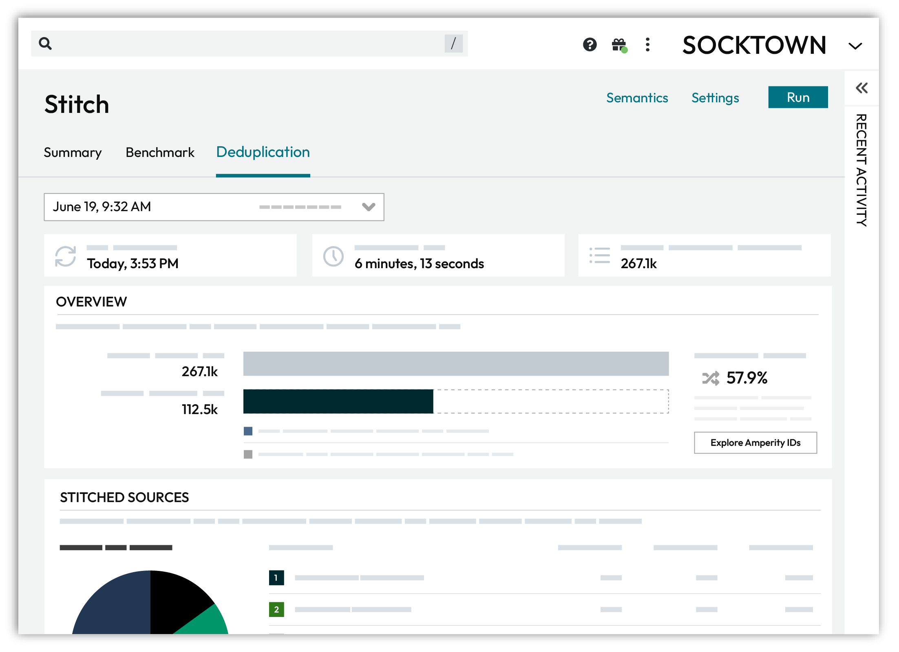

.. https://docs.amperity.com/infrastructure/

.. meta::
    :description lang=en:
        The Deduplication tab compares customer profiles created by identity resolution to profile records in source data. 

.. meta::
    :content class=swiftype name=body data-type=text:
        The Deduplication tab compares customer profiles created by identity resolution to profile records in source data. 

.. meta::
    :content class=swiftype name=title data-type=string:
        About deduplication

==================================================
About deduplication
==================================================

.. stitch-deduplication-common-start

The **Stitch** page shows the outcome of identity resolution, including

* A :doc:`summary of changes <stitch_summary>` within an identity graph over time
* A :doc:`collection of benchmarks <stitch_benchmarks>` against which you can measure the quality of an identity graph
* A :doc:`data explorer for deduplicated records <stitch_deduplication>` organized by data source

.. stitch-deduplication-common-end

.. _stitch-deduplication-status:

Deduplication status page
==================================================

.. stitch-deduplication-status-start

The **Deduplication** tab shows a high-level set of statistics about the current state of identity resolution with links to exploring each area in more detail.

Open the :ref:`Data Explorer <stitch-deduplication-explore-by-amperity-id>` to view :ref:`Cluster graphs <stitch-deduplication-explore-cluster-graph>`, :ref:`pairwise connections <stitch-deduplication-explore-pairwise-connections>`, and :ref:`individual customer profiles created by identity resolution <stitch-deduplication-explore-stitched-records>`.

Compare :ref:`data sources <stitch-deduplication-explore-by-data-source>` and the :ref:`rate of deduplication <stitch-deduplication-explore-deduplication-rate>` across sources.

.. stitch-deduplication-status-start

.. _stitch-deduplication-explore-by-amperity-id:

Data Explorer
--------------------------------------------------

.. include:: ../../shared/terms.rst
   :start-after: .. term-amperity-id-start
   :end-before: .. term-amperity-id-end

.. stitch-deduplication-explore-by-amperity-id-start

As new data is input to Amperity, identity resolution identifies when new or changed data applies to existing clusters of customer records, and then updates those records, maintains the cluster, and retaining a stable Amperity ID assignment. A new Amperity ID is only created when new individuals are identified.

.. stitch-deduplication-explore-by-amperity-id-end

.. include:: ../../shared/terms.rst
   :start-after: .. term-amperity-id-format-start
   :end-before: .. term-amperity-id-format-end

.. stitch-deduplication-explore-by-amperity-id-continued-start

Amperity IDs do not replace primary and foreign keys already assigned in customer data. Amperity IDs exist alongside primary and foreign keys within the customer 360 profile and act as key for finding clusters of unique customer records.

.. stitch-deduplication-explore-by-amperity-id-continued-end

**To explore data**

.. stitch-deduplication-explore-by-amperity-id-steps-start

#. From the **Stitch** tab, click the **Explore Amperity IDs** button.
#. This opens the **Data Explorer** to the **Stitched Records** tab.
#. Use the left and right arrows surrounding the full name to view additional records.
#. Click through each record and each tab. When finished exploring, click **Close**.

.. stitch-deduplication-explore-by-amperity-id-steps-end

.. _stitch-deduplication-explore-by-data-source:

Explore by data source
--------------------------------------------------

.. stitch-deduplication-explore-by-data-source-start

The **Stitched Sources** section of the **Stitch** page shows a comparison of domain tables and the record pairs identified both within each data source and across all data sources. This is presented as an UpSet Plot chart with links to the underlying data sources via the **Data Explorer**.

.. stitch-deduplication-explore-by-data-source-end

.. stitch-deduplication-explore-by-data-source-upset-plot-start

The following diagram shows the components of the UpSet plot chart, inclusive of the distribution of Amperity IDs across all data sources, and then for each data source, an individual breakdown of how that data source compares to all other data sources. An UpSet plot chart have a row for each data source. This diagram shows the first two only.

.. stitch-deduplication-explore-by-data-source-upset-plot-end

.. image:: ../../images/mockup-stitch-tab-upset-plot.png
   :width: 450 px
   :alt: An UpSet plot chart, located within the Stitch page in Amperity.
   :align: left
   :class: no-scaled-link

.. stitch-deduplication-explore-by-data-source-upset-plot-explanation-start

Each individual stitched data source can be explored from the UpSet plot. The UpSet plot includes a source-by-source breakdown of stitched data. For each record, a **View source** link is available. This opens the **Data Explorer** and displays a **Schema** for the data source that shows the name of the field as it is defined in customer data, the data type, the Amperity semantic applied to the field, and sample data. A **Sample** shows 100 records from that data source, where each of the fields defined in the customer data source are presented as columns of data.

.. stitch-deduplication-explore-by-data-source-upset-plot-explanation-end

**To explore by data source**

.. stitch-deduplication-explore-by-data-source-steps-start

#. From the **Stitch** tab, under **Stitched Sources**, review the UpSet plot chart.
#. Click the database table name for any database table in the Upset plot chart to view more information about that data source.
#. Click the **View source** link to open the **Data Explorer** for that table, in which you can review the schema and view sample data.
#. When finished exploring, click **Close**.

.. stitch-deduplication-explore-by-data-source-steps-end

.. _stitch-deduplication-explore-previous-stitch-results:

Explore previous Stitch results
--------------------------------------------------

.. stitch-deduplication-explore-previous-stitch-results-start

You can explore previous Stitch results from the **Stitch** tab. From the **Stitch** tab, next to the **Stitch** page title, select a result from the dropdown menu to view the Stitch results for that Stitch run.

.. stitch-deduplication-explore-previous-stitch-results-end

.. _stitch-deduplication-explore-semantics:

Explore semantics
--------------------------------------------------

.. include:: ../../shared/terms.rst
   :start-after: .. term-semantic-start
   :end-before: .. term-semantic-end

.. stitch-deduplication-explore-semantics-start

The **Semantics** link at the top of the **Stitch** page opens a dialog box that lists the configured semantics made available to Stitch from domain tables. This list is broken down by domain table, and then by semantic. For each semantic, it lists the semantic, its data type, and the name of the field as defined in customer data.

.. stitch-deduplication-explore-semantics-end

**To explore semantics**

.. stitch-deduplication-explore-semantics-steps-start

#. From the **Stitch** tab, click the **Semantics** link. This opens the **Stitch Tools** dialog box.
#. Each table that contains stitched records is listed in the dialog box.
#. For each table, a list of semantic names, their types, and the fields to which they are associated is listed.
#. When finished, click **Close**.

.. stitch-deduplication-explore-semantics-steps-end

.. _stitch-deduplication-explore-cluster-graph:

View cluster graph
--------------------------------------------------

.. include:: ../../shared/terms.rst
   :start-after: .. term-clustering-start
   :end-before: .. term-clustering-end

.. include:: ../../shared/terms.rst
   :start-after: .. term-cluster-graph-start
   :end-before: .. term-cluster-graph-end

.. stitch-deduplication-explore-cluster-graph-start

The **Cluster Graph** tab in the **Data Explorer** shows a graph with a line relationship between each stitched record, along with a detailed breakdown of PII similarities and differences for each pair of stitched records in the cluster graph.

.. stitch-deduplication-explore-cluster-graph-end

.. image:: ../../images/mockup-stitch-tab-cluster-graph.png
   :width: 600 px
   :alt: The data explorer, showing the cluster graph.
   :align: left
   :class: no-scaled-link

**To view the cluster graph**

.. stitch-deduplication-explore-cluster-graph-steps-start

#. From the **Stitch** tab, click the **Explore Amperity IDs** button.
#. This opens the **Data Explorer** to the **Stitched Records** tab.
#. Click the **Cluster Graph** tab.
#. In the cluster graph, select individual lines to view the details for that pair of records. The columns on the right shows the fields in the records that are associated with PII semantics. Compare the values on each side to see how these two records match.
#. Use the left and right arrows surrounding the full name to view additional cluster graphs for additional record clusters.
#. When finished exploring, click **Close**.

.. stitch-deduplication-explore-cluster-graph-steps-end

.. _stitch-deduplication-explore-deduplication-rate:

View deduplication rate
--------------------------------------------------

.. include:: ../../shared/terms.rst
   :start-after: .. term-deduplication-rate-start
   :end-before: .. term-deduplication-rate-end

**Example**

.. stitch-deduplication-explore-deduplication-rate-example-start

A tenant has three sources of customer records represented by tables 1, 2, and 3. In the Stitch report the:

* Total number of records is 314.1k
* Total number of clusters is 212.0k
* Overall deduplication rate is 32.5%
* Individual deduplication rates for three customer records are 7.7%, 6.6%, and 0%

How is this possible?

The overall deduplication rate (32.5%) represents the total number of records relative to the number of Amperity IDs. There can be a low deduplication rate on individual tables, but high connectivity between tables.

An UpSet plot chart has a row for each table. In this case, the row for table 1 shows 117k source IDs and 108k Amperity IDs. This represents a 7.7% deduplication rate.

Next compare the overlap between customer records 1 and 3 by hovering over customer record 1. The hover box shows there are more than 69k records shared between tables 1 and 3. This is a significant amount of overlap between two tables and is the primary contributor to the 32.5% overall deduplication rate.

.. admonition:: Deduplication rate, explained

   The deduplication rate is the reduction that occurs when the total number of Amperity IDs are compared to the original source IDs provided in customer data. For example:

   #. Total records: 314.1k. The sum of all records from all tables.
   #. Total clusters: 212.0k. The sum of all clusters from all tables.
   #. Records in table 1: 117k. The sum of all records in table 1.
   #. Clusters in table 1: 108k. The sum of all clusters in table 1.

   The overall deduplication rate is 32.5%:
   
   ::

     100 * [(314.1k - 212.9k) / 314.1k] = 32.5%

   The deduplication rate for table 1 is 7.7%:
   
   ::

     100 * [(117k - 108k) / 117k] = 7.7%

.. important:: Deduplication rate depends on many factors. The previous example shows deduplication rate for a database that does not use customer keys:

   ::

      (total customer records - Amperity IDs) /  (total customer records)

   When a database uses customer keys, the math to determine deduplication rate is the same, but the starting point is the customer keys.

   ::

      (total customer key records - Amperity IDs) /  (total customer key records)

.. stitch-deduplication-explore-deduplication-rate-example-end

**To view deduplication rate**

.. stitch-deduplication-explore-deduplication-rate-steps-start

#. From the **Stitch** tab, under **Overview**, review the total source IDs and total Amperity IDs.
#. The deduplication rate is shown on the right as a percentage.

.. stitch-deduplication-explore-deduplication-rate-steps-end

.. _stitch-deduplication-view-notifications:

View notifications
--------------------------------------------------

.. stitch-deduplication-view-notifications-start

Notifications for Stitch reports that run in the **Stitch** page appear after Amperity creates clusters of records based on the connection between pairs, and then gives each cluster a unique Amperity ID. Notifications typically indicate successful outcomes. Less often, notifications contain details for non-successful outcomes, such as failures related to upstream or downstream processes.

.. stitch-deduplication-view-notifications-end

.. image:: ../../images/mockup-notifications-stitch-report.png
   :width: 600 px
   :alt: The notifications pane sits on the right side of the Stitch page.
   :align: left
   :class: no-scaled-link

.. stitch-deduplication-view-notifications-context-start

If a notification is about a non-successful outcome, the details for why and what happened can be found in the notification itself. Click **More** to view the full notification. Click **View Workflow** to open the workflow in the **Workflows** page.

In some cases viewing the log files may be helpful. In many cases, fix the root cause of the non-successful outcome, and then rerun the process manually. The **Workflows** page provides a set of workflow actions that you can initiate directly.

.. stitch-deduplication-view-notifications-context-end

.. _stitch-deduplication-explore-pairwise-connections:

View pairwise connections
--------------------------------------------------

.. include:: ../../shared/terms.rst
   :start-after: .. term-pairwise-connection-start
   :end-before: .. term-pairwise-connection-end

.. stitch-deduplication-explore-pairwise-connections-start

The **Pairwise Connections** tab in the **Data Explorer** shows a breakdown of stitched record pairs by score.

.. stitch-deduplication-explore-pairwise-connections-end

.. image:: ../../images/mockup-stitch-tab-pairwise-connection.png
   :width: 600 px
   :alt: The data explorer, showing pairwise connections.
   :align: left
   :class: no-scaled-link

.. include:: ../../shared/terms.rst
   :start-after: .. term-pairwise-connection-score-start
   :end-before: .. term-pairwise-connection-score-end

**To view pairwise connections**

.. stitch-deduplication-explore-pairwise-connections-steps-start

#. From the **Stitch** tab, click the **Explore Amperity IDs** button.
#. This opens the **Data Explorer** to the **Stitched Records** tab.
#. Click the **Pairwise Connections** tab.
#. Pairwise connections are broken into categories by strength of connection: exact matches, excellent matches, high matches, moderate matches, weak matches, and no matches. Click each category to view individual records by strength of connection.
#. Use the left and right arrows surrounding the full name to view additional pairwise connections for additional record clusters.
#. When finished exploring, click **Close**.

.. stitch-deduplication-explore-pairwise-connections-steps-end

.. _stitch-deduplication-explore-stitch-metrics:

View Stitch metrics
--------------------------------------------------

.. stitch-deduplication-explore-stitch-metrics-start

You can view metrics for changes to records and Amperity IDs that may have occurred between Stitch runs. Click the **Stitch Metrics** link in the notifications pane to open the **Stitch Metrics** dialog box.

.. stitch-deduplication-explore-stitch-metrics-end

.. stitch-deduplication-explore-stitch-metrics-context-start

This dialog box identifies the tenant, the time at which the job started, the ID for the Stitch report, and the Stitch ID, and then shows the following details about this Stitch run:

* The collapsed ID count refers to the number of records present after nearly identical records were removed.
* The related pairs count shows number of unique record pairs that were identified by a blocking strategy.
* The filtered related pairs count shows the number of unique record pairs that scored above the matching category threshold.

The table contains a row for each data source that was made available for identity resolution, along with columns for each row that show:

* The number of Amperity IDs in the current Stitch run.
* The number of Amperity IDs in the previous Stitch run.
* The number of Amperity IDs in the current Stitch run that were not in the previous Stitch run.
* The number of Amperity IDs that were in the previous Stitch run, but are not in the current Stitch run.
* The number of distinct cluster transitions. A cluster transition occurs when records move from one cluster to another.
* The number of distinct cluster transitions, including those from records added to or deleted from the dataset.

.. stitch-deduplication-explore-stitch-metrics-context-end

.. _stitch-deduplication-explore-stitched-records:

View stitched records
--------------------------------------------------

.. include:: ../../shared/terms.rst
   :start-after: .. term-stitched-record-start
   :end-before: .. term-stitched-record-end

.. stitch-deduplication-explore-stitched-records-start

The **Stitched Records** tab in the **Data Explorer** shows a table with a row for each of the individual records that share the same Amperity ID.

.. stitch-deduplication-explore-stitched-records-end

.. image:: ../../images/mockup-stitch-tab-stitched-records.png
   :width: 600 px
   :alt: The data explorer, showing stitched records.
   :align: left
   :class: no-scaled-link

**To view stitched records**

.. stitch-deduplication-explore-stitched-records-steps-start

#. From the **Stitch** tab, click the **Explore Amperity IDs** button.
#. This opens the **Data Explorer** to the **Stitched Records** tab.
#. All of the records that are associated with the same Amperity ID are listed. Columns show the differences beween each record.
#. When finished exploring, click **Close**.

.. stitch-deduplication-explore-stitched-records-steps-end

.. _stitch-deduplication-profile-attributes-interactions:

View profile attributes and interactions
--------------------------------------------------

.. stitch-deduplication-profile-attributes-interactions-start

The **Profile attributes** and **Interactions** tabs are available in the data explorer. These show information about customer 360 attributes and interaction records for an individual customer.

.. stitch-deduplication-profile-attributes-interactions-end

**To view profile attributes**

.. stitch-deduplication-configure-profile-attributes-start

#. Create a database with the **Unified Scores** and **Unified Customer** tables, and add a customer 360 table that is tagged with a table semantic.
#. In the query editor select the database.
#. Create and run a query that returns a list of customers.
#. Click an Amperity ID in the results to open the data explorer.
#. On the **Interactions** tab, select a table in the **Show matching records from** field. 
#. View each interaction record.

.. stitch-deduplication-configure-profile-attributes-end
