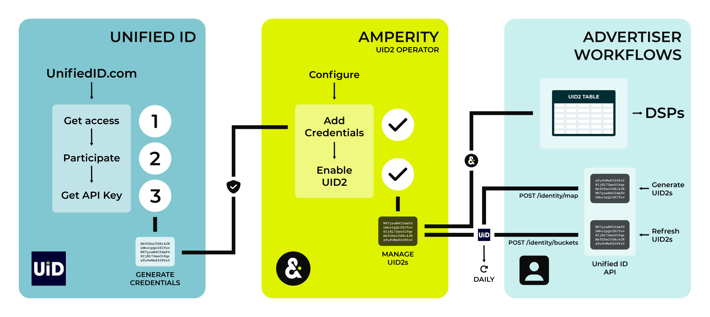
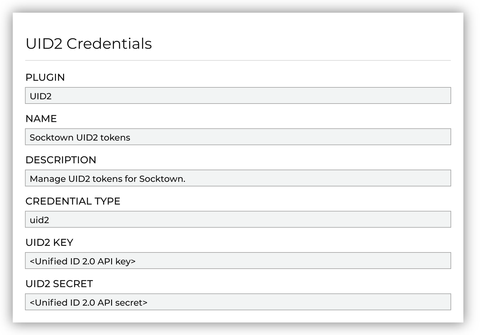
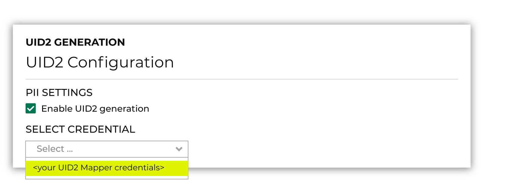

.. https://docs.amperity.com/reference/

.. meta::
    :description lang=en:
        Amperity may be configured to act as a Unified ID 2.0 Operator for your brand.

.. meta::
    :content class=swiftype name=body data-type=text:
        Amperity may be configured to act as a Unified ID 2.0 Operator for your brand.

.. meta::
    :content class=swiftype name=title data-type=string:
        About Unified ID 2.0 (UID2)

==================================================
About Unified ID 2.0 (UID2)
==================================================

.. uid2-overview-start

Unified ID 2.0 (UID2) is an `open-source framework <https://unifiedid.com/docs/intro>`__ |ext_link| that enables deterministic identity for advertising opportunities across the open internet for participants with access to the advertising ecosystem. UID2 is a standalone solution with a unique namespace and privacy controls that help participants meet local market requirements.

.. uid2-overview-end

.. _uid2-howitworks:

How UID2 works
==================================================

.. uid2-howitworks-start

Amperity may be configured as a UID2 Operator. A `UID2 Operator <https://unifiedid.com/docs/ref-info/ref-operators-public-private>`__ |ext_link| is a participant in Unified ID 2.0 that is allowed to run the Operator Service. Operators may receive and store encryption keys and salts from the UID2 Core Service, salt and hash personal data to return raw UID2s, encrypt raw UID2s to generate UID2 tokens, and distribute UID2 token decryption keys.

.. uid2-howitworks-end

.. uid2-howitworks-table-start

The following sections describe at a high level the series of steps that are required to configure Amperity to act as a UID2 Operator for your brand.

.. list-table::
   :widths: 10 90
   :header-rows: 0

   * - .. image:: ../../images/steps-01.png
          :width: 60 px
          :alt: Image panel 1.
          :align: left
          :class: no-scaled-link
     - Before you can configure Amperity to act as a UID2 Operator for your brand you must do the following:

       #. :ref:`Request access to UID2 <uid2-prerequisite-get-access>`.
       #. :ref:`Agree to the UID2 participation policy <uid2-prerequisite-participate>`.
       #. :ref:`Get an API key <uid2-prerequisite-get-credentials>` for the **Mapper** participant type. Use the credentials for this API key to allow Amperity to access endpoints in the UID2 API and act as a UID2 Operator for your brand.

   * - .. image:: ../../images/steps-02.png
          :width: 60 px
          :alt: Image panel 2.
          :align: left
          :class: no-scaled-link
     - After your brand has adopted UID2 as part of your identity strategy you can configure Amperity to act as a UID2 Operator for your brand.

       #. :ref:`Add your brand's credentials for UID2 to Amperity <uid2-configure-amperity-add-credentials>`.
       #. :ref:`Enable UID2 <uid2-configure-amperity-enable-uid2>`.
       #. :ref:`Add the UID2 table <uid2-configure-amperity-add-uid2-table>` to your brand's database.

       Use custom database tables, queries, and/or segments to configure Amperity to support your brand's use cases for UID2.

       .. admonition:: How does Amperity maintain UID2 tokens?

          Amperity uses the following UID2 endpoints when Amperity is configured to act as a UID2 Operator for your brand:

          #. Amperity sends an API request to Unified ID 2.0 using the `POST /identity/buckets <https://unifiedid.com/docs/endpoints/post-identity-buckets>`__ |ext_link| endpoint to identify salt buckets that have expired. All UID2 tokens associated with an expired salt bucket are refreshed.

          #. Amperity sends an API request to Unified ID 2.0 using the `POST /identity/map <https://unifiedid.com/docs/endpoints/post-identity-map>`__ |ext_link| endpoint. This request contains a list of email addresses that are pulled from the **Unified Coalesced** table.

             The **POST /identity/map** endpoint responds with three values: a hashed email address, an advertising ID (the UID2 token), and a salt bucket ID.

          #. Amperity adds the original email address, normalized email address, advertising ID, and salt bucket ID to the **UID2** table.

   * - .. image:: ../../images/steps-03.png
          :width: 60 px
          :alt: Image panel 3.
          :align: left
          :class: no-scaled-link
     - Build workflows against the **UID2** table to support your brand's :ref:`UID2 workflows <uid2-workflows>`.

       Use custom database tables, queries, and segments in Amperity to build audiences of UID2 tokens that support your brand's advertising strategies. Send these audiences to demand-side platforms (DSPs) that participate in Unified ID 2.0, such as The Trade Desk.

       DSPs can receive UID2s from advertisers as first- and/or third-party data. Advertisers buy impressions across a range of publisher sites. DSPs help advertisers decide which ad impressions to purchase and how much to bid on them.

.. uid2-howitworks-table-end

.. _uid2-prerequisites:

Prerequisites
==================================================

.. uid2-prerequisites-start

Before your brand can configure Amperity to generate UID2 tokens you must do the following:

#. :ref:`Get access to UID2 <uid2-prerequisite-get-access>`.
#. Agree to :ref:`a UID2 participation policy <uid2-prerequisite-participate>`, which is a legal requirement for UID2 sharing.
#. :ref:`Get an API key <uid2-prerequisite-get-credentials>`. Use the credentials for this API key to allow Amperity to access endpoints in the UID2 API and act as a UID2 Operator for your brand.

.. uid2-prerequisites-end

.. _uid2-prerequisite-get-access:

Get access to UID2
--------------------------------------------------

.. uid2-prerequisite-get-access-start

To get access to the UID2 framework, you may sign up directly from the `Unified ID 2.0 <https://unifiedid.com/request-access>`__ |ext_link| website or connect directly with your The Trade Desk representative (or UID2 administrator).

.. uid2-prerequisite-get-access-end

.. _uid2-prerequisite-participate:

Participate in UID2
--------------------------------------------------

.. uid2-prerequisite-participate-start

You must agree to a UID2 participation policy, which is a `requirement for UID2 sharing <https://unifiedid.com/docs/getting-started/gs-sharing#legal-requirements-for-uid2-sharing>`__ |ext_link|.

.. important:: Talk with your The Trade Desk representative if you are unsure of which `participation policy <https://unifiedid.com/docs/intro#participants>`__ |ext_link| is required to support your brand's UID2 use cases.

.. uid2-prerequisite-participate-end

.. _uid2-prerequisite-get-credentials:

Get Mapper credentials
--------------------------------------------------

.. uid2-prerequisite-get-credentials-start

Each participant in UID2 has its own set of unique `Mapper credentials <https://unifiedid.com/docs/getting-started/gs-credentials>`__ |ext_link|, which allow access to specific areas within the UID2 ecosystem.

To configure Amperity to act as a UID2 Operator for your brand you must be a **Mapper** participant in Unified ID 2.0.

A mapper participant is a broad category that includes `advertisers <https://unifiedid.com/docs/overviews/overview-advertisers>`__ |ext_link|, `data providers <https://unifiedid.com/docs/overviews/overview-data-providers>`__ |ext_link|, data on-boarders, measurement providers, identity graph providers, third-party data providers, and any other organization that sends data to other participants *and* organizations that collect user data and push it to other UID2 participants.

.. important:: Use your brand's **Mapper** participant credentials to configure Amperity to act as a UID2 Operator.

.. uid2-prerequisite-get-credentials-end

.. _uid2-configure-amperity:

Configure Amperity
==================================================

.. uid2-configure-amperity-start

After your brand has adopted UID2 as part of your identity strategy you can configure Amperity to act as a UID2 Operator for your brand.

#. :ref:`Add your brand's Mapper credentials for UID2 to Amperity <uid2-configure-amperity-add-credentials>`.
#. :ref:`Enable UID2 <uid2-configure-amperity-enable-uid2>`.
#. :ref:`Add the UID2 table <uid2-configure-amperity-add-uid2-table>` to your brand's database.

.. uid2-configure-amperity-end

.. _uid2-configure-amperity-add-credentials:

Add Mapper credentials
--------------------------------------------------

.. uid2-configure-amperity-add-credentials-start

Add credential to **Credentials** tab in **Settings**.

Add your brand's Mapper credentials for UID2 to Amperity. Open the **Settings** page, select the **Credentials** tab, and then click **Add credential**.

Choose the **UID2** plugin. Provide a name and description for the credential that ensures users within your tenant know it's related to UID2. Add the API key and the client secret for your brand's **Mapper** participant credentials.

.. uid2-configure-amperity-add-credentials-end

.. _uid2-configure-amperity-enable-uid2:

Enable UID2 token generation
--------------------------------------------------

.. uid2-configure-amperity-enable-uid2-start

UID2 token generation is enabled from the **Customer 360** page. Click the **UID2** link to open the **UID2 Generation** dialog box. Select the **Enable UID2 generation** checkbox, and then choose your brand's **Mapper** credentials from the **Select credentials** dropdown.

.. uid2-configure-amperity-enable-uid2-end

.. _uid2-configure-amperity-add-uid2-table:

Add UID2 table to database
--------------------------------------------------

.. uid2-configure-amperity-add-uid2-table-start

Add the **UID2** table to any database as a passthrough table. The **UID2** table is a core table.

.. uid2-configure-amperity-add-uid2-table-end

.. include:: ../../amperity_reference/source/data_tables.rst
   :start-after: .. data-tables-uid2-table-about-start
   :end-before: .. data-tables-uid2-table-about-end

.. include:: ../../amperity_reference/source/data_tables.rst
   :start-after: .. data-tables-uid2-table-start
   :end-before: .. data-tables-uid2-table-end

.. _uid2-workflows:

About UID2 workflows
==================================================

.. uid2-workflows-start

Use custom database tables, queries, and segments in Amperity to build audiences of UID2 tokens that support your brand's advertising strategies. Send these audiences to demand-side platforms (DSPs) that participate in Unified ID 2.0, such as The Trade Desk.

DSPs can receive UID2s from advertisers as first- and/or third-party data. Advertisers buy impressions across a range of publisher sites. DSPs help advertisers decide which ad impressions to purchase and how much to bid on them.

.. list-table::
   :widths: 10 90
   :header-rows: 0

   * - .. image:: ../../images/steps-check-off-black.png
          :width: 60 px
          :alt: Advertisers and UID2
          :align: center
          :class: no-scaled-link
     - Advertising with UID2 enables the use of use `first-party data <https://unifiedid.com/docs/overviews/overview-advertisers#workflow-for-advertisers>`__ |ext_link| to build omnichannel campaigns across devices using a single identifier. Using UID2 as part of your advertising strategy will help your brand:

       * Manage advertising frequency
       * Suppress audiences across channels and devices
       * Simplify identity resolution for households *and* individuals
       * Create effective advertising in locations where cookies may not exist, such as connected TVs and mobile apps
       * Support better consumer privacy options, including opt-out
       * Improve campaign measurement

   * - .. image:: ../../images/steps-check-off-black.png
          :width: 60 px
          :alt: Data providers and UID2
          :align: center
          :class: no-scaled-link
     - Data providers can use UID2 to enable the use of `third-party data <https://unifiedid.com/docs/overviews/overview-data-providers#workflow-for-data-providers>`__ |ext_link|. This approach to advertising can reduce identity fragmentation and connect third-party data to a more durable, omnichannel, cross-device identifier.

.. uid2-workflows-end
