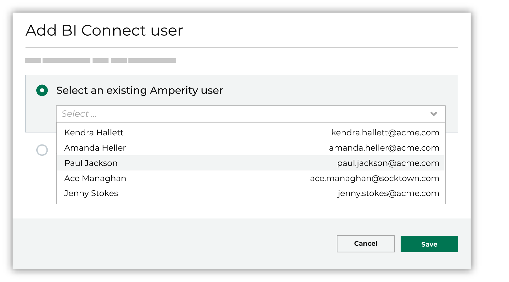
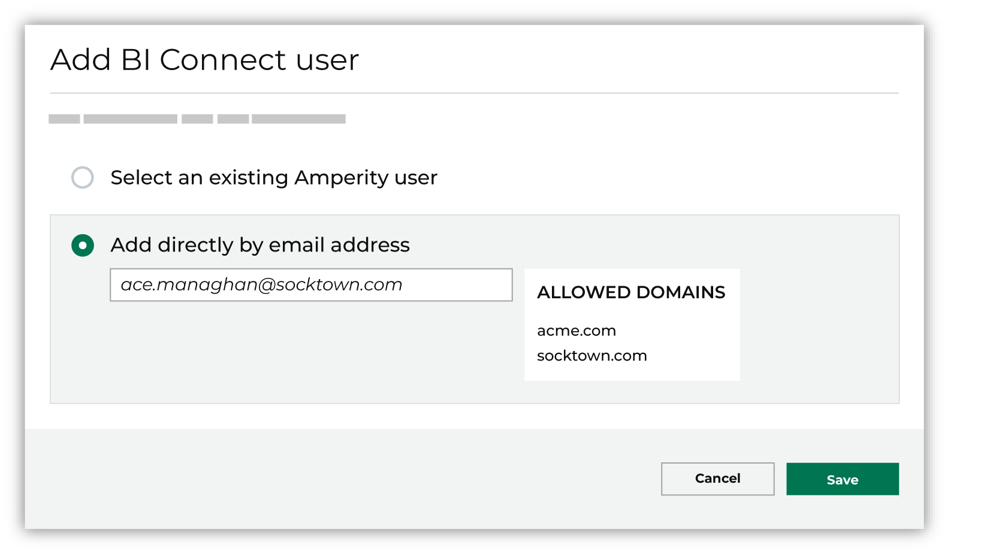

.. 
.. https://docs.amperity.com/reference/
.. 

.. meta::
    :description lang=en:
        The Users and Activity page lets you configure how users from your organization can access Amperity.

.. meta::
    :content class=swiftype name=body data-type=text:
        The Users and Activity page lets you configure how users from your organization can access Amperity.

.. meta::
    :content class=swiftype name=title data-type=string:
        About users and activity

==================================================
About users and activity
==================================================

.. users-and-activity-start

All of the users and all of their associated activity can be viewed and managed from a single page in the Amperity admin user interface. User access to Amperity is managed in two steps:

#. Authentication determines and validates who the user is.
#. Authorization determines what that user is allowed to do.

An unauthorized user may not access Amperity; an authorized user may only view and interact with what their policy allows.

.. users-and-activity-manage-end

.. _users-manage:

Manage Users
==================================================

.. users-manage-start

The **Users** section allows users assigned the :ref:`Allow user administration <policies-allow-user-administration>` policy option to self-service the management of individual users who have access to your tenant.

.. users-manage-end

.. users-manage-context-start

All of the users and all of their associated activity can be viewed and managed from the **Users and Activity** page. User access to Amperity is managed in two steps:

#. Authentication determines and validates who the user is.
#. Authorization determines what that user is allowed to do.

An unauthorized user may not access Amperity; an authorized user may only view and interact with the areas within Amperity to which their policy allows access.

.. users-manage-context-end

.. _users-manage-add:

Add users
--------------------------------------------------

.. users-manage-add-start

Before a user can log into Amperity they must be added and a policy must be assigned to them. The Amperity admin interface allows users to be managed directly using name and password authentication.

.. users-manage-add-end

**To add a user**

.. users-manage-add-steps-start

#. Open the **Users & Activity** page.
#. Click **Add User**. This opens the **Add User** dialog box.
#. Enter the user's full name (e.g. "Justin Currie") and the email address with which they will log into Amperity (e.g. "justin.currie@amperity.com"). Only users from a :ref:`known domain <users-manage-allow-domains>` are allowed to access Amperity.
#. Select the :doc:`policy to which this user will be assigned <policies>`.
#. Select a :ref:`resource group to which this user will be assigned <users-resource-groups>`.
#. Be sure to send the user a welcome to Amperity email. (This is enabled by default.)
#. Click **Save**.

.. users-manage-add-steps-end

.. _users-manage-delete:

Delete users
--------------------------------------------------

.. users-manage-delete-start

All users who should no longer be allowed access to Amperity should be deleted. This will delete the user for **all** tenants to which that user is assigned. Use the :ref:`revoke tenant access <users-manage-revoke>` process to delete a user from a tenant when that user has access to more than one tenant.

.. users-manage-delete-end

**To delete a user**

.. users-manage-delete-steps-start

#. Open the **Users & Activity** page.
#. Under **Users**, from the list of users, select the ellipses menu, and then click **Delete**.

.. users-manage-delete-steps-end

.. _users-manage-edit:

Edit users
--------------------------------------------------

.. users-manage-edit-start

If the details for a user change, such as changing the policy to which they are associated, their details may be updated.

.. users-manage-edit-end

**To edit a user**

.. users-manage-edit-steps-start

#. Open the **Users & Activity** page.
#. Under **Users**, from the list of users, select the ellipses menu, and then click **Edit**. The **Edit User** dialog box opens.
#. Make your changes.
#. Click **Save**.

.. users-manage-edit-steps-end

.. _users-manage-revoke:

Revoke tenant access
--------------------------------------------------

.. users-manage-revoke-start

Amperity users may have access to more than one tenant in Amperity. For example when two brands are managed as separate tenants. If a user has access to more than one set of data, access to an individual tenant may be revoked, which will prevent the user from being able to access this tenant. Access to any other tenant to which that user is assigned remains unchanged.

.. users-manage-revoke-end

**To revoke tenant access**

.. users-manage-revoke-steps-start

#. Open the **Users & Activity** page.
#. Under **Users**, from the list of users, select the ellipses menu, and then click **Revoke tenant access**.

.. users-manage-revoke-steps-end

.. _users-manage-allow-domains:

Allowed domains
--------------------------------------------------

.. users-manage-allow-domains-start

Only users from an allowed domain may access Amperity. Amperity maintains a list of approved domains for all users. This acts as an additional step to verify that users who access your brand's Amperity tenant are approved users. Users cannot be created using an unknown domain.

.. users-manage-allow-domains-end

**To allow a domain**

.. users-manage-allow-domains-steps-start

#. Open the **Users & Activity** page.
#. Under **Users** click **Add User**. The **Add user** dialog box opens.
#. Under **Allowed domains**, click the **Request domain** link.
#. Add the domain for which the request is being made, and then specify the reason why it should be allowed.
#. Click **Send**.

.. users-manage-allow-domains-steps-end

.. _users-sso:

About SSO group mappings
==================================================

.. users-and-activity-manage-sso-start

Amperity supports the use of :doc:`single sign-on (SSO) <sso>` to manage the users who can access your tenant.

.. users-and-activity-manage-sso-end

.. _users-resource-groups:

About resource groups
==================================================

.. include:: ../../shared/terms.rst
   :start-after: .. term-resource-group-start
   :end-before: .. term-resource-group-end

.. _users-resource-groups-all-resource-groups:

"All resource groups"
--------------------------------------------------

.. users-resource-groups-all-resource-groups-start

Amperity includes one default resource group: "All resource groups".

Users that are granted access to the "All resource groups" resource group are allowed to interact with all of the databases in the **Customer 360** page.

.. users-resource-groups-all-resource-groups-end

.. _users-resource-groups-custom-resource-groups:

Custom resource groups
--------------------------------------------------

.. users-resource-groups-custom-resource-groups-start

Use a custom resource group to support any combination of team member access to brand-specific databases.

.. note:: Users who are associated with a custom resource group cannot access the **Sources** page. (The **Sources** page requires users to be able to access all data available to the tenant.)

   Users who are associated with a custom resource group *may* be able to view the **Stitch** page (depending on their policy), but will not be able to view personally identifiable information (PII).

.. users-resource-groups-custom-resource-groups-end

**To add a custom resource group**

.. users-resource-groups-custom-resource-groups-steps-start

#. As a user with **Admin** privileges, open the **Users & Activity** page.
#. Next to **Resource Groups**, click **Add Resource Group**.
#. Enter the name of the custom resource group and a description.
#. Click **Save**.

.. users-resource-groups-custom-resource-groups-steps-end

.. _users-resource-groups-assign-users-to-groups:

Assign users to resource groups
--------------------------------------------------

.. users-resource-groups-assign-users-to-groups-start

Assign a user to a policy, and then associate that policy to a resource group. A user may be assigned to more than one policy. A policy may be associated with any resource group.

Assign users to policies and resource groups when they are added to Amperity. This can be done :ref:`using the Amperity UI <users-manage-add>` or from your identity provider (IdP) when :ref:`managing users with SSO group mappings <users-sso>`.

.. users-resource-groups-assign-users-to-groups-end

.. _users-resource-groups-database-permissions:

Database permissions
--------------------------------------------------

.. users-resource-groups-database-permissions-start

A database may be associated with a single custom resource group. A custom resource group may be associated with more than one database.

.. note:: A database is *always* associated with the "All resource groups" resource group.

A database that is assigned permission to a custom resource group allows users associated with that resource group to:

#. View that database from the **Customer 360** page.
#. View all tables in that database.
#. Configure database exports from that database.
#. Build segments and queries that run against that database.
#. Design campaigns that send the results of segments to downstream workflows.
#. Use destinations to send the results of queries to downstream workflows.

.. note:: Users who are associated with the "All resource groups" resource group are allowed to add and edit databases in the **Customer 360** page and run Spark SQL queries against all of the data in the tenant.

.. users-resource-groups-database-permissions-end

**To set database permissions for a custom resource group**

.. users-resource-groups-database-permissions-steps-start

#. From the **Customer 360** page, under **All Databases**, click the ellipses menu for a database, and then click **Change Permissions**. This opens the **Permissions** dialog box.
#. Click **Standard Access**, and then select a custom resource group from the drop-down list.
#. Click **Save**.

.. users-resource-groups-database-permissions-steps-end

.. _users-resource-groups-multi-brand-tenants:

Multi-brand tenants
--------------------------------------------------

.. users-resource-groups-multi-brand-tenants-start

Use a combination of custom resource groups to define how teams in your organization can interact with brand databases in Amperity, where each custom resource represents a brand.

For example, a tenant with multiple brands, a global analytics team, multiple brand-specific teams, and multiple databases can:

#. Configure a policy for the global analytics team and assign the policy to the "All resource groups" resource group.
#. Define a custom resource group for the owners of brand A, and then configure these owners with a policy that is assigned to the brand A resource group.
#. Define a custom resource group for the owners of brand B, and then configure these owners with a policy that is assigned to the brand B resource group.
#. Configure the database for brand A for permissions to the custom resource group associated with brand A.
#. Configure the database for brand B for permissions to the custom resource group associated with brand B.

This will allow members of the global analytics team to access the databases for brands A and B while ensuring that brand owners can only access their brand's database.

.. users-resource-groups-multi-brand-tenants-end

.. _users-about-bi-connect:

About BI Connect
==================================================

.. include:: ../../shared/terms.rst
   :start-after: .. term-business-intelligence-connect-start
   :end-before: .. term-business-intelligence-connect-end

.. destination-business-intelligence-connect-important-start

.. important:: |bic| is licensed for presentation of Amperity-sourced data within BI tools and contexts. It is not meant to be a general data warehouse solution.

   Loading data into the |bic| data warehouse from sources other than Amperity is considered out-of-license. Customers that wish to load data to the |bic| data warehouse from other data sources should contact their Amperity account team to discuss options.

.. destination-business-intelligence-connect-important-end

.. destination-bic-request-to-enable-start

|bic| is available upon request for Amperity tenants who have licensed Amp360. After the data warehouse for |bic| is configured by Amperity for your tenant, you can send data from Amperity to the data warehouse, and then connect any of your BI tools to that data.

.. destination-bic-request-to-enable-end

.. _users-about-bi-connect-add:

Add BI Connect users
--------------------------------------------------

.. users-about-bi-connect-add-start

Users who are assigned to the **Allow user administration** policy can add BI Connect users. There are two options: add an existing user of Amperity or by using an email address from an allowed domain.

.. users-about-bi-connect-add-end

**From an existing Amperity user**

.. users-about-bi-connect-add-existing-start

A user who has already signed into Amperity may be added directly. On the **Users & Activity** page, next to **BI Connect**, click **Add BI Connect User** and then choose the **Select an existing Amperity user** option.

.. note:: If your tenant is configured to use SSO this user must also be configured in your tenant's identity provider (IdP).

.. users-about-bi-connect-add-existing-end

**From an allowed domain**

.. users-about-bi-connect-add-directly-start

A user who has an email address from an allowed domain may be added directly. On the **Users & Activity** page, next to **BI Connect**, click **Add BI Connect User** and then choose the **Add directly by email address** option.

.. users-about-bi-connect-add-directly-end

.. _users-about-activity:

About user activity
==================================================

.. users-about-activity-start

Amperity maintains records of all user activity that occured in your tenant. For example:

* A user makes a configuration change to the Amperity platform
* A user creates a sandbox
* A user views personally identifiable information (PII)
* A workflow was stopped by a user
* A user configured a destination
* A user created an API key
* A user was assigned to a resource group

All activity may be :ref:`downloaded <users-download-activity>` to a CSV file and individual event, user, and object IDs may be copied.

.. note:: The **Users** section of the **Users and Activity** page requires the user to be assigned the **Allow user administration** policy option.

.. users-about-activity-end

.. users-about-activity-list-start

The activity list displays the following columns:

* **Date** The date and time of the action (displayed in your local time-zone).
* **User** The user who took the action. For most users, this is that user's friendly name or email address.

  An auth token is displayed for users that accesses Amperity programatically.
* **Action** The action taken in the application. Generally this will take the form of "action type/action". For example, activating a segment appears as "segment/activate" and running a segment for download appears as "query.exec/download".

  .. note:: A few actions in the list are not user-initiated. For example, when a user is granted a new authorization policy, both the grant and the receipt appear on separate rows.
* **Object** The object against which the action occurred.

  For example, if a user ran a segment, that segment's name is displayed. If a user sent a segment to a destination, both the name of the segment and the destination name will be displayed. If the user was the recipient of a new authorization policy, the policy name will be displayed.

.. users-about-activity-list-end

.. _users-download-activity:

Download user activity
--------------------------------------------------

.. users-download-activity-start

The Amperity user interface shows the most recent 1000 user activity events. You can download a CSV file that contains events for any date range for which user events are available.

.. users-download-activity-end

**To download user activity**

.. users-download-activity-steps-start

#. From the ellipses menu in the top right, click **Users & Activity**.
#. Under **Activity** click **Download**.
#. A CSV file named **events-yyyy-mm-dd-timestamp.csv** is downloaded.

.. users-download-activity-steps-end

**Column names in the user activity CSV file**

.. users-download-activity-column-names-start

The first row of the user activity file contains the following column headers, and then a row for each tracked event:

.. list-table::
   :widths: 35 65
   :header-rows: 1

   * - column name
     - Description

   * - **event-id**
     - The Amperity internal identifier for the event. This can be used to request additional information about the event, if needed.

   * - **event-type**
     - The :ref:`type of event <users-event-types>`.

       This value is also available from the **Action** column under **Users** on the **Users and Activity** page.

   * - **external-id**
     - Internal value only; this value will be NULL in downloaded log files.

   * - **happened-at**
     - The date and time at which the action occurred. Dates and times are in |ext_iso_8601| format and in UTC.

       This value is also available from the **Date** column under **Users** on the **Users and Activity** page.

       .. note:: The downloaded date and time are in GMT; the Amperity user interface shows the date and time in your local timezone.

   * - **object**
     - The identifier for the object against which the action occurred.

   * - **object-name**
     - A composed string that describes the object(s) for which the action occurred.

       This value is also available from the **Object** column under **Users** on the **Users and Activity** page.

   * - **origin-ip**
     - The IP address that is associated with the user who initiated the action.

   * - **principal-email**
     - The email address for the user who initiated the action.

       This value may be NULL when the user is an API key.

   * - **principal-id**
     - The identifier for the user who initiated the action. This user may be an API key or a non-human user.

   * - **principal-name**
     - The friendly name of the user associated with the activity, if available, otherwise the email address or API key.

       This value is also available from the **User** column under **Users** on the **Users and Activity** page.

   * - **recorded-at**
     - The time at which the system recorded the action. May be slightly different than the value of **happened-at** due to the asynchronous nature of Amperity.

   * - **source**
     - The component within Amperity that added the log entry.

.. users-download-activity-column-names-end

.. _users-event-types:

User activity event types
--------------------------------------------------

.. users-event-types-start

The following table lists the most common event types, grouped by the component or area within Amperity that is most closely associated with the event type.

.. note:: Many events are prefixed with a dot-delimited string that typically starts with "amperity". The specific event is located after a slash ("/"). The following table lists the events by the strings immediately before and after the slash.

   For example, the following event:

   **:amperity.plugin.destination/created**

   is shown in the following table as:

   **destination/created**

   If your tenant shows an event that is not listed in this table, its purpose can often be inferred by the string and the event after the trailing slash. You may open a support ticket to request more information about an event that is not shown in this table. Ask your Amperity support representative for more information about the event, and then request also that this reference be updated.

.. list-table::
   :widths: 35 65
   :header-rows: 1

   * - Event grouping
     - Description

   * - **AI Assistant**
     - The following events are associated with the AI Assistant:

       ``assistant/send-user-message``
          A user sent a question to the AI Assistant. The audit event may include the response from the AI assistant.

       ``query.exec/sampled``
          A set of sample data was provided to the AI Assistant.

          .. note:: More detail about AI Assistant data sharing policies, how the model stores data, and what types of data is sent (or not sent), is available from the |ext_amperity_assistant_privacy_faq|.

   * - **API keys**
     - The following events are associated with API keys:

       ``api-key/created``
          An API key was created.

       ``api-key/deleted``
          An API key was deleted.

       ``api-key/issue``
          An API token issuer was created.

          .. note:: This event is always associated with the following events:

             ``policy/attached``

             and

             ``policy/attached-to``

       ``api-key/updated``
          An API key was updated.

   * - **BI Connect**
     - The following events are associated with BI Connect:

       ``warehouse/user-added``
          A user was added to BI Connect.

       ``warehouse/user-removed``
          A user was removed from BI Connect.

       ``warehouse/user-renewed``
          A user was allowed to continue accessing BI Connect.

   * - **Credentials**
     - The following events are associated with credentials:

       ``credential/created``
          A credential was created.

       ``credential/deleted``
          A credential was deleted.

       ``credential/updated``
          A credential was updated.

   * - **Destinations**
     - The following events are associated with destinations:

       ``destination/cloned``
          A user created a destination by copying an existing destination.

       ``destination/created``
          A user created a destination.

       ``destination/deleted``
          A user deleted a destination.

       ``destination/updated``
          A user updated a destination.

   * - **Domain tables**
     - The following events are associated with domain tables:

       ``workflow/domain-data-records-deletion-started``
          A user deleted records from a domain table.

   * - **Orchestrations**
     - The following events are associated with orchestrations and orchestration groups:

       ``orchestration/run``
          A user initiated a manual run for an orchestration.

       ``orchestration.group/run``
          A user initiated a manual run for an orchestration group.

   * - **Policies**
     - The following events are associated with policies:

       ``policy/attached`` and ``policy/attached-to``
          A policy was was attached to an object that was created within Amperity.

          For example, when a new API token issuer is created, the ``policy/attached`` and ``policy/attached-to`` events are logged and are associated with the name of the API issuer token.

       ``policy/created``
          A policy was created.

       ``policy/deleted``
          A policy was created.

       ``policy/detached`` and ``policy/detached-from``
          A policy was was detached from an object that exists within Amperity.

       ``policy/updated``
          A policy was updated.

       .. important:: Occasionally members of your Amperity team will access your tenant. This is always done as a full administrator.

          In situations where they are helping to troubleshoot an issue, answer a question with more detail, and so on, they will often switch their view to match the policy settings associated with your tenant.

          For example, if the view is switched to "DataGrid Operator", that action is logged using the following event type:

          ``amperity.auth.token/user-switched-policies``

   * - **Privacy rights**
     - The following events are associated with privacy rights workflows:

       ``workflow/domain-ccpa-deletion-started``
          The CCPA delete workflow has started.

   * - **Queries**
     - The following events are associated with the **Queries** page:

       ``query/activated``
          A query was activated.

       ``query/created``
          A query was created.

       ``query/deleted``
          A query was deleted.

       ``query/moved``
          A query was moved from one folder into another.

       ``query.draft/discarded``
          A query in a draft state was discarded.

       ``query.folder/created``
          A folder on the **Queries** page was created.

       ``query.folder/deleted``
          A folder on the **Queries** page was deleted.

   * - **Resource groups**
     - The following events are associated with resource groups:

       ``resource-group/assigned``
          A user was assigned to a resource group.

       ``resource-group/created``
          A resource group was created.

       ``resource-group/deleted``
          A resource group was deleted.

       ``resource-group/updated``
          A resource group was updated.

   * - **Sandboxes**
     - The following events are associated with sandboxes:

       ``tenant/created``
          A sandbox was created.

       ``tenant/deleted``
          A sandbox was deleted.

       ``tenant/updated``
          A sandbox was updated.

       .. note:: These events appear within the sandbox and are followed by the ``policy/attached-to`` and ``policy/attached`` events to allow the user who created the sandbox to access the sandbox as a **DataGrid Administrator**.

   * - **Single Sign-on**
     - The following events are associated with single sign-on (SSO):

       ``group-mapping/created``
          An SSO group mapping was created.

       ``group-mapping/deleted``
          An SSO group mapping was deleted.

       ``group-mapping/updated``
          An SSO group mapping was updated.

   * - **User activity**
     - The following events are associated with the the **Users** section within the **Users and Activity** page:

       ``audit.user-activity/download``
          A user downloaded user activity into a CSV file to view offline.

   * - **Users**
     - The following events are associated with Amperity user accounts that are managed from the **Users and Activity** page:

       ``user/created``
          A user was created.

       ``user/deleted``
          A user was deleted.

       ``user/sent-password-reset-email``
          A user was sent an email to they can reset their password.

   * - **Workflow alerts**
     - The following events are associated with workflow alerts:

       ``audience/created``
          An audience for a workflow alert was created.

          .. note:: This event will show *only* the first time an email addresss or Slack channel is configured to receive workflow alerts for courier groups, scheduled orchestration groups, or campaigns. All subsequent events related to workflow alerts will show the ``audience/updated`` event.

       ``audience/updated``
          The membership of an audience for a workflow alert was updated. This includes adding or removing email addresses and/or Slack channels to or from a workflow alert.

   * - **Workflows**
     - The following events are associated with workflows:

       ``workflow/cancel``
          A workflow resolution was stopped by a user.

       ``workflow/retry``
          A workflow resolution was opened, after which a specific resolution option was selected, and then the workflow was retried.

       ``workflow/skip``
          A user opened a workflow resolution, and then skipped the task that caused the workflow failure.

.. users-event-types-end
