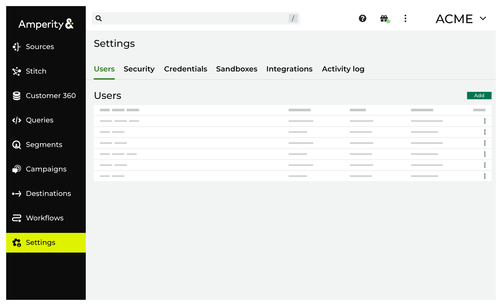

.. https://docs.amperity.com/reference/

.. meta::
    :description lang=en:
        Manage which non-SSO users have access to your tenant.

.. meta::
    :content class=swiftype name=body data-type=text:
        Manage which non-SSO users have access to your tenant.

.. meta::
    :content class=swiftype name=title data-type=string:
        User settings

==================================================
About user settings
==================================================

.. settings-users-start

The **Users** tab on the **Settings** page allows users assigned the :ref:`Allow user administration <policies-allow-user-administration>` policy option to self-service the management of individual users who have access to your tenant.

.. settings-users-end

.. settings-users-context-start

User access to Amperity is managed in two steps:

#. Authentication determines and validates who the user is.
#. Authorization determines what that user is allowed to do.

An unauthorized user may not access Amperity; an authorized user may only view and interact with the areas within Amperity to which their policy allows access.

.. settings-users-context-end

.. _settings-users-add:

Add users
==================================================

.. settings-users-add-start

Before a user can log into Amperity they must be added and a policy must be assigned to them. The Amperity admin interface allows users to be managed directly using name and password authentication.

.. settings-users-add-end

.. settings-users-add-sso-start

.. vale off

.. TODO: Same as in /amperity_reference/sources/settings.rst, but with a link to this section.

.. vale on

.. admonition:: Can users be added when single sign-on (SSO) is enabled?

   Yes. You may configure Amperity to allow access to individual users as long as the domain name in that user's email address is different from the domain name used by your SSO provider.

.. settings-users-add-sso-end

**To add a user**

.. settings-users-add-steps-start

#. Open the **Settings** page, and then select **Users**.
#. Click **Add User**. This opens the **Add User** dialog box.
#. Enter the user's full name, such as "Justin Currie", and the email address with which they will log into Amperity, such as "justin.currie@amperity.com".

   Only users from a :ref:`known domain <settings-users-allow-domains>` are allowed to access Amperity.
#. Select the :doc:`policy to which this user will be assigned <policies>`.
#. Select a :doc:`resource group to which this user will be assigned <resource_groups>`.
#. Be sure to send the user a welcome to Amperity email. This is enabled by default.
#. Click **Save**.

.. settings-users-add-steps-end

.. _settings-users-delete:

Delete users
==================================================

.. settings-users-delete-start

All users who should no longer be allowed access to Amperity should be deleted. This will delete the user for **all** tenants to which that user is assigned. Use the :ref:`revoke tenant access <settings-users-revoke>` process to delete a user from a tenant when that user has access to more than one tenant.

.. settings-users-delete-end

**To delete a user**

.. settings-users-delete-steps-start

#. Open the **Settings** page, and then select **Users**.
#. Under **Users**, from the list of users, select the ellipses menu, and then click **Delete**.

.. settings-users-delete-steps-end

.. _settings-users-edit:

Edit users
==================================================

.. settings-users-edit-start

If the details for a user change, such as changing the policy to which they are associated, their details may be updated.

.. settings-users-edit-end

**To edit a user**

.. settings-users-edit-steps-start

#. Open the **Settings** page, and then select **Users**.
#. Under **Users**, from the list of users, select the ellipses menu, and then click **Edit**. The **Edit User** dialog box opens.
#. Make your changes.
#. Click **Save**.

.. settings-users-edit-steps-end

.. _settings-users-revoke:

Revoke tenant access
==================================================

.. settings-users-revoke-start

Amperity users may have access to more than one tenant in Amperity. For example when two brands are managed as separate tenants. If a user has access to more than one set of data, access to an individual tenant may be revoked, which will prevent the user from being able to access this tenant. Access to any other tenant to which that user is assigned remains unchanged.

.. settings-users-revoke-end

**To revoke tenant access**

.. settings-users-revoke-steps-start

#. Open the **Settings** page, and then select **Users**.
#. Under **Users**, from the list of users, select the ellipses menu, and then click **Revoke tenant access**.

.. settings-users-revoke-steps-end

.. _settings-users-allow-domains:

Allowed domains
==================================================

.. settings-users-allow-domains-start

Only users from an allowed domain may access Amperity. Amperity maintains a list of approved domains for all users. This acts as an additional step to verify that users who access your brand's Amperity tenant are approved users. Users cannot be created using an unknown domain.

.. settings-users-allow-domains-end

**To allow a domain**

.. settings-users-allow-domains-steps-start

#. Open the **Settings** page, and then select **Users**.
#. Under **Users** click **Add User**. The **Add user** dialog box opens.
#. Under **Allowed domains**, click the **Request domain** link.
#. Add the domain for which the request is being made, and then specify the reason why it should be allowed.
#. Click **Send**.

.. settings-users-allow-domains-steps-end

.. _settings-users-multifactor-authentication:

Multi-factor authentication
==================================================

.. settings-users-multifactor-authentication-start

.. TODO: Make the first paragraph a glossary term. /shared/terms.rst + /reference/glossary.rst.

`Multi-factor authentication <https://en.wikipedia.org/wiki/Multi-factor_authentication>`__ |ext_link| (MFA) is a security measure in which a user gains access to an application only after providing additional proof of identity.

Amperity enforces multi-factor authentication for all users who log in with a username and password to help ensure that only authorized users have access to your tenant.

Users must choose one of the following options to enroll in MFA:

* A phone number for contact via SMS
* A one-time password via authenticator app
* A security key

Once initial enrollment in multi-factor authentication is completed, subsequent logins can also use email and recovery codes.

.. settings-users-multifactor-authentication-end

**To reset MFA**

.. settings-users-multifactor-authentication-self-steps-start

#. Click the kebab icon--|fa-kebab|--next to your tenant name.
#. Select **Reset MFA**.

   Users are immediately logged out and prompted to re-enroll in MFA on their next Amperity login.

.. settings-users-multifactor-authentication-self-steps-end

**To reset another user's multi-factor authentication**

You can reset another user's MFA if you are a Datagrid Administrator or you are assigned the "Allow user administration" policy option.

.. settings-users-multifactor-authentication-other-user-steps-start

#. Go to the **Settings** page and click the **Users** tab.
#. Click the kebab icon--fa-kebab--under **Actions** next to the name of the user whose MFA you want to reset.
#. Select **Reset MFA**.

   Users are not logged out, but are required to re-enroll in MFA on their next Amperity login or after the current authorization expires.

.. settings-users-multifactor-authentication-other-user-steps-end
