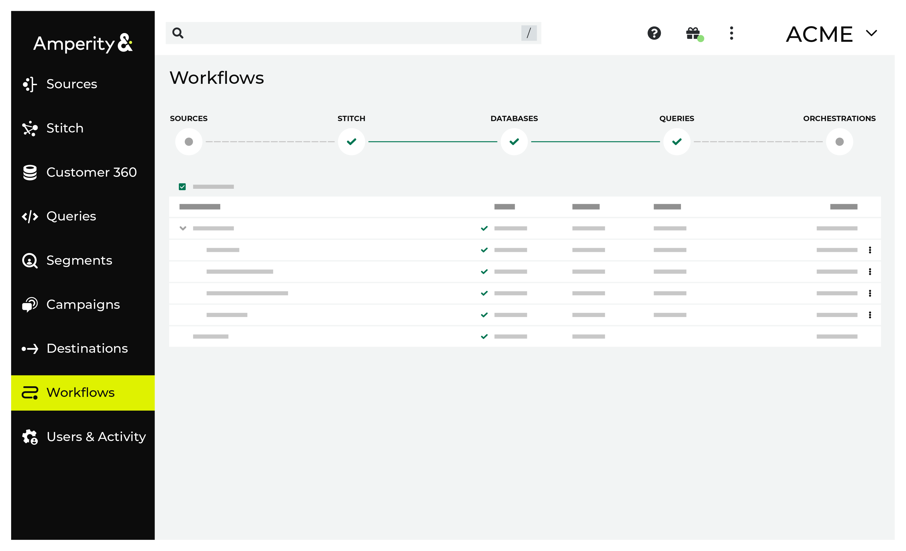
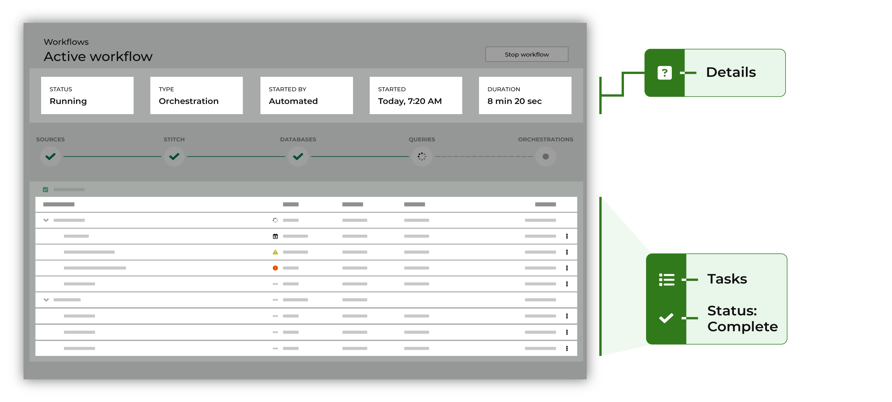
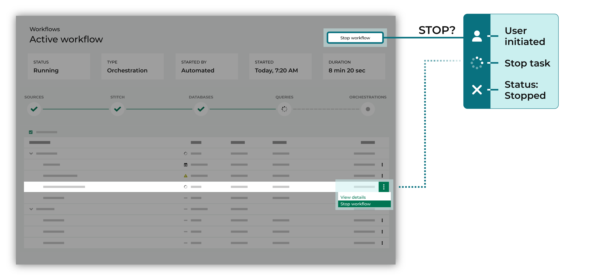
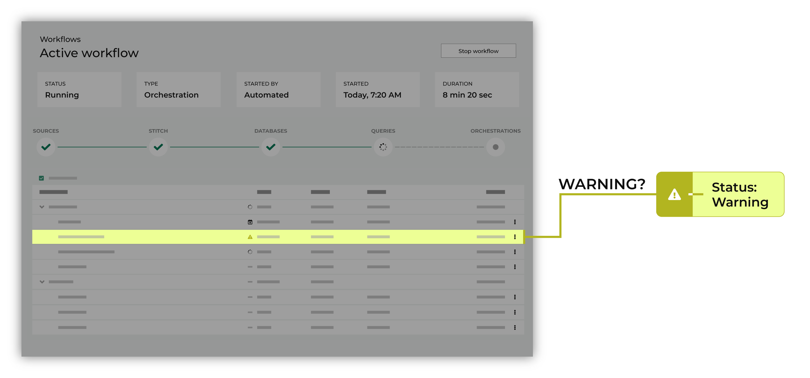
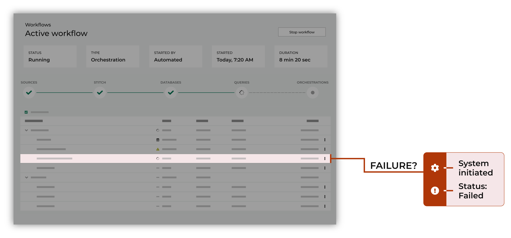
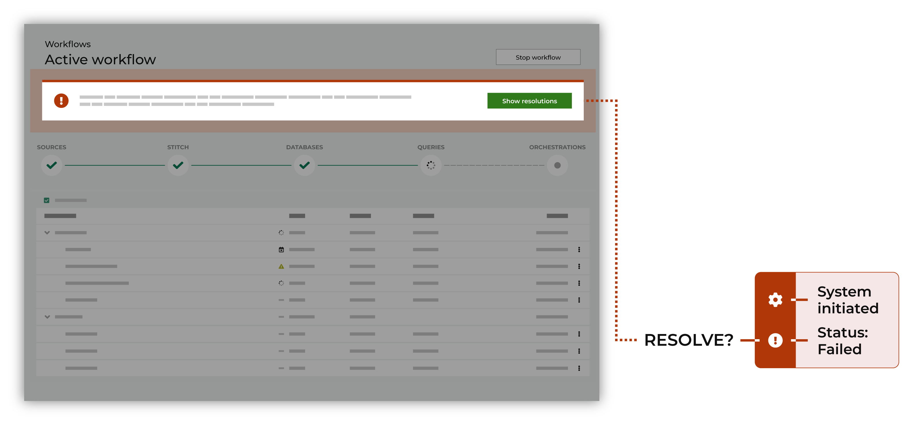
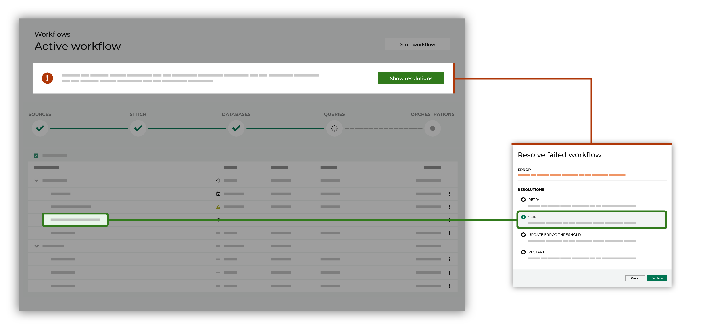
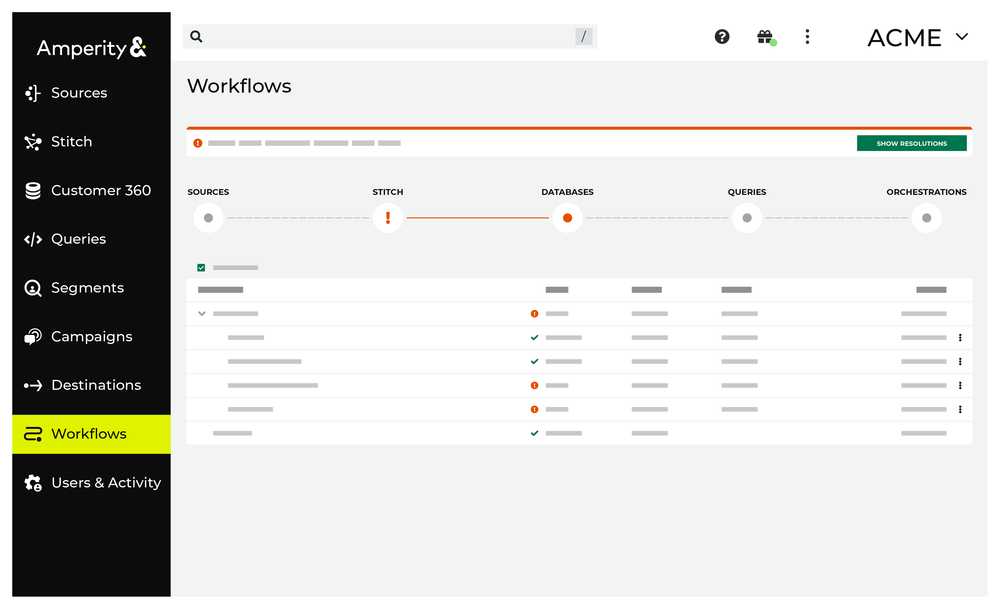

..
.. https://docs.amperity.com/reference/
..

.. meta::
    :description lang=en:
        The Workflows page lets you view and interact with all tenant workflows.

.. meta::
    :content class=swiftype name=body data-type=text:
        The Workflows page lets you view and interact with all tenant workflows.

.. meta::
    :content class=swiftype name=title data-type=string:
        About workflows

==================================================
About workflows
==================================================

.. include:: ../../shared/terms.rst
   :start-after: .. term-workflow-start
   :end-before: .. term-workflow-end

.. _workflows-about:

About the Workflows page
==================================================

.. workflows-page-start

The workflow page consists of two tabs: **Run history** and **Configured**. **Run history** allows you to see a filterable list of workflow runs that have happened. **Configured** allows you to see at a glace all of the automatically-run workflows that have been configured. For each workflow you can view details for every step within a workflow. Both tabs in the **Workflows** page automatically refresh with the latest status of any workflows that are currently running.

Within **Run history**, click the name of any workflow run to open a page that shows a list of tasks and the order in which they occurred in the workflow run.
Within **Configured**, click the name of any workflow to open up its configuration.

.. workflows-page-end

.. workflow-policy-start

.. note:: The **Workflows** page is accessible to users of Amperity who are assigned the **Amp360 User** policy, the **AmpIQ User** policy, the **DataGrid Operator** policy, *or* the **DataGrid Administrator** policy in your production tenant and the **DataGrid Administrator** policy in a sandbox.

.. workflow-policy-end

.. _workflows-discover-alerts:

Workflow alerts
==================================================

.. workflows-discover-alerts-start

A workflow alert is sent when a task within the workflow requires your attention. Each alert contains a description of what caused the alert, along with a link to the workflow in Amperity. Workflow alerts can be configured to send when workflows fail, workflows succeed, workflows exceed a configured runtime threshold, query results exceed a configured threshold, and when workflows are manually stopped.

Workflow alerts may be configured to be :ref:`sent to an email address <workflows-howto-open-from-email-alerts>` or sent to :ref:`a channel in a Slack workspace <workflows-howto-open-from-slack-alerts>`. Click the link in the email or Slack message to open the workflow in Amperity, and then resolve the issue(s) that caused the workflow alert.

Workflow alerts can be grouped into automated workflow alerts and workflow run alerts. Configure recipients for automated workflow alerts when you want to monitor recurring automated workflow runs. Subscribe to individual workflow run alerts when you want to subscribe to updates for individual manually-run workflows, or if you want to subscribe to updates for a specific workflow run.

.. workflows-discover-alerts-end

Automated workflow alerts
--------------------------------------------------

.. automated-workflow-alerts-start

Configure automated workflow alerts within the **Automated workflow alerts** dialog in the workflow page. Use this as your default set of recipients to receive alerts for regularly occurring workflows. Configured recipients will receive the following alerts, for the workflow types they are subscribe to.

* Failure alerts
* Success alerts, only if enabled
* Runtime alerts, if configured
* Query alerts, if configured
* Workflow stopped alerts

Here is a more detailed breakdown of automated workflow alerts by workflow type:

Courier groups
++++++++++++++++++++++++++++++++++++++++++++++++++

.. courier-group-automated-alert-details-start

Alerts are sent when:

* Files are missing
* A failure occurs within any part of a courier group workflow, including courier groups with orchestration groups, campaigns, or profile API indexes configured to run as part of the workflow
* The courier group succeeds, if configured. If downstream workflows are configured, an alert will be sent both when database generation is complete and when downstream workflows succeed
* The courier group runtime exceeds a threshold, if configured
* Query thresholds are reached, if configured
* A user cancels an automatically launched workflow

.. courier-group-automated-alert-details-end

Orchestration groups
++++++++++++++++++++++++++++++++++++++++++++++++++

.. orchestration-group-automated-alert-details-start

Alerts are sent when:

* A failure occurs within an orchestration group workflow, regardless of whether the orchestration group is configured to run after a courier group or run on a schedule
* A failure occurs in an upstream courier group if your orchestration group is configured to run after a courier group. This is to let you know about potential delays to your orchestration group workflow.
* A user cancels an automatically launched workflow
* The orchestration group succeeds, if configured. This is only available for orchestration groups run on a schedule. Subscribe to courier group runtime alerts if your orchestration group is configured to run after a courier group and you want to know when it succeeds.

.. orchestration-group-automated-alert-details-end

Campaigns
++++++++++++++++++++++++++++++++++++++++++++++++++

.. campaign-automated-alert-details-start

Alerts are sent when:

* A failure occurs within campaign send, regardless of whether the campaign is configured to run after a courier group or run on a schedule
* A user cancels an automatically launched workflow
* A failure occurs in an upstream courier group if your campaign is configured to run after a courier group. This is to let you know about potential delays to your campaign send.
* The campaign succeeds, if configured. This is only available for campaigns run on a schedule. Subscribe to courier group success alerts if your campaign is configured to run after a courier group and you want to know when it succeeds.
* The campaign runtime exceeds a threshold, if configured. This is only available for campaigns run on a schedule. Subscribe to courier group runtime alerts if your campaign is configured to run after a courier group and you want to know when it runs long.

.. campaign-automated-alert-details-end

.. automated-workflow-alerts-end

Workflow run alerts
--------------------------------------------------

.. workflow-run-alerts-start

Subscribe to alerts for individual workflow runs to receive alerts on manually run workflows, as well as receive alerts on specific workflow runs. Workflow run alerts are independent of automated workfow alerts. Recipients will receive the following alerts:

* Failure alerts
* Success alerts (always)
* Runtime alerts, if configured
* Query alerts, if configured
* Workflow stopped alerts

.. workflow-run-alerts-end

.. _workflows-discover-details:

Workflow run details
==================================================

.. workflows-discover-details-start

The workflow run details page provides a set of high-level details for a particular workflow run, along with a list of tasks that were run. To open the workflow run details page, click any workflow run in the list of workflows on the **Run history** tab or click the **last run** link in the **Config** tab.

High-level details are visible within a series of boxes along the top of the page and include:

* The workflow run's status, such as "succeeded", "failed", or "stopped"
* The type of workflow run, such as "courier", "courier group", "campaign send", "database", "file upload", and "orchestration group"
* Who started the workflow run, such as "automated" or a user name
* The time at which the workflow run started
* The runtime of the workflow run (from start to finish or from start to failure)

Tasks appear in the lower part of the workflow run page. Tasks represent the individual steps a workflow followed while running.

.. admonition:: Workflow status icons

   The workflow details page uses the following icons to show workflow status.

   .. list-table::
      :widths: 30 70
      :header-rows: 0

      * - |workflow-running|
        - Running

      * - |workflow-succeeded|
        - Succeeded

      * - |workflow-failed|
        - Failed

      * - |workflow-issue|
        - Issue

      * - |workflow-skipped|
        - Skipped

Tasks are grouped into stages, with each stage running a series of tasks. Individual stages are often aligned to pages within Amperity, such as **Sources**, **Stitch**, or **Customer 360**, but may also be aligned to components, such as the **Profile API** or predictive modeling.

Each stage contains a series of individual tasks that run in sequence.

For example, tasks for the **Sources** stage must locate today's data updates, pull those updates to Amperity, and then refresh domain tables with the updated data. Each data source that is located will show as an individual task, each data set that is pulled to Amperity will show as an individual task. Many of the steps a courier takes will show as an individual task.

.. tip:: Use the **View task details** menu option to learn more about the information that was submitted to each task, such as the name of a service, the ID for the file(s) that were submitted to the task, dependencies (such as list names or attribute names that are required by a destination), and so on.

   Outputs show the information that was submitted to the next step in the workflow.

   Inputs and outputs for an individual task within a workflow are unique to that workflow.

   Use the **Hide skipped tasks** option to hide all tasks within a workflow that were skipped. A skipped workflow is shown in the workflow details page with the |workflow-skipped| icon.

   Use the **Hide warnings** to hide warning banners that may appear in the top of the workflow details page. A warning describes a warning that was detected during the workflow, but did not prevent the workflow from completing. Most warnings should be investigated to determine their origin.

.. workflows-discover-details-end

.. _workflows-discover-details-actions:

Details page actions
--------------------------------------------------

.. workflows-discover-details-actions-start

All workflows can be inspected from the workflow details page, regardless of their status or whether there is a warning or an error. Any workflow that is running may be stopped.

.. tip:: You may configure Amperity to send workflow alerts to an email address or to a channel in a Slack workspace. Individual team members who have access to workflow alerts can click a link to open the workflow in Amperity, after which they can investigate, and then take steps to resolve these warnings and errors.

.. workflows-discover-details-actions-end

.. _workflows-discover-details-actions-stop:

Stop workflow runs
++++++++++++++++++++++++++++++++++++++++++++++++++

.. workflows-discover-details-actions-stop-start

You can stop a workflow that is actively running from one of the following locations:

#. The **Stop workflow** button in the top right of the workflow details page.
#. The **Stop workflow** option available from the actions menu on the **Run history** tab while that workflow is running.

When a workflow run is stopped while a task is running, the workflow will initially enter a “Stopping” state while the task is being stopped, after which the workflow will move to a “Stopped” state.

When a workflow run is stopped while no tasks are running it will immediately move to a “Stopped” state.

.. important:: Orchestration tasks that have started running within a workflow cannot be stopped because of external dependencies that an orchestration has with a downstream system. Orchestration tasks that have started may run to completion even when the workflow to which they are associated is stopped.

.. workflows-discover-details-actions-stop-end

.. _workflows-discover-details-actions-warnings:

Review warnings
++++++++++++++++++++++++++++++++++++++++++++++++++

.. workflows-discover-details-actions-warnings-start

A workflow run may show an warning when Amperity detects a problem. For example:

* When a threshold that is defined for a validation report is exceeded
* Optional files are missing
* An issue with an upstream or downstream application, such as the amount of time it may take to send an audience to Google Ads (which is "up to 48 hours"; a new Google Ads workflow cannot start until a previous workflow has finished)

A warning does not typically prevent a workflow run from completing, but a warning should be investigated to determine its cause and, where possible, steps should be taken to fix it.

Use the workflow details page to identify issues with workflow runs. Review the individual tasks that show warnings, and then work to resolve the underlying issue.

.. workflows-discover-details-actions-warnings-end

.. _workflows-discover-details-actions-errors:

Review errors
++++++++++++++++++++++++++++++++++++++++++++++++++

.. workflows-discover-details-actions-errors-start

Some workflow runs may have errors that will prevent the run from completing successfully. Use the workflow details page to resolve workflows that failed by reviewing options for resolution, and then choosing one of those options or choosing to restart the workflow.

.. tip:: Many workflow failures are caused by errors are directly actionable using a workflow resolution. In some situations, viewing the full error message can help troubleshoot the root cause of an error.

.. workflows-discover-details-actions-errors-end

.. _workflows-discover-details-actions-failures:

Resolve failures
++++++++++++++++++++++++++++++++++++++++++++++++++

.. workflows-discover-details-actions-failures-start

A workflow alert is sent when warnings are detected or when an individual task has failed.

You can access workflow alerts from the following locations:

* The **Workflows** page. Click a workflow to open the workflow details page for that workflow.

  .. note:: Individual tasks with warnings are shown with the |workflow-issue| icon. Individual tasks with failures are shown with a status of "failed" and the |workflow-failed| icon.

* Email alerts that were sent to an email address
* A Slack channel that is configured to receive alerts
* A notification within the **Recent activity** pane on the **Sources**, **Stitch**, **Customer 360**, **Queries**, and **Destinations** pages.
* The **Activity log** within the **Settings** tab will list an entry for every alert sent

When you receive a workflow alert, use the link provided within the workflow alert to open Amperity, and then review the workflow details page. The individual task that contains the error that caused the workflow to stop is shown with the the |workflow-failed| icon. An error message will appear at the top of the workflow details page.

Click the **Show resolutions** buttom within the error message to start the process of resolving the error. This opens the **Resolve failed workflow** dialog box.

The **Resolve failed workflow** dialog box contains a list of resolution options that are specific to the stage within which the error occurred and the task at which the workflow failed.

Select one of the resolution options, and then click the **Continue** button to step through the workflow resolution.

.. workflows-discover-details-actions-failures-end

.. _workflows-common:

Common resolutions
==================================================

.. workflows-common-start

The following types of workflow resolutions are the ones you are most likely to see in your tenant:

* :ref:`Ignore missing file <workflows-common-ignore-missing-files>`
* :ref:`Restart workflow <workflows-common-restart>`
* :ref:`Retry task <workflows-common-retry>`
* :ref:`Skip a task <workflows-common-skip-task>`
* :ref:`Update credentials <workflows-common-update-credentials>`
* :ref:`Update error threshold <workflows-common-update-error-threshold>`

.. workflows-common-end

.. _workflows-common-ignore-missing-files:

Ignore missing file
--------------------------------------------------

.. workflows-common-ignore-missing-files-start

A workflow resolution may allow temporarily ignoring missing files for any courier or courier group.

.. workflows-common-ignore-missing-files-end

.. _workflows-common-restart:

Restart workflow
--------------------------------------------------

.. workflows-common-restart-start

A workflow resolution may allow restarting a workflow. This will rerun the workflow starting from the task that failed using the current state of your tenant, including any configuration updates that have been made.

.. workflows-common-restart-end

.. workflows-common-restart-note-start

.. caution:: A workflow resolution may allow you to restart a workflow after making a configuration update to your tenant.

   For example, a workflow restart may allow:

   * Updating credentials
   * Updating a query

   In these types of cases, the resolution *allows the state of your tenant to be updated* before retrying the task. This change will be applied to all future workflows.

.. workflows-common-restart-note-end

.. _workflows-common-retry:

Retry task
--------------------------------------------------

.. workflows-common-retry-start

A workflow resolution may allow retrying a specific task in a workflow. This is useful for transient issues that should not persist from one workflow to the next.

This type of resolution will rerun the workflow from the point at which the workflow failed, starting with the same failed task and using the same inputs as those provided to the failed workflow. In many cases, this type of resolution will allow to you temporarily change the state of your tenant to help troubleshoot the cause of the workflow.

.. workflows-common-retry-end

.. workflows-common-retry-caution-start

.. caution:: A workflow resolution may allow you to change a parameter, and then retry a task.

   For example, a workflow retry may allow:

   * Re-running Stitch with an empty table to troubleshoot the source of the workflow alert
   * Changing an input to determine if the missing input is the source of the workflow alert
   * Adjusting an error threshold

   In these types of cases, the resolution *does not change the state of your tenant* after retrying the workflow. It only changes the state of the active workflow.

   You will need to update your production tenant to persist the change to support future workflows.

.. workflows-common-retry-caution-end

.. _workflows-common-skip-task:

Skip a task
--------------------------------------------------

.. workflows-common-skip-feed-start

A workflow resolution may allow skipping a task. This is useful with:

* Missing or empty tables
* Required tables or fields are empty
* Schema changes
* Corrupted archives or malformed files
* PGP errors
* Connection errors

When a task is skipped a workflow will continue. You can work to resolve the cause of the skipped task asynchronously.

.. workflows-common-skip-feed-end

.. _workflows-common-update-credentials:

Update credentials
--------------------------------------------------

.. workflows-common-update-credentials-start

A workflow resolution may require updated credentials.

.. note:: When you configure Amperity to pull data from or send data to an upstream or downstream system, valid credentials must be provided during that configuration process.

   Credentials change over time. Keys get rotated, passwords get refreshed. Credential changes are often planned in advance, but always happen outside of Amperity and may have happened in-between yesterday's successful workflow and today's failed workflow.

When you see a workflow resolution that requires updated credentials, verify the credentials in the upstream or downstream system, and then update Amperity for those valid credentials. Once updated you should be able to restart the workflow.

.. workflows-common-update-credentials-end

**To update credentials**

.. workflows-common-update-credentials-steps-start

#. Open the **Credentials** page.
#. Review the details for the credentials used with this workflow. Update the credentials for TikTok Ads Manager if required.
#. Return to the workflow action, and then click **Resolve** to retry this workflow.

.. workflows-common-update-credentials-steps-end

.. _workflows-common-update-error-threshold:

Update error threshold
--------------------------------------------------

.. workflows-common-update-error-threshold-start

A workflow resolution may allow a temporary change to the error threshold that caused this workflow to fail so that this workflow may continue.

.. workflows-common-update-error-threshold-end

.. _workflows-context:

Context-specific resolutions
==================================================

.. workflows-context-start

Many workflows have context-specific resolutions that depend on upstream and downstream tasks within the workflow, but also may depend on steps that occur upstream or downstream from Amperity. It is impossible to predict the exact workflow steps that may be shown for any particular workflow action. In addition to :ref:`the most common workflow resolutions <workflows-common>`, and depending on the workflow, you may see any of the following context-specific workflow actions:

* :ref:`Campaigns <workflows-context-campaigns>`
* :ref:`Courier groups <workflows-context-courier-groups>`
* :ref:`Databases <workflows-context-databases>`
* :ref:`Destinations <workflows-context-destinations>`
* :ref:`Scheduled orchestration groups <workflows-context-scheduled>`
* :ref:`Sources <workflows-context-sources>`
* :ref:`Stitch <workflows-context-stitch>`

.. workflows-context-end

.. workflows-context-note-start

.. note:: The potential list of context-specific workflow actions is larger than the lists of campaign-, courier group-, destination-, scheduled orchestration group- and/or source-specific resolutions described in this section. And this list of potential context-specific workflow actions may be only partially relevant to your tenant.

   For example, if your brand only uses Amazon S3 for file-based transfers, then SFTP-specific errors won't ever be shown. If your brand sends paid media campaigns to TikTok Ads and Meta Ads Manager, but not Google Ads, then Google Ads-specific errors won't ever be shown.

   This section is a reference meant to show that Amperity provides a broad (but thorough) list of workflow actions that address the most likely causes and solutions to help your brand self-service resolutions of issues as they may arise.

.. workflows-context-note-end

.. _workflows-context-campaigns:

Campaigns
--------------------------------------------------

.. workflows-context-campaigns-start

Some common workflow actions that your brand may see when sending campaigns from Amperity include:

* :ref:`Mismatched data type <workflows-campaigns-mismatched-datatype>`
* :ref:`Missing table <workflows-campaigns-missing-table>`
* :ref:`Unresolved column name <workflows-campaigns-unresolved-column-name>`
* :ref:`Workflow alerts <workflows-campaigns-alerts>`

.. workflows-context-campaigns-end

.. _workflows-campaigns-mismatched-datatype:

Mismatched datatype
++++++++++++++++++++++++++++++++++++++++++++++++++

.. workflows-campaigns-mismatched-datatype-start

A datatype defines what the value of an attribute can be. For example, an email address is a String, an order date is a Datetime, revenue is a Decimal, the number of items in an order is an Integer, and something that can be true or false is a Boolean.

It's possible for datatypes to be mismatched, which occurs when a campaign expects a datatype to be a String, but is returned as a Decimal (or some other non-String datatype). If a mismatched datatype occurs the campaign will fail, you will receive an error message, and an alert will be sent.

To resolve this error, open the link in the alert and visit the workflow actions page. The alert and workflow actions page will both contain the error message, which will be similar to:

::

   SYNTAX_ERROR: '=' cannot be applied to varchar, integer

Follow the steps in the workflow action to identify which table is causing the error and then either update the campaign to select attributes from a different table or work with your DataGrid Operator to fix the table.

.. workflows-campaigns-mismatched-datatype-end

.. _workflows-campaigns-missing-table:

Missing table
++++++++++++++++++++++++++++++++++++++++++++++++++

.. workflows-campaigns-missing-table-start

Amperity must be able to find the table from which campaign attributes will be pulled before sending them to your destinations. If a table is renamed or removed the campaign will fail, you will receive an error message, and an email will be sent.

To resolve this error, open the link in the alert and visit the workflow actions page. The alert and workflow actions page will both contain the error message, which will be similar to:

::

   Cannot select data from missing tables: <table name>

Follow the steps in the workflow action to identify which table is causing the error and then either update the campaign to select attributes from a different table or work with your DataGrid Operator to fix the table.

.. workflows-campaigns-missing-table-end

.. _workflows-campaigns-unresolved-column-name:

Unresolved column name
++++++++++++++++++++++++++++++++++++++++++++++++++

.. workflows-campaigns-unresolved-column-name-start

Amperity must be able to find the column from which campaign attributes will be pulled before sending them to your destinations. If a column is renamed or removed the campaign will fail, you will receive an error message, and an alert will be sent.

To resolve this error, open the link in the alert and visit the workflow actions page. The alert and workflow actions page will both contain the error message, which will be similar to:

::

   SYNTAX_ERROR: Column <column name> cannot be resolved

or:

::

   COLUMN_NOT_FOUND: Column '<column name>' cannot be resolved

Follow the steps in the workflow action to identify which column is causing the error, and then work with your DataGrid Operator to fix the column name that cannot be resolved.

.. workflows-campaigns-unresolved-column-name-end

.. _workflows-campaigns-alerts:

Campaign workflow alerts
++++++++++++++++++++++++++++++++++++++++++++++++++

.. workflows-campaigns-alerts-start

You can configure recipients for campaign workflow alerts by adding :ref:`email addresses <workflows-howto-email>` or :ref:`Slack channels <workflows-howto-slack>` to the **Configure alerts** dialog box on the **Workflows** page.

.. workflows-campaigns-alerts-end

.. _workflows-context-courier-groups:

Courier groups
--------------------------------------------------

.. workflows-context-courier-groups-start

Some common workflow actions that your brand may see when pulling data to Amperity using courier groups include:

* :ref:`Runtime alerts <workflows-courier-groups-duration-alerts>`
* :ref:`Workflow alerts <workflows-courier-groups-alerts>`

.. workflows-context-courier-groups-end

.. _workflows-courier-groups-duration-alerts:

Runtime alerts
++++++++++++++++++++++++++++++++++++++++++++++++++

.. courier-groups-configure-duration-alert-start

A runtime alert notifies when a courier group has run for longer than a configured amount of time. A runtime alert is sent to each email address that is configured to receive email alerts for courier groups and/or to a channel in your Slack workspace.

.. courier-groups-configure-duration-alert-end

**To configure a runtime alert for a courier group**

.. courier-groups-configure-duration-alert-steps-start

#. From the **Sources** page, open the menu for a courier group, and then select **Edit**.
#. Enable the **Warn if runtime exceeds** checkbox, and then set the number of hours (or minutes) at which, when this amount of time is exceeded, a workflow alert will be sent.
#. Click **Save**.

.. courier-groups-configure-duration-alert-steps-end

.. _workflows-courier-groups-alerts:

Courier group workflow alerts
++++++++++++++++++++++++++++++++++++++++++++++++++

.. workflows-courier-groups-alerts-start

You can configure recipients for courier group workflow alerts by adding :ref:`email addresses <workflows-howto-email>` or :ref:`Slack channels <workflows-howto-slack>` to the **Configure alerts** dialog box on the **Workflows** page.

.. workflows-courier-groups-alerts-end

.. _workflows-context-databases:

Databases
--------------------------------------------------

.. workflows-context-databases-start

Some common workflow actions that your brand may see when generating databases include:

* Errors resolving column names in tables
* Missing tables
* SQL query alerts (including warning *and* failure thresholds)

.. workflows-context-databases-end

.. _workflows-context-destinations:

Destinations
--------------------------------------------------

.. workflows-context-destinations-start

Some destination-specific workflow actions that your brand may see when sending campaigns and orchestrations from Amperity include:

* :ref:`Common to destinations <workflows-context-destination-common>`
* :ref:`ActiveCampaign <workflows-context-destination-active-campaign>`
* :ref:`Amazon Ads <workflows-context-destination-amazon-ads>`
* :ref:`Amazon S3 <workflows-context-destination-amazon-s3>`
* :ref:`Azure Blob Storage <workflows-context-destination-azure-blob-storage>`
* :ref:`Braze <workflows-context-destination-braze>`
* :ref:`Cordial <workflows-context-destination-cordial>`
* :ref:`Google Ads <workflows-context-destination-google-ads>`
* :ref:`Klaviyo <workflows-context-destination-klaviyo>`
* :ref:`Meta Ads Manager <workflows-context-destination-meta-ads-manager>`
* :ref:`Microsoft Advertising <workflows-context-destination-microsoft-advertising>`
* :ref:`Oracle Data Cloud <workflows-context-destination-oracle-data-cloud>`
* :ref:`Oracle DMP <workflows-context-destination-oracle-dmp>`
* :ref:`Salesforce Marketing Cloud <workflows-context-destination-salesforce-marketing-cloud>`
* :ref:`Snapchat <workflows-context-destination-snapchat>`
* :ref:`TikTok Ads <workflows-context-destination-tiktok-ads>`
* :ref:`Zendesk <workflows-context-destination-zendesk>`

.. workflows-context-destinations-end

.. workflows-context-destinations-not-a-complete-list-start

.. important:: This does not represent a complete list of workflow resolutions that are available for destinations.

.. workflows-context-destinations-not-a-complete-list-end

.. _workflows-context-destination-common:

Common to destinations
++++++++++++++++++++++++++++++++++++++++++++++++++

.. workflows-context-destination-common-start

The following destination-specific workflow actions are common across destinations:

* :ref:`Invalid credentials <workflows-common-update-credentials>`
* `SFTP site unavailable <https://docs.amperity.com/datagrid/destination_sftp.html#sftp-site-unavailable>`__ (SFTP destinations only)

.. workflows-context-destination-common-end

.. _workflows-context-destination-active-campaign:

to ActiveCampaign
++++++++++++++++++++++++++++++++++++++++++++++++++

.. workflows-context-destination-active-campaign-start

Amperity provides the following destination-specific workflow actions for ActiveCampaign:

* `Invalid credentials <https://docs.amperity.com/datagrid/destination_active_campaign.html#invalid-credentials>`__
* `Invalid group name <https://docs.amperity.com/datagrid/destination_active_campaign.html#invalid-group-name>`__

.. workflows-context-destination-active-campaign-end

.. _workflows-context-destination-amazon-ads:

to Amazon Ads
++++++++++++++++++++++++++++++++++++++++++++++++++

.. workflows-context-destination-amazon-ads-start

Amperity provides the following destination-specific workflow actions for Amazon Ads:

* `Invalid advertiser account ID <https://docs.amperity.com/datagrid/destination_amazon_ads.html#invalid-advertiser-account-id>`__
* `Invalid credentials <https://docs.amperity.com/datagrid/destination_amazon_ads.html#invalid-credentials>`__
* `Missing required field <https://docs.amperity.com/datagrid/destination_amazon_ads.html#missing-required-field>`__

.. workflows-context-destination-amazon-ads-end

.. _workflows-context-destination-amazon-s3:

to Amazon S3
++++++++++++++++++++++++++++++++++++++++++++++++++

.. workflows-context-destination-amazon-s3-start

Amperity provides the following destination-specific workflow actions for Amazon S3:

* `Invalid bucket name <https://docs.amperity.com/datagrid/destination_amazon_s3.html#invalid-bucket-name>`__
* `Invalid credentials <https://docs.amperity.com/datagrid/destination_amazon_s3.html#invalid-credentials>`__

.. workflows-context-destination-amazon-s3-end

.. _workflows-context-destination-azure-blob-storage:

to Azure Blob Storage
++++++++++++++++++++++++++++++++++++++++++++++++++

.. workflows-context-destination-azure-blob-storage-start

Amperity provides the following destination-specific workflow actions for Azure Blob Storage:

* `Invalid credentials <https://docs.amperity.com/datagrid/destination_azure_blob_storage.html#invalid-credentials>`__
* `Invalid permissions <https://docs.amperity.com/datagrid/destination_azure_blob_storage.html#invalid-permissions>`__

.. workflows-context-destination-azure-blob-storage-end

.. _workflows-context-destination-braze:

to Braze
++++++++++++++++++++++++++++++++++++++++++++++++++

.. workflows-context-destination-braze-start

Amperity provides the following destination-specific workflow actions for Braze:

* `Invalid credentials <https://docs.amperity.com/datagrid/destination_braze.html#invalid-credentials>`__
* `Missing required field <https://docs.amperity.com/datagrid/destination_braze.html#missing-required-field>`__
* `Status 401 error <https://docs.amperity.com/datagrid/destination_braze.html#status-401-error>`__

.. workflows-context-destination-braze-end

.. _workflows-context-destination-cordial:

to Cordial
++++++++++++++++++++++++++++++++++++++++++++++++++

.. workflows-context-destination-cordial-start

Amperity provides the following destination-specific workflow actions for Cordial:

* `Invalid credentials <https://docs.amperity.com/datagrid/destination_cordial.html#invalid-credentials>`__
* `Required attributes are missing <https://docs.amperity.com/datagrid/destination_cordial.html#required-attributes-are-missing>`__
* `Unique list name required <https://docs.amperity.com/datagrid/destination_cordial.html#unique-list-name-required>`__

.. workflows-context-destination-cordial-end

.. _workflows-context-destination-google-ads:

to Google Ads
++++++++++++++++++++++++++++++++++++++++++++++++++

.. workflows-context-destination-google-ads-start

Amperity provides the following destination-specific workflow actions for Google Ads:

* `Cannot update audience <https://docs.amperity.com/datagrid/destination_google_ads.html#cannot-update-audience>`__
* `Expired token <https://docs.amperity.com/datagrid/destination_google_ads.html#expired-token>`__
* `Incomplete account setup <https://docs.amperity.com/datagrid/destination_google_ads.html#incomplete-account-setup>`__
* `Invalid credentials <https://docs.amperity.com/datagrid/destination_google_ads.html#invalid-credentials>`__
* `Missing required field(s) <https://docs.amperity.com/datagrid/destination_google_ads.html#missing-required-field-s>`__
* `Two-factor authentication required <https://docs.amperity.com/datagrid/destination_google_ads.html#two-factor-authentication-required>`__
* `User cannot access audience <https://docs.amperity.com/datagrid/destination_google_ads.html#user-cannot-access-audience>`__

.. note:: Workflow actions for Google Ads are often identical to workflow actions for DV360.

.. workflows-context-destination-google-ads-end

.. _workflows-context-destination-klaviyo:

to Klaviyo
++++++++++++++++++++++++++++++++++++++++++++++++++

.. workflows-context-destination-klaviyo-start

Amperity provides the following destination-specific workflow actions for Klaviyo:

* `Invalid credentials <https://docs.amperity.com/datagrid/destination_klaviyo.html#invalid-credentials>`__
* `Maximum number of lists exceeded <https://docs.amperity.com/datagrid/destination_klaviyo.html#maximum-number-of-lists-exceeded>`__

.. workflows-context-destination-klaviyo-end

.. _workflows-context-destination-listrak:

to Listrak
++++++++++++++++++++++++++++++++++++++++++++++++++

.. workflows-context-destination-listrak-start

Amperity provides the following destination-specific workflow actions for Listrak:

* Authorization error
* Invalid credentials
* Invalid list name

.. workflows-context-destination-listrak-end

.. _workflows-context-destination-meta-ads-manager:

to Meta Ads Manager
++++++++++++++++++++++++++++++++++++++++++++++++++

.. workflows-context-destination-meta-ads-manager-start

Amperity provides the following destination-specific workflow actions for Meta Ads Manager:

* `Authorization error <https://docs.amperity.com/datagrid/destination_meta_ads_manager.html#authorization-error>`__
* `Cannot create ads <https://docs.amperity.com/datagrid/destination_meta_ads_manager.html#cannot-create-ads>`__
* `EXTERN_ID is missing <https://docs.amperity.com/datagrid/destination_meta_ads_manager.html#extern-id-is-missing>`__
* `Invalid credentials <https://docs.amperity.com/datagrid/destination_meta_ads_manager.html#invalid-credentials>`__
* `Maximum custom audiences exceeded <https://docs.amperity.com/datagrid/destination_meta_ads_manager.html#maximum-custom-audiences-exceeded>`__
* `Must agree to Facebook terms <https://docs.amperity.com/datagrid/destination_meta_ads_manager.html#must-agree-to-facebook-terms>`__
* `Must belong to business account <https://docs.amperity.com/datagrid/destination_meta_ads_manager.html#must-belong-to-business-account>`__
* `Security challenge <https://docs.amperity.com/datagrid/destination_meta_ads_manager.html#security-challenge>`__

.. workflows-context-destination-meta-ads-manager-end

.. _workflows-context-destination-microsoft-advertising:

to Microsoft Advertising
++++++++++++++++++++++++++++++++++++++++++++++++++

.. workflows-context-destination-microsoft-advertising-start

Amperity provides the following destination-specific workflow actions for Microsoft Advertising:

* `Email address required <https://docs.amperity.com/datagrid/destination_microsoft_ads.html#email-address-required>`__
* `Expired credentials <https://docs.amperity.com/datagrid/destination_microsoft_ads.html#expired-credentials>`__
* `Invalid credentials <https://docs.amperity.com/datagrid/destination_microsoft_ads.html#invalid-credentials>`__
* `Must accept terms and conditions <https://docs.amperity.com/datagrid/destination_microsoft_ads.html#must-accept-terms-and-conditions>`__
* `Not authorized <https://docs.amperity.com/datagrid/destination_microsoft_ads.html#not-authorized>`__
* `Two-step authentication required <https://docs.amperity.com/datagrid/destination_microsoft_ads.html#two-step-authentication-required>`__

.. workflows-context-destination-microsoft-advertising-end

.. _workflows-context-destination-oracle-data-cloud:

to Oracle Data Cloud
++++++++++++++++++++++++++++++++++++++++++++++++++

.. workflows-context-destination-oracle-data-cloud-start

Amperity provides the following destination-specific workflow actions for Oracle Data Cloud:

* `Invalid credentials <https://docs.amperity.com/datagrid/destination_oracle_data_cloud.html#invalid-credentials>`__
* `SFTP site unavailable <https://docs.amperity.com/datagrid/destination_oracle_data_cloud.html#sftp-site-unavailable>`__

.. workflows-context-destination-oracle-data-cloud-end

.. _workflows-context-destination-oracle-dmp:

to Oracle DMP
++++++++++++++++++++++++++++++++++++++++++++++++++

.. workflows-context-destination-oracle-dmp-start

Amperity provides the following destination-specific workflow actions for Oracle DMP:

* `Invalid credentials <https://docs.amperity.com/datagrid/destination_oracle_dmp.html#invalid-credentials>`__
* `SFTP site unavailable <https://docs.amperity.com/datagrid/destination_oracle_dmp.html#sftp-site-unavailable>`__

.. workflows-context-destination-oracle-dmp-end

.. _workflows-context-destination-salesforce-marketing-cloud:

to Salesforce Marketing Cloud
++++++++++++++++++++++++++++++++++++++++++++++++++

.. workflows-context-destination-salesforce-marketing-cloud-start

Amperity provides the following destination-specific workflow actions for Salesforce Marketing Cloud:

* `Import location has wrong type <https://docs.amperity.com/datagrid/destination_salesforce_marketing_cloud.html#import-location-has-wrong-type>`__
* `Import location not found <https://docs.amperity.com/datagrid/destination_salesforce_marketing_cloud.html#import-location-not-found>`__
* `Incorrect data extension name <https://docs.amperity.com/datagrid/destination_salesforce_marketing_cloud.html#incorrect-data-extension-name>`__
* `Incorrect folder <https://docs.amperity.com/datagrid/destination_salesforce_marketing_cloud.html#incorrect-folder>`__
* `Invalid credentials <https://docs.amperity.com/datagrid/destination_salesforce_marketing_cloud.html#invalid-credentials>`__
* `Missing primary key <https://docs.amperity.com/datagrid/destination_salesforce_marketing_cloud.html#missing-primary-key>`__
* `SFTP unavailable <https://docs.amperity.com/datagrid/destination_salesforce_marketing_cloud.html#sftp-unavailable>`_

.. workflows-context-destination-salesforce-marketing-cloud-end

.. _workflows-context-destination-snapchat:

to Snapchat
++++++++++++++++++++++++++++++++++++++++++++++++++

.. workflows-context-destination-snapchat-start

Amperity provides the following destination-specific workflow actions for Snapchat:

* `Invalid credentials <https://docs.amperity.com/datagrid/destination_snapchat.html#invalid-credentials>`__

.. workflows-context-destination-snapchat-end

.. _workflows-context-destination-tiktok-ads:

to TikTok Ads
++++++++++++++++++++++++++++++++++++++++++++++++++

.. workflows-context-destination-tiktok-ads-start

Amperity provides the following destination-specific workflow actions for TikTok Ads:

* `Advertiser not found <https://docs.amperity.com/datagrid/destination_tiktok_ads.html#advertiser-not-found>`__
* `Invalid credentials <https://docs.amperity.com/datagrid/destination_tiktok_ads.html#invalid-credentials>`__
* `Missing advertiser permissions <https://docs.amperity.com/datagrid/destination_tiktok_ads.html#missing-advertiser-permissions>`__

.. workflows-context-destination-tiktok-ads-end

.. _workflows-context-destination-zendesk:

to Zendesk
++++++++++++++++++++++++++++++++++++++++++++++++++

.. workflows-context-destination-zendesk-start

Amperity provides the following destination-specific workflow actions for Zendesk:

* `Authorization error <https://docs.amperity.com/datagrid/destination_zendesk.html#authorization-error>`__
* `Invalid credentials <https://docs.amperity.com/datagrid/destination_zendesk.html#invalid-credentials>`__

.. workflows-context-destination-zendesk-end

.. _workflows-context-scheduled:

Scheduled orchestration groups
--------------------------------------------------

.. workflows-context-scheduled-start

Some destination-specific workflow actions that your brand may see when using scheduled orchestration groups include:

* :ref:`Workflow alerts <workflows-context-scheduled-alerts>`

You can configure who receives alerts for orchestration group failures by editing the audiences under "Scheduled orchestration groups" in the workflow alerts dialog.

.. note:: Scheduled orchestration group group failure alerts are not sent for orchestrations that are run manually or for orchestrations that are configured to run after a courier group.

.. workflows-context-scheduled-end

.. _workflows-context-scheduled-alerts:

Orchestration workflow alerts
++++++++++++++++++++++++++++++++++++++++++++++++++

.. workflows-context-scheduled-alerts-start

You can configure recipients for scheduled orchestration group workflow alerts by adding :ref:`email addresses <workflows-howto-email>` or :ref:`Slack channels <workflows-howto-slack>` to the **Configure alerts** dialog box on the **Workflows** page.

.. workflows-context-scheduled-alerts-end

.. _workflows-context-sources:

Sources
--------------------------------------------------

.. workflows-context-sources-start

Some destination-specific workflow actions that your brand may see when pulling data to Amperity using couriers and courier groups include:

* :ref:`Common to file-based sources <workflows-context-source-common>`
* :ref:`Amazon S3 <workflows-context-source-amazon-s3>`
* :ref:`Azure Blob Storage <workflows-context-source-azure-blob-storage>`
* :ref:`Google Cloud Storage <workflows-context-source-google-cloud-storage>`
* :ref:`SFTP <workflows-context-source-sftp>`

.. workflows-context-sources-end

.. _workflows-context-source-common:

Common to file-based sources
++++++++++++++++++++++++++++++++++++++++++++++++++

.. workflows-context-source-common-start

The following source-specific workflow actions are common across file-based data sources, including Amazon S3, Azure Blob Storage, Google Cloud Storage, and any SFTP site:

* `Bad archive <https://docs.amperity.com/datagrid/source_sftp.html#bad-archive>`__
* `Missing files <https://docs.amperity.com/datagrid/source_sftp.html#missing-file>`__
* `PGP error <https://docs.amperity.com/datagrid/source_sftp.html#pgp-error>`__
* `Cannot decompress archive <https://docs.amperity.com/datagrid/source_sftp.html#unable-to-decompress-archive>`__

.. note:: These link to the SFTP source page, but the resolutions for common source alerts is identical across all SFTP and cloud storage data sources.

.. workflows-context-source-common-end

.. _workflows-context-source-amazon-s3:

from Amazon S3
++++++++++++++++++++++++++++++++++++++++++++++++++

.. workflows-context-source-amazon-s3-start

In addition to all `common source workflow alerts <workflows-context-source-common>`, Amperity provides the following destination-specific workflow actions for Amazon S3:

* `Invalid bucket name <https://docs.amperity.com/datagrid/source_amazon_s3.html#invalid-bucket-name>`__
* `Invalid credentials <https://docs.amperity.com/datagrid/source_amazon_s3.html#invalid-credentials>`__

.. workflows-context-source-amazon-s3-end

.. _workflows-context-source-azure-blob-storage:

from Azure Blob Storage
++++++++++++++++++++++++++++++++++++++++++++++++++

.. workflows-context-source-azure-blob-storage-start

In addition to all `common source workflow alerts <workflows-context-source-common>`, Amperity provides the following destination-specific workflow actions for Azure Blob Storage:

* `Invalid credentials <https://docs.amperity.com/datagrid/source_azure_blob_storage.html#invalid-credentials>`__
* `Invalid permissions <https://docs.amperity.com/datagrid/source_azure_blob_storage.html#invalid-permissions>`__

.. workflows-context-source-azure-blob-storage-end

.. _workflows-context-source-google-cloud-storage:

from Google Cloud Storage
++++++++++++++++++++++++++++++++++++++++++++++++++

.. workflows-context-source-google-cloud-storage-start

In addition to all `common source workflow alerts <workflows-context-source-common>`, Amperity provides the following destination-specific workflow actions for Google Cloud Storage:

* `Invalid credentials <https://docs.amperity.com/datagrid/source_google_cloud_storage.html#invalid-credentials>`__

.. workflows-context-source-google-cloud-storage-end

.. _workflows-context-source-sftp:

from SFTP
++++++++++++++++++++++++++++++++++++++++++++++++++

.. workflows-context-source-sftp-start

In addition to all `common source workflow alerts <workflows-context-source-common>`, Amperity provides the following destination-specific workflow actions for SFTP sites:

* `Invalid SFTP credentials <https://docs.amperity.com/datagrid/source_sftp.html#invalid-credentials>`__
* `SFTP site unavailable <https://docs.amperity.com/datagrid/source_sftp.html#sftp-site-unavailable>`__

.. workflows-context-source-sftp-end

.. _workflows-context-stitch:

Stitch
--------------------------------------------------

.. workflows-context-stitch-start

If too many Amperity IDs change from one Stitch run to the next, Stitch will return a workflow alert. The cause of a significant number of Amperity ID changes is often related to a significant change to one (or more) data sources, such as an update that adds a customer key or foreign key to one (or more) feed schemas.

If your brand is making a series of planned updates and these additions are expected, Stitch may be configured to ignore |configure_stitch_ignore_jitter|.

.. workflows-context-stitch-end

.. _workflows-howto:

How-tos
==================================================

.. workflows-howto-start

This section describes tasks related to managing workflow actions in Amperity:

* :ref:`Configure runtime alerts for courier groups <workflows-howto-configure-duration-alerts>`
* :ref:`Filter workflows by status <workflows-howto-filter-workflows-by-status>`
* :ref:`Filter workflows by type <workflows-howto-filter-workflows-by-type>`
* :ref:`Filter workflows by user <workflows-howto-filter-workflows-by-user>`
* :ref:`Hide skipped tasks <workflows-howto-hide-skipped-tasks>`
* :ref:`Open workflows from email alerts <workflows-howto-open-from-email-alerts>`
* :ref:`Open workflows from recent activity pane <workflows-howto-open-from-recent-activity>`
* :ref:`Open workflows from Slack alerts <workflows-howto-open-from-slack-alerts>`
* :ref:`Open workflows from the Workflows page <workflows-howto-open-from-workflow-page>`
* :ref:`Resolve workflow errors <workflows-howto-resolve>`
* :ref:`Restart workflow <workflows-common-restart>`
* :ref:`Retry task <workflows-common-retry>`
* :ref:`Search workflows <workflows-howto-search>`
* :ref:`Send workflow alerts to Slack channels <workflows-howto-slack>`
* :ref:`Stop a workflow <workflows-howto-stop>`
* :ref:`Update credential <workflows-common-update-credentials>`
* :ref:`View all workflows <workflows-howto-view-all>`
* :ref:`View error details <workflows-howto-view-error-details>`
* :ref:`View inputs and outputs <workflows-howto-view-inputs-and-outputs>`
* :ref:`View workflow details <workflows-howto-view-details>`
* :ref:`View workflow resolutions <workflows-howto-view-resolutions>`

.. workflows-howto-end

.. _workflows-howto-configure-duration-alerts:

Configure runtime alerts
--------------------------------------------------

.. workflows-howto-configure-duration-alerts-start

A runtime alert notifies you when a workflow has run for longer than the configured amount of time.

* :ref:`Configure runtime alerts for courier groups <workflows-howto-configure-duration-alerts-courier-group>`

.. workflows-howto-configure-duration-alerts-end

.. _workflows-howto-configure-duration-alerts-courier-group:

for courier groups
++++++++++++++++++++++++++++++++++++++++++++++++++

.. courier-groups-configure-duration-alert-start

Use a workflow alert to be notified when a courier group runs for longer than a configured amount of time. An alert will be sent to each email address that is configured to receive email alerts for courier groups.

.. courier-groups-configure-duration-alert-end

**To configure a runtime alert for a courier group**

.. courier-groups-configure-duration-alert-steps-start

#. From the **Sources** page, open the menu for a courier group, and then select **Edit**.
#. Enable the **Warn if runtime succeeds** checkbox, and then set the number of hours (or minutes) at which, when the configured amount of time is exceeded, a workflow alert will be sent.

   .. image:: ../../images/mockups-workflow-courier-group-duration-alerts.png
      :width: 400 px
      :alt: Enable runtime alerts for workflows.
      :align: left
      :class: no-scaled-link

#. Click **Save**.

.. courier-groups-configure-duration-alert-steps-end

.. _workflows-howto-filter-workflows:

Filter workflows
--------------------------------------------------

.. workflows-howto-filter-workflows-start

You can filter the list of workflows from the **Workflows** page. Click **Show filters** to open the **Filters** pane, and then select one (or more) values from the following dropdown lists:

* :ref:`Started by <workflows-howto-filter-workflows-by-user>`
* :ref:`Status <workflows-howto-filter-workflows-by-status>`
* :ref:`Type <workflows-howto-filter-workflows-by-type>`

.. workflows-howto-filter-workflows-end

.. workflows-howto-filter-workflows-tip-start

.. tip:: Combine the filters with :ref:`search functionality <workflows-howto-search>` to show more specific filtering results.

   Show the workflow filters pane, and then set the filter type to "Campaign" to filter the list of workflows to only show campaigns.

   Search "dec" to filter to only campaign workflow that occurred in December.

.. workflows-howto-filter-workflows-tip-end

.. _workflows-howto-filter-workflows-by-status:

by status
++++++++++++++++++++++++++++++++++++++++++++++++++

.. workflows-howto-filter-workflows-by-status-start

You may filter workflows by workflow status. Use the **Status** filter, and then select one (or more) of the following options:

* Failed
* Stopped
* Succeeded

.. workflows-howto-filter-workflows-by-status-end

.. _workflows-howto-filter-workflows-by-type:

by type
++++++++++++++++++++++++++++++++++++++++++++++++++

.. workflows-howto-filter-workflows-by-type-start

You may filter workflows by workflow type. Use the **Type** filter, and then select one (or more) of the following options:

* Campaign send
* CCPA delete. This type supports privacy rights workflows, including data subject access request (DSAR), the California Consumer Privacy Act (CCPA), and General Data Protection Regulation (GDPR).
* Courier
* Courier group
* Data refresh
* Ingest
* Input validation report update
* Manual index run
* Orchestration
* Orchestration group

.. workflows-howto-filter-workflows-by-type-end

.. _workflows-howto-filter-workflows-by-user:

by user
++++++++++++++++++++++++++++++++++++++++++++++++++

.. workflows-howto-filter-workflows-by-user-start

You may filter workflows by the users who started the workflow. Use the **Started by** filter, and then select one (or more) users from the list.

.. workflows-howto-filter-workflows-by-user-end

.. _workflows-howto-hide-skipped-tasks:

Hide skipped tasks
--------------------------------------------------

.. workflows-howto-hide-skipped-tasks-start

Some workflows contain a large number of skipped tasks. You can hide skipped tasks when reviewing the list of individual tasks that occurred during a workflow.

.. workflows-howto-hide-skipped-tasks-end

**To hide skipped tasks**

.. workflows-howto-hide-skipped-tasks-steps-start

#. From the **Workflows** page, select a workflow.
#. On the individual workflow's page, enable the **Hide skipped tasks** option.

.. workflows-howto-hide-skipped-tasks-steps-end

.. _workflows-howto-open:

Open workflows
--------------------------------------------------

.. workflows-howto-open-start

You can access workflow alerts from the following locations:

* :ref:`Email alerts <workflows-howto-open-from-email-alerts>`
* :ref:`The Recent activity pane <workflows-howto-open-from-recent-activity>`
* :ref:`Slack channels <workflows-howto-open-from-slack-alerts>`
* :ref:`The Workflows page <workflows-howto-open-from-workflow-page>`

.. workflows-howto-open-end

.. _workflows-howto-open-from-email-alerts:

Open from email alerts
++++++++++++++++++++++++++++++++++++++++++++++++++

.. workflows-howto-open-from-email-alerts-start

When email workflow alerts are enabled for your tenant, a user who receives that alert *and* who can log into Amperity may click the link in the email to open Amperity and resolve the workflow.

.. tip:: Users who do not have permission to log in to Amperity may reply to the email workflow alert to open a support ticket.

.. workflows-howto-open-from-email-alerts-end

.. _workflows-howto-open-from-recent-activity:

Open from Recent activity panes
++++++++++++++++++++++++++++++++++++++++++++++++++

.. workflows-howto-open-from-recent-activity-start

The **Sources**, **Stitch**, **Customer 360**, **Campaigns**, and **Destinations** page will show workflow alerts when a task requires your attention. You can also access all workflows from the **Workflows** page.

.. workflows-howto-open-from-recent-activity-end

**To open workflows from Recent activity panes**

.. workflows-howto-open-from-recent-activity-steps-start

#. Open the **Sources**, **Stitch**, **Customer 360**, **Campaigns**, or **Destinations** page.
#. Open the **Recent activity** pane.
#. Browse or search the notifications.
#. A notification that contains a workflow action will be highlighted. Click the "View workflow" link to open the workflow.

   .. tip:: When workflow resolutions are available, an alert is shown with a button named **Show resolutions**.

.. workflows-howto-open-from-recent-activity-steps-end

.. _workflows-howto-open-from-slack-alerts:

Open from Slack alerts
++++++++++++++++++++++++++++++++++++++++++++++++++

.. workflows-howto-open-from-slack-alerts-start

From a Slack channel in your brand's Slack workspace, click the link in the message to open the workflow.

.. note:: You may be required to log in to Amperity before you can view the workflow.

.. workflows-howto-open-from-slack-alerts-end

.. _workflows-howto-open-from-workflow-page:

Open from the Workflows page
++++++++++++++++++++++++++++++++++++++++++++++++++

.. workflows-howto-open-from-workflow-page-start

The **Workflows** page contains a list of all of the workflows that have occurred in your tenant. You can filter the workflows using :ref:`search <workflows-howto-search>`, from the :ref:`filters pane <workflows-howto-filter-workflows>`, or by sorting the columns (ascending or descending) within the list of workflows.

.. workflows-howto-open-from-workflow-page-end

**To open workflows from the Workflows page**

.. workflows-howto-open-from-workflow-page-steps-start

#. Open the **Workflows** page.
#. Open the **Recent activity** pane.
#. Browse or search the list of workflows.
#. A workflow that contains a workflow action will have a "Failed" workflow type. Open a failed workflow.

   .. tip:: When workflow resolutions are available, an alert is shown with a button named **Show resolutions**.

.. workflows-howto-open-from-workflow-page-steps-end

.. _workflows-howto-resolve:

Resolve workflow
--------------------------------------------------

.. workflows-howto-resolve-errors-start

Some workflows may have errors that will prevent the workflow from completing successfully. Use the **Workflows** page to resolve workflows that failed by reviewing options for resolution, and then choosing one of those options or choosing to restart the workflow.

.. workflows-howto-resolve-errors-end

**To resolve workflow errors**

.. workflows-howto-resolve-errors-steps-start

#. From the |fa-kebab| menu in the top navigation bar select **Workflow**. This opens the **Workflows** page.
#. Select a workflow with a "|workflow-failed| Failed" status.
#. Click **Show Resolutions**, review your options, and then select a resolution. Work through any steps that may be required by the selected resolution.
#. Click **Resolve**.

.. workflows-howto-resolve-errors-steps-end

.. _workflows-howto-search:

Search workflows
--------------------------------------------------

.. workflows-howto-search-start

You can search within the list of workflows from the search box at the top of the **Workflows** page. Use the search functionality as a way of filtering the list down to a smaller list of individual workflows or to find a specific workflow.

For example:

* "failed" will filter to only failed workflows
* "dec" will filter to all workflows that occurred in December, along with any workflows that have "dec" in the workflow name

.. tip:: Combine the search functionality with :ref:`filters <workflows-howto-filter-workflows>` to show more specific search results.

   Search "dec" to filter to all workflows that occurred in December.

   Show the workflow filters pane, and then set the filter type to "Campaign" to filter the list of workflows to only show campaigns that occurred in December.

.. workflows-howto-search-end

.. _workflows-howto-email:

Send alerts to email addresses
--------------------------------------------------

.. workflows-howto-email-address-start

You can configure Amperity to send automated workflow alerts to individual email addresses or group aliases as long as the domain that is associated with those email addresses is configured to be an allowed domain in Amperity.

Email workflow alerts are sent from "notifications@amperity.com". A reply to the emailed workflow alert will reply to "support@amperity.com", after which a support ticket is opened automatically.

.. workflows-howto-email-address-end

.. workflows-howto-email-address-allowed-domains-start

.. important:: Email addresses that receive workflow alerts must belong to an allowed domain in Amperity. Allowed domains are configured from the **Users & Activity** page.

   Click **Add user**, and then in the dialog box that opens under **Allowed domains**, review the list of domains. If the email domain that your brand requires for sending email workflow alerts is not listed, click **Request domain**.

   The email address to which workflow alerts are sent is not required to exist as a user in Amperity.

.. workflows-howto-email-address-allowed-domains-end

**To configure alerts for email addresses**

.. workflows-howto-email-address-steps-start

#. From the **Workflows** page, click **Automated workflow alerts**.
#. In the **Automated workflow alerts** dialog box, under **Campaigns**, **Courier groups**, or **Scheduled orchestration groups**, type an email address in the **Emails** box, and then hit the RETURN button on your keyboard.

   You may enter more than one email address.
#. Click **Save**.

.. workflows-howto-email-address-steps-end

.. _workflows-howto-slack:

Send alerts to Slack channels
--------------------------------------------------

.. workflows-howto-slack-start

You can configure Amperity to send workflow alerts to channels in your brand's Slack workspace. This configuration requires the following steps:

#. :ref:`Authorize your Slack workspace <workflows-howto-slack-authorize>`
#. :ref:`Configure one (or more) Slack channels for workflow alerts <workflows-howto-slack-channels>`

.. workflows-howto-slack-end

.. _workflows-howto-slack-authorize:

Authorize workspace
++++++++++++++++++++++++++++++++++++++++++++++++++

.. workflows-howto-slack-authorize-start

You must authorize Amperity to be able to send workflow alerts to your Slack workspace. This authorization occurs within Slack.

.. workflows-howto-slack-authorize-end

.. workflows-howto-slack-authorize-important-start

.. important:: Only one Slack workspace may be authorized for your tenant.

   Amperity :ref:`only sends workflow alerts to the configured channels <workflows-howto-slack-channels>`. Amperity does not send direct messages ("@").

.. workflows-howto-slack-authorize-important-end

**To authorize a Slack workspace**

.. workflows-howto-slack-authorize-steps-start

#. From the **Users & Activity** page, under **Slack integration** click **Connect Slack workspace**.
#. This opens a Slack authorization page with a message similar to:

   ::

      Amperity is requesting permission to access the [your-brand's-workspace] Slack workspace.

   Click **Allow** to enable sending workflow alerts to your brand's Slack workspace. You can :ref:`configure specific channels <workflows-howto-slack-channels>` after you have authorized the Slack workspace.

#. Click **Save**.

.. workflows-howto-slack-authorize-steps-end

.. _workflows-howto-slack-channels:

Configure channels
++++++++++++++++++++++++++++++++++++++++++++++++++

.. workflows-howto-slack-channels-start

You can configure each workflow alert type to send alerts to one (or more) channels in your brand's Slack workspace. You may configure more than one channel to receive alerts for the same workflow type. You cannot configure workflow alerts to be sent as a direct message in Slack to a single individual.

.. tip:: Create a dedicated channel (or set of channels) in your brand's Slack workspace to which workflow alerts are sent. Channels to which workflow alerts are sent may be public or private.

   For most use cases, a single "#amperity-workflow-alerts" channel is sufficient, but some use cases may prefer to have dedicated channels for courier groups and campaigns.

.. workflows-howto-slack-channels-end

**To configure one (or more) Slack channels**

.. workflows-howto-slack-channels-steps-start

#. From the **Workflows** page, click **Automated workflow alerts**.
#. In the **Configure alerts** dialog box, under **Campaigns**, **Courier groups**, and **Scheduled orchestration groups**, add the name of the Slack channel to which you want to send workflow alerts, and then hit the RETURN button on your keyboard.

   You may enter more than one Slack channel for each workflow alert type and each workflow alert type may be configured for their own Slack channels.
#. Click **Save**.

.. important:: Include the octothorpe ("#") prefix for the Slack channel you want to send alerts to.

.. workflows-howto-slack-channels-steps-end

.. _workflows-howto-slack-disconnect:

Disconnect workspace
++++++++++++++++++++++++++++++++++++++++++++++++++

.. workflows-howto-slack-disconnect-start

You can disconnect a Slack workspace from the **Users & Activity** page. Select the |fa-kebab| menu icon for the configured workspace, select **Disconnect**, and then confirm that you want to disconnect the workspace.

.. workflows-howto-slack-disconnect-end

.. _workflows-howto-stop:

Stop a workflow
--------------------------------------------------

.. workflows-howto-stop-start

You can stop a workflow that is actively running from one of the following locations:

#. The **Stop workflow** button in the top right of an individual workflow's details page.
#. The **Stop workflow** option available from the |fa-kebab| menu on the **Workflows** page.

When a workflow is stopped while a task is running, it will initially enter a "Stopping" state while the task is being stopped, after which the workflow will move to a "Stopped" state. If a workflow is stopped while no tasks are running it will immediately move to a "Stopped" state.

A workflow alert is sent to all users who are subscribed to workflow alerts.

.. important:: Orchestration tasks that have started running within a workflow cannot be stopped because of external dependencies that each orchestration has with a downstream system. Orchestration tasks that have started may run to completion even when the workflow to which they are associated is stopped.

.. workflows-howto-stop-end

.. _workflows-howto-view-all:

View all workflows
--------------------------------------------------

.. workflow-policy-start

The **Workflows** page is available to users of Amperity who are assigned the **Amp360 User** policy or the **DataGrid Operator** policy. The **Workflows** page is not available to users who are only assigned the **AmpIQ User** policy.

.. workflow-policy-end

.. _workflows-howto-view-error-details:

View error details
--------------------------------------------------

.. workflows-howto-view-error-details-start

You can view error details for a workflow. Open an individual workflow, then from a row with an error or an issue, select the |fa-kebab| menu icon, and then choose **View error details**. This opens a dialog box that contains the full error message.

.. note:: Errors are often more directly actionable using a workflow resolution. In some situations, viewing the full error message can help troubleshoot the root cause of an error.

.. workflows-howto-view-error-details-end

.. _workflows-howto-view-inputs-and-outputs:

View inputs and outputs
--------------------------------------------------

.. workflows-howto-view-inputs-and-outputs-start

You can view the inputs and outputs for a workflow. Inputs show all of the information that was submitted to a task, such as the names of the service, the ID for the file(s) that were submitted to the task, downstream dependencies (such as list names or attribute names that are required by a destination), and so on. The inputs and outputs for an individual task within a workflow are unique to that workflow.

To view inputs and outputs for a workflow. Open an individual workflow, then from a row within the workflow, select the |fa-kebab| menu icon, and then choose **View inputs/outputs**. This opens a dialog box that contains all of the inputs and outputs for that task.

.. workflows-howto-view-inputs-and-outputs-end

.. _workflows-howto-view-details:

View workflow details
--------------------------------------------------

.. workflows-howto-view-details-start

Workflow details are available from the **Workflows** page. Click the name of the workflow *or* from the |fa-kebab| menu icon for workflow click **View details**.

Details include the list of individual tasks that occurred during the workflow, the workflow's current status, type of workflow, who started the workflow, the time at which the workflow started, and the runtime of the workflow (from start to finish).

.. workflows-howto-view-details-end

.. _workflows-howto-view-resolutions:

View resolutions
--------------------------------------------------

.. workflows-howto-view-resolutions-start

Workflow resolutions are available after accessing a workflow alert from any of the following locations:

* The :ref:`Recent activity pane <workflows-howto-open-from-recent-activity>` in the **Sources**, **Stitch**, **Customer 360**, and **Destinations** pages
* From the list of workflows on the :ref:`Workflows page <workflows-howto-open-from-workflow-page>`
* :ref:`An email address or alias <workflows-howto-open-from-email-alerts>` that is configured to receive workflow alerts sent from Amperity
* :ref:`A channel in your brand's Slack workspace <workflows-howto-open-from-slack-alerts>`

.. workflows-howto-view-resolutions-end

**To view workflow resolutions**

.. workflows-howto-view-resolutions-steps-start

#. Open the workflow from the recent activity pane, list of workflows, email, or Slack message.

   This will open Amperity. You may be required to log in.
#. On the individual workflow's page, when workflow resolutions are available, an alert is shown with a button named **Show resolutions**.

   This opens the **Resolve error** dialog for the workflow.

   A list of options is available for any failed workflow.

   .. image:: ../../images/mockups-workflow-resolve.png
      :width: 600 px
      :alt: The workflow tab, showing a workflow with errors.
      :align: left
      :class: no-scaled-link

#. Each set of workflow resolutions is specific to the workflow.

   Common resolutions include :ref:`restarting the workflow <workflows-common-restart>`, :ref:`retrying a specific task in the workflow <workflows-common-retry>`, or verifying and then :ref:`updating credentials <workflows-common-update-credentials>`.

   Resolutions can also be context-specific, including :ref:`campaigns <workflows-context-campaigns>`, :ref:`courier groups <workflows-context-courier-groups>`, :ref:`destinations <workflows-context-destinations>`, :ref:`scheduled orchestration groups <workflows-context-scheduled>`, and :ref:`sources <workflows-context-sources>`.

   Review the list of options, and then determine the resolution.

#. Select one of the resolution options, and then click **Resolve**.

.. workflows-howto-view-resolutions-steps-end

.. _workflows-howto-view-workflow-graph:

View workflow graphs
--------------------------------------------------

.. workflows-howto-view-workflow-graph-start

Each workflow has a workflow graph. This is a visual representation of each task run in the workflow, showing their relationships to each other and the state of each task. Workflow states for "Failed", "Stopped", and "Succeeded" are color coded.

.. workflows-howto-view-workflow-graph-end

**To view a workflow graph**

.. workflows-howto-view-workflow-graph-steps-start

#. From the **Workflows** page, select a workflow.
#. On the individual workflow's page, click **View workflow graph**. This link is located in the top right of the page.

   This opens the **Workflow graph** page for the workflow.
#. Browse and explore the individual elements within the workflow graph.
#. Click **Close** when you are done exploring the workflow.

.. workflows-howto-view-workflow-graph-steps-end
