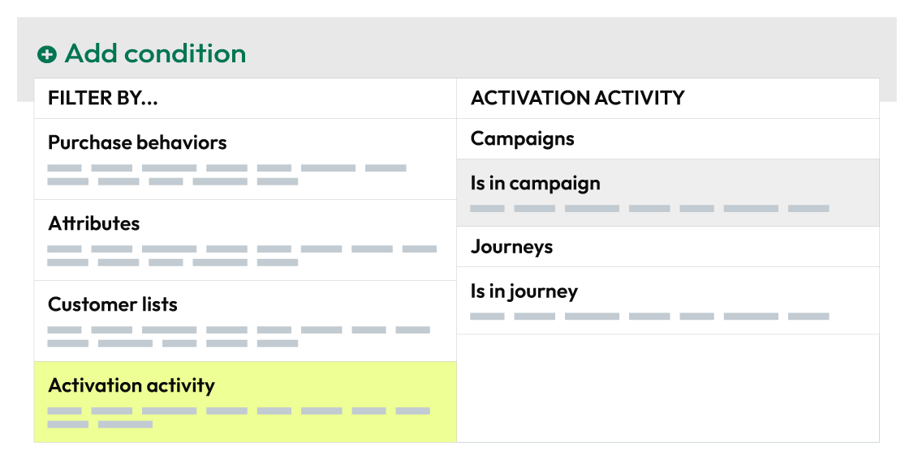
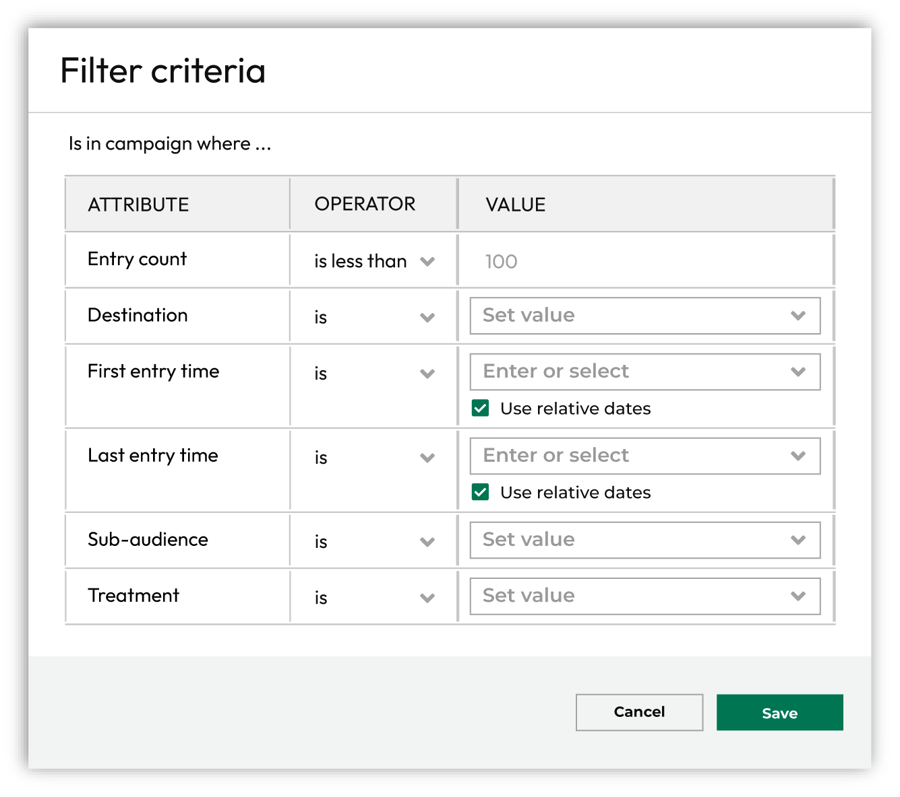
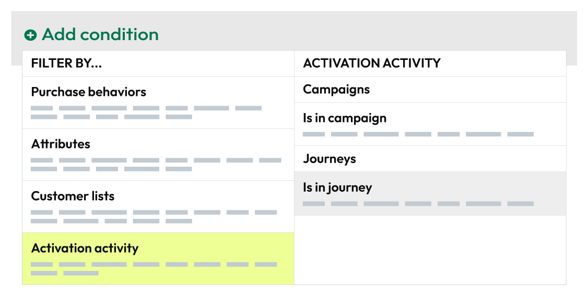
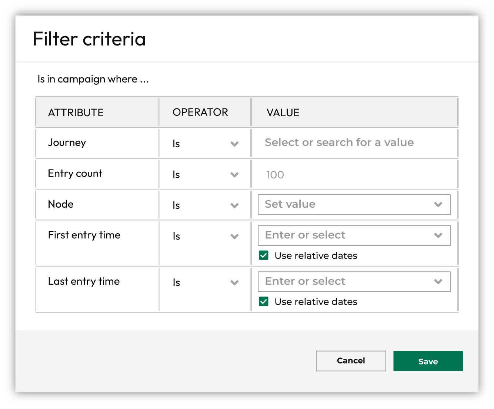

.. https://docs.amperity.com/user/

:orphan:

.. meta::
    :description lang=en:
        Which customers were part of campaigns and journeys.

.. meta::
    :content class=swiftype name=body data-type=text:
        Which customers were part of campaigns and journeys.

.. meta::
    :content class=swiftype name=title data-type=string:
        Activations

==================================================
Activations
==================================================

.. activations-about-start

Activations occur when audiences are sent from campaigns or journeys to downstream marketing workflows.

.. activations-about-end

.. _activations-activity:

Activation activity
==================================================

.. activations-activity-start

Amperity keeps track of activation activity for campaigns and journeys.

.. activations-activity-end

.. _activations-activity-campaigns:

Campaign activation states
--------------------------------------------------

.. data-tables-activation-states-campaigns-start

Activation states for campaigns keep track of customers who are activated by a campaign, including by sub-audience or treatment, by destination, how often and when.

.. data-tables-activation-states-campaigns-end

.. activations-activity-campaigns-howitworks-start

Campaigns start with an audience, and then divide that audience into sub-audiences and treatment groups. Members of sub-audiences may be held out of activation as part of a control group, but most members of sub-audiences meet conditions for activation, after which specific treatment groups within the sub-audiences are sent to downstream marketing applications, such as Braze, TikTok Ads, or The Trade Desk, for activation.

.. activations-activity-campaigns-howitworks-end

.. _activations-activity-campaigns-use:

Use in campaigns
++++++++++++++++++++++++++++++++++++++++++++++++++

.. activations-activity-campaigns-use-start

The **Is in campaign** filter returns a list of customers who belonged to a sub-audience or treatment group that was sent to a destination for activation and met all other criteria for the segment.

You can add the **Is in campaign** filter to a segment from the **Segment Editor**. Click **Add condition**, choose **Activiation activity**, and then select **Is in campaign**.

After the **Is in campaign** filter is added, configure the campaign activation state to use with the segment.

.. activations-activity-campaigns-use-end

.. include:: ../../amperity_operator/source/table_activation_states.rst
   :start-after: .. table-activation-states-campaigns-tip-start
   :end-before: .. table-activation-states-campaigns-tip-end

.. _activations-activity-campaigns-filters:

Filters for campaign states
++++++++++++++++++++++++++++++++++++++++++++++++++

.. activations-activity-campaigns-filters-start

Add activation states for campaigns to any segment.

.. important:: At least one campaign must be active before activation states for campaigns are accessible.

.. activations-activity-campaigns-filters-end

**Filter reference**

.. include:: ../../amperity_reference/source/data_tables.rst
   :start-after: .. data-tables-activation-states-campaigns-fields-start
   :end-before: .. data-tables-activation-states-campaigns-fields-end

.. _activations-activity-campaigns-examples:

Examples for campaigns
++++++++++++++++++++++++++++++++++++++++++++++++++

.. activations-activity-campaigns-examples-start

xxxxx

.. activations-activity-campaigns-examples-end

.. _activations-activity-journeys:

Journey activation states
--------------------------------------------------

.. data-tables-activation-states-journeys-start

Activation states for journeys keep track of customers who have entered a journey, along with which customers moved through specific nodes, including their first and last entry.

.. data-tables-activation-states-journeys-end

.. activations-activity-journeys-howitworks-start

Journeys start with an audience, and then define a variety of paths members of that audience will take as they move through each step in the journey. Audiences are split to follow different paths through the journey, depending on the criteria defined within the journey. When audiences meet the criteria for activation, that audience is sent to downstream marketing applications, such as Meta Ads Manager, Klaviyo, Braze, or Snapchat.

.. activations-activity-journeys-howitworks-end

.. _activations-activity-journeys-use:

Use in journeys
++++++++++++++++++++++++++++++++++++++++++++++++++

.. activations-activity-journeys-use-start

The **Is in journey** filter returns a list of customers who moved through the selected node within a journey and met all other criteria for the segment.

You can add the **Is in journey** filter to a segment from the **Segment Editor**. Click **Add condition**, choose **Activiation activity**, and then select **Is in journey**.

After the **Is in journey** filter is added, configure the journey activation state to use with the segment.

.. activations-activity-journeys-use-end

.. include:: ../../amperity_operator/source/table_activation_states.rst
   :start-after: .. table-activation-states-journeys-tip-start
   :end-before: .. table-activation-states-journeys-tip-end

.. _activations-activity-journeys-filters:

Filters for journey states
++++++++++++++++++++++++++++++++++++++++++++++++++

.. activations-activity-journeys-filters-start

Add activation states for journeys to any segment.

.. important:: At least one journey must be active before activation states for journeys are accessible.

.. activations-activity-journeys-filters-end

**Filter reference**

.. include:: ../../amperity_reference/source/data_tables.rst
   :start-after: .. data-tables-activation-states-journeys-fields-start
   :end-before: .. data-tables-activation-states-journeys-fields-end

.. _activations-activity-journeys-examples:

Examples for journeys
++++++++++++++++++++++++++++++++++++++++++++++++++

.. activations-activity-journeys-examples-start

xxxxx

.. activations-activity-journeys-examples-end

.. _activations-ids:

Activation IDs
==================================================

.. include:: ../../amperity_reference/source/segments_howtos.rst
   :start-after: .. segments-choose-activation-id-start
   :end-before: .. segments-choose-activation-id-end

**To choose an activation ID**

.. include:: ../../amperity_reference/source/segments_howtos.rst
   :start-after: .. segments-choose-activation-id-steps-start
   :end-before: .. segments-choose-activation-id-steps-end
