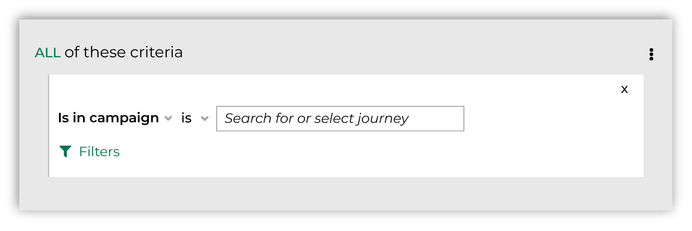
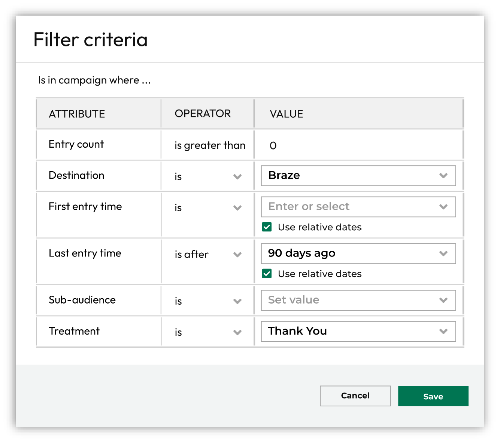
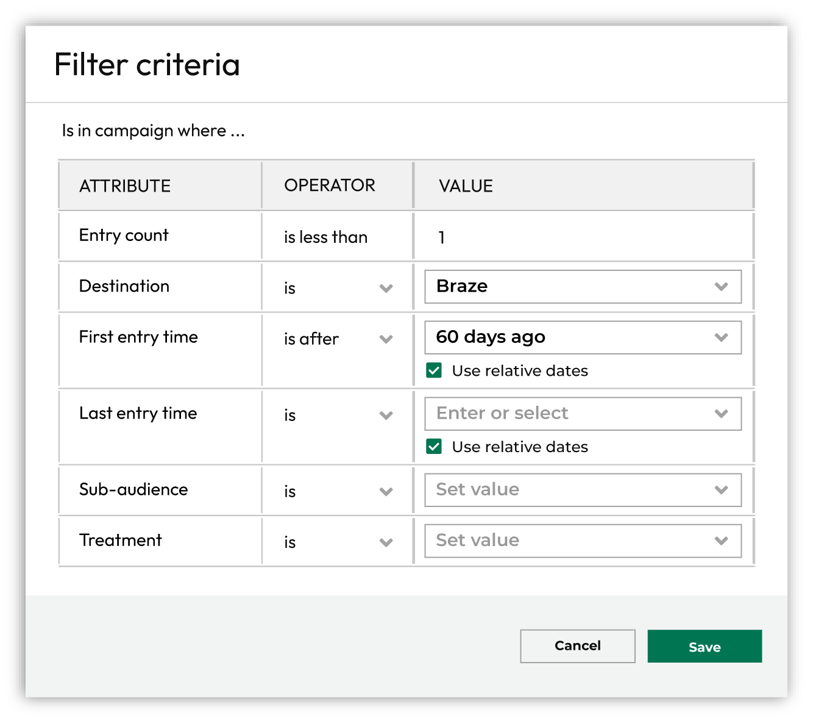
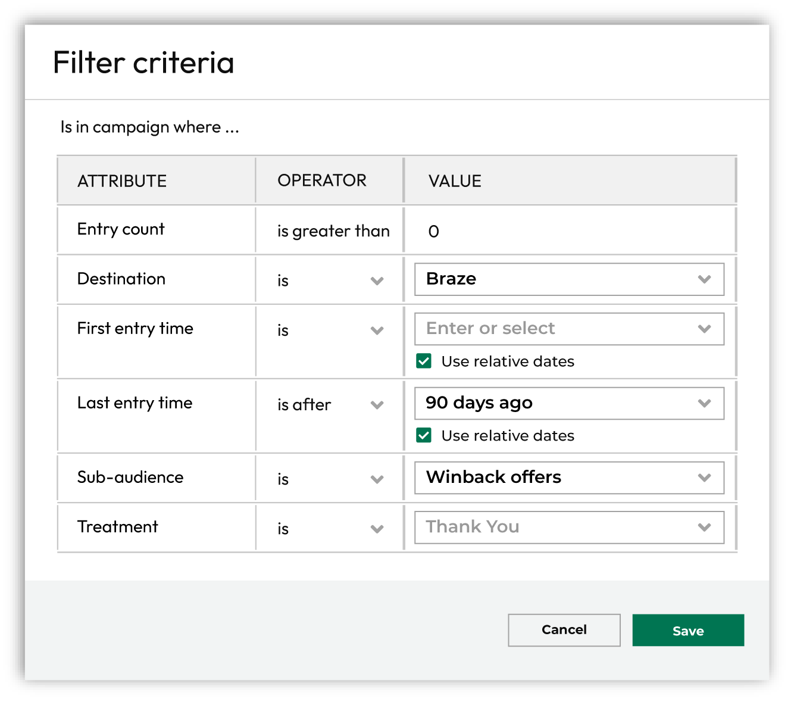
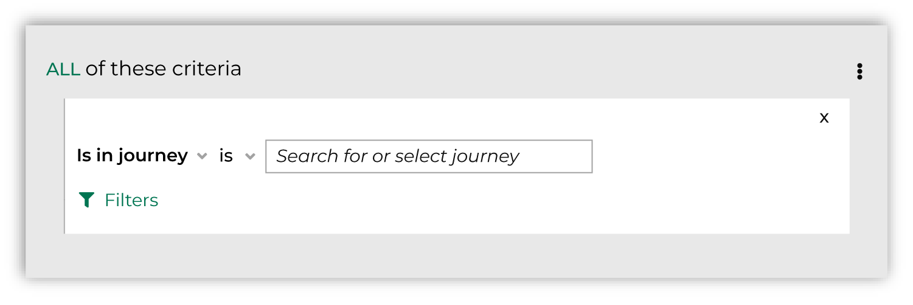
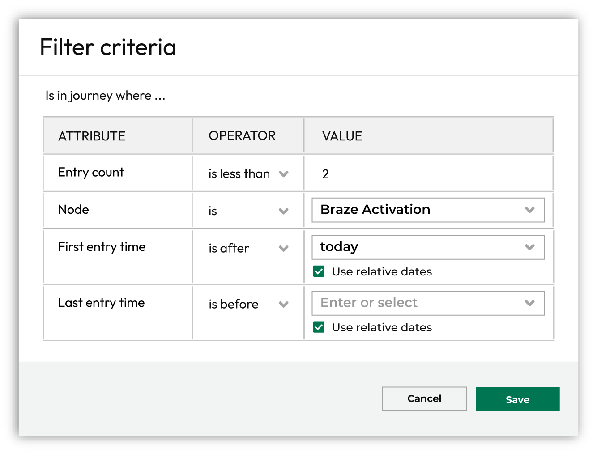
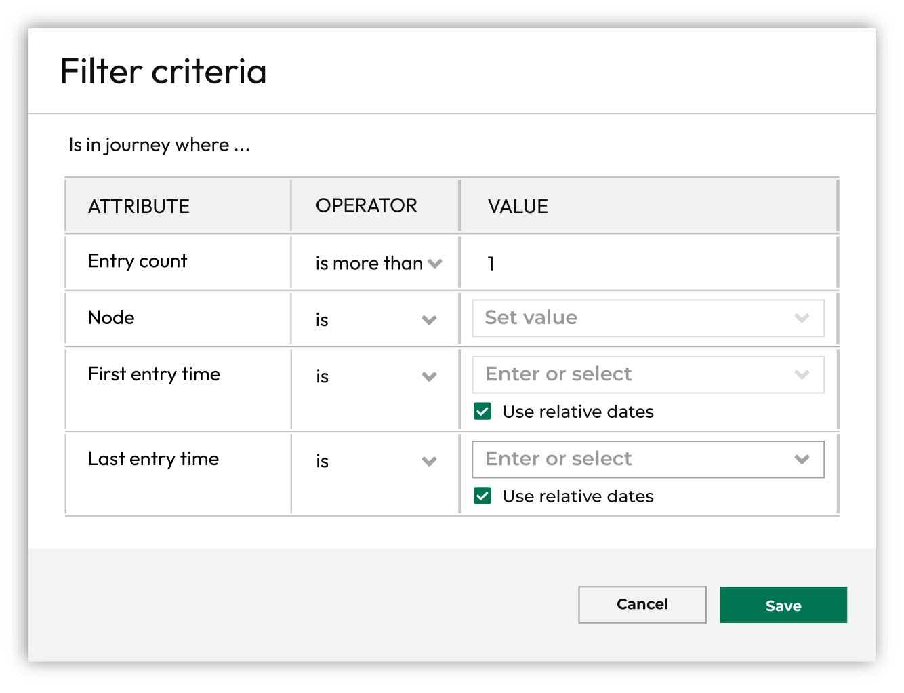
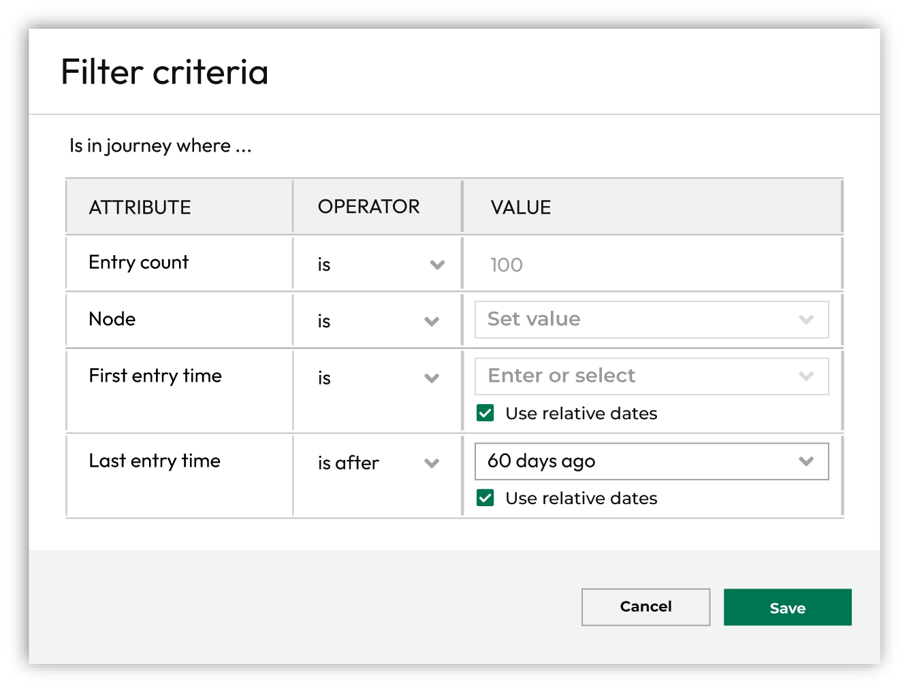
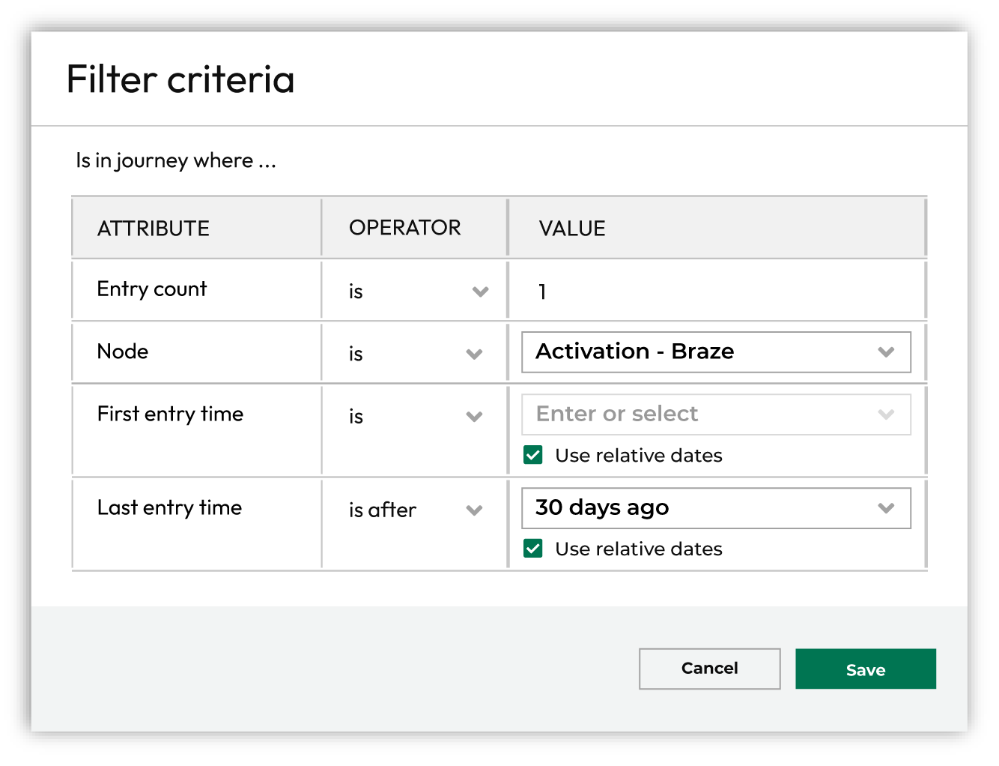

.. https://docs.amperity.com/user/

:orphan:

.. meta::
    :description lang=en:
        Which customers were part of campaigns and journeys.

.. meta::
    :content class=swiftype name=body data-type=text:
        Which customers were part of campaigns and journeys.

.. meta::
    :content class=swiftype name=title data-type=string:
        Activations

==================================================
Activations
==================================================

.. activations-about-start

Activations occur when audiences are sent by campaigns or journeys configured in Amperity to downstream marketing applications.

.. activations-about-end

.. _activations-activity:

Activation activity
==================================================

.. activations-activity-start

Amperity keeps track of activation activity for campaigns and journeys.

.. activations-activity-end

.. _activations-activity-campaigns:

Campaign activation states
--------------------------------------------------

.. data-tables-activation-states-campaigns-start

Activation states for campaigns keep track of customers who are activated by a campaign, including by sub-audience or treatment, by destination, how often and when.

.. data-tables-activation-states-campaigns-end

.. activations-activity-campaigns-howitworks-start

Campaigns start with an audience, and then divide that audience into sub-audiences and treatment groups. Members of sub-audiences may be held out of activation as part of a control group, but most members of sub-audiences meet conditions for activation, after which specific treatment groups within the sub-audiences are sent to downstream marketing applications, such as Braze, TikTok Ads, or The Trade Desk, for activation.

.. activations-activity-campaigns-howitworks-end

.. _activations-activity-campaigns-use:

Use in campaigns
++++++++++++++++++++++++++++++++++++++++++++++++++

.. activations-activity-campaigns-use-start

The **Is in campaign** filter returns a list of customers who belonged to a sub-audience or treatment group that was sent to a destination for activation and met all other criteria for the segment.

You can add the **Is in campaign** filter to a segment from the **Segment Editor**. Click **Add condition**, choose **Activiation activity**, and then select **Is in campaign**.

This adds the **Is in campaign** filter to the segment.

Click the **Filters** link to configure the campaign activation state for the segment.

.. activations-activity-campaigns-use-end

.. include:: ../../amperity_operator/source/table_activation_states.rst
   :start-after: .. table-activation-states-campaigns-tip-start
   :end-before: .. table-activation-states-campaigns-tip-end

.. _activations-activity-campaigns-filters:

Filters for campaign states
++++++++++++++++++++++++++++++++++++++++++++++++++

.. activations-activity-campaigns-filters-start

Add activation states for campaigns to any segment.

.. important:: At least one campaign must be active before activation states for campaigns are accessible.

.. activations-activity-campaigns-filters-end

**Filter reference**

.. activations-activity-campaigns-filters-reference-start

Use the following fields to filter segments for campaign activation states.

.. activations-activity-campaigns-filters-reference-end

.. include:: ../../amperity_reference/source/data_tables.rst
   :start-after: .. data-tables-activation-states-campaigns-fields-start
   :end-before: .. data-tables-activation-states-campaigns-fields-end

.. _activations-activity-campaigns-examples:

Examples for campaigns
++++++++++++++++++++++++++++++++++++++++++++++++++

.. activations-activity-campaigns-examples-start

The following examples show how to filter a configured campaign by activation activity.

* :ref:`Which treatment? <activations-activity-campaigns-example-treatment>`
* :ref:`Not in campaign? <activations-activity-campaigns-example-campaign>`
* :ref:`Include control group <activations-activity-campaigns-example-subaudience>`

You can use multiple activation activity filters and can combine activation activity filters with purchase behaviors, attributes, and customer lists to build more complex segments.

.. activations-activity-campaigns-examples-end

.. _activations-activity-campaigns-example-treatment:

Which treatment?
^^^^^^^^^^^^^^^^^^^^^^^^^^^^^^^^^^^^^^^^^^^^^^^^^^

.. activations-activity-campaigns-example-treatment-start

A company uses Braze to send "thank you" messages after specific types of interactions have occurred. This treatment is configured as a specific sub-audience in a campaign named "Thank You".

Build a list of customers who have not been part of the "Thank You" campaign within the last 90 days using a combination of entry count, destination and treatment names, and a time window that starts 90 days in the past.

.. activations-activity-campaigns-example-treatment-end

.. _activations-activity-campaigns-example-campaign:

Not in campaign?
^^^^^^^^^^^^^^^^^^^^^^^^^^^^^^^^^^^^^^^^^^^^^^^^^^

.. activations-activity-campaigns-example-campaign-start

Build a list of new customers who belong to audiences sent to Braze within the past 60 days using a combination of entry count and destination name.

.. activations-activity-campaigns-example-campaign-end

.. _activations-activity-campaigns-example-subaudience:

Include control group
^^^^^^^^^^^^^^^^^^^^^^^^^^^^^^^^^^^^^^^^^^^^^^^^^^

.. activations-activity-campaigns-example-subaudience-start

A sub-audience can be configured to have control groups *and* treatment groups. A :doc:`control group is a percentage of an audience that is held out of a campaign <people_based_measurement>` for the purpose of measuring campaign performance.

A company sends "Thank You" messages to a percentage of customers who have not purchased within the past 90 days, but holds some customers out of the "Thank You" campaign to measure if the message outperforms no message.

Build a list of customers who have been part of the "Winback" campaign, including customers in the "Thank You" treatment *and* the control group with a time window that includes all customers who belong to the sub-audience during the past 90 days.

.. activations-activity-campaigns-example-subaudience-end

.. _activations-activity-journeys:

Journey activation states
--------------------------------------------------

.. data-tables-activation-states-journeys-start

Activation states for journeys keep track of customers who have entered a journey, along with which customers moved through specific nodes, including their first and last entry.

.. data-tables-activation-states-journeys-end

.. activations-activity-journeys-howitworks-start

Journeys start with an audience, and then define a variety of paths members of that audience takes as they move through each step in the journey. Audiences are split to follow different paths through the journey, depending on the criteria defined within the journey. When audiences meet the criteria for activation, that audience is sent to downstream marketing applications, such as Meta Ads Manager, Klaviyo, Braze, or Snapchat.

.. activations-activity-journeys-howitworks-end

.. _activations-activity-journeys-use:

Use in journeys
++++++++++++++++++++++++++++++++++++++++++++++++++

.. activations-activity-journeys-use-start

The **Is in journey** filter returns a list of customers who moved through the selected node within a journey and met all other criteria for the segment.

You can add the **Is in journey** filter to a segment from the **Segment Editor**. Click **Add condition**, choose **Activiation activity**, and then select **Is in journey**.

This adds the **Is in journey** filter to the segment.

Click the **Filters** link to configure the journey activation state for the segment.

.. activations-activity-journeys-use-end

.. include:: ../../amperity_operator/source/table_activation_states.rst
   :start-after: .. table-activation-states-journeys-tip-start
   :end-before: .. table-activation-states-journeys-tip-end

.. _activations-activity-journeys-filters:

Filters for journey states
++++++++++++++++++++++++++++++++++++++++++++++++++

.. activations-activity-journeys-filters-start

Add activation states for journeys to any segment.

.. important:: At least one journey must be active before activation states for journeys are accessible.

.. activations-activity-journeys-filters-end

**Filter reference**

.. activations-activity-journeys-filters-reference-start

Use the following fields to filter segments for journey activation states.

.. activations-activity-journeys-filters-reference-end

.. include:: ../../amperity_reference/source/data_tables.rst
   :start-after: .. data-tables-activation-states-journeys-fields-start
   :end-before: .. data-tables-activation-states-journeys-fields-end

.. _activations-activity-journeys-examples:

Examples for journeys
++++++++++++++++++++++++++++++++++++++++++++++++++

.. activations-activity-journeys-examples-start

The following examples show how to filter a configured journey by activation activity.

* :ref:`Entered more than once? <activations-activity-journeys-example-multiple-entry>`
* :ref:`Not in journey? <activations-activity-journeys-example-notin>`
* :ref:`Passed through node within 30 days <activations-activity-journeys-example-node-passthrough>`

You can use multiple activation activity filters and can combine activation activity filters with purchase behaviors, attributes, and customer lists to build more complex segments.

.. activations-activity-journeys-examples-end

.. _activations-activity-journeys-example-multiple-entry:

Entered more than once?
^^^^^^^^^^^^^^^^^^^^^^^^^^^^^^^^^^^^^^^^^^^^^^^^^^

.. activations-activity-journeys-example-multiple-entry-start

Build a list of customers who have entered a journey more than once using the entry count filter.

.. activations-activity-journeys-example-multiple-entry-end

.. _activations-activity-journeys-example-notin:

Not in journey
^^^^^^^^^^^^^^^^^^^^^^^^^^^^^^^^^^^^^^^^^^^^^^^^^^

.. activations-activity-journeys-example-notin-start

Build a list of customers who have not been in the journey within the last 60 days using the last entry filter.

.. activations-activity-journeys-example-notin-end

.. _activations-activity-journeys-example-node-passthrough:

Passed through node within 30 days
^^^^^^^^^^^^^^^^^^^^^^^^^^^^^^^^^^^^^^^^^^^^^^^^^^

.. activations-activity-journeys-example-node-passthrough-start

Build a list of customers who have passed through an activation node within the last 30 days using a combination of the node filter and the last entry filter.

.. activations-activity-journeys-example-node-passthrough-end

.. _activations-ids:

Activation IDs
==================================================

.. include:: ../../amperity_reference/source/segments_howtos.rst
   :start-after: .. segments-choose-activation-id-start
   :end-before: .. segments-choose-activation-id-end

**To choose an activation ID**

.. include:: ../../amperity_reference/source/segments_howtos.rst
   :start-after: .. segments-choose-activation-id-steps-start
   :end-before: .. segments-choose-activation-id-steps-end
