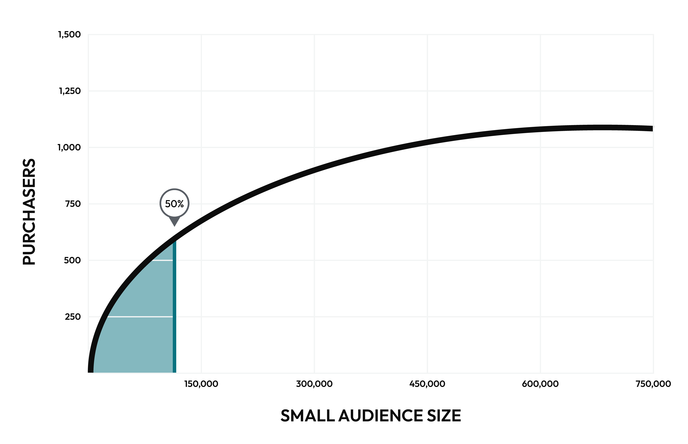

.. https://docs.amperity.com/user/

:orphan:

.. meta::
    :description lang=en:
        How large of an audience is required to grow revenue over the next 30 days? 

.. meta::
    :content class=swiftype name=body data-type=text:
        How large of an audience is required to grow revenue over the next 30 days?

.. meta::
    :content class=swiftype name=title data-type=string:
        Audience sizes

==================================================
Audience sizes
==================================================

.. include:: ../../shared/terms.rst
   :start-after: .. term-recommended-audience-size-start
   :end-before: .. term-recommended-audience-size-end

.. attribute-audience-sizes-start

Audience size attributes include:

* :ref:`Large audience sizes <attribute-audience-sizes-large>`
* :ref:`Medium audience sizes <attribute-audience-sizes-medium>`
* :ref:`Small audience sizes <attribute-audience-sizes-small>`

.. attribute-audience-sizes-end

.. include:: ../../amperity_reference/source/model_product_affinity.rst
   :start-after: .. model-product-affinity-recommended-audiences-usecase-start
   :end-before: .. model-product-affinity-recommended-audiences-usecase-end

.. include:: ../../amperity_reference/source/model_product_affinity.rst
   :start-after: .. model-product-affinity-use-cases-recommended-audiences-about-start
   :end-before: .. model-product-affinity-use-cases-recommended-audiences-about-end

.. important::

   .. include:: ../../amperity_user/source/recommended_audiences.rst
      :start-after: .. recommended-audience-sizes-low-purchase-frequencies-start
      :end-before: .. recommended-audience-sizes-low-purchase-frequencies-end

.. _attribute-audience-sizes-purchase-curve:

About the purchase curve
==================================================

.. include:: ../../shared/terms.rst
   :start-after: .. term-purchase-curve-start
   :end-before: .. term-purchase-curve-end

.. include:: ../../amperity_user/source/recommended_audiences.rst
   :start-after: .. recommended-audiences-purchase-curve-about-start
   :end-before: .. recommended-audiences-purchase-curve-about-end

.. image:: ../../images/use-cases-recommended-audience-size-all.png
   :width: 600 px
   :alt: All audience sizes and the purchase curve.
   :align: left
   :class: no-scaled-link

.. include:: ../../amperity_user/source/recommended_audiences.rst
   :start-after: .. recommended-audiences-purchase-curve-context-start
   :end-before: .. recommended-audiences-purchase-curve-context-end

.. _attribute-audience-sizes-large:

Large audience sizes
==================================================

.. include:: ../../shared/terms.rst
   :start-after: .. term-audience-size-large-start
   :end-before: .. term-audience-size-large-end

.. image:: ../../images/use-cases-recommended-audience-size-large.png
   :width: 600 px
   :alt: A large audience size.
   :align: left
   :class: no-scaled-link

.. include:: ../../amperity_reference/source/attribute_audience_sizes.rst
   :start-after: .. attribute-audience-sizes-large-start
   :end-before: .. attribute-audience-sizes-large-end

.. include:: ../../amperity_reference/source/attribute_audience_sizes.rst
   :start-after: .. attribute-audience-sizes-large-combine-with-product-start
   :end-before: .. attribute-audience-sizes-large-combine-with-product-end

.. _attribute-audience-sizes-medium:

Medium audience sizes
==================================================

.. include:: ../../shared/terms.rst
   :start-after: .. term-audience-size-medium-start
   :end-before: .. term-audience-size-medium-end

.. image:: ../../images/use-cases-recommended-audience-size-medium.png
   :width: 600 px
   :alt: A medium audience size.
   :align: left
   :class: no-scaled-link

.. include:: ../../amperity_reference/source/attribute_audience_sizes.rst
   :start-after: .. attribute-audience-sizes-medium-start
   :end-before: .. attribute-audience-sizes-medium-end

.. include:: ../../amperity_reference/source/attribute_audience_sizes.rst
   :start-after: .. attribute-audience-sizes-medium-combine-with-product-start
   :end-before: .. attribute-audience-sizes-medium-combine-with-product-end

.. _attribute-audience-sizes-small:

Small audience sizes
==================================================

.. include:: ../../shared/terms.rst
   :start-after: .. term-audience-size-small-start
   :end-before: .. term-audience-size-small-end

.. include:: ../../amperity_reference/source/attribute_audience_sizes.rst
   :start-after: .. attribute-audience-sizes-small-start
   :end-before: .. attribute-audience-sizes-small-end

.. include:: ../../amperity_reference/source/attribute_audience_sizes.rst
   :start-after: .. attribute-audience-sizes-small-combine-with-product-start
   :end-before: .. attribute-audience-sizes-small-combine-with-product-end

.. _attribute-audience-sizes-conditions:

Available operators
==================================================

.. include:: ../../amperity_reference/source/attribute_audience_sizes.rst
   :start-after: .. attribute-audience-sizes-conditions-start
   :end-before: .. attribute-audience-sizes-conditions-end
