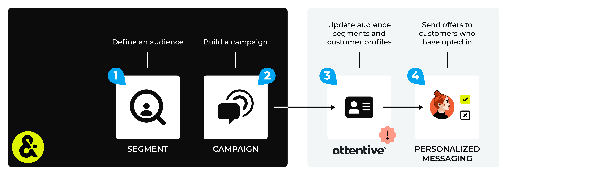

.. https://docs.amperity.com/user/

.. |destination-name| replace:: Attentive
.. |what-send| replace:: email address **OR** phone numbers, but not both, in the same audience
.. |what-enable| replace:: **email** or **phone**
.. |attributes-sent| replace:: |destination-name| requires email addresses *or* phone numbers. You must choose one (and not the other). There are no optional fields.
.. |allow-for-what| replace:: audience segments
.. |allow-for-duration| replace:: up to 24 hours

.. meta::
    :description lang=en:
        Use segments and campaigns to send audiences from Amperity to Attentive.

.. meta::
    :content class=swiftype name=body data-type=text:
        Use segments and campaigns to send audiences from Amperity to Attentive.

.. meta::
    :content class=swiftype name=title data-type=string:
        Send audiences to Attentive

==================================================
Send audiences to Attentive
==================================================

.. channel-attentive-start

You can use segments and campaigns to manage audience segments in |destination-name|. Each audience in |destination-name| has two components: subscribers and segments.

An audience segment is the list of customers to which you will send SMS messages or emails. Amperity is your source of truth for your customers who will belong to audience segments in |destination-name|. Send this list to |destination-name| from Amperity.

A subscriber is a customer for which you have an opt-in out status. You can only send SMS messages or emails to customers who have opted-in. |destination-name| is your source of truth for your audience's opt-in or opt-out and subscriber status.

.. channel-attentive-end

.. channel-attentive-diagram-steps-start

An |destination-name| destination works like this:

#. Use a segment to build a list of customers that will be sent SMS messages or emails.
#. Configure Amperity to use a campaign to send audience segments to |destination-name|.

   .. include:: ../../shared/channels.rst
      :start-after: .. channels-build-campaign-important-email-or-phone-start
      :end-before: .. channels-build-campaign-important-email-or-phone-end

#. Send a test audience from Amperity, and then from within |destination-name| verify that the **Segments** page has the list of customers that you sent from Amperity.

   .. note::

      .. include:: ../../shared/destinations.rst
         :start-after: .. destinations-add-destinations-intro-allow-for-start
         :end-before: .. destinations-add-destinations-intro-allow-for-end

#. Run campaigns directly from |destination-name| by sending personalized text messages to customers who have opted-in to receiving offers, promotions, and communication.

.. channel-attentive-diagram-steps-end

.. include:: ../../shared/channels.rst
   :start-after: .. channels-overview-note-start
   :end-before: .. channels-overview-note-end

.. caution:: This destination is available for sending campaign audiences to |destination-name| after it is configured by a Datagrid Operator or your Amperity representative.

   If this destintion cannot be selected from the campaigns editor or activations canvas ask your Datagrid Operator or Amperity representative to configure a destination for sending sending campaign audiences to |destination-name|.

.. _channel-attentive-names:

About campaign and group names
==================================================

.. channel-attentive-names-start

The campaign name and treatment group names are used to determine the segment name in |destination-name|.

Be sure to use descriptive names for campaigns *and* treatment groups and be careful to not use the default treatment group names when sending campaigns to |destination-name|.

This will ensure that downstream users in |destination-name| will be able to understand what each segment is for and won't have to view default naming patterns like "CampaignName_Recipient1", "CampaignName_Recipient2", etc.

.. channel-attentive-names-end

.. _channel-attentive-build-segment:

Build a segment
==================================================

.. include:: ../../shared/channels.rst
   :start-after: .. channels-build-segment-start
   :end-before: .. channels-build-segment-end

.. _attributes:

.. admonition:: Which attributes should you use?

   .. include:: ../../shared/channels.rst
      :start-after: .. channels-build-segment-context-start
      :end-before: .. channels-build-segment-context-end

.. _channel-attentive-build-campaign:

Add to a campaign
==================================================

.. include:: ../../shared/channels.rst
   :start-after: .. channels-build-campaign-start
   :end-before: .. channels-build-campaign-end

**To add Attentive to a campaign**

.. list-table::
   :widths: 10 90
   :header-rows: 0

   * - .. image:: ../../images/steps-01.png
          :width: 60 px
          :alt: Step 1.
          :align: center
          :class: no-scaled-link
     - .. include:: ../../shared/channels.rst
          :start-after: .. channels-build-campaign-steps-open-page-start
          :end-before: .. channels-build-campaign-steps-open-page-end

   * - .. image:: ../../images/steps-02.png
          :width: 60 px
          :alt: Step 2.
          :align: center
          :class: no-scaled-link
     - .. include:: ../../shared/channels.rst
          :start-after: .. channels-build-campaign-steps-destinations-start
          :end-before: .. channels-build-campaign-steps-destinations-end

       .. image:: ../../images/mockup-campaigns-destination-attentive.png
          :width: 500 px
          :alt: Add a destination for Attentive.
          :align: left
          :class: no-scaled-link

       .. include:: ../../shared/channels.rst
          :start-after: .. channels-build-campaign-steps-destinations-note-start
          :end-before: .. channels-build-campaign-steps-destinations-note-end

   * - .. image:: ../../images/steps-03.png
          :width: 60 px
          :alt: Step 3.
          :align: center
          :class: no-scaled-link
     - .. include:: ../../shared/channels.rst
          :start-after: .. channels-build-campaign-steps-edit-attributes-start
          :end-before: .. channels-build-campaign-steps-edit-attributes-end

       .. image:: ../../images/mockup-campaigns-attributes-attentive.png
          :width: 500 px
          :alt: Edit the attributes for Attentive.
          :align: left
          :class: no-scaled-link

       .. include:: ../../shared/channels.rst
          :start-after: .. channels-build-campaign-steps-edit-attributes-note-start
          :end-before: .. channels-build-campaign-steps-edit-attributes-note-end

.. _channel-attentive-configure-default-attributes:

Configure default attributes
==================================================

.. include:: ../../shared/channels.rst
   :start-after: .. channels-configure-default-attributes-start
   :end-before: .. channels-configure-default-attributes-end

.. channel-attentive-configure-default-attributes-start

Send a CSV file with one of the following attributes to |destination-name|:

* **email**
* **phone**

.. important:: An email address *and* a phone number cannot both be in the same CSV file.

.. channel-attentive-configure-default-attributes-end
