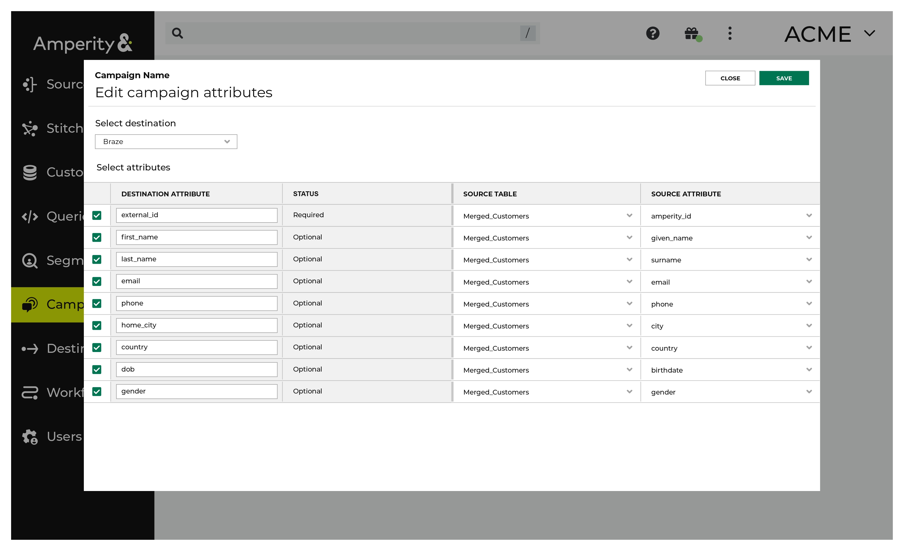

.. https://docs.amperity.com/user/

.. |destination-name| replace:: Braze
.. |what-send| replace:: custom attributes
.. |what-enable| replace:: a list of custom attributes
.. |attributes-sent| replace:: |destination-name| requires "extern_id" or "braze_id", along with a list of custom attributes that are defined by your brand.

.. meta::
    :description lang=en:
        Use segments and campaigns to send audiences from Amperity to Braze.

.. meta::
    :content class=swiftype name=body data-type=text:
        Use segments and campaigns to send audiences from Amperity to Braze.

.. meta::
    :content class=swiftype name=title data-type=string:
        Send audiences to Braze

==================================================
Send audiences to Braze
==================================================

.. destination-braze-context-start

You can send customer profile and custom attributes to |destination-name| using segments and campaigns. Build a segment that returns a list of active customers, and then associate that list of active customers with the custom attributes that you want to update in |destination-name|. Configure a campaign to send the audience of active customers as often as you need, and then configure a second campaign to send less frequently updates for all custom attributes.

.. destination-braze-context-end

.. include:: ../../shared/channels.rst
   :start-after: .. channels-overview-list-intro-start
   :end-before: .. channels-overview-list-intro-end

.. include:: ../../shared/channels.rst
   :start-after: .. channels-overview-note-start
   :end-before: .. channels-overview-note-end

.. include:: ../../shared/sendtos.rst
   :start-after: .. sendtos-ask-to-configure-campaigns-start
   :end-before: .. sendtos-ask-to-configure-campaigns-end

.. _channel-braze-about-braze-attributes:

About Braze attributes
==================================================

.. channel-braze-about-braze-attributes-start

Attributes in |destination-name| describe your customers.

* :ref:`Profile attributes <channel-braze-profile-attributes>` describe who your customers are. For example: names, birthdates, email addresses, and phone numbers.
* :ref:`Custom attributes <channel-braze-custom-attributes>` describe how your customers have interacted with your brand. For example: purchase histories, loyalty status, and value tiers.

.. channel-braze-about-braze-attributes-end

.. include:: ../../shared/braze.rst
   :start-after: .. braze-attributes-about-start
   :end-before: .. braze-attributes-about-end

.. _channel-braze-profile-attributes:

Customer profiles
--------------------------------------------------

.. include:: ../../shared/braze.rst
   :start-after: .. braze-customer-profiles-about-start
   :end-before: .. braze-customer-profiles-about-end

.. include:: ../../shared/braze.rst
   :start-after: .. braze-customer-profiles-admonition-start
   :end-before: .. braze-customer-profiles-admonition-end

.. destination-braze-profile-attributes-start

A campaign can send customer profile data to |destination-name| when attributes are configured to *match exactly* the names of the user profile fields in |destination-name|:

.. destination-braze-profile-attributes-end

.. include:: ../../shared/braze.rst
   :start-after: .. braze-customer-profiles-common-attributes-start
   :end-before: .. braze-customer-profiles-common-attributes-end

.. include:: ../../shared/braze.rst
   :start-after: .. braze-customer-profiles-common-attributes-note-start
   :end-before: .. braze-customer-profiles-common-attributes-note-end

.. _channel-braze-custom-attributes:

Custom attributes
--------------------------------------------------

.. include:: ../../shared/braze.rst
   :start-after: .. braze-custom-attributes-start
   :end-before: .. braze-custom-attributes-end

.. _channel-braze-use-in-segments:

Use in Braze segments
--------------------------------------------------

.. include:: ../../amperity_user/source/destination_braze.rst
   :start-after: .. destination-braze-use-in-segmentss-start
   :end-before: .. destination-braze-use-in-segments-end

.. _channel-braze-data-points:

About data points
--------------------------------------------------

.. include:: ../../shared/braze.rst
   :start-after: .. braze-data-points-start
   :end-before: .. braze-data-points-end

.. profile-api-usecase-braze-connected-content-does-not-use-data-points-start

.. important:: Connected Content does not write data to user profiles, which means you can use Connected Content to dynamically populate values into messages without consuming data points.

.. profile-api-usecase-braze-connected-content-does-not-use-data-points-end

.. _channel-braze-build-segment:

Build a segment
==================================================

.. include:: ../../shared/channels.rst
   :start-after: .. channels-build-segment-start
   :end-before: .. channels-build-segment-end

.. _attributes:

.. include:: ../../amperity_user/source/destination_braze.rst
   :start-after: .. sendto-braze-build-segments-whatfor-start
   :end-before: .. sendto-braze-build-segments-whatfor-end

.. _channel-braze-examples:

Example segments
--------------------------------------------------

.. channel-braze-examples-start

The following sections describe a series of use cases for |destination-name|:

#. An audience of customers who :ref:`purchased within the previous 24 hours <channel-braze-example-purchased-yesterday>`
#. An audience of :ref:`high-value customers <channel-braze-example-high-value>`
#. An audience that contains all :ref:`customer profiles <channel-braze-example-customer-profiles>`

The pattern these use cases describe is one where:

#. Updates for customers who have interacted with your brand most recently are updated most frequently. Your brand may choose to have several segments like this for a variety of use cases. Each segment may have unique custom attributes or you may have a shared set of custom attributes that work across all segments.
#. Updates for your most valuable customers are done on a regular basis. These are customers who are likely part of your larger churn prevention, winback, and other types of campaigns and are considered to be within your "active" to "cooling down" phase of marketing.
#. Updates to a large percentage of custom attributes are done less frequently. This list may include customers who are "lost", but may still represent value to your brand for future marketing activity. This update should also track where customers are at with regard to how your brand defines customer lifecycle.

.. channel-braze-examples-end

.. _channel-braze-example-purchased-yesterday:

Purchased yesterday
++++++++++++++++++++++++++++++++++++++++++++++++++

.. include:: ../../amperity_user/source/usecase_purchased_yesterday.rst
   :start-after: .. usecase-purchased-yesterday-start
   :end-before: .. usecase-purchased-yesterday-end

.. include:: ../../amperity_user/source/usecase_purchased_yesterday.rst
   :start-after: .. usecase-purchased-yesterday-howitworks-start
   :end-before: .. usecase-purchased-yesterday-howitworks-end

**WHICH CUSTOMERS PURCHASED YESTERDAY?**

.. include:: ../../amperity_user/source/usecase_purchased_yesterday.rst
   :start-after: .. usecase-purchased-yesterday-howitworks-callouts-start
   :end-before: .. usecase-purchased-yesterday-callouts-end

.. _channel-braze-example-high-value:

High-value customers
++++++++++++++++++++++++++++++++++++++++++++++++++

.. channel-braze-example-high-value-start

Build an audience of high-value customers. Configure a recurring campaign to send this audience to |destination-name| on a regular basis, such as weekly or bi-weekly. Use this audience maintain the custom attributes that are associated with your most valuable customers.

.. note:: This example uses Amperity predicted value tiers, but you can use any metric within your customer 360 database that defines your most valuable customers.

.. channel-braze-example-high-value-end

.. include:: ../../amperity_user/source/usecase_predicted_top_10_percent.rst
   :start-after: .. usecase-predicted-top-10-percent-howitworks-start
   :end-before: .. usecase-predicted-top-10-percent-howitworks-end

**WHO ARE YOUR HIGH-VALUE CUSTOMERS?**

.. channel-braze-example-high-value-steps-start

.. list-table::
   :widths: 10 90
   :header-rows: 0

   * - .. image:: ../../images/steps-01.png
          :width: 60 px
          :alt: Open the Segment Editor.
          :align: center
          :class: no-scaled-link

     - Open the **Segment Editor**, look in the lower-right of the page and make sure your customer 360 database is selected.

       .. image:: ../../images/mockup-segments-tab-database-and-tables-small.png
          :width: 350 px
          :alt: Use your customer 360 database to build segments.
          :align: left
          :class: no-scaled-link

   * - .. image:: ../../images/steps-02.png
          :width: 60 px
          :alt:   Return a list of the customers with a predicted platinum, gold, or silver value.
          :align: center
          :class: no-scaled-link

     - Identify customers whose predicted customer lifetime value is platinum, gold, or silver. Choose the **Predicted Customer Lifetime Value Tier** attribute from the **Predicted CLV Attributes** table, select the "is in list" operator, and then select "Platinum", "Gold", *and* "Silver" from the list:

       .. image:: ../../images/usecases-predicted-value-tier-is-in-list.png
          :width: 540 px
          :alt: Find customers with a predicted platinum, gold, or silver value.
          :align: left
          :class: no-scaled-link

       Click the **Refresh** button located on the right side of the **Segment Editor** to see how many customers are in your segment, how much they spent in the past year, how many are active, and how many of them should belong to a future campaign.

   * - .. image:: ../../images/steps-03.png
          :width: 60 px
          :alt: Save your segment.
          :align: center
          :class: no-scaled-link
     - You are done building your audience. Click the **Save As** button in the top right corner of the **Segment Editor**. Give your segment a name that describes the purpose and audience type for the segment. For example: "Predicted Top 10% High Value Customers".

       .. image:: ../../images/usecases-dialog-save-top-10-high-value-customers.png
          :width: 440 px
          :alt: Give your segment a name.
          :align: left
          :class: no-scaled-link

.. channel-braze-example-high-value-steps-end

.. _channel-braze-example-customer-profiles:

Update customer profiles
++++++++++++++++++++++++++++++++++++++++++++++++++

.. channel-braze-example-customer-profiles-start

Build an audience that contains customer profiles -- first and last name, email address, phone number, external ID, gender, birthdate, city, and country. This audience should be updated on a regular basis. For example, every 30 days.

.. note:: This example assumes that your customer 360 database has a table from which a segment can access the |destination-name| **external_id**. For example, a |braze_table| in your customer 360 database that is unique by Amperity ID and contains all of the default user attributes that you want to update in |destination-name|. This table may also contain custom attributes.

.. channel-braze-example-customer-profiles-end

The following sections describe using the **Segment Editor** to build update |destination-name| user profile attributes with values from customer profiles in Amperity.

**UPDATE CUSTOMER PROFILE ATTRIBUTES**

.. channel-braze-example-customer-profiles-steps-start

.. list-table::
   :widths: 10 90
   :header-rows: 0

   * - .. image:: ../../images/steps-01.png
          :width: 60 px
          :alt: Open the Segment Editor.
          :align: center
          :class: no-scaled-link

     - Open the **Segment Editor**, look in the lower-right of the page and make sure your customer 360 database is selected.

       .. image:: ../../images/mockup-segments-tab-database-and-tables-small.png
          :width: 350 px
          :alt: Use your customer 360 database to build segments.
          :align: left
          :class: no-scaled-link

   * - .. image:: ../../images/steps-02.png
          :width: 60 px
          :alt:   Build an audience that updates user profile attributes in Braze.
          :align: center
          :class: no-scaled-link

     - Build an audience of customer profiles to be updated in |destination-name|. Use the **External ID** attribute from the table that contains |destination-name| attributes, and then select the "is not blank" operator:

       .. image:: ../../images/usecases-braze_external_id_is_not_blank.png
          :width: 540 px
          :alt: Find customers that have a Braze external ID.
          :align: left
          :class: no-scaled-link

       Click the **Refresh** button located on the right side of the **Segment Editor** to see how many customers are in your segment, how much they spent in the past year, how many are active, and how many of them should belong to a future campaign.

   * - .. image:: ../../images/steps-03.png
          :width: 60 px
          :alt: Save your segment.
          :align: center
          :class: no-scaled-link
     - You are done building your audience. Click the **Save As** button in the top right corner of the **Segment Editor**. Give your segment a name that describes the purpose and audience type for the segment. For example: "Braze Customer Profiles".

       .. image:: ../../images/usecases-dialog-save-top-10-high-value-customers.png
          :width: 440 px
          :alt: Give your segment a name.
          :align: left
          :class: no-scaled-link

   * - .. image:: ../../images/steps-04.png
          :width: 60 px
          :alt: Save your segment.
          :align: center
          :class: no-scaled-link
     - Add this audience to a campaign that uses a single sub-audience to send customer profile updates to |destination-name| on a regular basis. For example, every 30 days.

       Configure the list of attributes to meet the naming requirements for :ref:`user profile fields <destination-braze-profile-attributes>`, including naming and lowercase:

       .. image:: ../../images/usecases-braze-edit-attributes.png
          :width: 440 px
          :alt: Configure the list of attributes to match the user profile field requirements for Braze.
          :align: left
          :class: no-scaled-link

.. channel-braze-example-customer-profiles-steps-end

.. _channel-braze-build-campaign:

Add to a campaign
==================================================

.. include:: ../../shared/channels.rst
   :start-after: .. channels-build-campaign-start
   :end-before: .. channels-build-campaign-end

**To add Braze to a campaign**

.. list-table::
   :widths: 10 90
   :header-rows: 0

   * - .. image:: ../../images/steps-01.png
          :width: 60 px
          :alt: Step 1.
          :align: center
          :class: no-scaled-link
     - .. include:: ../../shared/channels.rst
          :start-after: .. channels-build-campaign-steps-open-page-start
          :end-before: .. channels-build-campaign-steps-open-page-end

   * - .. image:: ../../images/steps-02.png
          :width: 60 px
          :alt: Step 2.
          :align: center
          :class: no-scaled-link
     - .. include:: ../../shared/channels.rst
          :start-after: .. channels-build-campaign-steps-destinations-start
          :end-before: .. channels-build-campaign-steps-destinations-end

       .. image:: ../../images/mockup-campaigns-destination-braze.png
          :width: 500 px
          :alt: Add a destination for Braze.
          :align: left
          :class: no-scaled-link

       .. include:: ../../shared/channels.rst
          :start-after: .. channels-build-campaign-steps-destinations-note-start
          :end-before: .. channels-build-campaign-steps-destinations-note-end

   * - .. image:: ../../images/steps-03.png
          :width: 60 px
          :alt: Step 3.
          :align: center
          :class: no-scaled-link
     - .. include:: ../../shared/channels.rst
          :start-after: .. channels-build-campaign-steps-edit-attributes-start
          :end-before: .. channels-build-campaign-steps-edit-attributes-end

       .. image:: ../../images/mockup-campaigns-attributes-braze.png
          :width: 500 px
          :alt: Edit the attributes for Braze.
          :align: left
          :class: no-scaled-link

       .. include:: ../../shared/channels.rst
          :start-after: .. channels-build-campaign-steps-edit-attributes-note-start
          :end-before: .. channels-build-campaign-steps-edit-attributes-note-end

       .. important:: Custom attributes may be sent in addition to the list of customer profile attributes that specifically match |destination-name| default attributes. Ask your Amperity representative for help configuring your tenant to match the list of custom attributes that you want to send to |destination-name| from Amperity.

.. _channel-braze-configure-default-attributes:

Configure default attributes
==================================================

.. include:: ../../shared/channels.rst
   :start-after: .. channels-configure-default-attributes-start
   :end-before: .. channels-configure-default-attributes-end

.. channel-braze-configure-default-attributes-start

|destination-name| has the following requirements for attributes.

.. list-table::
   :widths: 50 50
   :header-rows: 1

   * - **Source attribute**
     - **Destination attribute**

   * - email
     - email

.. channel-braze-configure-default-attributes-end
