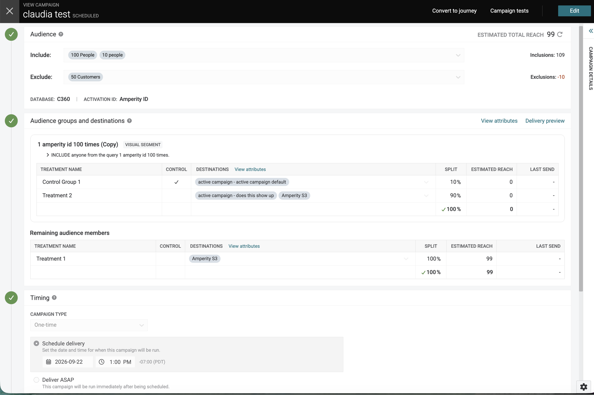
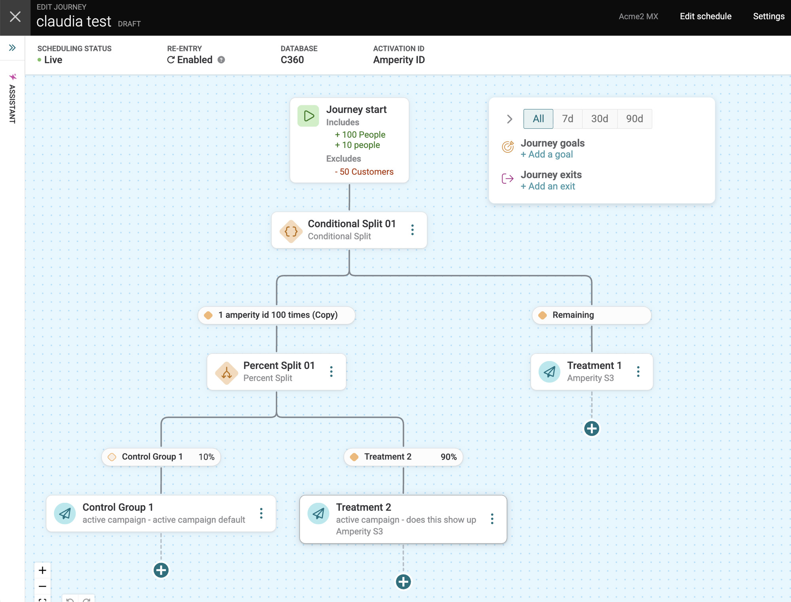
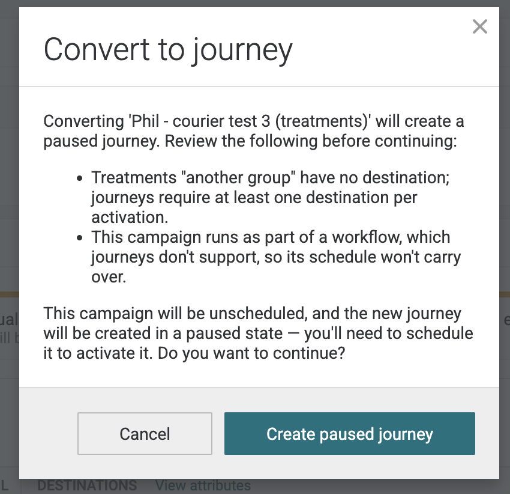
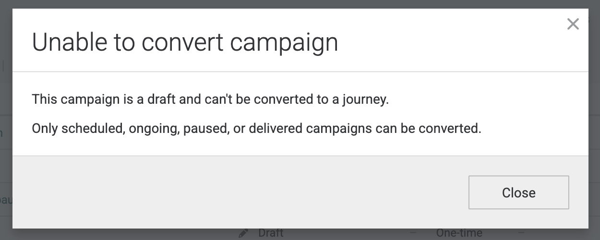
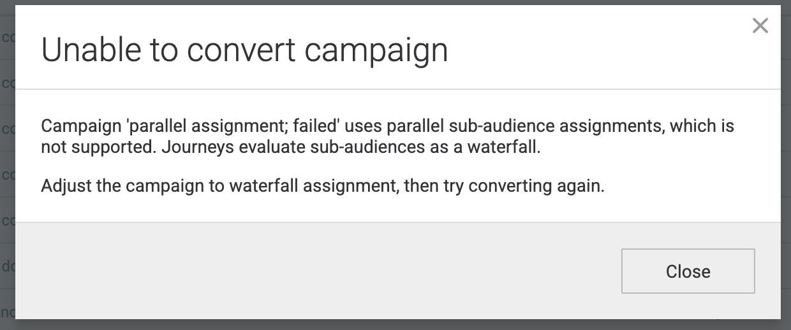
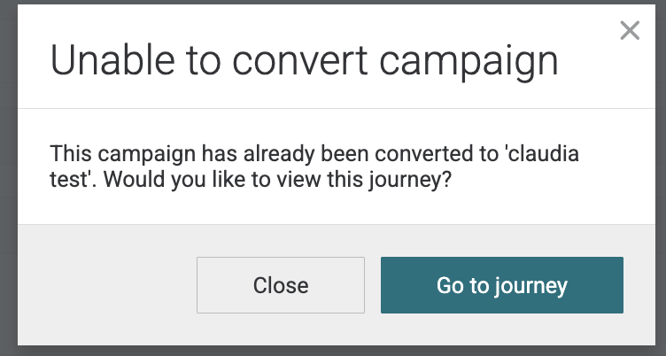
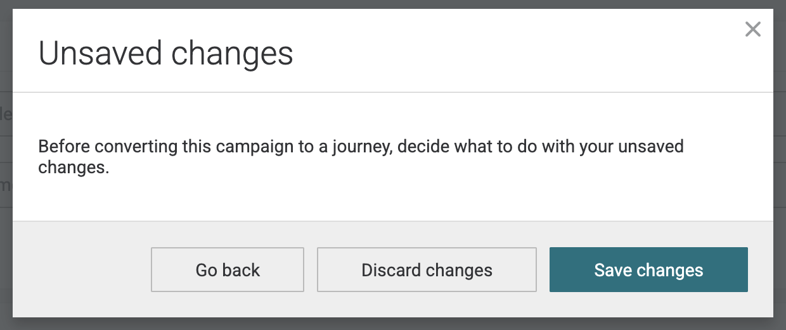

.. https://docs.amperity.com/user/

:orphan:

.. meta::
    :description lang=en:
        Convert an existing campaign to a journey without rebuilding it by hand.

.. meta::
    :content class=swiftype name=body data-type=text:
        Convert an existing campaign to a journey without rebuilding it by hand.

.. meta::
    :content class=swiftype name=title data-type=string:
        Convert campaigns to journeys

==================================================
Convert campaigns to journeys
==================================================

.. convert-campaigns-about-start

Use **Convert to journey** to rebuild an existing campaign as a journey. Amperity reads the campaign, maps its audience, sub-audiences, treatment groups, destinations, and schedule onto the journey canvas, and then opens the new journey so that you can extend it.

A campaign is a single-touch send with a fixed shape. A journey is a canvas, which means that after a campaign is converted you can add delays, conditional splits, goals, and exits to the sequence that the campaign already describes.

.. convert-campaigns-about-end

.. important:: Converting a campaign unschedules it.

   When a journey is created successfully, Amperity unschedules the source campaign so that the campaign and the journey cannot send to the same customers. The campaign is not deleted and it is not archived. It remains available as an unscheduled campaign, and you can schedule it again at any time. See :ref:`convert-campaigns-source`.

.. important:: Only **scheduled**, **ongoing**, **paused**, and **delivered** campaigns can be converted.

   A campaign that is a **draft**, that is currently **delivering**, or that is in an **error** state cannot be converted to a journey. Schedule a draft campaign before you convert it, and wait for a delivering campaign to finish. See :ref:`convert-campaigns-blocked`.

.. note:: You must have permission to edit campaigns *and* permission to author journeys. If you can edit campaigns but not journeys, the action does not appear.

.. _convert-campaigns-start:

Convert a campaign
==================================================

.. convert-campaigns-steps-start

A campaign can be converted from the **Campaigns** page or from within the campaign itself.

.. list-table::
   :widths: 10 90
   :header-rows: 0

   * - .. image:: ../../images/steps-01.png
          :width: 60 px
          :alt: Step one.
          :align: center
          :class: no-scaled-link
     - Open **Convert to journey**.

       On the **Campaigns** page, open the |fa-kebab| menu for a campaign and then select **Convert to journey**.

       .. image:: ../../images/mockup-campaigns-convert-to-journey-menu.png
          :width: 600 px
          :alt: The Convert to journey action in the campaign row menu.
          :align: left
          :class: no-scaled-link

       You can also open a campaign and then select **Convert to journey** in the campaign header.

       .. image:: ../../images/mockup-campaigns-convert-to-journey-button.png
          :width: 600 px
          :alt: The Convert to journey button in the campaign header.
          :align: left
          :class: no-scaled-link

   * - .. image:: ../../images/steps-02.png
          :width: 60 px
          :alt: Step two.
          :align: center
          :class: no-scaled-link
     - Review the preview.

       Amperity inspects the campaign before anything is created and then opens a dialog that describes what will happen. Nothing is written to your tenant at this point, and closing the dialog leaves the campaign unchanged.

       The dialog you see depends on the campaign:

       * A campaign that maps cleanly opens a confirmation dialog.
       * A campaign with issues that you can correct opens a dialog that lists them. See :ref:`convert-campaigns-warnings`.
       * A campaign that cannot be converted opens a dialog that explains why. See :ref:`convert-campaigns-blocked`.
       * A campaign that was already converted offers a link to the existing journey. See :ref:`convert-campaigns-already-converted`.

       .. image:: ../../images/mockup-campaigns-convert-to-journey-confirm.png
          :width: 500 px
          :alt: The Convert to journey confirmation dialog.
          :align: left
          :class: no-scaled-link

   * - .. image:: ../../images/steps-03.png
          :width: 60 px
          :alt: Step three.
          :align: center
          :class: no-scaled-link
     - Select **Create journey**.

       Amperity creates the journey and then unschedules the source campaign so that the campaign and the journey cannot send to the same customers at the same time.

       The source campaign is never deleted. It remains available as an unscheduled campaign.

   * - .. image:: ../../images/steps-04.png
          :width: 60 px
          :alt: Step four.
          :align: center
          :class: no-scaled-link
     - Review the journey on the canvas.

       Amperity opens the new journey so that you can review the audience, the splits, and each activation before the journey sends.

       .. image:: ../../images/mockup-campaigns-convert-to-journey-result-canvas.jpg
          :width: 600 px
          :alt: The converted campaign on the journey canvas.
          :align: left
          :class: no-scaled-link

.. convert-campaigns-steps-end

.. _convert-campaigns-mapping:

What a converted journey contains
==================================================

.. convert-campaigns-mapping-start

The converted journey describes the same audience and the same sends as the source campaign.

.. list-table::
   :widths: 40 60
   :header-rows: 1

   * - Campaign
     - Journey

   * - Included and excluded segments
     - The audience on **Journey start**.

   * - Sub-audiences
     - A conditional split with one path per sub-audience, evaluated in order, plus a trailing **Remaining** path that carries the campaign's remaining audience members.

   * - Treatment groups
     - A percent split with one path per treatment, carrying each treatment's percentage. A control group is marked as a control on its path. A sub-audience with a single, non-control treatment maps directly to one activation node instead of a split.

   * - Each treatment and its destinations
     - An activate node that sends to the same destinations.

   * - Audience attributes and custom attributes
     - The same attributes on the journey. Attributes set for the whole campaign apply to the journey, and attributes set on a sub-audience or a treatment apply to the matching nodes.

   * - Campaign type and delivery time
     - The journey schedule. A campaign set to **Deliver ASAP** becomes a one-time journey that delivers at the time you convert it.

   * - Campaign name
     - The journey name. If a journey with that name already exists, Amperity appends a number, such as ``Winback (2)``.

.. convert-campaigns-mapping-end

The following campaign, with one sub-audience, a control group, and a remaining treatment:

converts to the following journey:

.. important:: Re-entry is enabled on a converted journey so that the journey sends the way the campaign did.

   A campaign sends to everyone in its audience each time it runs. A journey admits only new customers on each run unless re-entry is enabled. Enabling re-entry preserves the sending behavior of a recurring campaign after it is converted.

.. _convert-campaigns-source:

What happens to the source campaign
==================================================

.. convert-campaigns-source-start

The source campaign is unscheduled and kept. It is not deleted, and it is not archived.

Keeping the campaign means that you can compare the journey against the campaign it came from, and that you can reschedule the campaign if you decide not to use the journey.

.. note:: If the journey is created but the campaign cannot be unscheduled, Amperity creates the journey and then tells you to unschedule the campaign yourself. Unschedule it before the journey sends so that customers do not receive the same message twice.

.. convert-campaigns-source-end

.. _convert-campaigns-warnings:

Campaigns that convert with warnings
==================================================

.. convert-campaigns-warnings-start

Some campaigns contain settings that a journey cannot use as-is, but that you can correct on the journey canvas. Amperity lists these before anything is created.

Select **Create paused journey** to continue. Amperity creates the journey in a paused state, which means the journey exists on the canvas but does not send. Correct the issues that were listed, and then schedule the journey to activate it.

.. list-table::
   :widths: 40 60
   :header-rows: 1

   * - Warning
     - What to do

   * - A treatment has no destination.
     - Add at least one destination to each activate node. A journey requires a destination on every activate node.

   * - The campaign runs as part of a workflow.
     - The campaign schedule is not carried over. Schedule the journey.

   * - The campaign uses more than 10 included or excluded segments.
     - Reduce the journey to 10 or fewer of each.

   * - A treatment uses a fractional percentage.
     - Change the percentages to whole numbers.

   * - A destination attribute is missing its source table or field.
     - Complete the attribute.

   * - A treatment name contains an unsupported character or matches a generated split name.
     - Rename the node.

   * - Two or more activate nodes would write to the same file path and overwrite each other.
     - Add ``{{group_name}}`` to the destination filename template, or send the nodes to separate destinations.

.. convert-campaigns-warnings-end

.. note:: A paused campaign always converts to a paused journey, even when no warnings apply. A journey has no equivalent of a scheduled-but-stopped campaign, so carrying the schedule over would restart sends that you had stopped. Schedule the journey when you are ready for it to send.

.. _convert-campaigns-blocked:

Campaigns that cannot be converted
==================================================

.. convert-campaigns-blocked-start

A campaign is refused when its status is unsupported, or when it describes behavior that a journey cannot reproduce. Amperity explains why and creates nothing.

**Campaign status** is the most common reason a campaign cannot be converted. Draft campaigns, campaigns that are currently delivering, and campaigns in an error state are all refused. Only scheduled, ongoing, paused, and delivered campaigns can be converted.

The remaining reasons describe campaign settings that have no journey equivalent.

.. list-table::
   :widths: 40 60
   :header-rows: 1

   * - Reason
     - What to do

   * - The campaign is a draft, is still delivering, or is in an error state.
     - Only scheduled, ongoing, paused, and delivered campaigns can be converted. Wait for a delivering campaign to finish, or schedule a draft campaign first.

   * - The campaign is archived.
     - Archived campaigns cannot be converted.

   * - The campaign assigns sub-audiences in parallel and has more than one sub-audience.
     - A journey evaluates sub-audiences as a waterfall. Change the campaign to waterfall assignment, and then convert it.

   * - The campaign uses attribute filters.
     - Remove the attribute filters, and then convert the campaign.

   * - A destination sends a single aggregate file, and more than one recipient group sends to it.
     - A journey sends one file per node. Change the destination to send multiple files, and then convert the campaign.

   * - A sub-audience has no criteria and no saved segment.
     - Add criteria to the sub-audience, and then convert the campaign.

.. convert-campaigns-blocked-end

.. _convert-campaigns-already-converted:

Campaigns that were already converted
==================================================

.. convert-campaigns-already-converted-start

A campaign can be converted once. If you convert a campaign that already has a journey, Amperity does not create a second journey and instead offers to open the existing one.

Select **Go to journey** to open it.

.. convert-campaigns-already-converted-end

.. _convert-campaigns-unsaved:

Convert a campaign that has unsaved changes
==================================================

.. convert-campaigns-unsaved-start

A conversion reads the campaign as it is saved, which means unsaved edits are not included. If you convert while editing a campaign that has unsaved changes, Amperity asks what to do with them first.

.. list-table::
   :widths: 30 70
   :header-rows: 1

   * - Option
     - Result

   * - **Save changes**
     - Saves the campaign, and then converts the saved campaign.

   * - **Discard changes**
     - Discards the edits, and then converts the last saved version of the campaign.

   * - **Go back**
     - Closes the dialog and returns you to the campaign. Nothing is saved or converted.

Neither **Save changes** nor **Discard changes** creates a journey on its own. The conversion continues to the confirmation dialog described in :ref:`convert-campaigns-start`.

If the campaign has unsaved changes that cannot be saved because a section is incomplete, Amperity tells you that the changes cannot be saved and offers to convert the last saved version instead.

.. convert-campaigns-unsaved-end

.. _convert-campaigns-after:

After a campaign is converted
==================================================

.. convert-campaigns-after-start

Review the new journey before it sends.

#. Confirm the audience on **Journey start**, along with the paths and percentages on each split.
#. Confirm the destinations and attributes on each activate node.
#. Review the schedule and the re-entry setting.
#. If the journey was created in a paused state, correct the issues that were listed during conversion, and then schedule the journey.

A converted journey behaves like any other journey. You can add delays, conditional splits, goals, and exits to it.

.. convert-campaigns-after-end
