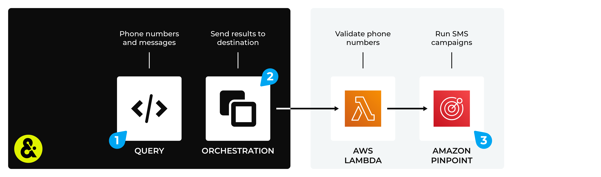

.. https://docs.amperity.com/user/

.. |destination-name| replace:: Amazon Pinpoint
.. |what-send| replace:: phone numbers and SMS message strings
.. |lambda-validate| replace:: phone numbers

.. meta::
    :description lang=en:
        Use orchestrations to send query results from Amperity to Amazon Pinpoint.

.. meta::
    :content class=swiftype name=body data-type=text:
        Use orchestrations to send query results from Amperity to Amazon Pinpoint.

.. meta::
    :content class=swiftype name=title data-type=string:
        Send query results to Amazon Pinpoint

==================================================
Send query results to Amazon Pinpoint
==================================================

.. sendto-amazon-pinpoint-howitworks-start

You can send phone numbers and SMS message strings from Amperity to |destination-name|. First build a query that outputs phone numbers and a message. Then use an orchestration to send that data from Amperity to |destination-name|.

   .. note:: A Lambda function running in AWS Lambda validates phone numbers, and then only sends validated phone numbers to |destination-name|.

.. sendto-amazon-pinpoint-howitworks-end

.. sendto-amazon-pinpoint-steps-to-send-start

.. include:: ../../shared/destinations.rst
   :start-after: .. destinations-overview-list-intro-start
   :end-before: .. destinations-overview-list-intro-end

#. :ref:`Build a query <sendto-amazon-pinpoint-build-query>`
#. :ref:`Add orchestration <sendto-amazon-pinpoint-add-orchestration>`
#. :ref:`Run orchestration <sendto-amazon-pinpoint-run-orchestration>`

.. sendto-amazon-pinpoint-steps-to-send-end

.. include:: ../../shared/sendtos.rst
   :start-after: .. sendtos-ask-to-configure-webhook-start
   :end-before: .. sendtos-ask-to-configure-webhook-end

.. _sendto-amazon-pinpoint-build-query:

Build query
==================================================

.. sendto-amazon-pinpoint-build-query-start

Build a query that returns phone numbers and SMS message strings. For example:

.. code-block:: sql
   :linenos:

   SELECT
     phone as "phone_number"
     ,CONCAT('Hello ', given_name, '! Please enjoy 25% more content on your next visit to https://docs.amperity.com') AS "message"
   FROM Merged_Customers

.. sendto-amazon-pinpoint-build-query-end

.. include:: ../../shared/sendtos.rst
   :start-after: .. sendtos-build-query-webhook-lambda-note-start
   :end-before: .. sendtos-build-query-webhook-lambda-note-end

.. important::

   .. include:: ../../shared/destination_settings.rst
      :start-after: .. destinations-steps-validate-audience-start
      :end-before: .. destinations-steps-validate-audience-end

.. _sendto-amazon-pinpoint-add-orchestration:

Add orchestration
==================================================

.. include:: ../../shared/terms.rst
   :start-after: .. term-orchestration-start
   :end-before: .. term-orchestration-end

**To add an orchestration**

.. include:: ../../shared/sendtos.rst
   :start-after: .. sendtos-add-orchestration-generic-start
   :end-before: .. sendtos-add-orchestration-generic-end

.. _sendto-amazon-pinpoint-run-orchestration:

Run orchestration
==================================================

.. include:: ../../shared/sendtos.rst
   :start-after: .. sendtos-run-orchestration-start
   :end-before: .. sendtos-run-orchestration-end

**To run the orchestration**

.. include:: ../../shared/sendtos.rst
   :start-after: .. sendtos-run-orchestration-steps-start
   :end-before: .. sendtos-run-orchestration-steps-end
