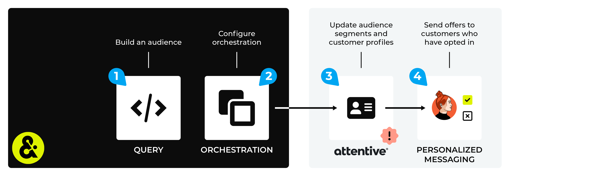

.. https://docs.amperity.com/user/

.. |destination-name| replace:: Attentive
.. |what-send| replace:: email address **OR** phone numbers, but not both, in the same audience
.. |sftp-type| replace:: **attentive-mobile**
.. |sftp-hostname| replace:: **sftp.attentivemobile.com**
.. |file-format| replace:: CSV
.. |encoding-method| replace:: Encoding method options include "Tar", "Tgz", "Zip", "GZip", and "None".
.. |allow-for-what| replace:: audience segments
.. |allow-for-duration| replace:: up to 24 hours

.. meta::
    :description lang=en:
        Use orchestrations to send query results from Amperity to Attentive.

.. meta::
    :content class=swiftype name=body data-type=text:
        Use orchestrations to send query results from Amperity to Attentive.

.. meta::
    :content class=swiftype name=title data-type=string:
        Send query results to Attentive

==================================================
Send query results to Attentive
==================================================

.. channel-attentive-start

You can use queries and orchestrations to manage audiences in |destination-name|. Each audience in |destination-name| has two components: subscribers and segments.

An audience segment is the list of customers to which you will send SMS messages and/or emails. Amperity is your source of truth for your customers who will belong to audience segments in |destination-name|. Send this list to |destination-name| from Amperity.

A subscriber is a customer for which you have an opt-in/out status. You can only send SMS messages and/or emails to customers who have opted-in. |destination-name| is your source of truth for your audience's opt-in/out and subscriber status.

.. channel-attentive-end

.. sendto-attentive-diagram-steps-start

An |destination-name| destination works like this:

#. Use a query to build a list of customers that will be sent SMS messages or emails.
#. Configure Amperity to use an orchestration to send audience segments to |destination-name|.

   .. include:: ../../amperity_operator/source/destination_attentive_mobile_api.rst
      :start-after: .. destination-attentive-mobile-api-attributes-important-start
      :end-before: .. destination-attentive-mobile-api-attributes-important-end

#. Send a test audience from Amperity, and then from within |destination-name| verify that the **Segments** page has the list of customers that you sent from Amperity.

   .. note::

      .. include:: ../../shared/destinations.rst
         :start-after: .. destinations-add-destinations-intro-allow-for-start
         :end-before: .. destinations-add-destinations-intro-allow-for-end

#. Run campaigns directly from |destination-name| by sending personalized text messages to customers who have opted-in to receiving offers, promotions, and communication.

.. sendto-attentive-diagram-steps-end

.. sendto-attentive-mobile-steps-to-send-start

.. include:: ../../shared/destinations.rst
   :start-after: .. destinations-overview-list-intro-start
   :end-before: .. destinations-overview-list-intro-end

#. :ref:`Build a subscriber list <sendto-attentive-mobile-build-subscriber-list>`
#. :ref:`Add orchestration <sendto-attentive-mobile-add-orchestration>`
#. :ref:`Run orchestration <sendto-attentive-mobile-run-orchestration>`

.. sendto-attentive-mobile-steps-to-send-end

.. caution:: This destination is available for sending query results to |destination-name| after it is configured by a Datagrid Operator or your Amperity representative.

   If this destintion cannot be selected from the campaigns editor or activations canvas ask your Datagrid Operator or Amperity representative to configure a destination for sending sending query results to |destination-name|.

.. _sendto-attentive-mobile-build-subscriber-list:

Build subscriber list
==================================================

.. sendto-attentive-mobile-build-subscriber-list-start

Build a query defines a subscriber list in |destination-name|. A subscriber list must be built using phone numbers **or** using email addresses and not both.

.. important:: The name of a subscriber list must be provided in a column named **segment_name**. The **segment_name** column must be added to the results of the query in Amperity. If a subscriber list with this name does not exist in Attentive Mobile, it will be created.

For phone numbers:

.. code-block:: sql
   :linenos:

   SELECT DISTINCT
     phone AS Phone
     ,'subscriber list name' AS segment_name
   FROM Customer360

For email addresses:

.. code-block:: sql
   :linenos:

   SELECT DISTINCT
     email AS Email
     ,'subscriber list name' AS segment_name
   FROM Customer360

.. sendto-attentive-mobile-build-subscriber-list-end

.. _sendto-attentive-mobile-add-orchestration:

Add orchestration
==================================================

.. include:: ../../shared/terms.rst
   :start-after: .. term-orchestration-start
   :end-before: .. term-orchestration-end

.. sendto-attentive-mobile-add-orchestration-important-start

.. important:: Review the `subscriber segment upload <https://docs.attentivemobile.com/pages/developer-guides/sftp-solution/subscriber-segment-upload/#subscriber-segment-upload>`__ |ext_link| topic for specific requirements for how to format the CSV file. Do not include header rows in output. Include an email address **OR** a phone number in the query results, but not both.

.. sendto-attentive-mobile-add-orchestration-important-end

**To add an orchestration**

.. include:: ../../shared/sendtos.rst
   :start-after: .. sendtos-add-orchestration-generic-start
   :end-before: .. sendtos-add-orchestration-generic-end

.. _sendto-attentive-mobile-run-orchestration:

Run orchestration
==================================================

.. include:: ../../shared/sendtos.rst
   :start-after: .. sendtos-run-orchestration-start
   :end-before: .. sendtos-run-orchestration-end

**To run the orchestration**

.. include:: ../../shared/sendtos.rst
   :start-after: .. sendtos-run-orchestration-steps-start
   :end-before: .. sendtos-run-orchestration-steps-end
