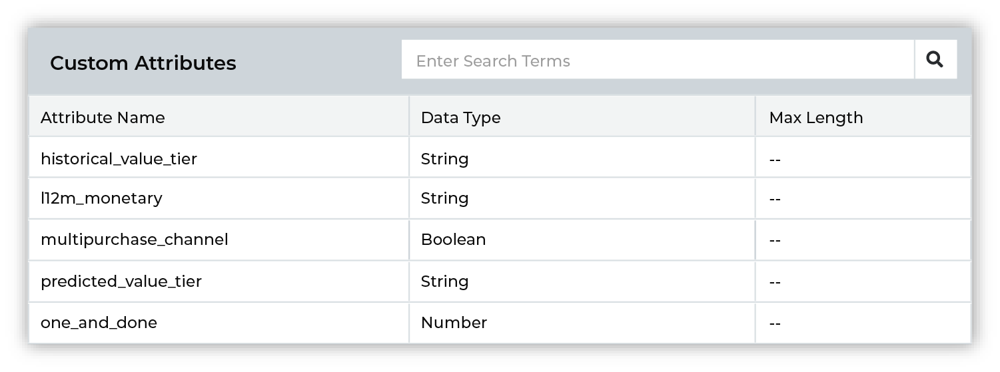
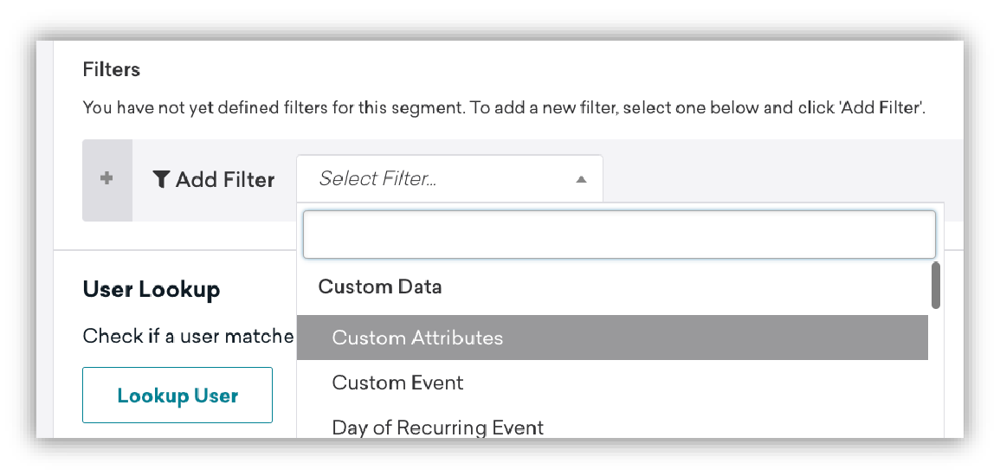
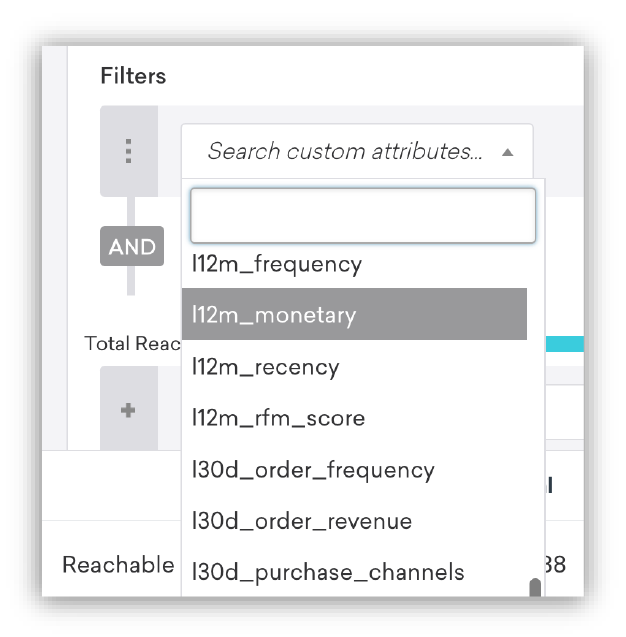

.. https://docs.amperity.com/user/

.. |destination-name| replace:: Braze
.. |plugin-name| replace:: Braze
.. |what-send| replace:: custom attributes
.. |attributes-sent| replace:: |destination-name| requires "extern_id" or "braze_id", along with a list of custom attributes that are defined by your brand.

.. meta::
    :description lang=en:
        Use orchestrations to send query results from Amperity to Braze.

.. meta::
    :content class=swiftype name=body data-type=text:
        Use orchestrations to send query results from Amperity to Braze.

.. meta::
    :content class=swiftype name=title data-type=string:
        Send query results to Braze

==================================================
Send query results to Braze
==================================================

.. destination-braze-context-start

You can send customer profile and custom attributes to |destination-name| using a query and orchestration. Build a SQL query that returns a list of active customers, and then associate that list of active customers with the custom attributes that you want to send to |destination-name| from Amperity. Send the results of a query for active customers as often as you need; send updates for all custom attributes on a less frequent basis.

.. destination-braze-context-end

.. sendto-braze-steps-to-send-start

.. include:: ../../shared/destinations.rst
   :start-after: .. destinations-overview-list-intro-start
   :end-before: .. destinations-overview-list-intro-end

#. :ref:`About custom attributes <sendto-braze-about-braze-attributes>`
#. :ref:`Build a query <sendto-braze-build-query>`
#. :ref:`Add orchestration <sendto-braze-add-orchestration>`
#. :ref:`Run orchestration <sendto-braze-run-orchestration>`

.. sendto-braze-steps-to-send-end

.. caution:: This destination is available for sending query results to |destination-name| after it is configured by a Datagrid Operator or your Amperity representative.

   If this destintion cannot be selected from the campaigns editor or activations canvas ask your Datagrid Operator or Amperity representative to configure a destination for sending sending query results to |destination-name|.

.. _sendto-braze-about-braze-attributes:

About Braze attributes
==================================================

.. destination-braze-ampiq-and-amp360-unshared-intro-start

Attributes in |destination-name| describe your customers.

* :ref:`Profile attributes <destination-braze-profile-attributes>` describe who your customers are. For example: names, birthdates, email addresses, and phone numbers.
* :ref:`Custom attributes <destination-braze-custom-attributes>` describe how your customers have interacted with your brand. For example: purchase histories, loyalty status, and value tiers.

.. destination-braze-ampiq-and-amp360-unshared-intro-start

.. destination-braze-ampiq-and-amp360-shared-intro-start

When `user profile fields <https://www.braze.com/docs/api/objects_filters/user_attributes_object#braze-user-profile-fields>`__ |ext_link| and `custom attributes <https://www.braze.com/docs/user_guide/data_and_analytics/custom_data/custom_attributes/>`__ |ext_link| are available in |destination-name| they can be used to build out audience `segments <https://www.braze.com/docs/user_guide/engagement_tools/segments/creating_a_segment/>`__ |ext_link| and to apply `personalization <https://www.braze.com/docs/user_guide/personalization_and_dynamic_content/liquid>`__ |ext_link| to your campaigns.

.. destination-braze-ampiq-and-amp360-shared-intro-end

.. _destination-braze-profile-attributes:

Customer profiles
--------------------------------------------------

.. destination-braze-profile-attributes-start

Customer profiles in |destination-name| are represented by a set of `user profile fields <https://www.braze.com/docs/api/objects_filters/user_attributes_object#braze-user-profile-fields>`__ |ext_link|. To update these fields in |destination-name| you must follow a strict naming convention when sending data from Amperity. These fields are case sensitive and must be lowercase.

.. destination-braze-profile-attributes-end

.. destination-braze-profile-attributes-admonition-consent-status-start

.. admonition:: What about email and phone subscription status?

   |destination-name| uses two fields to track email and phone subscription status: **email_subscribe** and **push_subscribe**. Braze should be your source of truth for customer consent and for tracking email and phone subscription status.

.. destination-braze-profile-attributes-admonition-consent-status-end

.. destination-braze-profile-attributes-start

An orchestration can send customer profile updates to |destination-name| as the results of a query. For example:

.. code-block:: sql
   :linenos:

   SELECT
     amperity_id AS external_id
     ,given_name AS first_name
     ,surname AS last_name
     ,email
     ,phone
     ,city AS home_city
     ,country
     ,birthdate AS dob
     ,gender
   FROM Customer_360

.. destination-braze-profile-attributes-end

.. destination-braze-profile-attributes-table-start

The following table describes the default `user profile fields <https://www.braze.com/docs/api/objects_filters/user_attributes_object#braze-user-profile-fields>`__ |ext_link| that are most commonly updated from Amperity:

.. list-table::
   :widths: 30 30 40
   :header-rows: 1

   * - Braze default field
     - Amperity field name
     - Description
   * - **external_id**
     - varies
     - Required. The **external_id** is a unique identifer for user profiles in |destination-name|. The **external_id** is a unique identifier that exists in another system, such as the Amperity ID, a loyalty ID, or some other unique customer identifier.

   * - **first_name**
     - **given_name**
     - Optional.

   * - **last_name**
     - **surname**
     - Optional.

   * - **email**
     - **email**
     - Optional.

   * - **phone**
     - **phone**
     - Optional.

   * - **home_city**
     - **city**
     - Optional.

   * - **country**
     - **country**
     - Optional. Must be in |ext_iso_31661alpha2| format.

   * - **dob**
     - **birthdate**
     - Optional. Must be in "YYYY-MM-DD" format.

   * - **gender**
     - **gender**
     - Optional. Accepted values: "M", "F", "O" (other), "N" (not applicable), "P" (prefer not to say), or NULL.

.. destination-braze-profile-attributes-table-end

.. destination-braze-profile-attributes-note-start

.. note:: Default user profile fields also exist for **alias_name**, **alias_label**, **current_location**, **date_of_first_session**, **date_of_last_session**, **email_open_tracking_disabled**, **email_click_tracking_disabled**, **email_subscribe**, **facebook**, **language**, **marked_email_as_spam_at**, **push_subscribe**, **push_tokens**, **subscription_groups**, **time_zone**, and **twitter**.

   These fields are not commonly sent to |destination-name| from Amperity, but if your brand chooses to update these user profile fields from Amperity, be sure to use the exact name of the default field name, send the correct value (or values), and to use lowercase.

.. destination-braze-profile-attributes-note-end

.. _destination-braze-custom-attributes:

Custom attributes
--------------------------------------------------

.. destination-braze-custom-attributes-start

Custom attributes in |destination-name| are represented by a set of custom-named fields. The names of these fields are determined by your brand. They may already exist in |destination-name|, in which case you will want to shape the output that is sent from Amperity to align to the names you already have.

The names of custom attributes that can be managed by Amperity are defined by your brand. The names are strings, may contain hyphens, spaces, or underscores, may include numbers, and may contain a mix of lowercase and uppercase letters. For example, custom attribute can have names that:

* Already exist within your organization.
* Are exactly the same as Amperity standard output, such as "One and Done" or "L12M Monetary" (the "monetary" component of an RFM score), or "Early Repeat Purchaser".
* Align to marketing goals and/or terminology that exists within your brand's segmentation strategy.

Verify the names of custom attributes that will be sent to |destination-name| from Amperity. Amperity will add a custom attribute whenever there isn't a matching name.

.. tip:: Avoid sending custom attributes as duplicates of default user profile fields. For example, birthdates should be sent to |destination-name| as a user profile field named "dob". If they are sent as "birthday", "Birthdate", or any other string, a custom attribute will be created and the values in the "dob" field will not be updated.

.. important:: Your brand's list of custom attributes *should* be a list that is mostly static, remains stable over time, and is focused on your most valuable customers.

   Only update custom attributes for customers to which your brand is currently engaged. Define an audience in Amperity that is some combination of "high value" (historical or predicted), "active" (has purchased recently), and are "contactable" (with an opt-in status of true for phone numbers and/or email addresses).

   This will help ensure that you are only updating custom attributes for your most valuable customers. Custom attributes will be updated only for those customers have a matching "external_id" or "braze_id" within |destination-name|.

.. destination-braze-custom-attributes-end

.. _destination-braze-use-in-segments:

Use in Braze segments
--------------------------------------------------

.. destination-braze-use-in-segmentss-start

The list of custom attributes that is managed by Amperity is available from the **Data Settings** page in |destination-name|. Click **Data Settings** in the left-side navigation, and then choose **Custom Attributes**. This will open a page similar to:

Custom attributes are listed alphabetically and are case-sensitive. For example, **One and Done**, **one and done**, and **One_and_Done** are unique custom attributes within |destination-name|.

Custom attributes are available from a filter when you build segments in |destination-name|. Add a filter, and then choose **Custom Attributes**:

and then select any of your Amperity-managed custom attributes for use in your |destination-name| segment:

.. destination-braze-use-in-segments-end

.. _destination-braze-data-points:

About data points
--------------------------------------------------

.. destination-braze-data-points-start

|destination-name| uses `data points <https://www.braze.com/docs/user_guide/data_and_analytics/data_points/>`__ |ext_link| to determine when to update segment membership, to identify which types of messages should be sent, and how to apply message personalization.

You can send custom attributes to |destination-name| from Amperity by attaching attributes from your customer profiles in Amperity, such as first and last names, email addresses, phone numbers, physical locations, SMS and email consent status, purchase histories, and so on.

Amperity tracks changes as they are sent to Braze and only sends list membership and attribute that have changed since the previous update.

.. note:: Data points are part of the billing and pricing structure in your |destination-name| contract. Some data points are non-billable; many data points are billable.

   Review the `lists of non-billable and billable data points <https://www.braze.com/docs/user_guide/data_and_analytics/data_points/#data-points-1>`__ |ext_link|, and then review those lists against the attributes you will send to Braze from Amperity to understand which of those attributes are considered billable or non-billable data points.

.. destination-braze-data-points-end

.. profile-api-usecase-braze-connected-content-does-not-use-data-points-start

.. important:: Connected Content does not write data to user profiles, which means you can use Connected Content to dynamically populate values into messages without consuming data points.

.. profile-api-usecase-braze-connected-content-does-not-use-data-points-end

.. _sendto-braze-build-query:

Build query
==================================================

.. sendto-braze-build-query-start

Use the query editor to filter by the user identifier associated with your segment in |destination-name| -- "external_id" or "braze_id" -- and then return the list of custom attributes. Use an orchestration to send the results of this query to |destination-name|.

For example, ACME wants to manage custom attributes in |destination-name| by sending customer profile attributes, along with set of purchase history attributes. The following example uses the following standard output tables:

#. **Merged Customers** for customer profile attributes; the table uses the Amperity ID to ensure the |destination-name| table is unique by Amperity ID and also to provide to |destination-name| the Amperity ID as the "extern_id", which is a required attribute

   .. note:: The following query shows a field in **Merged Customers** that returns a customer's opt status. This field might be somewhere else in your tenant. It's important to filter your query to include *only* customers who are opted in to reduce the number of data points that are updated when you send custom attributes to |destination-name|.
#. **Transaction Attributes Extended** for purchase history attributes
#. **Customer Attributes** for historical purchaser lifecycle status

.. code-block:: sql
   :linenos:

   SELECT
     mc.amperity_id AS external_id
     ,mc.given_name AS first_name
     ,mc.surname AS last_name
     ,mc.email
     ,mc.phone
     ,mc.city AS home_city
     ,mc.country
     ,mc.birthdate AS dob
     ,mc.gender
     ,ta.L30D_purchase_channels
     ,ta.L30D_order_revenue
     ,ta.L30D_order_frequency
     ,ta.L3M_purchase_channels
     ,ta.L3M_order_revenue
     ,ta.L3M_order_frequency
     ,ta.L12M_rfm_score
     ,ta.L12M_recency
     ,ta.L12M_frequency
     ,ta.L12M_monetary
     ,ta.lifetime_order_revenue
     ,ta.one_and_done
     ,ta.multi_purchase_channel
     ,ta.first_to_second_order_days
     ,ta.days_since_latest_order
     ,ta.latest_order_datetime
     ,ca.historical_purchaser_lifecycle_status
     ,ta.early_repeat_purchaser
   FROM Merged_Customers mc
   LEFT JOIN Transaction_Attributes_Extended ta ON mc.amperity_id = ta.amperity_id
   LEFT JOIN Customer_Attributes ca ON mc.amperity_id = ca.amperity_id

The **external_id** does not need to be associated with the Amperity ID. For example, if your brand has an internal identifier that you have pulled into Amperity, you can associate that identifier with the **external_id**.

.. note:: You can make the query results available to campaigns if the query results are unique by Amperity ID. This will allow users of campaigns to select |destination-name| attributes when configuring which attributes are sent to |destination-name| for sub-audiences within your campaigns.

.. sendto-braze-build-query-end

.. sendto-braze-build-segments-whatfor-start

.. admonition:: What can you use custom attributes with in Braze?

   You can use custom attributes directly within segments, and then use those segments to engage with your customers across a variety of channels, including:

   * `Content cards <https://www.braze.com/docs/user_guide/message_building_by_channel/content_cards>`__ |ext_link|
   * `Email <https://www.braze.com/docs/user_guide/message_building_by_channel/email>`__ |ext_link|
   * `In-app messaging <https://www.braze.com/docs/user_guide/message_building_by_channel/in-app_messages>`__ |ext_link|
   * `Push <https://www.braze.com/docs/user_guide/message_building_by_channel/push>`__ |ext_link|
   * `SMS and MMS <https://www.braze.com/docs/user_guide/message_building_by_channel/sms>`__ |ext_link|
   * `WhatsApp <https://www.braze.com/docs/user_guide/message_building_by_channel/whatsapp>`__ |ext_link|
   * `Custom webhooks <https://www.braze.com/docs/user_guide/message_building_by_channel/webhooks>`__ |ext_link|

.. sendto-braze-build-segments-whatfor-end

.. _sendto-braze-add-orchestration:

Add orchestration
==================================================

.. include:: ../../shared/terms.rst
   :start-after: .. term-orchestration-start
   :end-before: .. term-orchestration-end

**To add an orchestration**

.. include:: ../../shared/sendtos.rst
   :start-after: .. sendtos-add-orchestration-generic-start
   :end-before: .. sendtos-add-orchestration-generic-end

.. _sendto-braze-run-orchestration:

Run orchestration
==================================================

.. include:: ../../shared/sendtos.rst
   :start-after: .. sendtos-run-orchestration-start
   :end-before: .. sendtos-run-orchestration-end

**To run the orchestration**

.. include:: ../../shared/sendtos.rst
   :start-after: .. sendtos-run-orchestration-steps-start
   :end-before: .. sendtos-run-orchestration-steps-end
