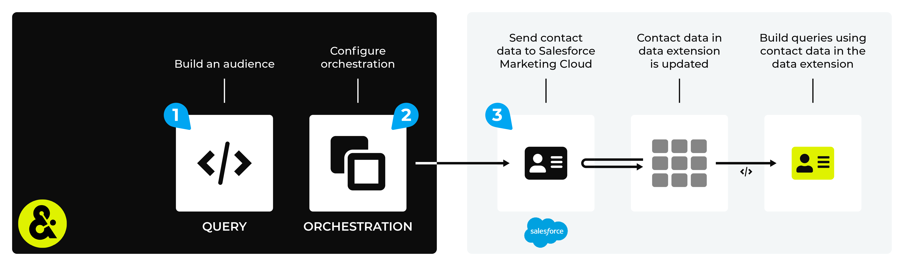

.. https://docs.amperity.com/user/

.. |destination-name| replace:: Salesforce Marketing Cloud
.. |what-send| replace:: contact data
.. |allow-for-what| replace:: audiences
.. |allow-for-duration| replace:: up to 24 hours

.. meta::
    :description lang=en:
        Use orchestrations to send query results from Amperity to Salesforce Marketing Cloud.

.. meta::
    :content class=swiftype name=body data-type=text:
        Use orchestrations to send query results from Amperity to Salesforce Marketing Cloud.

.. meta::
    :content class=swiftype name=title data-type=string:
        Send query results to Salesforce Marketing Cloud

==================================================
Send query results to Salesforce Marketing Cloud
==================================================

.. sendto-salesforce-marketing-cloud-start

You can send query results that send |what-send| to business units in |destination-name|. The |what-send| is uploaded to |destination-name| using SFTP, after which the Marketing Cloud SOAP API manages your data extensions and will move the |what-send| into the correct data extension automatically.

.. sendto-salesforce-marketing-cloud-end

.. sendto-salesforce-marketing-cloud-steps-to-send-start

.. include:: ../../shared/destinations.rst
   :start-after: .. destinations-overview-list-intro-start
   :end-before: .. destinations-overview-list-intro-end

#. :ref:`Build a query <sendto-salesforce-marketing-cloud-build-query>`
#. :ref:`Add orchestration <sendto-salesforce-marketing-cloud-add-orchestration>`
#. :ref:`Run orchestration <sendto-salesforce-marketing-cloud-run-orchestration>`

.. sendto-salesforce-marketing-cloud-steps-to-send-end

.. caution:: This destination is available for sending query results to |destination-name| after it is configured by a Datagrid Operator or your Amperity representative.

   If this destintion cannot be selected from the campaigns editor or activations canvas ask your Datagrid Operator or Amperity representative to configure a destination for sending query results to |destination-name|.

.. _sendto-salesforce-marketing-cloud-build-query:

Build query
==================================================

.. sendto-salesforce-marketing-cloud-build-query-start

You need to build a query that returns the data you want to send to |destination-name|.

.. sendto-salesforce-marketing-cloud-build-query-end

.. sendto-salesforce-marketing-cloud-build-query-use-query-start

For example:

.. code-block:: sql
   :linenos:

   SELECT
     given_name AS FirstName
     ,surname AS LastName
     ,email AS Email
   FROM Merged_Customers

and then assign this query to an orchestration that sends results to |destination-name|.

.. sendto-salesforce-marketing-cloud-build-query-use-query-end

.. _sendto-salesforce-marketing-cloud-add-orchestration:

Add orchestration
==================================================

.. include:: ../../shared/terms.rst
   :start-after: .. term-orchestration-start
   :end-before: .. term-orchestration-end

.. sendto-salesforce-marketing-cloud-add-orchestration-important-start

.. important:: If you are asked to provide the name of a data extension, avoid using *any* of the following characters:

   ::

      ! @ # $ % ^ * ( ) = { } [ ] \ . < > / " : ? | , &

.. sendto-salesforce-marketing-cloud-add-orchestration-important-start

**To add an orchestration**

.. include:: ../../shared/sendtos.rst
   :start-after: .. sendtos-add-orchestration-generic-start
   :end-before: .. sendtos-add-orchestration-generic-end

.. _sendto-salesforce-marketing-cloud-run-orchestration:

Run orchestration
==================================================

.. include:: ../../shared/sendtos.rst
   :start-after: .. sendtos-run-orchestration-start
   :end-before: .. sendtos-run-orchestration-end

**To add an orchestration**

.. include:: ../../shared/sendtos.rst
   :start-after: .. sendtos-add-orchestration-generic-start
   :end-before: .. sendtos-add-orchestration-generic-end
