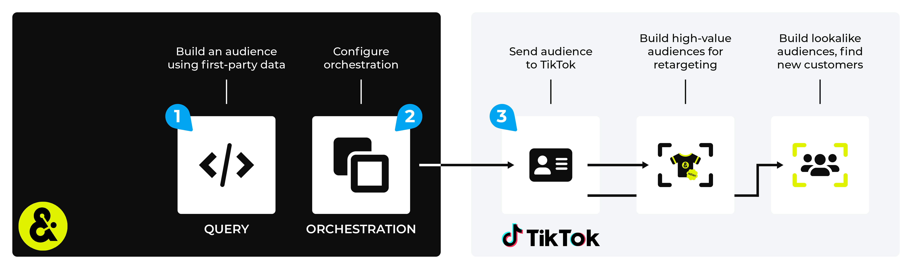

.. https://docs.amperity.com/user/

.. |destination-name| replace:: TikTok Ads
.. |what-send| replace:: email addresses, phone numbers, or advertising IDs (IDFAs for iOS devices or AAIDs for Android devices)
.. |allow-for-what| replace:: audience mapping
.. |allow-for-duration| replace:: up to 10 hours

.. meta::
    :description lang=en:
        Use orchestrations to send query results from Amperity to TikTok Ads Manager.

.. meta::
    :content class=swiftype name=body data-type=text:
        Use orchestrations to send query results from Amperity to TikTok Ads Manager.

.. meta::
    :content class=swiftype name=title data-type=string:
        Send query results to TikTok Ads Manager

==================================================
Send query results to TikTok Ads Manager
==================================================

.. sendto-tiktok-ads-howitworks-start

Use queries to build high-value audiences for retargeting and lookalike modeling, and then use orchestrations to send those audiences to |destination-name| from Amperity. Marketers can use their best customers as a seed set for acquisition, which leads to improved match rates, stronger ROI, reduced onboarding costs, and stronger net new customer conversion.

.. sendto-tiktok-ads-howitworks-end

.. include:: ../../amperity_user/source/campaign_tiktok_ads.rst
   :start-after: .. channel-tiktok-ads-important-learning-phase-start
   :end-before: .. channel-tiktok-ads-important-learning-phase-end

.. include:: ../../amperity_user/source/campaign_tiktok_ads.rst
   :start-after: .. channel-tiktok-ads-important-one-time-delivery-start
   :end-before: .. channel-tiktok-ads-important-one-time-delivery-end

.. include:: ../../amperity_operator/source/destination_tiktok_ads.rst
   :start-after: .. destination-tiktok-ads-api-note-start
   :end-before: .. destination-tiktok-ads-api-note-end

.. include:: ../../shared/destinations.rst
   :start-after: .. destinations-oauth-warning-about-reauthorize-start
   :end-before: .. destinations-oauth-warning-about-reauthorize-end

.. sendto-tiktok-ads-steps-to-send-start

.. include:: ../../shared/destinations.rst
   :start-after: .. destinations-overview-list-intro-start
   :end-before: .. destinations-overview-list-intro-end

#. :ref:`Build a query <sendto-tiktok-ads-build-query>`
#. :ref:`Add orchestration <sendto-tiktok-ads-add-orchestration>`
#. :ref:`Run orchestration <sendto-tiktok-ads-run-orchestration>`

.. caution:: This destination is available for sending query results to |destination-name| after it is configured by a Datagrid Operator or your Amperity representative.

   If this destintion cannot be selected from the campaigns editor or activations canvas ask your Datagrid Operator or Amperity representative to configure a destination for sending sending query results to |destination-name|.

.. _sendto-tiktok-ads-build-query:

Build query
==================================================

.. sendto-tiktok-ads-build-query-start

You need to build a query that outputs email addresses and phone numbers.

.. sendto-tiktok-ads-build-query-end

.. sendto-tiktok-ads-build-query-options-start

.. tip:: Email addresses most often lead to the best match rates!

   You may include, in addition to email addresses and phone numbers, mobile advertiser IDs (MAIDs) if they are available. Associate the MAIDs for Apple devices to **IDFA** and MAIDs for Google Android devices to **AAID**.

.. sendto-tiktok-ads-build-query-options-end

**Example**

.. sendto-tiktok-ads-build-query-example-start

.. code-block:: sql
   :linenos:

   SELECT 
     email AS EMAIL
     ,CONCAT('+',REGEXP_REPLACE(phone, '(\s*)([^a-zA-Z0-9])', '')) AS PHONE
   FROM Customer360
   WHERE email IS NOT NULL
   OR phone IS NOT NULL

.. sendto-tiktok-ads-build-query-example-end

.. _sendto-tiktok-ads-build-query-offline-events:

Send offline events
--------------------------------------------------

.. include:: ../../amperity_user/source/events_tiktok_ads_manager.rst
   :start-after: .. events-tiktok-ads-offline-events-start
   :end-before: .. events-tiktok-ads-offline-events-end

.. include:: ../../amperity_user/source/events_tiktok_ads_manager.rst
   :start-after: .. events-tiktok-ads-offline-events-allowfor-start
   :end-before: .. events-tiktok-ads-offline-events-allowfor-end

.. include:: ../../amperity_user/source/events_tiktok_ads_manager.rst
   :start-after: .. events-tiktok-ads-offline-events-build-query-start
   :end-before: .. events-tiktok-ads-offline-events-build-query-end

.. _sendto-tiktok-ads-add-orchestration:

Add orchestration
==================================================

.. include:: ../../shared/terms.rst
   :start-after: .. term-orchestration-start
   :end-before: .. term-orchestration-end

**To add an orchestration**

.. include:: ../../shared/sendtos.rst
   :start-after: .. sendtos-add-orchestration-generic-start
   :end-before: .. sendtos-add-orchestration-generic-end

.. _sendto-tiktok-ads-run-orchestration:

Run orchestration
==================================================

.. include:: ../../shared/sendtos.rst
   :start-after: .. sendtos-run-orchestration-start
   :end-before: .. sendtos-run-orchestration-end

**To run the orchestration**

.. include:: ../../shared/sendtos.rst
   :start-after: .. sendtos-run-orchestration-steps-start
   :end-before: .. sendtos-run-orchestration-steps-end

.. _destination-tiktok-ads-parameters:

Offline events parameters
==================================================

.. include:: ../../amperity_operator/source/events_tiktok_ads.rst
   :start-after: .. events-tiktok-ads-offline-events-parameters-start
   :end-before: .. events-tiktok-ads-offline-events-parameters-end
