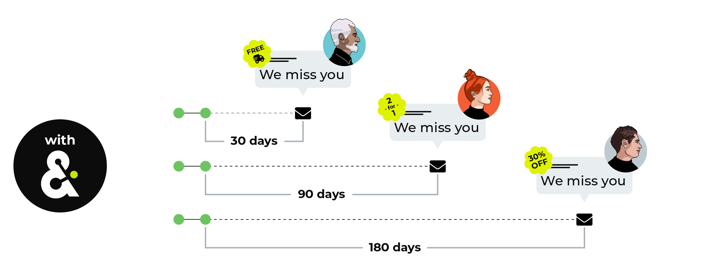
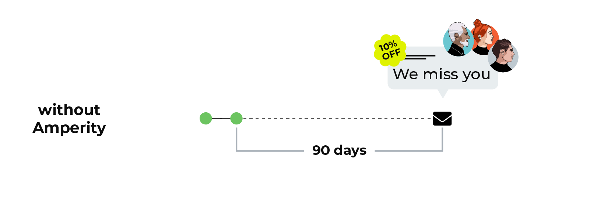

.. https://docs.amperity.com/user/

.. meta::
    :description lang=en:
        What is the total value of all orders a customer is predicted to make if they return to make another purchase during the next 365 days?

.. meta::
    :content class=swiftype name=body data-type=text:
        What is the total value of all orders a customer is predicted to make if they return to make another purchase during the next 365 days?

.. meta::
    :content class=swiftype name=title data-type=string:
        Predicted CLV

==================================================
Predicted CLV
==================================================

.. include:: ../../shared/terms.rst
   :start-after: .. term-pclv-start
   :end-before: .. term-pclv-end

.. include:: ../../amperity_reference/source/model_predicted_clv.rst
   :start-after: .. model-predicted-clv-about-start
   :end-before: .. model-predicted-clv-about-end

.. customer-lifetime-value-about-start

.. admonition:: Why not use customer lifetime value (CLV)?

   .. include:: ../../shared/terms.rst
      :start-after: .. term-clv-start
      :end-before: .. term-clv-end

   CLV is an important historical measurement that applies to individual customers and also to groups of customers that fit various segment profiles. For example, a customer who buys a pair of $40 pants every year for five years has a CLV of $200. A segment that contains thousands of customers who buy pants might have a CLV of $200,000.

   CLV can be more complex to measure when a company has millions of customers, multiple brands, storefronts and websites and applications, and hundreds or even thousands of individual product items.

   How do your brand measure how valuable customers is in the future? With Amperity your brand can use predictive modeling to identify which customers are more likely or less likely to purchase within the next calendar year.

.. customer-lifetime-value-about-end

About predicted CLV (pCLV)
==================================================

.. include:: ../../shared/terms.rst
   :start-after: .. term-pclv-start
   :end-before: .. term-pclv-end

.. include:: ../../shared/terms.rst
   :start-after: .. term-value-tiers-start
   :end-before: .. term-value-tiers-end

.. customer-lifetime-value-pclv-with-start

Build segments that capture your most valuable customers, and then build segments that align active customers within those tiers to the right product recommendations and offers.

.. customer-lifetime-value-pclv-with-end

.. customer-lifetime-value-pclv-without-start

Without access to predictive modeling brands are forced to estimate future purchases by using purchases from the previous year. This approach is generally challenging due the presence of one-time buyers, shifting dynamics among customer behavior, changes in inventory and offerings, and competition with other brands.

.. customer-lifetime-value-pclv-without-end

.. customer-lifetime-value-pclv-start

Use predicted CLV to identify your top customers by predicted spend, and then avoid having to use only historical purchases when deciding how and when to market to your most valuable customers.

* Which customers are the most valuable and how can we attract more of them to our brand?
* Is there anything unique about high value customers?
* Are dedicated customers for one product more valuable than dedicated customers for another?
* What can we learn to better inform acquisition efforts and product merchandising?
* Does a promotion attract high or low value customers?
* Should a promotion be relaunched next month, next quarter, next year?
* Which customers are best engaged through a VIP program?

.. customer-lifetime-value-pclv-end

.. _customer-lifetime-value-models-for-pclv:

Models for pCLV
==================================================

.. customer-lifetime-value-models-for-pclv-start

Predictive modeling for customer lifetime value is comprised of several component predictions:

**Predicted probability of transaction**
   .. include:: ../../shared/terms.rst
      :start-after: .. term-predicted-probability-of-transaction-start
      :end-before: .. term-predicted-probability-of-transaction-end
   
   For example, a score of 0.6 indicates a 60% chance that a customer will return and make purchase.

   .. note:: Predicted probability of transaction is also known as p(return).

**Predicted average order revenue**
   .. include:: ../../shared/terms.rst
      :start-after: .. term-predicted-average-order-revenue-start
      :end-before: .. term-predicted-average-order-revenue-end

**Predicted order frequency**
   .. include:: ../../shared/terms.rst
      :start-after: .. term-predicted-order-frequency-start
      :end-before: .. term-predicted-order-frequency-end

.. customer-lifetime-value-models-for-pclv-end

.. _customer-lifetime-value-pclv-start-building:

Start using predicted CLV
==================================================

.. customer-lifetime-value-pclv-start-building-start

Start with a combination of transaction attributes, apply predicted CLV, and then group them by customer lifecycle status, typically using *active* or *cooling down*, but sometimes using *at risk*. The following segments represent different types of customers who are likely to respond to a message in different ways:

#. A segment for customers who have purchased more than once and for whom order revenue in the previous year is greater than $500 and with an *active* lifecycle status.
#. A segment for customers who have purchased just once in the previous year with an order value less than $200 and an *at risk* lifecycle status.

Talk with your Amperity representative about the best attributes to use within your tenant to enable effective campaigns that use predicted CLV.

.. customer-lifetime-value-pclv-start-building-end

.. _models-predicted-clv-use-cases:

Use cases
==================================================

.. models-predicted-clv-use-cases-start

The predicted CLV model helps you identify your highest value customers by year or by value tier:

#. :ref:`How much will customers spend in the next year? <models-predicted-clv-use-cases-spend>`
#. :ref:`Which customers are your most valuable customers? <models-predicted-clv-use-cases-most-valuable>`

.. models-predicted-clv-use-cases-end

.. _models-predicted-clv-use-cases-spend:

How much will customers spend?
--------------------------------------------------

.. include:: ../../amperity_reference/source/model_predicted_clv.rst
   :start-after: .. model-predicted-clv-use-cases-spend-start
   :end-before: .. model-predicted-clv-use-cases-spend-end

.. _models-predicted-clv-use-cases-most-valuable:

Which customers are the most valuable?
--------------------------------------------------

.. include:: ../../amperity_user/source/usecase_predicted_top_10_percent.rst
   :start-after: .. usecase-predicted-top-10-percent-start
   :end-before: .. usecase-predicted-top-10-percent-end

.. include:: ../../amperity_user/source/usecase_predicted_top_10_percent.rst
   :start-after: .. usecase-predicted-top-10-percent-howitworks-start
   :end-before: .. usecase-predicted-top-10-percent-howitworks-end

**WHICH CUSTOMERS ARE PREDICTED TO BE YOUR TOP 10%?**

.. include:: ../../amperity_user/source/usecase_predicted_top_10_percent.rst
   :start-after: .. usecase-predicted-top-10-percent-howitworks-callouts-start
   :end-before: .. usecase-predicted-top-10-percent-howitworks-callouts-end
