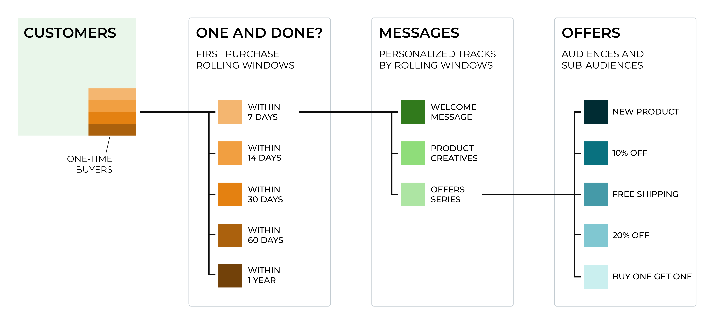
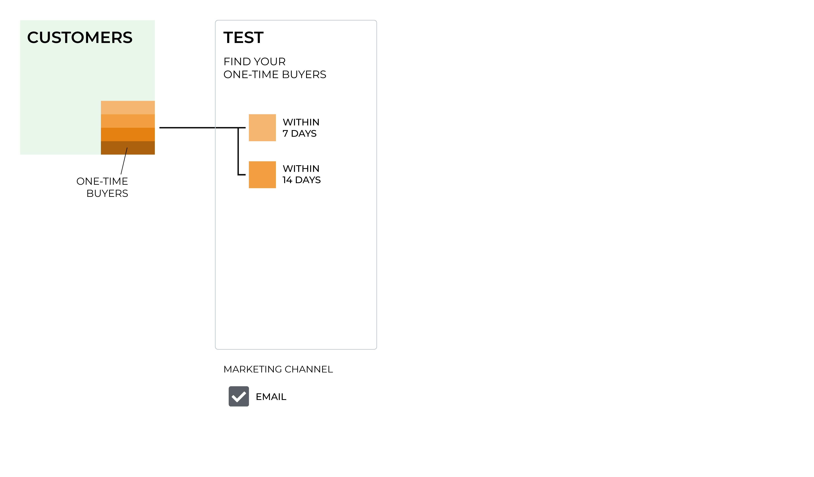
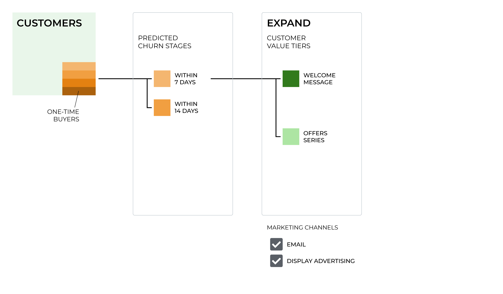
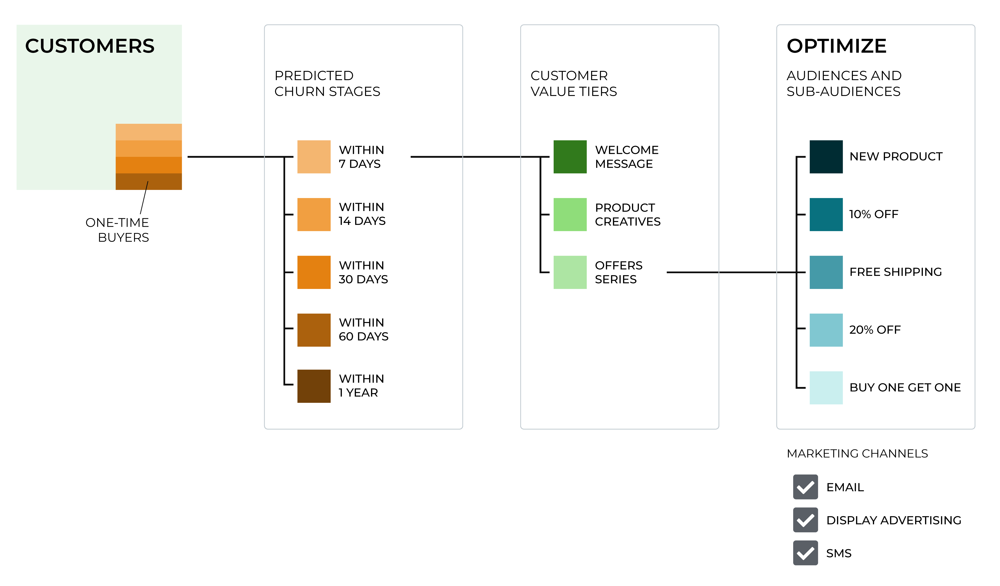

.. https://docs.amperity.com/user/

.. meta::
    :description lang=en:
        How to build campaigns that convert one-time buyers into long-term, repeat customers.

.. meta::
    :content class=swiftype name=body data-type=text:
        How to build campaigns that convert one-time buyers into long-term, repeat customers.

.. meta::
    :content class=swiftype name=title data-type=string:
        One-time buyer campaigns

==================================================
One-time buyer campaigns
==================================================

.. onetime-buyers-about-start

Customer retention is critical for the long-term growth of your brand. It is not enough to acquire a customer who makes a single purchase. It is essential to find ways to convince your one-time buyers to become long-term, repeat customers.

.. onetime-buyers-about-end

.. onetime-buyers-about-context-start

Every brand is different, but the stories are all the same:

#. Acquiring new customers is more expensive than keeping existing ones
#. Increasing customer retention increases profits
#. Returning customers represent most of your brand's future revenue

Every one-time buyer represents a unique opportunity to your brand. They have made their first purchase and have given your brand an opportunity to convince them to make a second purchase and become a repeat customer.

This can be a big challenge.

.. onetime-buyers-about-context-start

.. onetime-buyers-custora-start

.. admonition:: One and (not) Done: A short book about one-time buyer campaigns

   .. list-table::
      :widths: 150 450
      :header-rows: 0

      * - .. image:: ../../images/custora-one-and-not-done.svg
             :width: 140 px
             :alt: One and (not) Done
             :align: left
             :class: no-scaled-link
        - One-time buyers are a challenge every marketer faces. This book offers strategic and tactical advice for how to address this challenge head-on.

          `Open the PDF to read the whole book <https://docs.amperity.com/downloads/pdf/One%20and%20(not)%20done.pdf>`__ |ext_link|

.. onetime-buyers-custora-end

.. _onetime-buyers-whatis:

What is a one-time buyer campaign?
==================================================

.. onetime-buyers-whatis-start

A one-time buyer campaign, also known as a "win-back campaign", is a campaign that seeks to turn single-purchase customers into repeat customers.

A one-time buyer campaign must first identify your customers who have purchased only one time, and then from that list of customers devise a strategy based on a combination of products, time windows, lookalike audiences, and marketing goals that will attempt to reach specific groups of one-time buyers with the right offers that encourage them to become repeat customers.

.. tip:: One behavior to look for is customers that, for customers who *do* make their second purchase, measure the amount of time that occurred between their first and second orders *along with* the type of offer to which each customer responded.

.. onetime-buyers-whatis-end

.. _onetime-buyers-howto:

How to build a one-time buyer campaign
==================================================

.. onetime-buyers-howto-start

Brands love their customers, but it doesn't always go both ways. Many customers engage once, but never come back. Some customers only buy on discount and some are seasonal shoppers. Others will stick with you for a while, and will then switch brands.

It can be hard to make a connection and the window of opportunity is often short. It gets harder if you don't know who your customers are and what motivates them.

The most important step to identify your one-time buyers is to consolidate all of your customer and transaction data into one location, including across marketing channels, purchase locations, including points of sale, online, *and* in-store, and all of your brands.

.. important:: One-time buyers can be harder to spot when looking at single-channel purchase patterns. For example: someone might look like a one-time buyer in a store, but have purchased online multiple times.

Adding data from your email service provider, such as clicks, opens, and sends, helps ensure that you know how to contact your customers during your one-time buyer campaign.

.. tip:: Plan to use personalization as part of your one-time buyer campaign. Use personalization to tailor your welcome series to your customers instead of applying a one-size-fits-all approach. Plan to use different tracks based on known buyer types, relevant products, and timely offers that have historically led to early engagement and to repeat customers.

The good news is that you're using Amperity, so you should already have this data consolidated into your customer 360. You are ready to find out who your one-time buyers are, and then determine which strategies to use to try to convince them into becoming long-term, repeat customers.

.. onetime-buyers-howto-end

.. _onetime-buyers-howto-define:

Define an audience
--------------------------------------------------

.. onetime-buyers-howto-define-start

The audience for your one-time buyer campaign should be focused only on buyers who made their first purchase within the previous 90 days. Initially, your one-time buyer campaign starts out by sending welcome, brand education, and onboarding messaging with a planned window in which you use specific messaging to attempt to win that second purchase.

Start your one-time buyer campaign with a simple welcome series, from which you will tailor your messaging to try to win repeat purchases from your one-time buyers.

Use a "one and done" attribute to quickly identify your one-time buyers across all channels, including points of sale, online, and in-store, and across all brands. You may choose to keep your one-time buyer audience as a single group or you may choose to break it down by brand, by channel, or any other combination that makes sense for your marketing goals.

You should expect to see around 75% of your customers be one-time buyers. Compare the one-time buyer profiles to your existing customer profiles, such as:

* High-value customers
* Loyalty programs
* Historical one-time buyer campaigns
* Lookalike audiences
* Discount-sensitive customers
* Cross-channel purchase patterns
* Seasonal shoppers. One-time seasonal customers return at a lower rate than customers acquired outside of seasonal shopping windows.

Spend time evaluating these profiles and comparing them to your one-time buyer profiles to understand what types of purchases they made, their average order size, and the locations from which they purchased, and what patterns might exist during a successful journey from one-time to repeat customer.

Different audiences have unique characteristics and profiless, but offer opportunities to infer audience behavior using lookalike audiences and by analyzing historical one-time buyer campaigns. These comparisons will help you gain insights into the types of strategies you can use with your one-time buyer campaign. One measure of success is to track your percentage of one-time buyers over time.

.. onetime-buyers-howto-define-end

.. _onetime-buyers-howto-test:

Test the campaign
--------------------------------------------------

.. onetime-buyers-howto-test-start

Start your one-time buyer campaign by blending your welcome series with follow-up messages at 7 days and 14 days. These messages do not require a hard sell; you are working to build a long-term relationship and that requires a soft touch, the right message, and the right offer.

An effective campaign that seeks to turn one-time buyers into repeat customers must have a way to measure the success of that campaign. As the initial measure of the success rate for your one-time buyer campaign, you must have a way to discover early repeat purchasers.

.. include:: ../../shared/terms.rst
   :start-after: .. term-early-repeat-purchasers-start
   :end-before: .. term-early-repeat-purchasers-end

Build a segment that compares your one-time buyers to early repeat purchasers. Move the customers who have become repeat purchasers out of your one-time buyer campaign and into other campaigns.

Additional metrics that can be used to help measure the success of your one-time buyer campaigns include:

* Churn rate
* Customers that purchase again within 1 year

.. onetime-buyers-howto-test-end

.. _onetime-buyers-howto-expand:

Expand the campaign
--------------------------------------------------

.. onetime-buyers-howto-expand-start

Expand your one-time buyer campaign to include longer timelines, this time up to 90 days, by adding messaging for the 30-, 60-, and 90-day intervals.

Your one-time buyer campaign can become more sophisticated. With longer timelines you can tailor messaging more specifically to each point in that timeline. Use your welcome campaign to message customers who purchased within the last 7 days. Use a more sophisticated offers campaign to message customers who purchased within the last 14 days.

Use the knowledge you have gained from previous one-time buyer campaigns to help build your audiences for your current one-time campaign. Understand the behaviors and attributes of customers who made a second purchase, and then compare them to customers who shopped one time and have fallen out of your one-time buyer campaign.

* Look for patterns that lead to repeat customers.
* Look for consistencies within the customers who never purchased again.
* Compare customers that never purchased again to find out if they fall into an even longer timeline, such as 1 year, 2 years, or 3 years. There is a small percentage of "one-time buyers" who will become repeat customers on longer timelines.

.. onetime-buyers-howto-expand-end

.. _onetime-buyers-howto-optimize:

Optimize the campaign
--------------------------------------------------

.. onetime-buyers-howto-optimize-start

By the time you have finished building out a complete one-time buyer campaign you should have individual segments that separate one-time buyers into the following daily intervals: 7, 14, 30, 60, and 90 days. Some one-time buyer campaigns extend these intervals beyond 90 days, such as to 120, 180, 240, and so on.

Your welcome series has scaled into a multichannel approach, including digital advertising and direct mail when they can help drive incremental revenue. Dig deeper into the underlying trends that drive one-time buyer behavior, such as poor product quality, limited availability, or suboptimal customer experiences. 

Each of these audiences should be associated with relevant messaging and the right offer for that stage in the one-time buyer lifecycle.

Continue measuring for the presence of early repeat purchasers and start to measure revenue lift. Compare revenue lift to the rate of early repeat purchasers to identify which campaigns are performing well.

.. onetime-buyers-howto-optimize-end

.. _onetime-buyers-start-building:

Start building your campaign
==================================================

.. onetime-buyers-start-building-start

Amperity provides a series of attributes that help you identify one-time buyers, and then identify which of those one-time buyers are more likely to purchase again.

A one-time buyer campaign starts with identifying "one-and-done" customers, and then associates those customers with their predicted lifecycle status.

Talk with your Amperity representative about the best attributes to use within your tenant to enable an effective one-time buyer campaign.

.. onetime-buyers-start-building-end