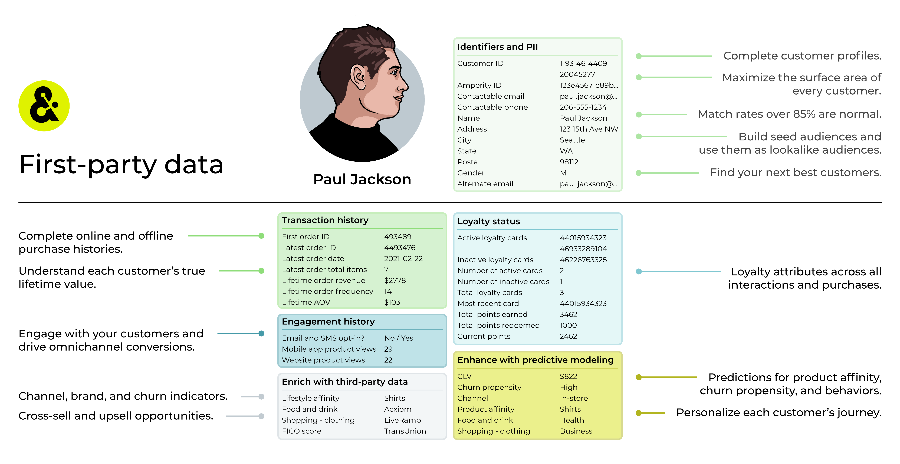
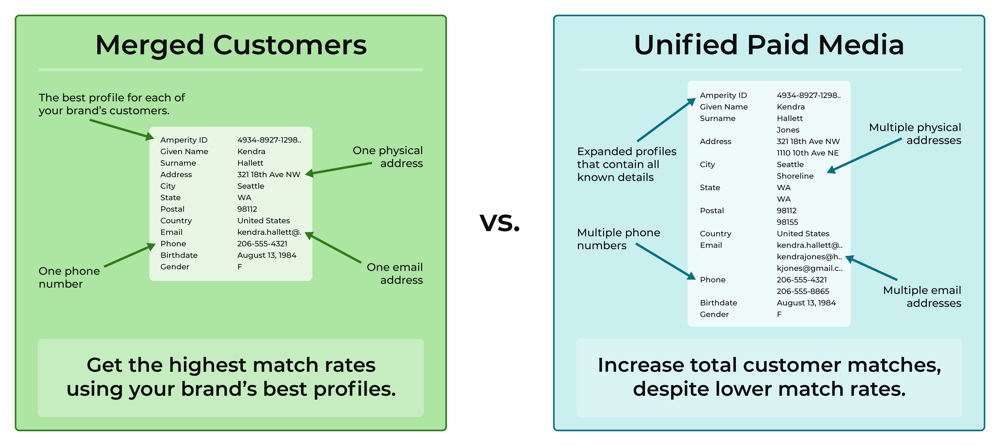

.. https://docs.amperity.com/user/

:orphan:

.. meta::
    :description lang=en:
        How to use Amperity to activate audiences across the paid media ecosystem.

.. meta::
    :content class=swiftype name=body data-type=text:
        How to use Amperity to activate audiences across the paid media ecosystem.

.. meta::
    :content class=swiftype name=title data-type=string:
        Paid media

==================================================
Paid media
==================================================

.. paid-media-overview-start

Most brands spend years acquiring and building solid relationships with their most loyal customers and this effort generates unique and valuable insights into their patterns and preferences.

Building these relationships over time can be expensive. With the recent trend toward privacy-centric marketing strategies, these relationships are essential for using paid media advertising to find new customers using :ref:`ad platforms, such as Facebook, Google, The Trade Desk, TikTok, or Criteo <paid-media-destinations>`.

Paid media can be an expensive and complicated process for brands and often represents a significant percentage of a brand's total activation budget.

With the rise of privacy-centric marketing strategies resulting in the demise of third-party data and cookies, combined with the rise of customer data privacy regulations, advertisers must pivot their marketing strategies toward using their first-party data as the critical seed component of their customer activation strategy across paid media.

.. paid-media-overview-end

.. paid-media-overview-context-start

Capturing reliable data from across disparate silos in your organization to build unified customer profiles is essential to the future of your brand's acquisition strategy in paid media.

Audiences built from unified customer profiles lead to higher returns on ad spend (ROAS) when activating these audiences across paid media. Use these audiences to grow your brand, find new customers, and build better relationships with your most important customers.

.. paid-media-overview-context-end

.. _paid-media-what-is-first-party-data:

What is first-party data?
==================================================

.. paid-media-what-is-first-party-data-start

First-party data is provided to a company or a brand from the customer, often directly, and captures how your customers interact with your brand.

There are many sources of first-party data, including:

* Browsing activity on your brand's website
* Browsing activity within a mobile app
* Purchasing an item in-store or from your website using a credit card
* Requesting an emailed receipt
* Signing up for a benefit or rebate
* Completing an online form
* Filling out a registration card
* Responding to email and SMS messaging
* Online (website) and offline (in-store) data
* Loyalty programs

An important concept around first-party data is that it not only needs to be accurate it also needs to be comprehensive. Customers are not static and neither is their relationship to your brands.

Because customers are not static you need a platform that recomputes their identity and behaviors regularly. Having a comprehensive and historical view of your customer's behaviors across online and offline channels is the best way to get the data that enables the outcomes your brand requires from paid media.

.. paid-media-what-is-first-party-data-end

.. _paid-media-activation-scenarios:

Activation scenarios
==================================================

.. paid-media-activation-scenarios-start

The following sections describe some of the most common reasons why brands choose to activate audiences using paid media, along with some examples of the types of audiences you could use for activation. This is not an exhaustive list.

.. paid-media-activation-scenarios-end

.. _paid-media-activation-scenario-audience-expansion:

Audience expansion
--------------------------------------------------

.. paid-media-activation-scenario-audience-expansion-start

Finding new customers is critical to the successful growth of your brand.

Use Amperity to build high quality seed audiences that contain your most valuable customers. Filter that audience using attributes and PII in your customer 360 -- demographics, interests, product preferences, product affinities, purchase histories -- to define a seed audience that your brand can use with lookalike campaigns.

Use seed audiences to grow your customer base and find new customers who are similar to the high-value customers your brand already has.

For example, build seed audiences for:

* Customers who are predicted to have an affinity for a specific product
* Customers who belong to your loyalty program and live in specific regions
* Customers who are predicted to be high-value customers during the next 6-12 months
* Customers with a history of purchasing specific products, sorted by region, age group, or gender

.. paid-media-activation-scenario-audience-expansion-end

.. _paid-media-activation-scenario-lifecycle-marketing:

Lifecycle marketing
--------------------------------------------------

.. paid-media-activation-scenario-lifecycle-marketing-start

Amplify lifecycle marketing campaigns -- churn prevention, VIP cultivation, one-time buyers -- with more detailed audiences. For example, build audiences for:

* Highest value VIPs
* Customers who are *almost* VIPs
* Customers who have opted out and were, at one point high-value customers, but have churned
* Customers who are at every stage -- active, at risk, churned, etc. -- to build out complex churn prevention and one-time buyer campaigns

.. note:: Lifecycle marketing campaigns are often highly complex with many stages and subtle differences that define how your brand wants to interact with customers who are at specific stages within the campaign.

.. paid-media-activation-scenario-lifecycle-marketing-end

.. _paid-media-activation-scenario-product-marketing:

Product marketing
--------------------------------------------------

.. paid-media-activation-scenario-product-marketing-start

Product marketing campaigns support product launches, new arrivals, markdowns, price announcements, and promotions. For example, build audiences for:

* Preferred price points
* Discount sensitivity
* Transaction-based customers, such as "New arrivals" or "Repeat holiday shoppers"
* Product affinities
* Specific attributes, such as "New customers acquired during holiday"

.. paid-media-activation-scenario-product-marketing-end

.. _paid-media-activation-scenario-optimize-search-bids:

Optimize bidding
--------------------------------------------------

.. paid-media-activation-scenario-optimize-search-bids-start

Optimize bidding for ads placement by using your most valuable audiences and strongest product affinities. For example, build audiences for:

* Highest value VIPs
* Customers who are *almost* VIPs
* Product affinity-based audiences

and then use these audiences with acquisition or remarketing campaigns.

.. paid-media-activation-scenario-optimize-search-bids-end

.. _paid-media-activation-scenario-optimize-budgets:

Optimize budgets with CLV
--------------------------------------------------

.. paid-media-activation-scenario-optimize-budgets-start

Optimize budgets using customer lifetime value, both historical and predicted, to evaluate acquisition channels and as part of retargeting campaigns.

Align your budget with campaigns that lead to higher customer lifetime values as a result of acquisition or conversion. For example, build audiences for:

* Reaching new customers by suppressing past purchasers from your campaigns

.. note:: Use historical lifetime value along with more specific customer profile attributes to optimize budgets when predicted attributes are unavailable.

.. paid-media-activation-scenario-optimize-budgets-end

.. _paid-media-activation-scenario-prospect-conversion:

Prospect conversion
--------------------------------------------------

.. paid-media-activation-scenario-prospect-conversion-start

Target prospects for whom you have contact information to encourage them to make their first purchase.

.. paid-media-activation-scenario-prospect-conversion-end

.. _paid-media-activation-scenario-suppression-lists:

Suppression lists
--------------------------------------------------

.. paid-media-activation-scenario-suppression-lists-start

Suppression lists help you optimize your budget *and* optimize the frequency at which you advertise to your customers. For example, build audiences for:

* Limiting the number of messages that are set by only sending messages to customers with a high product affinity
* Limiting the number of email and SMS messages sent to opted-in customers
* Preventing customers who have opted out of email and SMS messages from being part of a campaign

.. paid-media-activation-scenario-suppression-lists-end

.. _paid-media-about-match-rates:

Match rates
==================================================

.. include:: ../../shared/terms.rst
   :start-after: .. term-match-rate-start
   :end-before: .. term-match-rate-end

.. paid-media-about-match-rates-start

Amperity builds the best profiles for getting the best match rates across the paid media ecosystem. These profiles are available from the **Merged Customers** and **Unified Paid Media** tables.

The **Merged Customers** table contains your brand's best customer profiles, including each customer's best email address, best phone number, best physical address, or best name. When your brand uses this table to send audiences to downstream marketing applications, one record is sent for each customer.

The **Unified Paid Media** table contains all known profile data for each of your brand's customers. For example, some customers have a primary email address they use for personal communication, but then use a variation or different email address to sign up on social media. This variation may not be that customer's "best" email address for your brand's marketing campaigns, but it might be right email address for matching with that customer on Facebook or TikTok or Pinterest.

.. admonition:: Match rates vs. matched customers

   A customer profile in the **Merged Customers** table is associated with a customer's best email address. But often customers have alternate email addresses for a variety of reasons. These alternate email addresses are available from the **Unified Paid Media** table.

   If your brand sends a greater number of known email addresses your brand can increase the likelihood of matching more customers even if the overall match rate decreases.

   For example, let's say that 100 customers have 100 email addresses sent from **Merged Customers**. These match at an 80% match rate.

   If you sent, in addition to those 100 email addresses, 40 additional known email addresses from the **Unified Paid Media** table, those 40 additional email addresses also have an opportunity to match with a customer.

   For this example, 10 additional customer matches were found.

   The overall match rate will drop from 80% to 64%. However, the total number of matched customers increases from 80 to 90.

.. paid-media-about-match-rates-end

.. _paid-media-what-table:

What type of profile to send?
==================================================

.. include:: ../../shared/paid-media.rst
   :start-after: .. paid-media-ampiq-about-start
   :end-before: .. paid-media-ampiq-about-end

.. _paid-media-destinations:

Activate audiences
==================================================

.. paid-media-activate-customers-start

There are many ways to activate audiences across the paid media landscape. The first step is the most important: build audiences against complete customer profiles built from first-party data.

This approach leads to:

* Better match rates across paid media
* Better omnichannel marketing and advertising results (revenue and ROAS)
* Fewer dependencies on decaying cookie onboarding tools
* No dependencies on third-party cookies, mobile advertiser IDs (MAIDs), or other deprecating digital signals

.. paid-media-activate-customers-end

.. paid-media-destinations-start

Amperity provides direct connections to the most popular destinations across the paid media ecosystem.

.. paid-media-destinations-end

.. include:: ../../amperity_user/source/grid_paid_media.rst
   :start-after: .. grid-paid-media-activate-audiences-grid-start
   :end-before: .. grid-paid-media-activate-audiences-grid-end

.. _paid-media-measure:

Measure campaigns
==================================================

.. paid-media-measure-start

Measuring the success of your paid media campaigns can be a challenge. Many of the channels are protective of the data around the performance of your campaigns and, at best, provide limited access to reporting data.

You can measure campaign efficacy using a combination of data within Amperity and data from outside parties.

The following sections describe what your brand can use to help understand how well your campaigns are performing across paid media.

.. paid-media-measure-end

.. _paid-media-measure-performance-indicators:

Performance indicators
--------------------------------------------------

.. paid-media-measure-performance-indicators-start

There are three broad groups of performance indicators that you can use to measure the success of your paid media campaigns:

* Amperity-focused
* Paid channel-focused
* Owned channel-focused

.. paid-media-measure-performance-indicators-end

.. _paid-media-measure-performance-indicators-amperity:

Amperity indicators
++++++++++++++++++++++++++++++++++++++++++++++++++

.. paid-media-measure-performance-indicators-amperity-start

Amperity indicators combine data for online and offline transactions across a defined measurement window.

* Revenue
* Revenue by recipient
* Conversion rates
* Average order value (AOV)
* Orders by purchaser
* Incremental revenue
* Incremental conversion rates

Much of this data is generated as standard output in Amperity and is available from the **Transaction Attributes Extended**, **Unified Transactions**, and **Unified Itemized Transactions** tables. Some of this data may require building queries for additional analysis.

.. paid-media-measure-performance-indicators-amperity-end

.. _paid-media-measure-performance-indicators-paid:

Paid media indicators
++++++++++++++++++++++++++++++++++++++++++++++++++

.. paid-media-measure-performance-indicators-paid-start

Paid media indicators can help measure audience quality and attribution. These indicators are a combination of the costs associated with your paid media campaigns and how your customers interacted with your campaign messages.

Did your customers click on a link and make a purchase after clicking on that link? You can measure attribution using metrics like:

* Cost per acquisition (CPA)
* Cost acquisition cost (CAC)
* Cost per click (CPC)
* Cost per thousand (CPM)
* Click-through rate
* Conversion rate
* Revenue
* Return on ad spend (ROAS)

Audience quality is a combination of match rate and scalability.

.. paid-media-measure-performance-indicators-paid-end

.. _paid-media-measure-performance-indicators-owned:

Owned media indicators
++++++++++++++++++++++++++++++++++++++++++++++++++

.. paid-media-measure-performance-indicators-owned-start

Owned media indicators can help measure how often customers are interacting with your campaigns. Engagement metrics include clickstream for mobile and website, email, and SMS. Direct attribution exists when your customers opened an email or SMS message, visited your website, app, or store, and then made a purchase.

These indicators are already available to you within Amperity if you have made available to Amperity data sources that contain purchase histories, such as orders and items, and customer engagement, such as clickstream data for websites and apps or email and SMS engagement.

Did your customers open the email or text message? Did they visit your website after opening that message? Engagement metrics for owned media include:

* Open rates
* Click rates
* Click-to-open rates
* Unsubscribe rates

Did your customers purchase from your brand? Direct attribution metrics for owned media include:

* Conversion rate
* Revenue

.. paid-media-measure-performance-indicators-owned-end

.. _paid-media-measure-performance-indicators-example:

Example: Measuring campaigns
--------------------------------------------------

.. paid-media-measure-performance-indicators-example-start

How can you measure the success of a paid media campaign over a defined time window?

.. list-table::
   :widths: 10 90
   :header-rows: 0

   * - .. image:: ../../images/steps-00.png
          :width: 60 px
          :alt: Prerequisites.
          :align: center
          :class: no-scaled-link

     - Determine your goals up-front. For example:

       #. **Measurement window** 3 months
       #. **Performance indicators** What are the key performance indicators for the measurement window?
       #. **Universal control group** Exclude this group from all campaigns sent to paid media during the measurement window. Also known as a "holdout group".
       #. **Use one control and one treatment group** Send the campaign to the treatment group. Do not send the campaign to the control group. Use this pattern for every campaign in the measurement window.

   * - .. image:: ../../images/steps-01.png
          :width: 60 px
          :alt: Step 1.
          :align: center
          :class: no-scaled-link

     - To measure the success of your paid media campaigns you need a set of key performance indicators for the defined time window. For example:

       * Aggregated incremental revenue
       * Aggregated incremental conversion
       * Potential annualized incremental revenue

       and then use a combination of Amperity, paid media, and owned media performance indicators to help complete the measurement of your paid media campaigns.

   * - .. image:: ../../images/steps-02.png
          :width: 60 px
          :alt: Step 2.
          :align: center
          :class: no-scaled-link

     - Build an audience to use as a universal control group. This audience should be randomized and should be similar to the larger audience for your paid media campaigns.

       Add the universal control group as an exclusion to all paid media campaigns for the defined time window.

       .. tip:: Consider match rates within each paid media channel, and then make adjustments to the size of the universal control group, if necessary.

   * - .. image:: ../../images/steps-03.png
          :width: 60 px
          :alt: Step 3.
          :align: center
          :class: no-scaled-link

     - For each campaign, use a control group *and* a treatment group. Send the campaign to the treatment group. Do not send the campaign to the control group.

       .. tip:: Try using the same percentage for each control group across the defined time window.

       The control group for each campaign will help you measure the success of the individual campaign. The universal control group will help you measure *all campaign* audiences across the defined time window.

.. paid-media-measure-performance-indicators-example-end
