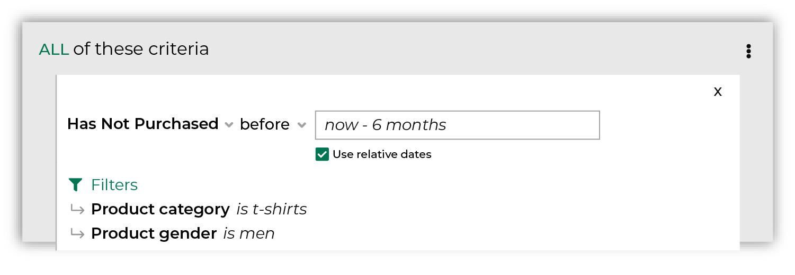

.. https://docs.amperity.com/user/

.. meta::
    :description lang=en:
        Which customers have not purchased items during the specified time period?

.. meta::
    :content class=swiftype name=body data-type=text:
        Which customers have not purchased items during the specified time period?

.. meta::
    :content class=swiftype name=title data-type=string:
        Has not purchased

==================================================
Has not purchased
==================================================

.. include:: ../../amperity_reference/source/attribute_purchase_behavior_has_not_purchased.rst
   :start-after: .. attribute-purchase-behavior-has-not-purchased-start
   :end-before: .. attribute-purchase-behavior-has-not-purchased-end

.. include:: ../../amperity_reference/source/attribute_purchase_behavior_has_not_purchased.rst
   :start-after: .. attribute-purchase-behavior-has-not-purchased-tip-start
   :end-before: .. attribute-purchase-behavior-has-not-purchased-tip-end

.. include:: ../../amperity_user/source/purchase_behavior_first_purchase.rst
   :start-after: .. purchase-behavior-first-purchase-common-admonition-start
   :end-before: .. purchase-behavior-first-purchase-common-admonition-end

.. _purchase-behavior-has-not-purchased-howitworks:

How has not purchased works
==================================================

.. include:: ../../amperity_reference/source/attribute_purchase_behavior_has_not_purchased.rst
   :start-after: .. attribute-purchase-behavior-has-not-purchased-howitworks-start
   :end-before: .. attribute-purchase-behavior-has-not-purchased-howitworks-end

.. include:: ../../amperity_reference/source/attribute_purchase_behavior_has_not_purchased.rst
   :start-after: .. attribute-purchase-behavior-has-not-purchased-howitworks-bubbles-start
   :end-before: .. attribute-purchase-behavior-has-not-purchased-howitworks-bubbles-end

.. segments-behaviors-has-not-purchased-tip-start

.. tip:: For more information about how **Has Not Purchased** works, including an explanation of the SQL that runs behind the **Segment Editor**, review the |attribute_purchase_behavior_has_not_purchased| topic in the Amperity A-Z reference.

.. segments-behaviors-has-not-purchased-tip-end

.. _purchase-behavior-has-not-purchased-larger:

Why does the audience get larger?
==================================================

.. include:: ../../amperity_reference/source/attribute_purchase_behavior_has_not_purchased.rst
   :start-after: .. attribute-purchase-behavior-has-not-purchased-howitworks-larger-start
   :end-before: .. attribute-purchase-behavior-has-not-purchased-howitworks-larger-end

.. _purchase-behavior-has-not-purchased-useinsegment:

Use has not purchased in a segment
==================================================

.. include:: ../../amperity_reference/source/attribute_purchase_behavior_has_not_purchased.rst
   :start-after: .. attribute-purchase-behavior-has-not-purchased-segments-start
   :end-before: .. attribute-purchase-behavior-has-not-purchased-segments-end

.. _purchase-behavior-has-not-purchased-example-shirts:

Example: Who has not purchased t-shirts?
++++++++++++++++++++++++++++++++++++++++++++++++++

.. purchase-behavior-has-not-purchased-example-shirts-start

The following example uses **Has Not Purchased** to return a list of customers who have not purchased a men's t-shirt in the previous six months:

.. purchase-behavior-has-not-purchased-example-shirts-end

.. _purchase-behavior-has-not-purchased-conditions:

Available conditions
==================================================

.. include:: ../../amperity_reference/source/attribute_purchase_behavior_has_not_purchased.rst
   :start-after: .. attribute-purchase-behavior-has-not-purchased-conditions-start
   :end-before: .. attribute-purchase-behavior-has-not-purchased-conditions-end

.. _purchase-behavior-has-not-purchased-filter-attributes:

Filter attributes
==================================================

.. include:: ../../amperity_reference/source/attribute_purchase_behavior_first_purchase.rst
   :start-after: .. attribute-purchase-behavior-first-purchase-filter-attributes-start
   :end-before: .. attribute-purchase-behavior-first-purchase-filter-attributes-end
