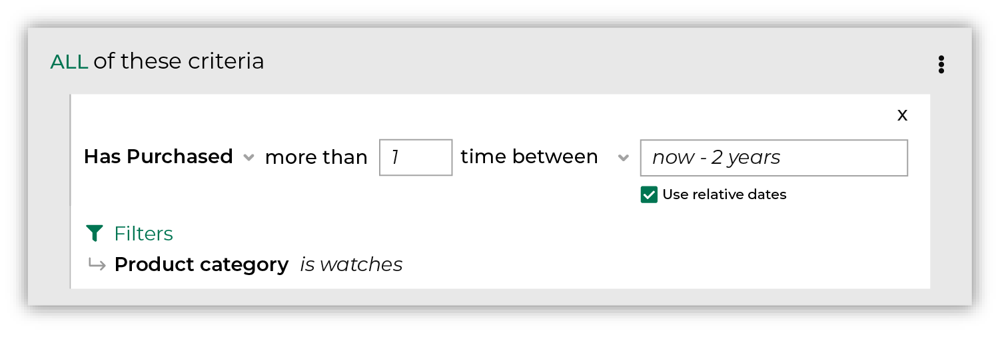

.. https://docs.amperity.com/user/

.. meta::
    :description lang=en:
        Which customers have purchased N or more items during the specified time period?

.. meta::
    :content class=swiftype name=body data-type=text:
        Which customers have purchased N or more items during the specified time period?

.. meta::
    :content class=swiftype name=title data-type=string:
        Has purchased

==================================================
Has purchased
==================================================

.. include:: ../../amperity_reference/source/attribute_purchase_behavior_has_purchased.rst
   :start-after: .. attribute-purchase-behavior-has-purchased-start
   :end-before: .. attribute-purchase-behavior-has-purchased-end

.. include:: ../../amperity_user/source/purchase_behavior_first_purchase.rst
   :start-after: .. purchase-behavior-first-purchase-common-admonition-start
   :end-before: .. purchase-behavior-first-purchase-common-admonition-end

.. _purchase-behavior-has-purchased-howitworks:

How has purchased works
==================================================

.. attribute-purchase-behavior-has-purchased-howitworks-start

.. include:: ../../amperity_reference/source/attribute_purchase_behavior_has_purchased.rst
   :start-after: .. attribute-purchase-behavior-has-purchased-start
   :end-before: .. attribute-purchase-behavior-has-purchased-howitworks-end

.. segments-behaviors-has-purchased-tip-start

.. tip:: For more information about how **Has Purchased** works, including an explanation of the SQL that runs behind the **Segment Editor**, review the |attribute_purchase_behavior_has_purchased| topic in the Amperity A-Z reference.

.. segments-behaviors-has-purchased-tip-end

.. _purchase-behavior-has-purchased-useinsegment:

Use has purchased in a segment
==================================================

.. include:: ../../amperity_reference/source/attribute_purchase_behavior_has_purchased.rst
   :start-after: .. attribute-purchase-behavior-has-purchased-segments-start
   :end-before: .. attribute-purchase-behavior-has-purchased-segments-end

.. _purchase-behavior-has-purchased-example-watch:

Example: Who has purchased a watch?
++++++++++++++++++++++++++++++++++++++++++++++++++

.. purchase-behavior-has-purchased-example-watch-start

The following example uses **Has Purchased** to return a list of customers who have purchased at least one watch within the previous two years:

.. purchase-behavior-has-purchased-example-watch-end

.. _purchase-behavior-has-purchased-conditions:

Available conditions
==================================================

.. include:: ../../amperity_reference/source/attribute_purchase_behavior_has_purchased.rst
   :start-after: .. attribute-purchase-behavior-has-purchased-conditions-start
   :end-before: .. attribute-purchase-behavior-has-purchased-conditions-end

.. _purchase-behavior-has-purchased-filter-attributes:

Filter attributes
==================================================

.. include:: ../../amperity_reference/source/attribute_purchase_behavior_first_purchase.rst
   :start-after: .. attribute-purchase-behavior-first-purchase-filter-attributes-start
   :end-before: .. attribute-purchase-behavior-first-purchase-filter-attributes-end
