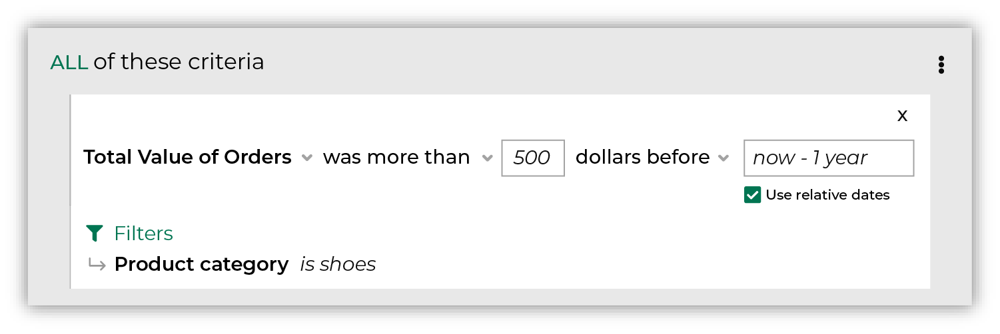

.. https://docs.amperity.com/user/

.. meta::
    :description lang=en:
        All of the revenue for all of the items that were purchased across all orders within the selected date range.

.. meta::
    :content class=swiftype name=body data-type=text:
        All of the revenue for all of the items that were purchased across all orders within the selected date range.

.. meta::
    :content class=swiftype name=title data-type=string:
        Total value of orders

==================================================
Total value of orders
==================================================

.. include:: ../../amperity_reference/source/attribute_purchase_behavior_total_value_of_orders.rst
   :start-after: .. attribute-purchase-behavior-total-value-of-orders-start
   :end-before: .. attribute-purchase-behavior-total-value-of-orders-end

.. include:: ../../amperity_user/source/purchase_behavior_first_purchase.rst
   :start-after: .. purchase-behavior-first-purchase-common-admonition-start
   :end-before: .. purchase-behavior-first-purchase-common-admonition-end

.. _purchase-behavior-total-value-of-orders-howitworks:

How total value of orders works
==================================================

.. include:: ../../amperity_reference/source/attribute_purchase_behavior_total_value_of_orders.rst
   :start-after: .. attribute-purchase-behavior-total-value-of-orders-howitworks-start
   :end-before: .. attribute-purchase-behavior-total-value-of-orders-howitworks-end

.. segments-behaviors-total-value-of-orders-tip-start

.. tip:: For more information about how **Total Value of Orders** works, including an explanation of the SQL that runs behind the **Segment Editor**, review the |attribute_purchase_behavior_total_value_of_orders| topic in the Amperity A-Z reference.

.. segments-behaviors-total-value-of-orders-tip-end

.. _purchase-behavior-total-value-of-orders-useinsegment:

Use total value of orders in a segment
==================================================

.. include:: ../../amperity_reference/source/attribute_purchase_behavior_total_value_of_orders.rst
   :start-after: .. attribute-purchase-behavior-total-value-of-orders-segments-start
   :end-before: .. attribute-purchase-behavior-total-value-of-orders-segments-end

.. _purchase-behavior-total-value-of-orders-example-shoes:

Example: More than $500 on shoes
++++++++++++++++++++++++++++++++++++++++++++++++++

.. purchase-behavior-total-value-of-orders-example-shoes-start

In the following example uses **Total Value of Orders** to return a list of customers who have spent at least $500 on shoes in the previous year:

.. purchase-behavior-total-value-of-orders-example-shoes-end

.. _purchase-behavior-total-value-of-orders-conditions:

Available conditions
==================================================

.. include:: ../../amperity_reference/source/attribute_purchase_behavior_total_value_of_orders.rst
   :start-after: .. attribute-purchase-behavior-total-value-of-orders-conditions-start
   :end-before: .. attribute-purchase-behavior-total-value-of-orders-conditions-end

.. _purchase-behavior-total-value-of-orders-filter-attributes:

Filter attributes
==================================================

.. include:: ../../amperity_reference/source/attribute_purchase_behavior_first_purchase.rst
   :start-after: .. attribute-purchase-behavior-first-purchase-filter-attributes-start
   :end-before: .. attribute-purchase-behavior-first-purchase-filter-attributes-end
