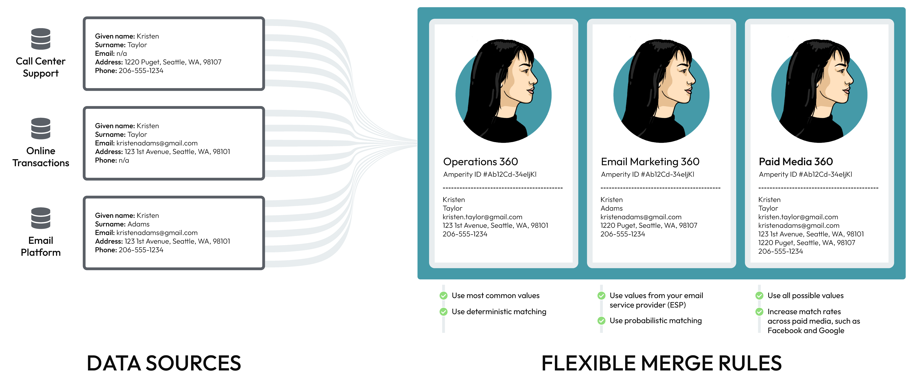

.. https://docs.amperity.com/user/

:orphan:

.. meta::
    :description lang=en:
        A landing page for the collection of content about using Amperity for analytics.

.. meta::
    :content class=swiftype name=body data-type=text:
        A landing page for the collection of content about using Amperity for analytics.

.. meta::
    :content class=swiftype name=title data-type=string:
        Tools for analysts

==================================================
Tools for analysts
==================================================

.. tools-for-analysts-start

Tools for analytics require using SQL, including building databases and tables, designing queries, using customer profile attributes, and understanding what is required to synchronize results from Amperity to external systems and workflows.

.. tools-for-analysts-end

.. image:: ../../images/mockup-customer360-tab.png
   :width: 600 px
   :alt: The Customer 360 page in Amperity.
   :align: left
   :class: no-scaled-link

.. _tools-for-analysts-common-workflows:

Common workflows
==================================================

.. tools-for-analysts-common-workflows-start

The most common workflows for analysts within Amperity is a focus on data and databases, writing SQL to define queries and enable workflows, and interacting with attributes (both those output by Stitch and those generated by the ways semantic tags were applied to data sources in your tenant).

Use Amperity to:

* Build your customer 360
* Use SQL to define multiple databases, custom databases, and custom tables
* Extend your customer 360 to make use of vertical-specific attributes and to define your own custom attributes
* Explore data using the Data Explorer

The SQL query editor enable workflows, such as:

* Linking the Amperity ID, a first-party identifier, to third-party provider person IDs
* Enriching third-party non-PII data for customer analysis, segmentation, and targeting
* Standardizing data for certain PII details
* Using data hygiene to verify accuracy of PII with third-party data providers
* Linking unknown IDs to known customers
* Mapping unknown users to known customers
* Mapping anonymous users to known customers

.. tools-for-analysts-common-workflows-end

.. _tools-for-analysts-customer360:

Customer 360 database
==================================================

.. tools-for-analysts-customer360-start

The customer 360 database is the most important database you can build in Amperity. It is the source from which all queries and segments are created and from which data will be sent to external systems for downstream workflows.

.. tools-for-analysts-customer360-end

.. _tools-for-analysts-flexible-merge-rules:

Flexible merge rules
--------------------------------------------------

.. tools-for-analysts-flexible-merge-rules-start

Some customer data platforms require using an inflexible merge rule across multiple fields, which results in lower quality data across your customer 360 profile. This problem is magnified when that inflexible merge rule must also be applied to multiple customer 360 databases.

Amperity combines the use of flexible merge rules with a patented system that allows multiple customer 360 databases to exist within the same tenant. This ensures that:

#. Merge rules are 100% configurable
#. Each field can have its own merge rule
#. Each customer 360 database can have its own set of merge rules
#. Each tenant can support a variety of merge rules to meet all of the requirements for any individual use case

For example, data sources from call centers, online transactions, and email platforms may contain slightly different sets of customer profile data.

After loading this data to Amperity and assigning the Amperity ID to each of your customers, you can use flexible merge rules to support multiple customer 360 databases.

* Your operations teams can combine prioritizing the most common values for each customer with deterministic matching
* Your email marketing team can combine prioritizing customer profile values from your email platform with probabilistic matching
* Your paid media team can combine all possible values to improve match rates on platforms like Google Ads and Facebook

Ask your Amperity implementation team for recommendations and best practices for how you can configure flexible merge rules to support all of your use cases.

.. tools-for-analysts-flexible-merge-rules-end

.. _tools-for-analysts-customer-profiles:

Customer profiles
--------------------------------------------------

.. include:: ../../shared/terms.rst
   :start-after: .. term-customer-profile-start
   :end-before: .. term-customer-profile-end

.. include:: ../../amperity_reference/source/databases.rst
   :start-after: .. databases-profiles-start
   :end-before: .. databases-profiles-end

.. include:: ../../amperity_reference/source/databases.rst
   :start-after: .. databases-profiles-context-start
   :end-before: .. databases-profiles-context-end

.. _tools-for-analysts-data-model:

About the data model
--------------------------------------------------

.. include:: ../../amperity_reference/source/data_tables.rst
   :start-after: .. data-tables-data-model-start
   :end-before: .. data-tables-data-model-end

.. include:: ../../amperity_reference/source/data_tables.rst
   :start-after: .. data-tables-data-model-important-start
   :end-before: .. data-tables-data-model-important-start

.. _tools-for-analysts-data-model-tables:

Data tables
++++++++++++++++++++++++++++++++++++++++++++++++++

.. include:: ../../amperity_reference/source/data_tables.rst
   :start-after: .. data-tables-data-model-tables-start
   :end-before: .. data-tables-data-model-tables-end

.. image:: ../../images/data_tables.png
   :width: 600 px
   :alt: The core data model for Amperity.
   :align: left
   :class: no-scaled-link

.. include:: ../../amperity_reference/source/data_tables.rst
   :start-after: .. data-tables-data-model-tables-note-start
   :end-before: .. data-tables-data-model-tables-note-end

.. tools-for-analysts-data-model-table-types-start

There are four groups of tables in this diagram:

.. list-table::
   :widths: 100 500
   :header-rows: 1

   * - Group name
     - Description

   * - Customer records

       .. image:: ../../images/data_tables-customer-records.png
          :width: 20 px
          :alt: The color associated with the customer profile table group.
          :align: left
          :class: no-scaled-link
     - .. include:: ../../shared/terms.rst
          :start-after: .. term-customer-profile-start
          :end-before: .. term-customer-profile-end

       The **Customer 360** table represents your primary set of customer profiles and is the most common starting point for building segments. Each customer profile is built using a combination of the **Merged Customers**, **Unified Customer**, and **Unified Coalesced** tables.

   * - Interaction records

       .. image:: ../../images/data_tables-interaction-records.png
          :width: 20 px
          :alt: The color associated with the interaction records table group.
          :align: left
          :class: no-scaled-link
     - .. include:: ../../shared/terms.rst
          :start-after: .. term-interaction-record-start
          :end-before: .. term-interaction-record-end

       Interaction records rely on a series of tables: **Transaction Attributes Extended**, **Unified Itemized Transactions**, **Unified Transactions**, and **Unified Product Catalog**.

       Each Amperity ID in the **Customer 360** table can be associated to many rows in the **Unified Transactions** table, and then each Amperity ID in the **Unified Transactions** can be associated to many rows in the **Unified Itemized Transactions** table. Each Amperity ID in the **Customer 360** table is associated to one Amperity ID in the **Transaction Attributes Extended** table.

   * - Stitch results

       .. image:: ../../images/data_tables-stitch-results.png
          :width: 20 px
          :alt: The color associated with the Stitch results table group.
          :align: left
          :class: no-scaled-link
     - .. include:: ../../shared/terms.rst
          :start-after: .. term-stitch-qa-start
          :end-before: .. term-stitch-qa-end

       Stitch QA activities rely on a series of tables: **Unified Coalesced**, **Unified Scores**, **Detailed Examples**, **Unified Preprocessed Raw**, **Unified Changes Clusters**, and **Unified Changes PKs**. These tables are the basis for the Stitch QA process; the specific use of individual tables will vary from tenant to tenant. Together they provide visibility into how Amperity grouped or did not group individual customer records to a single Amperity ID.

   * - Predictive tables

       .. image:: ../../images/data_tables-ampiq.png
          :width: 20 px
          :alt: The color associated with predictive tables.
          :align: left
          :class: no-scaled-link

     - Tables may be enabled for users of Amperity. These tables rely on the **Merged Customers**, **Unified Itemized Transactions**, and **Unified Transactions** tables for predictions, but there is not a 1:1 or 1:many relationship between those three tables and tables. The **Predicted CLV Attributes** table contains one row per Amperity ID, whereas the **Affinity** and **Recommendation** tables contain many rows per Amperity ID.

       The **Campaign Recipients** table contains a history of all campaigns that have been sent from Amperity. This table is updated on a recurring basis and may be used like any other table in your customer 360 database.

.. tools-for-analysts-data-model-table-types-end

.. _tools-for-analysts-data-model-indicators:

Data model indicators
++++++++++++++++++++++++++++++++++++++++++++++++++

.. include:: ../../amperity_reference/source/data_tables.rst
   :start-after: .. data-tables-data-model-indicators-start
   :end-before: .. data-tables-data-model-indicators-end

.. _tools-for-analysts-spark-sql:

Spark SQL
--------------------------------------------------

.. include:: ../../shared/terms.rst
   :start-after: .. term-spark-sql-start
   :end-before: .. term-spark-sql-end

.. _tools-for-analysts-queries-tab:

Queries
==================================================

.. tools-for-analysts-queries-tab-start

Queries enable you to discover lists of customers, get insight into their preferences and habits, identify properties and characteristics of that list, and then use that list to initiate marketing actions, campaigns, and other downstream workflows.

Queries also enable you to write SQL that can be used to perform QA against various databases and tables in the customer 360 database.

.. tools-for-analysts-queries-tab-end

.. image:: ../../images/mockup-queries-tab.png
   :width: 600 px
   :alt: The Queries page in Amperity.
   :align: left
   :class: no-scaled-link

.. tools-for-analysts-queries-tab-sql-interfaces-start

The **Queries** page provides a SQL interface for building queries. Use the visual editor to build queries with dropdowns and picklists. Use the SQL editor to build more advanced queries. The **Queries** page keeps a list of all queries, in both active and draft states.

Both editors can access all tables in the customer 360 database, which contains all of your important customer attributes, along with passthrough tables that bring data that was pulled to Amperity from the domain tables to the customer 360.

.. tools-for-analysts-queries-tab-sql-interfaces-end

.. _tools-for-analysts-query-editor:

Query editor
--------------------------------------------------

.. include:: ../../shared/terms.rst
   :start-after: .. term-sql-query-editor-start
   :end-before: .. term-sql-query-editor-end

.. image:: ../../images/mockup-queries-tab-vse.png
   :width: 600 px
   :alt: The Visual Query Editor located within the Queries page in Amperity.
   :align: left
   :class: no-scaled-link

.. include:: ../../shared/terms.rst
   :start-after: .. term-presto-sql-start
   :end-before: .. term-presto-sql-end

.. tools-for-analysts-query-editor-start

Because the SQL editor uses Presto SQL, you can also write any query directly as SQL.

.. tools-for-analysts-query-editor-end

.. image:: ../../images/mockup-queries-tab-sql.png
   :width: 600 px
   :alt: The SQL Query Editor located within the Queries page in Amperity.
   :align: left
   :class: no-scaled-link

.. _tools-for-analysts-send-to-downstream-workflows:

Send to downstream workflows
==================================================

.. tools-for-analysts-send-to-downstream-workflows-start

You can send data from the customer 360 database to any downstream location or workflow. There are two ways to do send data:

#. By using Presto SQL to send only data that is returned by a query to a configured destination
#. By exporting a database or a table

.. tools-for-analysts-send-to-downstream-workflows-end

.. _tools-for-analysts-export-databases-and-tables:

Export databases and tables
--------------------------------------------------

.. include:: ../../amperity_reference/source/data_exports.rst
   :start-after: .. data-exports-start
   :end-before: .. data-exports-end

.. _tools-for-analysts-sync-with-data-lakehouses:

Sync with data lakehouses
==================================================

.. tools-for-analysts-sync-with-data-lakehouses-start

Configure inbound and outbound shares in Amperity to enable bi-directional syncing of data tables between `Amperity and Databricks <https://docs.amperity.com/operator/bridge_databricks.html>`__ and `Amperity and Snowflake <https://docs.amperity.com/operator/bridge_snowflake.html>`__.

.. tools-for-analysts-sync-with-data-lakehouses-end

.. _tools-for-analysts-about-this-collection:

About this topic collection
==================================================

.. tools-for-analysts-about-this-collection-start

The left-side navigation uses a verb-based approach to loosely organize around the series of actions that you may do when building queries, and then sending those results to downstream workflows.

The left-side navigation has sections for the following types of activities:

#. Reviewing Stitch results and ID resolution.
#. Viewing databases in the **Customer 360** page.
#. Building queries using Presto SQL. These queries can support any desired use case.
#. Analyzing campaign results to support users of segments and campaigns.
#. Sending query results to any downstream workflow, including to BI tools such as Tableau, Microsoft Dynamics, and Business Intelligence Connect.

.. tools-for-analysts-about-this-collection-end

.. _tools-for-analysts-example-workflow:

Example workflow
==================================================

.. tools-for-analysts-example-workflow-start

Amperity standard output tables provide the foundation for a complete view of your customer. Use queries to return any type of results, and then send those results to any destination.

.. image:: ../../images/workflow-example-amp360.png
   :width: 600 px
   :alt: Build queries, and then send those results to BI tools and other downstream workflows.
   :align: left
   :class: no-scaled-link

The numbers in the previous diagram represent a scenario that builds a query, and then sends results to a configured destination:

#. Open Amperity and review databases and tables.
#. Build a query that returns the right set of data to support your downstream workflow.
#. Send the results of that query to any configured destination. Query results are sent to a single destination.

.. tools-for-analysts-example-workflow-end

.. _tools-for-analysts-log-in-amperity:

Log in to Amperity
==================================================

.. include:: ../../amperity_operator/source/start_here.rst
   :start-after: .. start-here-log-in-amperity-start
   :end-before: .. start-here-log-in-amperity-end

**To log in to Amperity**

.. include:: ../../amperity_operator/source/start_here.rst
   :start-after: .. start-here-log-in-amperity-steps-start
   :end-before: .. start-here-log-in-amperity-steps-end

.. _tools-for-analysts-tenant-browsers:

Supported browsers
--------------------------------------------------

.. include:: ../../amperity_operator/source/start_here.rst
   :start-after: .. start-here-tenant-browsers-start
   :end-before: .. start-here-tenant-browsers-end
