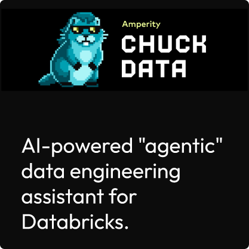

.. https://docs.amperity.com/contributing/

.. |destination-name| replace:: Amperity
.. |duration| replace:: (in weeks)
.. |duration-value| replace:: "2", "4", or "6"

.. meta::
    :description lang=en:
        How to format technical content for the Amperity docs site.

.. meta::
    :content class=swiftype name=body data-type=text:
        How to format technical content for the Amperity docs site.

.. meta::
    :content class=swiftype name=title data-type=string:
        Formatting guide

==================================================
Formatting guide
==================================================

This guide describes all of the formatting options available to Amperity documentation.

.. _rst-admonitions:

Admonitions
==================================================

.. rst-admonitions-start

An admonition is a way of calling attention to information in a topic.

**Do this**

.. code-block:: none

   .. admonition-name:: Name of custom admonition.

      The value for ``admonition-name`` is one of :ref:`attention <rst-admonition-attention>`, :ref:`caution <rst-admonition-caution>`, :ref:`danger <rst-admonition-danger>`, :ref:`error <rst-admonition-error>`, :ref:`hint <rst-admonition-hint>`, :ref:`important <rst-admonition-important>`, :ref:`note <rst-admonition-note>`, :ref:`tip <rst-admonition-tip>`, :ref:`warning <rst-admonition-warning>`, or a custom string that defines a :ref:`custom admonition <rst-admonition-custom>`.

      If more than one paragraph is needed ensure the formatting of the paragraph aligns vertically to the first character in "admonition-name".

**For this**

.. admonition:: Name of custom admonition.

   The value for ``admonition-name`` is one of :ref:`attention <rst-admonition-attention>`, :ref:`caution <rst-admonition-caution>`, :ref:`danger <rst-admonition-danger>`, :ref:`error <rst-admonition-error>`, :ref:`hint <rst-admonition-hint>`, :ref:`important <rst-admonition-important>`, :ref:`note <rst-admonition-note>`, :ref:`tip <rst-admonition-tip>`, :ref:`warning <rst-admonition-warning>`, or a custom string for a :ref:`custom admonition <rst-admonition-custom>`.

   If more than one paragraph is needed ensure the formatting of the paragraph aligns vertically to the first character in "admonition-name".

.. rst-admonitions-end

.. _rst-admonition-attention:

Attention
--------------------------------------------------

.. rst-admonition-attention-start

**Do this**

.. code-block:: none

   .. attention:: Lorem ipsum dolor set atemit.

**For this**

.. attention:: Lorem ipsum dolor set atemit.

.. rst-admonition-attention-end

.. _rst-admonition-caution:

Caution
--------------------------------------------------

.. rst-admonition-caution-start

**Do this**

.. code-block:: none

   .. caution:: Lorem ipsum dolor set atemit.

**For this**

.. caution:: Lorem ipsum dolor set atemit.

.. rst-admonition-caution-end

.. _rst-admonition-custom:

Custom admonitions
--------------------------------------------------

.. rst-admonition-custom-start

A custom admonition is similar to built-in admonitions with two differences: a custom title and the ability to use the color applied to any built-in admonitions instead of the default theme color.

.. rst-admonition-custom-end

**Custom titles**

.. rst-admonition-custom-titles-start

Do this for a custom title:

.. code-block::

   .. admonition:: Custom title

      Lorem ipsum dolor set atemit.

**For this**

.. admonition:: Custom title

   Lorem ipsum dolor set atemit.

.. rst-admonition-custom-titles-end

**Custom titles and custom colors**

.. rst-admonition-custom-colors-start

Do this for a custom title and to use the color for the :ref:`hint <rst-admonition-hint>` admonition:

.. code-block::

   .. admonition:: Custom title
      :class: hint

      Lorem ipsum dolor set atemit with "danger" colors.

**For this**

.. admonition:: Custom title
   :class: hint

   Lorem ipsum dolor set atemit with "danger" colors.

.. rst-admonition-custom-colors-end

.. _rst-admonition-danger:

Danger
--------------------------------------------------

.. rst-admonition-danger-start

**Do this**

.. code-block:: none

   .. danger:: Lorem ipsum dolor set atemit.

**For this**

.. danger:: Lorem ipsum dolor set atemit.

.. rst-admonition-danger-end

.. _rst-admonition-error:

Error
--------------------------------------------------

.. rst-admonition-error-start

**Do this**

.. code-block:: none

   .. error:: Lorem ipsum dolor set atemit.

**For this**

.. error:: Lorem ipsum dolor set atemit.

.. rst-admonition-error-end

.. _rst-admonition-hint:

Hint
--------------------------------------------------

.. rst-admonition-hint-start

**Do this**

.. code-block:: none

   .. hint:: Lorem ipsum dolor set atemit.

**For this**

.. hint:: Lorem ipsum dolor set atemit.

.. rst-admonition-hint-end

.. _rst-admonition-important:

Important
--------------------------------------------------

.. rst-admonition-important-start

**Do this**

.. code-block:: none

   .. important:: Lorem ipsum dolor set atemit.

**For this**

.. important:: Lorem ipsum dolor set atemit.

.. rst-admonition-important-end

.. _rst-admonition-note:

Note
--------------------------------------------------

.. rst-admonition-note-start

**Do this**

.. code-block:: none

   .. note:: Lorem ipsum dolor set atemit.

**For this**

.. note:: Lorem ipsum dolor set atemit.

.. rst-admonition-note-end

.. _rst-admonition-tip:

Tip
--------------------------------------------------

.. rst-admonition-tip-start

**Do this**

.. code-block:: none

   .. tip:: Lorem ipsum dolor set atemit.

**For this**

.. tip:: Lorem ipsum dolor set atemit.

.. rst-admonition-tip-end

.. _rst-admonition-warning:

Warning
--------------------------------------------------

.. rst-admonition-warning-start

**Do this**

.. code-block:: none

   .. warning:: Lorem ipsum dolor set atemit.

**For this**

.. warning:: Lorem ipsum dolor set atemit.

.. rst-admonition-warning-end

.. _rst-anchor-references:

Anchor references
==================================================

Anchor references allow topics to link to headers within topics that are in the same content collection. For example, topics in the Amperity reference may use anchor references to sections in any other topic in the Amperity reference.

.. code-block:: none

   .. _rst-anchor-references:

   Anchor references
   ==================================================

The anchor reference is the ``.. _rst-anchor-references:`` syntax above the header. They are formatted with this pattern:

.. code-block:: none

   dot dot space underscore hyphen-separated-string colon

The "hyphen separated string" must be in lowercase and must follow this pattern:

.. code-block:: none

   filename - section - subsection

For example, the filename of this topic is ``rst.rst`` and the section is titled "Anchor references", which means the anchor reference is ``.. _rst-anchor-references:``.

.. _rst-article-info:

Article information
==================================================

.. rst-article-info-start

Add article information to the top of a topic when it is appropriate, such as for tutorials or for topics that a customer is expected to read.

**Do this**

.. code-block:: none

   .. article-info::
      :avatar: _static/amperity_circle.png
      :avatar-link: https://docs.amperity.com/reference/start.html
      :avatar-outline: muted
      :author: Identity resolution agent
      :date: |today|
      :read-time: 10 min read; ~1 hour to complete
      :class-container: sd-p-2 sd-outline-muted sd-rounded-1

**For this**

.. article-info::
   :avatar: _static/amperity_circle.png
   :avatar-link: https://docs.amperity.com/reference/start.html
   :avatar-outline: muted
   :author: Identity resolution agent
   :date: |today|
   :read-time: 10 min read; ~1 hour to complete
   :class-container: sd-p-2 sd-outline-muted sd-rounded-1

Update the values for ``:author:`` and ``:read-time`` to be specific to the topic.

.. rst-article-info-end

.. _rst-buttons:

Buttons
==================================================

.. rst-buttons-start

Buttons are like badges, but are bigger and link to somewhere.

.. caution:: Not currently supported for general use. The following examples show that they work. Use sparingly or not at all.

**A button**

.. button-link:: https://docs.amperity.com

**A button with text**

.. button-link:: https://docs.amperity.com

   Button text

**A button with a shadow**

.. button-link:: https://docs.amperity.com
   :color: primary
   :shadow:

**A button with an outline**

.. button-link:: https://docs.amperity.com
   :color: primary
   :outline:

**A button that fills the width of the page**

.. button-link:: https://docs.amperity.com
   :color: secondary
   :expand:

**Some buttons in a container**

.. container:: buttons

   `User Guides <../user/index.html>`_
   `Operators Guide <../operator/index.html>`_
   `Guided Setup <start.html>`_

.. rst-buttons-end

.. _rst-card-carousel:

Card carousel
==================================================

.. TODO: FWIW, this isn't amazing. Will keep the functionality, but looking for a useful use case.

.. rst-card-carousel-start

.. caution:: This formatting option is currently unused. Please ask the Amperity docs team before using it.

Use the ``.. card-carousel::`` directive to create a horizontal scrolling set of cards. Set an integer value between 1 and 4 to configure the number of visible cards on the page.

**Do this**

.. code-block:: none

   .. card-carousel:: 2

      .. card:: Card 1

         Lorem ipsum dolor set atemit.

      .. card:: Card 2

         Lorem ipsum dolor set atemit.

      .. card:: Card 3

         Lorem ipsum dolor set atemit.

      .. card:: Card 4

         Lorem ipsum dolor set atemit.

**For this**

.. card-carousel:: 2

   .. card:: Card 1

      Lorem ipsum dolor set atemit.

   .. card:: Card 2

      Lorem ipsum dolor set atemit.

   .. card:: Card 3

      Lorem ipsum dolor set atemit.

   .. card:: Card 4

      Lorem ipsum dolor set atemit.

**Example carousel**

.. card-carousel:: 2

   .. card:: **Step 1**

      `Create a sandbox <../operator/sandbox_create.html>`__.

   .. card:: **Step 2**

      `Access the sandbox <../operator/sandbox_open.html>`__.

   .. card:: **Step 3**

      Make configuration changes in the sandbox.

   .. card:: **Step 4**

      Run the updated workflow from within the sandbox, including sandbox validations, to verify changes.

   .. card:: **Step 5**

      `Promote configuration changes <../operator/sandbox_promote.html>`__ to your production tenant.

.. rst-card-carousel-end

.. _rst-cards:

Cards
==================================================

.. rst-cards-start

Use the following card types:

* :ref:`Clickable cards <rst-cards-clickable>`
* :ref:`Standalone card <rst-cards-standalone>`

.. note:: Cards are used in :ref:`grids <rst-grids>`.

.. rst-cards-end

.. _rst-cards-clickable:

Clickable cards
--------------------------------------------------

.. rst-cards-clickable-start

Use the ``.. card::`` directive to add a clickable card to a page, and the configure the type of link.

* Use the ``:link:`` attribute to define the URL, anchor reference, or topic filename.
* Use the ``:link-type:`` attribute to define ``:doc:`` or ``:ref:`` link types.
* Optional. Use the ``:link-alt:`` attribute to add alt text on hover.

The following types of clickable cards are available:

* :ref:`Cards with cross-site links <rst-cards-clickable-cross-site>`
* :ref:`Cards with external links <rst-cards-clickable-external>`
* :ref:`Cards with links to topic headings within the same collection <rst-cards-clickable-reference>`
* :ref:`Cards with links to topics within the same collection <rst-cards-clickable-topic>`

.. rst-cards-clickable-end

.. _rst-cards-clickable-cross-site:

Cards with cross-site links
++++++++++++++++++++++++++++++++++++++++++++++++++

.. rst-cards-clickable-cross-site-start

Cards can link to pages in Amperity documentation that are not within the same collection.

**Do this**

.. code-block:: none

   .. card:: Card with cross-site link
      :link: https://docs.amperity.com/operators/api_profile.html
      :link-alt: Profile API

      This card links to https://docs.amperity.com/operators/api_profile.html.

**For this**

.. card:: Card with cross-site link
   :link: https://docs.amperity.com/operators/api_profile.html
   :link-alt: Profile API

   This card links to https://docs.amperity.com/operators/api_profile.html.

.. rst-cards-clickable-cross-site-end

.. _rst-cards-clickable-external:

Cards with external links
++++++++++++++++++++++++++++++++++++++++++++++++++

.. rst-cards-clickable-external-start

Cards can link to external web pages.

**Do this**

.. code-block:: none

   .. card:: Card with external link
      :link: https://docs.amperity.com

      This card links to https://docs.amperity.com.

**For this**

.. card:: Card with external link
   :link: https://docs.amperity.com

   This card links to https://docs.amperity.com.

.. rst-cards-clickable-external-end

.. _rst-cards-clickable-reference:

Cards that link to sections
++++++++++++++++++++++++++++++++++++++++++++++++++

.. rst-cards-clickable-reference-start

Cards can link to topic headings within the same collection.

**Do this**

.. code-block:: none

   .. card:: Card that links to topic heading within the same collection
      :link: rst-cards-standalone
      :link-type: ref
      :link-alt: Standalone cards

**For this**

.. card:: Card that links to topic heading within the same collection
   :link: rst-cards-standalone
   :link-type: ref
   :link-alt: Standalone cards

.. rst-cards-clickable-reference-end

.. _rst-cards-clickable-topic:

Cards that link to topics
++++++++++++++++++++++++++++++++++++++++++++++++++

.. rst-cards-clickable-topic-start

Cards can link to topics within the same collection.

**Do this**

.. code-block:: none

   .. card:: Card that links to topic within the same collection
      :link: styles
      :link-type: doc

      This is a card that uses a ``:doc:`` link to the Amperity Style Guide.

**For this**

.. card:: Card that links to topic within the same collection
   :link: styles
   :link-type: doc

   This is a card that uses a ``:doc:`` link to the Amperity Style Guide.

.. rst-cards-clickable-topic-end

.. _rst-cards-standalone:

Standalone cards
--------------------------------------------------

.. rst-cards-standalone-start

Use the ``.. card::`` directive to add a standalone card to a page. This acts like an :ref:`admonition <rst-admonitions>`, but without a title and with a neutral border that applies a subtle callout to a paragraph.

**Do this**

.. code-block:: none

   .. card:: What is UID2?

      .. include:: ../../amperity_reference/source/uid2.rst
         :start-after: .. uid2-overview-start
         :end-before: .. uid2-overview-end

**For this**

.. card:: What is UID2?

   .. include:: ../../amperity_reference/source/uid2.rst
      :start-after: .. uid2-overview-start
      :end-before: .. uid2-overview-end

.. rst-cards-standalone-end

.. _rst-code-blocks:

Code blocks
==================================================

.. rst-code-blocks-start

The ``.. code-block::`` directive is defined by Sphinx:

.. code-block:: none

   .. code-block:: language
      :caption: sphinx.ext.todo
      :class: dark-code
      :emphasize-lines: 2,10-15
      :linenos:

      extensions = [
        "sphinx.ext.todo",
      ]
      todo_include_todos = True

where "language" is one of the :ref:`code language highlight options <rst-code-language-highlights>`.

* Use ``:linenos:`` to :ref:`add line numbers <rst-code-block-line-numbers>` to the left side of a code block.
* Use ``:emphasize-lines:`` to :ref:`add emphasis to lines <rst-code-block-line-emphasis>` in a code block.
* Use ``:caption:`` to :ref:`add a title <rst-code-block-captions>` to a code block.
* Use ``:class:`` with a value of "dark-code" to force a code sample to always be shown in :ref:`dark mode formatting <rst-code-block-dark-code>`.

.. rst-code-blocks-end

.. _rst-code-block-captions:

Captions
--------------------------------------------------

.. rst-code-block-captions-start

A caption is the title for a code block. Use the ``:caption:`` attribute to apply a string that becomes the title of the code block.

**Do this**

.. code-block:: none

   .. code-block:: python
      :caption: campaigns.py
      :linenos:

      import requests
      import json
      import csv

      # URL for Campaigns endpoint
      url = "https://tenant-name.amperity.com/api/campaigns"

      # Required headers
      headers = {
        'accept': 'application/json',
        'authorization': 'Bearer token', # add token here
        'amperity-tenant': 'tenant-name',
        'api-version': 'version'
      }

      # Query parameter for data template IDs
      payload = {
        # 'destination_data_template_id': ''
      }

      # Get the response from the Campaigns endpoint
      response = requests.request("GET", url, headers=headers, params=payload)
      response_json = response.json()

      # Extract headers from the first data entry
      headers = list(response_json["data"][0].keys())

      # Specify the output CSV file path
      csv_file_path = "campaigns.csv"

      # Write data to a CSV file
      with open(csv_file_path, mode='w', newline='') as file:
        writer = csv.DictWriter(file, fieldnames=headers)
        writer.writeheader()
        for entry in response_json["data"]:
          writer.writerow(entry)

      print("CSV file generated successfully.")

**For this**

.. code-block:: python
   :caption: campaigns.py
   :linenos:

   import requests
   import json
   import csv

   # URL for Campaigns endpoint
   url = "https://tenant-name.amperity.com/api/campaigns"

   # Required headers
   headers = {
     'accept': 'application/json',
     'authorization': 'Bearer token', # add token here
     'amperity-tenant': 'tenant-name',
     'api-version': 'version'
   }

   # Query parameter for data template IDs
   payload = {
     # 'destination_data_template_id': ''
   }

   # Get the response from the Campaigns endpoint
   response = requests.request("GET", url, headers=headers, params=payload)
   response_json = response.json()

   # Extract headers from the first data entry
   headers = list(response_json["data"][0].keys())

   # Specify the output CSV file path
   csv_file_path = "campaigns.csv"

   # Write data to a CSV file
   with open(csv_file_path, mode='w', newline='') as file:
     writer = csv.DictWriter(file, fieldnames=headers)
     writer.writeheader()
     for entry in response_json["data"]:
       writer.writerow(entry)

   print("CSV file generated successfully.")

.. rst-code-language-python-end

.. _rst-code-block-dark-code:

Dark code
--------------------------------------------------

.. rst-code-block-dark-code-start

You can force code blocks to always use their dark code styles using the ``:class:`` with its value set to "dark-mode".

**Do this**

.. code-block:: none

   .. code-block:: python
      :class: dark-code

      html_theme_options = {
          "dark_code": True
      }

**For this**

.. code-block:: python
   :class: dark-code

   html_theme_options = {
       "dark_code": True
   }

.. rst-code-block-dark-code-end

.. _rst-code-block-line-emphasis:

Line emphasis
--------------------------------------------------

.. rst-code-block-line-emphasis-start

Emphasize specific lines within a code block using the ``:emphasize-lines:`` attribute. Use a dash for sequential emphasis and a comma for separated emphasis. For example:

* ``:emphasize-lines: 3-5`` will emphasize lines 3 through 5.
* ``:emphasize-lines: 3, 5`` will emphasize lines 3 and 5, but not 4.
* ``:emphasize-lines: 1, 3, 5-7, 25`` will emphasize only lines 1, 3, 5, 6, 7, and 24.

**Do this**

.. code-block:: none

   .. code-block:: django
      :emphasize-lines: 1, 3, 5-7, 25

      
      
      {% set navItems = [
        {
          "title": "Start Here",
          "iconClass": "fas fa-arrow-alt-circle-right fa-fw",
          "subItems": [
            {
              "title": "Start Here",
              "hasSubItems": false,
              "url": "/some_file.html"
            },
            {
              "title": "FAQ",
              "hasSubItems": false,
              "url": "/faq.html"
            },
            {
              "title": "Additional Resources",
              "hasSubItems": false,
              "url": "/resources.html"
            },
          ]
        },
      ] -%}

**For this**

.. code-block:: django
   :emphasize-lines: 1, 3, 5-7, 25
   :linenos:

   
   
   {% set navItems = [
     {
       "title": "Start Here",
       "iconClass": "fas fa-arrow-alt-circle-right fa-fw",
       "subItems": [
         {
           "title": "Start Here",
           "hasSubItems": false,
           "url": "/some_file.html"
         },
         {
           "title": "FAQ",
           "hasSubItems": false,
           "url": "/faq.html"
         },
         {
           "title": "Additional Resources",
           "hasSubItems": false,
           "url": "/resources.html"
         },
       ]
     },
   ] -%}

.. rst-code-block-line-emphasis-end

.. _rst-code-block-line-numbers:

Line numbers
--------------------------------------------------

.. rst-code-block-line-numbers-start

Add line numbers to code blocks using the ``:linenos:`` attribute.

**Do this**

.. code-block:: none

   .. code-block:: json
      :linenos:

      {
        "foo": [
          {
            "one": "12345",
            "two": "abcde",
            "three": "words"
          },
        ],
      }

**For this**

.. code-block:: json
   :linenos:

   {
     "foo": [
       {
         "one": "12345",
         "two": "abcde",
         "three": "words"
       },
     ],
   }

.. tip:: This attribute is sometimes picky and the build breaks and you discover that it works fine with FOUR spaces instead of THREE (with everything aligned with the FOUR spaces instead of THREE). Ask for help from the docs team if you run into this issue.

.. rst-code-block-line-numbers-end

.. _rst-code-language-highlights:

Code language highlights
==================================================

.. rst-code-language-highlights-start

Amperity uses the following code language highlights for differentiation within documentation. The highlighting applies to the use case within the technical content and is not always intended to match a specific code language.

* :ref:`Command shells <rst-code-language-command>`
* :ref:`Config files <rst-code-language-config>`
* :ref:`Data tables <rst-code-language-data-table>`
* :ref:`HTML <rst-code-language-html>`
* :ref:`JSON <rst-code-language-json>`
* :ref:`JSON with Jinja <rst-code-language-json-with-jinja>`
* :ref:`None <rst-code-language-none>`
* :ref:`Python <rst-code-language-python>`
* :ref:`REST APIs <rst-code-language-rest-api>`
* :ref:`reStructuredText <rst-code-language-rst>`
* :ref:`Ruby <rst-code-language-ruby>`
* :ref:`Shell scripts <rst-code-language-shell>`
* :ref:`SQL queries <rst-code-language-sql>`
* :ref:`YAML <rst-code-language-yaml>`
* :ref:`YAML with Jinja <rst-code-language-yaml-with-jinja>`

.. rst-code-language-highlights-end

.. _rst-code-language-command:

Command shells
--------------------------------------------------

.. rst-code-language-command-start

Assign ``console`` as the name of the code block for code blocks with command lines.

.. important:: Do not use the ``:linenos:`` attribute with command shells.

**Do this**

.. code-block:: none

   .. code-block:: console

      $ service stop

**For this**

.. code-block:: console

   $ service stop

.. rst-code-language-command-end

.. _rst-code-language-config:

Config files
--------------------------------------------------

.. rst-code-language-config-start

Assign ``text`` as the name of the code block for code blocks with configuration settings.

**Do this**

.. code-block:: none

   .. code-block:: text
      :linenos:

      spark.setting.hours 1h
      spark.setting.option -User.timezone=UTC
      spark.setting.memory 20g

**For this**

.. code-block:: text
   :linenos:

   spark.setting.hours 1h
   spark.setting.option -User.timezone=UTC
   spark.setting.memory 20g

.. rst-code-language-config-end

.. _rst-code-language-data-table:

Data tables
--------------------------------------------------

.. rst-code-language-data-table-start

Assign ``mysql`` as the name of the code block for code blocks that show the inputs and outputs of processing data.

.. important:: Do not use the ``:linenos:`` attribute with data tables.

**Do this**

.. code-block:: none

   .. code-block:: mysql

      --------- ---------
       column1   column2 
      --------- ---------
       value     value   
       value     value   
       value     value   
      --------- ---------

**For this**

.. code-block:: mysql

   --------- ---------
    column1   column2 
   --------- ---------
    value     value   
    value     value   
    value     value   
   --------- ---------

.. rst-code-language-data-table-end

.. _rst-code-language-html:

HTML
--------------------------------------------------

.. rst-code-language-html-start

Assign ``html`` as the name of the code block for code blocks with HTML.

**Do this**

.. code-block:: none

   .. code-block:: html
      :linenos:

      

        
Custom warning

        
The text for a custom warning that is built from raw HTML.

      

**For this**

.. code-block:: html
   :linenos:

   

     
Custom warning

     
The text for a custom warning that is built from raw HTML.

   

.. rst-code-language-html-end

.. _rst-code-language-json:

JSON
--------------------------------------------------

.. rst-code-language-json-start

Assign ``json`` as the name of the code block for code blocks with JSON structures.

**Do this**

.. code-block:: none

   .. code-block:: json
      :linenos:

      {
        "foo": [
          {
            "one": "12345",
            "two": "abcde",
            "three": "words"
          },
        ]
      }

**For this**

.. code-block:: json
   :linenos:

   {
     "foo": [
       {
         "one": "12345",
         "two": "abcde",
         "three": "words"
       },
     ],
   }

.. rst-code-language-json-end

.. _rst-code-language-json-with-jinja:

JSON with Jinja
--------------------------------------------------

.. rst-code-language-json-with-jinja-start

Some code blocks will refuse to parse when ``json`` is assigned to the code block. For these code blocks try using ``django``, which supports non-standard JSON structures, such as those that combined JSON and Jinja templating.

**Do this**

.. code-block:: none

   .. code-block:: django
      :linenos:

      
      
      {% set navItems = [
        {
          "title": "Start Here",
          "iconClass": "fas fa-arrow-alt-circle-right fa-fw",
          "subItems": [
            {
              "title": "Start Here",
              "hasSubItems": false,
              "url": "/some_file.html"
            },
            {
              "title": "FAQ",
              "hasSubItems": false,
              "url": "/faq.html"
            },
            {
              "title": "Additional Resources",
              "hasSubItems": false,
              "url": "/resources.html"
            },
          ]
        },
      ] -%}

**For this**

.. code-block:: django
   :linenos:

   
   
   {% set navItems = [
     {
       "title": "Start Here",
       "iconClass": "fas fa-arrow-alt-circle-right fa-fw",
       "subItems": [
         {
           "title": "Start Here",
           "hasSubItems": false,
           "url": "/some_file.html"
         },
         {
           "title": "FAQ",
           "hasSubItems": false,
           "url": "/faq.html"
         },
         {
           "title": "Additional Resources",
           "hasSubItems": false,
           "url": "/resources.html"
         },
       ]
     },
   ] -%}

.. rst-code-language-json-with-jinja-end

.. _rst-code-language-none:

None
--------------------------------------------------

.. rst-code-language-none-start

Assign ``none`` as the name of the code block for situations that require code block-like formatting or in any situation where another code block name creates a build error.

**Do this**

.. code-block:: none

   .. code-block:: none
      :linenos:

      This is a none block. It's formatted as if it were code, but isn't actually code.

      Can include code-like things:

      function_foo()
        does: something
      end

**For this**

.. code-block:: none
   :linenos:

   This is a none block. It's formatted as if it were code, but isn't actually code.

   Can include code-like things:

   function_foo()
     does: something
   end

.. rst-code-language-none-end

.. _rst-code-language-python:

Python
--------------------------------------------------

.. rst-code-language-python-start

Assign ``python`` as the name of the code block for Python code samples.

**Do this**

.. code-block:: none

   .. code-block:: python
      :linenos:

      import requests
      import json
      import csv

      # URL for Campaigns endpoint
      url = "https://tenant-name.amperity.com/api/campaigns"

      # Required headers
      headers = {
        'accept': 'application/json',
        'authorization': 'Bearer token', # add token here
        'amperity-tenant': 'tenant-name',
        'api-version': 'version'
      }

      # Query parameter for data template IDs
      payload = {
        # 'destination_data_template_id': ''
      }

      # Get the response from the Campaigns endpoint
      response = requests.request("GET", url, headers=headers, params=payload)
      response_json = response.json()

      # Extract headers from the first data entry
      headers = list(response_json["data"][0].keys())

      # Specify the output CSV file path
      csv_file_path = "campaigns.csv"

      # Write data to a CSV file
      with open(csv_file_path, mode='w', newline='') as file:
        writer = csv.DictWriter(file, fieldnames=headers)
        writer.writeheader()
        for entry in response_json["data"]:
          writer.writerow(entry)

      print("CSV file generated successfully.")

**For this**

.. code-block:: python
   :linenos:

   import requests
   import json
   import csv

   # URL for Campaigns endpoint
   url = "https://tenant-name.amperity.com/api/campaigns"

   # Required headers
   headers = {
     'accept': 'application/json',
     'authorization': 'Bearer token', # add token here
     'amperity-tenant': 'tenant-name',
     'api-version': 'version'
   }

   # Query parameter for data template IDs
   payload = {
     # 'destination_data_template_id': ''
   }

   # Get the response from the Campaigns endpoint
   response = requests.request("GET", url, headers=headers, params=payload)
   response_json = response.json()

   # Extract headers from the first data entry
   headers = list(response_json["data"][0].keys())

   # Specify the output CSV file path
   csv_file_path = "campaigns.csv"

   # Write data to a CSV file
   with open(csv_file_path, mode='w', newline='') as file:
     writer = csv.DictWriter(file, fieldnames=headers)
     writer.writeheader()
     for entry in response_json["data"]:
       writer.writerow(entry)

   print("CSV file generated successfully.")

.. rst-code-language-python-end

.. _rst-code-language-rest-api:

REST APIs
--------------------------------------------------

.. rst-code-language-rest-api-start

Assign ``rest`` as the name of the code block for code blocks with simple REST API examples.

.. important:: Do not use the ``:linenos:`` attribute with REST API examples unless the request or response has more than one line.

**Do this**

.. code-block:: none

   .. code-block:: rest
      :linenos:

      https://www.yoursite.com/endpoint/{some_endpoint}

**For this**

.. code-block:: rest
   :linenos:

   https://www.yoursite.com/endpoint/{some_endpoint}

.. note:: Use the :ref:`rst-code-language-json` code block style for the JSON request/response part of the REST API.

.. rst-code-language-rest-api-end

.. _rst-code-language-rst:

reStructuredText
--------------------------------------------------

.. rst-code-language-rst-start

Assign ``rst`` as the name of the code block for code blocks with reStructuredText formatting.

**Do this**

.. code-block:: none

   .. code-block:: rst
      :linenos:

      This is some *reStructured* **Text** formatting.

      .. code-block:: none

         that has some(code);

**For this**

.. code-block:: rst
   :linenos:

   This is some *reStructured* **Text** formatting.

   .. code-block:: none

      that has some(code);

.. rst-code-language-rst-end

.. _rst-code-language-ruby:

Ruby
--------------------------------------------------

.. rst-code-language-ruby-start

Assign ``ruby`` as the name of the code block for Ruby code samples.

**Do this**

.. code-block:: none

   .. code-block:: ruby
      :linenos:

      require 'uri'
      require 'net/http'

      url = URI("https://tenant-name.amperity.com/api/campaigns")

      http = Net::HTTP.new(url.host, url.port)
      http.use_ssl = true

      request = Net::HTTP::Get.new(url)
      request["accept"] = 'application/json'
      request["authorization"] = 'Bearer token'
      request["amperity-tenant"] = 'tenant-name'
      request["api-version"] = '2024-04-01'
      request["destination_data_template_id"] = 'ab-1CDEfGHIj'

      response = http.request(request)
      puts response.read_body

**For this**

.. code-block:: ruby
   :linenos:

   require 'uri'
   require 'net/http'

   url = URI("https://tenant-name.amperity.com/api/campaigns")

   http = Net::HTTP.new(url.host, url.port)
   http.use_ssl = true

   request = Net::HTTP::Get.new(url)
   request["accept"] = 'application/json'
   request["authorization"] = 'Bearer token'
   request["amperity-tenant"] = 'tenant-name'
   request["api-version"] = '2024-04-01'
   request["destination_data_template_id"] = 'ab-1CDEfGHIj'

   response = http.request(request)
   puts response.read_body

.. rst-code-language-ruby-end

.. _rst-code-language-shell:

Shell scripts
--------------------------------------------------

.. rst-code-language-shell-start

Assign ``bash`` as the name of the code block for code blocks with shell script examples.

**Do this**

.. code-block:: none

   .. code-block:: bash
      :linenos:

      # The product and version information.
      readonly MARKUP_PRODUCT="markup-app"
      readonly MARKUP_VERSION="1.23.45-6"
      readonly MARKUP_RELEASE_DATE="2019-04-01"

**For this**

.. code-block:: bash
   :linenos:

   # The product and version information.
   readonly MARKUP_PRODUCT="markup-app"
   readonly MARKUP_VERSION="1.23.45-6"
   readonly MARKUP_RELEASE_DATE="2019-04-01"

.. rst-code-language-shell-end

.. _rst-code-language-sql:

SQL queries
--------------------------------------------------

.. rst-code-language-sql-start

Assign ``sql`` as the name of the code block for code blocks with Spark SQL or Presto SQL examples.

**Do this**

.. code-block:: none

   .. code-block:: sql
      :linenos:

      SELECT * 
      FROM Customers
      WHERE Last_Name='Smith'

**For this**

.. code-block:: sql
   :linenos:

   SELECT * 
   FROM Customers
   WHERE Last_Name='Smith'

.. rst-code-language-sql-end

.. _rst-code-language-yaml:

YAML
--------------------------------------------------

.. rst-code-language-yaml-start

Assign ``yaml`` as the name of the code block for code blocks with YAML.

**Do this**

.. code-block:: none

   .. code-block:: yaml
      :linenos:

      config:
        - some_setting: 'value'
        - some_other_setting: 12345

**For this**

.. code-block:: yaml
   :linenos:

   config:
     - some_setting: 'value'
     - some_other_setting: 12345

.. rst-code-language-yaml-end

.. _rst-code-language-yaml-with-jinja:

YAML with Jinja
--------------------------------------------------

.. rst-code-language-yaml-with-jinja-start

Assign ``salt`` as the name of the code block for code blocks with YAML that embeds Jinja templating.

**Do this**

.. code-block:: none

   .. code-block:: salt
      :linenos:

      

      config:
        - some_setting: 'value'
        - some_other_setting: {{ some_jinja }}

**For this**

.. code-block:: salt
   :linenos:

   

   config:
     - some_setting: 'value'
     - some_other_setting: {{ some_jinja }}

.. admonition:: Why salt?

   Using ``salt`` seems like an odd way to specify a code block that contains both Jinja and YAML.

   SaltStack is a configuration management tool similar to Ansible, Chef, and Puppet. SaltStack uses a mix of Jinja and YAML to define system states. The ``salt`` lexer exists in Pygments originally because of how SaltStack defines system states, their use of Python and documentation built via Sphinx, and the need for a lexer that could parse a file with code samples that contain both Jinja and YAML.

.. rst-code-language-yaml-with-jinja-end

.. _rst-code-with-sidebar:

Code block with sidebar
==================================================

.. rst-code-with-sidebar-start

Code blocks can be configured to have a sidebar on the right side. In general do not use sidebars with code samples. The width of the topic just isn't wide enough in most cases. This formatting option should be used sparingly and only if it improves understanding technical content.

.. sidebar:: A sidebar caption.

   Some sidebar content.

   * A list
   * Is OK.

   And more content.

   The diagram is from `Chuck Data <https://github.com/amperity/chuck-data>`__ |ext_link|.

.. code-block:: none
   :caption: Welcome to Chuck Data

                               .:::::::::                    
                             -----------=++                  
                           -***::::--::----:*#=              
                         .**- %%%+:::+:---::#@@@             
                        .:*+:.%++++==+:::==+#-+@             
                        :#-.:===============*#%%             
                      -:%:  .@@-        :@@=                 
                    :-:+=:-: ==%    +++. ==%    +#*          
                      ::::=+=      +++++-     .+++           
                    :--::+++++++@@@%   +@@@++++++%:...       
                   :+#*::=++++=@@@@@@ @@@@@@*+++%%%%-        
                  :::::#::=*#+=-@@@.. ..-@@-++*#%@           
                  ..:=*:::=*%%%*----@@@*---+#%%%%            
                   +=::::--+%%%%###++++++##%%%%%@            
                 :+::::::=++#%%%%%%%%%%%%%%%%#*+@            
                #:::::::-++++%%%%%%@@@@@@%%%%*++%@           
              .=-:::::::-++++*%%%@@@@@@@@@%%+++++@           
              -*::::::::--=+++#%%@@@@@@@@@%#==+++@           
             =+::------::--=++--#%%@@@@@@%%-++++%@           
            *=:::---=+++-::--=+::+%%@@@%#+:=+++*%            
            *=::---=++++++-::-    .%%%%:    =+#@             
            *=::---=+++++#%#=    :+@@@@#-    =-              
            *=::----=++++#%%%%  @@@@@@@@@@  --.              
            **-:::----===:*%%@@@@@@@@@@@@@%-=*=              
          ++-*+:::-------:*%%@@@@@@@@@@@@#--+#=              
      :==--:::=#::::::::::*%%%@@@@@@@@%%*=--++-              
     ==----::::-*:::::::::*%%%%@@@@@@%#-:::--                
    #-::::::*#=   :        -%%%%%%%%%                        
    :------          ......:-------  .........               

      ________  ___  ___  ___  ___  ________  ___  __
     |\   ____\|\  \|\  \|\  \|\  \|\   ____\|\  \|\  \
     \ \  \___|\ \  \\\  \ \  \\\  \ \  \___|\ \  \/  /|_
      \ \  \    \ \   __  \ \  \\\  \ \  \    \ \   ___  \
       \ \  \____\ \  \ \  \ \  \\\  \ \  \____\ \  \\ \  \
        \ \_______\ \__\ \__\ \_______\ \_______\ \__\\ \__\
         \|_______|\|__|\|__|\|_______|\|_______|\|__| \|__|

       ________  ________  _________  ________               
      |\   ___ \|\   __  \|\___   ___\\   __  \
      \ \  \_|\ \ \  \|\  \|___ \  \_\ \  \|\  \             
       \ \  \ \\ \ \   __  \   \ \  \ \ \   __  \
        \ \  \_\\ \ \  \ \  \   \ \  \ \ \  \ \  \           
         \ \_______\ \__\ \__\   \ \__\ \ \__\ \__\
          \|_______|\|__|\|__|    \|__|  \|__|\|__|          

.. rst-code-with-sidebar-end

.. _rst-dropdowns:

Dropdowns
==================================================

.. rst-dropdowns-start

A dropdown shows a title string and a box that expands when the reader clicks it.

**Do this**

.. code-block:: none

   .. dropdown:: Dropdown title
      :icon: code

      Dropdown content

**For this**

.. dropdown:: Dropdown title
   :icon: code

   Dropdown content

.. tip:: Dropdowns should be used to present information that a reader does not need to see immediately and the title should clearly identify what information appears.

   Dropdowns should not be used when a section title should appear in the right-side navigation.

   Content within a dropdown cannot be included elsewhere *unless* the entire dropdown is included. Inclusions may be used within a dropdown.

.. rst-dropdowns-end

.. _rst-dropdowns-open:

Expanded dropdowns
--------------------------------------------------

.. rst-dropdowns-open-start

Use the ``:open:`` attribute to configure a dropdown to be expanded by default.

**Do this**

.. code-block:: none

   .. dropdown:: Dropdown title
      :open:

      This is the content of a dropdown that is configured to be expanded by default.

**For this**

.. dropdown:: Dropdown title
   :open: 

   This is the content of a dropdown that is configured to be expanded by default.

.. tip:: Use an expanded dropdown within a series of dropdowns to show the best option *or* the default.

.. rst-dropdowns-open-end

.. _rst-escape-characters:

Escape characters
==================================================

.. rst-escape-characters-start

Use a backslash to override special meaning for characters, such as backslash or grave characters, to show the intended character.

.. rst-escape-characters-end

.. _rst-figures:

Figures
==================================================

.. rst-figures-start

Use the ``.. figure::`` directive for images that require dark mode *and* light mode versions. Use the ``.. images::`` directive for images that do not require both versions.

A figure requires two image configurations. Use the ``:figclass:`` attribute to specify "light-only" or "dark-only". Be sure to configure the correct image path for dark and light mode.

**Do this**

.. code-block:: none

   .. figure:: ../../amperity_base/source/_static/connector-braze.png
      :figclass: light-only
      :width: 140 px
      :align: left

   .. figure:: ../../amperity_base/source/_static/connector-braze-dark.png
      :figclass: dark-only
      :width: 140 px
      :align: left

**For this**

.. rst-figures-done

.. _rst-grids:

Grids
==================================================

.. rst-grids-start

Use grids to build a list of links to other sections and pages in a topic collection or to pages outside Amperity documentation. Configure grids using a variety of linking options and apply Font Awesome or Octicon icons for additional flair. For example:

.. grid:: 1 1 2 2
   :padding: 3
   :gutter: 4

   .. grid-item-card:: Amperity User Guides
      :link: https://docs.amperity.com/user/index.html

      Browse a collection of user guides to learn how to configure Amperity to support a variety of marketing and analytics use cases.

   .. grid-item-card:: Amperity Operator Guides
      :link: https://docs.amperity.com/user/index.html

      Learn how to configure Amperity to support your brand's marketing use cases. Load and shape datasets, build customer profiles, and enable downstream workflows.

   .. grid-item-card:: Style Guide
      :link-type: doc
      :link: styles

      Contribute to Amperity content. Follow the style guide to ensure your contributions fit in.

   .. grid-item-card:: Formatting Guide
      :link-type: doc
      :link: rst

      Use reStructuredTest to format pages within Amperity documentation.

.. rst-grids-end

.. _rst-grids-config:

Grid configuration options
--------------------------------------------------

.. rst-grids-config-start

Each grid has the following configuration options:

* :ref:`rst-grids-config-columns`
* :ref:`rst-grids-config-gutter`
* :ref:`rst-grids-config-icons`
* :ref:`rst-grids-config-external`
* :ref:`rst-grids-config-reference`
* :ref:`rst-grids-config-topics`
* :ref:`rst-grids-config-padding`
* :ref:`rst-grids-config-surface`

.. important:: Try to use the default values for gutter and padding and try to keep the number of columns to "1 1 2 2". Use link types as needed.

.. rst-grids-config-end

.. _rst-grids-config-columns:

Columns
++++++++++++++++++++++++++++++++++++++++++++++++++

.. rst-grids-config-columns-start

The ``grid`` directive supports configuration for up to 4 screen resolution sizes.

For example:

.. code-block:: none

   .. grid:: 1 1 2 2
      :padding: 3
      :gutter: 4

The "1 1 2 2" values define the number of columns visible at extra small (1), small (1), medium (2), and large (2) screen resolutions. These will change as the screen resolution changes, including for responsive browser behaviors.

A grid should never have more than 4 columns at any screen resolution. 3 columns can work if the content within all grids is consistent and similar. The first two values should always be "1" and "1".

.. rst-grids-config-columns-end

.. _rst-grids-config-gutter:

Gutter
++++++++++++++++++++++++++++++++++++++++++++++++++

.. rst-grids-config-gutter-start

A gutter is the distance between individual cards in a grid. If it's too low the cards are too close together and if it's too large the cards are too far apart. When a grid does not have a gutter and the container class is surface the content appears as if there is a single card, but each individual grid is still formatted within the grid.

The values for ``:gutter:`` must be between "0" and "4". Use "0" for no gutter. Use "1" for an extra small gutter, "2" for a small gutter, "3" for a medium gutter, and "4" for a large gutter. The default value is "4".

**Do this**

.. code-block:: none

   .. grid:: 1 1 2 2
      :gutter: 4

      .. grid-item-card:: :octicon:`star` Setup guide
         :link-type: doc
         :link: setup

      .. grid-item-card:: :octicon:`zap` Style guide
         :link-type: doc
         :link: styles

**For this**

.. grid:: 1 1 2 2
   :gutter: 4

   .. grid-item-card:: :octicon:`star` Setup guide
      :link-type: doc
      :link: setup

   .. grid-item-card:: :octicon:`zap` Style guide
      :link-type: doc
      :link: styles

.. rst-grids-config-gutter-end

.. _rst-grids-config-icons:

Apply icons to grids
++++++++++++++++++++++++++++++++++++++++++++++++++

.. rst-grids-config-icons-start

Apply icons to grids using :ref:`Font Awesome <rst-grids-config-icons-font-awesome>` or :ref:`Octicons <rst-grids-config-icons-octicons>`.

.. rst-grids-config-icons-end

.. _rst-grids-config-icons-font-awesome:

Grids and Font Awesome
^^^^^^^^^^^^^^^^^^^^^^^^^^^^^^^^^^^^^^^^^^^^^^^^^^

.. rst-grids-config-icons-font-awesome-start

Use :ref:`Font Awesome <rst-icons-font-awesome>` icons within cards in a grid.

**Do this**

.. code-block:: none

   .. grid:: 1 1 2 2
      :gutter: 2
      :padding: 0
      :class-row: surface

      .. grid-item-card:: |u-euro| Setup guide
         :link-type: doc
         :link: setup

      .. grid-item-card:: |u-dollar| Style guide
         :link-type: doc
         :link: styles

**For this**

.. grid:: 1 1 2 2
   :gutter: 2
   :padding: 0
   :class-row: surface

   .. grid-item-card:: |u-euro| Setup guide
      :link-type: doc
      :link: setup

   .. grid-item-card:: |u-dollar| Style guide
      :link-type: doc
      :link: styles

.. rst-grids-config-icons-font-awesome-end

.. _rst-grids-config-icons-octicons:

Grids and Octicons
^^^^^^^^^^^^^^^^^^^^^^^^^^^^^^^^^^^^^^^^^^^^^^^^^^

.. rst-grids-config-icons-octicons-start

Use :ref:`Octicons <rst-icons-octicon>` icons within cards in a grid.

**Do this**

.. code-block:: none

   .. grid:: 1 1 2 2
      :gutter: 2
      :padding: 0
      :class-row: surface

      .. grid-item-card:: :octicon:`star` Setup guide
         :link-type: doc
         :link: setup

      .. grid-item-card:: :octicon:`zap` Style guide
         :link-type: doc
         :link: styles

      .. grid-item-card:: :octicon:`star` Setup guide
         :link-type: doc
         :link: setup

      .. grid-item-card:: :octicon:`zap` Style guide
         :link-type: doc
         :link: styles

      .. grid-item-card:: :octicon:`star` Setup guide
         :link-type: doc
         :link: setup

      .. grid-item-card:: :octicon:`zap` Style guide
         :link-type: doc
         :link: styles

**For this**

.. grid:: 1 1 2 2
   :gutter: 2
   :padding: 0
   :class-row: surface

   .. grid-item-card:: :octicon:`star` Setup guide
      :link-type: doc
      :link: setup

   .. grid-item-card:: :octicon:`zap` Style guide
      :link-type: doc
      :link: styles

.. rst-grids-config-icons-octicons-end

.. _rst-grids-config-external:

Link to external pages
++++++++++++++++++++++++++++++++++++++++++++++++++

.. rst-grids-config-external-start

Use the ``:link-type:`` option with a value of ``url`` for an :ref:`external link <rst-links-external>`. This does not require appending ``|ext_link|`` because the external link indicator icon is appended automatically by grid formatting.

.. note:: When ``:link-type:`` is not specified ``url`` is the default value.

**Do this**

.. code-block:: none

   .. grid-item-card:: Links
      :link-type: url
      :link: https://docs.amperity.com

**For this**

.. grid:: 1 1 2 2
   :class-row: surface

   .. grid-item-card:: Links
      :link-type: url
      :link: https://docs.amperity.com

.. rst-grids-config-external-end

.. _rst-grids-config-reference:

Link to headers within topics
++++++++++++++++++++++++++++++++++++++++++++++++++

.. rst-grids-config-reference-start

Use the ``:link-type:`` option with a value of ``ref`` for a link that behaves the same way as :ref:`links to topic headings within the same collection <rst-links-reference>`.

**Do this**

.. code-block:: none

   .. grid-item-card:: Reference links
      :link-type: ref
      :link: rst-links

**For this**

.. grid:: 1 1 2 2
   :class-row: surface

   .. grid-item-card:: Reference links
      :link-type: ref
      :link: rst-links

.. rst-grids-config-reference-end

.. _rst-grids-config-topics:

Link to topics
++++++++++++++++++++++++++++++++++++++++++++++++++

.. rst-grids-config-topics-start

Use the ``:link-type:`` option with a value of ``doc`` for a link that behaves the same way as :ref:`links to topics within the same collection <rst-links-topic>`.

**Do this**

.. code-block:: none

   .. grid-item-card:: Terminology
      :link-type: doc
      :link: terminology

**For this**

.. grid:: 1 1 2 2
   :class-row: surface

   .. grid-item-card:: Terminology
      :link-type: doc
      :link: terminology

.. rst-grids-config-topics-end

.. _rst-grids-config-padding:

Padding
++++++++++++++++++++++++++++++++++++++++++++++++++

.. rst-grids-config-padding-start

Padding is the distance from the outside edge to the location of the card. The default value for ``:padding:`` is "3".

The values for ``:padding:`` must be between "0" and "5". Use "0" for no padding. Use "1" - "5" to increase the distance from the outside edge.

**Do this**

.. code-block:: none

   .. grid:: 1 1 2 2
      :padding: 3

      .. grid-item-card:: :octicon:`star` Setup guide
         :link-type: doc
         :link: setup

      .. grid-item-card:: :octicon:`zap` Style guide
         :link-type: doc
         :link: styles

**For this**

.. grid:: 1 1 2 2
   :padding: 3

   .. grid-item-card:: :octicon:`star` Setup guide
      :link-type: doc
      :link: setup

   .. grid-item-card:: :octicon:`zap` Style guide
      :link-type: doc
      :link: styles

.. rst-grids-config-padding-end

.. _rst-grids-config-surface:

Surface
++++++++++++++++++++++++++++++++++++++++++++++++++

.. rst-grids-config-surface-start

Surface defines if the grid has an outline or a solid background. When ``:class-container: surface`` is applied, each grid has a solid background.

**Do this**

.. code-block:: none

   .. grid:: 1 1 2 2
      :class-container: surface

      .. grid-item-card:: :octicon:`star` Setup guide
         :link-type: doc
         :link: setup

      .. grid-item-card:: :octicon:`zap` Style guide
         :link-type: doc
         :link: styles

**For this**

.. grid:: 1 1 2 2
   :class-container: surface

   .. grid-item-card:: :octicon:`star` Setup guide
      :link-type: doc
      :link: setup

   .. grid-item-card:: :octicon:`zap` Style guide
      :link-type: doc
      :link: styles

.. rst-grids-config-surface-end

.. _rst-header-levels:

Header levels
==================================================

.. rst-header-levels-start

Up to four header levels may be used within a topic.

* H1 headers are identified with equals symbols: ``======``
* H2 headers are identified with dash symbols ``------``
* H3 headers are identified with plus symbols ``++++++``
* H4 headers are identified with carat symbols ``^^^^^^``

All header lengths :ref:`must be 50 characters <rst-header-markup-length>`.

Headers are configured like this:

.. code-block:: none

   H1
   ==================================================

   H2
   --------------------------------------------------

   H3
   ++++++++++++++++++++++++++++++++++++++++++++++++++

   H4
   ^^^^^^^^^^^^^^^^^^^^^^^^^^^^^^^^^^^^^^^^^^^^^^^^^^

.. rst-header-levels-important-start

.. note:: There is not an H5 header level. Instead use bold strings like headers. See :ref:`custom admonitions <rst-admonition-custom>` for an example of using bold strings in place of H5 headers.

.. rst-header-levels-important-end

.. _rst-header-markup-length:

Header markup length
==================================================

.. rst-header-markup-length-start

All headers must be 50 characters long. This helps identify the header structure within a file.

All header strings cannot exceed the 50 character limit of the header and should be closer to 25 characters. This helps header structures be clean and organized and makes them easier to scan.

.. rst-header-markup-length-end

.. _rst-icons:

Icons
==================================================

.. rst-icons-start

Amperity docs supports using the following icon libraries within documentation:

* :ref:`rst-icons-font-awesome`
* :ref:`rst-icons-octicon`

.. note:: :ref:`Lucide <rst-icons-lucide>` icons are used within the Amperity Docs theme and may not be used within documentation pages.

.. rst-icons-end

.. _rst-icons-font-awesome:

Font Awesome
--------------------------------------------------

.. rst-icons-font-awesome-start

`Font Awesome <https://docs.fontawesome.com/>`__ |ext_link| is an icon library supported by this theme and is the icon library that is used within Amperity. Use the same Font Awesome icon in documentation as used within Amperity. Prefer Font Awesome icons over :ref:`Octicons <rst-icons-octicon>`. Amperity Docs support using any of the "brands", "solid", and "regular" icons.

.. tip:: Font Awesome icons work inline |fa-github| in paragraphs and lists and within |system-yes| admonitions.

.. list-table::
   :widths: 50 50 50
   :header-rows: 1

   * - Name
     - Do this
     - For this

   * - **Australian Dollar**
     - .. code-block:: none

          |u-dollar|

     - |u-dollar|

   * - **Badge checkmark**
     - .. code-block:: none

          |system-yes|

     - |system-yes|

   * - **British Pound**
     - .. code-block:: none

          |u-pound|

     - |u-pound|

   * - **External link indicator**
     - .. code-block:: none

          |ext_link|

     - |ext_link|

   * - **GitHub**
     - .. code-block:: none

          |fa-github|

     - |fa-github|

.. important:: Font Awesome icons must be configured in the ``/amperity-docs/shared/names.txt`` file before they can be used in Amperity Docs.

.. rst-icons-font-awesome-end

.. _rst-icons-lucide:

Lucide
--------------------------------------------------

.. rst-icons-lucide-start

`Lucide <https://lucide.dev/>`_ icons are embeded in CSS and appear in the navigation, are the toggle for switching between light, dark, and default modes, and in admonitions. Custom Lucide icons must be configured within CSS. Lucide icons may not be used inline in paragraphs, lists, or admonitions.

.. rst-icons-lucide-end

.. _rst-icons-octicon:

Octicons
--------------------------------------------------

.. rst-icons-octicon-start

`Octicons <https://primer.style/octicons/>`__ is an icon library supported by this theme. Amperity Docs prefers :ref:`Font Awesome icons <rst-icons-font-awesome>` over Octicons, where possible.

.. tip:: Octicons icons work inline :octicon:`browser` in paragraphs and lists and within admonitions.

Some examples:

.. list-table::
   :widths: 50 50 50
   :header-rows: 1

   * - Name
     - Do this
     - For this

   * - **Alert**
     - .. code-block:: none

          :octicon:`alert`

     - :octicon:`alert`

   * - **Bell**
     - .. code-block:: none

          :octicon:`bell`

     - :octicon:`bell`

   * - **Book**
     - .. code-block:: none

          :octicon:`book`

     - :octicon:`book`

   * - **Browser**
     - .. code-block:: none

          :octicon:`clock`

     - :octicon:`clock`

   * - **Clock**
     - .. code-block:: none

          :octicon:`browser`

     - :octicon:`browser`

.. rst-icons-octicon-end

.. _rst-images:

Images
==================================================

.. rst-images-start

Add images to the documentation using the ``.. images::`` directive.

* Use ``:width:`` to set the width of an image in pixels or percent.
* Use ``:alt:`` to provide alt text for the image.
* Use ``:align:`` to configure the location of the image on the page. Always set this value to "left".
* Use ``:no-scaled-link:`` to prevent the image from being clickable.

.. important:: You must use :ref:`figures <rst-figures>` for images that require differentiation between dark and light mode.

**Do this**

.. code-block:: none

   .. code-block:: rst

      .. image:: ../../amperity_base/source/_static/card-chuck-data.png
         :width: 400 px
         :alt: Chuck Data
         :align: left
         :class: no-scaled-link

**For this**

.. rst-images-end

.. _rst-inclusions:

Inclusions
==================================================

.. rst-inclusions-start

Amperity content is designed to be reusable across content collections.

Content can be included

* :ref:`From a file <rst-inclusions-from-file>`
* :ref:`From a section within a topic <rst-inclusions-from-topic>`

.. rst-inclusions-end

.. _rst-inclusions-from-file:

From a file
--------------------------------------------------

.. rst-inclusions-from-file-start

The ``/shared`` directory in Amperity docs has a collection of files that contain shareable content.

.. code-block:: none
   :caption: /shared directory contents

   credentials_settings.rst
   destinations_settings.rst
   terms.rst

Inside these topics are reusable paragraphs. ``terms.rst`` contains **ALL** of the glossary terms used across **ALL** Amperity documentation. From ``terms.rst`` they are shared into the `glossary <https://docs.amperity.com/reference/glossary.html>`__ and also into any other topic that needs that term.

For example:

.. code-block:: none

   **Moveable Ink**

   .. term-moveable-ink-start

   Moveable Ink helps marketers design dynamic creatives for personalized content experiences that combine business logic with access to real-time customer profiles.

   .. term-moveable-ink-end

Moveable Ink is an entry in the ``terms.rst`` file. The title of the term--**Moveable Ink**--is followed by :ref:`section references <rst-section-references>` that surround a paragraph.

The glossary term for Moveable Ink is:

.. code-block:: none

   Moveable Ink helps marketers design dynamic creatives for personalized content experiences that combine business logic with access to real-time customer profiles.

The section references are:

#. ".. term-moveable-ink-start"
#. ".. term-moveable-ink-end"

To include the glossary term for Moveable Ink into a topic, such as into the Amperity glossary or into topics that `mention Moveable Ink <https://docs.amperity.com/operator/destination_moveable_ink>`__, use the ``.. include::`` directive.

.. code-block:: none

   .. include:: ../../shared/terms.rst
      :start-after: .. term-moveable-ink-start
      :end-before: .. term-moveable-ink-end

* The value for ``.. include::`` is the relative path to the file with the sharable content.
* Use the section reference start string--".. term-moveable-ink-start"--as the value for the ``:start-after:`` attribute.
* Use the section reference end string--".. term-moveable-ink-end"--as the value for the ``:end-before:`` attribute.

**Do this**

.. code-block:: none

   .. include:: ../../shared/terms.rst
      :start-after: .. term-moveable-ink-start
      :end-before: .. term-moveable-ink-end

**For this**

.. include:: ../../shared/terms.rst
   :start-after: .. term-moveable-ink-start
   :end-before: .. term-moveable-ink-end

.. rst-inclusions-from-file-end

.. rst-inclusions-from-file-glossary-start

.. admonition:: Glossary terms

   The Amperity glossary formats inclusions differently than other topics. Each glossary term has a unique anchor reference and is formatted as a defintion list.

   .. code-block:: none

      .. _m-moveable-ink:

      **Moveable Ink**
         .. include:: ../../shared/terms.rst
            :start-after: .. term-moveable-ink-start
            :end-before: .. term-moveable-ink-end

.. rst-inclusions-from-file-glossary-end

.. _rst-inclusions-from-topic:

From a topic
--------------------------------------------------

.. rst-inclusions-from-topic-start

Every section in every topic in every collection is configured for sharing and may be reused.

For example:

.. code-block:: none
   :caption: /amperity_reference/source/uid2.rst

   .. uid2-overview-start

   Unified ID 2.0 (UID2) is an `open-source framework <https://unifiedid.com/docs/intro>`__ |ext_link| that enables deterministic identity for advertising opportunities across the open internet for participants with access to the advertising ecosystem. UID2 is a standalone solution with a unique namespace and privacy controls that help participants meet local market requirements.

   .. uid2-overview-end

The section references are:

#. ".. uid2-overview-start"
#. ".. uid2-overview-end"

To include the paragraph into another topic, such as into this section, use the ``.. include::`` directive.

.. code-block:: none

   .. include:: ../../amperity_reference/source/uid2.rst
      :start-after: .. uid2-overview-start
      :end-before: .. uid2-overview-end

* The value for ``.. include::`` is the relative path to the file with the sharable content. All content collections have a ``/source/`` directory within the path.
* Use the section reference start string--".. uid2-overview-start"--as the value for the ``:start-after:`` attribute.
* Use the section reference end string--".. uid2-overview-end"--as the value for the ``:end-before:`` attribute.

**Do this**

.. code-block:: none

   .. include:: ../../amperity_reference/source/uid2.rst
      :start-after: .. uid2-overview-start
      :end-before: .. uid2-overview-end

**For this**

.. include:: ../../amperity_reference/source/uid2.rst
   :start-after: .. uid2-overview-start
   :end-before: .. uid2-overview-end

.. rst-inclusions-from-topic-end

.. _rst-inclusions-start-and-end-policy:

Start and end policy
--------------------------------------------------

.. rst-inclusions-start-and-end-policy-start

Adding the :ref:`section reference <rst-section-references>` start and end strings is a step completed during topic development. All content is written to be reusable even if it is not reused.

.. rst-inclusions-start-and-end-policy-end

.. _rst-inline-markup:

Inline markup
==================================================

.. rst-inline-markup-start

Paragraphs, lists, and other strings of text behave here like they do in any text editor, with line breaks before and after. Use any of these formatting options within paragraphs, lists, and tables:

* :ref:`Badges <rst-inline-markup-badges>`
* :ref:`Bold <rst-inline-markup-bold>`
* :ref:`Code strings <rst-inline-markup-code>`
* :ref:`Italics <rst-inline-markup-italic>`

.. rst-inline-markup-end

.. _rst-inline-markup-badges:

Badges
--------------------------------------------------

.. rst-inline-markup-badges-start

Badges are colored block of solid or outlined text for use inline within paragraphs, lists, and tables. Badges are not admonitions. Use badges sparingly as a way to draw the reader's eye to information. For example, to call out :bdg-light:`New`, :bdg-success:`Updated`, or :bdg-warning:`Deprecated` features or for :bdg-primary:`Required` or :bdg-muted:`Optional` configuration settings.

**Do this**

.. code-block:: none

   :bdg-light:`New`

   :bdg-success:`Updated`

   :bdg-warning:`Deprecated`

**For this**

:bdg-light:`New`

:bdg-success:`Updated`

:bdg-warning:`Deprecated`

.. rst-inline-markup-badges-start

.. _rst-inline-markup-badge-types:

Badge types
++++++++++++++++++++++++++++++++++++++++++++++++++

.. rst-inline-markup-badges-types-start

The following table shows the available badge types by color. The theme-defined badge names, such as ``:bdg-primary:`` and ``:bdg-info-line:`` are mapped to Amperity-defined accent colors. The examples use "Solid" and "Outlined" as placeholder names. The name is a writer-defined string for the badge. Keep badge names short. One or two words.

.. list-table::
   :widths: 50 275 275
   :header-rows: 1

   * - Accent color
     - Solid badge
     - Outlined badge

   * - .. image:: _static/accents/accent-dusk.png
          :width: 50px
          :alt: dusk
          :align: center
          :class: no-scaled-link
     - **Do this**

       .. code-block:: none

          :bdg-primary:`Solid`

       **For this**

       :bdg-primary:`Solid`

     - **Do this**

       .. code-block:: none

          :bdg-primary-line:`Outlined`

       **For this**

       :bdg-primary-line:`Outlined`

   * - .. image:: _static/accents/accent-prime-orange.png
          :width: 50px
          :alt: prime-orange
          :align: center
          :class: no-scaled-link
     - **Do this**

       .. code-block:: none

          :bdg-secondary:`Solid`

       **For this**

       :bdg-secondary:`Solid`

     - 

   * - .. image:: _static/accents/accent-heat-map-green.png
          :width: 50px
          :alt: heat-map-green
          :align: center
          :class: no-scaled-link
     - **Do this**

       .. code-block:: none

          :bdg-success:`Solid`

       **For this**

       :bdg-success:`Solid`

     - **Do this**

       .. code-block:: none

          :bdg-success-line:`Outlined`

       **For this**

       :bdg-success-line:`Outlined`

   * - .. image:: _static/accents/accent-lagoon.png
          :width: 50px
          :alt: lagoon
          :align: center
          :class: no-scaled-link

     - **Do this**

       .. code-block:: none

          :bdg-info:`Solid`

       **For this**

       :bdg-info:`Solid`

     - **Do this**

       .. code-block:: none

          :bdg-info-line:`Outlined`

       **For this**

       :bdg-info-line:`Outlined`

   * - .. image:: _static/accents/accent-deep-pink.png
          :width: 50px
          :alt: deep-pink
          :align: center
          :class: no-scaled-link
     - **Do this**

       .. code-block:: none

          :bdg-danger:`Solid`

       **For this**

       :bdg-danger:`Solid`

     - **Do this**

       .. code-block:: none

          :bdg-danger-line:`Outlined`

       **For this**

       :bdg-danger-line:`Outlined`

   * - .. image:: _static/accents/accent-deep-red.png
          :width: 50px
          :alt: deep-red
          :align: center
          :class: no-scaled-link
     - **Do this**

       .. code-block:: none

          :bdg-warning:`Solid`

       **For this**

       :bdg-warning:`Solid`

     - **Do this**

       .. code-block:: none

          :bdg-warning-line:`Outlined`

       **For this**

       :bdg-warning-line:`Outlined`

   * - .. image:: _static/accents/accent-pebble.png
          :width: 50px
          :alt: pebble
          :align: center
          :class: no-scaled-link
     - **Do this**

       .. code-block:: none

          :bdg-dark:`Solid`

       **For this**

       :bdg-dark:`Solid`

     - **Do this**

       .. code-block:: none

          :bdg-dark-line:`Outlined`

       **For this**

       :bdg-dark-line:`Outlined`

   * - .. image:: _static/accents/accent-butternut.png
          :width: 50px
          :alt: butternut
          :align: center
          :class: no-scaled-link
     - **Do this**

       .. code-block:: none

          :bdg-light:`Solid`

       **For this**

       :bdg-light:`Solid`

     - 

   * - .. image:: _static/accents/accent-cloud.png
          :width: 50px
          :alt: cloud
          :align: center
          :class: no-scaled-link
     - **Do this**

       .. code-block:: none

          :bdg-muted:`Solid`

       **For this**

       :bdg-muted:`Solid`

     - 

.. rst-inline-markup-badges-types-end

.. _rst-inline-markup-bold:

Bold
--------------------------------------------------

.. rst-inline-markup-bold-start

Use two asterisks (``**``) around the word to apply bold formatting: ``**bold**``. For example: **this is bold content**.

.. caution:: You may not use bold in headers or within the text strings for hyperlinks.

.. rst-inline-markup-bold-end

.. _rst-inline-markup-code:

Code strings
--------------------------------------------------

.. rst-inline-markup-code-start

Use two backticks around an inline code string.

**Do this**

.. code-block:: none

   This is an ``inline() code*string``.

**For this**

This is an ``inline() code*string``.

.. tip:: Use sparingly. For SQL function and operator names use bold emphasis.

.. rst-inline-markup-code-end

.. _rst-inline-markup-italic:

Italics
--------------------------------------------------

.. rst-inline-markup-italic-start

Use a single asterisk (``*``) around the word to apply italics formatting: ``*italics*``. For example: *this is italicized content*.

.. caution:: You may not use italics in headers or within the text strings for hyperlinks.

.. rst-inline-markup-italic-end

.. _rst-links:

Links
==================================================

.. rst-links-start

Use the following types of links within documentation.

* :ref:`Badges as links <rst-links-badges>`
* :ref:`Cross-site links <rst-links-cross-site>`
* :ref:`External links <rst-links-external>`
* :ref:`Links to topic headings within the same collection <rst-links-reference>`
* :ref:`Links to topics within the same collection <rst-links-topic>`

.. rst-links-end

.. _rst-links-badges:

Badges as links
--------------------------------------------------

.. rst-links-badges-start

A badge, in certain situtions, may be used in place of a :ref:`cross-site <rst-links-cross-site>` or :ref:`external <rst-links-external>` link.

**Do this**

.. code-block:: none

   :bdg-link-primary:`https://docs.amperity.com`

   :bdg-link-primary-line:`https://docs.amperity.com`

**For this**

:bdg-link-primary:`https://docs.amperity.com`

:bdg-link-primary-line:`https://docs.amperity.com`

.. tip:: Review the list of :ref:`badge types <rst-inline-markup-badge-types>`. The difference between using a badge inline versus a link is:

   **This**

   .. code-block:: none

      :bdg-primary:`https://docs.amperity.com`

      :bdg-link-primary-line:`https://docs.amperity.com`

   **For this**

   :bdg-primary:`https://docs.amperity.com`

   :bdg-link-primary-line:`https://docs.amperity.com`

.. rst-links-badges-end

.. _rst-links-cross-site:

Cross-site
--------------------------------------------------

.. rst-links-cross-site-start

A cross-site link is a link to a page in Amperity docs that is not in the same docs collection. The syntax for a cross-site link is:

.. code-block:: none

   `string <URL>`__

* Replace "string" with text.
* Replace "URL" with the full URL. For example: ``https://docs.amperity.com/`` or ``https://docs.amperity.com/reference/sso.html#use-cases``.
* Be sure to append the double underscores.
* Do not add ``|ext_link|`` to the end because the reader will not leave the Amperity docs site.

**Do this**

.. code-block:: none

   `Use cases for single sign-on (SSO) <https://docs.amperity.com/reference/sso.html#use-cases>`__

**For this**

`Use cases for single sign-on (SSO) <https://docs.amperity.com/reference/sso.html#use-cases>`__

.. rst-links-cross-site-end

.. _rst-links-external:

External
--------------------------------------------------

.. rst-links-external-start

An external link is a link to a page that exists outside Amperity documentation. The syntax for an external link is:

.. code-block:: none

   `string <URL>`__ |ext_link|

* Replace "string" with text.
* Replace "URL" with the full URL. For example: ``https://wwww.braze.com/docs/`` or ``https://www.braze.com/docs/user_guide/personalization_and_dynamic_content/connected_content``.
* Be sure to append the double underscores.
* Use ``|ext_link|`` to apply an icon that indicates the link takes the reader from the Amperity docs site.

**Do this**

.. code-block:: none

   `Braze documentation <https://www.braze.com/docs/>`__ |ext_link|

**For this**

`Braze documentation <https://www.braze.com/docs/>`__ |ext_link|

.. rst-links-external-end

.. _rst-links-reference:

Headers in same site
--------------------------------------------------

.. rst-links-reference-start

A reference link is a link to an :ref:`anchor reference <rst-anchor-references>` located within the same document collection. The anchor reference must be unique.

**Do this**

.. code-block:: none

   :ref:`rst-links-reference`

or:

.. code-block:: none

   :ref:`Headers in same site <rst-links-reference>`

**For this**

:ref:`rst-links-reference`

or

:ref:`Headers in same site <rst-links-reference>`

A reference link without the "string" value uses the header string just below the anchor reference. Use the "string" value to blend reference links into the language you use in a paragraph, a list, or a table.

.. important:: You cannot use reference links to link to a section in a topic located in another document collection. Use an :ref:`external link within the docs site <rst-links-cross-site>` to define the link.

.. note:: The link in the example is self-referential. You should not do this.

.. rst-links-reference-end

.. _rst-links-topic:

Topics in same site
--------------------------------------------------

.. rst-links-topic-start

A topic link is a link to a topic, such as to the :doc:`Amperity Style Guide <styles>` located within the same document collection. The topic reference must be a filename.

**Do this**

.. code-block:: none

   :doc:`styles`

or:

.. code-block:: none

   :doc:`Amperity Style Guide <styles>`

**For this**

:doc:`styles`

or:

:doc:`Amperity Style Guide <styles>`

.. important:: You cannot use topic links to link to a topic located in another document collection. Use an :ref:`external link within the docs site <rst-links-cross-site>` to define the link.

.. rst-links-topic-end

.. _rst-lists:

Lists
==================================================

.. rst-lists-start

Use the following types of lists to organize information in topics.

* :ref:`Definition lists <rst-list-definition>`
* :ref:`Grid lists <rst-list-grid>`
* :ref:`Horizontal lists <rst-list-horizontal>`
* :ref:`Options lists <rst-list-options>`
* :ref:`Ordered lists <rst-list-ordered>`
* :ref:`Tables as lists <rst-list-table>`
* :ref:`Unordered lists <rst-list-unordered>`

.. rst-lists-end

.. _rst-list-definition:

Definition lists
--------------------------------------------------

.. rst-list-definition-start

A definition list is a specially formatted list that uses whitespace to indent the descriptive text underneath a word or a short phrase.

**Do this**

.. code-block:: none

   .. code-block:: rst

      **list_item_one**
         The description must be indented three spaces.

      **list_item_two**
         The description must be indented three spaces.

**For this**

**list_item_one**
   The description must be indented three spaces.

**list_item_two**
   The description must be indented three spaces.

.. rst-list-definition-end

.. _rst-list-grid:

Grid lists
--------------------------------------------------

.. rst-list-grid-start

Use a grid to present a list of information within boxes. Use grid lists sparingly and ony when each item in the list has a short and similar structure.

**Do this**

.. code-block:: none

   .. grid:: 1 1 2 2
      :outline:

      .. grid-item::

         Use ``1`` for an extra small gutter.

      .. grid-item::

         Use ``2`` for a small gutter.

      .. grid-item::

         Use ``3`` for a medium gutter.

      .. grid-item::

         Use ``4`` for a large gutter.

**For this**

.. grid:: 1 1 2 2
   :outline:

   .. grid-item::

      Use ``1`` for an extra small gutter.

   .. grid-item::

      Use ``2`` for a small gutter.

   .. grid-item::

      Use ``3`` for a medium gutter.

   .. grid-item::

      Use ``4`` for a large gutter.

**Or this** (no ``:outline:``)

.. grid:: 1 1 2 2

   .. grid-item::

      Use ``1`` for an extra small gutter.

   .. grid-item::

      Use ``2`` for a small gutter.

   .. grid-item::

      Use ``3`` for a medium gutter.

   .. grid-item::

      Use ``4`` for a large gutter.

.. rst-list-grid-end

.. _rst-list-horizontal:

Horizontal lists
--------------------------------------------------

.. rst-list-horizontal-start

Using ``.. hlist::`` directive to define a list that is organized horizontally.

**Do this**

.. code-block:: none

   .. hlist::
      :columns: 3

      * A list of
      * short items
      * that should be
      * displayed
      * horizontally

**For this**

.. hlist::
   :columns: 3

   * A list of
   * short items
   * that should be
   * displayed
   * horizontally

.. rst-list-horizontal-end

.. _rst-list-options:

Options lists
--------------------------------------------------

.. rst-list-options-start

Use an options list to show options for command-line tools or for other types of information that benefit from this type of presentation.

**Do this**

.. code-block:: none

   -a         Output all.
   -b         Output both (this description is quite long).
   -c arg     Output just arg.
   --long     Output all day long.

   -p         This option has two paragraphs in the description. This is the first.

              This is the second.  Blank lines may be omitted between options (as above) or left in (as here and below).

   -f FILE, --file=FILE  These two options are synonyms; both have arguments.

**For this**

-a         Output all.
-b         Output both (this description is quite long).
-c arg     Output just arg.
--long     Output all day long.

-p         This option has two paragraphs in the description. This is the first.

           This is the second.  Blank lines may be omitted between options (as above) or left in (as here and below).

-f FILE, --file=FILE  These two options are synonyms; both have arguments.

.. rst-list-options-end

.. _rst-list-ordered:

Ordered lists
--------------------------------------------------

.. rst-list-ordered-start

An ordered list has each list item preceded by ``#.`` followed by a space.

**Do this**

.. code-block:: none

   #. One
   #. Two
   #. Three

**For this**

#. One
#. Two
#. Three

.. tip:: You can create ordered lists that start with specific numbers.

   **Do this**

   .. code-block:: rst

      2. Two
      3. Three
      4. Four

   **For this**

   2. Two
   3. Three
   4. Four

   A list that does not start at 1 must specify sequential numbers with the list, but can be spread across paragraphs. For example:

   2. Two
   3. Three
   4. Four

   some more text.

   5. Five
   6. Six
   7. Seven

.. rst-list-ordered-end

.. _rst-list-table:

Tables as lists
--------------------------------------------------

.. rst-list-table-start

See :ref:`list tables <rst-tables-list>`.

A table list uses a table without a header row, and then only two columns, one for an image, and the other for the text for the step.

**Do this**

.. code-block:: rst

   .. list-table::
      :widths: 80 520
      :header-rows: 0

      * - .. image:: ../../images/steps-01.png
             :width: 60 px
             :alt: Step one.
             :align: center
             :class: no-scaled-link
        - An intro for a series of steps.

          #. Step one.
          #. Step two.
          #. Step three.
          #. Click **Resolve** to retry.
      * - .. image:: ../../images/steps-02.png
             :width: 60 px
             :alt: Step two.
             :align: center
             :class: no-scaled-link
        - An intro for a different series of steps. Lorem ipsum dolor set atemit.

          #. Step one.
          #. Step two.
          #. Step three.
          #. Click **Save**.
      * - .. image:: ../../images/steps-03.png
             :width: 60 px
             :alt: Step two.
             :align: center
             :class: no-scaled-link
        - Troubleshoot random authorization error!

          #. Do this.
          #. Do that.
          #. Check out this diagram:

             .. image:: ../../images/modal-file-uploads.png
                :width: 320 px
                :alt: Step six.
                :align: left
                :class: no-scaled-link

**For this**

.. list-table::
   :widths: 80 520
   :header-rows: 0

   * - .. image:: ../../images/steps-01.png
          :width: 60 px
          :alt: Step one.
          :align: center
          :class: no-scaled-link
     - An intro for a series of steps.

       #. Step one.
       #. Step two.
       #. Step three.
       #. Click **Resolve** to retry.

   * - .. image:: ../../images/steps-02.png
          :width: 60 px
          :alt: Step two.
          :align: center
          :class: no-scaled-link
     - An intro for a different series of steps. Lorem ipsum dolor set atemit.

       #. Step one.
       #. Step two.
       #. Step three.
       #. Click **Save**.

   * - .. image:: ../../images/steps-03.png
          :width: 60 px
          :alt: Step three.
          :align: center
          :class: no-scaled-link
     - Troubleshoot random authorization error!

       #. Do this.
       #. Do that.
       #. Check out this diagram:

          .. image:: ../../images/modal-file-uploads.png
             :width: 320 px
             :alt: Step six.
             :align: left
             :class: no-scaled-link

.. rst-list-table-end

.. _rst-list-unordered:

Unordered lists
--------------------------------------------------

.. rst-list-unordered-start

An unordered list has each list item preceded by a single asterisk (``*``) followed by a space.

**Do this**

.. code-block:: none

   * Item one
   * Item two

**For this**

* Item one
* Item two

.. rst-list-unordered-end

.. _rst-lists-within-lists:

Lists within lists
==================================================

.. rst-lists-within-lists-start

Do not use lists within lists unless the list-within-a-list is in a :ref:`list table <rst-tables-list>`.

.. rst-lists-within-lists-end

.. _rst-menu-selection:

Menu selection
==================================================

.. TODO: Just to see what this one looks like. Currently we do not use this pattern at all.

.. rst-menu-selection-start

Use a menu selection to display a shorter and more direct path for clicking through objects in a user interface.

**Do this**

.. code-block:: none

   :menuselection:`Settings --> Security tab --> API key button --> Add API key`

**For this**

:menuselection:`Settings --> Security tab --> API key button --> Add API key`

.. rst-menu-selection-end

.. _rst-meta-tags:

Meta tags
==================================================

.. rst-meta-tags-start

Three meta tags exist at the top of every file. The first one is for general search crawlers and the second two are for Swiftype, which is the search tool used for index-based searching scoped to the contents of the docs site. The first two meta tag descriptions should be identical. The third meta tag description should be identical to the topic title.

For example:

.. code-block:: none

   .. meta::
       :description lang=en:
           How to format technical content for the Amperity docs site.

   .. meta::
       :content class=swiftype name=body data-type=text:
           How to format technical content for the Amperity docs site.

   .. meta::
       :content class=swiftype name=title data-type=string:
           Formatting guide

.. rst-meta-tags-end

.. _rst-navigation:

Navigation
==================================================

.. rst-navigation-start

The Amperity docs site has the following navigation areas that help readers discover content:

* :ref:`Left-side <rst-navigation-left>`
* :ref:`Right-side <rst-navigation-right>`
* :ref:`Search <rst-navigation-search>`
* :ref:`Top <rst-navigation-top>`

.. rst-navigation-end

.. _rst-navigation-left:

Left-side
--------------------------------------------------

.. rst-navigation-left-start

.. TODO: Need to figure out how to show this within the contributing guide. The Style Guide might work with broken out standalone topics? Some of them will be really short though. Maybe groupings.

The left-side navigation shows the table of contents for the entire topic collection.

This structure is built from a series of :ref:`toctree <rst-toctrees>` elements located within the current content collection.

For example:

.. code-block:: none

   .. toctree::
      :caption: Section 1
      :maxdepth: 2
      :hidden:

      Topic A <filename_a>
      Topic B <filename_b>

This builds a left-side navigation that have a section named "Section 1" with two subtopics: "Topic A" and "Topic B". The formatting for each topic is

.. code-block:: none

   String <filename>

Use "string" to define how the link appears in the left-side navigation. The filename must be between angle brackets.

**Do this**

.. code-block:: none

   .. toctree::
      :caption: Connections
      :maxdepth: 2
      :hidden:

      Bridges <grid_bridge>
      Campaigns <grid_campaigns>
      Destinations <grid_destinations>
      Offline events <grid_events>
      Profile API endpoints <api_profile>
      Sources <grid_sources>
      Streaming API endpoints <api_streaming>

**For this**

Click `this link <../operator/grid_connections>`__ to view the connections tree in the operators guide.

.. rst-navigation-left-end

.. _rst-navigation-right:

Right-side
--------------------------------------------------

.. rst-navigation-right-start

The right-side navigation shows the table of contents for the current page. This structure is built automatically using the :ref:`header structure <rst-navigation>` within the topic.

In smaller screen sizes the right-side menu collapses and can be accessed from a hamburger icon that appears in the breadcrumb.

.. rst-navigation-right-end

.. _rst-navigation-search:

Search
--------------------------------------------------

.. TODO: Update this for Kapa.ai when it's available.

.. rst-navigation-search-start

An index-based search menu is located in the navigation bar. It can be accessed by clicking the search box *or* by hitting the forward slash key--``/``--on your keyboard.

.. rst-navigation-search-end

.. _rst-navigation-top:

Top
--------------------------------------------------

.. rst-navigation-top-start

The top navigation contains the following clickable elements, from left to right:

* A site logo that links to the root of the docs site.
* Menus for Guides, APIs, Connections, and Reference.
* A search box.
* A link to the `Amperity docs repository on GitHub.com <https://github.com/amperity/amperity-docs>`__ |ext_link|.
* A link to the `Amperity corpsite <https://www.amperity.com>`__ |ext_link|.
* A toggle that switches colors to dark, light, or system mode.

In smaller screen sizes the top navigation collapses to show only the site logo, the toggle for switching color modes, and a hamburger icon that opens the menus.

.. rst-navigation-top-end

.. _rst-navigation-top-nav-links:

Menu navigation links
++++++++++++++++++++++++++++++++++++++++++++++++++

.. rst-navigation-top-nav-links-start

The navigation links in the top menus are managed from the conf.py file in each docs directory.

.. important:: If the navigation links are updated those updates **MUST** be made in all of the documentation directories: ``amperity_api``, ``amperity_base``, ``amperity_operator``, ``amperity_reference``, ``amperity_user``, and ``contributing``.

.. code-block:: salt
   :caption: /contributing/source/conf.py

   "nav_links": [
     {
       "title": "Guides",
       "children": [
         {
           "title": "Users",
           "url": "../user/index",
           "summary": "Audiences, campaigns, journeys, activations."
         },
         {
           "title": "Operators",
           "url": "../operator/index",
           "summary": "Configuration, SQL queries, analytics, databases."
         },
       ]
     },
     {
       "title": "APIs",
       "children": [
         {
           "title": "Amperity API",
           "url": "../api/overview",
           "summary": "Programmatic access to your Amperity tenant."
         },
         {
           "title": "Profile API",
           "url": "../operator/api_profile",
           "summary": "Endpoints for unified customer profiles."
         },
         {
           "title": "Streaming API",
           "url": "../operator/api_streaming",
           "summary": "Stream from external systems in real-time."
         },
       ]
     },
     {
       "title": "Connections",
       "children": [
         {
           "title": "Amperity Bridge",
           "url": "../operator/grid_bridge",
           "summary": "Share data directly with data warehouses."
         },
         {
           "title": "Campaigns",
           "url": "../operator/grid_campaigns",
           "summary": "Send audiences to marketing workflows."
         },
         {
           "title": "Destinations",
           "url": "../operator/grid_destinations",
           "summary": "Send data to any downstream system."
         },
         {
           "title": "Offline events",
           "url": "../operator/grid_events",
           "summary": "Measure marketing efforts across channels."
         },
         {
           "title": "Sources",
           "url": "../operator/grid_sources",
           "summary": "Pull data from any upstream system."
         },
       ]
     },
     {
       "title": "Reference",
       "url": "../reference/start_here",
     },
   ]

Each grouping in the navigation is a set of links to a standalone topic or to a root topic in a collection. All links in the navigation links structure must take the reader to a page in Amperity technical documentation.

For example, the section of the ``nav-links`` structure that builds the "Guides" navigation menu with the "Users" and "Operators" options has the following structure:

.. code-block:: none
   :caption: /contributing/source/conf.py

   {
     "title": "Guides",
     "children": [
       {
         "title": "Users",
         "url": "../user/index",
         "summary": "Audiences, campaigns, journeys, activations."
       },
       {
         "title": "Operators",
         "url": "../operator/index",
         "summary": "Configuration, SQL queries, analytics, databases."
       },
     ]
   },

The elements between the brackets--``[ ]``--define each of the child menu items. Each child menu item has three attributes:

.. code-block:: none

   {
     "title": "Users",
     "url": "../user/index",
     "summary": "Audiences, campaigns, journeys, activations."
   },

* ``"title"`` is the string readers will see in the menu. This, ideally, is a single word or a feature name.
* ``"url"`` is the relative path of the URL to the topic. The ``.html`` suffix is not required.

  :bdg-success:`Optional` The value for URL can be a fully qualified URL, such as ``https://docs.amperity.com/contributing/rst.html``.

  .. tip:: The architecture of the Amperity docs site ensures that the path to any topic from the navigation menu is *the same* for all content collections.

* ``"summary"`` is a short string that appears below the title. This string must not wrap in the menu. Keep it short.

.. rst-navigation-top-nav-links-end

.. _rst-page-layouts:

Page layouts
==================================================

.. rst-page-layouts-start

All pages in Amperity documentation are configured to use the default page layout. This builds pages with:

* A left sidebar with a global table of contents.
* A right sidebar with a topic-specific table of contents.
* A center that displays the page content.

Use the landing page layout for the root page on a docs collection. This layout omits the right and left sidebars and gives the page access to the full width of the browser window.

Put the ``:layout:`` attribute at the top of the file, just below the :ref:`topic location string <rst-topic-location>` and set its value to "landing".

For example:

.. code-block:: none

   .. https://docs.amperity.com/contributing/

   :layout: landing

Make sure there is a row in-between the topic location string and ``:layout:`` and two rows in-between ``:layout:`` and any :ref:`meta tags <rst-meta-tags>`.

.. rst-page-layouts-end

.. _rst-page-redirects:

Page redirects
==================================================

.. rst-page-redirects-start

Pages can be redirected from the current URL to a different URL. This is useful when a page is deleted to ensure that readers are redirected to the new page.

Use the ``redirects.html`` template to create a redirect.

.. code-block:: salt
   :linenos:
   :caption: /contributing/_templates/redirects.html
   :emphasize-lines: 13

   {#
     Redirect template.
     Add to html_additional_pages the filename pair for this page.
     Remove from Sphinx RST collection.
     Update URL for the target URL.
   #}
   
   <!DOCTYPE html PUBLIC "-//W3C//DTD XHTML 1.0 Transitional//EN" "http://www.w3.org/TR/xhtml1/DTD/xhtml1-transitional.dtd">
   

   <html xmlns="http://www.w3.org/1999/xhtml">
     <head>
       <meta http-equiv="Refresh" content="0; url='https://www.amperity.com'" />
     </head>
     <body role="document"></body>
   </html>

**To add a redirect**

#. Copy the ``/contributing/_templates/redirects.html``.
#. Paste it into the ``_templates`` directory for the document collection in which topic to be redirected is located. Rename the file to be the name of the file to be redirected.
#. Open the redirect file in TextMate. Update the **url** value in line 13 to be the full URL of the page to which a reader is redirected.
#. Open the ``conf.py`` file located in the ``/sources/`` directory for the document collection in which the topic to be redirected is located. Find the **html_additional_pages** section and add the filename of the redirect to the list of additional pages.

   .. code-block:: python

      html_additional_pages = {
        "filename": "filename.html",
        "new-redirect": "new-redirect.html",
      }

   .. important:: Use the filename of the redirect on both sides. The names must be in quotes, separated by a colon, the right side must have ".html" appended, and the entire row followed by a comma.
#. Save the changes and then run a local build. Open the build output and double-click the new redirect file and verify that it redirects you to the correct page.

.. rst-page-redirects-end

.. _rst-section-references:

Section references
==================================================

.. rst-section-references-start

Amperity single-sources content when it makes sense to do so using :ref:`inclusions <rst-inclusions>`. Inclusions require a content boundary--a start and an end--and an identifier that is unique within the content collection. 

A section references defines a unique content boundary for reusing content.

Section references follow the same naming pattern as :ref:`anchor references <rst-anchor-references>`, and then append ``-start`` or ``-end`` to the pattern to define the start and end of the content boundary.

.. rst-section-references-end

.. rst-section-references-example-start

For example

.. code-block:: none
   :linenos:

   .. _rst-section-references:

   Section references
   ==================================================

   .. rst-section-references-start

   Amperity single-sources content when it makes sense to do so using :ref:`inclusions <rst-inclusions>`. Inclusions require a content boundary--a start and an end--and an identifier that is unique within the content collection. 

   A section references defines a unique content boundary.

   Section references follow the same naming pattern as :ref:`anchor references <rst-anchor-references>`, and then append ``-start`` or ``-end`` to the pattern to define the start and end of the content boundary.

   .. rst-section-references-end

* ``.. rst-section-references-start``--line 6--defines the start of the content boundary
* ``.. rst-section-references-end``--line 14--defines the end of the content boundary
* An :ref:`inclusion <rst-inclusions>` will include the content between the bounaries--lines 8-12--in the topic at the location of the ``.. include::`` directive.

.. important:: Everything within the content boundary is included, including images, formatting, and links. If a link cannot be resolved after it is included Sphinx stops building and return an error.

.. rst-section-references-example-end

.. _rst-see-also:

See also
==================================================

.. rst-see-also-start

See also is not an :ref:`admonition <rst-admonitions>`, but it behaves like one.

.. seealso::

   * A `command-line AI for customer data <https://www.chuckdata.ai/>`__.
   * :ref:`Additional resources <rst-additional-resources>` for an in-page example of when a See also block can be useful.

.. caution:: **Use "See also" sparingly** and only to reference meaningful content that could not be linked to from within the topic. The :ref:`additional resources <rst-additional-resources>` section at the end of this topic is an example of a good "See also".

.. rst-see-also-end

.. _rst-tables:

Tables
==================================================

.. rst-tables-start

Tables are always fun! Amperity docs use the following table types:

* :ref:`CSV tables <rst-tables-csv>`
* :ref:`Grid tables <rst-tables-grid>`
* :ref:`List tables <rst-tables-list>`
* :ref:`Simple tables <rst-tables-simple>`

Each table type requires very different approaches and not all of them are ideal for all table types.

.. admonition:: In general
   :class: caution

   * Use list tables as much as possible.
   * Keep the number of columns to 4 or fewer.
   * Use a header row.

.. rst-tables-end

.. _rst-tables-csv:

CSV table
--------------------------------------------------

.. rst-tables-csv-start

Use a CSV file that contains tabular information to build a table. For example, a CSV file that contains:

.. code-block:: rst

   Header1,Header2
   12345,67890
   abcdefghijklmnopqrstuvwxyz,abcdefghijklmnopqrstuvwxyz

The ``.. csv-table::`` directive has the following attributes:

* Use ``:file:`` to configure the path to the file. This file **must** be available to Sphinx at build time.
* Use ``:widths:`` to configure column widths as a percentage. All widths must add up to 100%.
* Use ``:header-rows:`` with a value of "1" to use the first row in the CSV file as the header row. Set this to "0" if there should not be a header row.

**Do this**

.. code-block:: none

   .. csv-table::
      :file: _static/test.csv
      :widths: 30, 70
      :header-rows: 1

**For this**

.. csv-table::
   :file: _static/test.csv
   :widths: 30, 70
   :header-rows: 1

.. rst-tables-csv-end

.. _rst-tables-grid:

Grid table
--------------------------------------------------

.. rst-tables-grid-start

`Grid tables <https://docutils.sourceforge.io/docs/ref/rst/restructuredtext.html#grid-tables>`__ |ext_link| are built by physically spacing out the table within the topic, similar to how it appears on the page. These are easy when they are small.

Amperity documentation uses a grid table in a single location: `the tables that list the allowed actions for policies <https://docs.amperity.com/reference/policies.html#allowed-actions>`__ |ext_link|.

**Do this**

.. code-block:: none

   +------------+------------+-----------+ 
   | Header 1   | Header 2   | Header 3  | 
   +============+============+===========+ 
   | body row 1 | column 2   | column 3  | 
   +------------+------------+-----------+ 
   | body row 2 | Cells may span columns.| 
   +------------+------------+-----------+ 
   | body row 3 | Cells may  | - Cells   | 
   +------------+ span rows. | - contain | 
   | body row 4 |            | - blocks. | 
   +------------+------------+-----------+

**For this**

+------------+------------+-----------+ 
| Header 1   | Header 2   | Header 3  | 
+============+============+===========+ 
| body row 1 | column 2   | column 3  | 
+------------+------------+-----------+ 
| body row 2 | Cells may span columns.| 
+------------+------------+-----------+ 
| body row 3 | Cells may  | - Cells   | 
+------------+ span rows. | - contain | 
| body row 4 |            | - blocks. | 
+------------+------------+-----------+

.. rst-tables-grid-end

.. _rst-tables-list:

List table
--------------------------------------------------

.. rst-tables-list-start

A list table is built using the ``.. list-table::`` directive with the following attributes:

* Use ``:widths:`` to configure column widths as a percentage. All widths must add up to 100%.
* Use ``:header-rows:`` with a value of "1" to use the first row in the list table as the header row. Set this to "0" if there should not be a header row.

.. important:: The vertical alignment of a list table is important. Each row is delimited with a ``*`` character. Each column is delimited with a ``-`` character.

**Do this**

.. code-block:: none

   .. list-table::
      :widths: 30 70
      :header-rows: 1

      * - columnName
        - columnName
      * - **item1**
        - description
      * - **item2**
        - description

          More information about **item2**. Note the vertical alignment in the formatting.

          You can use

          #. Lists
          #. Images
          #. And other formatting options

          inside columns in a list table.

**For this**

.. list-table::
   :widths: 30 70
   :header-rows: 1

   * - columnName
     - columnName
   * - **item1**
     - description
   * - **item2**
     - description

       More information about **item2**. Note the vertical alignment in the formatting.

       You can use

       #. Lists
       #. Images
       #. And other formatting options

       inside columns in a list table.

.. rst-tables-list-end

.. _rst-tables-simple:

Simple table
--------------------------------------------------

.. rst-tables-simple-start

Simple tables are simple. The markup is focused mostly on the vertical layout. Like grid tables, they are easy when they are small.

**Do this**

.. code-block:: none

   =====  =====  ====== 
      Inputs     Output 
   ------------  ------ 
     A      B    A or B 
   =====  =====  ====== 
   False  False  False 
   True   False  True 
   False  True   True 
   True   True   True 
   =====  =====  ======

**For this**

=====  =====  ====== 
   Inputs     Output 
------------  ------ 
  A      B    A or B 
=====  =====  ====== 
False  False  False 
True   False  True 
False  True   True 
True   True   True 
=====  =====  ======

.. rst-tables-simple-end

.. _rst-tabs:

Tabs
==================================================

.. rst-tabs-start

Use tabs selectively, such as for showing request code samples for APIs.

**Do this**

.. code-block:: none

   .. tab-set::

      .. tab-item:: cURL

         The following example shows how to use cURL to send a request to the **GET /campaigns** endpoint.

         .. code-block:: bash
            :linenos:

            curl --request GET \
                   'https://tenant.amperity.com/api/campaigns \
                   ?limit=12 \
                   &with_total=true \
                   &destination_data_template_id=ptg-1abcAB4C2' \
                 --header 'amperity-tenant: tenant' \
                 --header 'api-version: 2024-04-01' \
                 --header 'Authorization: Bearer token'

         (This example is formatted for readability in a narrow page layout.)

      .. tab-item:: Python

         The following example shows how to use Python to send a request to the **GET /campaigns** endpoint. This example converts the JSON response into a CSV file named "campaigns.csv".

         .. code-block:: python
            :linenos:

            import requests
            import json
            import csv

            # URL for Campaigns endpoint
            url = "https://tenant-name.amperity.com/api/campaigns"

            # Required headers
            headers = {
              'accept': 'application/json',
              'authorization': 'Bearer token', # add token here
              'amperity-tenant': 'tenant-name',
              'api-version': 'version'
            }

            # Query parameter for data template IDs
            payload = {
              # 'destination_data_template_id': ''
            }

            # Get the response from the Campaigns endpoint
            response = requests.request("GET", url, headers=headers, params=payload)
            response_json = response.json()

            # Extract headers from the first data entry
            headers = list(response_json["data"][0].keys())

            # Specify the output CSV file path
            csv_file_path = "campaigns.csv"

            # Write data to a CSV file
            with open(csv_file_path, mode='w', newline='') as file:
              writer = csv.DictWriter(file, fieldnames=headers)
              writer.writeheader()
              for entry in response_json["data"]:
                writer.writerow(entry)

            print("CSV file generated successfully.")

**For this**

.. tab-set::

   .. tab-item:: cURL

      The following example shows how to use cURL to send a request to the **GET /campaigns** endpoint.

      .. code-block:: bash
         :linenos:

         curl --request GET \
                'https://tenant.amperity.com/api/campaigns \
                ?limit=12 \
                &with_total=true \
                &destination_data_template_id=ptg-1abcAB4C2' \
              --header 'amperity-tenant: tenant' \
              --header 'api-version: 2024-04-01' \
              --header 'Authorization: Bearer token'

      (This example is formatted for readability in a narrow page layout.)

   .. tab-item:: Python

      The following example shows how to use Python to send a request to the **GET /campaigns** endpoint. This example converts the JSON response into a CSV file named "campaigns.csv".

      .. code-block:: python
         :linenos:

         import requests
         import json
         import csv

         # URL for Campaigns endpoint
         url = "https://tenant-name.amperity.com/api/campaigns"

         # Required headers
         headers = {
           'accept': 'application/json',
           'authorization': 'Bearer token', # add token here
           'amperity-tenant': 'tenant-name',
           'api-version': 'version'
         }

         # Query parameter for data template IDs
         payload = {
           # 'destination_data_template_id': ''
         }

         # Get the response from the Campaigns endpoint
         response = requests.request("GET", url, headers=headers, params=payload)
         response_json = response.json()

         # Extract headers from the first data entry
         headers = list(response_json["data"][0].keys())

         # Specify the output CSV file path
         csv_file_path = "campaigns.csv"

         # Write data to a CSV file
         with open(csv_file_path, mode='w', newline='') as file:
           writer = csv.DictWriter(file, fieldnames=headers)
           writer.writeheader()
           for entry in response_json["data"]:
             writer.writerow(entry)

         print("CSV file generated successfully.")

.. rst-tabs-end

.. _rst-thematic-break:

Thematic break
==================================================

.. rst-thematic-break-start

Add an `
` tag into a topic using four hyphen characters: ``----``.

**Do this**

.. code-block:: none

   ----

**For this**

----

.. rst-thematic-break-end

.. _rst-toctrees:

Toctrees
==================================================

.. TODO: Uuuugh. This section need some work as toctrees are specific creatures. But the gist is correct and the User Guides show good patterns. Look at the grid_x topics for 2nd-level navigation toctrees.

.. rst-toctrees-start

All topics that appear in the left-side navigation must belong to a toctree. 

Use the ``.. toctree::`` directive to define a toctree. For example:

.. code-block:: none
   :caption: /contributing/setup/index.rst

   .. toctree::
      :hidden:

      Workstation setup <setup>
      Formatting guide <rst>
      Style guide <styles>
      Terminology <terminology>

You can use more than one toctree. For example, the topic for "Formatting guide" could have an additional toctree that shows those pages as childred of "Formatting guide" in the left-side navigation.

Toctree elements can also be embedded in non-index files. For example, the Operator and User guides use a series of "grid" topics, with filenames that start with ``grid_x.rst``, to build out a layered experience for topics that should appear in the left-side navigation.

.. rst-toctrees-end

.. _rst-toctrees-orphans:

Orphans
--------------------------------------------------

.. rst-toctrees-orphans-start

Topics that belong to a document collection but **do not appear in the left-side navigation** are configured as orphans. This prevents a Sphinx error that occurs when a topic in the content collection is not listed in the :ref:`toctree <rst-toctrees>`.

Put the ``:orphan:`` attribute at the top of the file, just below the :ref:`topic location string <rst-topic-location>`.

For example:

.. code-block:: none

   .. https://docs.amperity.com/contributing/

   :orphan:

Make sure there is a row in-between the topic location string and ``:orphan:`` and two rows in-between ``:orphan:`` and any :ref:`meta tags <rst-meta-tags>`.

.. rst-toctrees-orphans-end

.. _rst-todo:

TODO
==================================================

.. TODO: Keep this todo. It is an example.

.. rst-todo-start

A TODO is not an :ref:`admonition <rst-admonitions>`, but it behaves like one. TODO is configured for use within Amperity docs.

**Do this**

.. code-block:: none

   .. todo: This is a TODO.

.. important:: A TODO has a single colon in the syntax: ``.. todo:``.

   The content in a TODO is not printed in the docs output. Use sparingly. Be clear to help ensure that another technical writer knows what to do with the TODO.

.. rst-todo-end

.. rst-todo-tip-start

.. tip:: For an example of a TODO in this topic, look at the source code for this section.

.. rst-todo-tip-end

.. _rst-tokens:

Tokens
==================================================

.. rst-tokens-start

Amperity docs use tokens for variables, strings, and icons that have common use across docs sets:

* :ref:`Global tokens <rst-tokens-global>`
* :ref:`Topic-specific tokens <rst-tokens-topic>`

.. note:: Tokens are used deliberately to solve build and maintanence problems. For example, a URL that is used in lots of places is harder to update if it changes. Icons from some libraries, such as Font Awesome, do not display inline in reStructuredText and need to be converted to raw HTML, and inline Unicode characters parses literally.

.. rst-tokens-end

.. _rst-tokens-global:

Global tokens
--------------------------------------------------

.. warning:: FontAwesome library is currently not working. TODO to either fix or replace.

.. rst-tokens-global-start

Global tokens are used sparingly. Examples of global tokens include:

* Common URLs, such as for |ext_snappass|.
* Inline icons for Font Awesome, such as |notification-error|, |policy|, and |checkmark-required|.
* Unicode characters, such as |u-dollar|, |u-peso|, |u-pound|, |u-euro|, |u-rupee|, |u-yen|, and |u-won|.

The source for global tokens is a text file located in the ``/shared`` directory. Each global token is defined using the ``.. raw::`` directive or ``.. unicode::`` directive. The variable is declared between pipe characters (``|``) as part of the directive, along with what to convert the variable to within the topic.

**For URLs**

.. code-block:: none
   :caption: /shared/external_links.txt

   .. |ext_snappass| raw:: html

      <a href="https://snappass.amperity.com/" target="_blank">Snappass</a>

**For icons**

.. code-block:: none
   :caption: /shared/names.txt

   .. |notification-error| raw:: html

      <i class="fa-solid fa-circle-exclamation" style="color: #e44f00;"></i>

**For Unicode characters**

.. code-block:: none
   :caption: /shared/unicode.txt

   .. |u-dollar| unicode:: U+00024
   .. |u-peso| unicode:: U+020B1
   .. |u-pound| unicode:: U+000A3
   .. |u-euro| unicode:: U+020AC
   .. |u-rupee| unicode:: U+020B9
   .. |u-yen| unicode:: U+000A5
   .. |u-won| unicode:: U+0C6D0

**Use global tokens in paragraphs**

**Do this**

.. code-block:: none

   * Common URLs, such as for |ext_snappass|.
   * Inline icons for Font Awesome, such as |notification-error|, |policy|, and |checkmark-required|.
   * Unicode characters, such as |u-dollar|, |u-peso|, |u-pound|, |u-euro|, |u-rupee|, |u-yen|, and |u-won|.

**For this**

* Common URLs, such as for |ext_snappass|.
* Inline icons for Font Awesome, such as |notification-error|, |policy|, and |checkmark-required|.
* Unicode characters, such as |u-dollar|, |u-peso|, |u-pound|, |u-euro|, |u-rupee|, |u-yen|, and |u-won|.

.. rst-tokens-global-end

.. _rst-tokens-topic:

Topic-specific tokens
--------------------------------------------------

.. rst-tokens-topic-start

Topic-specific tokens provide values to templates that build common sections across source, destination, and campaign topics. For example, at the top of the `Braze destination topic <https://docs.amperity.com/operator/destination_braze>`__ |ext_link|:

.. code-block:: none
   :caption: /amperity_operator/source/destination_braze.rst

   .. |destination-name| replace:: Braze
   .. |plugin-name| replace:: "Braze"
   .. |credential-type| replace:: "braze"
   .. |required-credentials| replace:: "API key"
   .. |audience-primary-key| replace:: "email"
   .. |what-send| replace:: email lists
   .. |where-send| replace:: |destination-name|
   .. |filter-the-list| replace:: "braz"

These provide Braze-specific values for steps and descriptions that are common to all destinations and are documented using a shared template for the common sections.

The ``.. |destination-name| replace:: Braze`` entry is also used to ensure that "Braze" is spelled correctly throughout the topic.

.. rst-tokens-topic-end

.. _rst-topic-location:

Topic location
==================================================

.. rst-topic-location-start

The topic location is a string added to the top of each file as a comment. All topics in the same content collection should have an identical string. For topics in the ``contributing`` collection:

.. code-block:: none

   .. https://docs.amperity.com/contributing/

This string helps a technical writer know which collection a topic is in when they are editing multiple files across collections in the same text editor.

.. rst-topic-location-end

.. _rst-topic-titles:

Topic titles
==================================================

.. rst-topic-titles-start

Topic titles must be configured like this:

.. code-block:: none

   ==================================================
   Topic title
   ==================================================

The length of topic titles is :ref:`the same as header lengths <rst-header-markup-length>`: 50 characters.

.. rst-topic-titles-end

.. _rst-topic-titles-hide-breadcrumb:

Hide breadcrumb
--------------------------------------------------

.. rst-topic-titles-hide-breadcrumb-start

Hiding the breadcrumb may be necessary for certain topics. Put the ``:hide_breadcrumbs: true`` attribute at the top of the file, just below the :ref:`topic location string <rst-topic-location>` and below the ``:orphan:`` attribute if present.

For example:

.. code-block:: none

   .. https://docs.amperity.com/contributing/

   :orphan:

   :hide_breadcrumbs: true

   .. meta::
   .. meta::
   .. meta::

   ==================================================
   Title
   ==================================================

.. rst-topic-titles-hide-breadcrumb-end

.. _rst-variables:

Variables
==================================================

.. rst-variables-start

Variables are a way to write content that applies to many topics. Variables rely on topic-specific :ref:`tokens <rst-tokens-topic>`.

For example, some destinations for paid media, including Amazon Ads, Google Ads, Google Customer Match, The Trade Desk, and Yahoo DSP, have a configuration setting named **Membership duration**. Use this setting to configure the length of time after which customers are removed from an audience. Each destination has its own preference for defining this measurement and lengths vary.

.. list-table::
   :widths: 30 70
   :header-rows: 1

   * - Destination
     - Variables
   * - **Amazon Ads**
     - Amazon Ads allows customers to be removed between *0-34,300,800 seconds*. The `Amazon Ads <https://docs.amperity.com/operator/destination_amazon_ads.html>`__ topic uses the following variables:

       .. code-block:: none

          .. |duration| replace:: (in seconds)
          .. |duration-value| replace:: "0" - "34,300,800"

   * - **Google Ads**

       **Google Customer Match**
     - Google Ads and Google Customer Match allows customers to be removed between *0-540 days*. The `Google Ads <https://docs.amperity.com/operator/destination_ads.html>`__ and Google Customer Match topics use the following variables:

       .. code-block:: none

          .. |duration| replace:: (in days)
          .. |duration-value| replace:: "0" - "540"

   * - **The Trade Desk**
     - The Trade Desk allows customers to be removed between *0-180 days*. The `The Trade Desk <https://docs.amperity.com/operator/destination_the_trade_desk.html>`__ topic uses the following variables:

       .. code-block:: none

          .. |duration| replace:: (in days)
          .. |duration-value| replace:: "0" - "180"

   * - **Yahoo DSP**
     - Yahoo DSP allows customers to be removed between *0-90 days*. The `Yahoo DSP <https://docs.amperity.com/operator/destination_yahoo_dsp.html>`__ topic uses the following variables:

       .. code-block:: none

          .. |duration| replace:: (in days)
          .. |duration-value| replace:: "0" - "90"

The challenge is to come up with a description for **Membership duration** that can be used in *all* topics for destinations that have configure audience membership lengths.

The following descriptions are located in the ``/shared/destination_settings.rst`` file. There are two paragraphs, each bracketed by :ref:`section references <rst-section-references>`.

.. code-block:: none
   :caption: /shared/destination_settings.rst

   .. setting-common-membership-duration-start

   The length of time |duration|, after which a customer is removed from this audience. This value may be between |duration-value|. Set this value to "0" to remove all audience members.

   .. setting-common-membership-duration-end

   .. setting-common-membership-duration-frequency-start

   To ensure customers stay in this audience ensure the frequency at which Amperity sends the audience to |destination-name| is less than the membership duration.

   .. setting-common-membership-duration-frequency-end

This topic uses the following example variables to show how variables work within this topic.

.. list-table::
   :widths: 30 70
   :header-rows: 1

   * - Destination
     - Variables
   * - **Amperity**
     - .. code-block:: none

          .. |destination-name| replace:: Amperity
          .. |duration| replace:: (in weeks)
          .. |duration-value| replace:: "2", "4", or "6"

These variables are located at the top of this file. View the source to see them.

Use an :ref:`inclusion <rst-inclusions>` to include the shared descriptions into any topic that has the **Membership duration** setting.

**Do this**

.. code-block:: none

   .. include:: ../../shared/destination_settings.rst
      :start-after: .. setting-common-membership-duration-start
      :end-before: .. setting-common-membership-duration-end

   .. include:: ../../shared/destination_settings.rst
      :start-after: .. setting-common-membership-duration-frequency-start
      :end-before: .. setting-common-membership-duration-frequency-end

**For this**

.. include:: ../../shared/destination_settings.rst
   :start-after: .. setting-common-membership-duration-start
   :end-before: .. setting-common-membership-duration-end

.. include:: ../../shared/destination_settings.rst
   :start-after: .. setting-common-membership-duration-frequency-start
   :end-before: .. setting-common-membership-duration-frequency-end

.. rst-variables-end

.. _rst-video:

Video
==================================================

.. rst-video-start

The following video formats can be embedded in a topic:

* :ref:`Arcade videos <rst-video-arcade>`
* :ref:`URL-based videos <rst-video-url>`
* :ref:`YouTube videos <rst-video-youtube>`

.. rst-video-end

.. _rst-video-arcade:

Arcade videos
--------------------------------------------------

.. rst-video-arcade-start

Use the ``.. raw::`` directive to embed Arcade videos within an iframe.

**Do this**

.. code-block:: none
   :caption: Arcade video with HTML embed code 

   .. raw:: html

       <!--ARCADE EMBED START-->
<iframe src="https://demo.arcade.software/OUDT8aWyHWX9jV2HaQvY?embed&embed_mobile=tab&embed_desktop=inline&show_copy_link=true" title="Predicted Churn V8_Arcade" frameborder="0" loading="lazy" webkitallowfullscreen mozallowfullscreen allowfullscreen allow="clipboard-write" style="position: absolute; top: 0; left: 0; width: 100%; height: 100%; color-scheme: light;" ></iframe>
<!--ARCADE EMBED END-->

**For this**

.. raw:: html

    <!--ARCADE EMBED START-->
<iframe src="https://demo.arcade.software/OUDT8aWyHWX9jV2HaQvY?embed&embed_mobile=tab&embed_desktop=inline&show_copy_link=true" title="Predicted Churn V8_Arcade" frameborder="0" loading="lazy" webkitallowfullscreen mozallowfullscreen allowfullscreen allow="clipboard-write" style="position: absolute; top: 0; left: 0; width: 100%; height: 100%; color-scheme: light;" ></iframe>
<!--ARCADE EMBED END-->

.. rst-video-arcade-end

.. _rst-video-url:

URL-based videos
--------------------------------------------------

.. rst-video-url-start

The `sphinxcontrib-video <https://sphinxcontrib-video.readthedocs.io/>`__ |ext_link| extension enables embedding URL-based videos within topics. The ``:width:`` property should always be set to "100%". The ``.. video::`` directive only requires the full URL to a video.

The following MIME types are supported: MP4, OGM, OGV, OGG, and WEBM.

**Do this**

.. code-block:: none

   .. video:: https://interactive-examples.mdn.mozilla.net/media/cc0-videos/flower.webm
      :width: 100%

**For this**

.. video:: https://interactive-examples.mdn.mozilla.net/media/cc0-videos/flower.webm
   :width: 100%

.. note:: Do not use the following directive attributes: ``:autoplay:``, ``:nocontrols:``, ``:controlslist:``, ``:height:``, ``:loop:``, ``:poster:``, ``:playsinline:``, ``:class:``, ``:align:``, ``:caption:``, or ``:figwidth:``.

.. rst-video-url-end

.. _rst-video-youtube:

YouTube videos
--------------------------------------------------

.. rst-video-youtube-start

The `sphinxcontrib-youtube <https://sphinxcontrib-youtube.readthedocs.io/>`__ |ext_link| extension enables embedding YouTube videos within topics. The ``:width:`` property should always be set to "100%". The ``.. youtube::`` directive requires the unique YouTube ID for the video.

**Do this**

.. code-block:: none

   .. youtube:: E3BBaLPYukA
      :width: 100%

**For this**

.. youtube:: E3BBaLPYukA
   :width: 100%

.. rst-video-youtube-end

.. _rst-additional-resources:

Additional resources
==================================================

.. rst-additional-resources-start

.. seealso::

   * :doc:`Amperity style guide <styles>`
   * `Sphinx <https://www.sphinx-doc.org/en/master/>`__
   * `Docutils directives library <https://docutils.sourceforge.io/docs/ref/rst/directives.html>`__
   * `Shibuya theme <https://shibuya.lepture.com/>`__
   * `Lucide icon library <https://lucide.dev/icons/>`__
   * `Octicons icon library <https://primer.style/octicons/>`__
   * `Coolers <https://coolors.co/>`__
   * `Radix colors <https://www.radix-ui.com/colors/custom>`__

.. rst-additional-resources-end